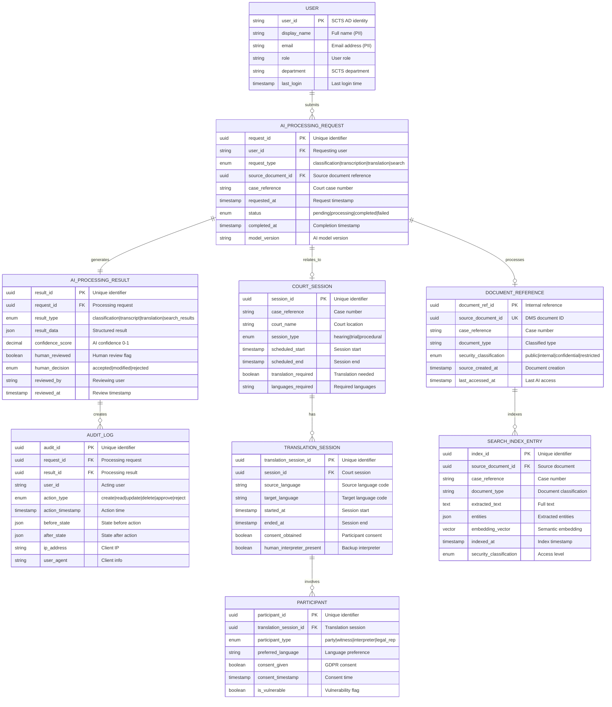

# Data Model: SCTS GenAI Programme

> **Template Status**: Live | **Version**: 0.11.2 | **Command**: `/arckit.data-model`

## Document Control

| Field | Value |
|-------|-------|
| **Document ID** | ARC-001-DATA-v1.1 |
| **Document Type** | Data Model |
| **Project** | SCTS GenAI Programme (Project 001) |
| **Classification** | OFFICIAL-SENSITIVE |
| **Status** | DRAFT |
| **Version** | 1.1 |
| **Created Date** | 2026-01-17 |
| **Last Modified** | 2026-01-27 |
| **Review Cycle** | Quarterly |
| **Next Review Date** | 2026-04-27 |
| **Owner** | Chief Digital Information Officer, SCTS |
| **Reviewed By** | PENDING |
| **Approved By** | PENDING |
| **Distribution** | Project Team, Architecture Board, Data Protection Officer |

## Revision History

| Version | Date | Author | Changes | Approved By | Approval Date |
|---------|------|--------|---------|-------------|---------------|
| 1.0 | 2026-01-17 | ArcKit AI | Initial creation from `/arckit.data-model` command | PENDING | PENDING |
| 1.1 | 2026-01-27 | ArcKit AI | Updated to template v0.11.2 format; added glossary | PENDING | PENDING |

---

## Executive Summary

### Overview

This data model defines the data entities, attributes, relationships, and governance requirements for the SCTS GenAI Programme. The model covers AI processing operations for document intelligence, speech transcription, translation services, and cognitive search across Scottish court documentation.

The model distinguishes between:
1. **Operational data** - AI processing requests, results, and audit trails created by the GenAI platform
2. **Referenced data** - Court documents, cases, and user identities managed by existing SCTS systems (not created by this system)
3. **Derived data** - Search indexes and embeddings derived from source documents

All personal data processing is subject to UK GDPR requirements, with special attention to court proceedings data which may contain sensitive information about parties, witnesses, and case details.

### Model Statistics

- **Total Entities**: 9 entities defined (E-001 through E-009)
- **Total Attributes**: 67 attributes across all entities
- **Total Relationships**: 9 relationships mapped
- **Data Classification**:
  - 🟢 Public: 0 entities
  - 🟡 Internal: 3 entities (AI operational data)
  - 🟠 Confidential: 5 entities (contain PII)
  - 🔴 Restricted: 1 entity (special category data - court proceedings with health/criminal data)

### Compliance Summary

- **GDPR/DPA 2018 Status**: NEEDS_DPIA
- **PII Entities**: 5 entities contain personally identifiable information
- **Special Category Data**: YES - Court proceedings may contain health data, criminal conviction data, racial/ethnic origin
- **Data Protection Impact Assessment (DPIA)**: REQUIRED
- **Data Retention**: 7 years (driven by court records retention requirements)
- **Cross-Border Transfers**: NO (UK data centres only - TC-4)

### Key Data Governance Stakeholders

- **Data Owner (Business)**: Chief Executive, SCTS - Accountable for data quality and usage
- **Data Steward**: Court Administration Manager - Responsible for data governance policies
- **Data Custodian (Technical)**: ICT Operations Manager - Manages data storage and security
- **Data Protection Officer**: DPO, SCTS - Ensures privacy compliance

---

## Visual Entity-Relationship Diagram (ERD)

---

## Entity Catalog

### Entity E-001: USER

**Description**: Reference to SCTS staff users who interact with the AI system. User identities are managed by SCTS Active Directory; this entity stores local AI system usage data.

**Source Requirements**:
- INT-003: Identity Provider Integration (SAML 2.0 SSO)
- NFR-SEC-002: Role-based access control

**Business Context**: Tracks which users submit AI processing requests and review AI outputs. Required for audit trail and accountability.

**Data Ownership**:
- **Business Owner**: HR Director - Accountable for user data accuracy
- **Technical Owner**: ICT Operations Manager - Maintains identity sync
- **Data Steward**: DPO - Privacy compliance

**Data Classification**: CONFIDENTIAL (contains PII)

**Volume Estimates**:
- **Initial Volume**: 500 users (court clerks, managers, administrators)
- **Growth Rate**: +50 users per year
- **Peak Volume**: 750 users at Year 3
- **Average Record Size**: 1 KB

**Data Retention**:
- **Active Period**: While employed at SCTS
- **Archive Period**: 7 years after last activity
- **Total Retention**: 7 years post-employment
- **Deletion Policy**: Anonymization after retention period

#### Attributes

| Attribute | Type | Required | PII | Description | Validation Rules | Default | Source Req |
|-----------|------|----------|-----|-------------|------------------|---------|------------|
| user_id | VARCHAR(100) | Yes | Yes | SCTS Active Directory identifier | AD format | None | INT-003 |
| display_name | VARCHAR(200) | Yes | Yes | Full name from AD | Non-empty | None | INT-003 |
| email | VARCHAR(255) | Yes | Yes | SCTS email address | RFC 5322 email format | None | INT-003 |
| role | VARCHAR(100) | Yes | No | User role (clerk, manager, etc.) | From approved list | 'clerk' | INT-003 |
| department | VARCHAR(100) | No | No | SCTS department | Free text | NULL | INT-003 |
| last_login | TIMESTAMP | Yes | No | Last system login | ISO 8601 | NOW() | System |
| created_at | TIMESTAMP | Yes | No | Record creation time | ISO 8601 | NOW() | System |
| updated_at | TIMESTAMP | Yes | No | Last update time | ISO 8601 | NOW() | System |

#### Privacy & Compliance

**GDPR/DPA 2018 Considerations**:
- **Contains PII**: YES
- **PII Attributes**: user_id, display_name, email
- **Legal Basis for Processing**: Public Task (GDPR Art 6(1)(e)) - SCTS statutory function
- **Data Subject Rights**:
  - **Right to Access**: Provide user records via SAR process
  - **Right to Rectification**: Updates via HR process (source is AD)
  - **Right to Erasure**: Anonymize after retention period (cannot delete during employment)
  - **Right to Portability**: Not applicable (employment context)
- **Data Breach Impact**: MEDIUM - Staff contact details, but not sensitive

---

### Entity E-002: AI_PROCESSING_REQUEST

**Description**: Record of each AI processing operation requested by a user. Core operational entity for tracking AI workload, performance, and audit.

**Source Requirements**:
- FR-001: Document Upload and Ingestion
- FR-002: AI Document Classification
- FR-004: Speech-to-Text Transcription
- FR-005: Real-Time Translation
- FR-007: Semantic Search
- FR-012: Audit Trail

**Business Context**: Central tracking for all AI operations. Links users to documents to AI outputs. Required for audit, performance monitoring, and model improvement.

**Data Ownership**:
- **Business Owner**: CDiO - Accountable for AI operations
- **Technical Owner**: Senior AI Technical Architect - Maintains processing pipeline
- **Data Steward**: Court Administration Manager - Operations governance

**Data Classification**: INTERNAL (operational data, references PII indirectly)

**Volume Estimates**:
- **Initial Volume**: 1,000 requests/day at go-live
- **Growth Rate**: +100% Year 1, +50% Year 2
- **Peak Volume**: 5,000 requests/day at Year 3
- **Average Record Size**: 0.5 KB

**Data Retention**:
- **Active Period**: 2 years in primary database
- **Archive Period**: 5 years in cold storage
- **Total Retention**: 7 years (audit compliance)
- **Deletion Policy**: Hard delete after 7 years

#### Attributes

| Attribute | Type | Required | PII | Description | Validation Rules | Default | Source Req |
|-----------|------|----------|-----|-------------|------------------|---------|------------|
| request_id | UUID | Yes | No | Unique identifier | UUID v4 format | Auto-generated | FR-012 |
| user_id | VARCHAR(100) | Yes | Yes | User who initiated request | FK to USER | None | FR-012 |
| request_type | ENUM | Yes | No | Type of AI operation | ['classification', 'transcription', 'translation', 'search'] | None | FR-001-007 |
| source_document_id | UUID | No | No | Reference to source document | FK to DMS | NULL | FR-001 |
| case_reference | VARCHAR(50) | No | No | Court case reference | Case number format | NULL | FR-001 |
| requested_at | TIMESTAMP | Yes | No | Request timestamp | ISO 8601, UTC | NOW() | FR-012 |
| status | ENUM | Yes | No | Processing status | ['pending', 'processing', 'completed', 'failed'] | 'pending' | FR-012 |
| completed_at | TIMESTAMP | No | No | Completion timestamp | ISO 8601, UTC | NULL | FR-012 |
| model_version | VARCHAR(50) | Yes | No | AI model version used | Semantic version | Config default | NFR-M-002 |
| error_message | TEXT | No | No | Error details if failed | Free text | NULL | System |

#### Privacy & Compliance

**GDPR/DPA 2018 Considerations**:
- **Contains PII**: YES (indirectly via user_id)
- **PII Attributes**: user_id (staff identifier)
- **Legal Basis for Processing**: Public Task (GDPR Art 6(1)(e)) - court administration
- **Data Breach Impact**: LOW - Operational metadata, not case content

---

### Entity E-003: AI_PROCESSING_RESULT

**Description**: Output from AI processing operations. Contains AI-generated classifications, transcriptions, translations, and search results.

**Source Requirements**:
- FR-002: AI Document Classification
- FR-003: Human Review and Override
- FR-004: Speech-to-Text Transcription
- FR-005: Real-Time Translation
- FR-011: AI Output Labelling
- FR-012: Audit Trail

**Business Context**: Stores AI outputs separately from authoritative court records (BR-003). Enables human review (FR-003), model improvement, and audit trail.

**Data Ownership**:
- **Business Owner**: CDiO - Accountable for AI outputs
- **Technical Owner**: Senior AI Technical Architect - Maintains output storage
- **Data Steward**: Legal Services Director - Legal accuracy governance

**Data Classification**: CONFIDENTIAL (may contain case information from transcription/translation)

**Volume Estimates**:
- **Initial Volume**: 1,000 results/day (1:1 with requests)
- **Growth Rate**: Matches requests
- **Peak Volume**: 5,000 results/day at Year 3
- **Average Record Size**: 5 KB (varies by type: search small, transcripts large)

**Data Retention**:
- **Active Period**: 2 years in primary database
- **Archive Period**: 5 years in cold storage
- **Total Retention**: 7 years (matches court record retention)
- **Deletion Policy**: Hard delete after 7 years

#### Attributes

| Attribute | Type | Required | PII | Description | Validation Rules | Default | Source Req |
|-----------|------|----------|-----|-------------|------------------|---------|------------|
| result_id | UUID | Yes | No | Unique identifier | UUID v4 format | Auto-generated | FR-012 |
| request_id | UUID | Yes | No | Link to processing request | FK to AI_PROCESSING_REQUEST | None | FR-012 |
| result_type | ENUM | Yes | No | Type of result | ['classification', 'transcript', 'translation', 'search_results'] | None | FR-002-007 |
| result_data | JSON | Yes | Yes | Structured result data | Schema per result_type | None | FR-002-005 |
| confidence_score | DECIMAL(3,2) | Yes | No | AI confidence | 0.00 - 1.00 | None | FR-002, FR-003 |
| human_reviewed | BOOLEAN | Yes | No | Whether human reviewed | true/false | false | FR-003 |
| human_decision | ENUM | No | No | Human override decision | ['accepted', 'modified', 'rejected'] | NULL | FR-003 |
| reviewed_by | VARCHAR(100) | No | Yes | User who reviewed | FK to USER | NULL | FR-003 |
| reviewed_at | TIMESTAMP | No | No | Review timestamp | ISO 8601, UTC | NULL | FR-003 |
| created_at | TIMESTAMP | Yes | No | Result creation time | ISO 8601, UTC | NOW() | System |

**Result Data Schemas** (stored in result_data JSON):

- **Classification**: `{ "document_type": "string", "entities": [...], "metadata": {...} }`
- **Transcript**: `{ "text": "string", "segments": [...], "speakers": [...] }`
- **Translation**: `{ "source_text": "string", "translated_text": "string", "terminology_flags": [...] }`
- **Search Results**: `{ "query": "string", "results": [...], "total_count": number }`

#### Privacy & Compliance

**GDPR/DPA 2018 Considerations**:
- **Contains PII**: YES (transcripts/translations may contain names, addresses, case details)
- **Special Category Data**: POSSIBLE (court proceedings may contain health data, criminal data)
- **PII Attributes**: result_data (content varies), reviewed_by
- **Legal Basis for Processing**: Public Task (GDPR Art 6(1)(e)) - court administration
- **Special Category Basis**: Substantial Public Interest (DPA 2018 Schedule 1, Part 2, Para 6 - administration of justice)
- **Data Breach Impact**: HIGH - May contain sensitive case content

---

### Entity E-004: DOCUMENT_REFERENCE

**Description**: Reference to documents in SCTS Document Management System (DMS). The AI system does not store documents; it stores references and metadata for processed documents.

**Source Requirements**:
- INT-002: Document Management System Integration
- FR-001: Document Upload and Ingestion
- FR-008: Document Indexing

**Business Context**: Links AI processing to source documents without duplicating court records. Maintains single source of truth in DMS.

**Data Classification**: INTERNAL (references only, not content)

**Volume Estimates**:
- **Initial Volume**: 50,000 document references (backfill)
- **Growth Rate**: +100,000 per year
- **Peak Volume**: 350,000 at Year 3
- **Average Record Size**: 0.3 KB

**Data Retention**:
- **Active Period**: Matches source document in DMS
- **Deletion Policy**: Cascade delete when source deleted from DMS

#### Attributes

| Attribute | Type | Required | PII | Description | Validation Rules | Default | Source Req |
|-----------|------|----------|-----|-------------|------------------|---------|------------|
| document_ref_id | UUID | Yes | No | Internal reference ID | UUID v4 format | Auto-generated | System |
| source_document_id | UUID | Yes | No | DMS document ID | FK to external DMS | None | INT-002 |
| case_reference | VARCHAR(50) | Yes | No | Court case reference | Case number format | None | INT-002 |
| document_type | VARCHAR(100) | Yes | No | Classified document type | From taxonomy | None | FR-002 |
| security_classification | ENUM | Yes | No | Access level | ['public', 'internal', 'confidential', 'restricted'] | None | INT-002 |
| source_created_at | TIMESTAMP | Yes | No | Document creation date | ISO 8601 | None | INT-002 |
| last_accessed_at | TIMESTAMP | Yes | No | Last AI access | ISO 8601 | NOW() | System |

#### Privacy & Compliance

- **Contains PII**: NO (reference only; actual document in DMS)
- **Data Breach Impact**: LOW - Metadata only

---

### Entity E-005: COURT_SESSION

**Description**: Reference to court session where AI translation services may be used. Enables scheduling of translation services and tracking of language requirements.

**Source Requirements**:
- INT-004: Court Scheduling System Integration
- FR-005: Real-Time Translation
- UC-2: Real-Time Translation in Court Proceedings

**Business Context**: Links translation services to court sessions. Required for planning interpreter backup and tracking translation usage.

**Data Classification**: CONFIDENTIAL (session scheduling is operational but references cases)

**Volume Estimates**:
- **Initial Volume**: 100 sessions/week using translation
- **Growth Rate**: +50% per year
- **Peak Volume**: 350 sessions/week at Year 3
- **Average Record Size**: 0.5 KB

**Data Retention**:
- **Active Period**: 2 years
- **Archive Period**: 5 years
- **Total Retention**: 7 years

#### Attributes

| Attribute | Type | Required | PII | Description | Validation Rules | Default | Source Req |
|-----------|------|----------|-----|-------------|------------------|---------|------------|
| session_id | UUID | Yes | No | Unique identifier | UUID v4 format | Auto-generated | System |
| case_reference | VARCHAR(50) | Yes | No | Court case reference | Case number format | None | INT-004 |
| court_name | VARCHAR(200) | Yes | No | Court location | From court list | None | INT-004 |
| session_type | ENUM | Yes | No | Type of session | ['hearing', 'trial', 'procedural', 'appeal'] | None | INT-004 |
| scheduled_start | TIMESTAMP | Yes | No | Session start time | ISO 8601 | None | INT-004 |
| scheduled_end | TIMESTAMP | Yes | No | Session end time | ISO 8601 | None | INT-004 |
| translation_required | BOOLEAN | Yes | No | Translation needed | true/false | false | FR-005 |
| languages_required | VARCHAR(500) | No | No | Required languages | Comma-separated codes | NULL | FR-006 |

#### Privacy & Compliance

- **Contains PII**: NO (case reference is not PII; session is operational)
- **Note**: Participant details in TRANSLATION_SESSION and PARTICIPANT entities

---

### Entity E-006: TRANSLATION_SESSION

**Description**: Records of AI translation sessions conducted during court proceedings. Tracks consent, languages, and human interpreter involvement.

**Source Requirements**:
- FR-005: Real-Time Translation
- FR-015: Consent Management
- BC-2: Human interpreters remain available

**Business Context**: Documents translation service usage, consent compliance, and human oversight for regulatory compliance.

**Data Classification**: CONFIDENTIAL (contains consent records)

**Volume Estimates**:
- **Initial Volume**: 100 sessions/week
- **Growth Rate**: +50% per year
- **Peak Volume**: 350 sessions/week at Year 3
- **Average Record Size**: 0.5 KB

**Data Retention**:
- **Active Period**: 2 years
- **Archive Period**: 5 years
- **Total Retention**: 7 years (GDPR consent records)

#### Attributes

| Attribute | Type | Required | PII | Description | Validation Rules | Default | Source Req |
|-----------|------|----------|-----|-------------|------------------|---------|------------|
| translation_session_id | UUID | Yes | No | Unique identifier | UUID v4 format | Auto-generated | System |
| session_id | UUID | Yes | No | Court session reference | FK to COURT_SESSION | None | FR-005 |
| source_language | VARCHAR(10) | Yes | No | Source language code | ISO 639-1 | None | FR-006 |
| target_language | VARCHAR(10) | Yes | No | Target language code | ISO 639-1 | None | FR-006 |
| started_at | TIMESTAMP | Yes | No | Session start | ISO 8601 | NOW() | System |
| ended_at | TIMESTAMP | No | No | Session end | ISO 8601 | NULL | System |
| consent_obtained | BOOLEAN | Yes | No | Participant consent flag | true/false | false | FR-015 |
| human_interpreter_present | BOOLEAN | Yes | No | Backup interpreter available | true/false | false | BC-2 |
| human_interpreter_used | BOOLEAN | No | No | Interpreter actually used | true/false | false | BC-2 |
| quality_score | DECIMAL(3,2) | No | No | Translation quality rating | 0.00-1.00 | NULL | NFR-P-001 |

#### Privacy & Compliance

- **Contains PII**: NO directly (participant details in PARTICIPANT entity)
- **Consent Records**: GDPR consent records for translation service usage

---

### Entity E-007: PARTICIPANT

**Description**: Records of participants in translation sessions. Stores consent, language preferences, and vulnerability flags for GDPR compliance.

**Source Requirements**:
- FR-015: Consent Management
- Stakeholder SD-11: Court user access to justice
- Stakeholder SD-12: Vulnerable witnesses/victims

**Business Context**: Tracks participant consent for AI translation. Identifies vulnerable participants requiring additional safeguards.

**Data Classification**: RESTRICTED (special category data - may indicate vulnerability, health, criminal case involvement)

**Volume Estimates**:
- **Initial Volume**: 200 participants/week
- **Growth Rate**: +50% per year
- **Peak Volume**: 700 participants/week at Year 3
- **Average Record Size**: 0.3 KB

**Data Retention**:
- **Active Period**: 2 years
- **Archive Period**: 5 years
- **Total Retention**: 7 years (GDPR consent records)

#### Attributes

| Attribute | Type | Required | PII | Description | Validation Rules | Default | Source Req |
|-----------|------|----------|-----|-------------|------------------|---------|------------|
| participant_id | UUID | Yes | No | Unique identifier | UUID v4 format | Auto-generated | System |
| translation_session_id | UUID | Yes | No | Translation session | FK to TRANSLATION_SESSION | None | System |
| participant_type | ENUM | Yes | No | Role in proceedings | ['party', 'witness', 'victim', 'interpreter', 'legal_rep', 'other'] | None | System |
| participant_reference | VARCHAR(100) | No | Yes | Reference to party (anonymized) | Case party reference | NULL | System |
| preferred_language | VARCHAR(10) | Yes | No | Language preference | ISO 639-1 | None | FR-006 |
| consent_given | BOOLEAN | Yes | No | GDPR consent | true/false | false | FR-015 |
| consent_timestamp | TIMESTAMP | No | No | Consent timestamp | ISO 8601 | NULL | FR-015 |
| consent_method | ENUM | No | No | How consent obtained | ['verbal', 'written', 'digital'] | NULL | FR-015 |
| is_vulnerable | BOOLEAN | Yes | No | Vulnerability flag | true/false | false | SD-12 |
| vulnerability_type | VARCHAR(100) | No | Yes | Type of vulnerability | From approved list | NULL | SD-12 |
| additional_support_required | TEXT | No | No | Support requirements | Free text | NULL | SD-12 |

#### Privacy & Compliance

**GDPR/DPA 2018 Considerations**:
- **Contains PII**: YES
- **Special Category Data**: YES (vulnerability may indicate health, disability)
- **PII Attributes**: participant_reference, vulnerability_type
- **Legal Basis for Processing**: Public Task (GDPR Art 6(1)(e)) - administration of justice
- **Special Category Basis**: Substantial Public Interest - administration of justice (DPA 2018 Schedule 1, Part 2, Para 6)
- **Data Subject Rights**:
  - **Right to Access**: Provide participant records via SAR
  - **Right to Erasure**: Anonymize after retention period
- **Data Breach Impact**: VERY HIGH - Sensitive information about vulnerable court participants

---

### Entity E-008: AUDIT_LOG

**Description**: Immutable audit trail of all AI system operations for compliance, security, and accountability.

**Source Requirements**:
- FR-012: Audit Trail
- NFR-C-002: Comprehensive audit logging
- BR-003: Court record integrity

**Business Context**: Provides complete audit trail for regulatory compliance (ICO, Scottish Government), security investigations, and accountability (Principle 8 - AI Transparency).

**Data Classification**: INTERNAL (operational audit data)

**Volume Estimates**:
- **Initial Volume**: 10,000 log entries/day
- **Growth Rate**: +100% per year
- **Peak Volume**: 50,000 entries/day at Year 3
- **Average Record Size**: 1 KB

**Data Retention**:
- **Active Period**: 1 year in primary (fast query)
- **Archive Period**: 6 years in cold storage
- **Total Retention**: 7 years (audit compliance)
- **Deletion Policy**: Hard delete after 7 years

#### Attributes

| Attribute | Type | Required | PII | Description | Validation Rules | Default | Source Req |
|-----------|------|----------|-----|-------------|------------------|---------|------------|
| audit_id | UUID | Yes | No | Unique identifier | UUID v4 format | Auto-generated | FR-012 |
| request_id | UUID | No | No | Processing request | FK to AI_PROCESSING_REQUEST | NULL | FR-012 |
| result_id | UUID | No | No | Processing result | FK to AI_PROCESSING_RESULT | NULL | FR-012 |
| user_id | VARCHAR(100) | Yes | Yes | Acting user | FK to USER | None | FR-012 |
| action_type | ENUM | Yes | No | Type of action | ['create', 'read', 'update', 'delete', 'approve', 'reject', 'search', 'export'] | None | FR-012 |
| action_timestamp | TIMESTAMP | Yes | No | Action timestamp | ISO 8601, UTC | NOW() | FR-012 |
| resource_type | VARCHAR(100) | Yes | No | Resource type | Entity name | None | FR-012 |
| resource_id | UUID | No | No | Resource identifier | FK varies | NULL | FR-012 |
| before_state | JSON | No | Yes | State before action | JSON snapshot | NULL | FR-012 |
| after_state | JSON | No | Yes | State after action | JSON snapshot | NULL | FR-012 |
| ip_address | VARCHAR(45) | No | No | Client IP address | IPv4 or IPv6 | NULL | NFR-SEC-002 |
| user_agent | VARCHAR(500) | No | No | Client information | Free text | NULL | NFR-SEC-002 |
| success | BOOLEAN | Yes | No | Action succeeded | true/false | true | FR-012 |
| error_details | TEXT | No | No | Error if failed | Free text | NULL | FR-012 |

#### Privacy & Compliance

- **Contains PII**: YES (user_id, before/after state may contain case data)
- **Legal Basis**: Legal Obligation (GDPR Art 6(1)(c)) - audit requirements
- **Data Breach Impact**: MEDIUM - Audit metadata, some case context in state snapshots

---

### Entity E-009: SEARCH_INDEX_ENTRY

**Description**: Derived data entity for cognitive search. Contains indexed text and semantic embeddings from source documents.

**Source Requirements**:
- FR-007: Semantic Search
- FR-008: Document Indexing
- FR-009: Case Law Citation Detection

**Business Context**: Enables semantic search across court documents. Derived from source documents in DMS; not authoritative data.

**Data Classification**: Matches source document classification

**Volume Estimates**:
- **Initial Volume**: 50,000 entries (2-year backfill)
- **Growth Rate**: +100,000 per year
- **Peak Volume**: 350,000 entries at Year 3
- **Average Record Size**: 50 KB (includes embedding vector)

**Data Retention**:
- **Active Period**: Matches source document
- **Deletion Policy**: Cascade delete when source deleted from DMS

#### Attributes

| Attribute | Type | Required | PII | Description | Validation Rules | Default | Source Req |
|-----------|------|----------|-----|-------------|------------------|---------|------------|
| index_id | UUID | Yes | No | Unique identifier | UUID v4 format | Auto-generated | FR-008 |
| source_document_id | UUID | Yes | No | Source document | FK to DMS | None | FR-008 |
| case_reference | VARCHAR(50) | Yes | No | Court case reference | Case number format | None | FR-008 |
| document_type | VARCHAR(100) | Yes | No | Document classification | From taxonomy | None | FR-002 |
| extracted_text | TEXT | Yes | Yes | Full document text | Non-empty | None | FR-008 |
| entities | JSON | No | Yes | Extracted entities | Entity schema | NULL | FR-002 |
| citations | JSON | No | No | Case law citations | Citation schema | NULL | FR-009 |
| embedding_vector | VECTOR(1536) | Yes | No | Semantic embedding | 1536 dimensions | None | FR-007 |
| indexed_at | TIMESTAMP | Yes | No | Index timestamp | ISO 8601 | NOW() | FR-008 |
| source_modified_at | TIMESTAMP | Yes | No | Source modification date | ISO 8601 | None | FR-008 |
| security_classification | ENUM | Yes | No | Access level | ['public', 'internal', 'confidential', 'restricted'] | None | INT-002 |

#### Privacy & Compliance

- **Contains PII**: YES (extracted text from court documents contains case information)
- **Legal Basis**: Public Task (GDPR Art 6(1)(e)) - court administration
- **Data Breach Impact**: Matches source document (HIGH for restricted)

---

## Data Governance Matrix

| Entity | Business Owner | Data Steward | Technical Custodian | Sensitivity | Compliance | Quality SLA | Access Control |
|--------|----------------|--------------|---------------------|-------------|------------|-------------|----------------|
| E-001: USER | HR Director | DPO | ICT Ops | CONFIDENTIAL | GDPR | 99% accuracy | Admin, HR |
| E-002: AI_PROCESSING_REQUEST | CDiO | Court Admin Mgr | AI Architect | INTERNAL | GDPR, Audit | 99.9% completeness | All authenticated |
| E-003: AI_PROCESSING_RESULT | CDiO | Legal Services | AI Architect | CONFIDENTIAL | GDPR, Court records | 90% accuracy | Clerks, Managers |
| E-004: DOCUMENT_REFERENCE | CDiO | Court Admin Mgr | ICT Ops | INTERNAL | None | 100% integrity | All authenticated |
| E-005: COURT_SESSION | Chief Exec | Court Admin Mgr | ICT Ops | CONFIDENTIAL | None | 99% accuracy | Operations staff |
| E-006: TRANSLATION_SESSION | CDiO | DPO | AI Architect | CONFIDENTIAL | GDPR consent | 100% consent | Clerks, Interpreters |
| E-007: PARTICIPANT | DPO | DPO | AI Architect | RESTRICTED | GDPR Art 9 | 100% consent | DPO, Clerks |
| E-008: AUDIT_LOG | CDiO | DPO | ICT Ops | INTERNAL | Audit, GDPR | Immutable | Security, Auditors |
| E-009: SEARCH_INDEX_ENTRY | CDiO | Court Admin Mgr | AI Architect | Varies | GDPR | 15-min sync | Per source doc |

---

## CRUD Matrix

| Entity | AI Platform | Admin Portal | Reporting | Case Mgmt Integration | Batch Jobs | Search API |
|--------|-------------|--------------|-----------|----------------------|------------|------------|
| E-001: USER | -R-- | -RU- | -R-- | CR-- | --U- | ---- |
| E-002: AI_PROCESSING_REQUEST | CR-- | -R-- | -R-- | ---- | ---- | ---- |
| E-003: AI_PROCESSING_RESULT | CRU- | -RU- | -R-- | ---- | ---- | ---- |
| E-004: DOCUMENT_REFERENCE | CR-- | -R-- | -R-- | CR-- | --U- | ---- |
| E-005: COURT_SESSION | CR-- | -R-- | -R-- | CR-- | --U- | ---- |
| E-006: TRANSLATION_SESSION | CRUD | -RU- | -R-- | ---- | ---- | ---- |
| E-007: PARTICIPANT | CRUD | -RU- | -R-- | ---- | ---D | ---- |
| E-008: AUDIT_LOG | C--- | -R-- | -R-- | ---- | ---- | ---- |
| E-009: SEARCH_INDEX_ENTRY | CRU- | -R-- | -R-- | ---- | CRUD | -R-- |

**Legend**: C = Create, R = Read, U = Update, D = Delete, - = No access

---

## Privacy & Compliance

### GDPR / UK Data Protection Act 2018 Compliance

#### PII Inventory

**Entities Containing PII**:
- **E-001 (USER)**: user_id, display_name, email
- **E-003 (AI_PROCESSING_RESULT)**: result_data (transcripts, translations contain case information)
- **E-007 (PARTICIPANT)**: participant_reference, vulnerability_type
- **E-008 (AUDIT_LOG)**: user_id, before_state, after_state
- **E-009 (SEARCH_INDEX_ENTRY)**: extracted_text, entities

**Total PII Attributes**: 15 attributes across 5 entities

**Special Category Data** (GDPR Article 9):
- **Health data**: Court proceedings may reference health conditions (E-003, E-007, E-009)
- **Criminal conviction data**: Criminal case proceedings (E-003, E-009)
- **Racial/ethnic origin**: May appear in case content (E-003, E-009)
- **Religious beliefs**: May appear in case content (E-003, E-009)

#### Legal Basis for Processing

| Entity | Purpose | Legal Basis | Notes |
|--------|---------|-------------|-------|
| E-001: USER | User authentication and audit | Public Task (Art 6(1)(e)) | SCTS statutory function |
| E-002: AI_PROCESSING_REQUEST | AI operation tracking | Public Task (Art 6(1)(e)) | Court administration |
| E-003: AI_PROCESSING_RESULT | AI output storage | Public Task (Art 6(1)(e)) + Substantial Public Interest | Administration of justice |
| E-006: TRANSLATION_SESSION | Consent tracking | Consent (Art 6(1)(a)) | Explicit consent for translation |
| E-007: PARTICIPANT | Participant safeguards | Public Task + Substantial Public Interest | Vulnerable person safeguards |
| E-008: AUDIT_LOG | Regulatory compliance | Legal Obligation (Art 6(1)(c)) | Audit requirements |
| E-009: SEARCH_INDEX_ENTRY | Search functionality | Public Task (Art 6(1)(e)) | Court administration |

#### Special Category Data Basis (Article 9)

For processing special category data (health, criminal, ethnic origin):

**Basis**: DPA 2018 Schedule 1, Part 2, Paragraph 6 - **Administration of Justice**

This condition permits processing where:
- Processing is necessary for the administration of justice
- The controller is a court or tribunal
- The processing is necessary for the exercise of functions of a court or tribunal

SCTS qualifies under this condition as it is the administrative body for Scottish courts and tribunals.

#### Data Subject Rights Implementation

| Right | Applicable Entities | Implementation | Response Time |
|-------|---------------------|----------------|---------------|
| Right to Access (SAR) | All with PII | DPO coordinated SAR process | 30 days |
| Right to Rectification | E-001, E-007 | Via admin portal | 30 days |
| Right to Erasure | E-007, E-008 (logs) | Anonymization after retention | 30 days |
| Right to Restriction | E-003, E-007 | Processing restriction flag | 72 hours |
| Right to Portability | Not applicable | Court records context | N/A |
| Right to Object | E-007 (translation) | Opt-out of AI translation | Immediate |

#### Data Retention Schedule

| Entity | Active Retention | Archive Retention | Total Retention | Legal Basis | Deletion Method |
|--------|------------------|-------------------|-----------------|-------------|-----------------|
| E-001: USER | Employment + 2 years | 5 years | 7 years | Employment records | Anonymize |
| E-002: AI_PROCESSING_REQUEST | 2 years | 5 years | 7 years | Audit compliance | Hard delete |
| E-003: AI_PROCESSING_RESULT | 2 years | 5 years | 7 years | Court records | Hard delete |
| E-005: COURT_SESSION | 2 years | 5 years | 7 years | Scheduling records | Hard delete |
| E-006: TRANSLATION_SESSION | 2 years | 5 years | 7 years | GDPR consent records | Hard delete |
| E-007: PARTICIPANT | 2 years | 5 years | 7 years | GDPR consent records | Anonymize |
| E-008: AUDIT_LOG | 1 year | 6 years | 7 years | Audit compliance | Hard delete |
| E-009: SEARCH_INDEX_ENTRY | Matches source | N/A | Matches source | Derived data | Cascade delete |

#### Cross-Border Data Transfers

**Data Locations**:
- **Primary Database**: UK (Azure UK South)
- **Backup Storage**: UK (Azure UK West)
- **AI Processing**: UK (Azure UK regions only - TC-4)

**International Transfers**: NONE

All data processing occurs within UK data centres as per requirement TC-4 (UK data residency). No cross-border transfers occur.

#### Data Protection Impact Assessment (DPIA)

**DPIA Required**: YES

**Triggers for DPIA** (GDPR Article 35):
- [x] Processing special category data (health, criminal, ethnic in court proceedings)
- [x] Large scale processing (500K+ documents, 10,000+ data subjects)
- [x] Innovative technology (AI/ML processing)
- [x] Vulnerable data subjects (witnesses, victims, non-English speakers)
- [x] Systematic monitoring (continuous transcription/translation)

**DPIA Status**: IN_PROGRESS

---

## Requirements Traceability

| Requirement ID | Requirement Description | Entity | Attributes | Status |
|----------------|------------------------|--------|------------|--------|
| FR-001 | Document Upload and Ingestion | E-002, E-004 | request_type, source_document_id | ✅ Implemented |
| FR-002 | AI Document Classification | E-003 | result_type, result_data, confidence_score | ✅ Implemented |
| FR-003 | Human Review and Override | E-003 | human_reviewed, human_decision, reviewed_by | ✅ Implemented |
| FR-004 | Speech-to-Text Transcription | E-002, E-003 | request_type='transcription', result_data | ✅ Implemented |
| FR-005 | Real-Time Translation | E-006 | source_language, target_language | ✅ Implemented |
| FR-007 | Semantic Search | E-009 | embedding_vector, extracted_text | ✅ Implemented |
| FR-008 | Document Indexing | E-009 | All attributes | ✅ Implemented |
| FR-009 | Case Law Citation Detection | E-009 | citations | ✅ Implemented |
| FR-011 | AI Output Labelling | E-003 | confidence_score, model_version | ✅ Implemented |
| FR-012 | Audit Trail | E-008 | All attributes | ✅ Implemented |
| FR-015 | Consent Management | E-006, E-007 | consent_given, consent_timestamp | ✅ Implemented |
| INT-002 | DMS Integration | E-004 | source_document_id | ✅ Implemented |
| INT-003 | Identity Provider | E-001 | user_id, role | ✅ Implemented |
| INT-004 | Court Scheduling | E-005 | session_id, case_reference | ✅ Implemented |
| NFR-SEC-002 | Access Control | E-008 | ip_address, user_agent | ✅ Implemented |
| NFR-C-002 | Audit Logging | E-008 | All audit attributes | ✅ Implemented |

**Coverage Summary**:
- **Total Data Requirements**: 16 mapped
- **Requirements Modeled**: 16 (100%)
- **Coverage**: 100%

---

## Appendix A: Glossary

| Term | Definition |
|------|------------|
| **AD** | Active Directory - Microsoft directory service for identity management |
| **ACID** | Atomicity, Consistency, Isolation, Durability - Database transaction properties |
| **CDiO** | Chief Digital Information Officer |
| **CRUD** | Create, Read, Update, Delete - Basic data operations |
| **DMS** | Document Management System |
| **DPA 2018** | Data Protection Act 2018 - UK implementation of GDPR |
| **DPIA** | Data Protection Impact Assessment - Risk assessment for data processing |
| **DPO** | Data Protection Officer |
| **ERD** | Entity-Relationship Diagram |
| **FK** | Foreign Key - Database reference to another table |
| **GDPR** | General Data Protection Regulation - EU/UK data protection law |
| **ICO** | Information Commissioner's Office - UK data protection regulator |
| **ISO 639-1** | Two-letter language codes (e.g., en, cy, gd) |
| **ISO 8601** | International date/time format standard |
| **JSON** | JavaScript Object Notation - Data interchange format |
| **PII** | Personally Identifiable Information |
| **PK** | Primary Key - Unique identifier in database |
| **RFC 5322** | Email format standard |
| **RPO** | Recovery Point Objective - Maximum acceptable data loss |
| **RTO** | Recovery Time Objective - Maximum acceptable downtime |
| **SAML** | Security Assertion Markup Language - SSO authentication protocol |
| **SAR** | Subject Access Request - GDPR right to access personal data |
| **SCTS** | Scottish Courts and Tribunals Service |
| **SSO** | Single Sign-On |
| **UK** | Unique Key - Database constraint for uniqueness |
| **UTC** | Coordinated Universal Time |
| **UUID** | Universally Unique Identifier |

---

**Generated by**: ArcKit `/arckit.data-model` command
**Generated on**: 2026-01-27
**ArcKit Version**: 0.11.2
**Project**: SCTS GenAI Programme (Project 001)
**Model**: Claude Opus 4.5
