# DevOps Strategy: SCTS GenAI Programme

> **Template Status**: Experimental | **Version**: 0.11.2 | **Command**: `/arckit.devops`

## Document Control

| Field | Value |
|-------|-------|
| **Document ID** | ARC-001-DEVOPS-v1.2 |
| **Document Type** | DevOps Strategy |
| **Project** | SCTS GenAI Programme (Project 001) |
| **Classification** | OFFICIAL |
| **Status** | DRAFT |
| **Version** | 1.2 |
| **Created Date** | 2026-01-20 |
| **Last Modified** | 2026-01-29 |
| **Review Cycle** | Quarterly |
| **Next Review Date** | 2026-04-27 |
| **Owner** | Senior AI Technical Architect, SCTS |
| **Reviewed By** | PENDING |
| **Approved By** | PENDING |
| **Distribution** | Platform Team, Development Teams, Security Team, ICT Operations |

## Revision History

| Version | Date | Author | Changes | Approved By | Approval Date |
|---------|------|--------|---------|-------------|---------------|
| 1.0 | 2026-01-20 | ArcKit AI | Initial creation from `/arckit.devops` command | PENDING | PENDING |
| 1.1 | 2026-01-27 | ArcKit AI | Updated to template v0.11.2 format; added glossary | PENDING | PENDING |
| 1.2 | 2026-01-29 | ArcKit AI | Updated to align with Azure Research (ARC-001-AZRS-v1.0); added Azure AI services deployment | PENDING | PENDING |

---

## Executive Summary

### DevOps Vision

This DevOps strategy establishes the engineering practices, tooling, and automation for the SCTS GenAI Programme. It enables rapid, reliable delivery of AI capabilities while meeting UK Government compliance requirements and maintaining the security posture appropriate for court systems processing sensitive data.

### DevOps Maturity Assessment

| Level | Current | Target (12 months) |
|-------|---------|-------------------|
| **Level 1** - Manual builds | ❌ | ❌ |
| **Level 2** - CI automation | ❌ | ❌ |
| **Level 3** - CI/CD automation | ✅ Starting | ❌ |
| **Level 4** - Continuous deployment | ❌ | ✅ Target |
| **Level 5** - GitOps platform | ❌ | Partial |

**Current State:** Level 3 (CI/CD automation with staging gates)
**Target State:** Level 4 (Continuous deployment with feature flags) within 12 months

### Technology Stack Overview

> **Reference**: See [Azure Technology Research (ARC-001-AZRS-v1.0)](research/ARC-001-AZRS-v1.0.md) for detailed Azure service analysis, pricing, and Well-Architected assessment.

| Layer | Technology | Rationale |
|-------|------------|-----------|
| **Source Control** | Azure DevOps Git | Existing SCTS tooling, integration with Azure |
| **CI/CD Platform** | Azure DevOps Pipelines | Native Azure integration, compliance features |
| **Container Registry** | Azure Container Registry (ACR) | UK region, vulnerability scanning |
| **Container Orchestration** | Azure Kubernetes Service (AKS) | Managed K8s, Azure integration |
| **Infrastructure as Code** | Terraform | Multi-cloud capable, state management |
| **Secret Management** | Azure Key Vault | HSM-backed, FIPS 140-2 compliant |
| **GitOps** | ArgoCD | Declarative deployments, audit trail |
| **Monitoring** | Azure Monitor + Prometheus | Native + OSS flexibility |

### Azure AI Services (from ARC-001-AZRS-v1.0)

| Service | Purpose | Tier | Monthly Est. |
|---------|---------|------|--------------|
| Azure AI Document Intelligence | Document classification & extraction | S0 | £2,363 |
| Azure AI Speech | Real-time transcription & diarisation | S0 | £1,020 |
| Azure AI Translator | Multi-language translation (10 languages) | S1 | £484 |
| Azure AI Search | Semantic search & knowledge mining | S1 + replica | £470 |
| Microsoft Entra ID | Identity & SSO | P1 | £600 |
| Azure Key Vault | Secrets & certificates | Standard | £10 |
| Azure Monitor | Logging, metrics, alerts | Standard | £200 |
| **Total Infrastructure** | | | **£5,702/month** |

### Key Metrics Targets

| Metric | Current | Target | Timeline |
|--------|---------|--------|----------|
| **Deployment Frequency** | N/A | Weekly (prod) | 6 months |
| **Lead Time for Changes** | N/A | < 1 week | 6 months |
| **Mean Time to Recovery** | N/A | < 1 hour | 6 months |
| **Change Failure Rate** | N/A | < 5% | 6 months |
| **Build Time** | N/A | < 10 minutes | 3 months |
| **Test Coverage** | N/A | > 80% | 6 months |

---

## 1. DevOps Overview

### 1.1 Strategic Objectives

| Objective | Description | Success Measure |
|-----------|-------------|-----------------|
| **Rapid Delivery** | Enable frequent, reliable releases | Weekly production deployments |
| **Quality Assurance** | Automated testing at all stages | >80% test coverage, <5% defect escape |
| **Security Integration** | Shift-left security scanning | Zero critical vulnerabilities in production |
| **Compliance** | Automated compliance verification | 100% policy compliance in deployments |
| **Observability** | Full visibility into system health | MTTR < 1 hour |
| **Cost Efficiency** | Optimise cloud spend | <10% variance from budget |

### 1.2 Team Structure

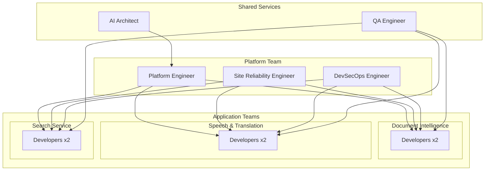

### 1.3 Key Stakeholders

| Stakeholder | Role in DevOps | Responsibilities |
|-------------|---------------|------------------|
| CDiO | Executive Sponsor | Budget approval, strategic direction |
| AI Architect | Technical Lead | Architecture decisions, standards |
| Platform Team | Platform Engineering | CI/CD, infrastructure, tooling |
| Development Teams | Application Delivery | Feature development, testing |
| Security Team | Security Oversight | Policy, scanning, incident response |
| ICT Operations | Production Support | Monitoring, incident management |

---

## 2. Source Control Strategy

### 2.1 Repository Structure

**Decision:** Multi-repo with shared libraries

```
scts-genai/
├── scts-genai-platform/          # Infrastructure as Code
│   ├── terraform/
│   ├── kubernetes/
│   └── scripts/
├── scts-genai-document-service/   # Document Intelligence microservice
├── scts-genai-speech-service/     # Speech & Translation microservice
├── scts-genai-search-service/     # Cognitive Search microservice
├── scts-genai-audit-service/      # Audit logging microservice
├── scts-genai-web/                # React frontend
├── scts-genai-shared/             # Shared libraries (Python)
└── scts-genai-docs/               # Documentation
```

### 2.2 Branching Strategy

**Decision:** Trunk-Based Development with short-lived feature branches

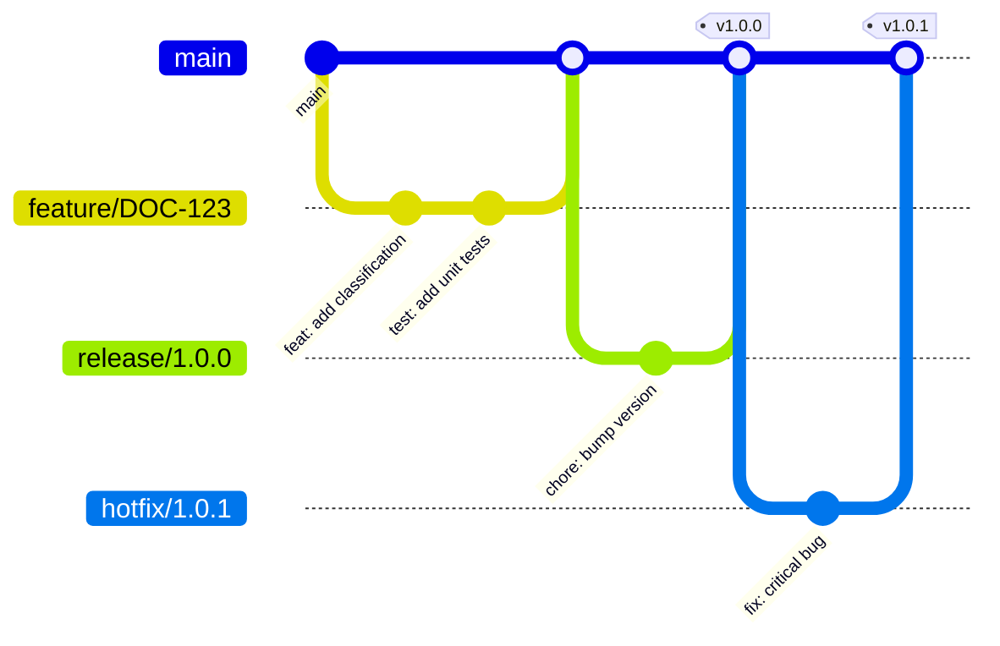

**Branch Types:**

| Branch Type | Pattern | Lifetime | Purpose |
|-------------|---------|----------|---------|
| `main` | `main` | Permanent | Production-ready code |
| `feature/*` | `feature/JIRA-123-description` | 1-3 days | New features |
| `bugfix/*` | `bugfix/JIRA-456-description` | 1-2 days | Bug fixes |
| `release/*` | `release/1.0.0` | 1 week max | Release preparation |
| `hotfix/*` | `hotfix/1.0.1` | < 1 day | Production fixes |

### 2.3 Code Review Process

| Stage | Requirement | Enforced By |
|-------|-------------|-------------|
| **PR Created** | Description, linked work item | Branch policy |
| **Automated Checks** | Build, test, lint, security scan | Pipeline |
| **Code Review** | 2 approvers (1 senior for security-sensitive) | Branch policy |
| **Approval** | All checks passed, no unresolved comments | Branch policy |
| **Merge** | Squash merge to main | Branch policy |

### 2.4 Protected Branches

| Branch | Protection Rules |
|--------|------------------|
| `main` | Require PR, 2 approvers, CI passed, no force push |
| `release/*` | Require PR, 2 approvers, release manager approval |

### 2.5 Commit Conventions

**Format:** [Conventional Commits](https://www.conventionalcommits.org/)

```
<type>(<scope>): <description>

[optional body]

[optional footer(s)]
```

**Types:**
- `feat`: New feature
- `fix`: Bug fix
- `docs`: Documentation
- `style`: Formatting
- `refactor`: Code refactoring
- `test`: Tests
- `chore`: Build/tooling
- `security`: Security fix

**Example:**
```
feat(document-service): add PDF classification support

Implements Azure Document Intelligence integration for PDF documents.
Includes OCR preprocessing for scanned documents.

Closes SCTS-123
```

---

## 3. CI Pipeline Design

### 3.1 Pipeline Architecture

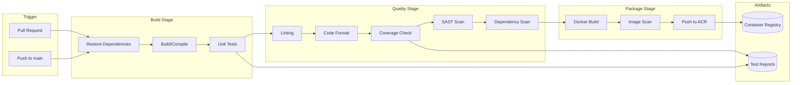

### 3.2 Build Automation

**Build Configuration (Python Services):**

```yaml
# azure-pipelines-ci.yml
trigger:
  branches:
    include:
      - main
      - feature/*
      - bugfix/*

pool:
  vmImage: 'ubuntu-latest'

variables:
  pythonVersion: '3.11'
  dockerRegistry: 'sctsgenai.azurecr.io'

stages:
  - stage: Build
    jobs:
      - job: BuildAndTest
        steps:
          - task: UsePythonVersion@0
            inputs:
              versionSpec: '$(pythonVersion)'

          - script: |
              pip install poetry
              poetry install
            displayName: 'Install dependencies'

          - script: |
              poetry run pytest --cov=src --cov-report=xml
            displayName: 'Run unit tests'

          - task: PublishTestResults@2
            inputs:
              testResultsFiles: '**/test-*.xml'

          - task: PublishCodeCoverageResults@1
            inputs:
              codeCoverageTool: 'Cobertura'
              summaryFileLocation: 'coverage.xml'
```

### 3.3 Testing Strategy

| Test Type | When | Tools | Target |
|-----------|------|-------|--------|
| **Unit Tests** | Every commit | pytest, Jest | >80% coverage |
| **Integration Tests** | PR merge | pytest, testcontainers | Key integrations |
| **Contract Tests** | PR merge | Pact | API contracts |
| **E2E Tests** | Pre-deploy | Playwright | Critical paths |
| **Performance Tests** | Weekly | Locust | NFR-P targets |

**Coverage Requirements:**

| Service | Minimum Coverage | Critical Paths |
|---------|------------------|----------------|
| Document Service | 85% | Classification, validation |
| Speech Service | 80% | Transcription, translation |
| Search Service | 80% | Query execution, indexing |
| Audit Service | 90% | Logging, integrity |
| Web Application | 75% | User workflows |

### 3.4 Code Quality Gates

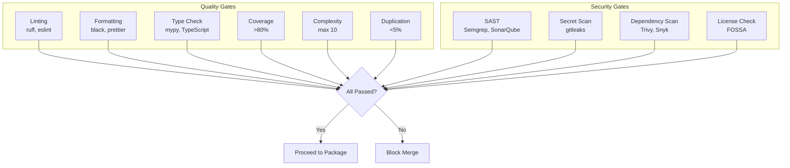

**Quality Thresholds:**

| Gate | Tool | Threshold | Action if Failed |
|------|------|-----------|------------------|
| Linting | ruff (Python), ESLint (JS) | Zero errors | Block merge |
| Formatting | black (Python), Prettier (JS) | 100% formatted | Block merge |
| Type Checking | mypy, TypeScript | Zero errors | Block merge |
| Test Coverage | pytest-cov | ≥80% | Block merge |
| Cyclomatic Complexity | radon | ≤10 per function | Warning (≤15 block) |
| Code Duplication | SonarQube | ≤5% | Warning |

### 3.5 Security Scanning

**SAST (Static Application Security Testing):**

| Tool | Scope | Frequency | Blocking |
|------|-------|-----------|----------|
| SonarQube | Code quality + security | Every commit | Critical/High |
| Semgrep | Security patterns | Every commit | Critical |
| Bandit | Python security | Every commit | High+ |
| gitleaks | Secrets detection | Every commit | Any finding |

**Dependency Scanning:**

| Tool | Scope | Frequency | Blocking |
|------|-------|-----------|----------|
| Trivy | Container images | Every build | Critical/High |
| Snyk | Dependencies | Every commit | Critical |
| OWASP Dependency-Check | CVE database | Daily | Critical |

**Remediation SLAs (from NFR-SEC-005):**

| Severity | Remediation Window | Escalation |
|----------|-------------------|------------|
| Critical | 24 hours | Immediate to Security Lead |
| High | 7 days | Daily standup |
| Medium | 30 days | Sprint planning |
| Low | 90 days | Backlog |

### 3.6 Artifact Management

**Container Images:**

```
sctsgenai.azurecr.io/
├── document-service:1.0.0
├── document-service:1.0.0-sha-abc123
├── speech-service:1.0.0
├── search-service:1.0.0
├── audit-service:1.0.0
└── web-app:1.0.0
```

**Tagging Strategy:**

| Tag Type | Format | Example | Use Case |
|----------|--------|---------|----------|
| Release | `vX.Y.Z` | `v1.2.3` | Production releases |
| SHA | `sha-<short>` | `sha-abc1234` | Traceability |
| Branch | `branch-<name>` | `branch-main` | Development |
| Latest | `latest` | `latest` | Non-production only |

**Retention Policy:**

| Environment | Retention |
|-------------|-----------|
| Production tags | Indefinite |
| Development tags | 30 days |
| Feature branches | 7 days |
| Untagged images | 3 days |

---

## 4. CD Pipeline Design

### 4.1 Deployment Pipeline

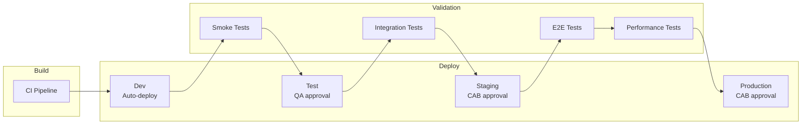

### 4.2 Environment Promotion

| Environment | Trigger | Approval | SLA |
|-------------|---------|----------|-----|
| **Development** | Push to main | Automatic | Immediate |
| **Test** | Dev success | QA Lead | < 4 hours |
| **Staging** | Test success | Tech Lead | < 24 hours |
| **Production** | Staging success | CAB | Weekly window |

### 4.3 Deployment Strategies

**Primary Strategy:** Blue-Green Deployment

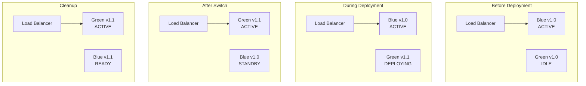

**Canary Deployment (for high-risk changes):**

| Phase | Traffic Split | Duration | Criteria |
|-------|---------------|----------|----------|
| Phase 1 | 5% canary | 30 mins | Error rate < 1% |
| Phase 2 | 25% canary | 1 hour | Error rate < 1%, latency p95 < target |
| Phase 3 | 50% canary | 2 hours | All metrics within SLO |
| Phase 4 | 100% canary | Complete | Full rollout |

### 4.4 Approval Gates

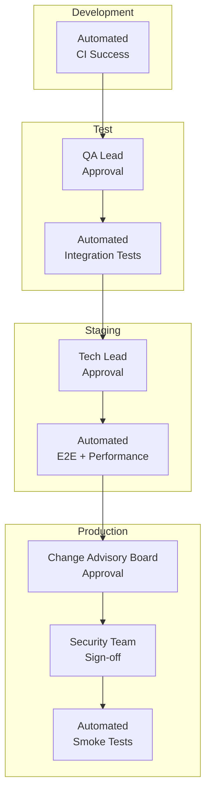

**Production Approval Requirements:**

| Check | Approver | Required For |
|-------|----------|--------------|
| Technical review | Tech Lead | All changes |
| Security review | Security Team | Security-sensitive changes |
| CAB approval | Change Advisory Board | All production changes |
| SIRO approval | SIRO | Data schema changes |

### 4.5 Rollback Procedures

**Automatic Rollback Triggers:**

| Metric | Threshold | Action |
|--------|-----------|--------|
| Error rate | >5% for 5 mins | Auto-rollback |
| Latency p95 | >3x baseline for 5 mins | Auto-rollback |
| Health checks | 3 consecutive failures | Auto-rollback |
| CPU/Memory | >90% for 5 mins | Alert + manual decision |

**Manual Rollback Procedure:**

```bash
# 1. Identify current and previous versions
kubectl get deploy document-service -o jsonpath='{.metadata.annotations.kubernetes\.io/change-cause}'

# 2. Rollback to previous version
kubectl rollout undo deployment/document-service -n genai-prod

# 3. Verify rollback
kubectl rollout status deployment/document-service -n genai-prod

# 4. Notify stakeholders
# Automated via Azure DevOps notification
```

**Rollback SLA:** < 15 minutes to previous stable version

### 4.6 Feature Flags

**Feature Flag Platform:** Azure App Configuration with Feature Management

**Flag Types:**

| Type | Use Case | Example |
|------|----------|---------|
| **Release** | Gradual rollout | `feature.new-classification-model` |
| **Experiment** | A/B testing | `experiment.translation-ui-v2` |
| **Operational** | Kill switches | `ops.enable-batch-processing` |
| **Permission** | User targeting | `permission.beta-users` |

**Flag Governance:**

| Action | Approver | Documentation |
|--------|----------|---------------|
| Create flag | Tech Lead | Jira ticket required |
| Enable in prod | CAB | Change request |
| Remove flag | Tech Lead | Cleanup within 30 days of 100% rollout |

---

## 5. Infrastructure as Code

### 5.1 IaC Tool Selection

**Decision:** Terraform with Azure Provider

**Rationale:**
- State management and drift detection
- Module ecosystem
- Multi-environment support
- UK Government Digital Marketplace approved

### 5.2 Module Structure

```
terraform/
├── modules/
│   ├── aks-cluster/          # AKS cluster configuration
│   ├── azure-sql/            # SQL Database
│   ├── storage-account/      # Blob storage
│   ├── key-vault/            # Key Vault
│   ├── ai-services/          # Azure AI Services
│   ├── networking/           # VNet, NSGs, private endpoints
│   └── monitoring/           # Azure Monitor, Log Analytics
├── environments/
│   ├── dev/
│   │   ├── main.tf
│   │   ├── variables.tf
│   │   └── terraform.tfvars
│   ├── test/
│   ├── staging/
│   └── prod/
├── backend.tf                 # Remote state configuration
└── providers.tf               # Provider versions
```

### 5.3 State Management

**Backend:** Azure Storage Account with state locking

```hcl
terraform {
  backend "azurerm" {
    resource_group_name  = "rg-scts-genai-tfstate"
    storage_account_name = "stsctsgenaitfstate"
    container_name       = "tfstate"
    key                  = "prod.terraform.tfstate"
  }
}
```

**State Security:**
- Storage account with private endpoint only
- Customer-managed encryption key
- Soft delete enabled (90 days)
- Point-in-time restore enabled
- Access limited to pipeline service principal

### 5.4 Secret Management

**Azure Key Vault Integration:**

```hcl
resource "azurerm_key_vault" "genai" {
  name                = "kv-scts-genai-${var.environment}"
  location            = var.location
  resource_group_name = azurerm_resource_group.genai.name
  tenant_id           = data.azurerm_client_config.current.tenant_id
  sku_name            = "premium"  # HSM-backed

  purge_protection_enabled   = true
  soft_delete_retention_days = 90

  network_acls {
    default_action = "Deny"
    bypass         = "AzureServices"
    ip_rules       = var.allowed_ips
  }
}
```

**Secret Types:**

| Secret | Rotation | Access |
|--------|----------|--------|
| Azure AI API keys | 30 days | AI services only |
| Database connection | 90 days | Application services |
| SSL certificates | Auto (Let's Encrypt) | Ingress controller |
| Service principal | 365 days | CI/CD pipeline |

### 5.5 Drift Detection

**Automated Drift Detection:**

```yaml
# Scheduled pipeline - daily
schedules:
  - cron: "0 6 * * *"
    displayName: Daily drift detection
    branches:
      include:
        - main

steps:
  - script: terraform plan -detailed-exitcode
    displayName: 'Detect drift'
    continueOnError: true

  - script: |
      if [ $? -eq 2 ]; then
        echo "##vso[task.logissue type=warning]Infrastructure drift detected!"
        # Send Teams notification
      fi
```

### 5.6 IaC Testing

| Test Type | Tool | Purpose |
|-----------|------|---------|
| Static analysis | tflint, checkov | Syntax, best practices |
| Security scanning | tfsec, Checkov | Security misconfigurations |
| Plan validation | terraform plan | Preview changes |
| Integration testing | Terratest | Module functionality |

---

## 6. Container Strategy

### 6.1 Container Runtime

**Runtime:** containerd (AKS default)
**Registry:** Azure Container Registry (Premium tier for geo-replication)

### 6.2 Base Image Strategy

**Base Images (approved):**

| Language | Base Image | Version |
|----------|------------|---------|
| Python | `mcr.microsoft.com/azure-functions/python` | 3.11-slim |
| Node.js | `mcr.microsoft.com/azure-functions/node` | 20-alpine |
| .NET | `mcr.microsoft.com/dotnet/aspnet` | 8.0-alpine |

**Image Hardening:**

```dockerfile
# Example: Python service Dockerfile
FROM mcr.microsoft.com/azure-functions/python:3.11-slim AS base

# Security hardening
RUN apt-get update && apt-get upgrade -y && \
    apt-get install -y --no-install-recommends \
    ca-certificates && \
    apt-get clean && \
    rm -rf /var/lib/apt/lists/*

# Non-root user
RUN adduser --disabled-password --gecos '' appuser
USER appuser

# Application
WORKDIR /app
COPY --chown=appuser:appuser requirements.txt .
RUN pip install --no-cache-dir -r requirements.txt

COPY --chown=appuser:appuser src/ ./src/

# Health check
HEALTHCHECK --interval=30s --timeout=3s --start-period=5s --retries=3 \
    CMD curl -f http://localhost:8080/health || exit 1

EXPOSE 8080
CMD ["python", "-m", "uvicorn", "src.main:app", "--host", "0.0.0.0", "--port", "8080"]
```

### 6.3 Image Registry

**Azure Container Registry Configuration:**

| Setting | Value |
|---------|-------|
| SKU | Premium |
| Location | UK South |
| Geo-replication | UK West (DR) |
| Admin user | Disabled |
| Authentication | Azure AD + Managed Identity |
| Content trust | Enabled |
| Vulnerability scanning | Enabled (Defender for Containers) |

### 6.4 Image Scanning and Signing

**Scanning Pipeline:**

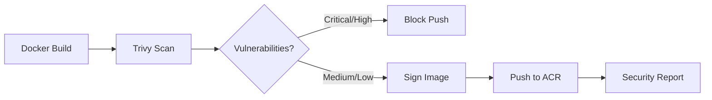

**Image Signing:** Cosign with Azure Key Vault

```bash
# Sign image
cosign sign --key azurekv://kv-scts-genai-prod/cosign-key \
  sctsgenai.azurecr.io/document-service:v1.0.0

# Verify signature (in deployment)
cosign verify --key azurekv://kv-scts-genai-prod/cosign-key \
  sctsgenai.azurecr.io/document-service:v1.0.0
```

---

## 7. Kubernetes/Orchestration

### 7.1 Cluster Architecture

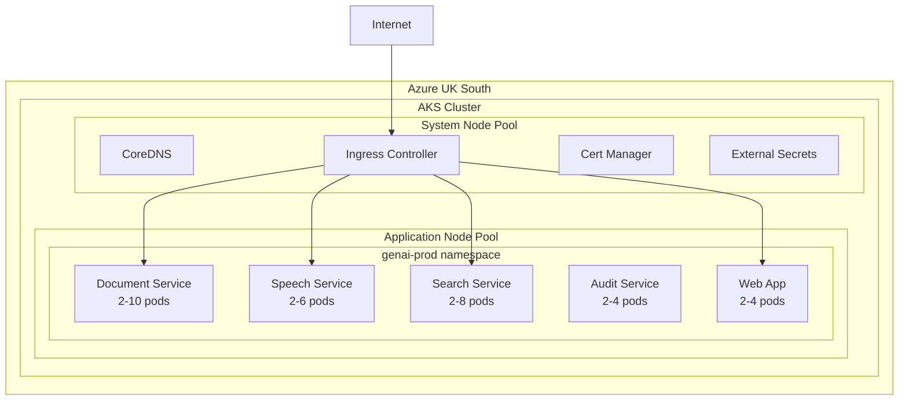

### 7.2 Namespace Strategy

| Namespace | Purpose | Resource Quota |
|-----------|---------|----------------|
| `genai-prod` | Production workloads | 20 CPU, 40Gi memory |
| `genai-staging` | Pre-production testing | 10 CPU, 20Gi memory |
| `genai-test` | Integration testing | 8 CPU, 16Gi memory |
| `genai-dev` | Development | 6 CPU, 12Gi memory |
| `monitoring` | Prometheus, Grafana | 4 CPU, 8Gi memory |
| `argocd` | GitOps tooling | 2 CPU, 4Gi memory |

### 7.3 Resource Management

**Resource Requests/Limits:**

```yaml
# Example: Document Service
resources:
  requests:
    cpu: "500m"
    memory: "512Mi"
  limits:
    cpu: "2000m"
    memory: "2Gi"
```

**Horizontal Pod Autoscaler:**

```yaml
apiVersion: autoscaling/v2
kind: HorizontalPodAutoscaler
metadata:
  name: document-service-hpa
  namespace: genai-prod
spec:
  scaleTargetRef:
    apiVersion: apps/v1
    kind: Deployment
    name: document-service
  minReplicas: 2
  maxReplicas: 10
  metrics:
    - type: Resource
      resource:
        name: cpu
        target:
          type: Utilization
          averageUtilization: 70
    - type: Resource
      resource:
        name: memory
        target:
          type: Utilization
          averageUtilization: 80
```

### 7.4 Service Mesh

**Decision:** Istio (optional for Beta phase, mandatory for Production)

**Use Cases:**
- mTLS between services
- Traffic management (canary, circuit breaking)
- Observability (distributed tracing)
- Rate limiting

### 7.5 Ingress/Networking

**Ingress Controller:** NGINX Ingress Controller

```yaml
apiVersion: networking.k8s.io/v1
kind: Ingress
metadata:
  name: genai-ingress
  namespace: genai-prod
  annotations:
    kubernetes.io/ingress.class: nginx
    cert-manager.io/cluster-issuer: letsencrypt-prod
    nginx.ingress.kubernetes.io/ssl-redirect: "true"
    nginx.ingress.kubernetes.io/proxy-body-size: "100m"
spec:
  tls:
    - hosts:
        - genai.scts.gov.uk
      secretName: genai-tls
  rules:
    - host: genai.scts.gov.uk
      http:
        paths:
          - path: /api/v1/documents
            pathType: Prefix
            backend:
              service:
                name: document-service
                port:
                  number: 80
```

### 7.6 GitOps Tooling

**Decision:** ArgoCD for declarative deployments

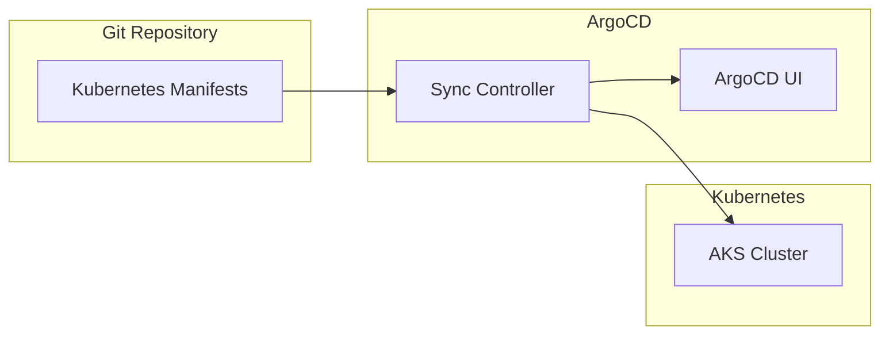

**ArgoCD Application:**

```yaml
apiVersion: argoproj.io/v1alpha1
kind: Application
metadata:
  name: document-service
  namespace: argocd
spec:
  project: genai
  source:
    repoURL: https://dev.azure.com/scts/genai/_git/scts-genai-platform
    targetRevision: HEAD
    path: kubernetes/overlays/prod/document-service
  destination:
    server: https://kubernetes.default.svc
    namespace: genai-prod
  syncPolicy:
    automated:
      prune: true
      selfHeal: true
    syncOptions:
      - CreateNamespace=true
```

---

## 8. Environment Management

### 8.1 Environment Types

| Environment | Purpose | Data | Access |
|-------------|---------|------|--------|
| **Development** | Feature development | Synthetic | Developers |
| **Test** | Integration testing | Anonymised subset | QA + Dev |
| **Staging** | Pre-production validation | Production-like (anonymised) | QA + Ops |
| **Production** | Live service | Real data | Ops only |

### 8.2 Environment Provisioning

**Terraform Workspaces:**

```bash
# Create environment
cd terraform/environments/dev
terraform workspace new dev
terraform apply -var-file="dev.tfvars"
```

**Environment Variables per Stage:**

| Variable | Dev | Test | Staging | Prod |
|----------|-----|------|---------|------|
| `AZURE_REGION` | ukwest | uksouth | uksouth | uksouth |
| `AKS_NODE_COUNT` | 2 | 3 | 3 | 6 |
| `SQL_SKU` | S1 | S2 | S3 | P1 |
| `ENABLE_DR` | false | false | true | true |
| `LOG_LEVEL` | DEBUG | INFO | INFO | WARN |

### 8.3 Data Management Across Environments

**Data Handling:**

| Environment | Data Source | Masking |
|-------------|-------------|---------|
| Dev | Synthetic generation | N/A |
| Test | Production subset | PII masked |
| Staging | Production mirror | PII pseudonymised |
| Production | Live data | None |

**Data Refresh Cadence:**

| Environment | Frequency | Method |
|-------------|-----------|--------|
| Test | Weekly | Automated script |
| Staging | Daily | Azure Data Factory |

### 8.4 Ephemeral Environments

**PR Preview Environments:**

```yaml
# Azure DevOps PR trigger
trigger:
  branches:
    include:
      - feature/*

stages:
  - stage: CreatePreview
    jobs:
      - job: DeployPreview
        steps:
          - script: |
              PREVIEW_NS="preview-$(Build.SourceBranchName | sed 's/\//-/g')"
              kubectl create namespace $PREVIEW_NS --dry-run=client -o yaml | kubectl apply -f -
              helm upgrade --install preview-$PREVIEW_NS ./charts/genai \
                --namespace $PREVIEW_NS \
                --set image.tag=$(Build.SourceVersion)
            displayName: 'Deploy PR preview'

          - script: |
              echo "Preview URL: https://${PREVIEW_NS}.preview.genai.scts.dev"
            displayName: 'Output preview URL'

  - stage: Cleanup
    condition: eq(variables['System.PullRequest.PullRequestId'], '')
    jobs:
      - job: DeletePreview
        steps:
          - script: |
              kubectl delete namespace preview-$(Build.SourceBranchName | sed 's/\//-/g')
            displayName: 'Delete PR preview'
```

**Ephemeral Environment Lifecycle:**
- Created: On PR creation
- Destroyed: 24 hours after PR merge/close
- Max concurrent: 10 environments

---

## 9. Secret Management

### 9.1 Secret Storage

**Azure Key Vault Hierarchy:**

```
Key Vaults:
├── kv-scts-genai-shared      # Shared secrets (certificates)
├── kv-scts-genai-dev         # Dev environment secrets
├── kv-scts-genai-test        # Test environment secrets
├── kv-scts-genai-staging     # Staging environment secrets
└── kv-scts-genai-prod        # Production secrets (Premium SKU)
```

### 9.2 Secret Rotation

| Secret Type | Rotation Period | Method |
|-------------|-----------------|--------|
| Azure AI API Keys | 30 days | Azure Function + Key Vault |
| Database Passwords | 90 days | Azure Automation |
| SSL Certificates | Auto | Cert-Manager + Let's Encrypt |
| Service Principals | 365 days | Azure AD + Terraform |
| Kubernetes Secrets | On Key Vault change | External Secrets Operator |

### 9.3 Secret Injection

**External Secrets Operator:**

```yaml
apiVersion: external-secrets.io/v1beta1
kind: ExternalSecret
metadata:
  name: document-service-secrets
  namespace: genai-prod
spec:
  refreshInterval: 1h
  secretStoreRef:
    kind: ClusterSecretStore
    name: azure-key-vault
  target:
    name: document-service-secrets
    creationPolicy: Owner
  data:
    - secretKey: AZURE_DOC_INTEL_KEY
      remoteRef:
        key: azure-doc-intelligence-key
    - secretKey: DATABASE_CONNECTION
      remoteRef:
        key: sql-connection-string
```

### 9.4 Secret Access Control

| Role | Key Vault Access | Secrets |
|------|------------------|---------|
| CI/CD Pipeline | Get, List | All for target env |
| Platform Team | Get, List, Set | All environments |
| Security Team | Get, List, Backup | Production only |
| Developers | Get, List | Dev/Test only |
| Applications | Get only | Via Managed Identity |

---

## 10. Developer Experience

### 10.1 Local Development Setup

**Prerequisites:**
- Docker Desktop
- Python 3.11+ / Node.js 20+
- Azure CLI
- kubectl
- Helm
- VS Code with Remote Containers

**Quick Start:**

```bash
# Clone repository
git clone https://dev.azure.com/scts/genai/_git/scts-genai-document-service
cd scts-genai-document-service

# Start development environment
docker-compose up -d

# Install dependencies
poetry install

# Run locally
poetry run uvicorn src.main:app --reload

# Run tests
poetry run pytest
```

### 10.2 Development Containers

**devcontainer.json:**

```json
{
  "name": "SCTS GenAI Development",
  "image": "mcr.microsoft.com/devcontainers/python:3.11",
  "features": {
    "ghcr.io/devcontainers/features/azure-cli:1": {},
    "ghcr.io/devcontainers/features/docker-in-docker:2": {},
    "ghcr.io/devcontainers/features/kubectl-helm-minikube:1": {}
  },
  "customizations": {
    "vscode": {
      "extensions": [
        "ms-python.python",
        "ms-azuretools.vscode-docker",
        "ms-kubernetes-tools.vscode-kubernetes-tools",
        "hashicorp.terraform"
      ]
    }
  },
  "postCreateCommand": "pip install poetry && poetry install",
  "forwardPorts": [8080, 5432, 6379]
}
```

### 10.3 Inner Loop Optimisation

**Fast Feedback Targets:**

| Activity | Target Time | Current |
|----------|-------------|---------|
| Unit tests | < 30 seconds | TBD |
| Integration tests | < 5 minutes | TBD |
| Local build | < 2 minutes | TBD |
| Deploy to dev | < 5 minutes | TBD |

**Tools:**
- **Hot reload:** Uvicorn with `--reload` flag
- **Test watch:** pytest-watch
- **Local Kubernetes:** minikube or kind
- **Mock services:** LocalStack for Azure services

### 10.4 Self-Service Capabilities

**Developer Portal Features:**

| Capability | Tool | Status |
|------------|------|--------|
| Create PR environment | Azure DevOps + Terraform | Planned |
| View logs | Azure Monitor Workbooks | Planned |
| Deploy to dev | ArgoCD UI | Planned |
| Feature flags | Azure App Configuration | Planned |
| API documentation | Swagger UI | Planned |

### 10.5 Documentation and Onboarding

**Documentation Structure:**

```
docs/
├── getting-started/
│   ├── setup.md              # Local development setup
│   ├── architecture.md       # Architecture overview
│   └── conventions.md        # Coding standards
├── services/
│   ├── document-service.md   # Service documentation
│   ├── speech-service.md
│   └── search-service.md
├── operations/
│   ├── runbooks/             # Operational runbooks
│   ├── deployment.md         # Deployment procedures
│   └── monitoring.md         # Monitoring guide
└── api/
    └── openapi/              # OpenAPI specifications
```

**Onboarding Checklist:**

- [ ] Azure DevOps access granted
- [ ] Azure subscription RBAC configured
- [ ] Key Vault access for dev environment
- [ ] Local development environment setup
- [ ] Completed architecture overview session
- [ ] First PR submitted and merged

---

## 11. Observability Integration

### 11.1 Logging Pipeline

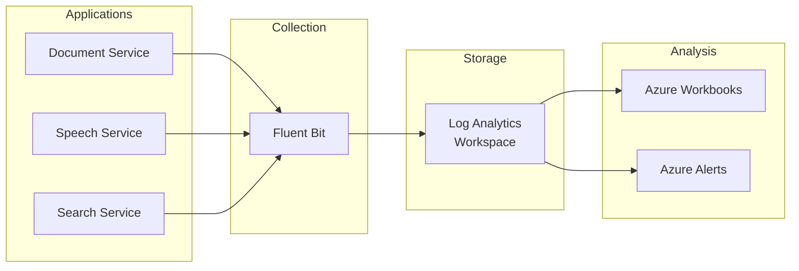

**Log Format:** Structured JSON

```json
{
  "timestamp": "2026-01-20T10:30:00.000Z",
  "level": "INFO",
  "service": "document-service",
  "version": "1.0.0",
  "trace_id": "abc123",
  "span_id": "def456",
  "message": "Document classified successfully",
  "document_id": "doc-789",
  "classification": "CLAIM",
  "confidence": 0.95,
  "processing_time_ms": 1234
}
```

### 11.2 Metrics Collection

**Prometheus Metrics:**

```python
# Application metrics
from prometheus_client import Counter, Histogram

DOCUMENTS_PROCESSED = Counter(
    'documents_processed_total',
    'Total documents processed',
    ['status', 'document_type']
)

PROCESSING_DURATION = Histogram(
    'document_processing_duration_seconds',
    'Document processing duration',
    ['document_type'],
    buckets=[0.1, 0.5, 1, 2, 5, 10, 30]
)
```

**Key Metrics:**

| Metric | Type | Labels | Alert Threshold |
|--------|------|--------|-----------------|
| `request_duration_seconds` | Histogram | service, method, status | p95 > 2s |
| `request_total` | Counter | service, method, status | Error rate > 5% |
| `documents_processed_total` | Counter | status, type | - |
| `ai_confidence_score` | Histogram | model, type | Avg < 0.8 |
| `active_connections` | Gauge | service | > 80% capacity |

### 11.3 Tracing Integration

**OpenTelemetry Configuration:**

```python
from opentelemetry import trace
from opentelemetry.exporter.otlp.proto.grpc.trace_exporter import OTLPSpanExporter
from opentelemetry.sdk.trace import TracerProvider
from opentelemetry.sdk.trace.export import BatchSpanProcessor

# Configure tracing
trace.set_tracer_provider(TracerProvider())
tracer = trace.get_tracer(__name__)

otlp_exporter = OTLPSpanExporter(
    endpoint="http://otel-collector:4317",
    insecure=True
)
trace.get_tracer_provider().add_span_processor(
    BatchSpanProcessor(otlp_exporter)
)
```

### 11.4 Dashboard Provisioning

**Grafana Dashboards as Code:**

```yaml
# dashboards/document-service.yaml
apiVersion: 1
providers:
  - name: 'default'
    folder: 'GenAI'
    type: file
    options:
      path: /var/lib/grafana/dashboards

# Dashboard JSON exported and version controlled
```

**Standard Dashboards:**

| Dashboard | Purpose | Refresh |
|-----------|---------|---------|
| Service Health | All services overview | 30s |
| Document Processing | Document service deep dive | 30s |
| AI Performance | AI model metrics | 1m |
| Security | Authentication, access patterns | 1m |
| Cost | Cloud spend by service | 1h |

### 11.5 Alert Configuration

**Alert Rules:**

```yaml
# prometheus-rules.yaml
groups:
  - name: genai-alerts
    rules:
      - alert: HighErrorRate
        expr: |
          sum(rate(request_total{status=~"5.."}[5m]))
          / sum(rate(request_total[5m])) > 0.05
        for: 5m
        labels:
          severity: critical
        annotations:
          summary: "High error rate detected"
          description: "Error rate is {{ $value | humanizePercentage }}"

      - alert: SlowResponses
        expr: |
          histogram_quantile(0.95,
            sum(rate(request_duration_seconds_bucket[5m])) by (le, service)
          ) > 2
        for: 5m
        labels:
          severity: warning
        annotations:
          summary: "Slow response times for {{ $labels.service }}"
```

**Alert Routing:**

| Severity | Channel | Response Time |
|----------|---------|---------------|
| Critical | PagerDuty + Teams | < 15 mins |
| Warning | Teams | < 1 hour |
| Info | Email digest | Next business day |

---

## 12. DevSecOps

### 12.1 Shift-Left Security Practices

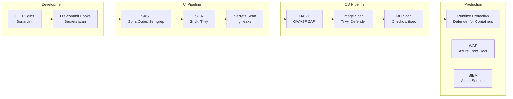

### 12.2 SAST Configuration

**SonarQube Quality Gate:**

| Metric | Threshold | Block Build |
|--------|-----------|-------------|
| Bugs | 0 Critical, 0 High | Yes |
| Vulnerabilities | 0 Critical, 0 High | Yes |
| Code Smells | < 100 | No (warning) |
| Coverage | ≥ 80% | Yes |
| Duplication | < 5% | No (warning) |

### 12.3 DAST Configuration

**OWASP ZAP Scan (Staging):**

```yaml
# Azure DevOps DAST stage
- stage: DAST
  condition: and(succeeded(), eq(variables['Build.SourceBranch'], 'refs/heads/main'))
  jobs:
    - job: ZAPScan
      steps:
        - script: |
            docker run -t owasp/zap2docker-stable zap-baseline.py \
              -t https://staging.genai.scts.dev \
              -r zap-report.html \
              -I
          displayName: 'OWASP ZAP baseline scan'

        - task: PublishBuildArtifacts@1
          inputs:
            pathToPublish: 'zap-report.html'
            artifactName: 'security-reports'
```

### 12.4 SCA (Software Composition Analysis)

**Dependency Scanning:**

| Tool | Purpose | Integration |
|------|---------|-------------|
| Snyk | Known vulnerabilities | CI pipeline |
| Trivy | Container vulnerabilities | CI + Registry |
| OWASP Dependency-Check | CVE database | Nightly scan |
| GitHub/Azure Dependabot | Auto-update PRs | Daily |

### 12.5 Container Scanning

**Trivy Configuration:**

```yaml
# trivy.yaml
scan:
  security-checks:
    - vuln
    - config
    - secret
  severity:
    - CRITICAL
    - HIGH
    - MEDIUM
  ignore-unfixed: true
  timeout: 10m
```

### 12.6 Infrastructure Scanning

**Checkov Policies:**

```yaml
# .checkov.yaml
framework:
  - terraform
  - kubernetes
  - dockerfile
skip-check:
  - CKV_AZURE_35  # Documented exception: storage account public access
soft-fail-on:
  - CKV_AZURE_*
```

**Critical Checks (blocking):**

| Check | Description |
|-------|-------------|
| CKV_AZURE_1 | Storage account HTTPS only |
| CKV_AZURE_3 | Storage account encryption |
| CKV_AZURE_17 | Key Vault key expiration |
| CKV_AZURE_42 | Key Vault purge protection |
| CKV_K8S_8 | Liveness probe configured |
| CKV_K8S_9 | Readiness probe configured |
| CKV_K8S_14 | Image tag not latest |
| CKV_K8S_21 | Default namespace not used |

### 12.7 Compliance as Code

**Azure Policy for Compliance:**

```hcl
# Require UK region only
resource "azurerm_policy_assignment" "uk_only" {
  name                 = "require-uk-region"
  scope                = azurerm_resource_group.genai.id
  policy_definition_id = azurerm_policy_definition.uk_region.id

  parameters = jsonencode({
    allowedLocations = {
      value = ["uksouth", "ukwest"]
    }
  })
}

# Require encryption at rest
resource "azurerm_policy_assignment" "encryption" {
  name                 = "require-encryption"
  scope                = azurerm_resource_group.genai.id
  policy_definition_id = "/providers/Microsoft.Authorization/policyDefinitions/..."
}
```

---

## 13. Release Management

### 13.1 Release Versioning

**Semantic Versioning:** `MAJOR.MINOR.PATCH`

| Component | Example | When to Increment |
|-----------|---------|-------------------|
| MAJOR | 2.0.0 | Breaking API changes |
| MINOR | 1.1.0 | New features (backward compatible) |
| PATCH | 1.0.1 | Bug fixes |

**Pre-release Tags:**
- `1.0.0-alpha.1` - Internal testing
- `1.0.0-beta.1` - External testing
- `1.0.0-rc.1` - Release candidate

### 13.2 Changelog Generation

**Conventional Commits → Changelog:**

```bash
# Generate changelog
npx standard-version --release-as minor

# Output: CHANGELOG.md
## [1.1.0] - 2026-01-20

### Features
* **document-service:** add PDF classification support (SCTS-123)
* **search-service:** implement case citation detection (SCTS-456)

### Bug Fixes
* **speech-service:** fix audio streaming timeout (SCTS-789)

### Security
* **deps:** update azure-sdk to fix CVE-2026-1234
```

### 13.3 Release Notes

**Release Note Template:**

```markdown
# Release v1.1.0

## Summary
This release introduces PDF classification support and case citation detection.

## New Features
- **PDF Classification:** Documents in PDF format can now be classified
  using Azure Document Intelligence
- **Citation Detection:** Legal citations are automatically detected and
  linked in search results

## Bug Fixes
- Fixed audio streaming timeout issue in Speech Service (SCTS-789)

## Security Updates
- Updated Azure SDK to address CVE-2026-1234

## Breaking Changes
None

## Upgrade Notes
No action required for existing users.

## Known Issues
- Translation latency may be higher than target for Polish language (SCTS-999)
```

### 13.4 Release Coordination

**Release Calendar:**

| Week | Activity | Responsible |
|------|----------|-------------|
| Week 1 | Feature freeze | Tech Lead |
| Week 2 | Testing + bug fixes | QA Team |
| Week 3 | Staging deployment + UAT | Ops Team |
| Week 4 | Production deployment | Ops Team + CAB |

### 13.5 Hotfix Process

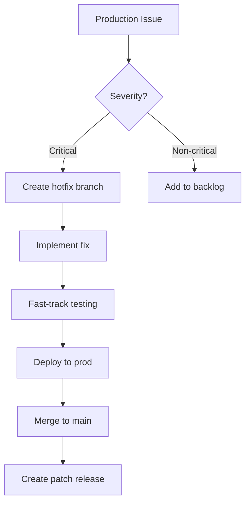

**Hotfix SLAs:**

| Severity | Fix Time | Deploy Time |
|----------|----------|-------------|
| Critical (service down) | < 2 hours | < 4 hours |
| High (major functionality) | < 8 hours | < 24 hours |

---

## 14. Platform Engineering

### 14.1 Internal Developer Platform (IDP)

**Platform Capabilities:**

| Capability | Tool | Self-Service |
|------------|------|--------------|
| Create service | Service template (Cookiecutter) | Yes |
| Deploy to dev | ArgoCD | Yes |
| View logs | Azure Monitor Workbooks | Yes |
| Create feature flag | Azure App Configuration | Yes |
| Request prod deploy | Azure DevOps approval | Workflow |

### 14.2 Golden Paths

**Service Template (Python):**

```bash
# Create new service using template
cookiecutter gh:scts/genai-service-template

# Prompts:
# service_name: my-new-service
# description: My service description
# team: document-intelligence

# Creates:
# my-new-service/
# ├── src/
# │   ├── main.py
# │   ├── api/
# │   └── services/
# ├── tests/
# ├── Dockerfile
# ├── docker-compose.yml
# ├── pyproject.toml
# ├── azure-pipelines.yml
# ├── kubernetes/
# └── README.md
```

### 14.3 Platform APIs

| API | Purpose | Consumers |
|-----|---------|-----------|
| `/api/deployments` | Deployment status | Dashboard |
| `/api/environments` | Environment info | Developers |
| `/api/secrets` | Secret management | Services |
| `/api/feature-flags` | Feature flag CRUD | Services |

---

## 15. UK Government Compliance

### 15.1 Technology Code of Practice (TCoP)

| Point | Requirement | Implementation |
|-------|-------------|----------------|
| 1 | Define user needs | User research, personas in requirements |
| 2 | Make things accessible | WCAG 2.2 AA compliance |
| 3 | Be open and use open source | Open source tools (Terraform, ArgoCD) |
| 4 | Make use of open standards | OpenAPI, CloudEvents, OCI |
| 5 | Use cloud first | Azure (G-Cloud approved) |
| 6 | Make things secure | NCSC CAF alignment, DevSecOps |
| 7 | Make privacy integral | Privacy by design, DPIA |
| 8 | Share and reuse | Internal platform, service templates |
| 9 | Integrate and adapt technology | API-first, event-driven |
| 10 | Make better use of data | Data model, quality requirements |
| 11 | Define your purchasing strategy | G-Cloud procurement |
| 12 | Meet the Service Standard | GDS Service Standard alignment |

### 15.2 Cloud First Implementation

**G-Cloud Procurement:**

| Service | G-Cloud Supplier | Contract |
|---------|------------------|----------|
| Azure AI Services | Microsoft (via G-Cloud) | Framework |
| AKS | Microsoft (via G-Cloud) | Framework |
| Azure DevOps | Microsoft (via G-Cloud) | Framework |

### 15.3 Open Standards

| Standard | Usage |
|----------|-------|
| **OpenAPI 3.0** | API specifications |
| **CloudEvents 1.0** | Event messaging |
| **OCI** | Container images |
| **OpenTelemetry** | Observability |
| **SAML 2.0 / OAuth 2.0** | Authentication |

### 15.4 Secure by Design Integration

**NCSC CAF Alignment in DevOps:**

| CAF Objective | DevOps Implementation |
|---------------|----------------------|
| A1: Governance | Pipeline approvals, audit trails |
| A2: Risk Management | Security scanning, vulnerability management |
| B1: Service Protection | Container hardening, network policies |
| B2: Identity & Access | RBAC, managed identities |
| B3: Data Security | Encryption, secret management |
| B4: System Security | SAST, DAST, image scanning |
| C1: Security Monitoring | Logging, alerting, SIEM integration |
| D1: Response Planning | Incident runbooks, rollback procedures |

---

## 16. Metrics & Improvement

### 16.1 DORA Metrics

**Measurement:**

| Metric | Definition | Target | Measurement |
|--------|------------|--------|-------------|
| **Deployment Frequency** | Deploys to production per time period | Weekly | Azure DevOps deployments |
| **Lead Time for Changes** | Commit to production | < 1 week | Git commit → deploy timestamp |
| **Mean Time to Recovery** | Time to restore service | < 1 hour | Incident tracking |
| **Change Failure Rate** | Deployments causing failure | < 5% | Rollback count / deploy count |

### 16.2 Engineering Metrics

| Metric | Target | Dashboard |
|--------|--------|-----------|
| Build success rate | > 95% | Azure DevOps |
| Test coverage | > 80% | SonarQube |
| Security vulnerabilities (prod) | 0 critical/high | Defender for Cloud |
| Infrastructure drift | 0 | Terraform |
| MTTR (Mean Time to Recovery) | < 1 hour | Azure Monitor |
| Incident count (P1/P2) | < 2/month | ServiceNow |

### 16.3 Continuous Improvement

**Improvement Process:**

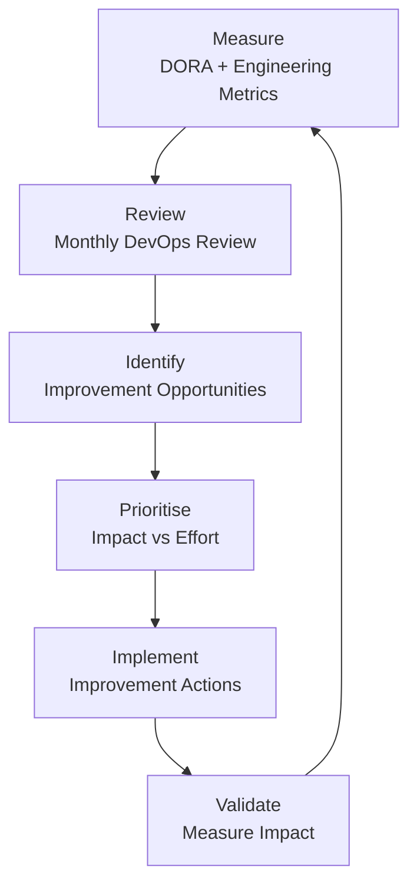

**Improvement Cadence:**

| Activity | Frequency | Participants |
|----------|-----------|--------------|
| Daily standup | Daily | Development teams |
| Sprint retrospective | Bi-weekly | Development teams |
| DevOps metrics review | Monthly | Platform + Dev leads |
| Quarterly planning | Quarterly | All stakeholders |

---

## 17. Requirements Traceability

### 17.1 NFR to DevOps Mapping

| Requirement | DevOps Element | Implementation |
|-------------|----------------|----------------|
| **NFR-P-001**: API response < 2s | Performance testing | Locust in CI/CD |
| **NFR-A-001**: 99.5% availability | High availability | Multi-AZ, health checks, auto-scaling |
| **NFR-A-002**: 4h RTO, 1h RPO | Disaster recovery | Geo-replication, DR runbooks |
| **NFR-A-003**: Graceful degradation | Resilience patterns | Circuit breakers, fallbacks |
| **NFR-S-001**: Horizontal scaling | Auto-scaling | AKS HPA, Azure auto-scale |
| **NFR-SEC-001**: Authentication | Identity integration | Azure AD, SAML 2.0 |
| **NFR-SEC-003**: Encryption | Secret management | Key Vault, TLS |
| **NFR-SEC-005**: Vulnerability mgmt | Security scanning | SAST, DAST, SCA |
| **NFR-C-002**: Audit logging | Observability | Structured logging, Log Analytics |
| **NFR-M-001**: Observability | Monitoring stack | Prometheus, Grafana, Azure Monitor |
| **NFR-M-002**: Model governance | ML pipeline | Model versioning, approval workflow |

### 17.2 Architecture Principle Alignment

| Principle | DevOps Implementation |
|-----------|----------------------|
| **P-5**: Resilience | Circuit breakers, DR, rollback |
| **P-11**: Security by Design | DevSecOps, shift-left security |
| **P-17**: Observability | Logging, metrics, tracing |
| **P-20**: Automation | CI/CD, IaC, GitOps |

---

## Appendix A: Tool Versions

| Tool | Version | Purpose |
|------|---------|---------|
| Terraform | 1.6+ | Infrastructure as Code |
| Kubernetes | 1.28+ | Container orchestration |
| ArgoCD | 2.9+ | GitOps |
| Prometheus | 2.47+ | Metrics |
| Grafana | 10.0+ | Dashboards |
| Trivy | 0.48+ | Container scanning |
| SonarQube | 10.0+ | Code quality |

---

## Appendix B: Useful Commands

```bash
# Kubernetes
kubectl get pods -n genai-prod
kubectl logs -f deployment/document-service -n genai-prod
kubectl rollout status deployment/document-service -n genai-prod
kubectl rollout undo deployment/document-service -n genai-prod

# Terraform
terraform plan -var-file="prod.tfvars"
terraform apply -var-file="prod.tfvars"
terraform state list

# ArgoCD
argocd app list
argocd app sync document-service
argocd app history document-service

# Azure CLI
az aks get-credentials --resource-group rg-scts-genai-prod --name aks-scts-genai-prod
az acr login --name sctsgenai
az keyvault secret list --vault-name kv-scts-genai-prod
```

---

## Appendix C: Glossary

| Term | Definition |
|------|------------|
| **ACR** | Azure Container Registry - Container image storage |
| **AKS** | Azure Kubernetes Service - Managed Kubernetes |
| **ArgoCD** | GitOps continuous delivery tool for Kubernetes |
| **CAB** | Change Advisory Board - Approves production changes |
| **CD** | Continuous Deployment/Delivery |
| **CI** | Continuous Integration |
| **DAST** | Dynamic Application Security Testing |
| **DORA** | DevOps Research and Assessment - Engineering metrics |
| **GitOps** | Git as single source of truth for infrastructure |
| **HCL** | HashiCorp Configuration Language - Terraform syntax |
| **Helm** | Kubernetes package manager |
| **HPA** | Horizontal Pod Autoscaler |
| **HSM** | Hardware Security Module |
| **IaC** | Infrastructure as Code |
| **IDP** | Internal Developer Platform |
| **K8s** | Kubernetes abbreviation |
| **mTLS** | Mutual TLS - Two-way certificate authentication |
| **MTTR** | Mean Time to Recovery |
| **NGINX** | Web server and reverse proxy |
| **OCI** | Open Container Initiative |
| **OTEL** | OpenTelemetry - Observability framework |
| **PR** | Pull Request |
| **RBAC** | Role-Based Access Control |
| **RPO** | Recovery Point Objective - Maximum data loss tolerance |
| **RTO** | Recovery Time Objective - Maximum downtime tolerance |
| **SAST** | Static Application Security Testing |
| **SCA** | Software Composition Analysis |
| **SIEM** | Security Information and Event Management |
| **SLO** | Service Level Objective |
| **SRE** | Site Reliability Engineering |
| **TLS** | Transport Layer Security |
| **VNet** | Virtual Network (Azure) |
| **WAF** | Web Application Firewall |

---

## Approval

| Role | Name | Signature | Date |
|------|------|-----------|------|
| Platform Lead | | | |
| Security Lead | | | |
| Engineering Manager | | | |

---

**Generated by**: ArcKit `/arckit.devops` command
**Generated on**: 2026-01-27
**ArcKit Version**: 0.11.2
**Project**: SCTS GenAI Programme (Project 001)
**Model**: Claude Opus 4.5
