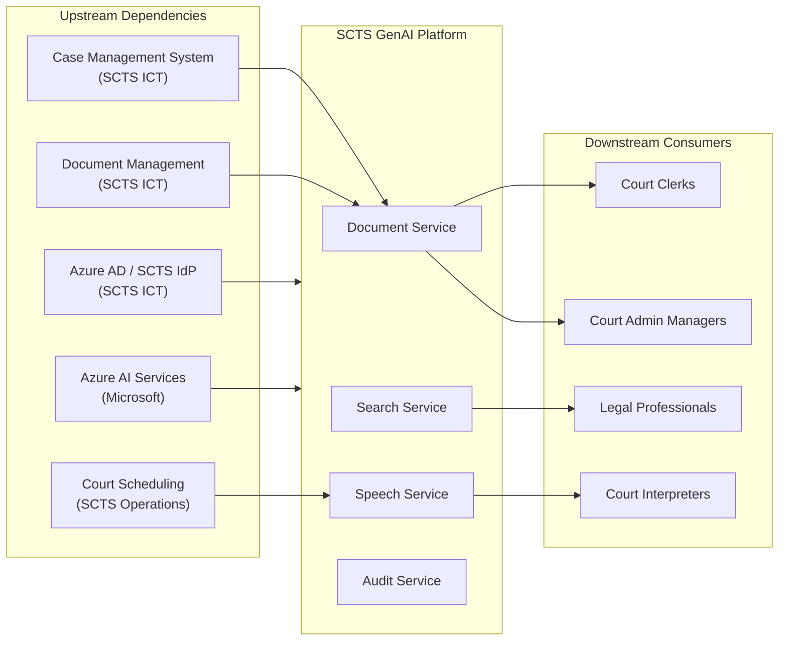
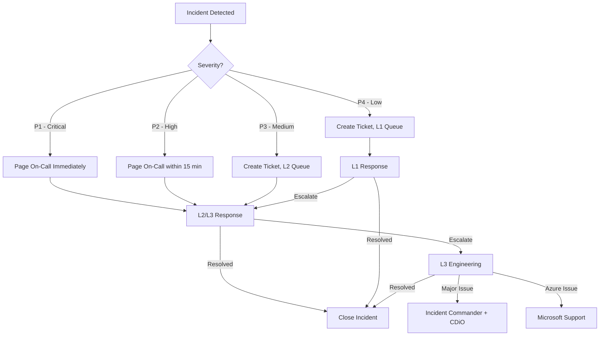
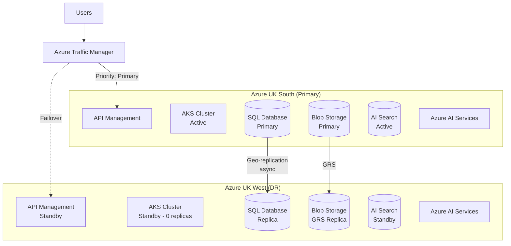

# Operational Readiness Pack: SCTS GenAI Programme

> **Template Status**: Experimental | **Version**: 0.11.2 | **Command**: `/arckit.operationalize`

## Document Control

| Field | Value |
|-------|-------|
| **Document ID** | ARC-001-OPS-v1.1 |
| **Document Type** | Operational Readiness Pack |
| **Project** | SCTS GenAI Programme (Project 001) |
| **Classification** | OFFICIAL-SENSITIVE |
| **Status** | DRAFT |
| **Version** | 1.1 |
| **Created Date** | 2026-01-21 |
| **Last Modified** | 2026-01-27 |
| **Review Cycle** | Quarterly |
| **Next Review Date** | 2026-04-27 |
| **Owner** | Chief Digital Information Officer, SCTS |
| **Reviewed By** | PENDING |
| **Approved By** | PENDING |
| **Distribution** | CDi Function, AI Team, ICT Operations, Service Desk, Security Team |

## Revision History

| Version | Date | Author | Changes | Approved By | Approval Date |
|---------|------|--------|---------|-------------|---------------|
| 1.0 | 2026-01-21 | ArcKit AI | Initial creation from `/arckit.operationalize` command | PENDING | PENDING |
| 1.1 | 2026-01-27 | ArcKit AI | Updated to template v0.11.2 format | PENDING | PENDING |

---

## 1. Service Overview

### Service Description

| Attribute | Value |
|-----------|-------|
| **Service Name** | SCTS GenAI Platform |
| **Description** | AI-powered document intelligence, real-time translation, speech transcription, and cognitive search for Scottish Courts |
| **Service Tier** | Important |
| **Business Criticality** | High |
| **Service Owner** | Chief Digital Information Officer (CDiO), SCTS |
| **Technical Lead** | Senior AI Technical Architect, CDi Function |
| **Operations Lead** | ICT Operations Manager, SCTS |
| **Target Go-Live** | Q3 2026 (Document Intelligence MVP) |

### Service Tier Justification

**Tier: Important** (99.9% availability target)

The SCTS GenAI Platform is classified as **Important** (Tier 2) rather than Critical because:

1. **Graceful Degradation**: Per Architecture Principle 5, courts MUST function if AI services are unavailable. AI capabilities are enhancements, not dependencies for court operations
2. **Manual Fallbacks**: All AI-assisted processes have documented manual fallback procedures (FR-014)
3. **Non-Blocking**: AI service unavailability does not prevent court proceedings from continuing
4. **NFR Alignment**: NFR-A-001 specifies 99.5% availability during court hours, which aligns with Important tier

However, during court sessions with live translation (Speech Services), the service temporarily elevates to **Critical** due to direct impact on court participants.

### Dependencies



| Direction | Service | Impact if Unavailable | Fallback |
|-----------|---------|----------------------|----------|
| Upstream | Case Management System | Cannot retrieve case metadata | Manual case lookup |
| Upstream | Document Management System | Cannot process new documents | Queue for later processing |
| Upstream | Azure AD / SCTS IdP | Cannot authenticate users | None (blocking) |
| Upstream | Court Scheduling | Cannot configure translation sessions | Manual session setup |
| Upstream | Azure AI Services | AI processing unavailable | Manual document processing |
| Downstream | Court Clerks | Must use manual classification | Manual procedures available |
| Downstream | Court Interpreters | AI translation unavailable | Human interpreters only |
| Downstream | Legal Professionals | Keyword search only | Basic search fallback |

---

## 2. Service Level Objectives (SLOs)

### SLI Definitions

| SLI | Definition | Measurement | Source |
|-----|------------|-------------|--------|
| **Availability** | % of successful API requests (HTTP 2xx/3xx) | (successful / total) × 100 | Azure Application Insights |
| **Document Processing Latency** | Time to complete document classification (p95) | 95th percentile of processing duration | Application Insights |
| **Translation Latency** | Time from speech to translated text (e2e) | 95th percentile of e2e latency | Application Insights |
| **Search Latency** | Search query response time (p95) | 95th percentile of query duration | Application Insights |
| **Error Rate** | % of failed requests (HTTP 5xx) | (5xx / total) × 100 | Application Insights |
| **Classification Accuracy** | % of AI classifications confirmed by humans | (confirmed / total classifications) × 100 | Audit logs |

### SLO Targets

| SLO | Target | Error Budget (30 days) | Measurement Window | NFR Source |
|-----|--------|----------------------|-------------------|------------|
| **Availability** | 99.5% (court hours) | 65 minutes/month | Rolling 30 days | NFR-A-001 |
| **Document Processing (p95)** | <10 seconds | 0.5% of docs >10s | Rolling 30 days | NFR-P-001 |
| **Translation Latency (e2e)** | <3 seconds | 0.5% of translations >3s | Rolling 30 days | NFR-P-002 |
| **Search Latency (p95)** | <2 seconds | 0.5% of searches >2s | Rolling 30 days | NFR-P-003 |
| **Error Rate** | <0.5% | 0.5% of requests | Rolling 30 days | - |
| **Classification Accuracy** | ≥90% | 10% human overrides | Monthly review | BR-001 |

### Error Budget Policy

| Error Budget Consumed | Action |
|----------------------|--------|
| <50% | Normal operations, continue feature development |
| 50-75% | Increased monitoring, prioritize reliability work, review recent changes |
| 75-100% | Freeze non-critical changes, focus on stability, daily SLO review |
| >100% | All hands on reliability, no new features, incident commander assigned |

### SLO Breach Response

1. **Detection**: Automated alert when SLO trending toward breach (75% error budget consumed)
2. **Notification**: AI Platform team notified via Microsoft Teams + PagerDuty
3. **Response**: Incident created in ServiceNow, investigation begins within 30 minutes
4. **Escalation**: If breach confirmed, escalate to CDiO within 2 hours
5. **Review**: Weekly SLO review meeting with service owner and stakeholders

---

## 3. Support Model

### Support Tiers

| Tier | Team | Responsibilities | Hours | Contact |
|------|------|-----------------|-------|---------|
| **L1** | SCTS Service Desk | Initial triage, password resets, known issues, user queries | Mon-Fri 08:00-18:00 | servicedesk@scotcourts.gov.uk |
| **L2** | AI Platform Support | Application troubleshooting, config changes, AI quality issues | Mon-Fri 08:00-18:00 | ai-support@scotcourts.gov.uk |
| **L3** | AI Engineering Team | Code fixes, architecture issues, model updates, DR | On-call (court hours) | ai-engineering@scotcourts.gov.uk |
| **L4** | Microsoft Azure Support | Azure AI Services issues, platform incidents | 24/7 | Azure Premier Support |

### Escalation Matrix



| Severity | Definition | L1 Response | L2 Response | L3 Response | Management | Example |
|----------|------------|-------------|-------------|-------------|------------|---------|
| **P1** | Service down, court proceedings impacted | 5 min | 15 min | 30 min | 1 hour | Translation fails during live session |
| **P2** | Major degradation, workarounds available | 15 min | 1 hour | 2 hours | 4 hours | Document classification 50% slower |
| **P3** | Minor impact, single user or feature | 1 hour | 4 hours | 8 hours | Next day | Search results slow for one court |
| **P4** | Cosmetic, feature request, query | 4 hours | 1 day | 3 days | Weekly | UI display issue |

### On-Call Rotation

| Role | Primary | Secondary | Escalation | Contact Method |
|------|---------|-----------|------------|----------------|
| **AI Platform** | AI Engineer 1 | AI Engineer 2 | Senior AI Architect | PagerDuty → Mobile |
| **Infrastructure** | DevOps Engineer 1 | DevOps Engineer 2 | Infrastructure Lead | PagerDuty → Mobile |
| **Database** | DBA 1 | DBA 2 | Data Services Manager | PagerDuty → Mobile |

**Rotation Schedule**: Weekly rotation, handoff Monday 09:00 GMT
**On-Call Tool**: PagerDuty (integrated with Azure Monitor alerts)
**On-Call Coverage**: Court hours (Mon-Fri 08:00-18:00) for P1/P2; next business day for P3/P4

### Out-of-Hours Procedures

1. P1/P2 incidents during court hours (08:00-18:00) page on-call immediately
2. P1/P2 incidents outside court hours: Page only if reported by court user as urgent
3. P3/P4 incidents wait until next business day unless explicitly escalated
4. On-call has authority to page additional engineers and Microsoft Support if needed
5. Management escalation for incidents >2 hours unresolved or affecting court proceedings
6. Weekend/holiday coverage: Skeleton on-call for P1 only (court rarely sits)

---

## 4. Monitoring & Observability

### Health Check Endpoints

| Component | Endpoint | Method | Expected Response | Timeout | Frequency |
|-----------|----------|--------|------------------|---------|-----------|
| **Document Service** | /health | GET | HTTP 200, `{"status":"healthy"}` | 5s | 30s |
| **Document Service** | /health/ready | GET | HTTP 200 (DB + Azure AI connected) | 10s | 60s |
| **Document Service** | /health/live | GET | HTTP 200 | 2s | 15s |
| **Speech Service** | /health | GET | HTTP 200, `{"status":"healthy"}` | 5s | 30s |
| **Speech Service** | /health/ready | GET | HTTP 200 (Speech API connected) | 10s | 60s |
| **Search Service** | /health | GET | HTTP 200, `{"status":"healthy"}` | 5s | 30s |
| **Search Service** | /health/ready | GET | HTTP 200 (AI Search connected) | 10s | 60s |
| **Audit Service** | /health | GET | HTTP 200, `{"status":"healthy"}` | 5s | 30s |
| **API Gateway** | /health | GET | HTTP 200 | 5s | 30s |
| **Azure SQL** | TCP 1433 | Connection | Connected | 10s | 60s |
| **Azure Redis** | TCP 6380 | PING | PONG | 5s | 30s |

### Key Metrics

| Metric | Description | Warning Threshold | Critical Threshold | Dashboard |
|--------|-------------|-------------------|-------------------|-----------|
| `http_requests_total` | Total request count | - | - | Service Overview |
| `http_request_duration_seconds_p95` | Latency p95 | >2s for 5min | >5s for 5min | Service Overview |
| `http_requests_5xx_total` | Error count | >1% for 5min | >5% for 5min | Service Overview |
| `ai_classification_confidence_avg` | AI confidence | <0.80 for 1hr | <0.70 for 30min | AI Quality |
| `ai_human_override_rate` | Override rate | >15% for 1hr | >25% for 30min | AI Quality |
| `translation_latency_e2e_p95` | Translation latency | >2s for 5min | >5s for 5min | Speech Dashboard |
| `search_relevance_score_avg` | Search quality | <0.70 for 1hr | <0.60 for 30min | Search Dashboard |
| `cpu_usage_percent` | CPU utilization | >70% for 10min | >90% for 5min | Infrastructure |
| `memory_usage_percent` | Memory utilization | >80% for 10min | >95% for 5min | Infrastructure |
| `disk_usage_percent` | Disk utilization | >80% | >90% | Infrastructure |
| `db_connection_pool_usage` | DB connections | >80% | >95% | Database |
| `azure_ai_quota_usage` | AI API quota | >70% | >90% | AI Services |

### Dashboards

| Dashboard | Purpose | URL | Audience | Refresh |
|-----------|---------|-----|----------|---------|
| **Service Overview** | Real-time platform health, SLIs | Azure Portal/Grafana | Operations, On-Call | 30s |
| **SLO Dashboard** | SLI/SLO tracking, error budgets | Azure Workbooks | Operations, Management | 5min |
| **AI Quality** | Classification accuracy, confidence, overrides | Grafana | AI Team, CDiO | 1min |
| **Speech & Translation** | Live session metrics, latency | Grafana | Operations, Interpreters | 10s |
| **Search Analytics** | Query volume, relevance, performance | Azure AI Search | AI Team, Legal | 5min |
| **Infrastructure** | AKS, SQL, Redis, Storage metrics | Azure Portal | Infrastructure Team | 1min |
| **Security** | Auth failures, anomalies, threats | Azure Sentinel | Security, SIRO | 5min |
| **Business Metrics** | Documents processed, sessions, users | Power BI | CDiO, Chief Executive | Daily |

### Logging

| Log Type | Location | Format | Retention | Search Tool |
|----------|----------|--------|-----------|-------------|
| **Application Logs** | Azure Log Analytics | JSON (structured) | 90 days hot, 1 year cold | Log Analytics / KQL |
| **Access Logs** | Azure Log Analytics | JSON | 90 days hot, 1 year cold | Log Analytics |
| **Audit Logs** | Azure Blob (immutable) | JSON | 7 years (WORM) | Log Analytics + Blob |
| **AI Processing Logs** | Azure Log Analytics | JSON | 90 days | Log Analytics |
| **Security Logs** | Azure Sentinel | JSON | 2 years | Sentinel / KQL |
| **Infrastructure Logs** | Azure Monitor | Platform | 90 days | Azure Portal |

**Log Correlation**: All logs include `correlation_id` (X-Correlation-ID header) for distributed tracing.

### Distributed Tracing

| Component | Instrumentation | Trace ID Header | Sampling |
|-----------|-----------------|-----------------|----------|
| **API Gateway** | Azure APIM + OpenTelemetry | X-Correlation-ID | 100% |
| **Document Service** | OpenTelemetry Python SDK | X-Correlation-ID | 100% |
| **Speech Service** | OpenTelemetry Python SDK | X-Correlation-ID | 100% |
| **Search Service** | OpenTelemetry Python SDK | X-Correlation-ID | 100% |
| **Audit Service** | OpenTelemetry Python SDK | X-Correlation-ID | 100% |
| **Azure AI Services** | Azure SDK correlation | X-Correlation-ID | N/A |
| **Azure SQL** | Query comments with trace ID | - | N/A |

**Trace Export**: All traces exported to Azure Application Insights for correlation and analysis.

---

## 5. Alerting Strategy

### Alert Routing

| Alert Type | Severity | Channel | Recipients | Hours |
|------------|----------|---------|------------|-------|
| **P1 - Service Down** | Critical | PagerDuty (high urgency) | On-call Primary + Secondary + CDiO | 24/7 |
| **P2 - Major Degradation** | High | PagerDuty (low urgency) | On-call Primary | Court hours |
| **P3 - Minor Issue** | Medium | Teams #ai-alerts + ServiceNow | AI Platform Support queue | Business hours |
| **P4 - Information** | Low | Teams #ai-alerts | AI Platform Support queue | Business hours |
| **Security Alert** | Critical | PagerDuty + Security Team | On-call + SIRO | 24/7 |

### Alert Definitions

| Alert Name | Condition | Severity | Runbook | Auto-Resolve |
|------------|-----------|----------|---------|--------------|
| **Service Unavailable** | Health check fails 3 consecutive times | P1 | [6.2 Health Check Failures](#62-health-check-failures) | Yes, 5min |
| **High Error Rate** | 5xx rate >5% for 5min | P1 | [6.3 High Error Rate](#63-high-error-rate) | Yes, 10min |
| **Elevated Error Rate** | 5xx rate >1% for 10min | P2 | [6.3 High Error Rate](#63-high-error-rate) | Yes, 15min |
| **High Latency (Critical)** | p95 >5s for 5min | P1 | [6.4 Performance Degradation](#64-performance-degradation) | Yes, 10min |
| **High Latency (Warning)** | p95 >2s for 10min | P2 | [6.4 Performance Degradation](#64-performance-degradation) | Yes, 15min |
| **Translation Session Failed** | Translation stream disconnected | P1 | [6.7 Translation Session Issues](#67-translation-session-issues) | Yes, 5min |
| **AI Confidence Low** | Avg confidence <70% for 30min | P2 | [6.8 AI Quality Issues](#68-ai-quality-issues) | Yes, 1hr |
| **High Override Rate** | Override rate >25% for 30min | P3 | [6.8 AI Quality Issues](#68-ai-quality-issues) | Yes, 1hr |
| **Database Connection Pool** | Pool usage >95% for 5min | P2 | [6.5 Capacity Issues](#65-capacity-issues) | Yes, 10min |
| **Azure AI Quota Warning** | Quota usage >90% | P3 | [6.5 Capacity Issues](#65-capacity-issues) | Yes, on reset |
| **High CPU** | CPU >90% for 5min | P3 | [6.5 Capacity Issues](#65-capacity-issues) | Yes, 10min |
| **Disk Space Low** | Disk >90% | P3 | [6.5 Capacity Issues](#65-capacity-issues) | No |
| **Security - Auth Failures** | >50 auth failures in 5min | P2 | [6.6 Security Incident](#66-security-incident-response) | Yes, 30min |
| **Security - Anomaly Detected** | Sentinel high-severity alert | P1 | [6.6 Security Incident](#66-security-incident-response) | No |
| **Dependency Down** | Upstream health check fails | P2 | [6.9 Dependency Failure](#69-dependency-failure) | Yes, 5min |

### Alert Fatigue Prevention

- **Grouping**: Related alerts grouped by service and incident (e.g., multiple pod failures → single alert)
- **Deduplication**: Identical alerts suppressed for 15 minutes
- **Maintenance Windows**: Alerts suppressed during scheduled maintenance (configured in PagerDuty)
- **Auto-resolve**: Most alerts auto-close when condition clears (see table above)
- **Escalation Timeout**: P1 alerts escalate to secondary after 15 minutes if not acknowledged
- **Weekly Alert Review**: Team reviews alert volume and tunes thresholds to reduce noise

---

## 6. Runbooks

### 6.1 Service Start/Stop

**Purpose**: Gracefully start or stop the SCTS GenAI Platform

**Prerequisites**:
- kubectl access to AKS cluster (`genai-prod` namespace)
- Azure CLI authenticated with contributor role
- Access to Azure Key Vault for secrets

**Start Procedure**:
```bash
# 1. Verify dependencies are available
az sql db show --name genai-prod --server scts-sql-prod --query status
curl -f https://scts-apim.azure-api.net/health

# 2. Verify Azure AI Services are available
az cognitiveservices account show --name scts-docai-prod --resource-group scts-genai-prod --query provisioningState

# 3. Scale up application services
kubectl -n genai-prod scale deployment doc-service --replicas=3
kubectl -n genai-prod scale deployment speech-service --replicas=2
kubectl -n genai-prod scale deployment search-service --replicas=3
kubectl -n genai-prod scale deployment audit-service --replicas=2
kubectl -n genai-prod scale deployment web-app --replicas=2

# 4. Wait for pods to be ready
kubectl -n genai-prod wait --for=condition=ready pod -l app=doc-service --timeout=120s
kubectl -n genai-prod wait --for=condition=ready pod -l app=speech-service --timeout=120s
kubectl -n genai-prod wait --for=condition=ready pod -l app=search-service --timeout=120s

# 5. Verify services are healthy
curl -f https://genai.scotcourts.gov.uk/api/v1/documents/health
curl -f https://genai.scotcourts.gov.uk/api/v1/speech/health
curl -f https://genai.scotcourts.gov.uk/api/v1/search/health

# 6. Verify in monitoring dashboard
# Check Service Overview dashboard for all green status
```

**Stop Procedure (Graceful Shutdown)**:
```bash
# 1. Disable new traffic (API Management)
az apim api update --name genai-api --api-id genai-api --resource-group scts-genai-prod --set serviceUrl=https://genai-maintenance.scotcourts.gov.uk

# 2. Wait for in-flight requests to complete (5 minutes)
echo "Waiting 5 minutes for in-flight requests..."
sleep 300

# 3. Scale down application services
kubectl -n genai-prod scale deployment doc-service --replicas=0
kubectl -n genai-prod scale deployment speech-service --replicas=0
kubectl -n genai-prod scale deployment search-service --replicas=0
kubectl -n genai-prod scale deployment audit-service --replicas=0
kubectl -n genai-prod scale deployment web-app --replicas=0

# 4. Verify all pods stopped
kubectl -n genai-prod get pods

# 5. Notify stakeholders
# Post in #scts-genai-ops Teams channel
```

**Verification**: All health checks return 200, no errors in logs for 5 minutes

**Escalation**: If service won't start after 3 attempts, escalate to L3 (Senior AI Architect)

---

### 6.2 Health Check Failures

**Purpose**: Respond to health check failures for any GenAI Platform component

**Detection**: Alert "Service Unavailable - [component] Health Check Failed"

**Diagnosis Steps**:
```bash
# 1. Identify which component is failing
kubectl -n genai-prod get pods -o wide

# 2. Check pod status and events
kubectl -n genai-prod describe pod -l app=[service-name]

# 3. Check recent logs (last 100 lines)
kubectl -n genai-prod logs -l app=[service-name] --tail=100

# 4. Check for OOM or resource issues
kubectl -n genai-prod top pods -l app=[service-name]

# 5. Check dependencies
# Database
az sql db show --name genai-prod --server scts-sql-prod --query status
# Redis
kubectl -n genai-prod exec -it deploy/[service-name] -- redis-cli -h scts-redis-prod.redis.cache.windows.net ping
# Azure AI Services
curl -X GET "https://[region].api.cognitive.microsoft.com/health" -H "Ocp-Apim-Subscription-Key: [key]"
```

**Resolution Steps**:
```bash
# If pod is CrashLoopBackOff - check logs for root cause
kubectl -n genai-prod logs -l app=[service-name] --previous

# If pod is running but unhealthy - restart deployment
kubectl -n genai-prod rollout restart deployment/[service-name]

# If resource constrained - scale up
kubectl -n genai-prod scale deployment/[service-name] --replicas=[N+1]

# If dependency is down - follow dependency runbook (6.9)

# If Azure AI Service quota exceeded - check quota dashboard
az cognitiveservices account show --name scts-docai-prod --resource-group scts-genai-prod
```

**Verification**: Health check returns 200 consistently for 5 minutes

**Escalation**: If not resolved in 30 minutes, escalate to L3

---

### 6.3 High Error Rate

**Purpose**: Diagnose and mitigate elevated error rates

**Detection**: Alert "Error Rate > X%" (P1 at >5%, P2 at >1%)

**Diagnosis Steps**:
```bash
# 1. Check error breakdown by type in Log Analytics
# KQL Query:
# AppRequests
# | where TimeGenerated > ago(30m)
# | where ResultCode startswith "5"
# | summarize count() by ResultCode, Name
# | order by count_ desc

# 2. Identify error pattern
# - Are errors from specific endpoint?
# - Are errors from specific user/tenant?
# - Did errors start after deployment?

# 3. Check recent deployments
kubectl -n genai-prod rollout history deployment/[service-name]

# 4. Check if Azure AI Services are returning errors
# Log Analytics query:
# AzureDiagnostics
# | where ResourceProvider == "MICROSOFT.COGNITIVESERVICES"
# | where ResultType != "Success"
# | summarize count() by OperationName, ResultType

# 5. Check downstream dependency health
curl -f https://[dependency]/health
```

**Resolution Steps**:
```bash
# If caused by recent deployment - rollback
kubectl -n genai-prod rollout undo deployment/[service-name]

# If caused by Azure AI Service error - enable circuit breaker
# Update config map to enable fallback mode
kubectl -n genai-prod patch configmap genai-config -p '{"data":{"AZURE_AI_FALLBACK":"true"}}'
kubectl -n genai-prod rollout restart deployment/[service-name]

# If caused by database issues
# Check SQL metrics in Azure Portal
# Consider scaling up DTUs if needed

# If caused by load spike - scale up
kubectl -n genai-prod scale deployment/[service-name] --replicas=[N+2]
```

**Verification**: Error rate returns below threshold for 10 minutes

**Escalation**: If cause unknown after 30 minutes, escalate to L3

---

### 6.4 Performance Degradation

**Purpose**: Respond to response time exceeding SLO

**Detection**: Alert "Latency p95 > Xms"

**Diagnosis Steps**:
```bash
# 1. Identify which component is slow
# Log Analytics query:
# AppRequests
# | where TimeGenerated > ago(30m)
# | summarize percentile(DurationMs, 95) by Name
# | order by percentile_DurationMs_95 desc

# 2. Check current resource usage
kubectl -n genai-prod top pods

# 3. Check for resource constraints (CPU throttling, memory pressure)
kubectl -n genai-prod describe pod -l app=[service-name] | grep -A5 "Resources"

# 4. Check database performance
# Azure Portal > SQL Database > Query Performance Insight
# Look for slow queries, lock contention

# 5. Check Redis cache hit rate
# Azure Portal > Redis Cache > Metrics > Cache Hits/Misses

# 6. Check Azure AI Service latency
# Application Insights > Dependencies > Azure Cognitive Services
```

**Resolution Steps**:
```bash
# If CPU constrained - increase limits or scale out
kubectl -n genai-prod patch deployment [service-name] -p '{"spec":{"template":{"spec":{"containers":[{"name":"[container]","resources":{"limits":{"cpu":"2"}}}]}}}}'
# OR
kubectl -n genai-prod scale deployment/[service-name] --replicas=[N+2]

# If database slow - check for blocking queries
# Azure Portal > SQL > Query Performance
# Consider adding indexes or scaling DTUs

# If cache miss rate high - warm cache or increase size
# Azure Portal > Redis > Scale

# If Azure AI Service slow - enable timeout and retry
kubectl -n genai-prod patch configmap genai-config -p '{"data":{"AZURE_AI_TIMEOUT":"15000","AZURE_AI_RETRIES":"3"}}'

# If sustained load - enable HPA
kubectl -n genai-prod autoscale deployment [service-name] --min=2 --max=10 --cpu-percent=70
```

**Verification**: p95 latency below SLO for 15 minutes

**Escalation**: If not resolved in 1 hour, escalate to L3

---

### 6.5 Capacity Issues

**Purpose**: Handle capacity constraints (CPU, memory, disk, quotas)

**Detection**: Alerts for high CPU, memory, disk, or quota usage

**Diagnosis Steps**:
```bash
# 1. Identify resource under pressure
kubectl -n genai-prod top pods --sort-by=cpu
kubectl -n genai-prod top pods --sort-by=memory

# 2. Check node capacity
kubectl top nodes

# 3. Check Azure AI Service quotas
az cognitiveservices account list-usage --name scts-docai-prod --resource-group scts-genai-prod

# 4. Check storage
kubectl -n genai-prod exec -it deploy/[service-name] -- df -h

# 5. Check database size
az sql db show --name genai-prod --server scts-sql-prod --query "currentServiceObjectiveName"
```

**Resolution Steps**:
```bash
# High CPU/Memory - Scale horizontally
kubectl -n genai-prod scale deployment/[service-name] --replicas=[N+2]

# High CPU/Memory - Scale vertically (if horizontal not sufficient)
kubectl -n genai-prod patch deployment [service-name] -p '{"spec":{"template":{"spec":{"containers":[{"name":"[container]","resources":{"limits":{"cpu":"4","memory":"8Gi"}}}]}}}}'

# Node capacity exhausted - Add nodes
az aks scale --resource-group scts-genai-prod --name scts-aks-prod --node-count [N+2]

# Azure AI quota near limit - Request increase
# Azure Portal > Cognitive Services > Quotas > Request Increase
# Notify Microsoft Support if urgent

# Disk space low
# Clean up old logs: kubectl -n genai-prod exec -it deploy/[service-name] -- find /var/log -type f -mtime +7 -delete
# Increase PVC size if needed

# Database DTU limit
az sql db update --name genai-prod --server scts-sql-prod --resource-group scts-genai-prod --service-objective S3
```

**Verification**: Resource usage below warning threshold

**Escalation**: If cannot scale further, escalate to L3 and management (cost approval)

---

### 6.6 Security Incident Response

**Purpose**: Initial response to security events

**Detection**: Security alert from Azure Sentinel, authentication failures, or manual report

**CRITICAL**: Preserve evidence. Do NOT delete logs or modify systems without Security team approval.

**Initial Response Steps**:
```bash
# 1. ASSESS severity (do not modify evidence)
# - Is data exposed or exfiltrated?
# - Is system compromised or under attack?
# - Is attack ongoing?

# 2. Check Sentinel for context
# Azure Portal > Sentinel > Incidents
# Review related alerts, entities, timeline

# 3. If ongoing attack - CONTAIN (with Security team approval only)
# Block suspicious IP at WAF
az network front-door waf-policy rule create --policy-name scts-waf-policy --resource-group scts-genai-prod --name BlockIP --action Block --match-condition matchVariable=RemoteAddr operator=IPMatch matchValue=[suspicious-ip]

# Revoke compromised credentials (if any)
# Azure AD > Users > [User] > Revoke sessions
# Azure Key Vault > Rotate affected secrets

# 4. NOTIFY Security team IMMEDIATELY
# Contact: security@scotcourts.gov.uk
# Phone: [Security Team Number]
# Escalate to SIRO if data breach suspected

# 5. Preserve logs (export to secure location)
az storage blob copy start --source-uri "https://sctslogsprod.blob.core.windows.net/logs/[date]" --destination-container security-incidents --destination-blob "[incident-id]" --account-name sctsforensics

# 6. Document timeline
# Record ALL actions taken with timestamps in incident record
```

**Escalation Matrix**:
| Event Type | Notify | Timeframe |
|------------|--------|-----------|
| Suspicious activity | Security Team | Within 30 min |
| Confirmed intrusion | Security Team + SIRO | Immediately |
| Data breach (suspected) | Security Team + SIRO + DPO | Immediately |
| Data breach (confirmed) | Security Team + SIRO + DPO + CDiO + ICO (72hr) | Immediately |

**Escalation**: ALWAYS escalate security incidents to Security team. Never attempt to "fix" security issues alone.

---

### 6.7 Translation Session Issues

**Purpose**: Handle issues with live translation sessions during court proceedings

**Detection**: Alert "Translation Session Failed" or user report of translation issues

**CRITICAL**: Live court sessions are time-sensitive. Prioritize user communication and fallback.

**Immediate Response**:
```bash
# 1. Confirm session status
kubectl -n genai-prod logs -l app=speech-service --tail=50 | grep [session-id]

# 2. If session failed - notify court immediately
# Contact: Court Admin for affected court
# Message: "AI translation temporarily unavailable. Human interpreter required."

# 3. Trigger interpreter escalation
# Interpreter Booking System API call (automated if configured)
curl -X POST https://interpreter-booking.scotcourts.gov.uk/api/emergency \
  -H "Authorization: Bearer [token]" \
  -d '{"court":"[court-code]","language":"[language]","urgency":"immediate"}'
```

**Diagnosis Steps**:
```bash
# 4. Check Speech Service status
kubectl -n genai-prod get pods -l app=speech-service
curl -f https://genai.scotcourts.gov.uk/api/v1/speech/health

# 5. Check Azure Speech Service status
az cognitiveservices account show --name scts-speech-prod --resource-group scts-genai-prod

# 6. Check WebSocket connectivity
kubectl -n genai-prod logs -l app=speech-service --tail=100 | grep -i websocket

# 7. Check network connectivity to Azure
kubectl -n genai-prod exec -it deploy/speech-service -- curl -f https://[region].api.cognitive.microsoft.com/health
```

**Resolution Steps**:
```bash
# If Speech Service pod crashed - restart
kubectl -n genai-prod rollout restart deployment/speech-service

# If Azure Speech Service issue - escalate to Microsoft
# Open Azure Support ticket with severity A

# If network issue - check NSG rules
az network nsg rule list --nsg-name scts-aks-nsg --resource-group scts-genai-prod

# For current session - DO NOT attempt to reconnect during proceedings
# Use human interpreter for remainder of session
```

**Verification**: New translation session can be established successfully

**Post-Incident**: Complete incident report including impact on court proceedings

---

### 6.8 AI Quality Issues

**Purpose**: Respond to degraded AI classification accuracy or unusual behavior

**Detection**: Alert "AI Confidence Low" or "High Override Rate" or user reports of incorrect classifications

**Diagnosis Steps**:
```bash
# 1. Check current accuracy metrics
# Log Analytics query:
# AppEvents
# | where Name == "ai_classification_result"
# | where TimeGenerated > ago(24h)
# | extend confirmed = tobool(Properties.human_confirmed)
# | summarize accuracy = 100.0 * countif(confirmed) / count() by bin(TimeGenerated, 1h)

# 2. Check confidence distribution
# Log Analytics query:
# AppEvents
# | where Name == "ai_classification_result"
# | where TimeGenerated > ago(24h)
# | extend confidence = todouble(Properties.confidence)
# | summarize avg(confidence), percentile(confidence, 10), percentile(confidence, 50) by bin(TimeGenerated, 1h)

# 3. Check for pattern in failures
# - Specific document types failing?
# - Specific courts?
# - Recent model update?

# 4. Check Azure AI Document Intelligence status
az cognitiveservices account show --name scts-docai-prod --resource-group scts-genai-prod

# 5. Check if custom model version changed
kubectl -n genai-prod get configmap genai-config -o yaml | grep MODEL_VERSION
```

**Resolution Steps**:
```bash
# If sudden accuracy drop after deployment - rollback model version
kubectl -n genai-prod patch configmap genai-config -p '{"data":{"DOCAI_MODEL_VERSION":"[previous-version]"}}'
kubectl -n genai-prod rollout restart deployment/doc-service

# If gradual drift - schedule model review
# Create JIRA ticket for AI team to investigate

# If specific document type failing - add to review queue
# Flag affected documents for manual processing

# If Azure service issue - escalate to Microsoft

# Interim: Lower confidence threshold to require more human review
kubectl -n genai-prod patch configmap genai-config -p '{"data":{"AI_CONFIDENCE_THRESHOLD":"0.90"}}'
kubectl -n genai-prod rollout restart deployment/doc-service
```

**Verification**: Accuracy metrics return to normal range (>90%) over 24 hours

**Escalation**: If systemic issue, escalate to AI Architect for model investigation

---

### 6.9 Dependency Failure

**Purpose**: Handle failures in upstream dependencies (Case Management, DMS, Azure AI Services)

**Detection**: Alert "Dependency Down" or timeout errors in logs

**Diagnosis Steps**:
```bash
# 1. Confirm which dependency is affected
kubectl -n genai-prod logs -l app=[service-name] --tail=100 | grep -i "error\|timeout\|refused"

# 2. Test dependency connectivity
# Case Management System
curl -f https://cms.scotcourts.gov.uk/api/health

# Document Management System
curl -f https://dms.scotcourts.gov.uk/api/health

# Azure AD
az ad signed-in-user show

# Azure AI Services
curl -X GET "https://uksouth.api.cognitive.microsoft.com/health" -H "Ocp-Apim-Subscription-Key: [key]"

# 3. Check Azure status page
# https://status.azure.com/

# 4. Check SCTS internal status
# Contact SCTS ICT Service Desk for internal systems
```

**Resolution Steps**:
```bash
# 1. Enable circuit breaker / fallback if not already active
kubectl -n genai-prod patch configmap genai-config -p '{"data":{"ENABLE_FALLBACK":"true"}}'
kubectl -n genai-prod rollout restart deployment/[service-name]

# 2. For Case Management/DMS down:
# - Document classification queues documents for later processing
# - Manual case lookup procedures available
# Notify court clerks: "Document classification delayed. Manual processing available."

# 3. For Azure AI Services down:
# - Enable fallback to manual processing
# - For Speech: Use human interpreters only
# - For Search: Fall back to keyword search
# Escalate to Microsoft if not resolved in 15 minutes

# 4. Communicate to stakeholders
# Post status update in #scts-genai-ops Teams channel
# Update status page if available

# 5. Monitor for recovery
# When dependency recovers, verify GenAI services recover automatically
kubectl -n genai-prod logs -l app=[service-name] --tail=50 | grep -i "connected\|restored"
```

**Verification**: Dependency health check passes, service recovers

**Escalation**:
- Internal dependencies: SCTS ICT Service Desk
- Azure services: Microsoft Support (Premier)
- If business-critical impact, escalate to management for stakeholder communications

---

### 6.10 Manual Fallback Procedures

**Purpose**: Enable court operations when AI services are unavailable (per Architecture Principle 5)

**Document Classification Fallback**:
```
1. Court clerk receives document
2. Open manual classification form in Case Management System
3. Visually inspect document
4. Select document type from dropdown (same taxonomy as AI)
5. Manually enter key metadata (parties, dates, case numbers)
6. Attach to case file
7. Document queued for AI processing when service restores (optional backfill)
```

**Translation Fallback**:
```
1. AI translation unavailable notification received
2. Court usher notifies presiding judge
3. Judge may adjourn briefly or proceed with human interpreter
4. Contact Interpreter Booking: 0131-XXX-XXXX
5. On-site interpreters for common languages available at major courts
6. Remote interpreters available via video link within 15 minutes
7. Participant consent form updated to note human interpreter
```

**Search Fallback**:
```
1. AI semantic search unavailable
2. Use basic keyword search in Case Management System
3. Search by case number, party name, date range
4. For case law research, use external legal databases:
   - Scottish Courts (www.scotcourts.gov.uk/search-judgments)
   - UK Supreme Court (www.supremecourt.uk)
   - BAILII (www.bailii.org)
5. Contact Court Library for research assistance
```

---

## 7. Disaster Recovery (DR)

### DR Strategy

| Attribute | Value |
|-----------|-------|
| **DR Strategy** | Active-Passive with automated failover |
| **Primary Site** | Azure UK South |
| **DR Site** | Azure UK West |
| **RTO** | 4 hours (NFR-A-002) |
| **RPO** | 1 hour (NFR-A-002) |
| **Replication** | SQL geo-replication (async, <5 min lag), Blob GRS (async) |
| **Failover Trigger** | Manual (Incident Commander authorization) or automatic (30 min unavailability) |

### DR Architecture



### Failover Procedure

**Trigger Criteria**: Primary site unavailable for >30 minutes OR Incident Commander declares DR event

**Authorization**: Incident Commander (CDiO or designated deputy) must authorize failover

**Pre-Failover Checks**:
```bash
# 1. Verify DR site health
az sql db show --name genai-dr --server scts-sql-dr --resource-group scts-genai-dr --query status

# 2. Check replication lag
az sql db replica list-links --name genai-prod --server scts-sql-prod --resource-group scts-genai-prod

# 3. Verify DR AKS cluster
az aks show --name scts-aks-dr --resource-group scts-genai-dr --query powerState
```

**Failover Steps** (Estimated time: 45 minutes):
```bash
# Step 1: Confirm authorization (5 min)
# Incident Commander verbally authorizes DR activation
# Log authorization in incident record

# Step 2: Stop primary if possible (5 min)
# If primary accessible, scale to 0 to prevent split-brain
kubectl --context scts-aks-prod -n genai-prod scale deployment --all --replicas=0

# Step 3: Promote DR SQL database (10 min)
az sql db replica set-partner --name genai-dr --server scts-sql-dr --resource-group scts-genai-dr --partner-server scts-sql-prod --partner-resource-group scts-genai-prod --failover-policy Manual
az sql db replica set-partner --name genai-dr --server scts-sql-dr --resource-group scts-genai-dr --failover

# Step 4: Start DR AKS workloads (10 min)
kubectl --context scts-aks-dr -n genai-prod scale deployment doc-service --replicas=3
kubectl --context scts-aks-dr -n genai-prod scale deployment speech-service --replicas=2
kubectl --context scts-aks-dr -n genai-prod scale deployment search-service --replicas=3
kubectl --context scts-aks-dr -n genai-prod scale deployment audit-service --replicas=2
kubectl --context scts-aks-dr -n genai-prod scale deployment web-app --replicas=2

# Step 5: Wait for pods ready (5 min)
kubectl --context scts-aks-dr -n genai-prod wait --for=condition=ready pod --all --timeout=300s

# Step 6: Update Traffic Manager (5 min)
az network traffic-manager endpoint update --name scts-genai-primary --profile-name scts-genai-tm --resource-group scts-genai-prod --type azureEndpoints --endpoint-status Disabled
az network traffic-manager endpoint update --name scts-genai-dr --profile-name scts-genai-tm --resource-group scts-genai-prod --type azureEndpoints --endpoint-status Enabled --priority 1

# Step 7: Verify service (5 min)
curl -f https://genai.scotcourts.gov.uk/api/v1/documents/health
curl -f https://genai.scotcourts.gov.uk/api/v1/speech/health
curl -f https://genai.scotcourts.gov.uk/api/v1/search/health

# Step 8: Notify stakeholders
# Email: DR activation complete, service restored
# Update incident record
```

### Failback Procedure

**Prerequisites**: Primary site fully restored, tested, and stable for 24 hours

**Failback Steps**:
1. **Rebuild Primary**: Ensure all primary infrastructure is healthy
2. **Sync Data**: Configure SQL replication DR → Primary to sync changes made during failover
3. **Test Primary**: Run smoke tests against primary site (isolated)
4. **Schedule Maintenance Window**: Outside court hours (Saturday 22:00-Sunday 06:00)
5. **Execute Failback**: Reverse of failover procedure
6. **Verify**: Confirm primary is serving traffic correctly
7. **Re-establish DR**: Configure replication Primary → DR

### DR Testing

| Test Type | Frequency | Last Tested | Next Scheduled | Owner |
|-----------|-----------|-------------|----------------|-------|
| **Tabletop Exercise** | Quarterly | Not yet conducted | 2026-Q1 | CDiO |
| **Failover Test (Non-prod)** | Monthly | Not yet conducted | 2026-Q1 | DevOps Lead |
| **Full DR Test (Prod)** | Annually | Not yet conducted | 2026-Q2 | CDiO |
| **Backup Restore Test** | Monthly | Not yet conducted | 2026-Q1 | DBA |

---

## 8. Business Continuity (BCP)

### Business Impact Analysis

| Function | Impact of 1hr Outage | Impact of 4hr Outage | Impact of 24hr Outage | Max Tolerable |
|----------|---------------------|---------------------|----------------------|---------------|
| **Document Classification** | Low - queue backlog | Medium - staff use manual | High - significant backlog | 24 hours |
| **Live Translation** | Critical - court delay | Critical - adjournments | Critical - rescheduling | 15 minutes |
| **Cognitive Search** | Low - use alternatives | Low - use alternatives | Medium - productivity impact | 24 hours |

### Manual Workarounds

| Scenario | Workaround | Instructions | Impact |
|----------|------------|--------------|--------|
| AI classification down | Manual classification | See [6.10 Manual Fallback](#610-manual-fallback-procedures) | 60% slower processing |
| Translation down | Human interpreters | Contact Interpreter Booking | Limited capacity |
| Search down | Keyword search + external | Use CMS search + BAILII | Reduced functionality |
| Complete platform down | Manual court operations | Standard pre-AI procedures | Full manual operation |

### BCP Activation Criteria

| Trigger | Action | Authority |
|---------|--------|-----------|
| Single component down >30 min | Enable fallback, continue operations | On-call engineer |
| Multiple components down >1 hr | Activate BCP, notify stakeholders | Incident Commander |
| Complete platform down >2 hrs | Full BCP activation, DR consideration | CDiO |
| DR event | Failover to UK West | CDiO (authorized) |

### Communication Plan

| Audience | Channel | Trigger | Template | Owner |
|----------|---------|---------|----------|-------|
| **AI Platform Team** | Teams #scts-genai-ops | Any incident | Status update | On-call |
| **Court Operations** | Email + Phone | P1/P2 affecting courts | Court notification | Incident Commander |
| **CDiO / Management** | Email + Phone | >1hr outage or DR | Executive summary | Incident Commander |
| **SCTS Service Desk** | ServiceNow | Any incident | Ticket update | L2 Support |
| **Court Users** | Status banner (if available) | Any degradation | User-facing message | Communications |
| **External (rare)** | Via Communications team | Major incident only | Press statement | Communications Director |

---

## 9. Backup & Restore

### Backup Schedule

| Data Type | Method | Frequency | Retention | Location | Encryption |
|-----------|--------|-----------|-----------|----------|------------|
| **SQL Database (full)** | Azure Backup | Daily 02:00 UTC | 30 days | Azure UK West | TDE + Backup encryption |
| **SQL Database (diff)** | Azure Backup | Every 4 hours | 7 days | Azure UK West | TDE + Backup encryption |
| **SQL Database (log)** | Continuous | Every 5 min | 7 days | Azure UK West | TDE + Backup encryption |
| **Blob Storage** | GRS Replication | Continuous | Same as source | Azure UK West | SSE-CMK |
| **Blob Storage (archive)** | Lifecycle policy | Daily | 7 years | Azure Archive | SSE-CMK |
| **AI Search Index** | Index rebuild from source | On-demand | N/A (derived) | N/A | N/A |
| **AKS Config** | GitOps (Flux) | On change | Unlimited | Azure DevOps | At rest |
| **Secrets** | Key Vault backup | Weekly | 90 days | Azure UK West | HSM |

### Restore Procedure

**Point-in-Time Database Restore** (estimated: 30-60 minutes):
```bash
# 1. Identify restore point
az sql db list-restore-points --name genai-prod --server scts-sql-prod --resource-group scts-genai-prod

# 2. Create restored database (point-in-time)
az sql db restore --dest-name genai-prod-restore --edition BusinessCritical --service-objective BC_Gen5_4 --time "2026-01-20T10:00:00Z" --name genai-prod --server scts-sql-prod --resource-group scts-genai-prod

# 3. Verify restored database
az sql db show --name genai-prod-restore --server scts-sql-prod --resource-group scts-genai-prod

# 4. Run verification queries
sqlcmd -S scts-sql-prod.database.windows.net -d genai-prod-restore -U [admin] -P [password] -Q "SELECT COUNT(*) FROM ai_processing_requests WHERE created_at > '2026-01-20'"

# 5. If verification passes, swap databases
# Stop application first
kubectl -n genai-prod scale deployment --all --replicas=0

# Rename databases
az sql db rename --name genai-prod --new-name genai-prod-old --server scts-sql-prod --resource-group scts-genai-prod
az sql db rename --name genai-prod-restore --new-name genai-prod --server scts-sql-prod --resource-group scts-genai-prod

# Restart application
kubectl -n genai-prod scale deployment doc-service --replicas=3
# ... etc

# 6. Verify application
curl -f https://genai.scotcourts.gov.uk/api/v1/documents/health
```

**Blob Storage Restore** (estimated: varies by size):
```bash
# 1. List available snapshots (if soft delete enabled)
az storage blob list --container-name documents --account-name sctsgenaio --include s --query "[?snapshot]"

# 2. Restore specific blob from snapshot
az storage blob copy start --source-blob [blob-name] --source-container documents --source-snapshot "2026-01-20T10:00:00Z" --destination-blob [blob-name] --destination-container documents --account-name sctsgenaio

# 3. For GRS failover (if primary region unavailable)
az storage account failover --name sctsgenaio --resource-group scts-genai-prod --no-wait
```

### Backup Verification

| Verification | Method | Frequency | Last Verified | Owner |
|--------------|--------|-----------|---------------|-------|
| **Backup completion** | Azure Monitor alerts | Daily (automated) | Ongoing | DBA |
| **Restore test (non-prod)** | Restore to test environment | Monthly | Not yet conducted | DBA |
| **Full restore test** | Restore and validate data | Quarterly | Not yet conducted | DBA + AI Team |
| **DR restore** | As part of DR test | Annually | Not yet conducted | CDiO |

---

## 10. Capacity Planning

### Current Baseline (Pre-Production)

| Metric | Design Capacity | Expected Year 1 | Expected Peak |
|--------|-----------------|-----------------|---------------|
| **Documents/day** | 10,000 | 2,000 | 5,000 |
| **Translation sessions/day** | 50 concurrent | 5 | 20 |
| **Search queries/day** | 50,000 | 5,000 | 15,000 |
| **Concurrent users** | 200 | 50 | 100 |
| **Database size** | 500 GB | 50 GB | 100 GB |
| **Blob storage** | 10 TB | 500 GB | 1 TB |
| **Search index** | 10 TB | 1 TB | 2 TB |

### Growth Projections

| Timeframe | Documents/Year | Translation Sessions | Search Index | Storage |
|-----------|----------------|---------------------|--------------|---------|
| **Year 1** | 500,000 | 100 | 5M docs | 1 TB |
| **Year 2** | 1,000,000 | 500 | 7M docs | 3 TB |
| **Year 3** | 2,000,000 | 1,000 | 10M docs | 6 TB |

### Scaling Configuration

| Component | Scaling Type | Min | Max | Trigger |
|-----------|--------------|-----|-----|---------|
| **Document Service** | HPA | 2 | 10 | CPU >70% for 3min |
| **Speech Service** | HPA | 2 | 6 | CPU >70% for 3min |
| **Search Service** | HPA | 2 | 8 | CPU >70% for 3min |
| **Audit Service** | HPA | 2 | 4 | CPU >70% for 3min |
| **AKS Nodes** | Cluster autoscaler | 3 | 10 | Pod scheduling pressure |
| **SQL Database** | Manual (DTU upgrade) | S3 | P4 | DTU >80% sustained |
| **AI Search** | Manual (scale units) | 1 | 3 | Index size, query load |

### Capacity Review

- **Frequency**: Monthly
- **Owner**: DevOps Lead
- **Attendees**: AI Architect, DBA, Finance (quarterly)
- **Metrics Reviewed**: Resource utilization, growth trends, cost trajectory
- **Next Review**: 2026-02-01

---

## 11. Security Operations

### Access Management

| Access Type | Request Process | Approver | Duration | Review |
|-------------|-----------------|----------|----------|--------|
| **Read-only (prod logs)** | ServiceNow ticket | Team Lead | Permanent | Annual |
| **Read-only (prod data)** | ServiceNow ticket + justification | Service Owner | Time-limited (7 days) | Per request |
| **Write (prod config)** | ServiceNow + change request | Service Owner + CAB | Time-limited (4 hours) | Per request |
| **Admin (AKS, SQL)** | ServiceNow + approval chain | CDiO + Security | Time-limited (4 hours) | Per request |
| **Emergency break-glass** | Verbal + post-hoc ticket | On-call (self-approve) | 4 hours max | Post-incident review |

### Credential Rotation

| Credential | Storage | Rotation Frequency | Last Rotated | Automation |
|------------|---------|-------------------|--------------|------------|
| **Azure AI API Keys** | Key Vault | 90 days | N/A (new) | Azure Automation |
| **SQL Admin Password** | Key Vault | 90 days | N/A (new) | Azure Automation |
| **Service Principal Secrets** | Key Vault | 180 days | N/A (new) | Azure Automation |
| **Redis Auth** | Key Vault | 90 days | N/A (new) | Azure Automation |
| **SSL Certificates** | Key Vault | Before expiry (90 day warning) | N/A (new) | Azure Automation |

### Security Patching

| Component | Patch Window | Method | SLA |
|-----------|--------------|--------|-----|
| **AKS Node OS** | Weekly (auto) | AKS node image upgrade | Within 7 days of release |
| **Container Base Images** | Weekly | CI/CD rebuild | Within 7 days of CVE |
| **Application Dependencies** | Weekly | Dependabot + CI/CD | Critical: 24hr, High: 7 days |
| **Azure PaaS Services** | Microsoft managed | Automatic | N/A |

### Vulnerability Scanning

| Scan Type | Tool | Frequency | Owner |
|-----------|------|-----------|-------|
| **Container Images** | Microsoft Defender | On push + daily | DevOps |
| **Dependencies (SAST)** | Snyk / Dependabot | On PR + weekly | Development |
| **Running Containers** | Defender for Containers | Continuous | Security |
| **Web Application (DAST)** | OWASP ZAP | Monthly | Security |
| **Penetration Testing** | External provider | Annually | Security |

### Security Contacts

| Role | Name | Contact | Escalation |
|------|------|---------|------------|
| **Security Lead** | [TBD] | security@scotcourts.gov.uk | CDiO |
| **SIRO** | [TBD] | siro@scotcourts.gov.uk | Chief Executive |
| **DPO** | [TBD] | dpo@scotcourts.gov.uk | Legal Services Director |
| **Incident Response** | Security Team | security@scotcourts.gov.uk | SIRO |

---

## 12. Deployment & Release

### Deployment Windows

| Environment | Window | Approval | Notification |
|-------------|--------|----------|--------------|
| **Development** | Anytime | Automatic (CI/CD) | None |
| **Staging/Test** | Business hours | Team Lead | Teams channel |
| **Production** | Tuesday/Thursday 10:00-16:00 | CAB (standard) or CDiO (emergency) | Email + Teams |
| **Emergency** | Anytime | CDiO verbal + post-hoc CAB | Email + Teams + Phone |

### Deployment Procedure

**Standard Deployment** (Blue-Green via AKS):
```bash
# 1. Pre-deployment checks
kubectl -n genai-prod get pods
helm list -n genai-prod

# 2. Deploy to green environment
helm upgrade genai-services ./helm/genai --set image.tag=[new-version] --set deployment.color=green -n genai-prod

# 3. Wait for rollout
kubectl -n genai-prod rollout status deployment/doc-service-green

# 4. Run smoke tests against green
./scripts/smoke-test.sh https://green.genai.scotcourts.gov.uk

# 5. Switch traffic to green
kubectl -n genai-prod patch ingress genai-ingress -p '{"spec":{"rules":[{"host":"genai.scotcourts.gov.uk","http":{"paths":[{"backend":{"service":{"name":"doc-service-green"}}}]}}]}}'

# 6. Verify production
./scripts/smoke-test.sh https://genai.scotcourts.gov.uk

# 7. Keep blue running for 1 hour (fast rollback window)
# After 1 hour, scale down blue
kubectl -n genai-prod scale deployment/doc-service-blue --replicas=0
```

### Rollback Procedure

**Immediate Rollback** (within 1 hour of deployment):
```bash
# 1. Switch traffic back to blue
kubectl -n genai-prod patch ingress genai-ingress -p '{"spec":{"rules":[{"host":"genai.scotcourts.gov.uk","http":{"paths":[{"backend":{"service":{"name":"doc-service-blue"}}}]}}]}}'

# 2. Verify rollback
curl -f https://genai.scotcourts.gov.uk/api/v1/documents/health

# 3. Scale down failed green deployment
kubectl -n genai-prod scale deployment/doc-service-green --replicas=0

# 4. Notify team
# Post in #scts-genai-ops: "Rollback completed. Investigating [issue]."
```

**Standard Rollback** (after 1 hour):
```bash
# 1. Deploy previous version as new green
helm upgrade genai-services ./helm/genai --set image.tag=[previous-version] --set deployment.color=green -n genai-prod

# 2. Follow standard deployment procedure
```

### Feature Flags

Feature flags managed via Azure App Configuration:
| Flag | Purpose | Default | Toggle By |
|------|---------|---------|-----------|
| `ai_fallback_enabled` | Enable manual fallback mode | false | On-call |
| `translation_v2_enabled` | New translation engine | false | AI Team |
| `search_semantic_only` | Disable keyword fallback | false | AI Team |
| `debug_logging` | Verbose logging | false | On-call |

---

## 13. Knowledge Transfer & Training

### Training Requirements

| Audience | Training | Duration | Materials | Status |
|----------|----------|----------|-----------|--------|
| **L1 Service Desk** | GenAI Platform overview, common issues, triage | 2 hours | [TBD] | Planned |
| **L2 AI Support** | Architecture, troubleshooting, runbooks | 1 day | [TBD] | Planned |
| **L3 Engineers** | Deep dive, runbooks, DR, on-call | 2 days | [TBD] | Planned |
| **On-call Engineers** | Incident response, escalation, PagerDuty | 4 hours | [TBD] | Planned |
| **Court Clerks** | Document classification, AI review workflow | 4 hours | [TBD] | Planned |
| **Court Interpreters** | Translation interface, fallback procedures | 2 hours | [TBD] | Planned |

### Knowledge Base Articles

| Article | Purpose | Status | Owner |
|---------|---------|--------|-------|
| GenAI Platform Overview | Service description, architecture summary | Draft | AI Architect |
| Troubleshooting Guide | Common issues and resolutions | Planned | L2 Support |
| FAQ - Court Staff | User-facing FAQ | Planned | Training Team |
| API Documentation | Developer reference | Draft | AI Team |
| Architecture Documentation | Technical deep dive | Complete | AI Architect |
| Runbook Index | Links to all runbooks | This document | DevOps |

### Subject Matter Experts

| Area | Primary SME | Backup SME | Contact |
|------|-------------|------------|---------|
| **AI Platform Architecture** | Senior AI Architect | AI Engineer 1 | ai-architecture@scotcourts.gov.uk |
| **Document Intelligence** | AI Engineer 1 | AI Engineer 2 | ai-engineering@scotcourts.gov.uk |
| **Speech & Translation** | AI Engineer 2 | AI Engineer 1 | ai-engineering@scotcourts.gov.uk |
| **Cognitive Search** | AI Engineer 1 | Data Engineer | ai-engineering@scotcourts.gov.uk |
| **Infrastructure/AKS** | DevOps Engineer 1 | DevOps Engineer 2 | devops@scotcourts.gov.uk |
| **Database** | DBA 1 | DBA 2 | dba@scotcourts.gov.uk |
| **Security** | Security Lead | Security Analyst | security@scotcourts.gov.uk |

---

## 14. Handover Checklist

### Documentation
- [x] Architecture documentation complete (HLD)
- [x] Requirements documented
- [x] Data model documented
- [ ] API documentation published
- [x] Runbooks written (this document)
- [ ] Runbooks reviewed by operations team
- [ ] Knowledge base articles created
- [ ] Training materials developed

### Monitoring & Alerting
- [ ] Dashboards created and tested
- [ ] SLI/SLO definitions configured
- [ ] Alerts configured in Azure Monitor
- [ ] Alerts tested (fire and resolve)
- [ ] PagerDuty integration tested
- [ ] On-call rotation staffed and documented
- [ ] Escalation contacts confirmed and notified

### Operations
- [ ] Support team (L1/L2) trained
- [ ] On-call engineers trained
- [ ] Access provisioned for support team
- [ ] ServiceNow integration configured
- [ ] Runbooks tested by support team
- [ ] Communication channels established (Teams)
- [ ] Status page configured (if applicable)

### DR & Backup
- [ ] DR site provisioned and configured
- [ ] DR failover tested (non-prod)
- [ ] DR failover tested (prod - tabletop)
- [ ] Backup schedule verified
- [ ] Backup restore tested
- [ ] RTO/RPO validated
- [ ] BCP procedures documented

### Security
- [ ] Security review completed
- [ ] Penetration test completed
- [ ] Vulnerability remediation complete
- [ ] Access controls verified
- [ ] Credential rotation automated
- [ ] SIEM integration confirmed
- [ ] Incident response contacts confirmed

### Sign-off
- [ ] Service Owner approval (CDiO)
- [ ] Technical Lead approval (Senior AI Architect)
- [ ] Operations Lead approval (ICT Operations Manager)
- [ ] Security approval (Security Lead)
- [ ] SIRO approval (for high-risk items)

---

## 15. Operational Metrics & Targets

| Metric | Definition | Target | Current | Status |
|--------|------------|--------|---------|--------|
| **Availability** | % successful requests during court hours | 99.5% | TBD | Pre-production |
| **MTTR** | Mean time to recover from P1/P2 incidents | <1 hour | TBD | Pre-production |
| **MTBF** | Mean time between P1/P2 incidents | >30 days | TBD | Pre-production |
| **Change Failure Rate** | % deployments causing incident | <5% | TBD | Pre-production |
| **Deployment Frequency** | Deployments per week | 2-5 | TBD | Pre-production |
| **Lead Time for Changes** | Time from commit to production | <1 day | TBD | Pre-production |
| **Toil %** | % time spent on manual operational work | <30% | TBD | Pre-production |
| **On-call Pages** | P1/P2 pages per week | <2 | TBD | Pre-production |

---

## 16. UK Government Considerations

### GDS Service Standard

| Point | Requirement | Status | Evidence |
|-------|-------------|--------|----------|
| **14** | Operate a reliable service | Partial | This operational readiness pack |

**Point 14 Requirements**:
- [x] Maximise uptime and speed of response → SLOs defined (99.5% availability)
- [x] Deploy updates without downtime → Blue-green deployment strategy
- [x] Use appropriate security → NCSC CAF aligned (see Secure by Design assessment)
- [ ] Work towards zero downtime deployments → Planned for production
- [x] Use monitoring to identify problems → Azure Monitor + App Insights configured

### NCSC Guidance

| NCSC Principle | Implementation | Status |
|----------------|----------------|--------|
| **Logging and monitoring** | Azure Monitor, Log Analytics, Sentinel | Planned |
| **Incident management** | ServiceNow, PagerDuty, documented procedures | Planned |
| **Secure by Design** | See secure-by-design-assessment.md | Complete |
| **Patching** | Automated container rebuilds, AKS updates | Planned |
| **Access control** | Azure AD, RBAC, privileged access management | Planned |

### Scottish Government Alignment

| Framework | Compliance | Evidence |
|-----------|------------|----------|
| **Scottish Cyber Resilience Framework** | Aligned | Security controls in HLD |
| **Scottish Government AI Strategy** | Aligned | AI Playbook assessment |
| **Digital Scotland Service Standard** | Aligned | Accessibility (WCAG 2.2 AA) |

### Cross-Government Dependencies

| Service | Usage | Fallback | Status |
|---------|-------|----------|--------|
| **GOV.UK Notify** | Not used | N/A | N/A |
| **GOV.UK Pay** | Not used | N/A | N/A |
| **Azure Government Cloud** | Not used (Azure Commercial UK) | N/A | N/A |

---

## 17. Requirements Traceability

| Requirement ID | Requirement | Operational Element | Status |
|----------------|-------------|---------------------|--------|
| **NFR-A-001** | 99.5% availability during court hours | SLO: Availability | ✅ Addressed |
| **NFR-A-002** | RTO 4hr, RPO 1hr | DR Procedures | ✅ Addressed |
| **NFR-A-003** | Graceful degradation | Fallback runbooks | ✅ Addressed |
| **NFR-P-001** | <10s document processing (p95) | SLO: Document Latency | ✅ Addressed |
| **NFR-P-002** | <2s translation latency | SLO: Translation Latency | ✅ Addressed |
| **NFR-P-003** | <2s search response | SLO: Search Latency | ✅ Addressed |
| **NFR-SEC-001** | Authentication via SCTS AD | Security Operations | ✅ Addressed |
| **NFR-SEC-003** | Encryption at rest/transit | Security Operations | ✅ Addressed |
| **NFR-SEC-004** | UK data residency | DR site UK West | ✅ Addressed |
| **NFR-C-002** | Audit logging (7 years) | Backup & Retention | ✅ Addressed |
| **NFR-M-001** | Observability | Monitoring & Dashboards | ✅ Addressed |
| **FR-014** | Manual fallback mode | Fallback Runbooks | ✅ Addressed |
| **Principle 5** | Resilience and Continuity | BCP, DR, Fallbacks | ✅ Addressed |
| **Principle 17** | Observability and Monitoring | Monitoring section | ✅ Addressed |

---

## Approval

| Role | Name | Signature | Date |
|------|------|-----------|------|
| **Service Owner (CDiO)** | | | |
| **Technical Lead (AI Architect)** | | | |
| **Operations Lead (ICT Ops Manager)** | | | |
| **Security Lead** | | | |
| **SIRO** | | | |

---

---

## Appendix A: Glossary

| Term | Definition |
|------|------------|
| AKS | Azure Kubernetes Service - managed container orchestration platform |
| APIM | Azure API Management - gateway for API traffic management |
| BCP | Business Continuity Plan - procedures to maintain operations during disruption |
| CAB | Change Advisory Board - governance body approving production changes |
| CDiO | Chief Digital Information Officer - SCTS executive for digital services |
| CI/CD | Continuous Integration/Continuous Deployment - automated build and release pipeline |
| CMK | Customer Managed Keys - encryption keys controlled by SCTS |
| DAST | Dynamic Application Security Testing - runtime vulnerability scanning |
| DMS | Document Management System - SCTS repository for court documents |
| DPO | Data Protection Officer - GDPR compliance role |
| DR | Disaster Recovery - procedures to restore service after major failure |
| DTU | Database Transaction Unit - Azure SQL performance metric |
| GRS | Geo-Redundant Storage - Azure storage replicated across regions |
| HPA | Horizontal Pod Autoscaler - Kubernetes automatic scaling |
| HSM | Hardware Security Module - cryptographic key protection |
| ICO | Information Commissioner's Office - UK data protection regulator |
| KQL | Kusto Query Language - query language for Azure Log Analytics |
| MTBF | Mean Time Between Failures - reliability metric |
| MTTR | Mean Time To Recovery - incident response metric |
| NFR | Non-Functional Requirement - performance, security, availability requirements |
| NSG | Network Security Group - Azure firewall rules |
| OOM | Out of Memory - container memory exhaustion |
| P1/P2/P3/P4 | Priority levels for incidents (Critical/High/Medium/Low) |
| PagerDuty | Incident alerting and on-call management platform |
| RBAC | Role-Based Access Control - Azure permission model |
| RTO | Recovery Time Objective - maximum acceptable downtime |
| RPO | Recovery Point Objective - maximum acceptable data loss |
| SAST | Static Application Security Testing - code vulnerability scanning |
| SIEM | Security Information and Event Management - security monitoring platform |
| SIRO | Senior Information Risk Owner - information security governance role |
| SLA | Service Level Agreement - contractual availability commitments |
| SLI | Service Level Indicator - metric measuring service health |
| SLO | Service Level Objective - target value for SLI |
| SME | Subject Matter Expert - specialist in specific domain |
| SSE | Server-Side Encryption - Azure storage encryption |
| TDE | Transparent Data Encryption - Azure SQL encryption at rest |
| UAT | User Acceptance Testing - final validation by business users |
| WAF | Web Application Firewall - HTTP traffic security filtering |
| WORM | Write Once Read Many - immutable storage for compliance |

## Appendix B: Reference Documents

| Document | Location | Purpose |
|----------|----------|---------|
| High-Level Design (HLD) | `projects/001-scts-genai-programme/high-level-design.md` | Architecture and component design |
| Requirements | `projects/001-scts-genai-programme/requirements.md` | Functional and non-functional requirements |
| Risk Register | `projects/001-scts-genai-programme/risk-register.md` | Risk assessment and mitigation |
| Architecture Principles | `.arckit/memory/architecture-principles.md` | Design principles and constraints |
| Secure by Design Assessment | `projects/001-scts-genai-programme/secure-by-design-assessment.md` | NCSC CAF security controls |
| DevOps Strategy | `projects/001-scts-genai-programme/devops-strategy.md` | CI/CD and infrastructure approach |
| Data Model | `projects/001-scts-genai-programme/data-model.md` | Entity relationships and GDPR compliance |

---

**Generated by**: ArcKit `/arckit.operationalize` command
**Generated on**: 2026-01-27
**ArcKit Version**: 0.11.2
**Project**: SCTS GenAI Programme (Project 001)
**Model**: Claude Opus 4.5
