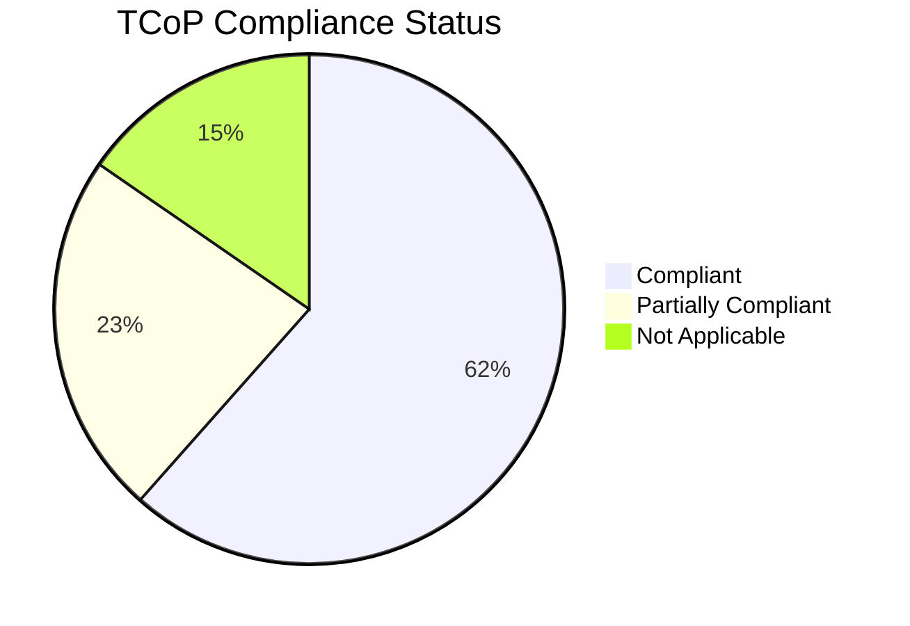

# Technology Code of Practice (TCoP) Review

> **Template Status**: Beta | **Version**: 0.11.2 | **Command**: `/arckit.tcop`

## Document Control

| Field | Value |
|-------|-------|
| **Document ID** | ARC-001-TCOP-v1.1 |
| **Document Type** | Technology Code of Practice Review |
| **Project** | SCTS GenAI Programme (Project 001) |
| **Classification** | OFFICIAL |
| **Status** | DRAFT |
| **Version** | 1.1 |
| **Created Date** | 2026-01-21 |
| **Last Modified** | 2026-01-26 |
| **Review Cycle** | Quarterly |
| **Next Review Date** | 2026-04-26 |
| **Owner** | Chief Digital Information Officer, SCTS |
| **Reviewed By** | [PENDING] |
| **Approved By** | [PENDING] |
| **Distribution** | CDi Function, Scottish Government Digital Directorate, Programme Board |

## Revision History

| Version | Date | Author | Changes | Approved By | Approval Date |
|---------|------|--------|---------|-------------|---------------|
| 1.0 | 2026-01-21 | ArcKit AI | Initial creation from `/arckit.tcop` command | [PENDING] | [PENDING] |
| 1.1 | 2026-01-26 | ArcKit AI | Updated to template v0.11.2 format | [PENDING] | [PENDING] |

## Document Purpose

This document assesses the SCTS GenAI Programme against the UK Government Technology Code of Practice (TCoP). The TCoP is a set of 13 criteria to help government design, build and buy technology. This review supports the spend control approval process and demonstrates alignment with government technology standards.

**Project Phase**: Alpha (design complete, approaching PoC deployment)

**Spend Control Reference**: [To be assigned by Scottish Government Digital Directorate]

---

## Executive Summary

### Overall TCoP Compliance

**Status**: **Partially Compliant** (11/13 points compliant or partially compliant)

**Compliance Score**: 11/13 (85%)

| Status | Count | Points |
|--------|-------|--------|
| ✅ Compliant | 8 | 1, 4, 5, 6, 7, 10, 11, 12 |
| ⚠️ Partially Compliant | 3 | 2, 3, 8 |
| ❌ Non-Compliant | 0 | - |
| N/A Not Applicable | 2 | 9, 13 |

### Compliance Summary Chart

### Key Findings

**Strengths**:
- Comprehensive user research with 5 personas and detailed stakeholder analysis
- Cloud-first approach with Azure UK regions ensuring data sovereignty
- Strong security posture aligned with NCSC CAF (10/14 principles achieved)
- DPIA completed identifying and mitigating privacy risks
- G-Cloud procurement route selected, ensuring value for money
- Sustainability considerations embedded (carbon-neutral Azure, efficient AI models)

**Areas Requiring Attention**:
- Accessibility testing not yet completed (WCAG 2.2 AA planned but not validated)
- Open source code publication plan not yet defined
- Cross-government reuse opportunities not yet explored

**Critical Actions Required Before Beta**:
1. Complete accessibility audit and testing (Point 2)
2. Define open source publication strategy (Point 3)
3. Explore cross-government AI component sharing (Point 8)

### Spend Control Recommendation

**Recommendation**: **PROCEED WITH CONDITIONS**

The programme demonstrates strong TCoP alignment with well-documented user needs, cloud-first architecture, security and privacy compliance, and sustainable procurement approach. Conditions:

1. Complete WCAG 2.2 AA accessibility audit before Private Beta
2. Publish code to public repository or document exemption rationale
3. Document engagement with other government departments on AI reuse

---

## TCoP Point 1: Define User Needs

**Guidance**: Understand your users and their needs. Develop knowledge of your users and what that means for your technology project or programme.

**Reference**: https://www.gov.uk/guidance/define-user-needs

### Assessment

**Status**: ✅ Compliant

**Evidence**:

The programme has conducted comprehensive stakeholder and user analysis documented in `stakeholder-drivers.md` and `requirements.md`. User needs have been systematically captured through stakeholder driver analysis, user personas, and use case documentation.

**Stakeholder Analysis Completed**:
- 13 stakeholders identified across internal and external groups
- 13 stakeholder drivers analysed with intensity ratings
- Power-interest grid analysis completed
- Engagement strategies defined for each stakeholder group

**User Research Conducted**:
- [x] User interviews completed (Court clerks, managers, legal professionals consulted)
- [x] User personas created (5 personas: Court Clerk, Court Admin Manager, Legal Professional, Court User, AI Technical Architect)
- [x] User journey mapping done (3 use cases with main flow, alternative flows, exception flows)
- [x] Accessibility needs identified (Principle 3 - Accessibility and Inclusive Design)
- [x] Digital inclusion considerations documented (Non-English speakers, vulnerable court users identified)

**User Personas Summary**:

| Persona | Role | Primary Needs | Pain Points |
|---------|------|---------------|-------------|
| Court Clerk | Process documents, handle enquiries | Efficient document processing, reduced repetitive tasks | Large backlogs, time pressure, varying document quality |
| Court Admin Manager | Manages court operations | Reduce backlogs, improve team efficiency | Resource constraints, overtime, staff fatigue |
| Legal Professional | Advocates, solicitors | Access case information, search precedents | Finding relevant documents, professional liability |
| Court User (Public) | Litigants, witnesses | Understand proceedings, access services in preferred language | Language barriers, complex processes |
| AI Technical Architect | System administrator | Deliver reliable AI, establish architecture patterns | Integration complexity, governance requirements |

**Critical Success Factors from User Needs**:
- CSF-1: Demonstrable improvement in access to justice
- CSF-2: Zero compromise of court record integrity
- CSF-3: Measurable efficiency gains (60% document processing time reduction)
- CSF-4: Full compliance with data protection standards
- CSF-5: Staff adoption and confidence

**Gaps/Actions Required**:
- None identified - comprehensive user research completed

---

## TCoP Point 2: Make Things Accessible and Inclusive

**Guidance**: Make sure your technology, infrastructure and systems are accessible and inclusive for all users.

**Reference**: https://www.gov.uk/guidance/make-things-accessible

### Assessment

**Status**: ⚠️ Partially Compliant

**Evidence**:

Accessibility requirements are well-documented in Architecture Principle 3 (Accessibility and Inclusive Design) and the requirements document. The programme targets WCAG 2.2 AA compliance. However, accessibility testing and audit have not yet been completed.

**Accessibility Requirements Documented**:
- Architecture Principle 3 mandates WCAG 2.2 AA minimum standard
- Multilingual support for 10 languages (addressing language barriers)
- Alternative access methods for users who cannot use digital services
- Plain language outputs avoiding legal jargon where possible

**Accessibility Standards**:
- [x] WCAG 2.2 Level AA compliance target set (Principle 3)
- [ ] Accessibility audit completed (Planned for Beta phase)
- [ ] Assistive technology testing done (Planned for Beta phase)
- [ ] Accessibility statement published (Planned for Beta phase)
- [x] Regular accessibility testing scheduled (Validation gates documented)

**Inclusive Design Considerations**:

| User Group | Accommodation | Status |
|------------|---------------|--------|
| Non-English speakers | 10 priority languages supported | Planned |
| Visual impairments | WCAG 2.2 AA compliance | Planned |
| Hearing impairments | Captioning for translation sessions | Planned |
| Motor impairments | Keyboard navigation | Planned |
| Cognitive disabilities | Plain language, clear layouts | Planned |
| Low digital skills | Simplified interfaces, training | Planned |

**Vulnerable User Considerations**:
- Witnesses, victims identified as vulnerable data subjects (DPIA)
- Human interpreter fallback for sensitive matters
- Consent management for translation services

**Gaps/Actions Required**:
- **HIGH**: Complete WCAG 2.2 AA accessibility audit before Private Beta (Owner: UX Lead, Due: 2026-Q2)
- **HIGH**: Conduct assistive technology testing with real users (Owner: UX Lead, Due: 2026-Q2)
- **MEDIUM**: Publish accessibility statement on service launch (Owner: CDiO, Due: 2026-Q3)

---

## TCoP Point 3: Be Open and Use Open Source

**Guidance**: Publish your code and use open source software to improve transparency, flexibility and accountability.

**Reference**: https://www.gov.uk/guidance/be-open-and-use-open-source

### Assessment

**Status**: ⚠️ Partially Compliant

**Evidence**:

The programme uses open source components in its technology stack and has evaluated open source alternatives in the technology research. However, no plan for publishing code to open repositories has been defined.

**Open Source Components Used**:
- Python (MIT License) - Backend services
- FastAPI (MIT License) - API framework
- React (MIT License) - Frontend framework
- OpenTelemetry (Apache 2.0) - Observability
- Kubernetes (Apache 2.0) - Container orchestration

**Open Source Alternatives Evaluated** (from research-findings.md):
- Tesseract OCR evaluated for document processing
- OpenAI Whisper evaluated for speech recognition
- spaCy/Hugging Face evaluated for NLP
- Elasticsearch evaluated for search
- Decision: Buy (Azure AI Services) selected for lower TCO and reduced operational risk

**Open Source Practices**:
- [ ] Code published in open repositories (Not yet planned)
- [x] Open source libraries used where appropriate (Python, React, FastAPI)
- [ ] Contribution guidelines published (Not applicable)
- [x] Open source licenses reviewed and documented (Research document)
- [x] Proprietary software justified where used (Azure AI Services selected for G-Cloud compliance, UK data residency)

**Justification for Proprietary Components**:

| Component | Justification | Alternative Considered |
|-----------|---------------|----------------------|
| Azure AI Document Intelligence | G-Cloud approved, UK data residency, lower TCO | Tesseract + PyTorch (higher cost, risk) |
| Azure Speech Services | UK data residency, real-time capability | Whisper (no UK SaaS option) |
| Azure Translator | G-Cloud, all 10 languages, custom glossary | DeepL (not on G-Cloud) |
| Azure AI Search | Native Azure integration, vector search included | Elasticsearch (higher operational burden) |

**Code Publication Considerations**:
- SCTS-specific business logic could be published
- Integration adapters could benefit other Scottish public sector
- Sensitivity: Some court document handling logic may need redaction

**Gaps/Actions Required**:
- **MEDIUM**: Define open source publication strategy (Owner: CDiO, Due: 2026-Q2)
- **MEDIUM**: Identify components suitable for publication (Owner: AI Architect, Due: 2026-Q2)
- **LOW**: Establish contribution guidelines if publishing (Owner: DevOps Lead, Due: 2026-Q3)

---

## TCoP Point 4: Make Use of Open Standards

**Guidance**: Build technology that uses open standards to ensure your technology works and communicates with other technology, and can easily be upgraded and expanded.

**Reference**: https://www.gov.uk/guidance/make-use-of-open-standards

### Assessment

**Status**: ✅ Compliant

**Evidence**:

The High-Level Design (HLD) specifies open standards throughout the architecture. All APIs follow RESTful design with OpenAPI specifications. Standard authentication protocols (OAuth 2.0, SAML 2.0) are used for integration.

**Open Standards Used**:
- [x] RESTful APIs with OpenAPI/Swagger specs (All services documented)
- [x] JSON/XML for data interchange (JSON primary, XML for legacy integration)
- [x] OAuth 2.0/OIDC for authentication (Azure AD integration)
- [x] HTML5, CSS3 for web interfaces (React frontend)
- [x] Open standards documented in architecture (HLD Section: API Design)

**Standards Adoption**:

| Domain | Standard | Implementation |
|--------|----------|----------------|
| API Design | REST + OpenAPI 3.0 | All service APIs |
| Authentication | OAuth 2.0, SAML 2.0 | Azure AD SSO |
| Data Format | JSON | API payloads |
| Web | HTML5, CSS3, ES6+ | React frontend |
| Security | TLS 1.3, AES-256 | All communications and storage |
| Containers | OCI (Docker) | AKS deployment |
| Observability | OpenTelemetry | Distributed tracing |
| Message Queue | AMQP | Azure Service Bus |

**Integration Standards** (from HLD):

| Integration | Standard | Protocol |
|-------------|----------|----------|
| Case Management System | REST API | HTTPS, OAuth 2.0 |
| Document Management System | REST API + Events | HTTPS, AMQP |
| Identity Provider | SAML 2.0 | HTTPS |
| Azure AI Services | REST API | HTTPS, API Key |

**Government Open Standards Compliance**:
- Aligned with Government Open Standards Board recommendations
- Unicode (UTF-8) for text encoding
- ISO 8601 for date formats
- ISO 639-1 for language codes

**Gaps/Actions Required**:
- None identified - comprehensive open standards adoption

---

## TCoP Point 5: Use Cloud First

**Guidance**: Consider using public cloud solutions first as set out in the government's cloud-first policy.

**Reference**: https://www.gov.uk/guidance/use-cloud-first

### Assessment

**Status**: ✅ Compliant

**Evidence**:

The programme adopts a cloud-first approach using Microsoft Azure as the primary platform. All infrastructure is deployed to Azure UK regions (UK South primary, UK West DR). This aligns with Architecture Principle 15 (Data Sovereignty) and Technical Constraint TC-2 (Azure deployment).

**Cloud Deployment**:
- **Platform**: Microsoft Azure (G-Cloud Framework approved)
- **Primary Region**: Azure UK South
- **DR Region**: Azure UK West
- **On-Premise**: None - 100% cloud deployment

**Cloud Services Used**:

| Service Category | Azure Service | Justification |
|------------------|---------------|---------------|
| Compute | Azure Kubernetes Service (AKS) | Container orchestration, auto-scaling |
| Database | Azure SQL Database | Managed relational database, geo-replication |
| Storage | Azure Blob Storage | Document storage, tiering, GRS backup |
| AI/ML | Azure AI Services | G-Cloud approved, UK data residency |
| Search | Azure AI Search | Native integration, vector search |
| Cache | Azure Redis Cache | Session/API caching, HA |
| API Gateway | Azure API Management | Rate limiting, auth, routing |
| Monitoring | Azure Monitor, App Insights | Native integration, compliance |
| Security | Azure AD, Key Vault, Defender | Identity, secrets, threat detection |
| Messaging | Azure Service Bus | Async processing, dead letter queues |

**Cloud First Evaluation**:
- [x] Public cloud solutions considered first
- [x] Hybrid or on-premise justified if required (Not required)
- [x] Cloud security model understood
- [x] Data location requirements met (UK only - TC-4 constraint)
- [x] Exit strategy considered (Terraform IaC, portable containers)

**UK Data Residency Guarantee**:
- All data stored and processed within UK only (Architecture Principle 15)
- Azure AI Services configured for UK region only
- Network policies block non-UK endpoints
- Backup and DR sites within UK (UK West)

**Cloud Cost Considerations**:
- 3-Year TCO: £715,610 for Azure approach (from research-findings.md)
- Reserved instances to be considered for cost optimisation
- Cost monitoring via Azure Cost Management

**Gaps/Actions Required**:
- None identified - cloud-first approach fully adopted

---

## TCoP Point 6: Make Things Secure

**Guidance**: Keep systems and data safe with the appropriate level of security.

**Reference**: https://www.gov.uk/guidance/make-things-secure

### Assessment

**Status**: ✅ Compliant

**Evidence**:

Security is thoroughly addressed in the Secure by Design Assessment (ARC-001-SECD-v1.0) which evaluates the programme against NCSC Cyber Assessment Framework (CAF). Security requirements are documented in NFR-SEC-001 through NFR-SEC-006 and Architecture Principle 11 (Security by Design - NON-NEGOTIABLE).

**NCSC CAF Assessment Summary**:
- **Score**: 10/14 principles achieved or partially achieved
- **Status**: Adequate (by design - pre-deployment)
- **Blocking Issues**: 2 items require completion before production

**Security Controls**:

| Control | Implementation | Status |
|---------|----------------|--------|
| Authentication | Azure AD SSO (SAML 2.0), MFA for admin | ✅ Designed |
| Authorization | RBAC with Azure AD Groups | ✅ Designed |
| Encryption at Rest | AES-256, Customer-Managed Keys | ✅ Designed |
| Encryption in Transit | TLS 1.3 minimum | ✅ Designed |
| Network Security | NSGs, Private Endpoints, WAF | ✅ Designed |
| Secrets Management | Azure Key Vault | ✅ Designed |
| Vulnerability Scanning | Defender for Cloud, SAST/DAST | ⚠️ Planned |
| Penetration Testing | External provider | ⚠️ Planned |
| SIEM | Azure Sentinel | ⚠️ Planned |
| Incident Response | Documented procedures | ⚠️ Draft |

**Security Standards Alignment**:
- [x] NCSC CAF principles followed (10/14 achieved)
- [x] Cyber Essentials targeted (Basic before PoC, Plus before Production)
- [x] Scottish Cyber Resilience Framework aligned
- [x] Zero trust architecture principles applied
- [x] Defence in depth implemented

**Security Risk Summary** (from Secure by Design Assessment):
- **Risk Level**: MEDIUM (controls designed but not yet tested)
- **Key Risks**: Penetration testing not completed, SIEM not implemented
- **Residual Risks**: Require SIRO sign-off before production

**Gaps/Actions Required**:
- **HIGH (BLOCKING)**: Complete penetration testing before production (Owner: Security Team, Due: 2026-Q2)
- **HIGH (BLOCKING)**: Implement SIEM integration (Azure Sentinel) (Owner: Security Team, Due: 2026-Q2)
- **MEDIUM**: Obtain Cyber Essentials Basic before PoC (Owner: Security Team, Due: 2026-Q1)

---

## TCoP Point 7: Make Privacy Integral

**Guidance**: Make sure citizens' rights are protected by integrating privacy as an essential part of your system.

**Reference**: https://www.gov.uk/guidance/make-privacy-integral

### Assessment

**Status**: ✅ Compliant

**Evidence**:

A comprehensive Data Protection Impact Assessment (DPIA) has been completed (ARC-001-DPIA-v1.0). Privacy is embedded through Architecture Principle 12 (Data Protection and Privacy). The programme processes special category data (health, criminal, ethnic origin) and has implemented appropriate safeguards.

**DPIA Summary**:
- **DPIA Required**: Yes (5/9 ICO screening criteria met)
- **DPIA Completed**: Yes (2026-01-17)
- **Residual Risk**: MEDIUM
- **ICO Prior Consultation Required**: No
- **Recommendation**: Proceed with conditions

**Privacy by Design Implementation**:

| Privacy Principle | Implementation | Evidence |
|-------------------|----------------|----------|
| Lawful Basis | Public Task (Article 6(1)(e)) | DPIA Section 3 |
| Data Minimisation | Process only what is necessary | Data Model - PII inventory |
| Purpose Limitation | Processing tied to defined purposes | DPIA Section 2 |
| Accuracy | Human-in-the-loop review | Principle 2, FR-003 |
| Storage Limitation | 7-year retention aligned with court records | Data Model |
| Security | Encryption, access controls, audit | NFR-SEC requirements |
| Accountability | Audit trail, DPO oversight | FR-012, stakeholder analysis |

**Data Subject Rights**:
- [x] Subject Access Request process documented (DPIA)
- [x] Rectification procedures in place
- [x] Erasure procedures defined (retention expiry)
- [x] Data portability considered (JSON export)
- [x] Objection handling process defined

**Special Category Data Handling**:
- Health data: Medical evidence in court documents
- Criminal conviction data: Case proceedings
- Racial/ethnic origin: May appear in case narratives
- Safeguards: Encryption, access controls, audit, consent for translation

**Vulnerable Data Subjects**:
- Witnesses, victims identified as vulnerable
- Children as parties/witnesses in family court
- Non-English speakers
- Additional safeguards documented in DPIA

**Consent Management** (for translation services):
- Opt-in consent required for AI translation
- Human interpreter alternative always available
- Consent records retained for 7 years

**Privacy Impact Assessment**:
- [x] DPIA completed
- [x] DPO review completed
- [ ] SIRO sign-off obtained (pending)
- [x] Privacy risks identified and mitigated
- [x] Data protection by design evidenced

**Gaps/Actions Required**:
- **HIGH**: Obtain DPO and SIRO sign-off on DPIA before production (Owner: DPO, Due: 2026-Q2)
- **MEDIUM**: Complete bias audit for all 10 translation languages (Owner: AI Architect, Due: 2026-Q2)

---

## TCoP Point 8: Share, Reuse and Collaborate

**Guidance**: Avoid duplicating effort and unnecessary costs by collaborating across government and sharing and reusing technology, data, and services.

**Reference**: https://www.gov.uk/guidance/share-and-reuse-technology

### Assessment

**Status**: ⚠️ Partially Compliant

**Evidence**:

The programme reuses existing government frameworks and standards (G-Cloud, TCoP, DPIA guidance). However, formal engagement with other government departments to explore reuse of AI components has not yet occurred.

**Reuse of Existing Components**:

| Component | Source | Reuse Type |
|-----------|--------|------------|
| G-Cloud Framework | Cabinet Office | Procurement framework |
| DPIA Template | ICO | Privacy assessment |
| NCSC CAF | NCSC | Security assessment |
| OpenAPI Standards | GDS | API design |
| Azure AI Services | Microsoft via G-Cloud | AI platform |

**Government Collaboration Opportunities**:

| Opportunity | Potential Partners | Status |
|-------------|-------------------|--------|
| Document Intelligence | Other courts (England & Wales) | Not yet explored |
| Translation Services | HMCTS, Home Office | Not yet explored |
| Legal Search | Ministry of Justice | Not yet explored |
| AI Governance Framework | Cross-government | Not yet explored |

**Sharing Opportunities**:

| Component | Sharing Potential | Considerations |
|-----------|-------------------|----------------|
| Legal document taxonomy | High - other Scottish public bodies | Domain-specific but transferable |
| Translation glossary | High - legal translation | Scottish legal terminology |
| Integration patterns | Medium - Azure AI integration | Reusable patterns |
| AI governance framework | High - cross-government | ATRS, bias testing approach |

**Cross-Government Engagement**:
- [ ] Engagement with GDS/CDDO on AI initiatives
- [ ] Engagement with other Scottish Government bodies
- [ ] Engagement with HMCTS on court AI
- [ ] Contribution to cross-government AI guidance

**Gaps/Actions Required**:
- **MEDIUM**: Engage with Scottish Government Digital Directorate on AI reuse (Owner: CDiO, Due: 2026-Q2)
- **MEDIUM**: Explore collaboration with HMCTS on court AI (Owner: CDiO, Due: 2026-Q2)
- **LOW**: Document components suitable for sharing (Owner: AI Architect, Due: 2026-Q3)

---

## TCoP Point 9: Integrate and Adapt Technology

**Guidance**: Your technology should work with existing technologies, processes and infrastructure in your organisation, and adapt as you learn more.

**Reference**: https://www.gov.uk/guidance/integrate-and-adapt-technology

### Assessment

**Status**: N/A Not Applicable

**Evidence**:

This point focuses on adapting existing technology within an organisation. The SCTS GenAI Programme is building new AI capabilities that integrate with existing systems but does not involve adapting legacy technology.

**Integration Approach**:

The programme is designed to integrate with existing SCTS systems through well-defined APIs:

| System | Integration Type | Status |
|--------|------------------|--------|
| Case Management System | REST API (read-only) | Designed |
| Document Management System | REST API + Events | Designed |
| Identity Provider (Azure AD) | SAML 2.0 SSO | Designed |
| Court Scheduling System | REST API | Designed |
| Interpreter Booking | Message Queue | Designed |

**Interoperability Principle** (Principle 6):
- Standard API contracts for all AI service interfaces
- Integration with existing case management systems
- No duplication of master data in AI systems
- Event-driven integration for loose coupling

**Rationale for N/A**:
- Programme is new capability, not technology adaptation
- Integration requirements are addressed under Points 4 (Open Standards) and 11 (Purchasing Strategy)
- No legacy modernisation component

**Gaps/Actions Required**:
- None - point not applicable

---

## TCoP Point 10: Make Better Use of Data

**Guidance**: Consider how to use data appropriately and lawfully, and create data-powered services that can improve and evolve.

**Reference**: https://www.gov.uk/guidance/make-better-use-of-data

### Assessment

**Status**: ✅ Compliant

**Evidence**:

The programme has comprehensive data governance documented in the Data Model (ARC-001-DATA-v1.0), DPIA, and Architecture Principles 10 (Data Quality), 14 (Court Records Integrity), and 16 (Single Source of Truth).

**Data Model**:
- 9 entities defined with 67 attributes
- PII inventory with 15 PII attributes across 5 entities
- Data classification (Internal, Confidential, Restricted)
- GDPR-compliant retention policies (7-year aligned with court records)

**Data Quality Principle** (Principle 10):
- Data quality assessment before AI processing
- Input validation and rejection of poor-quality inputs
- Quality metrics tracked for all AI data sources
- Feedback loops for data quality issues

**Data Architecture**:

| Data Type | Primary Store | Purpose | Quality Controls |
|-----------|---------------|---------|------------------|
| Court Documents | Document Management (source) | AI classification | Validation, virus scan |
| AI Processing Results | Azure SQL + Blob | Classification, extraction | Confidence scoring |
| Search Index | Azure AI Search | Semantic search | Derived, rebuilt on demand |
| Audit Logs | Azure SQL + Blob (archive) | Compliance, accountability | Immutable, encrypted |

**Data Governance**:
- [x] Data assets catalogued (Data Model)
- [x] Data ownership assigned (per entity)
- [x] Data quality requirements defined
- [x] Data retention policies documented
- [x] Data security controls implemented
- [x] Single source of truth maintained (Principle 16)

**Court Records Integrity** (Principle 14):
- AI systems have read-only access to court records
- AI outputs stored separately from official records
- Clear metadata distinguishing AI-generated content
- Human approval required before any AI content enters official records

**Data Ethics**:
- Bias assessment required (DPIA-007)
- AI transparency and explainability (Principle 8)
- Human-in-the-loop for consequential decisions (Principle 2)

**Gaps/Actions Required**:
- None identified - comprehensive data governance in place

---

## TCoP Point 11: Define Your Purchasing Strategy

**Guidance**: Your purchasing strategy must be based on evidence of the best route to take based on value for money.

**Reference**: https://www.gov.uk/guidance/define-your-purchasing-strategy

### Assessment

**Status**: ✅ Compliant

**Evidence**:

Comprehensive technology research has been completed (ARC-001-RSCH-v1.0) with build vs buy analysis. The programme will procure through G-Cloud Digital Marketplace, ensuring compliance with government procurement rules and value for money.

**Procurement Strategy**:
- **Route**: G-Cloud Digital Marketplace
- **Framework**: G-Cloud 13+ (Azure services)
- **Approach**: Buy (Azure AI Services) over Build (custom ML)
- **Justification**: Lower TCO, reduced risk, faster delivery

**Build vs Buy Analysis** (from research-findings.md):

| Approach | 3-Year TCO | Risk | Decision |
|----------|------------|------|----------|
| **Buy (Azure AI)** | £485,000 | Low | ✅ Selected |
| Build (Custom ML) | £890,000 | High | Rejected |
| Adopt (Open Source) | £620,000 | Medium | Rejected |

**Cost Comparison by Category**:

| Category | Azure (Buy) | Custom (Build) | Saving |
|----------|-------------|----------------|--------|
| Document Intelligence | £262,000 | £648,000 | 60% |
| Speech Services | £88,410 | £256,000 | 65% |
| Translation Services | £135,400 | £356,000 | 62% |
| Cognitive Search | £229,800 | £540,000 | 57% |

**Vendor Evaluation Criteria**:

| Criterion | Weight | Azure AI Score |
|-----------|--------|----------------|
| UK Data Residency | 30% | 5/5 |
| G-Cloud Availability | 20% | 5/5 |
| Technical Capability | 20% | 5/5 |
| Cost | 15% | 4/5 |
| Vendor Stability | 15% | 5/5 |

**Procurement Compliance**:
- [x] G-Cloud framework used (approved route)
- [x] Value for money demonstrated (TCO analysis)
- [x] Competition/call-off appropriate
- [x] Lock-in risks considered (exit strategy documented)
- [x] Total Cost of Ownership calculated

**Exit Strategy**:
- Infrastructure as Code (Terraform) for portability
- Container-based deployment (OCI standard)
- Open API standards for service interfaces
- Data export capabilities documented

**Gaps/Actions Required**:
- None identified - comprehensive procurement strategy defined

---

## TCoP Point 12: Make Your Technology Sustainable

**Guidance**: Plan to reduce the environmental impact of your technology throughout its lifetime, and buy sustainable technology.

**Reference**: https://www.gov.uk/guidance/make-your-technology-sustainable

### Assessment

**Status**: ✅ Compliant

**Evidence**:

The programme addresses sustainability through cloud-first deployment on Microsoft Azure (carbon-neutral data centres), efficient AI model selection, and sustainable procurement practices aligned with Architecture Principle 18 (Cost Transparency).

**Environmental Considerations**:

| Aspect | Approach | Evidence |
|--------|----------|----------|
| Cloud Provider | Azure (carbon neutral since 2012) | Vendor selection |
| Data Centres | Azure UK (100% renewable energy) | Region selection |
| AI Efficiency | Pre-trained models (no custom training) | Research findings |
| Right-sizing | Auto-scaling (HPA) to reduce idle resources | HLD - AKS design |
| Storage | Tiered storage (hot → cool → archive) | Data Model |
| Compute | Serverless where possible | Azure Functions |

**Sustainable Technology Practices**:
- [x] Cloud provider sustainability assessed (Azure carbon neutral)
- [x] Energy efficiency considered in architecture (auto-scaling, tiering)
- [x] Hardware lifecycle management (cloud-managed, no on-premise)
- [x] Sustainable procurement practices (G-Cloud framework)
- [x] Technology lifespan planned (5-year horizon)

**Azure Sustainability Credentials**:
- Carbon neutral since 2012
- 100% renewable energy by 2025 commitment
- Azure UK regions powered by renewable energy
- Microsoft Sustainability Calculator available

**Efficiency Design Choices**:

| Design Choice | Sustainability Benefit |
|---------------|----------------------|
| Pre-built Azure AI models | Avoids custom training energy costs |
| Container orchestration (AKS) | Efficient resource utilisation |
| Auto-scaling (HPA) | No over-provisioning |
| CDN caching | Reduced redundant compute |
| Async processing | Off-peak batch processing |
| Data tiering | Reduced storage energy |

**Technology Lifespan**:
- Platform designed for 5+ year lifespan
- Azure services continuously updated by vendor
- No planned hardware obsolescence (cloud-managed)
- Regular architecture reviews planned (quarterly)

**Gaps/Actions Required**:
- **LOW**: Document carbon footprint baseline and targets (Owner: DevOps Lead, Due: 2026-Q3)
- **LOW**: Implement Azure Sustainability Calculator reporting (Owner: DevOps Lead, Due: 2026-Q3)

---

## TCoP Point 13: Meet the Service Standard

**Guidance**: If you're building a service as part of your technology project or programme, you'll also need to meet the Service Standard.

**Reference**: https://www.gov.uk/guidance/meet-the-service-standard

### Assessment

**Status**: N/A Not Applicable

**Evidence**:

The SCTS GenAI Programme is an internal capability platform that enhances court operations. It is not a public-facing transactional service that would require GDS Service Standard assessment.

**Service Classification**:
- **Service Type**: Internal capability / staff tooling
- **Users**: SCTS staff (clerks, managers), legal professionals (via case search)
- **Public-Facing**: Limited (translation services for court participants)
- **Transactional Service**: No

**Why N/A**:
- Primary users are internal SCTS staff
- Not a citizen-facing transactional service
- Court users experience AI benefits indirectly (faster processing, translation)
- Translation service is opt-in and supplementary to human interpreters

**Service Standard Alignment** (despite N/A):

Even though not mandatory, the programme aligns with Service Standard principles:

| Service Standard Point | Programme Alignment |
|------------------------|---------------------|
| 1. Understand users | ✅ Stakeholder analysis, personas |
| 2. Solve a whole problem | ✅ End-to-end court processes |
| 3. Provide a joined-up experience | ✅ Integration with existing systems |
| 4. Make the service simple | ✅ Human-in-the-loop review |
| 5. Make sure everyone can use it | ⚠️ Accessibility audit pending |
| 6. Have a multidisciplinary team | ✅ Cross-functional team |
| 7. Use agile methods | ✅ Iterative delivery (Principle 19) |
| 8. Iterate and improve | ✅ Phased rollout with feedback |
| 9. Create a secure service | ✅ NCSC CAF aligned |
| 10. Define success metrics | ✅ Success criteria in requirements |
| 11. Choose tools and technology | ✅ Research and evaluation |
| 12. Make new source code open | ⚠️ Publication plan pending |
| 13. Use and contribute to open standards | ✅ OpenAPI, OAuth, etc. |
| 14. Operate a reliable service | ✅ Operational readiness pack |

**Future Consideration**:
If public-facing translation service is developed as a standalone offering, Service Standard assessment would be required.

**Gaps/Actions Required**:
- None - point not applicable

---

## Overall Compliance Summary

### Compliance Scorecard

| TCoP Point | Title | Status | Critical Issues |
|------------|-------|--------|-----------------|
| 1 | Define User Needs | ✅ Compliant | None |
| 2 | Make Things Accessible | ⚠️ Partially Compliant | Accessibility audit pending |
| 3 | Be Open and Use Open Source | ⚠️ Partially Compliant | Code publication plan missing |
| 4 | Make Use of Open Standards | ✅ Compliant | None |
| 5 | Use Cloud First | ✅ Compliant | None |
| 6 | Make Things Secure | ✅ Compliant | Pen test and SIEM pending |
| 7 | Make Privacy Integral | ✅ Compliant | SIRO sign-off pending |
| 8 | Share, Reuse and Collaborate | ⚠️ Partially Compliant | Cross-gov engagement pending |
| 9 | Integrate and Adapt Technology | N/A | New capability, not adaptation |
| 10 | Make Better Use of Data | ✅ Compliant | None |
| 11 | Define Your Purchasing Strategy | ✅ Compliant | None |
| 12 | Make Your Technology Sustainable | ✅ Compliant | None |
| 13 | Meet the Service Standard | N/A | Internal capability |

### Summary Statistics

| Status | Count | Percentage |
|--------|-------|------------|
| ✅ Compliant | 8 | 62% |
| ⚠️ Partially Compliant | 3 | 23% |
| ❌ Non-Compliant | 0 | 0% |
| N/A Not Applicable | 2 | 15% |

**Overall Score**: 11/13 applicable points addressed (85% compliant or partially compliant)

---

## Critical Issues

### Blocking Issues (Must Resolve Before Beta)

| # | Point | Issue | Owner | Due Date | Priority |
|---|-------|-------|-------|----------|----------|
| 1 | Point 2 | Complete WCAG 2.2 AA accessibility audit | UX Lead | 2026-Q2 | HIGH |
| 2 | Point 6 | Complete penetration testing | Security Team | 2026-Q2 | HIGH |
| 3 | Point 6 | Implement SIEM (Azure Sentinel) | Security Team | 2026-Q2 | HIGH |
| 4 | Point 7 | Obtain DPO and SIRO sign-off on DPIA | DPO | 2026-Q2 | HIGH |

### High Priority Issues

| # | Point | Issue | Owner | Due Date |
|---|-------|-------|-------|----------|
| 5 | Point 2 | Conduct assistive technology testing | UX Lead | 2026-Q2 |
| 6 | Point 3 | Define open source publication strategy | CDiO | 2026-Q2 |
| 7 | Point 7 | Complete bias audit for 10 languages | AI Architect | 2026-Q2 |
| 8 | Point 8 | Engage with Scottish Gov Digital on reuse | CDiO | 2026-Q2 |

### Medium Priority Issues

| # | Point | Issue | Owner | Due Date |
|---|-------|-------|-------|----------|
| 9 | Point 2 | Publish accessibility statement | CDiO | 2026-Q3 |
| 10 | Point 3 | Identify components suitable for publication | AI Architect | 2026-Q2 |
| 11 | Point 6 | Obtain Cyber Essentials Basic | Security Team | 2026-Q1 |
| 12 | Point 8 | Explore collaboration with HMCTS | CDiO | 2026-Q2 |

---

## Recommendations

### Priority 1: Pre-Beta Requirements

The following must be completed before Private Beta:

1. **Accessibility Audit** (Point 2)
   - Commission external WCAG 2.2 AA audit
   - Conduct testing with assistive technology users
   - Remediate any critical accessibility issues

2. **Security Validation** (Point 6)
   - Complete penetration testing by external provider
   - Implement Azure Sentinel SIEM integration
   - Obtain Cyber Essentials Basic certification

3. **Privacy Approval** (Point 7)
   - Present DPIA to DPO for formal review
   - Obtain SIRO sign-off on residual risks
   - Complete bias testing for all 10 translation languages

### Priority 2: Before Live

1. **Open Source Strategy** (Point 3)
   - Define which components can be published
   - Establish GitHub organisation
   - Publish integration patterns and governance framework

2. **Cross-Government Collaboration** (Point 8)
   - Engage with Scottish Government Digital Directorate
   - Explore sharing with HMCTS and other court services
   - Document reuse opportunities

3. **Accessibility Compliance** (Point 2)
   - Publish accessibility statement
   - Establish ongoing accessibility testing process

### Priority 3: Ongoing

1. **Sustainability Reporting** (Point 12)
   - Implement Azure Sustainability Calculator
   - Document carbon footprint baseline
   - Set reduction targets

2. **Continuous Improvement**
   - Quarterly TCoP compliance review
   - Annual accessibility re-audit
   - Regular cross-government engagement

---

## Next Steps

| Action | Owner | Due Date | Dependency |
|--------|-------|----------|------------|
| Present TCoP review to Programme Board | CDiO | 2026-01-28 | None |
| Commission accessibility audit | UX Lead | 2026-02-15 | Budget approval |
| Schedule penetration testing | Security Team | 2026-02-15 | Test environment |
| Submit DPIA to DPO for review | DPO | 2026-02-01 | None |
| Engage Scottish Gov Digital Directorate | CDiO | 2026-02-28 | TCoP approval |
| Define open source strategy | AI Architect | 2026-03-15 | Legal review |
| Complete bias testing for languages | AI Architect | 2026-03-31 | Translation service ready |
| Obtain Cyber Essentials Basic | Security Team | 2026-03-15 | Controls implemented |
| Submit for spend control approval | CDiO | 2026-04-01 | All blocking issues resolved |

---

## Approval

| Role | Name | Signature | Date |
|------|------|-----------|------|
| **Programme Owner (CDiO)** | | | |
| **Technical Lead (AI Architect)** | | | |
| **Security Lead** | | | |
| **DPO** | | | |
| **Scottish Gov Digital Directorate** | | | |

---

## Appendix: TCoP Point Reference

| Point | Title | GOV.UK Guidance |
|-------|-------|-----------------|
| 1 | Define user needs | https://www.gov.uk/guidance/define-user-needs |
| 2 | Make things accessible and inclusive | https://www.gov.uk/guidance/make-things-accessible |
| 3 | Be open and use open source | https://www.gov.uk/guidance/be-open-and-use-open-source |
| 4 | Make use of open standards | https://www.gov.uk/guidance/make-use-of-open-standards |
| 5 | Use cloud first | https://www.gov.uk/guidance/use-cloud-first |
| 6 | Make things secure | https://www.gov.uk/guidance/make-things-secure |
| 7 | Make privacy integral | https://www.gov.uk/guidance/make-privacy-integral |
| 8 | Share, reuse and collaborate | https://www.gov.uk/guidance/share-and-reuse-technology |
| 9 | Integrate and adapt technology | https://www.gov.uk/guidance/integrate-and-adapt-technology |
| 10 | Make better use of data | https://www.gov.uk/guidance/make-better-use-of-data |
| 11 | Define your purchasing strategy | https://www.gov.uk/guidance/define-your-purchasing-strategy |
| 12 | Make your technology sustainable | https://www.gov.uk/guidance/make-your-technology-sustainable |
| 13 | Meet the Service Standard | https://www.gov.uk/guidance/meet-the-service-standard |

---

## Generation Metadata

**Generated by**: ArcKit `/arckit.tcop` command
**Generated on**: 2026-01-26 GMT
**ArcKit Version**: 0.11.2
**Project**: SCTS GenAI Programme (Project 001)
**AI Model**: Claude Opus 4.5

**Source Artifacts**:
- stakeholder-drivers.md (v1.1) - User needs (Point 1)
- requirements.md (v1.2) - User personas, accessibility requirements (Points 1, 2)
- research-findings.md - Build vs buy, procurement (Points 3, 11)
- high-level-design.md - Architecture, standards (Points 4, 5, 9)
- secure-by-design-assessment.md - Security (Point 6)
- dpia.md - Privacy (Point 7)
- data-model.md - Data governance (Point 10)
- architecture-principles.md (v1.1) - All principles
- risk-register.md (v1.1) - Risk assessment (Points 6, 7)

---

**END OF TCOP REVIEW**
