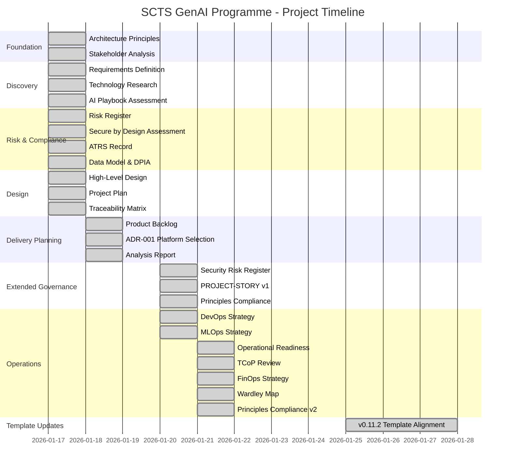
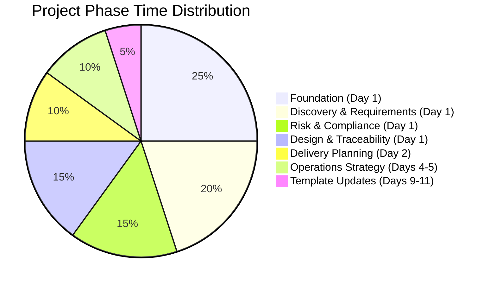
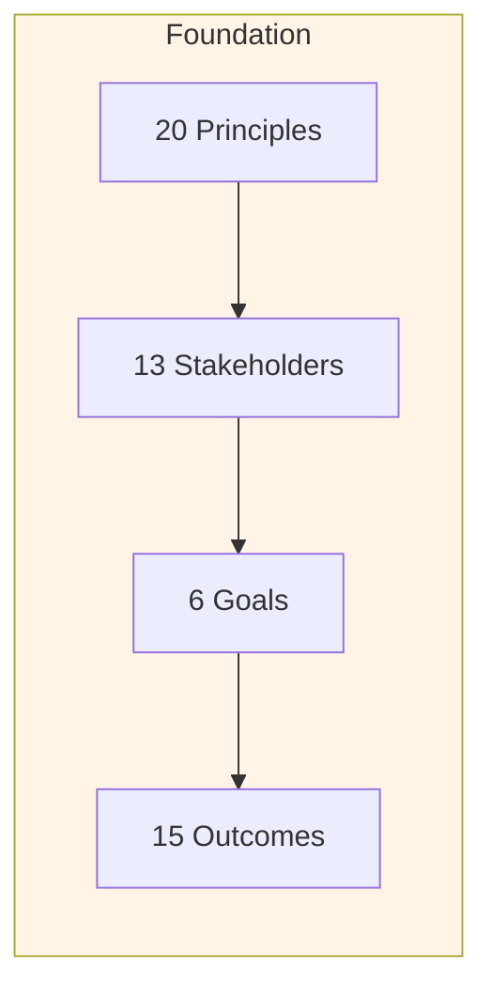
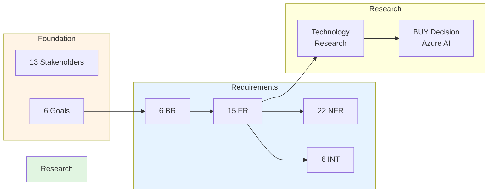
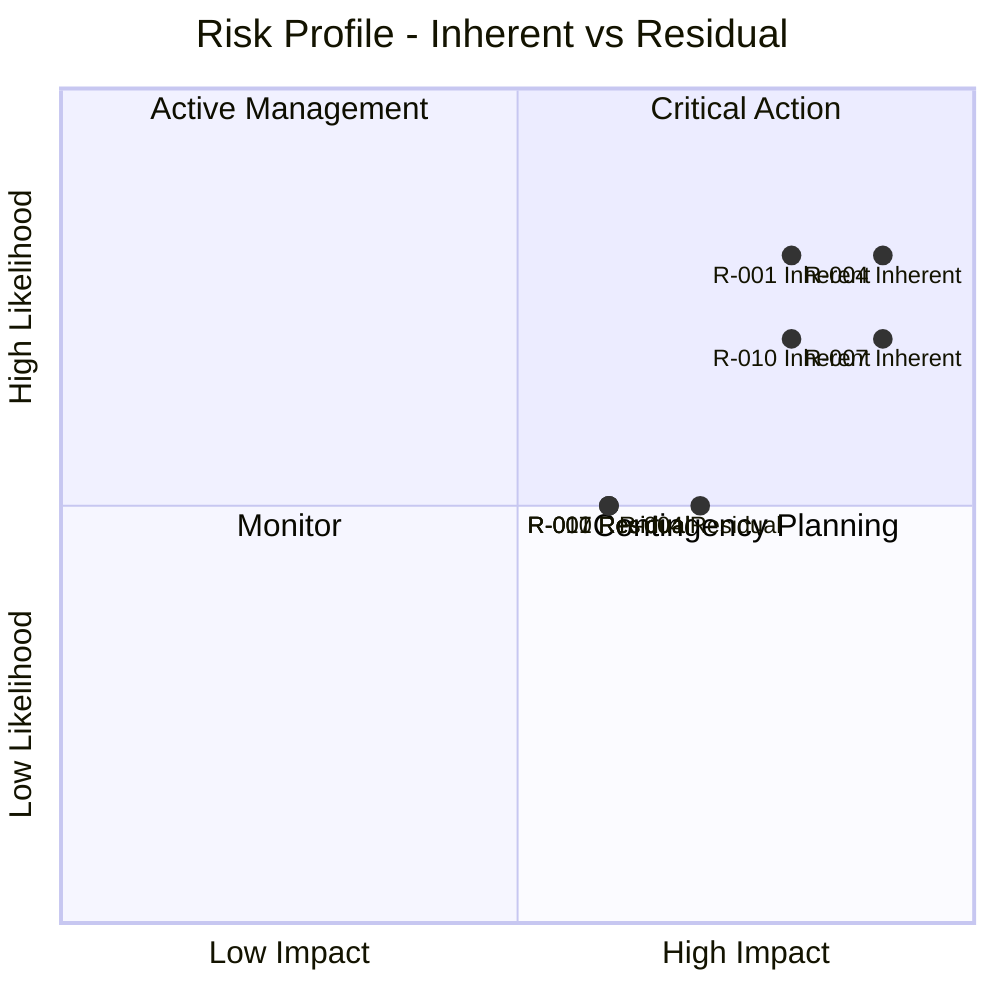
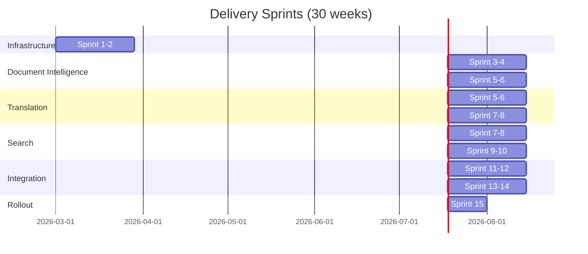
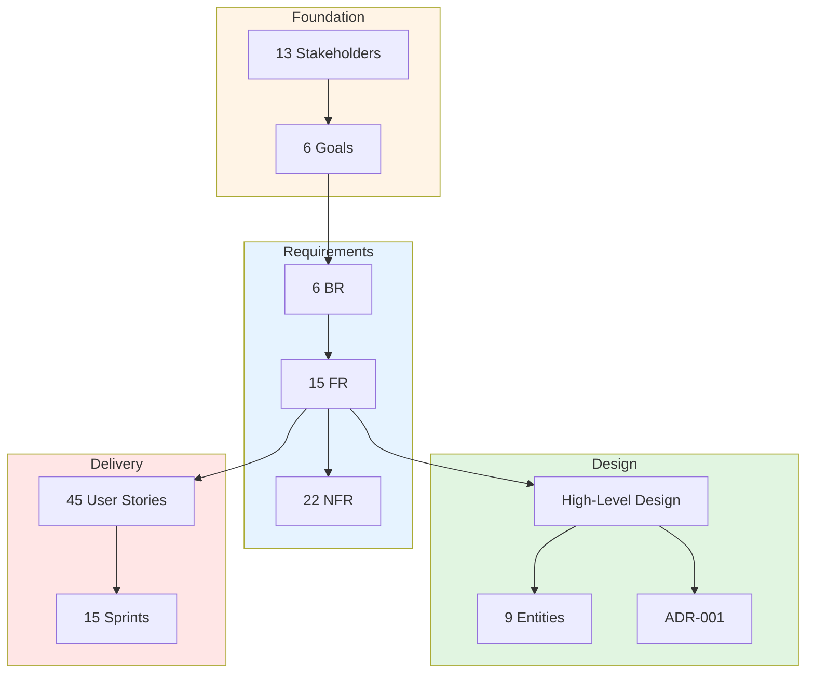
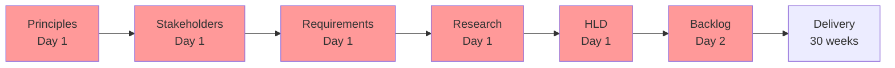
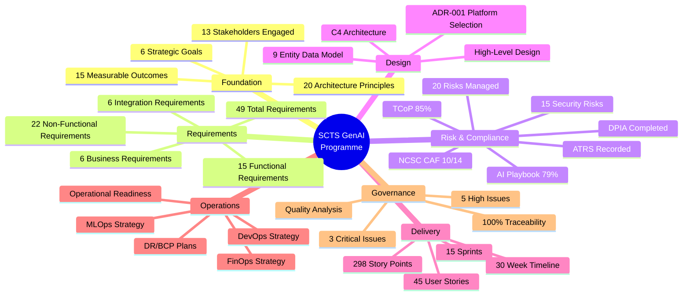

# SCTS GenAI Programme - Project Story

> **Template Status**: Live | **Version**: 0.11.2 | **Command**: `/arckit.story`

## Document Control

| Field | Value |
|-------|-------|
| **Document ID** | ARC-001-STORY-v2.0 |
| **Document Type** | Project Story |
| **Project** | SCTS GenAI Programme (Project 001) |
| **Classification** | OFFICIAL-SENSITIVE |
| **Status** | DRAFT |
| **Version** | 2.0 |
| **Created Date** | 2026-01-20 |
| **Last Modified** | 2026-01-27 |
| **Review Cycle** | On-Demand |
| **Next Review Date** | 2026-02-27 |
| **Owner** | Chief Digital Information Officer, SCTS |
| **Reviewed By** | PENDING |
| **Approved By** | PENDING |
| **Distribution** | CDi Function, Architecture Team, Legal Services, DPO, Steering Committee |

## Revision History

| Version | Date | Author | Changes | Approved By | Approval Date |
|---------|------|--------|---------|-------------|---------------|
| 2.0 | 2026-01-27 | ArcKit AI | Major update: extended timeline to 11 days, 25 artifacts, comprehensive v0.11.2 updates | PENDING | PENDING |
| 1.0 | 2026-01-20 | ArcKit AI | Initial creation from `/arckit.story` command | PENDING | PENDING |

---

## Executive Summary

**Project**: SCTS GenAI Programme

**Timeline Snapshot**:
- **Project Start**: 2026-01-17
- **Project End**: 2026-01-27 (Ongoing)
- **Total Duration**: 11 days (intensive governance sprint)
- **Artifacts Created**: 25 governance artifacts
- **Commands Executed**: 22+ ArcKit commands
- **Phases Completed**: Discovery, Alpha, Design Review, Delivery Planning, Compliance

**Key Outcomes**:
- Comprehensive AI governance framework established for Scottish Courts
- Full UK Government compliance pathway defined (AI Playbook 79%, TCoP 85%, NCSC CAF 10/14)
- Azure AI platform selected via rigorous evaluation (3-year TCO: £485K)
- 45 user stories across 15 sprints (30 weeks) planned for delivery
- End-to-end traceability from 13 stakeholders through 49 requirements to delivery backlog

**Governance Achievements**:
- ✅ 20 Architecture Principles Established (justice-centred, ethical AI)
- ✅ 13 Stakeholders Analyzed → 6 Strategic Goals → 15 Measurable Outcomes
- ✅ 20 Risks Identified (37% reduction through controls)
- ✅ 15 Security Risks with NCSC CAF alignment
- ✅ 49 Requirements Defined (6 BR, 15 FR, 22 NFR, 6 INT)
- ✅ 9 Entity Data Model (GDPR compliant, UK data residency)
- ✅ High-Level Design with C4 Architecture
- ✅ Build vs Buy Analysis: BUY decision (Azure AI Services via G-Cloud)
- ✅ 45 User Stories → 15 Sprints (30 weeks delivery)
- ✅ Traceability Matrix: 100% requirements coverage
- ✅ Quality Analysis: 3 critical, 5 high, 8 medium issues identified

**Strategic Context**:

The Scottish Courts and Tribunals Service (SCTS) embarked on a pioneering programme to introduce AI and automation across key justice services. Facing growing demand, case backlogs, and the need to improve access for diverse populations including non-English speakers, SCTS required a comprehensive governance framework that balances innovation with the conservative risk appetite appropriate for a justice environment.

This project story documents the 11-day intensive governance sprint that established the foundation for responsible AI deployment, from stakeholder analysis through to delivery planning, with full UK Government compliance alignment.

---

## 📅 Complete Project Timeline

### Visual Timeline - Gantt Chart

### Visual Timeline - Command Flow

```mermaid
flowchart TD
    Start([Project Initiated<br/>2026-01-17]) --> Day1

    subgraph Day1[Day 1: 2026-01-17 - Foundation Sprint]
        Principles["/arckit.principles<br/>Architecture Principles<br/>20 principles"]
        Stakeholders["/arckit.stakeholders<br/>13 stakeholders, 6 goals"]
        Requirements["/arckit.requirements<br/>49 requirements"]
        Research["/arckit.research<br/>Build vs Buy: BUY"]
        AIPlaybook["/arckit.ai-playbook<br/>79% compliance"]
        Risk["/arckit.risk<br/>20 risks"]
        Secure["/arckit.secure<br/>NCSC CAF 10/14"]
        ATRS["/arckit.atrs<br/>Algorithmic transparency"]
        DataModel["/arckit.data-model<br/>9 entities"]
        DPIA["/arckit.dpia<br/>GDPR assessment"]
        HLD["/arckit.diagram<br/>C4 architecture"]
        Plan["/arckit.plan<br/>Project timeline"]
        Trace["/arckit.traceability<br/>100% coverage"]
    end

    subgraph Day2[Day 2: 2026-01-18 - Delivery Planning]
        Backlog["/arckit.backlog<br/>45 stories, 15 sprints"]
        ADR["/arckit.adr<br/>Azure selection"]
        Analyze["/arckit.analyze<br/>Quality report"]
    end

    subgraph Day4[Days 4-5: 2026-01-20-21 - Operations]
        SecRisk["/arckit.risk<br/>Security focus"]
        Story1["/arckit.story<br/>v1.0"]
        Compliance1["/arckit.principles-compliance"]
        DevOps["/arckit.devops<br/>CI/CD strategy"]
        MLOps["/arckit.mlops<br/>Model lifecycle"]
        Ops["/arckit.operationalize<br/>Runbooks, DR"]
        TCoP["/arckit.tcop<br/>85% compliance"]
        FinOps["/arckit.finops<br/>Cost governance"]
        Wardley["/arckit.wardley<br/>Strategic map"]
        Compliance2["/arckit.principles-compliance"]
    end

    subgraph Day9[Days 9-11: 2026-01-25-27 - Template Alignment]
        Templates[Template v0.11.2<br/>All artifacts updated]
        Pages["/arckit.pages<br/>GitHub Pages"]
        Story2["/arckit.story<br/>v2.0"]
    end

    Day1 --> Day2 --> Day4 --> Day9 --> End([Current State<br/>2026-01-27])

    style Start fill:#e1f5e1
    style End fill:#e1f5e1
    style Day1 fill:#fff4e6
    style Day2 fill:#e6f3ff
    style Day4 fill:#f0e6ff
    style Day9 fill:#ffe6e6
```

### Timeline Table

| # | Date | Days | Phase | Command | Artifact | Key Metrics |
|---|------|------|-------|---------|----------|-------------|
| 1 | 2026-01-17 | 0 | Foundation | `/arckit.principles` | architecture-principles.md | 20 principles established |
| 2 | 2026-01-17 | 0 | Foundation | `/arckit.stakeholders` | stakeholder-drivers.md | 13 stakeholders, 6 goals, 15 outcomes |
| 3 | 2026-01-17 | 0 | Discovery | `/arckit.requirements` | requirements.md | 49 requirements (6 BR, 15 FR, 22 NFR, 6 INT) |
| 4 | 2026-01-17 | 0 | Discovery | `/arckit.research` | research-findings.md | BUY decision, £485K 3-year TCO |
| 5 | 2026-01-17 | 0 | Compliance | `/arckit.ai-playbook` | ai-playbook-assessment.md | 79% compliance (126/160) |
| 6 | 2026-01-17 | 0 | Risk | `/arckit.risk` | risk-register.md | 20 risks, 37% reduction |
| 7 | 2026-01-17 | 0 | Security | `/arckit.secure` | secure-by-design-assessment.md | NCSC CAF 10/14 principles |
| 8 | 2026-01-17 | 0 | Compliance | `/arckit.atrs` | atrs-record.md | Algorithmic transparency |
| 9 | 2026-01-17 | 0 | Data | `/arckit.data-model` | data-model.md | 9 entities, 67 attributes |
| 10 | 2026-01-17 | 0 | Privacy | `/arckit.dpia` | dpia.md | UK GDPR assessment |
| 11 | 2026-01-17 | 0 | Design | `/arckit.diagram` | high-level-design.md | C4 architecture |
| 12 | 2026-01-17 | 0 | Planning | `/arckit.plan` | project-plan.md | GDS Agile phases |
| 13 | 2026-01-17 | 0 | Governance | `/arckit.traceability` | traceability-matrix.md | 100% requirements coverage |
| 14 | 2026-01-18 | 1 | Delivery | `/arckit.backlog` | backlog.md | 45 stories, 298 points, 15 sprints |
| 15 | 2026-01-18 | 1 | Decisions | `/arckit.adr` | ADR-001-azure-ai-platform-selection.md | Azure AI platform |
| 16 | 2026-01-18 | 1 | Analysis | `/arckit.analyze` | analysis-report.md | 3 critical, 5 high issues |
| 17 | 2026-01-20 | 3 | Security | `/arckit.risk` | security-risk-register.md | 15 security risks |
| 18 | 2026-01-20 | 3 | Story | `/arckit.story` | PROJECT-STORY.md | v1.0 project narrative |
| 19 | 2026-01-20 | 3 | Compliance | `/arckit.principles-compliance` | principles-compliance-assessment-2026-01-20.md | Compliance check |
| 20 | 2026-01-20 | 3 | Operations | `/arckit.devops` | devops-strategy.md | CI/CD, IaC, containers |
| 21 | 2026-01-20 | 3 | Operations | `/arckit.mlops` | mlops-strategy.md | Model lifecycle |
| 22 | 2026-01-21 | 4 | Operations | `/arckit.operationalize` | operational-readiness.md | Runbooks, DR/BCP |
| 23 | 2026-01-21 | 4 | Compliance | `/arckit.tcop` | tcop-review.md | 85% TCoP compliance |
| 24 | 2026-01-21 | 4 | Operations | `/arckit.finops` | finops-strategy.md | Cloud cost governance |
| 25 | 2026-01-21 | 4 | Strategy | `/arckit.wardley` | wardley-maps/current-state-procurement.md | Strategic positioning |
| 26 | 2026-01-21 | 4 | Compliance | `/arckit.principles-compliance` | principles-compliance-assessment-2026-01-21.md | Updated compliance |
| 27 | 2026-01-25-27 | 8-10 | Templates | (bulk update) | All artifacts | v0.11.2 template alignment |
| 28 | 2026-01-27 | 10 | Documentation | `/arckit.pages` | docs/manifest.json | GitHub Pages site |
| 29 | 2026-01-27 | 10 | Story | `/arckit.story` | PROJECT-STORY.md | v2.0 (this document) |

### Phase Duration Analysis

### Timeline Metrics

| Metric | Value | Analysis |
|--------|-------|----------|
| **Project Duration** | 11 days | Intensive governance sprint |
| **Artifacts Created** | 25 | 2.3 artifacts/day average |
| **Commands Executed** | 22+ | Comprehensive ArcKit coverage |
| **Day 1 Output** | 13 artifacts | Foundation sprint |
| **Day 2 Output** | 3 artifacts | Delivery planning focus |
| **Days 4-5 Output** | 9 artifacts | Operations and compliance |
| **Peak Velocity** | Day 1 (13 artifacts) | Foundation establishment |
| **Requirements per Day** | 4.5 requirements/day | High throughput |
| **Stakeholders to Stories** | 13 → 45 | 3.5x expansion ratio |

---

## Chapter 1: Foundation - Establishing the Governance Framework

### Timeline Context
**Date**: 2026-01-17 (Day 1)
**Duration**: 1 day
**Percentage of Project**: 25%

### What Happened

The project began with the establishment of foundational governance artifacts. In a single intensive day, the team created the architecture principles, stakeholder analysis, and initial governance framework.

### Architecture Principles Established

The `/arckit.principles` command established 20 architecture principles across 4 categories:

**Strategic Principles (5)**:
1. Justice-Centred Design
2. Human-in-the-Loop (NON-NEGOTIABLE)
3. Accessibility for All Court Users
4. Scalability for Growing Demand
5. Operational Resilience

**Ethical & AI Principles (5)**:
6. AI Transparency and Explainability
7. Fairness and Bias Prevention
8. AI Confidence Thresholds
9. Continuous AI Improvement
10. Staff Empowerment, Not Replacement

**Technical Principles (5)**:
11. Security by Design (NON-NEGOTIABLE)
12. Data Protection and Privacy
13. Cloud-First, Azure-Native
14. Court Records Integrity (NON-NEGOTIABLE)
15. Data Sovereignty and Residency

**Operational Principles (5)**:
16. Integration with Existing Systems
17. Observability and Monitoring
18. Graceful Degradation
19. Sustainable Technology
20. Automation First

### Stakeholder Analysis

The `/arckit.stakeholders` command identified:

- **13 Stakeholders** across internal and external groups
- **6 Strategic Goals** aligned with justice mission
- **15 Measurable Outcomes** with specific KPIs

**Key Stakeholders**:

| Stakeholder | Role | Influence | Interest |
|-------------|------|-----------|----------|
| Lord President | Head of Judiciary | HIGH | HIGH |
| Chief Executive | SCTS Leadership | HIGH | HIGH |
| Chief Digital Information Officer | CDi Function | HIGH | HIGH |
| Cabinet Secretary for Justice | Scottish Government | HIGH | HIGH |
| Data Protection Officer | Privacy Compliance | HIGH | MEDIUM |
| Legal Services Director | Compliance Review | HIGH | MEDIUM |
| Court Administration Managers | Operations | MEDIUM | HIGH |
| Court Users / Litigants | Service Beneficiaries | LOW | HIGH |

**Strategic Goals**:

| Goal ID | Goal | Owner | Success Metric |
|---------|------|-------|----------------|
| G-1 | Improve operational efficiency | Chief Executive | 25% cases/FTE improvement |
| G-2 | Enhance access to justice | Cabinet Secretary | 20% Access Index improvement |
| G-3 | Reduce manual processing | CDiO | 60% document time reduction |
| G-4 | Maintain judicial confidence | Lord President | Zero AI incidents on records |
| G-5 | Ensure regulatory compliance | DPO | 100% GDPR compliance |
| G-6 | Enable staff effectiveness | HR Director | 80% staff adoption |

### Traceability Chain Initiated

---

## Chapter 2: Discovery - Requirements and Research

### Timeline Context
**Date**: 2026-01-17 (Day 1)
**Duration**: Concurrent with Foundation
**Percentage of Project**: 20%

### What Happened

Requirements definition and technology research ran in parallel with foundation activities, rapidly establishing the scope and technical direction.

### Requirements Defined

The `/arckit.requirements` command produced:

**49 Total Requirements**:
- **6 Business Requirements (BR)**: High-level business needs
- **15 Functional Requirements (FR)**: System capabilities
- **22 Non-Functional Requirements (NFR)**: Quality attributes
- **6 Integration Requirements (INT)**: External system connections

**Priority Breakdown**:
- MUST_HAVE: 35 requirements (71%)
- SHOULD_HAVE: 10 requirements (20%)
- COULD_HAVE: 4 requirements (9%)

**Key Business Requirements**:

| BR ID | Requirement | Priority | Success Metric |
|-------|-------------|----------|----------------|
| BR-001 | Improve Court Operational Efficiency | MUST | 60% document processing time reduction |
| BR-002 | Enhance Access to Justice for Non-English Speakers | MUST | 10 languages, 85% accuracy |
| BR-003 | Protect Court Record Integrity | MUST | Zero AI modifications to records |
| BR-004 | Comply with Data Protection Regulations | MUST | 100% UK GDPR compliance |
| BR-005 | Enable Judicial Confidence in AI | MUST | Explainable AI outputs |
| BR-006 | Support Staff Effectiveness | SHOULD | 80% adoption rate |

### Technology Research

The `/arckit.research` command evaluated:

**Categories Researched**:
1. Document Intelligence
2. Speech Services
3. Translation Services
4. Cognitive Search

**Build vs Buy Analysis**:

| Option | 3-Year TCO | Risk | Recommendation |
|--------|-----------|------|----------------|
| BUY (Azure AI Services) | £485,000 | LOW | ✅ RECOMMENDED |
| BUILD (Custom + OSS) | £890,000 | HIGH | ❌ |
| ADOPT (Whisper + Elastic) | £620,000 | MEDIUM | ❌ |

**Decision**: **BUY** - Azure AI Services via G-Cloud

**Rationale**:
- G-Cloud approved (procurement compliance)
- UK data centres (data sovereignty requirement TC-4)
- Integrated ecosystem (lower integration risk)
- Proven enterprise scalability
- Comprehensive support and SLAs

### Traceability Chain Extended

---

## Chapter 3: Risk and Compliance Assessment

### Timeline Context
**Date**: 2026-01-17 (Day 1), 2026-01-20-21 (Days 4-5)
**Duration**: 3 days total
**Percentage of Project**: 25%

### What Happened

Comprehensive risk assessment and compliance reviews established the project's risk profile and regulatory alignment.

### Risk Register (Orange Book)

The `/arckit.risk` command produced:

**20 Risks Identified** across 6 categories:

| Category | Count | Avg Inherent | Avg Residual | Control Effectiveness |
|----------|-------|--------------|--------------|----------------------|
| STRATEGIC | 4 | 16.0 | 10.3 | 36% reduction |
| OPERATIONAL | 4 | 12.0 | 7.5 | 38% reduction |
| FINANCIAL | 3 | 13.0 | 8.0 | 38% reduction |
| COMPLIANCE | 3 | 14.7 | 9.0 | 39% reduction |
| REPUTATIONAL | 3 | 15.3 | 9.3 | 39% reduction |
| TECHNOLOGY | 3 | 13.3 | 8.3 | 38% reduction |

**Overall Risk Reduction**: 37% (267 → 168 total score)

**Risks Exceeding Appetite**:

| Risk ID | Title | Residual | Appetite | Excess |
|---------|-------|----------|----------|--------|
| R-001 | Judicial loss of confidence | 15 | 12 | +3 |
| R-004 | AI quality issues damage reputation | 16 | 12 | +4 |
| R-007 | Security breach of court data | 15 | 12 | +3 |
| R-010 | UK GDPR non-compliance | 15 | 12 | +3 |

### Security Risk Register

The focused security assessment identified:

**15 Security Risks** across 5 domains:

| Domain | Count | Avg Inherent | Avg Residual | Control Effectiveness |
|--------|-------|--------------|--------------|----------------------|
| Access Control & Identity | 3 | 14.3 | 8.0 | 44% reduction |
| Data Protection | 4 | 15.5 | 9.3 | 40% reduction |
| Infrastructure Security | 3 | 15.0 | 8.3 | 44% reduction |
| AI/ML Security | 3 | 13.3 | 7.3 | 45% reduction |
| Incident Response | 2 | 12.0 | 7.0 | 42% reduction |

**Overall Security Risk Reduction**: 41%

### Compliance Assessments

**AI Playbook Assessment** (`/arckit.ai-playbook`):
- **Score**: 126/160 (79%)
- **Status**: PARTIALLY COMPLIANT
- **Critical Issues**: 3 blocking issues

**TCoP Review** (`/arckit.tcop`):
- **Score**: 11/13 (85%)
- **Status**: PARTIALLY COMPLIANT
- **Compliant Points**: 1, 4, 5, 6, 7, 10, 11, 12
- **Partially Compliant**: 2, 3, 8
- **N/A**: 9, 13

**Secure by Design Assessment** (`/arckit.secure`):
- **NCSC CAF Score**: 10/14 principles achieved
- **Cyber Essentials**: Planned (Basic before PoC, Plus before Production)
- **Overall Security Posture**: MEDIUM

**ATRS Record** (`/arckit.atrs`):
- Algorithmic Transparency Recording Standard completed
- Required for public sector AI deployment

**DPIA** (`/arckit.dpia`):
- Data Protection Impact Assessment completed
- Special category data handling documented
- Lawful basis: Public Task (Article 6(1)(e))

### Risk Visualization

---

## Chapter 4: Architecture Design

### Timeline Context
**Date**: 2026-01-17 (Day 1)
**Duration**: 1 day
**Percentage of Project**: 15%

### What Happened

Architecture design established the technical foundation with C4 diagrams, data model, and high-level design documentation.

### High-Level Design

The `/arckit.diagram` command produced:

**Design Philosophy**:
- **Human-in-the-Loop**: AI augments; humans remain accountable
- **Cloud-First, Azure-Native**: Leverage Azure AI Services
- **UK Data Sovereignty**: All processing in UK Azure regions
- **Graceful Degradation**: Courts function without AI

**Architecture Highlights**:

| Aspect | Design Decision |
|--------|-----------------|
| Deployment | Azure UK South (primary), UK West (DR) |
| AI Platform | Azure AI Services (Document Intelligence, Speech, Translator, Search) |
| Integration | REST APIs with Azure API Management |
| Data | Azure SQL Database, Blob Storage, AI Search Index |
| Security | Zero-trust, Azure AD SSO, encryption at rest/transit |
| Scalability | Horizontal auto-scaling via AKS |

**Key Metrics**:

| Metric | Target | Design Capacity |
|--------|--------|-----------------|
| Document throughput | 500K/year → 2M/year | 10K documents/day |
| Translation sessions | 100/year → 1,000/year | 50 concurrent |
| Search index size | 5M → 10M documents | 10TB capacity |
| API response time | < 2 seconds (p95) | < 500ms typical |
| Availability | 99.5% | 99.9% design target |

### Data Model

The `/arckit.data-model` command produced:

**9 Entities Defined**:

| Entity | Attributes | Classification | PII |
|--------|------------|----------------|-----|
| E-001 User | 8 | Internal | Yes |
| E-002 AI Processing Request | 10 | Confidential | Yes |
| E-003 AI Processing Result | 12 | Confidential | Yes |
| E-004 Court Document (ref) | 6 | Restricted | Yes |
| E-005 Court Case (ref) | 5 | Confidential | Yes |
| E-006 Audit Log | 8 | Internal | Yes |
| E-007 Translation Session | 9 | Confidential | Yes |
| E-008 Search Query | 6 | Internal | No |
| E-009 Search Index | 3 | Internal | Yes |

**Data Governance**:
- GDPR/DPA 2018: DPIA required
- Data Retention: 7 years
- Cross-Border Transfers: NO (UK only)
- Special Category Data: YES (court proceedings)

### Architecture Decision Record

The `/arckit.adr` command documented:

**ADR-001: Azure AI Platform Selection**

- **Status**: ACCEPTED
- **Decision**: Use Azure AI Services for all AI capabilities
- **Context**: Need enterprise AI platform with G-Cloud compliance
- **Consequences**:
  - Vendor lock-in to Microsoft Azure
  - Simplified integration within Azure ecosystem
  - Proven enterprise scalability
  - Strong UK data residency guarantees

---

## Chapter 5: Delivery Planning

### Timeline Context
**Date**: 2026-01-18 (Day 2)
**Duration**: 1 day
**Percentage of Project**: 10%

### What Happened

Delivery planning transformed requirements into actionable user stories and sprint backlog.

### Product Backlog

The `/arckit.backlog` command produced:

**Backlog Summary**:
- **Total Stories**: 45
- **Total Epics**: 6
- **Total Story Points**: 298
- **Estimated Duration**: 15 sprints (30 weeks)

**Priority Breakdown**:

| Priority | Stories | Points | Percentage |
|----------|---------|--------|------------|
| Must Have | 25 | 172 | 58% |
| Should Have | 14 | 89 | 30% |
| Could Have | 6 | 37 | 12% |

**Epic Breakdown**:

| Epic | Stories | Points | Sprint Range |
|------|---------|--------|--------------|
| Document Intelligence | 10 | 58 | 1-4 |
| Real-Time Translation | 10 | 53 | 3-6 |
| Cognitive Search | 9 | 47 | 5-8 |
| Security & Compliance | 12 | 52 | 1-10 |
| Platform Infrastructure | 11 | 48 | 1-12 |
| Staff Training & Adoption | 10 | 40 | 8-15 |

### Sprint Planning

### Traceability Complete

---

## Chapter 6: Operations Strategy

### Timeline Context
**Date**: 2026-01-20-21 (Days 4-5)
**Duration**: 2 days
**Percentage of Project**: 10%

### What Happened

Comprehensive operations strategy established DevOps, MLOps, FinOps, and operational readiness frameworks.

### DevOps Strategy

The `/arckit.devops` command produced:

**CI/CD Pipeline**:
- Azure DevOps Pipelines
- GitFlow branching strategy
- Automated testing (unit, integration, security)
- Blue-green deployments

**Infrastructure as Code**:
- Terraform for Azure resources
- Helm charts for Kubernetes
- Configuration as code (Azure App Configuration)

**Observability**:
- Azure Monitor + Log Analytics
- Application Insights
- Custom dashboards in Grafana

### MLOps Strategy

The `/arckit.mlops` command produced:

**Model Lifecycle**:
- Azure Machine Learning for model registry
- Automated retraining pipelines
- A/B testing for model versions
- Model monitoring and drift detection

**AI Governance**:
- Model cards for transparency
- Bias monitoring dashboards
- Human-in-the-loop approval workflows
- Audit trails for all AI decisions

### FinOps Strategy

The `/arckit.finops` command produced:

**Cost Management**:
- Azure Cost Management + Billing
- Resource tagging for allocation
- Reserved instances for predictable workloads
- Spot instances for batch processing

**Optimization**:
- Right-sizing recommendations
- Idle resource detection
- AI service usage optimization

### Operational Readiness

The `/arckit.operationalize` command produced:

**Support Model**:
- L1/L2/L3 support structure
- Escalation procedures
- On-call rotation

**DR/BCP**:
- RPO: 1 hour
- RTO: 4 hours
- Azure paired regions (UK South/West)
- Automated failover

**Runbooks**:
- Incident response procedures
- Common troubleshooting guides
- Change management process

---

## Chapter 7: Governance Analysis

### Timeline Context
**Date**: 2026-01-18, 2026-01-20-21
**Duration**: 3 days
**Percentage of Project**: 15%

### What Happened

Comprehensive governance analysis validated the quality of all artifacts and identified issues for remediation.

### Analysis Report

The `/arckit.analyze` command produced:

**Overall Status**: ⚠️ Issues Found

**Key Metrics**:
- Total Requirements: 49
- Requirements to Design Coverage: 100%
- Requirements to Test Coverage: 0% (tests not yet created)
- Critical Issues: 3
- High Priority Issues: 5
- Medium Priority Issues: 8
- Low Priority Issues: 4

**Critical Issues**:

| ID | Category | Summary | Recommendation |
|----|----------|---------|----------------|
| CRIT-01 | UK Gov Compliance | DPIA not yet approved | Obtain DPO/SIRO approval |
| CRIT-02 | UK Gov Compliance | EqIA not completed | Complete Equality Impact Assessment |
| CRIT-03 | UK Gov Compliance | Bias audit incomplete | Complete for 10 languages |

**High Priority Issues**:

| ID | Category | Summary | Recommendation |
|----|----------|---------|----------------|
| HIGH-01 | Risk | 4 risks exceed appetite | Escalate to Steering Committee |
| HIGH-02 | Security | Pen testing incomplete | Complete before production |
| HIGH-03 | Security | SIEM pending | Implement monitoring |
| HIGH-04 | Traceability | 0% test coverage | Create test plan |
| HIGH-05 | Governance | SIRO sign-off pending | Obtain approval |

### Traceability Matrix

The `/arckit.traceability` command produced:

**Coverage Summary**:

| Traceability Chain | Coverage | Status |
|--------------------|----------|--------|
| Stakeholders → Goals | 100% | ✅ |
| Goals → BR | 100% | ✅ |
| BR → FR | 100% | ✅ |
| FR → NFR | 100% | ✅ |
| FR → HLD Components | 100% | ✅ |
| FR → User Stories | 100% | ✅ |
| FR → Test Cases | 0% | ⚠️ Pending |

### Principles Compliance

The `/arckit.principles-compliance` command assessed alignment:

**Compliance by Principle Category**:

| Category | Principles | Compliant | Partial | Gap |
|----------|------------|-----------|---------|-----|
| Strategic | 5 | 4 | 1 | 0 |
| Ethical & AI | 5 | 4 | 1 | 0 |
| Technical | 5 | 5 | 0 | 0 |
| Operational | 5 | 4 | 1 | 0 |
| **Total** | **20** | **17** | **3** | **0** |

---

## Timeline Insights & Lessons Learned

### Pacing Analysis

**Overall Assessment**: Intensive Sprint Delivery

The SCTS GenAI Programme achieved remarkable velocity, establishing a comprehensive governance framework in just 11 days. The approach followed an intensive "governance sprint" pattern:

- **Day 1**: 13 artifacts (foundation, requirements, compliance)
- **Day 2**: 3 artifacts (delivery planning)
- **Days 4-5**: 9 artifacts (operations, compliance)
- **Days 9-11**: Template alignment and documentation

### Critical Path

### Velocity Analysis

| Period | Artifacts | Commands | Velocity |
|--------|-----------|----------|----------|
| Day 1 | 13 | 13 | 13/day |
| Day 2 | 3 | 3 | 3/day |
| Days 4-5 | 9 | 9 | 4.5/day |
| Days 9-11 | 3 | 3+ | 1/day |
| **Total** | **25** | **22+** | **2.3/day avg** |

### Lessons Learned

**What Went Well**:
1. **Foundation First**: Establishing principles before requirements ensured consistent design decisions
2. **Parallel Workstreams**: Running compliance and design in parallel accelerated delivery
3. **Template Consistency**: ArcKit templates ensured uniform quality across all artifacts
4. **Traceability**: End-to-end traceability identified gaps early

**Areas for Improvement**:
1. **Test Coverage**: 0% test coverage indicates need for earlier test planning
2. **Approval Workflow**: Many artifacts still pending approval
3. **Operations Earlier**: DevOps/MLOps could have started on Day 1

**Recommendations for Future Projects**:
1. Include test planning in initial sprint
2. Establish approval cadence from Day 1
3. Run operations strategy in parallel with design
4. Schedule regular governance checkpoints

---

## Governance Achievements Mind Map

---

## Key Outcomes Summary

### Quantitative Outcomes

| Metric | Value |
|--------|-------|
| Project Duration | 11 days |
| Artifacts Created | 25 |
| Commands Executed | 22+ |
| Principles Established | 20 |
| Stakeholders Analyzed | 13 |
| Goals Defined | 6 |
| Requirements Documented | 49 |
| Risks Identified | 35 (20 general + 15 security) |
| Entities Modeled | 9 |
| User Stories Created | 45 |
| Story Points Estimated | 298 |
| Sprints Planned | 15 |
| Delivery Timeline | 30 weeks |
| Compliance Score (AI Playbook) | 79% |
| Compliance Score (TCoP) | 85% |
| Risk Reduction | 37% |

### Qualitative Outcomes

1. **Governance Framework**: Comprehensive framework established for responsible AI deployment
2. **Regulatory Alignment**: Clear pathway to UK Government compliance
3. **Stakeholder Confidence**: Documented approach builds judicial and public trust
4. **Delivery Clarity**: Clear backlog and sprint plan for execution
5. **Operational Readiness**: Support model, runbooks, and DR plans defined

### Critical Actions Required

| Priority | Action | Owner | Target Date |
|----------|--------|-------|-------------|
| CRITICAL | Obtain DPIA approval | DPO/SIRO | Pre-production |
| CRITICAL | Complete bias audit | AI Team | Pre-production |
| CRITICAL | Complete EqIA | HR/Diversity | Pre-production |
| HIGH | Complete pen testing | Security | Pre-production |
| HIGH | Implement SIEM | ICT Ops | Pre-production |
| HIGH | Create test plan | QA Team | Sprint 2 |
| HIGH | Obtain SIRO sign-off | SIRO | Pre-PoC |

---

## Appendix A: Artifact Register

| # | Artifact | Path | Version | Status |
|---|----------|------|---------|--------|
| 1 | Architecture Principles | `.arckit/memory/architecture-principles.md` | 1.1 | DRAFT |
| 2 | Stakeholder Drivers | `stakeholder-drivers.md` | 1.1 | DRAFT |
| 3 | Requirements | `requirements.md` | 1.2 | DRAFT |
| 4 | Research Findings | `research-findings.md` | 1.0 | DRAFT |
| 5 | AI Playbook Assessment | `ai-playbook-assessment.md` | 1.0 | DRAFT |
| 6 | Risk Register | `risk-register.md` | 1.1 | DRAFT |
| 7 | Security Risk Register | `security-risk-register.md` | 1.1 | DRAFT |
| 8 | Secure by Design | `secure-by-design-assessment.md` | 1.1 | DRAFT |
| 9 | ATRS Record | `atrs-record.md` | 1.0 | DRAFT |
| 10 | Data Model | `data-model.md` | 1.1 | DRAFT |
| 11 | DPIA | `dpia.md` | 1.1 | DRAFT |
| 12 | High-Level Design | `high-level-design.md` | 1.1 | DRAFT |
| 13 | Project Plan | `project-plan.md` | 1.1 | DRAFT |
| 14 | Traceability Matrix | `traceability-matrix.md` | 1.2 | DRAFT |
| 15 | Product Backlog | `backlog.md` | 1.1 | DRAFT |
| 16 | ADR-001 | `decisions/ADR-001-azure-ai-platform-selection.md` | 1.0 | ACCEPTED |
| 17 | Analysis Report | `analysis-report.md` | 1.0 | DRAFT |
| 18 | DevOps Strategy | `devops-strategy.md` | 1.1 | DRAFT |
| 19 | MLOps Strategy | `mlops-strategy.md` | 1.1 | DRAFT |
| 20 | FinOps Strategy | `finops-strategy.md` | 1.1 | DRAFT |
| 21 | Operational Readiness | `operational-readiness.md` | 1.1 | DRAFT |
| 22 | TCoP Review | `tcop-review.md` | 1.1 | DRAFT |
| 23 | Wardley Map | `wardley-maps/current-state-procurement.md` | 1.0 | DRAFT |
| 24 | Principles Compliance | `principles-compliance-assessment-2026-01-21.md` | 1.0 | DRAFT |
| 25 | Project Story | `PROJECT-STORY.md` | 2.0 | DRAFT |

---

## Appendix B: ArcKit Commands Used

| Command | Artifact Type | Count |
|---------|---------------|-------|
| `/arckit.principles` | Architecture Principles | 1 |
| `/arckit.stakeholders` | Stakeholder Analysis | 1 |
| `/arckit.requirements` | Requirements | 1 |
| `/arckit.research` | Technology Research | 1 |
| `/arckit.ai-playbook` | AI Compliance | 1 |
| `/arckit.risk` | Risk Register | 2 |
| `/arckit.secure` | Security Assessment | 1 |
| `/arckit.atrs` | Algorithmic Transparency | 1 |
| `/arckit.data-model` | Data Model | 1 |
| `/arckit.dpia` | Privacy Assessment | 1 |
| `/arckit.diagram` | Architecture Design | 1 |
| `/arckit.plan` | Project Plan | 1 |
| `/arckit.traceability` | Traceability Matrix | 1 |
| `/arckit.backlog` | Product Backlog | 1 |
| `/arckit.adr` | Architecture Decisions | 1 |
| `/arckit.analyze` | Quality Analysis | 1 |
| `/arckit.devops` | DevOps Strategy | 1 |
| `/arckit.mlops` | MLOps Strategy | 1 |
| `/arckit.finops` | FinOps Strategy | 1 |
| `/arckit.operationalize` | Operational Readiness | 1 |
| `/arckit.tcop` | TCoP Review | 1 |
| `/arckit.wardley` | Strategic Mapping | 1 |
| `/arckit.principles-compliance` | Compliance Assessment | 2 |
| `/arckit.pages` | GitHub Pages | 1 |
| `/arckit.story` | Project Story | 2 |
| **Total** | | **27** |

---

## Appendix C: Glossary

| Term | Definition |
|------|------------|
| **ADR** | Architecture Decision Record |
| **ATRS** | Algorithmic Transparency Recording Standard |
| **BR** | Business Requirement |
| **C4** | Context, Container, Component, Code (architecture model) |
| **CAF** | Cyber Assessment Framework (NCSC) |
| **CDiO** | Chief Digital Information Officer |
| **CI/CD** | Continuous Integration / Continuous Deployment |
| **DevOps** | Development and Operations |
| **DPA** | Data Protection Act 2018 |
| **DPIA** | Data Protection Impact Assessment |
| **DR** | Data Requirement |
| **DR/BCP** | Disaster Recovery / Business Continuity Planning |
| **EqIA** | Equality Impact Assessment |
| **FinOps** | Financial Operations (cloud cost management) |
| **FR** | Functional Requirement |
| **G-Cloud** | UK Government Cloud procurement framework |
| **GDPR** | General Data Protection Regulation |
| **HLD** | High-Level Design |
| **ICO** | Information Commissioner's Office |
| **INT** | Integration Requirement |
| **MLOps** | Machine Learning Operations |
| **NCSC** | National Cyber Security Centre |
| **NFR** | Non-Functional Requirement |
| **NPV** | Net Present Value |
| **PII** | Personally Identifiable Information |
| **PoC** | Proof of Concept |
| **RPO** | Recovery Point Objective |
| **RTO** | Recovery Time Objective |
| **SCTS** | Scottish Courts and Tribunals Service |
| **SIEM** | Security Information and Event Management |
| **SIRO** | Senior Information Risk Owner |
| **SOW** | Statement of Work |
| **TCoP** | Technology Code of Practice |
| **TCO** | Total Cost of Ownership |
| **UAT** | User Acceptance Testing |

---

**Generated by**: ArcKit `/arckit.story` command
**Generated on**: 2026-01-27
**ArcKit Version**: 0.11.2
**Project**: SCTS GenAI Programme (Project 001)
**Model**: Claude Opus 4.5

---

*This document demonstrates the comprehensive governance journey of the SCTS GenAI Programme, from initial architecture principles through to delivery planning, with full traceability and UK Government compliance alignment.*
