# SCTS GenAI Programme - Project Story

## Document Control

| Field | Value |
|-------|-------|
| **Document ID** | ARC-001-STORY-v1.0 |
| **Document Type** | Project Story |
| **Project** | SCTS GenAI Programme (Project 001) |
| **Classification** | OFFICIAL-SENSITIVE |
| **Status** | DRAFT |
| **Version** | 1.0 |
| **Created Date** | 2026-01-20 |
| **Last Modified** | 2026-01-20 |
| **Review Cycle** | On-Demand |
| **Next Review Date** | 2026-02-20 |
| **Owner** | Chief Digital Information Officer, SCTS |
| **Reviewed By** | [PENDING] |
| **Approved By** | [PENDING] |
| **Distribution** | CDi Function, Architecture Team, Legal Services, DPO |
| **Author** | ArcKit AI |
| **Approver** | Chief Digital Information Officer |

## Revision History

| Version | Date | Author | Changes | Approved By | Approval Date |
|---------|------|--------|---------|-------------|---------------|
| 1.0 | 2026-01-20 | ArcKit AI | Initial creation from `/arckit.story` command | [PENDING] | [PENDING] |

---

## Executive Summary

**Project**: SCTS GenAI Programme

**Timeline Snapshot**:
- **Project Start**: 2026-01-17
- **Latest Artifact**: 2026-01-18
- **Total Duration**: 2 days (rapid architecture sprint)
- **Artifacts Created**: 16 governance artifacts
- **Commands Executed**: 14+ ArcKit commands
- **Phases Completed**: Discovery, Alpha (Requirements), Design

**Key Outcomes**:
- Comprehensive AI governance framework established for Scottish Courts
- Full UK Government compliance pathway defined (AI Playbook, TCoP, GDPR)
- Azure AI platform selected via rigorous evaluation (3-year TCO: £716K)
- 184 user stories across 22 sprints planned for delivery

**Governance Achievements**:
- ✅ Architecture Principles Established (20 principles across 6 categories)
- ✅ Stakeholder Analysis Completed (13 stakeholders, 6 goals, 5 outcomes)
- ✅ Risk Register Maintained (20 risks, Orange Book compliant)
- ✅ Requirements Defined (6 BR, 15 FR, 22 NFR, 6 INT)
- ✅ Data Model Created (9 entities, GDPR compliant)
- ✅ High-Level Design Completed (C4 architecture, Azure-native)
- ✅ DPIA Completed (MEDIUM residual risk, ICO consultation not required)
- ✅ ATRS Record Created (Tier 1 & Tier 2 algorithmic transparency)
- ✅ Traceability Matrix Complete (72% overall score)
- ✅ Governance Analysis Completed (82/100, Grade B)

**Strategic Context**:

The SCTS GenAI Programme represents a transformative initiative to enhance the Scottish Courts and Tribunals Service through responsible AI deployment. Aligned with the Scottish Government's AI Strategy and the UK Government AI Playbook, this programme introduces document intelligence, multilingual court services, and cognitive search capabilities whilst maintaining the highest standards of judicial integrity and public trust.

The project evolved through the ArcKit governance framework over an intensive 2-day architecture sprint, producing 16 comprehensive governance artifacts that demonstrate full compliance with UK Government standards whilst addressing the unique requirements of Scotland's justice system.

---

## Complete Project Timeline

### Visual Timeline - Gantt Chart


### Linear Command Flow Timeline


### Timeline Table - Detailed Event Log

| # | Date | Time | Days | Event Type | Command | Artifact | Description |
|---|------|------|------|------------|---------|----------|-------------|
| 1 | 2026-01-17 | 08:37:59 | 0 | Foundation | `/arckit.principles` | architecture-principles.md | Established 20 enterprise architecture principles |
| 2 | 2026-01-17 | 08:37:59 | 0 | Foundation | `/arckit.stakeholders` | stakeholder-drivers.md | Analyzed 13 stakeholders, 6 goals, 5 outcomes |
| 3 | 2026-01-17 | 08:37:59 | 0 | Foundation | - | README.md | Project structure and workflow guidance |
| 4 | 2026-01-17 | 08:46:19 | 0 | Requirements | `/arckit.requirements` | requirements.md | 6 BR, 15 FR, 22 NFR, 6 INT requirements |
| 5 | 2026-01-17 | 09:05:03 | 0 | Research | `/arckit.research` | research-findings.md | Evaluated 4 categories, Azure AI recommended |
| 6 | 2026-01-17 | 09:05:03 | 0 | Compliance | `/arckit.ai-playbook` | ai-playbook-assessment.md | 126/160 (79%), APPROVED WITH CONDITIONS |
| 7 | 2026-01-17 | 09:21:28 | 0 | Data | `/arckit.data-model` | data-model.md | 9 entities, 67 attributes, GDPR compliant |
| 8 | 2026-01-17 | 09:21:28 | 0 | Privacy | `/arckit.dpia` | dpia.md | MEDIUM residual risk, no ICO consultation |
| 9 | 2026-01-17 | 09:27:57 | 0 | Transparency | `/arckit.atrs` | atrs-record.md | Tier 1 & Tier 2 algorithmic transparency |
| 10 | 2026-01-17 | 09:34:47 | 0 | Security | `/arckit.secure` | secure-by-design-assessment.md | NCSC CAF, zero-trust design |
| 11 | 2026-01-17 | 09:58:30 | 0 | Risk | `/arckit.risk` | risk-register.md | 20 risks, 37% score reduction after mitigations |
| 12 | 2026-01-17 | 10:27:38 | 0 | Traceability | `/arckit.traceability` | traceability-matrix.md | Initial traceability matrix v1.0 |
| 13 | 2026-01-17 | 11:21:03 | 0 | Design | `/arckit.hld-review` | high-level-design.md | C4 architecture, Azure-native microservices |
| 14 | 2026-01-17 | 11:21:03 | 0 | Planning | `/arckit.plan` | project-plan.md | 18-month roadmap, 6 phases |
| 15 | 2026-01-18 | 11:29:07 | 1 | Decision | `/arckit.adr` | ADR-001-azure-ai-platform-selection.md | Azure AI Services, £716K 3-year TCO |
| 16 | 2026-01-18 | 11:50:11 | 1 | Delivery | `/arckit.backlog` | backlog.md | 184 user stories, 22 sprints |
| 17 | 2026-01-18 | 12:41:30 | 1 | Governance | `/arckit.analyze` | analysis-report.md | 82/100 governance score, 20 recommendations |
| 18 | 2026-01-18 | 12:41:30 | 1 | Traceability | `/arckit.traceability` | traceability-matrix.md v1.1 | Updated with HLD coverage |

### Phase Duration Analysis


### Timeline Metrics

| Metric | Value | Analysis |
|--------|-------|----------|
| **Project Duration** | 2 days | Intensive architecture sprint demonstrating ArcKit efficiency |
| **Total Artifacts** | 16 | Comprehensive governance documentation |
| **Commands Executed** | 14+ | Full ArcKit workflow |
| **First Artifact** | architecture-principles.md | 08:37:59 on Day 1 |
| **Last Artifact** | analysis-report.md | 12:41:30 on Day 2 |
| **Time to Requirements** | 9 minutes | Rapid foundation-to-requirements transition |
| **Time to Design** | 2 hours 44 minutes | From start to HLD completion |
| **Time to Full Governance** | 28 hours | From start to governance analysis |
| **Artifacts per Hour** | ~0.6 | Sustained output throughout sprint |
| **Compliance Time** | ~3 hours | 37.5% spent on compliance artifacts |

### Milestones Achieved

```mermaid
timeline
    title SCTS GenAI Programme Key Milestones
    2026-01-17 08:37 : Project Initiated
                     : 20 Architecture Principles
                     : 13 Stakeholders Analysed
    2026-01-17 08:46 : Requirements Defined
                     : 49 Total Requirements
    2026-01-17 09:05 : Technology Research Complete
                     : Azure AI Recommended
                     : AI Playbook 79%
    2026-01-17 09:21 : Data Governance Complete
                     : DPIA MEDIUM Risk
                     : 9 Data Entities
    2026-01-17 09:34 : Security Assessment
                     : NCSC CAF Compliant
    2026-01-17 09:58 : Risk Register Complete
                     : 20 Risks Identified
    2026-01-17 11:21 : High-Level Design
                     : C4 Architecture
                     : 18-month Roadmap
    2026-01-18 11:29 : ADR-001 Approved
                     : Azure AI Platform
                     : £716K TCO
    2026-01-18 11:50 : Delivery Plan Ready
                     : 184 User Stories
                     : 22 Sprints
    2026-01-18 12:41 : Governance Verified
                     : 82/100 Score
                     : Grade B
```

---

## Chapter 1: Foundation - Establishing Governance Principles

**Timeline**: 2026-01-17 08:37:59 (Project Inception)

**What Happened**:

The SCTS GenAI Programme commenced with the establishment of comprehensive architecture principles that would guide all subsequent decisions. This foundation phase was critical for ensuring judicial confidence, public trust, and regulatory compliance.

**Key Activities**:

1. **Architecture Principles Establishment** (`/arckit.principles`)
   - Created 20 enterprise architecture principles across 6 categories:
     - **Strategic Alignment (6)**: Justice-Centred Design, Human-in-the-Loop AI, Accessibility First, Scalability, Resilience, Interoperability
     - **AI-Specific (4)**: Ethical AI, AI Transparency, AI Model Governance, Data Quality
     - **Security & Compliance (3)**: Security by Design, Data Protection, Scottish Standards Alignment
     - **Data Management (3)**: Court Records Integrity, Data Sovereignty, Single Source of Truth
     - **Operational (2)**: Observability, Cost Transparency
     - **Development (2)**: Iterative Delivery, Automation
   - **Critical Principles Identified**:
     - P-01: Justice-Centred Design - "AI must never influence or automate judicial decisions"
     - P-02: Human-in-the-Loop - "All AI outputs require human review before becoming authoritative"
     - P-14: Court Records Integrity - "AI outputs must never modify authoritative court records"
     - P-15: Data Sovereignty - "All court data must remain within UK jurisdiction"

2. **Stakeholder Analysis** (`/arckit.stakeholders`)
   - Identified 13 stakeholders:
     - **Internal (6)**: Lord President (Sponsor), Chief Executive, CDiO, Legal Services Director, DPO, Court Administration Managers
     - **External (7)**: Cabinet Secretary for Justice, Court Users, ICO Scotland, Law Society of Scotland, COPFS, Victim Support Scotland, Public
   - Defined 6 strategic goals:
     - G-1: Reduce document processing time by 60%
     - G-2: Enable multilingual access for 10 languages
     - G-3: Achieve consistent case law application
     - G-4: Maintain zero court record integrity incidents
     - G-5: Full regulatory compliance
     - G-6: Staff development without job losses
   - Established 5 measurable outcomes with KPIs

**Principle-Stakeholder Traceability**:


**Artifacts Created**:
- `.arckit/memory/architecture-principles.md` (20 principles, 600+ lines)
- `projects/001-scts-genai-programme/stakeholder-drivers.md` (1,300+ lines)
- `projects/001-scts-genai-programme/README.md`

---

## Chapter 2: Requirements - Defining What We Must Deliver

**Timeline**: 2026-01-17 08:46:19 (9 minutes after project start)

**What Happened**:

Building on the foundation of principles and stakeholder analysis, comprehensive requirements were defined covering all aspects of the GenAI platform.

**Key Activities**:

1. **Requirements Definition** (`/arckit.requirements`)
   - **Business Requirements (6)**:
     - BR-001: Reduce document processing time by 60% (CRITICAL)
     - BR-002: Enable language support for 10 languages (HIGH)
     - BR-003: Maintain court records integrity (CRITICAL)
     - BR-004: Achieve regulatory compliance (CRITICAL)
     - BR-005: Deliver staff training programme (HIGH)
     - BR-006: No job losses from automation (HIGH)

   - **Functional Requirements (15)**:
     - FR-001 to FR-003: Document Intelligence (upload, classification, human review)
     - FR-004 to FR-006: Speech Services (transcription, translation, language support)
     - FR-007 to FR-010: Cognitive Search (semantic search, indexing, citations)
     - FR-011 to FR-013: Governance (AI labelling, audit trail, model governance)
     - FR-014 to FR-015: Operations (fallback procedures, consent management)

   - **Non-Functional Requirements (22)**:
     - Performance (NFR-P-001 to P-003): <10s document, <2s translation, <2s search
     - Availability (NFR-A-001 to A-003): 99.5% uptime, DR, graceful degradation
     - Scalability (NFR-S-001 to S-002): Horizontal scaling, 2M documents/year
     - Security (NFR-SEC-001 to SEC-006): SSO, RBAC, encryption, UK residency
     - Compliance (NFR-C-001 to C-004): GDPR, audit logging, Scottish standards, ATRS
     - Usability (NFR-U-001 to U-002): WCAG 2.2 AA, multilingual UI
     - Maintainability (NFR-M-001 to M-003): Observability, versioning, documentation

   - **Integration Requirements (6)**:
     - INT-001: Case Management System
     - INT-002: Document Management System
     - INT-003: Azure AD Identity Provider
     - INT-004: Court Scheduling System
     - INT-005: Interpreter Booking System
     - INT-006: Azure AI Services

   - **5 User Personas** defined: Court Clerk, Judicial Officer, Court Manager, Non-English Speaker, Public User
   - **3 Use Cases**: UC-1 Document Processing, UC-2 Real-Time Translation, UC-3 Case Research

**Requirements Priority Distribution**:


**Traceability Chain Established**:

```
Stakeholder Goals → Business Requirements → Functional Requirements
       ↓                    ↓                       ↓
  G-1 (60%)    →    BR-001 (Efficiency)  →   FR-001, FR-002, FR-007
  G-2 (Languages) → BR-002 (Languages)   →   FR-004, FR-005, FR-006
  G-4 (Integrity) → BR-003 (Integrity)   →   FR-003, FR-011, FR-012
  G-5 (Compliance)→ BR-004 (Compliance)  →   FR-012, FR-015
```

**Artifacts Created**:
- `projects/001-scts-genai-programme/requirements.md` (1,686 lines)

---

## Chapter 3: Research & Technology Selection

**Timeline**: 2026-01-17 09:05:03 to 2026-01-18 11:29:07

**What Happened**:

Comprehensive technology research was conducted to evaluate build vs buy options for AI capabilities, culminating in a formal Architecture Decision Record.

**Key Activities**:

1. **Technology Research** (`/arckit.research` - 2026-01-17 09:05:03)
   - **Research Categories**:
     - Document Intelligence: Azure vs AWS vs Google vs Open Source
     - Speech Services: Azure vs AWS vs Google vs Whisper
     - Translation: Azure vs AWS vs Google vs DeepL
     - Cognitive Search: Azure AI Search vs Elasticsearch vs Algolia

   - **Build vs Buy Decision**: **BUY** (Azure AI Services)
   - **Key Decision Factors**:
     - UK data residency requirement (Azure UK South/West)
     - G-Cloud procurement pathway (pre-approved)
     - Existing SCTS Azure investment
     - 3-year TCO: £715,610 (vs £2.5M+ for build)

   - **TCO Analysis**:
     | Category | Year 1 | Year 2 | Year 3 | Total |
     |----------|--------|--------|--------|-------|
     | Azure AI Services | £180K | £200K | £220K | £600K |
     | Infrastructure | £30K | £35K | £40K | £105K |
     | Support/Training | £5K | £3K | £2.6K | £10.6K |
     | **Total** | £215K | £238K | £262.6K | **£715.6K** |

2. **Architecture Decision Record** (`/arckit.adr` - 2026-01-18 11:29:07)
   - **ADR-001**: Azure AI Platform Selection
   - **Status**: PROPOSED
   - **Context**: Need for AI platform supporting document intelligence, speech services, translation, and cognitive search within UK jurisdiction
   - **Decision**: Select Azure AI Services (Document Intelligence, Speech Services, Translator, AI Search)
   - **Consequences**:
     - Positive: UK data residency, G-Cloud approved, proven technology, strong SLAs
     - Negative: Vendor lock-in risk, Azure ecosystem dependency
     - Mitigations: Abstraction layers, multi-cloud strategy for future

**Research-to-Decision Traceability**:


**Artifacts Created**:
- `projects/001-scts-genai-programme/research-findings.md` (1,353 lines)
- `projects/001-scts-genai-programme/decisions/ADR-001-azure-ai-platform-selection.md`

---

## Chapter 4: Data Governance & Privacy

**Timeline**: 2026-01-17 09:21:28 to 09:34:47

**What Happened**:

Comprehensive data governance was established including data modelling, GDPR compliance via DPIA, algorithmic transparency via ATRS, and security assessment.

**Key Activities**:

1. **Data Model Creation** (`/arckit.data-model` - 2026-01-17 09:21:28)
   - **9 Entities Defined**:
     - E-001: USER (staff identity, CONFIDENTIAL)
     - E-002: AI_PROCESSING_REQUEST (operational, INTERNAL)
     - E-003: AI_PROCESSING_RESULT (AI outputs, CONFIDENTIAL)
     - E-004: DOCUMENT_REFERENCE (DMS links, INTERNAL)
     - E-005: COURT_SESSION (scheduling, CONFIDENTIAL)
     - E-006: TRANSLATION_SESSION (consent tracking, CONFIDENTIAL)
     - E-007: PARTICIPANT (court participants, **RESTRICTED**)
     - E-008: AUDIT_LOG (immutable audit, INTERNAL)
     - E-009: SEARCH_INDEX_ENTRY (derived data, variable)

   - **Data Classification**:
     - 🟡 Internal: 3 entities
     - 🟠 Confidential: 4 entities
     - 🔴 Restricted: 1 entity (PARTICIPANT - special category data)

   - **PII Inventory**: 15 attributes across 5 entities
   - **Special Category Data**: Court proceedings may contain health data, criminal data, racial/ethnic origin

2. **DPIA Completion** (`/arckit.dpia` - 2026-01-17 09:21:28)
   - **Screening Result**: DPIA REQUIRED (5/9 ICO criteria met)
   - **Triggers Identified**:
     - Large scale processing of special category data
     - Innovative technology (AI/ML)
     - Vulnerable data subjects (court participants)
     - Systematic monitoring (transcription/translation)
   - **Legal Basis**: Public Task (GDPR Article 6(1)(e))
   - **Special Category Basis**: Administration of Justice (DPA 2018 Schedule 1)
   - **10 Risks Identified**: All mitigated to MEDIUM or below
   - **Residual Risk**: MEDIUM
   - **ICO Consultation**: NOT REQUIRED
   - **DPO Recommendation**: PROCEED with safeguards

3. **ATRS Record** (`/arckit.atrs` - 2026-01-17 09:27:57)
   - **Tier 1 (Public Summary)**:
     - Plain English description of AI capabilities
     - Human oversight explained
     - Public-facing transparency
   - **Tier 2 (Technical Details)**:
     - AI model specifications
     - Training data sources
     - Fairness and bias assessment framework
     - Performance metrics and monitoring
   - **Governance Structure**:
     - AI Ethics Board oversight
     - Quarterly bias audits
     - Incident response procedures

4. **Secure by Design Assessment** (`/arckit.secure` - 2026-01-17 09:34:47)
   - **NCSC CAF Assessment**: 10/14 principles achieved
   - **Security Architecture**:
     - Zero-trust network design
     - Azure AD SSO with MFA
     - RBAC with least privilege
     - AES-256 encryption at rest
     - TLS 1.2+ in transit
     - UK data residency (Azure UK South/West)
   - **Pending Actions**:
     - Penetration testing (before production)
     - SIEM implementation
     - SIRO sign-off

**Data Governance Traceability**:


**Artifacts Created**:
- `projects/001-scts-genai-programme/data-model.md` (817 lines)
- `projects/001-scts-genai-programme/dpia.md` (1,007 lines)
- `projects/001-scts-genai-programme/atrs-record.md` (1,132 lines)
- `projects/001-scts-genai-programme/secure-by-design-assessment.md`

---

## Chapter 5: Risk Management

**Timeline**: 2026-01-17 09:58:30

**What Happened**:

A comprehensive risk register was established following HM Treasury Orange Book principles, identifying 20 risks across strategic, operational, financial, compliance, and technology categories.

**Key Activities**:

1. **Risk Register Creation** (`/arckit.risk`)
   - **Framework**: HM Treasury Orange Book (UK Government Risk Management)
   - **Total Risks**: 20 identified
   - **Risk Categories**:
     - Strategic: 4 risks
     - Operational: 5 risks
     - Financial: 3 risks
     - Compliance: 4 risks
     - Technology: 4 risks

   - **Risk Score Reduction**:
     - Inherent Total: 267 points
     - Residual Total: 168 points
     - **Improvement: 37%**

   - **Initial Risk Profile**:
     - Critical (20-25): 4 risks
     - High (13-19): 8 risks
     - Medium (6-12): 6 risks
     - Low (1-5): 2 risks

   - **Residual Risk Profile**:
     - Critical: 0 risks (100% mitigated)
     - High: 4 risks
     - Medium: 12 risks
     - Low: 4 risks

   - **Risks Exceeding Appetite** (4):
     - R-001: Judicial confidence loss (residual 15, appetite 12)
     - R-004: AI quality damages reputation (residual 16, appetite 12)
     - R-007: Security breach of court data (residual 15, appetite 12)
     - R-010: UK GDPR non-compliance (residual 15, appetite 12)

**Risk Mitigation Summary**:

| Risk ID | Title | Inherent | Residual | Key Mitigation |
|---------|-------|----------|----------|----------------|
| R-001 | Judicial confidence | 20 | 15 | Human-in-the-loop, transparency |
| R-002 | Staff resistance | 16 | 9 | Training, no job loss commitment |
| R-004 | AI quality issues | 20 | 16 | Confidence thresholds, human review |
| R-007 | Security breach | 20 | 15 | Zero-trust, encryption, UK residency |
| R-010 | GDPR non-compliance | 20 | 15 | DPIA, data minimisation, consent |

**Risk-to-Requirement Traceability**:


**Artifacts Created**:
- `projects/001-scts-genai-programme/risk-register.md` (1,839 lines)

---

## Chapter 6: High-Level Design - The Solution Architecture

**Timeline**: 2026-01-17 11:21:03

**What Happened**:

A comprehensive High-Level Design was created defining the cloud-native microservices architecture on Azure, including C4 diagrams and technology stack decisions.

**Key Activities**:

1. **High-Level Design Creation** (`/arckit.hld-review`)
   - **Architecture Style**: Cloud-native microservices on Azure
   - **Deployment**: Azure Kubernetes Service (AKS) with auto-scaling
   - **Data Tier**: Azure SQL Database (primary), Azure Blob Storage (documents)

   - **Core Components**:
     - **Web Application**: React, TypeScript, WCAG 2.2 AA compliant
     - **API Gateway**: Azure API Management with rate limiting
     - **Document Service**: Python/FastAPI, Azure Document Intelligence
     - **Speech Service**: Python/FastAPI, Azure Speech/Translator
     - **Search Service**: Python/FastAPI, Azure AI Search
     - **Audit Service**: Immutable logging, 7-year retention

   - **Integration Architecture**:
     - SAML 2.0 SSO with Azure AD
     - REST APIs with OpenAPI specifications
     - Event-driven messaging for async operations
     - Read-only access to case management and DMS

2. **C4 Context Diagram**:


3. **C4 Container Diagram**:


**Requirements-to-Design Coverage**:

| Requirement | HLD Component | Coverage |
|-------------|---------------|----------|
| FR-001, FR-002, FR-003 | Document Service | ✅ 100% |
| FR-004, FR-005, FR-006, FR-015 | Speech Service | ✅ 100% |
| FR-007, FR-008, FR-009, FR-010 | Search Service | ✅ 100% |
| FR-011, FR-012, FR-013 | Audit Service | ✅ 100% |
| NFR-SEC-* | API Gateway, All Services | ✅ 100% |
| NFR-A-* | Azure DR, AKS | ✅ 100% |
| INT-001 to INT-006 | Integration Layer | ✅ 100% |

**Artifacts Created**:
- `projects/001-scts-genai-programme/high-level-design.md` (1,273 lines)

---

## Chapter 7: Delivery Planning - From Design to Sprints

**Timeline**: 2026-01-17 11:21:03 to 2026-01-18 11:50:11

**What Happened**:

Comprehensive delivery planning was completed including an 18-month project roadmap and a detailed product backlog with 184 user stories across 22 sprints.

**Key Activities**:

1. **Project Plan Creation** (`/arckit.plan` - 2026-01-17 11:21:03)
   - **Total Duration**: 18 months (Jan 2026 - Jul 2027)
   - **6 Phases**:
     - Phase 1: Discovery & Foundation (2 months)
     - Phase 2: Document Intelligence MVP (4 months)
     - Phase 3: Speech & Translation Services (4 months)
     - Phase 4: Cognitive Search (3 months)
     - Phase 5: Integration & Hardening (3 months)
     - Phase 6: Go-Live & Transition (2 months)

   - **Key Milestones**:
     - M1: Foundation Complete (Feb 2026)
     - M2: Document Intelligence Live (Jun 2026)
     - M3: Translation Services Live (Oct 2026)
     - M4: Search Services Live (Jan 2027)
     - M5: Full Platform Live (Jul 2027)

2. **Product Backlog Generation** (`/arckit.backlog` - 2026-01-18 11:50:11)
   - **Total User Stories**: 184
   - **Total Sprints**: 22 (2-week sprints)
   - **Estimated Duration**: 44 weeks

   - **Story Distribution by Epic**:
     - Document Intelligence: 45 stories
     - Speech Services: 35 stories
     - Translation Services: 30 stories
     - Cognitive Search: 35 stories
     - Platform Infrastructure: 25 stories
     - Security & Compliance: 14 stories

   - **Priority Distribution**:
     - Must-have: 98 stories (53%)
     - Should-have: 56 stories (30%)
     - Could-have: 30 stories (16%)

   - **Sprint Velocity**: ~8 stories per sprint

**Delivery Roadmap**:


**Backlog Priority Distribution**:


**Requirement-to-Story Traceability**:

| Requirement | User Stories | Sprint Allocation |
|-------------|--------------|-------------------|
| FR-001: Document Upload | US-001 to US-010 | Sprint 1-3 |
| FR-002: AI Classification | US-011 to US-025 | Sprint 3-6 |
| FR-003: Human Review | US-026 to US-035 | Sprint 6-8 |
| FR-004: Speech-to-Text | US-036 to US-055 | Sprint 9-12 |
| FR-005: Translation | US-056 to US-075 | Sprint 11-14 |
| FR-007: Semantic Search | US-076 to US-100 | Sprint 15-18 |
| FR-012: Audit Trail | US-101 to US-115 | Throughout |

**Artifacts Created**:
- `projects/001-scts-genai-programme/project-plan.md`
- `projects/001-scts-genai-programme/backlog.md`

---

## Chapter 8: UK Government Compliance

**Timeline**: 2026-01-17 09:05:03 to 2026-01-18 12:41:30

**What Happened**:

Comprehensive compliance assessments were conducted against UK Government frameworks including the AI Playbook, Technology Code of Practice, and ATRS requirements.

**Key Activities**:

1. **AI Playbook Assessment** (`/arckit.ai-playbook` - 2026-01-17 09:05:03)
   - **Risk Level**: MEDIUM-RISK
   - **Overall Score**: 126/160 (79%)
   - **10 Core Principles Assessment**:
     - P1: Understanding benefits & risks - ✅ COMPLIANT
     - P2: Human-in-the-loop - ✅ COMPLIANT
     - P3: Consider AI appropriateness - ✅ COMPLIANT
     - P4: Transparency & explainability - ✅ COMPLIANT
     - P5: Data quality & governance - ⚠️ PARTIAL
     - P6: Bias & fairness - ⚠️ PARTIAL (bias audit pending)
     - P7: Privacy & security - ✅ COMPLIANT
     - P8: Accountability - ✅ COMPLIANT
     - P9: Monitoring & evaluation - ✅ COMPLIANT
     - P10: Skills & capability - ⚠️ PARTIAL

   - **Status**: APPROVED WITH CONDITIONS
   - **Conditions**:
     - CRIT-01: DPIA approval required
     - CRIT-02: EqIA completion required
     - CRIT-03: Bias audit for 10 languages required

2. **Secure by Design Assessment** (`/arckit.secure` - 2026-01-17 09:34:47)
   - **NCSC CAF Score**: 10/14 principles achieved
   - **Key Controls**:
     - ✅ Identity & Access Management
     - ✅ Network Security (zero-trust)
     - ✅ Data Protection (encryption)
     - ✅ Resilience & Recovery
     - ⚠️ Penetration Testing (pending)
     - ⚠️ Security Monitoring (SIEM pending)

3. **ATRS Record** (`/arckit.atrs` - 2026-01-17 09:27:57)
   - **Tier 1 Completeness**: ✅ Complete
   - **Tier 2 Completeness**: ⚠️ Draft
   - **Publication Status**: ❌ Pending GOV.UK publication

**Compliance Summary Dashboard**:

| Framework | Score | Status | Critical Actions |
|-----------|-------|--------|------------------|
| UK AI Playbook | 79% | ⚠️ APPROVED WITH CONDITIONS | EqIA, Bias audit |
| TCoP | ~85% | ⚠️ PARTIAL | Open source documentation |
| NCSC CAF | 71% | ⚠️ PARTIAL | Pen testing, SIEM |
| UK GDPR | 90% | ⚠️ PARTIAL | DPIA approval |
| ATRS | 75% | ⚠️ DRAFT | Publication |

**Artifacts Created**:
- `projects/001-scts-genai-programme/ai-playbook-assessment.md`
- `projects/001-scts-genai-programme/secure-by-design-assessment.md`
- `projects/001-scts-genai-programme/atrs-record.md`

---

## Chapter 9: Governance Analysis - Final Quality Assessment

**Timeline**: 2026-01-18 12:41:30

**What Happened**:

A comprehensive governance analysis was conducted using `/arckit.analyze` to assess the quality and completeness of all project artifacts.

**Key Activities**:

1. **Governance Analysis** (`/arckit.analyze`)
   - **Overall Status**: ⚠️ Issues Found
   - **Overall Score**: 82/100 (Grade B)

   - **Findings Summary**:
     - Critical Issues: 3
     - High Priority Issues: 5
     - Medium Priority Issues: 8
     - Low Priority Issues: 4

   - **Category Scores**:
     - Requirement Quality: 95%
     - Architecture Alignment: 92.5%
     - Stakeholder Alignment: 100%
     - Risk Management: 90%
     - UK Gov Compliance: 80%
     - Security: 65%
     - Traceability: 50% (test coverage gap)

2. **Critical Issues Identified**:
   - CRIT-01: DPIA not yet approved by DPO/SIRO
   - CRIT-02: EqIA not completed for translation services
   - CRIT-03: Bias audit not completed for 10 languages

3. **High Priority Issues**:
   - HIGH-01: 4 risks exceed organizational appetite
   - HIGH-02: Penetration testing not completed
   - HIGH-03: SIEM implementation pending
   - HIGH-04: 0% test coverage for requirements
   - HIGH-05: SIRO sign-off pending

4. **Traceability Matrix Update** (`/arckit.traceability` - v1.1)
   - **Overall Traceability Score**: 72/100
   - **Coverage Summary**:
     - Stakeholder → Goals: 100%
     - Goals → Requirements: 100%
     - Requirements → HLD: 100%
     - Requirements → Tests: 0% (planned)
     - HLD → DLD: N/A (DLD pending)

**Governance Score Breakdown**:


**Artifacts Created**:
- `projects/001-scts-genai-programme/analysis-report.md` (602 lines)
- `projects/001-scts-genai-programme/traceability-matrix.md` v1.1

---

## Complete Traceability Chain

This project achieved comprehensive end-to-end traceability following the ArcKit governance framework:

### Traceability Visualization


### Traceability Matrix Summary

| From | To | Count | Coverage |
|------|-----|-------|----------|
| Stakeholder Drivers | Goals | 13 → 6 | 100% |
| Goals | Business Requirements | 6 → 6 | 100% |
| Business Requirements | Functional Requirements | 6 → 15 | 100% |
| Functional Requirements | Non-Functional Requirements | 15 → 22 | 100% |
| Requirements (All) | Data Entities | 49 → 9 | 98% |
| Requirements (All) | HLD Components | 49 → 10 | 100% |
| Requirements | User Stories | 49 → 184 | 100% |
| User Stories | Sprint Backlog | 184 → 22 | 100% |
| Risks | Mitigating Requirements | 20 → 30 | 100% |
| Requirements | Test Cases | 49 → 0 | 0% (planned) |

**Overall Traceability Coverage**: 72%

The 72% score reflects complete coverage from stakeholders through to delivery sprints, with the gap arising from test cases not yet being created.

---

## Key Outcomes & Achievements

### Strategic Outcomes

Based on stakeholder analysis, the project delivered the following governance artifacts enabling strategic outcomes:

| Outcome ID | Outcome Description | Target Metric | Enablers | Status |
|------------|-------------------|---------------|----------|--------|
| O-1 | Improved access to justice | Understanding rate | FR-004, FR-005, FR-006 | ✅ Designed |
| O-2 | Operational efficiency | 60% time reduction | FR-001, FR-002, FR-007 | ✅ Designed |
| O-3 | Judicial confidence | Zero integrity incidents | FR-003, FR-011, FR-012 | ✅ Designed |
| O-4 | Regulatory compliance | Full compliance | DPIA, ATRS, AI Playbook | ✅ Assessed |
| O-5 | Staff satisfaction | Training completion | BR-005, BR-006 | ✅ Planned |

### Governance Achievements

```mermaid
mindmap
  root((SCTS GenAI<br/>Achievements))
    Foundation
      20 Architecture Principles
      13 Stakeholders Engaged
      6 Strategic Goals
      5 Measurable Outcomes
    Risk Management
      20 Risks Identified
      37% Score Reduction
      Orange Book Compliant
    Requirements
      49 Requirements Defined
      100% Stakeholder Traceability
      6 System Integrations
    Technology
      Azure AI Platform Selected
      £716K 3-year TCO
      G-Cloud Procurement Ready
    Design
      C4 Architecture Complete
      HLD 100% Coverage
      Microservices on AKS
    Compliance
      AI Playbook 79%
      DPIA MEDIUM Risk
      ATRS Tier 1+2
      NCSC CAF 10/14
    Delivery
      184 User Stories
      22 Sprints Planned
      18-month Roadmap
    Governance
      82/100 Overall Score
      Grade B Assessment
      72% Traceability
```



### Technology Decisions

| Decision | Option Chosen | Rationale | Principle Alignment |
|----------|--------------|-----------|-------------------|
| Build vs Buy | BUY (Azure AI) | UK data residency, G-Cloud, £716K TCO | P-15 Data Sovereignty |
| Cloud Provider | Azure | Existing investment, UK regions | P-15 Data Sovereignty |
| Architecture Style | Microservices | Scalability, resilience | P-04 Scalability |
| AI Services | Azure AI Services | Proven technology, SLAs | P-07 Ethical AI |
| Data Storage | Azure SQL + Blob | UK residency, encryption | P-12 Data Protection |
| Integration | REST APIs | Interoperability | P-06 Interoperability |

### Economic Benefits (Estimated)

- **3-Year TCO**: £715,610 (Azure AI vs £2.5M+ build)
- **Efficiency Gain Target**: 60% document processing time reduction
- **Cost Avoidance**: Translation services vs interpreter costs
- **Risk Reduction**: Quantified security and compliance benefits

---

## Timeline Insights & Analysis

### Pacing Analysis

**Overall Pacing**: Accelerated architecture sprint (2 days)

The project timeline demonstrates the efficiency of the ArcKit framework in rapidly producing comprehensive governance documentation. Key observations:

- **Foundation Phase**: 9 minutes - Accelerated due to pre-existing organisational context
- **Requirements Phase**: 8 minutes - Rapid definition building on stakeholder analysis
- **Research & Compliance Phase**: 2.5 hours - Thorough evaluation and assessment
- **Design Phase**: 2 hours - Efficient C4 architecture documentation
- **Delivery Planning Phase**: 50 minutes - Systematic backlog generation
- **Governance Analysis**: 40 minutes - Comprehensive quality assessment

### Critical Path

The critical path through this project was:

```
Principles → Stakeholders → Requirements → Research → DPIA → HLD → ADR-001 → Backlog → Analysis
```

**Longest Dependencies**:
1. Requirements → HLD: Required complete requirements before design
2. DPIA → Secure by Design: Privacy assessment informed security controls
3. Research → ADR-001: Formal decision required research completion

### Velocity Metrics

| Metric | Value | Analysis |
|--------|-------|----------|
| **Artifacts per Day** | 8 | Day 1: 14 artifacts, Day 2: 4 artifacts |
| **Commands per Day** | 7 | Efficient ArcKit workflow |
| **Lines of Documentation** | ~12,000 | Comprehensive governance coverage |
| **Peak Activity** | Day 1, 09:05-09:58 | Data/privacy/risk phase |
| **Total Effort** | ~7 hours | Intensive sprint methodology |

### Lessons Learned

1. **What Went Well**:
   - Early establishment of architecture principles accelerated all decisions
   - Parallel execution of compliance assessments (AI Playbook, Secure by Design)
   - Systematic traceability maintained throughout
   - ArcKit framework enabled rapid, consistent artifact generation

2. **What Could Be Improved**:
   - ADR creation could have been parallelized with backlog generation
   - Test planning should start earlier in the lifecycle
   - DLD creation is needed before implementation begins

---

## Appendices

### Appendix A: Artifact Register

| # | Artifact | Location | Date | Command | Lines | Status |
|---|----------|----------|------|---------|-------|--------|
| 1 | Architecture Principles | `.arckit/memory/architecture-principles.md` | 2026-01-17 | `/arckit.principles` | 600+ | ✅ |
| 2 | Stakeholder Drivers | `stakeholder-drivers.md` | 2026-01-17 | `/arckit.stakeholders` | 1,300+ | ✅ |
| 3 | Requirements | `requirements.md` | 2026-01-17 | `/arckit.requirements` | 1,686 | ✅ |
| 4 | Research Findings | `research-findings.md` | 2026-01-17 | `/arckit.research` | 1,353 | ✅ |
| 5 | AI Playbook Assessment | `ai-playbook-assessment.md` | 2026-01-17 | `/arckit.ai-playbook` | - | ✅ |
| 6 | Data Model | `data-model.md` | 2026-01-17 | `/arckit.data-model` | 817 | ✅ |
| 7 | DPIA | `dpia.md` | 2026-01-17 | `/arckit.dpia` | 1,007 | ✅ |
| 8 | ATRS Record | `atrs-record.md` | 2026-01-17 | `/arckit.atrs` | 1,132 | ✅ |
| 9 | Secure by Design | `secure-by-design-assessment.md` | 2026-01-17 | `/arckit.secure` | - | ✅ |
| 10 | Risk Register | `risk-register.md` | 2026-01-17 | `/arckit.risk` | 1,839 | ✅ |
| 11 | Traceability Matrix | `traceability-matrix.md` | 2026-01-17 | `/arckit.traceability` | 546 | ✅ |
| 12 | High-Level Design | `high-level-design.md` | 2026-01-17 | `/arckit.hld-review` | 1,273 | ✅ |
| 13 | Project Plan | `project-plan.md` | 2026-01-17 | `/arckit.plan` | - | ✅ |
| 14 | ADR-001 | `decisions/ADR-001-azure-ai-platform-selection.md` | 2026-01-18 | `/arckit.adr` | - | ✅ |
| 15 | Product Backlog | `backlog.md` | 2026-01-18 | `/arckit.backlog` | - | ✅ |
| 16 | Analysis Report | `analysis-report.md` | 2026-01-18 | `/arckit.analyze` | 602 | ✅ |

**Total Artifacts**: 16
**Total Documentation Lines**: ~12,000+

### Appendix B: Chronological Activity Log

```
2026-01-17 08:37:59 - /arckit.principles - Architecture Principles: 20 principles, 6 categories
2026-01-17 08:37:59 - /arckit.stakeholders - Stakeholder Analysis: 13 stakeholders, 6 goals, 5 outcomes
2026-01-17 08:37:59 - Project README - Project structure and workflow
2026-01-17 08:46:19 - /arckit.requirements - Requirements: 6 BR, 15 FR, 22 NFR, 6 INT (49 total)
2026-01-17 09:05:03 - /arckit.research - Technology Research: Azure AI recommended, £716K TCO
2026-01-17 09:05:03 - /arckit.ai-playbook - AI Playbook: 126/160 (79%), APPROVED WITH CONDITIONS
2026-01-17 09:21:28 - /arckit.data-model - Data Model: 9 entities, 67 attributes, GDPR compliant
2026-01-17 09:21:28 - /arckit.dpia - DPIA: MEDIUM residual risk, no ICO consultation
2026-01-17 09:27:57 - /arckit.atrs - ATRS Record: Tier 1 & Tier 2 transparency
2026-01-17 09:34:47 - /arckit.secure - Secure by Design: NCSC CAF 10/14
2026-01-17 09:58:30 - /arckit.risk - Risk Register: 20 risks, 37% score reduction
2026-01-17 10:27:38 - /arckit.traceability - Traceability Matrix v1.0
2026-01-17 11:21:03 - /arckit.hld-review - High-Level Design: C4 architecture
2026-01-17 11:21:03 - /arckit.plan - Project Plan: 18-month roadmap, 6 phases
2026-01-18 11:29:07 - /arckit.adr - ADR-001: Azure AI Platform Selection
2026-01-18 11:50:11 - /arckit.backlog - Product Backlog: 184 stories, 22 sprints
2026-01-18 12:41:30 - /arckit.analyze - Governance Analysis: 82/100, Grade B
2026-01-18 12:41:30 - /arckit.traceability - Traceability Matrix v1.1 (updated)
```

### Appendix C: Recommendations for Next Steps

Based on the governance analysis, the following actions are recommended:

**Immediate (Before Production)**:
1. ❌ CRIT-01: Obtain DPIA approval from DPO and SIRO
2. ❌ CRIT-02: Complete Equality Impact Assessment for translation services
3. ❌ CRIT-03: Conduct bias testing for all 10 priority languages

**High Priority**:
4. ⚠️ HIGH-01: Escalate 4 appetite-exceeding risks to Steering Committee
5. ⚠️ HIGH-02: Complete penetration testing
6. ⚠️ HIGH-03: Implement SIEM security monitoring
7. ⚠️ HIGH-04: Create test plan for 49 requirements (~290 test cases)
8. ⚠️ HIGH-05: Obtain SIRO sign-off on residual risks

**Medium Priority**:
9. MED-01: Determine data storage for FR-014 (Training Docs)
10. MED-02: Publish ATRS record to GOV.UK
11. MED-03: Create Detailed Design (DLD) document
12. MED-06: Create ADRs for data, security, and integration decisions

**After Addressing Issues**:
- Expected Governance Score: 92/100 (Grade A)
- Expected Security Score: 90%
- Expected UK Gov Compliance: 95%

### Appendix D: Glossary

| Term | Definition |
|------|------------|
| **ArcKit** | Architecture Governance & Vendor Procurement Toolkit |
| **SCTS** | Scottish Courts and Tribunals Service |
| **GenAI** | Generative Artificial Intelligence |
| **BR** | Business Requirement |
| **FR** | Functional Requirement |
| **NFR** | Non-Functional Requirement |
| **INT** | Integration Requirement |
| **HLD** | High-Level Design |
| **DLD** | Detailed Design |
| **ADR** | Architecture Decision Record |
| **DPIA** | Data Protection Impact Assessment |
| **ATRS** | Algorithmic Transparency Recording Standard |
| **TCoP** | Technology Code of Practice |
| **NCSC CAF** | National Cyber Security Centre Cyber Assessment Framework |
| **C4** | Context, Container, Component, Code (architecture model) |
| **AKS** | Azure Kubernetes Service |
| **TCO** | Total Cost of Ownership |
| **Orange Book** | HM Treasury Risk Management Framework |
| **Green Book** | HM Treasury Business Case Appraisal Guidance |

---

## Generation Metadata

| Field | Value |
|-------|-------|
| **Generated by** | ArcKit v0.6.0 |
| **AI Model** | Claude Opus 4.5 |
| **Generation Date** | 2026-01-20 |
| **Command** | `/arckit.story` |
| **Project Scanned** | projects/001-scts-genai-programme |
| **Artifacts Analyzed** | 16 artifacts |
| **Timeline Source** | Git log history |
| **Traceability Verified** | Yes |

**Quality Metrics**:
- Artifact completeness: 100%
- Traceability coverage: 72%
- Timeline accuracy: HIGH (from git commits)
- Narrative completeness: Chapters 1-9 covering full lifecycle

---

*This document provides a comprehensive narrative of the SCTS GenAI Programme journey through the ArcKit governance framework, with detailed timeline analysis, traceability chains, and governance achievements. It serves as both a historical record and a demonstration of systematic architecture governance for Scotland's justice system.*

**END OF PROJECT STORY**
