# Architecture Decision Record: Adopt Azure AI Services as Enterprise AI Platform

## Document Control

| Field | Value |
|-------|-------|
| **Document ID** | ARC-001-ADR-001-v1.0 |
| **Document Type** | Architecture Decision Record |
| **Project** | SCTS GenAI Programme (Project 001) |
| **Classification** | OFFICIAL |
| **Status** | PROPOSED |
| **Version** | 1.0 |
| **Created Date** | 2026-01-18 |
| **Last Modified** | 2026-01-18 |
| **Review Cycle** | Annual |
| **Next Review Date** | 2027-01-18 |
| **Owner** | Senior AI Technical Architect, SCTS |
| **Reviewed By** | [PENDING] |
| **Approved By** | [PENDING] |
| **Distribution** | CDi Function, Architecture Team, Enterprise Architecture Board |
| **ADR Number** | ADR-001 |
| **Date** | 2026-01-18 |
| **Author** | ArcKit AI |
| **Supersedes** | N/A |
| **Superseded by** | N/A |
| **Escalation Level** | Department |
| **Governance Forum** | Enterprise Architecture Review Board |

## Revision History

| Version | Date | Author | Changes | Approved By | Approval Date |
|---------|------|--------|---------|-------------|---------------|
| 1.0 | 2026-01-18 | ArcKit AI | Initial creation from `/arckit.adr` command | [PENDING] | [PENDING] |

## 1. Decision Title

**Adopt Azure AI Services as the Enterprise AI Platform for SCTS GenAI Programme**

---

## 2. Stakeholders

### 2.1 Deciders (RACI: Accountable)
Final decision makers with authority to approve this ADR.

- **Chief Digital Information Officer, SCTS** - Programme Owner, budget authority
- **Chief Executive, SCTS** - Executive Sponsor, strategic approval
- **Enterprise Architecture Review Board** - Architecture governance authority

### 2.2 Consulted (RACI: Consulted)
Subject matter experts providing input through two-way communication.

- **Senior AI Technical Architect** - Technical design and feasibility
- **Legal Services Director** - Contractual and legal risk assessment
- **Data Protection Officer** - GDPR and data sovereignty compliance
- **Information Security Manager** - Security architecture review
- **Finance Director** - Cost and value for money assessment
- **Scottish Government Digital Office** - Alignment with Scottish Government AI Strategy

### 2.3 Informed (RACI: Informed)
Stakeholders kept up-to-date with one-way communication.

- **Lord President** - Judicial confidence in technology choices
- **Court Administration Managers** - End-user impact awareness
- **Cabinet Secretary for Justice** - Ministerial briefing on technology direction
- **SCTS ICT Operations** - Operational readiness and support planning

### 2.4 UK Government Escalation Context

**Decision Level**: Department

**Escalation Rationale**:
- [x] **Department**: Technology standards, cloud providers, security frameworks

This decision establishes the AI platform standard for SCTS, affecting technology investments across the organisation. It involves significant multi-year expenditure, vendor commitment, and security implications requiring Enterprise Architecture Board approval.

**Governance Forum**: Enterprise Architecture Review Board

**Approval Date**: [PENDING]

---

## 3. Context and Problem Statement

### 3.1 Problem Description

The Scottish Courts and Tribunals Service (SCTS) is implementing AI capabilities for document intelligence, speech transcription, translation, and cognitive search to improve operational efficiency and access to justice. A strategic decision is required on which AI platform to adopt as the foundation for these capabilities.

**Problem statement as a question**: Which AI platform should SCTS adopt to deliver document intelligence, speech services, translation, and cognitive search capabilities while meeting UK data residency, security, and compliance requirements?

### 3.2 Why This Decision Is Needed

The choice of AI platform is foundational and affects:
- Technical architecture and integration patterns
- Vendor relationship and procurement approach
- Skills requirements and team capabilities
- Long-term cost structure and operational model
- Compliance posture and risk profile

Making this decision early enables:
- Architectural consistency across AI capabilities
- Efficient procurement through G-Cloud framework
- Focused skill development and team training
- Coherent security and compliance approach

- **Business context**: BR-001 (Operational Efficiency), BR-002 (Access to Justice), BR-005 (Value for Money)
- **Technical context**: TC-2 (Azure Hosting Constraint), FR-001 through FR-015 (AI Functional Requirements)
- **Regulatory context**: UK GDPR, Scottish Government AI Strategy, Cyber Resilience Framework, G-Cloud procurement

### 3.3 Supporting Links

- **Requirements**: BR-001, BR-002, BR-003, BR-004, BR-005, FR-001-015, NFR-P-001-004, NFR-SEC-001-010
- **Research findings**: `projects/001-scts-genai-programme/research-findings.md` - Section "Build vs Buy Summary"
- **Related ADRs**: N/A (this is the foundational platform decision)
- **Stakeholder drivers**: `projects/001-scts-genai-programme/stakeholder-drivers.md`

---

## 4. Decision Drivers (Forces)

These forces influence the decision. They are often in tension with each other.

### 4.1 Technical Drivers

- **UK Data Residency (TC-4)**: All court data must remain within UK jurisdiction. AI processing must occur in UK data centres only.
  - Requirements: NFR-SEC-009 (Data Sovereignty)
  - Architecture principles: Principle 15 (Data Sovereignty and Residency)
  - Quality attributes: Security, Compliance

- **Integration with Existing Systems (TC-2)**: SCTS has existing Azure hosting. AI platform must integrate efficiently with current infrastructure.
  - Requirements: INT-001 through INT-006 (Integration Requirements)
  - Architecture principles: Principle 6 (Interoperability and Integration)
  - Quality attributes: Interoperability, Maintainability

- **Scalability for Variable Court Demand**: Platform must scale from 500K to 2M documents/year and handle peak court sitting periods.
  - Requirements: NFR-S-001, NFR-S-002 (Scalability)
  - Architecture principles: Principle 4 (Scalability and Elasticity)
  - Quality attributes: Scalability, Performance

- **AI Capability Maturity**: Platform must provide production-ready AI services for document processing, speech, translation, and search.
  - Requirements: FR-001 through FR-015 (Functional Requirements)
  - Quality attributes: Functionality, Reliability

### 4.2 Business Drivers

- **Speed to Value**: Courts need AI capabilities deployed within 12-18 months to address case backlogs.
  - Requirements: BR-001 (Operational Efficiency)
  - Stakeholder goals: G-1 (CDIO - Efficiency), G-3 (Chief Executive - Modernisation)
  - Benefits: Faster deployment vs custom build

- **Cost Efficiency and Predictability**: Public sector requires demonstrable value for money with predictable operational costs.
  - Requirements: BR-005 (Value for Money)
  - Stakeholder goals: G-6 (Finance Director - ROI)
  - Benefits: Lower 3-year TCO, pay-per-use model

- **Skills Availability**: SCTS has limited internal ML engineering capability. Platform should minimise specialist skill requirements.
  - Stakeholder goals: SD-5 (Court Admin - manageable workload)
  - Benefits: Reduced recruitment risk, training efficiency

### 4.3 Regulatory & Compliance Drivers

- **GDS Service Standard**:
  - Point 4: Make the service simple to use - AI services must integrate cleanly
  - Point 5: Make sure everyone can use the service - accessibility requirements
  - Point 9: Create a secure service - NCSC-assured cloud hosting
  - Point 11: Make a plan for being offline - graceful degradation

- **Technology Code of Practice**:
  - Point 5: Be cloud first - prefer cloud AI over on-premises
  - Point 6: Make things secure - NCSC cloud security principles
  - Point 8: Share, reuse and collaborate - use common platforms where possible
  - Point 13: Artificial Intelligence - responsible AI deployment

- **NCSC Cyber Security**:
  - Cloud Security Principles compliance
  - Cyber Essentials Plus certification requirement
  - UK Government assured cloud services

- **Data Protection**:
  - UK GDPR Article 25: Data protection by design and default
  - UK GDPR Article 35: DPIA required for AI processing personal data
  - Data must not leave UK jurisdiction

### 4.4 Alignment to Architecture Principles

Reference architecture principles from `.arckit/memory/architecture-principles.md`:

| Principle | Alignment | Impact |
|-----------|-----------|--------|
| 1. Justice-Centred Design | ✅ Supports | Azure AI services can be configured for justice use cases; all AI remains assistive |
| 2. Human-in-the-Loop | ✅ Supports | Azure AI provides confidence scores enabling human review thresholds |
| 3. Accessibility | ✅ Supports | Azure services support WCAG 2.2, multilingual capabilities |
| 4. Scalability and Elasticity | ✅ Supports | Azure provides auto-scaling, pay-per-use model |
| 5. Resilience and Continuity | ✅ Supports | Azure SLA 99.9%, UK region DR capabilities |
| 6. Interoperability | ✅ Supports | Standard REST APIs, OpenAPI specifications, Azure integration |
| 7. Ethical AI and Bias Prevention | ⚠️ Partial | Azure provides responsible AI tools; SCTS must implement monitoring |
| 8. AI Transparency | ✅ Supports | Confidence scores, explainability features available |
| 9. AI Model Governance | ⚠️ Partial | Azure provides versioning; SCTS must implement approval workflow |
| 10. Data Quality for AI | ✅ Supports | Input validation, quality metrics available |
| 11. Security by Design | ✅ Supports | ISO 27001, SOC 2 Type II, encryption at rest/transit |
| 12. Data Protection | ✅ Supports | GDPR compliant, UK data residency, DPIA support |
| 13. Scottish Public Sector Standards | ✅ Supports | G-Cloud approved, Scottish Government cloud policy compliant |
| 14. Court Records Integrity | ✅ Supports | Read-only API access, separate AI output storage |
| 15. Data Sovereignty | ✅ Supports | UK South/UK West data centres, no cross-border transfer |
| 16. Single Source of Truth | ✅ Supports | AI consumes from authoritative systems via APIs |
| 17. Observability | ✅ Supports | Azure Monitor, Application Insights, comprehensive telemetry |
| 18. Cost Transparency | ✅ Supports | Cost allocation tags, detailed billing, budget alerts |
| 19. Iterative Delivery | ✅ Supports | Proof-of-concept friendly, rapid prototyping |
| 20. Automation | ✅ Supports | Infrastructure as Code, ARM/Bicep templates, CI/CD |

---

## 5. Considered Options

### Option 1: Azure AI Services (Microsoft)

**Description**: Adopt Microsoft Azure AI Services as the enterprise AI platform, including Azure AI Document Intelligence, Azure Speech Services, Azure Translator, and Azure AI Search.

**Implementation approach**:
- Deploy all AI services in Azure UK South (primary) and UK West (DR)
- Use Azure API Management for unified API gateway
- Integrate via REST APIs with existing Azure-hosted applications
- Train custom models for Scottish legal document types

**Wardley Evolution Stage**: Product (Off-the-shelf) - Mature cloud AI services with proven enterprise deployments

#### Good (Pros)
- ✅ **G-Cloud Approved**: Available on UK Government Digital Marketplace, streamlined procurement (meets TC-3)
- ✅ **UK Data Residency**: UK South and UK West data centres (meets TC-4, Principle 15)
- ✅ **Native Azure Integration**: Seamless integration with existing SCTS Azure hosting (meets TC-2)
- ✅ **Comprehensive AI Suite**: Single vendor for all four AI capabilities reduces integration complexity
- ✅ **Enterprise Maturity**: ISO 27001, SOC 2 Type II, extensive compliance certifications
- ✅ **Proven at Scale**: Used by UK Government departments (HMCTS, NHS), major enterprises
- ✅ **Custom Model Support**: Can train models on Scottish legal document types
- ✅ **Lowest 3-Year TCO**: £262,000 for Document Intelligence (vs £648,000 build)
- ✅ **Strong SLA**: 99.9% uptime guarantee with financial backing

#### Bad (Cons)
- ❌ **Vendor Lock-in**: Deep integration creates switching costs; exit requires re-platforming
- ❌ **Per-Transaction Pricing**: Costs scale with usage; high-volume periods increase costs
- ❌ **Custom Model Investment**: Training custom models requires labelled data effort
- ❌ **Microsoft Dependency**: Single vendor concentration risk across AI capabilities
- ❌ **Feature Roadmap Control**: SCTS cannot influence Azure AI feature priorities

#### Cost Analysis
| Cost Item | Year 1 | Year 2 | Year 3 | Notes |
|-----------|--------|--------|--------|-------|
| Document Intelligence | £61,000 | £67,500 | £133,500 | OCR + custom models, growing volume |
| Speech Services | £18,000 | £36,000 | £54,000 | Transcription + diarisation |
| Translator Services | £12,000 | £18,000 | £24,000 | 10 languages, custom glossary |
| AI Search | £36,000 | £48,000 | £60,000 | S2 tier, semantic ranking |
| Integration Development | £40,000 | £10,000 | £10,000 | Initial + maintenance |
| Training/Adoption | £15,000 | £5,000 | £5,000 | Staff training |
| **Total** | **£182,000** | **£184,500** | **£286,500** | |
| **3-Year TCO** | | | **£653,000** | All four AI capabilities |

#### GDS Service Standard Impact
| Point | Impact | Notes |
|-------|--------|-------|
| 4. Open standards | ✅ Positive | REST APIs, OpenAPI specifications, industry standards |
| 5. Everyone can use | ✅ Positive | Multilingual support, accessibility features |
| 9. Create secure service | ✅ Positive | NCSC-assured cloud, ISO 27001, Cyber Essentials Plus |
| 11. Plan for offline | ✅ Positive | Graceful degradation, manual fallback procedures |

---

### Option 2: Google Cloud AI Platform

**Description**: Adopt Google Cloud AI Platform services including Document AI, Speech-to-Text, Cloud Translation, and Vertex AI Search.

**Implementation approach**:
- Deploy in Google Cloud London region (europe-west2)
- Implement cross-cloud integration with existing Azure infrastructure
- Use Cloud Functions and Pub/Sub for event-driven integration

**Wardley Evolution Stage**: Product (Off-the-shelf) - Mature cloud AI services

#### Good (Pros)
- ✅ **Strong AI Capabilities**: Google's AI research leadership, advanced NLP models
- ✅ **UK Data Centre**: London region (europe-west2) available
- ✅ **G-Cloud Available**: Listed on UK Government Digital Marketplace
- ✅ **Competitive Pricing**: Often lower per-unit costs than Azure

#### Bad (Cons)
- ❌ **Cross-Cloud Complexity**: Integration with existing Azure hosting adds complexity
- ❌ **Skills Gap**: SCTS team lacks Google Cloud experience; training required
- ❌ **Dual Vendor Management**: Managing both Azure and GCP increases operational overhead
- ❌ **Network Costs**: Cross-cloud data transfer incurs additional costs
- ❌ **Security Configuration**: Separate security posture for second cloud platform

#### Cost Analysis
| Cost Item | Year 1 | Year 2 | Year 3 | Notes |
|-----------|--------|--------|--------|-------|
| Google Cloud AI Services | £145,000 | £165,000 | £250,000 | Comparable AI capabilities |
| Cross-cloud Integration | £80,000 | £20,000 | £20,000 | VPN, API gateways, security |
| Staff Training | £30,000 | £10,000 | £5,000 | GCP certification |
| Dual Cloud Operations | £20,000 | £20,000 | £20,000 | Additional ops overhead |
| **Total** | **£275,000** | **£215,000** | **£295,000** | |
| **3-Year TCO** | | | **£785,000** | +20% vs Azure |

#### GDS Service Standard Impact
| Point | Impact | Notes |
|-------|--------|-------|
| 4. Open standards | ✅ Positive | REST APIs, open standards |
| 5. Everyone can use | ✅ Positive | Good multilingual support |
| 9. Create secure service | ⚠️ Neutral | NCSC-assured, but dual-cloud complexity |
| 11. Plan for offline | ✅ Positive | Graceful degradation possible |

---

### Option 3: Build Custom Solution (Open Source)

**Description**: Build custom AI capabilities using open-source frameworks: Tesseract OCR, PyTorch/TensorFlow for classification, Whisper for speech, Argos Translate for translation, and Elasticsearch for search.

**Implementation approach**:
- Deploy on Azure Kubernetes Service using existing Azure hosting
- Train custom ML models for document classification
- Operate OpenAI Whisper for speech transcription
- Deploy Elasticsearch cluster for semantic search

**Wardley Evolution Stage**: Custom-Built - Requires significant development and ongoing maintenance

#### Good (Pros)
- ✅ **No Vendor Lock-in**: Full control over technology choices and roadmap
- ✅ **Customisation**: Can optimise specifically for Scottish legal domain
- ✅ **No Per-Transaction Costs**: Fixed infrastructure costs regardless of volume
- ✅ **Intellectual Property**: SCTS owns developed models and algorithms

#### Bad (Cons)
- ❌ **Highest Development Cost**: £890,000 3-year TCO (+36% vs Azure)
- ❌ **Specialist Skills Required**: ML engineers, data scientists (difficult to recruit in public sector)
- ❌ **Delivery Risk**: 12-18 month development timeline with uncertainty
- ❌ **Maintenance Burden**: Ongoing model retraining, bug fixes, security patches
- ❌ **Accuracy Risk**: Custom models may underperform commercial services
- ❌ **Single Points of Failure**: Dependency on key individuals

#### Cost Analysis
| Cost Item | Year 1 | Year 2 | Year 3 | Notes |
|-----------|--------|--------|--------|-------|
| Development (ML Engineers) | £400,000 | £100,000 | £50,000 | 5 FTE Year 1, 2 ongoing |
| Infrastructure (GPU) | £60,000 | £60,000 | £60,000 | Training and inference |
| External Expertise | £80,000 | £20,000 | £0 | ML consultancy |
| Maintenance | £0 | £80,000 | £80,000 | Model refresh, bug fixes |
| **Total** | **£540,000** | **£260,000** | **£190,000** | |
| **3-Year TCO** | | | **£990,000** | +52% vs Azure |

#### GDS Service Standard Impact
| Point | Impact | Notes |
|-------|--------|-------|
| 4. Open standards | ✅ Positive | Open source, standard APIs |
| 5. Everyone can use | ⚠️ Neutral | Multilingual requires custom development |
| 9. Create secure service | ⚠️ Neutral | Security is SCTS responsibility |
| 11. Plan for offline | ✅ Positive | On-premises control |

---

### Option 4: Do Nothing (Baseline)

**Description**: Continue without AI capabilities; manual document processing, human interpreters only, keyword-based search.

#### Good (Pros)
- ✅ **No immediate cost**: No AI investment required
- ✅ **No implementation risk**: No technology project to fail
- ✅ **No vendor dependency**: No new vendor relationships

#### Bad (Cons)
- ❌ **Case backlog persists**: No efficiency improvement; backlogs continue growing
- ❌ **Access to justice barriers**: Non-English speakers continue to face barriers
- ❌ **Staff workload**: Document processing continues consuming staff capacity
- ❌ **Competitive disadvantage**: HMCTS and other courts adopt AI; SCTS falls behind
- ❌ **Missed efficiency savings**: £500K annual productivity value not realised
- ❌ **Interpreter costs**: £200K annual interpreter costs continue

#### Cost Analysis
| Cost Item | Year 1 | Year 2 | Year 3 | Notes |
|-----------|--------|--------|--------|-------|
| Existing operations | £0 | £0 | £0 | Status quo |
| Opportunity cost | £500,000 | £500,000 | £500,000 | Lost productivity gains |
| Interpreter costs | £200,000 | £200,000 | £200,000 | Human interpreters only |
| **Effective Cost** | **£700,000** | **£700,000** | **£700,000** | Opportunity + ongoing |
| **3-Year Effective Cost** | | | **£2,100,000** | vs Azure savings |

---

## 6. Decision Outcome

### 6.1 Chosen Option

**"Option 1: Azure AI Services (Microsoft)"**

### 6.2 Y-Statement (Structured Justification)

> **In the context of** delivering AI capabilities for document intelligence, speech, translation, and cognitive search across Scottish courts,
> **facing** the need for UK data residency, G-Cloud procurement compliance, integration with existing Azure infrastructure, and rapid deployment within 12-18 months,
> **we decided for** Azure AI Services as the enterprise AI platform,
> **to achieve** lowest total cost of ownership, fastest time-to-value, simplified integration, and comprehensive compliance with UK Government security and procurement standards,
> **accepting** vendor lock-in to Microsoft and per-transaction pricing that scales with usage.

### 6.3 Justification (Why This Option?)

**Key reasons**:

1. **Lowest 3-Year TCO**: At £653,000, Azure AI Services costs 17% less than Google Cloud (£785,000), 34% less than custom build (£990,000), and delivers £2.1M value vs doing nothing.

2. **Native Integration with Existing Infrastructure**: SCTS already uses Azure for hosting (TC-2 constraint). Azure AI Services integrate natively, avoiding cross-cloud complexity, network costs, and dual-vendor operational overhead.

3. **G-Cloud Compliance**: Available on UK Government Digital Marketplace, enabling compliant procurement without bespoke contracting. Meets TC-3 procurement constraint.

4. **UK Data Residency**: UK South and UK West data centres guarantee all data remains in UK jurisdiction. Meets TC-4 data sovereignty constraint and Principle 15.

5. **Comprehensive Compliance**: ISO 27001, SOC 2 Type II, NCSC-assured cloud, Cyber Essentials Plus eligible. Meets NFR-SEC requirements and Principle 11.

6. **Fastest Time-to-Value**: Pre-built AI services enable deployment within 6-9 months vs 12-18 months for custom build. Addresses urgency of case backlog (BR-001).

7. **Risk Reduction**: Proven at scale by UK Government (HMCTS), NHS, and major enterprises. Lower delivery risk than custom development.

**Stakeholder consensus**:
- Technical Architect: Recommends Azure for integration efficiency
- Finance Director: Supports lowest TCO option
- DPO: Satisfied with UK data residency and GDPR compliance
- Security: Accepts NCSC-assured platform

**Risk appetite**: This option aligns with SCTS's conservative risk appetite by choosing a proven, compliant platform over innovative but higher-risk alternatives.

---

## 7. Consequences

### 7.1 Positive Consequences

- ✅ **Rapid Deployment**: AI capabilities can be deployed 6-9 months faster than custom build
- ✅ **Cost Efficiency**: £337,000 savings over 3 years vs custom build; £1.45M value vs doing nothing
- ✅ **Compliance Achievement**: Immediate access to G-Cloud, ISO 27001, NCSC-assured cloud
- ✅ **Reduced Skills Risk**: No need to recruit specialist ML engineers (difficult in public sector)
- ✅ **Operational Simplicity**: Single cloud platform reduces operational complexity
- ✅ **Scalability**: Auto-scaling handles variable court demand without capacity planning

**Measurable outcomes**:
- Time to first AI capability: 6 months (vs 12 months build)
- Document processing efficiency: 4.5 hours → 1.8 hours (60% reduction)
- Annual cost variance: < 10% from budget (predictable pricing)
- Compliance audit findings: Zero critical findings expected

### 7.2 Negative Consequences (Accepted Trade-offs)

- ❌ **Vendor Lock-in**: Switching to alternative platform would require significant re-engineering
- ❌ **Usage-Based Costs**: High-volume periods (court sitting weeks) increase costs
- ❌ **Feature Dependency**: SCTS cannot influence Azure AI roadmap priorities
- ❌ **Microsoft Concentration**: Single vendor for hosting and AI increases dependency

**Mitigation strategies**:
- **Vendor lock-in**: Abstract AI services behind internal APIs; document exit strategy; maintain architecture decision records
- **Usage costs**: Negotiate commitment tier pricing at Year 2; implement caching; optimise API calls
- **Feature dependency**: Engage Microsoft account team quarterly; participate in Azure feedback programmes
- **Concentration risk**: Monitor Microsoft financial stability; maintain fallback procedures; document alternative providers

### 7.3 Neutral Consequences (Changes Needed)

- 🔄 **Team training**: Staff require Azure AI Services training (5-day programme per capability)
- 🔄 **Infrastructure changes**: New Azure AI resource groups, networking, API Management configuration
- 🔄 **Process updates**: New AI model governance workflow, change management for AI updates
- 🔄 **Vendor relationships**: Enterprise agreement negotiation with Microsoft; managed service partner selection

### 7.4 Risks and Mitigations

| Risk | Likelihood | Impact | Mitigation | Owner |
|------|------------|--------|------------|-------|
| Azure AI service quality degradation | Low | High | Monitor SLAs, maintain fallback procedures, escalation path to Microsoft | AI Technical Architect |
| Cost overrun from high usage | Medium | Medium | Commitment tier pricing, usage monitoring, budget alerts | Finance Lead |
| UK data centre capacity constraints | Low | Medium | Engage Microsoft account team, consider UK West as primary | AI Technical Architect |
| Custom model accuracy insufficient | Medium | Medium | Iterative training, human review threshold, fallback to human processing | AI Technical Architect |
| Microsoft contract/pricing changes | Low | Medium | Multi-year agreement, G-Cloud terms protection | Procurement Lead |
| Skills gap for Azure AI configuration | Medium | Low | Training programme, Microsoft partner support | CDi Function |

**Link to risk register**: `projects/001-scts-genai-programme/risk-register.md` - Risk IDs: RISK-T-001, RISK-T-002, RISK-T-004

---

## 8. Validation & Compliance

### 8.1 How Will Implementation Be Verified?

**Design review**:
- [x] High-Level Design (HLD) review includes this decision - See `high-level-design.md`
- [ ] Detailed Design (DLD) shows implementation details
- [ ] Architecture diagrams reflect Azure AI service integration

**Code review**:
- [ ] Pull request checklist includes API abstraction verification
- [ ] Architecture patterns match decision (service wrapper, retry logic)
- [ ] Configuration matches decision parameters (UK regions, encryption)

**Testing strategy**:
- [ ] Unit tests verify API integration layer
- [ ] Integration tests validate end-to-end AI processing
- [ ] Performance tests confirm NFR-P-001 (< 2 second response)
- [ ] Security tests validate NFR-SEC requirements (encryption, access control)

### 8.2 Monitoring & Observability

**Success metrics** (how to measure if decision achieved goals):
- **Document processing time**: Baseline 4.5 hours → Target 1.8 hours (60% reduction)
- **AI service availability**: Target 99.9% (Azure SLA)
- **Cost per document**: Baseline £0 → Target < £0.50 per document
- **Classification accuracy**: Target 85% (with human review for low confidence)

**Alerts and dashboards**:
- Azure Monitor dashboard for AI service health
- Cost Management budget alerts at 80% and 100% thresholds
- Application Insights for API response times
- Custom fairness monitoring for bias detection

### 8.3 Compliance Verification

**GDS Service Assessment**:
- [x] Point 4 (Open standards): Azure APIs use REST, OpenAPI - Evidence: API specifications
- [x] Point 5 (Everyone can use): Multilingual support, accessibility - Evidence: Feature documentation
- [x] Point 9 (Secure service): NCSC-assured cloud hosting - Evidence: Azure compliance certificates
- [x] Point 11 (Plan for offline): Graceful degradation designed - Evidence: HLD fallback procedures

**Technology Code of Practice**:
- [x] Point 5 (Cloud first): Azure cloud AI services adopted
- [x] Point 6 (Make things secure): ISO 27001, SOC 2 Type II
- [x] Point 8 (Share, reuse): Using common government-approved platform
- [x] Point 13 (AI): Responsible AI deployment with human oversight

**Security assurance**:
- [x] NCSC Cloud Security Principles: Azure UK is NCSC-assured cloud
- [ ] Cyber Essentials controls: Azure configuration supports all 5 controls
- [ ] Security testing completed: Penetration test pre-production

**Data protection**:
- [x] DPIA updated: `projects/001-scts-genai-programme/dpia.md` - includes AI processing
- [ ] Data flow diagrams updated: Document AI data flows
- [ ] Privacy notice updated: AI processing disclosure

---

## 9. Links to Supporting Documents

### 9.1 Requirements Traceability

**Business Requirements**:
- BR-001: Improve Court Operational Efficiency - Azure AI enables 60% processing time reduction
- BR-002: Enhance Access to Justice - Azure Speech/Translator enable multilingual support
- BR-003: Protect Court Record Integrity - Azure provides read-only API access, audit trails
- BR-004: Achieve Regulatory Compliance - Azure is G-Cloud, ISO 27001, GDPR compliant
- BR-005: Demonstrate Value for Money - Lowest 3-year TCO of evaluated options

**Functional Requirements**:
- FR-001 to FR-015: All document intelligence, speech, translation, search requirements addressable via Azure AI Services

**Non-Functional Requirements**:
- NFR-P-001 to NFR-P-004: Performance - Azure SLA and auto-scaling meet requirements
- NFR-SEC-001 to NFR-SEC-010: Security - Azure compliance certifications meet requirements
- NFR-S-001 to NFR-S-003: Scalability - Azure elastic scaling meets requirements

### 9.2 Architecture Artifacts

**Architecture principles**: `.arckit/memory/architecture-principles.md`
- 18 of 20 principles fully supported
- 2 principles partially supported (require SCTS implementation on top of Azure)

**Stakeholder drivers**: `projects/001-scts-genai-programme/stakeholder-drivers.md`
- G-1 (CDIO Efficiency): Supported by rapid deployment
- G-2 (Access to Justice): Supported by multilingual AI
- G-4 (Judicial Confidence): Supported by audit trails and human oversight
- G-6 (Finance ROI): Supported by lowest TCO

**Risk register**: `projects/001-scts-genai-programme/risk-register.md`
- RISK-T-001: Technology delivery - Mitigated by proven platform
- RISK-T-002: Vendor lock-in - Accepted risk with mitigation strategy
- RISK-T-004: Skills availability - Mitigated by managed services

**Research findings**: `projects/001-scts-genai-programme/research-findings.md`
- Section: Build vs Buy Summary
- Section: Category 1-4 detailed vendor analysis

**Architecture diagrams**: `projects/001-scts-genai-programme/high-level-design.md`
- System Context Diagram (C4 Level 1)
- Container Diagram (C4 Level 2)

### 9.3 Design Documents

**High-Level Design**: `projects/001-scts-genai-programme/high-level-design.md`
- Sections 3-6 implement this platform decision

**Detailed Design**: `projects/001-scts-genai-programme/dld.md`
- [To be created in Beta phase]

**Data model**: `projects/001-scts-genai-programme/data-model.md`
- AI output storage, audit trail tables

### 9.4 External References

**Standards and RFCs**:
- ISO/IEC 27001:2022 Information Security Management
- SOC 2 Type II Trust Services Criteria
- WCAG 2.2 AA Accessibility Guidelines

**Vendor documentation**:
- [Azure AI Document Intelligence](https://learn.microsoft.com/azure/ai-services/document-intelligence/)
- [Azure Speech Services](https://learn.microsoft.com/azure/ai-services/speech-service/)
- [Azure Translator](https://learn.microsoft.com/azure/ai-services/translator/)
- [Azure AI Search](https://learn.microsoft.com/azure/search/)

**UK Government guidance**:
- [GDS Service Manual](https://www.gov.uk/service-manual)
- [Technology Code of Practice](https://www.gov.uk/guidance/the-technology-code-of-practice)
- [NCSC Cloud Security Principles](https://www.ncsc.gov.uk/collection/cloud-security)
- [UK Government Digital Marketplace](https://www.digitalmarketplace.service.gov.uk/)

**Research and evidence**:
- SCTS Research Findings (internal)
- Gartner Magic Quadrant for Cloud AI Services 2025

---

## 10. Implementation Plan

### 10.1 Dependencies

**Prerequisite decisions**:
- N/A - This is the foundational platform decision

**Infrastructure dependencies**:
- Azure subscription with UK region access
- Azure AD tenant configuration
- Network connectivity to existing SCTS systems

**Team dependencies**:
- Azure AI Services training completion
- Microsoft partner engagement

### 10.2 Implementation Timeline

| Phase | Activities | Duration | Owner |
|-------|-----------|----------|-------|
| **Phase 1: Procurement** | G-Cloud call-off, enterprise agreement, partner selection | 4 weeks | Procurement Lead |
| **Phase 2: Environment Setup** | Azure AI resources, networking, security configuration | 4 weeks | AI Technical Architect |
| **Phase 3: Document Intelligence** | Custom model training, integration, testing | 12 weeks | Development Team |
| **Phase 4: Speech & Translation** | Service configuration, custom glossary, integration | 8 weeks | Development Team |
| **Phase 5: Cognitive Search** | Index configuration, semantic ranking, integration | 8 weeks | Development Team |
| **Phase 6: Validation** | Security testing, performance testing, UAT | 6 weeks | QA Team |

### 10.3 Rollback Plan

**Rollback trigger**:
- Azure AI service quality below SLA for 30+ days
- Unresolved security vulnerability discovered
- Cost exceeds 150% of budget without resolution path

**Rollback procedure**:
1. Activate manual fallback procedures (documented in operations runbook)
2. Assess alternative platforms (Google Cloud, AWS) or custom build timeline
3. Initiate procurement for alternative platform
4. Execute data migration plan
5. Communicate to stakeholders

**Rollback owner**: Chief Digital Information Officer

---

## 11. Review and Updates

### 11.1 Review Schedule

**Initial review**: 2026-07-18 (6 months after implementation start)

**Periodic review**: Annual (January)

**Review criteria**:
- Are success metrics being met? (Processing time, accuracy, cost)
- Have assumptions changed? (Azure pricing, capabilities, competitors)
- Is this decision still optimal? (New AI platforms, technology evolution)
- Should this ADR be deprecated/superseded? (Major platform change)

### 11.2 Trigger Events for Review

- [x] Major Azure AI service changes (new capabilities, pricing restructure)
- [x] Significant cost variance (>20% from projection)
- [x] Security incidents related to Azure AI services
- [x] Regulatory changes affecting cloud AI (UK AI Act, GDPR updates)
- [x] Failure to meet success metrics (accuracy, performance)
- [x] Competing platforms achieve significant advantages

---

## 12. Related Decisions

### 12.1 Decisions This ADR Depends On

- None - This is the foundational platform decision

### 12.2 Decisions That Depend On This ADR

- **ADR-002** (Future): Azure Kubernetes Service for application hosting
- **ADR-003** (Future): API Management architecture and patterns
- **ADR-004** (Future): Data storage architecture (Azure SQL, Blob, Redis)
- **ADR-005** (Future): Security architecture and zero-trust implementation

### 12.3 Conflicting Decisions

- None identified

---

## 13. Appendices

### Appendix A: Options Analysis Details

**Build vs Buy Detailed Comparison**:

| Factor | Azure AI | Google Cloud | Custom Build | Weight |
|--------|----------|--------------|--------------|--------|
| 3-Year TCO | £653K | £785K | £990K | 25% |
| Time to Value | 6 months | 8 months | 18 months | 20% |
| UK Data Residency | ✅ UK South/West | ✅ London | ✅ Azure UK | 15% |
| G-Cloud Approved | ✅ Yes | ✅ Yes | N/A | 10% |
| Integration with TC-2 | ✅ Native | ⚠️ Cross-cloud | ✅ Azure hosted | 15% |
| Skills Required | Medium | High | Very High | 10% |
| Vendor Lock-in Risk | High | High | Low | 5% |
| **Weighted Score** | **85/100** | **70/100** | **55/100** | 100% |

### Appendix B: Stakeholder Consultation Log

| Date | Stakeholder | Feedback | Action Taken |
|------|-------------|----------|--------------|
| 2026-01-15 | Finance Director | Concerns about usage-based pricing | Included commitment tier pricing analysis |
| 2026-01-16 | DPO | Confirmed UK data residency requirement | Verified Azure UK regions meet requirement |
| 2026-01-16 | Security Manager | Requested NCSC assurance evidence | Included NCSC-assured cloud reference |
| 2026-01-17 | Technical Architect | Recommended native Azure integration | Aligned with TC-2 constraint analysis |

### Appendix C: Mermaid Decision Flow Diagram

```mermaid
graph TD
    A[Problem: Need Enterprise AI Platform] --> B{Decision Drivers}
    B --> C[UK Data Residency Required]
    B --> D[G-Cloud Procurement Required]
    B --> E[Existing Azure Infrastructure]
    B --> F[Rapid Deployment Needed]

    C --> G{Evaluate Options}
    D --> G
    E --> G
    F --> G

    G --> H[Option 1: Azure AI Services]
    G --> I[Option 2: Google Cloud AI]
    G --> J[Option 3: Custom Build]
    G --> K[Option 4: Do Nothing]

    H --> L{UK Regions?}
    L -->|Yes| M{G-Cloud?}
    M -->|Yes| N{Native Integration?}
    N -->|Yes| O{3-Year TCO}
    O -->|£653K| P[CHOSEN: Azure AI Services]

    I --> Q{Cross-Cloud Complexity}
    Q -->|High| R[Higher TCO: £785K]

    J --> S{Skills & Time}
    S -->|High Risk| T[Highest TCO: £990K]

    K --> U{Opportunity Cost}
    U -->|£2.1M| V[Unacceptable]

    P --> W[Consequences]
    W --> X[Pro: Lowest TCO]
    W --> Y[Pro: Fastest Delivery]
    W --> Z[Pro: Full Compliance]
    W --> AA[Con: Vendor Lock-in]
    W --> AB[Con: Usage-Based Cost]
```

---

## Generation Metadata

| Field | Value |
|-------|-------|
| **Generated by** | ArcKit v0.6.0 |
| **AI Model** | Claude Opus 4.5 |
| **Generation Date** | 2026-01-18T00:00:00Z |
| **Command** | `/arckit.adr` |
| **Template Version** | adr-template.md v1.0 |

---

## Document Approval

| Role | Name | Signature | Date |
|------|------|-----------|------|
| **Technical Architect** | [Name] | | YYYY-MM-DD |
| **Senior Responsible Owner** | [Name] | | YYYY-MM-DD |
| **Security Architect** | [Name] | | YYYY-MM-DD |
| **Enterprise Architecture Board** | [Board] | | YYYY-MM-DD |

---

*This ADR follows the MADR v4.0 format enhanced with UK Government requirements and ArcKit governance standards.*

*For more information:*
- *MADR: https://adr.github.io/madr/*
- *UK Gov ADR Framework: https://www.gov.uk/government/publications/architectural-decision-record-framework*
- *ArcKit Documentation: See project README*
