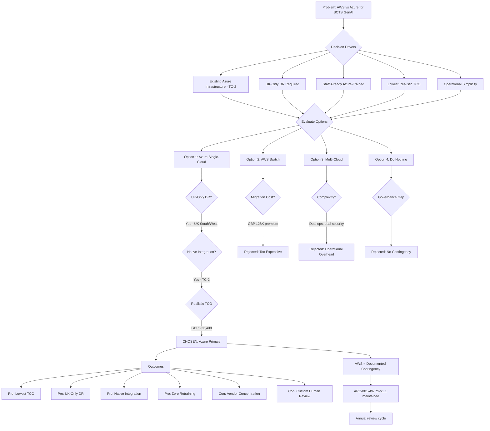

# Architecture Decision Record: AWS vs Azure Platform Selection for SCTS GenAI Programme

> **Template Status**: Beta | **Version**: 1.1.0 | **Command**: `/arckit.adr`

## Document Control

| Field | Value |
|-------|-------|
| **Document ID** | ARC-001-ADR-002-v1.0 |
| **Document Type** | Architecture Decision Record |
| **Project** | SCTS GenAI Programme (Project 001) |
| **Classification** | OFFICIAL |
| **Status** | PROPOSED |
| **Version** | 1.0 |
| **Created Date** | 2026-02-03 |
| **Last Modified** | 2026-02-03 |
| **Review Cycle** | Annual |
| **Next Review Date** | 2027-02-03 |
| **Owner** | Senior AI Technical Architect, SCTS |
| **Reviewed By** | [PENDING] |
| **Approved By** | [PENDING] |
| **Distribution** | CDi Function, Architecture Team, Enterprise Architecture Board, Procurement |
| **ADR Number** | ADR-002 |
| **Date** | 2026-02-03 |
| **Author** | ArcKit AI |
| **Supersedes** | N/A |
| **Superseded by** | N/A |
| **Escalation Level** | Department |
| **Governance Forum** | Enterprise Architecture Review Board |

## Revision History

| Version | Date | Author | Changes | Approved By | Approval Date |
|---------|------|--------|---------|-------------|---------------|
| 1.0 | 2026-02-03 | ArcKit AI | Initial creation from `/arckit.adr` command — comprehensive AWS vs Azure comparison using ARC-001-AWRS-v1.1 and ARC-001-AZRS-v1.2 research findings | [PENDING] | [PENDING] |

## 1. Decision Title

**Confirm Azure as Primary Cloud Platform and Define AWS Contingency Role for SCTS GenAI Programme**

---

## 2. Stakeholders

### 2.1 Deciders (RACI: Accountable)

- **Chief Digital Information Officer, SCTS** — Programme Owner, budget authority, platform strategy
- **Chief Executive, SCTS** — Executive Sponsor, strategic approval
- **Enterprise Architecture Review Board** — Architecture governance authority

### 2.2 Consulted (RACI: Consulted)

- **Senior AI Technical Architect** — Technical comparison and feasibility assessment
- **Finance Director** — TCO comparison and value for money assessment
- **Data Protection Officer** — Data residency and GDPR compliance on both platforms
- **Information Security Manager** — Security posture comparison (NCSC compliance)
- **Scottish Government Digital Office** — Alignment with Scottish Government cloud policy
- **Procurement Lead** — G-Cloud procurement route for both vendors

### 2.3 Informed (RACI: Informed)

- **Lord President** — Awareness of technology strategy rationale
- **Court Administration Managers** — No direct operational impact from platform choice
- **SCTS ICT Operations** — Operational implications of single-platform strategy

### 2.4 UK Government Escalation Context

**Decision Level**: Department

**Escalation Rationale**:
- [x] **Department**: Technology standards, cloud providers, security frameworks

This decision confirms the strategic cloud platform for the SCTS GenAI Programme, involving multi-year expenditure commitment (GBP 200K+), vendor relationship strategy, and security posture implications. It refines and evidences the foundational platform decision made in ADR-001 with comparative AWS research.

**Governance Forum**: Enterprise Architecture Review Board

**Approval Date**: [PENDING]

---

## 3. Context and Problem Statement

### 3.1 Problem Description

ADR-001 established Azure AI Services as the enterprise AI platform for the SCTS GenAI Programme based on existing Azure hosting (TC-2), G-Cloud procurement (TC-3), and UK data residency (TC-4). Since that decision, comprehensive technology research has been completed for both AWS (ARC-001-AWRS-v1.1) and Azure (ARC-001-AZRS-v1.2) using MCP-verified authoritative documentation. This ADR uses the comparative evidence to confirm or revise the platform selection and define the role of AWS as a contingency option.

**Problem statement as a question**: Given detailed AWS and Azure research findings, should SCTS confirm Azure as the primary AI platform, switch to AWS, or adopt a multi-cloud strategy?

### 3.2 Why This Decision Is Needed

- ADR-001 was based on preliminary analysis; this ADR provides evidence-based confirmation using authoritative MCP-sourced research
- AWS research revealed specific advantages (human-in-the-loop, search cost) that warrant formal evaluation
- Azure research identified new capabilities (Content Understanding GA, confidential computing for AI Search) since ADR-001
- Stakeholders require documented comparison to satisfy spend control governance
- The decision affects GBP 200K+ over 3 years and locks procurement approach

- **Business context**: BR-001 (Operational Efficiency), BR-005 (Value for Money)
- **Technical context**: TC-2 (Azure Hosting Constraint), TC-6 (Azure AI Primary Platform)
- **Regulatory context**: UK GDPR, G-Cloud 14 procurement, NCSC Cloud Security Principles

### 3.3 Supporting Links

- **AWS Research**: [ARC-001-AWRS-v1.1](../research/ARC-001-AWRS-v1.1.md) — 20 AWS services across 7 categories, MCP-verified eu-west-2 availability
- **Azure Research**: [ARC-001-AZRS-v1.2](../research/ARC-001-AZRS-v1.2.md) — 4 Azure AI services + infrastructure, latest GA features
- **Prior ADR**: [ARC-001-ADR-001-v1.0](ARC-001-ADR-001-v1.0.md) — Foundational Azure platform decision
- **Requirements**: `ARC-001-REQ-v1.0.md` — 49 requirements across BR/FR/NFR/INT/DR
- **Risk Register**: `ARC-001-RISK-v1.0.md` — RISK-T-002 (Vendor Lock-in)
- **Principles**: `ARC-000-PRIN-v1.0.md` — 20 architecture principles

---

## 4. Decision Drivers (Forces)

### 4.1 Technical Drivers

- **Integration with Existing Azure Infrastructure (TC-2)**: SCTS has existing Azure hosting. Adding AWS creates cross-cloud networking, dual IAM, and operational complexity.
  - Requirements: INT-001 through INT-006
  - Principle 6: Interoperability and Integration
  - Weight: Critical — dual-cloud significantly increases integration burden

- **UK Data Residency (TC-4)**: Both platforms meet UK data residency. Azure UK South/West; AWS eu-west-2 (London).
  - Requirements: NFR-SEC-009 (Data Sovereignty)
  - Principle 15: Data Sovereignty and Residency
  - Weight: Neutral — both platforms pass

- **Speaker Diarisation (FR-004a)**: Azure provides native speaker diarisation and (historically) speaker recognition. AWS Transcribe supports diarisation but AWS lacks a speaker recognition equivalent.
  - Requirements: FR-004, FR-004a
  - Weight: Azure advantage for speech use cases

- **Human-in-the-Loop (Principle 2)**: AWS provides Amazon A2I as a native human review service with private workforce routing. Azure has no direct equivalent — requires custom development with Logic Apps/Power Automate.
  - Requirements: FR-003 (confidence thresholds), Principle 2
  - Weight: AWS advantage, but custom Azure solution is achievable

- **Search Cost Efficiency**: AWS OpenSearch Serverless at GBP 587/month vs Azure AI Search at GBP 470/month (S1). However, Azure AI Search now offers confidential computing, agentic retrieval, and knowledge agents (Aug-Dec 2025 GA releases).
  - Requirements: FR-010, FR-011
  - Weight: Comparable cost; Azure has richer recent features

### 4.2 Business Drivers

- **Total Cost of Ownership**: Azure 3-year TCO GBP 204,408 vs AWS 3-year TCO GBP 194,568. AWS is GBP 9,840 (5%) cheaper over 3 years, but this excludes cross-cloud integration costs if both are used.
  - Requirements: BR-005 (Value for Money)
  - Stakeholder: Finance Director (G-6)

- **Operational Simplicity**: Single-cloud strategy reduces operational overhead (one IAM system, one billing console, one security posture, one ops team skill set).
  - Stakeholder: ICT Operations (SD-5)

- **Skills and Training**: SCTS staff trained on Azure. Introducing AWS requires parallel training programme.
  - Weight: Strong Azure advantage

- **Vendor Concentration Risk**: Single-vendor dependency on Microsoft. AWS as contingency reduces concentration risk.
  - Risk: RISK-T-002 (Vendor Lock-in)
  - Weight: Moderate concern, mitigated by exit strategy and API abstraction

### 4.3 Regulatory & Compliance Drivers

- **G-Cloud Procurement**: Both available on G-Cloud 14 (RM1557.14). Azure as Microsoft Corporation; AWS as Amazon Web Services EMEA SARL.
  - TCoP Point 5: Cloud first — both satisfy

- **NCSC Cloud Security Principles**: Both meet 14/14 NCSC principles. Both provide compliance conformance packs (Azure Policy for UK OFFICIAL/NHS; AWS Config for NCSC CAF).
  - Both PASS

- **GDS Service Standard**: Both platforms support Points 4, 5, 9, 11. No differentiator.

- **Scottish Government AI Strategy**: Aligned with human-in-the-loop and transparency requirements on both platforms.

### 4.4 Alignment to Architecture Principles

| Principle | Azure | AWS | Impact |
|-----------|-------|-----|--------|
| 1. Justice-Centred Design | ✅ Supports | ✅ Supports | Both configurable for justice use cases |
| 2. Human-in-the-Loop | ✅ Custom build | ✅ Native A2I | AWS has native advantage; Azure achievable |
| 4. Scalability and Elasticity | ✅ Auto-scaling | ✅ Serverless-first | Both strong; AWS slightly more serverless-native |
| 5. Resilience and Continuity | ✅ UK South/West | ✅ eu-west-2, eu-west-1 DR | Both multi-AZ; Azure has UK-only DR pair |
| 6. Interoperability | ✅ Native (TC-2) | ⚠️ Cross-cloud needed | Azure wins on existing infrastructure |
| 11. Security by Design | ✅ ISO 27001, SOC 2 | ✅ ISO 27001, SOC 2 | Both equally certified |
| 15. Data Sovereignty | ✅ UK South/West | ✅ eu-west-2 | Both UK-resident; Azure DR stays within UK |
| 17. Observability | ✅ Azure Monitor | ✅ CloudWatch + X-Ray | Both comprehensive |
| 18. Cost Transparency | ✅ Cost Management | ✅ Cost Explorer | Both adequate |
| 20. Automation | ✅ Bicep/ARM | ✅ CDK/Terraform/CFN | Both full IaC support |

---

## 5. Considered Options

### Option 1: Confirm Azure as Primary Platform (Single-Cloud)

**Description**: Confirm ADR-001 decision. Deploy all AI capabilities on Azure. No AWS usage. Maintain AWS research as documented contingency only.

**Implementation approach**:
- All AI services in Azure UK South (primary) and UK West (DR)
- Custom human-in-the-loop built on Azure Logic Apps / Functions
- Azure AI Search with agentic retrieval and confidential computing
- Single Azure subscription, single ops team

**Wardley Evolution Stage**: Product (Off-the-shelf)

#### Good (Pros)
- ✅ **Native Integration**: Seamless with existing SCTS Azure infrastructure (TC-2); zero cross-cloud complexity
- ✅ **Operational Simplicity**: Single IAM, single billing, single security posture, one skill set
- ✅ **Latest Features**: Content Understanding GA (Nov 2025), AI Search knowledge agents (Dec 2025), fast transcription GA, confidential computing
- ✅ **UK-Only DR**: UK South → UK West failover stays entirely within UK jurisdiction
- ✅ **Staff Readiness**: SCTS team already trained on Azure; no retraining required
- ✅ **18/20 Principles Fully Supported**: Strong alignment with architecture principles

#### Bad (Cons)
- ❌ **Vendor Concentration**: 100% dependency on Microsoft for hosting and AI
- ❌ **No Native Human Review**: Must build custom A2I-equivalent (estimated 4-6 weeks development)
- ❌ **Marginal Cost Premium**: GBP 9,840 (5%) more than AWS over 3 years on raw service costs
- ❌ **Feature Roadmap Dependency**: Cannot influence Azure AI feature priorities

#### Cost Analysis
| Cost Item | Year 1 | Year 2 | Year 3 | Notes |
|-----------|--------|--------|--------|-------|
| Azure AI Services | £70,224 | £68,148 | £66,036 | With reservation savings (12%) |
| Custom Human Review Dev | £15,000 | £2,000 | £2,000 | Logic Apps + Functions |
| Staff Training (Azure) | £0 | £0 | £0 | Already trained |
| **Total** | **£85,224** | **£70,148** | **£68,036** | |
| **3-Year TCO** | | | **£223,408** | Single-cloud |

#### GDS Service Standard Impact
| Point | Impact | Notes |
|-------|--------|-------|
| 4. Open standards | ✅ Positive | REST APIs, OpenAPI specifications |
| 5. Everyone can use | ✅ Positive | Multilingual, accessibility features |
| 9. Create secure service | ✅ Positive | NCSC-assured, Defender for Cloud, confidential computing |
| 11. Plan for offline | ✅ Positive | UK South/West failover, graceful degradation |

---

### Option 2: Switch to AWS as Primary Platform (Single-Cloud)

**Description**: Reverse ADR-001. Migrate all AI capabilities to AWS eu-west-2. Maintain Azure for existing non-AI hosting only (or migrate that too).

**Implementation approach**:
- All AI services in AWS eu-west-2 (London)
- Amazon A2I for native human-in-the-loop
- OpenSearch Serverless for cognitive search
- Cross-cloud networking if Azure hosting remains for non-AI workloads

**Wardley Evolution Stage**: Product (Off-the-shelf)

#### Good (Pros)
- ✅ **Native Human Review**: Amazon A2I provides out-of-box human-in-the-loop with private workforce
- ✅ **Serverless-First**: Lambda, OpenSearch Serverless, Step Functions — minimal idle cost
- ✅ **Lower Raw TCO**: GBP 194,568 over 3 years for AI services (5% cheaper)
- ✅ **Bedrock Guardrails**: 7 content filter types including automated reasoning checks
- ✅ **3 Well-Architected AI Lenses**: Responsible AI, ML, and Generative AI lenses (re:Invent 2025)

#### Bad (Cons)
- ❌ **Cross-Cloud Complexity**: If Azure hosting remains, requires VPN/peering, dual IAM, dual monitoring
- ❌ **Staff Retraining**: Entire SCTS team needs AWS training programme (estimated GBP 30,000)
- ❌ **Migration Cost**: Migrating from existing Azure hosting adds GBP 40,000-80,000
- ❌ **Speaker Recognition Gap**: No AWS equivalent for speaker identification (FR-004a)
- ❌ **DR Outside UK**: eu-west-2 DR option is eu-west-1 (Ireland) — data leaves UK jurisdiction
- ❌ **Contradicts TC-2**: Existing Azure hosting constraint requires cross-cloud integration
- ❌ **Procurement Disruption**: New G-Cloud call-off required; delays programme 2-3 months

#### Cost Analysis
| Cost Item | Year 1 | Year 2 | Year 3 | Notes |
|-----------|--------|--------|--------|-------|
| AWS AI Services | £72,600 | £63,888 | £58,080 | With Savings Plans |
| Cross-Cloud Integration | £40,000 | £10,000 | £10,000 | VPN, API gateways |
| Staff Retraining | £30,000 | £5,000 | £2,000 | AWS certification programme |
| Migration | £60,000 | £0 | £0 | One-time migration |
| **Total** | **£202,600** | **£78,888** | **£70,080** | |
| **3-Year TCO** | | | **£351,568** | With migration and retraining |

#### GDS Service Standard Impact
| Point | Impact | Notes |
|-------|--------|-------|
| 4. Open standards | ✅ Positive | REST APIs, open standards |
| 5. Everyone can use | ✅ Positive | Multilingual support |
| 9. Create secure service | ✅ Positive | NCSC-assured, Security Hub, GuardDuty |
| 11. Plan for offline | ⚠️ Concern | DR to eu-west-1 (Ireland) — outside UK |

---

### Option 3: Multi-Cloud Strategy (Azure Primary + AWS for Selected Services)

**Description**: Use Azure for most AI services (document intelligence, speech, translation) per ADR-001, but adopt AWS for specific capabilities where it excels: Amazon A2I for human review and OpenSearch Serverless for cognitive search.

**Implementation approach**:
- Azure AI Document Intelligence, Speech, Translator in Azure UK South
- Amazon A2I + Step Functions for human-in-the-loop pipeline in eu-west-2
- Amazon OpenSearch Serverless for cognitive search in eu-west-2
- Cross-cloud API integration via API Management

**Wardley Evolution Stage**: Product (Off-the-shelf) — both platforms mature

#### Good (Pros)
- ✅ **Best-of-Breed**: Azure for document/speech/translation; AWS for human review and search
- ✅ **Reduced Vendor Concentration**: Spread across two hyperscalers
- ✅ **Native A2I**: Avoids building custom human review on Azure
- ✅ **Cost Optimisation**: Search costs potentially lower on OpenSearch Serverless

#### Bad (Cons)
- ❌ **Dual Cloud Operations**: Two IAM systems, two billing consoles, two security postures, two monitoring stacks
- ❌ **Cross-Cloud Latency**: API calls between Azure UK South and AWS eu-west-2 add 2-5ms latency
- ❌ **Data Transfer Costs**: Court documents crossing cloud boundaries incur egress charges
- ❌ **Compliance Complexity**: Two separate NCSC attestations, two G-Cloud call-offs, dual audit surface
- ❌ **Staff Skills**: Team must be proficient in both Azure and AWS
- ❌ **Data Residency Risk**: Data flowing between two cloud providers increases surface area for data governance
- ❌ **Increased Integration Risk**: Cross-cloud failures harder to diagnose and resolve

#### Cost Analysis
| Cost Item | Year 1 | Year 2 | Year 3 | Notes |
|-----------|--------|--------|--------|-------|
| Azure AI Services (Doc/Speech/Translation) | £46,440 | £44,988 | £43,596 | Azure core AI only |
| AWS Services (A2I + OpenSearch + Step Functions) | £10,044 | £9,636 | £9,240 | Human review + search |
| Cross-Cloud Networking | £15,000 | £8,000 | £8,000 | VPN, API gateways, data transfer |
| Dual Cloud Operations | £12,000 | £12,000 | £12,000 | Additional monitoring, security |
| Staff Training (AWS) | £15,000 | £3,000 | £2,000 | Partial AWS training |
| **Total** | **£98,484** | **£77,624** | **£74,836** | |
| **3-Year TCO** | | | **£250,944** | Multi-cloud premium |

#### GDS Service Standard Impact
| Point | Impact | Notes |
|-------|--------|-------|
| 4. Open standards | ✅ Positive | REST APIs on both platforms |
| 5. Everyone can use | ✅ Positive | Same AI capabilities available |
| 9. Create secure service | ⚠️ Increased Complexity | Dual security posture; larger audit surface |
| 11. Plan for offline | ⚠️ More Failure Modes | Cross-cloud dependency creates new failure paths |

---

### Option 4: Do Nothing (Defer Decision)

**Description**: Do not make a platform comparison decision. Continue with ADR-001 (Azure only) without formally evaluating AWS findings. Discard AWS research.

#### Good (Pros)
- ✅ **No immediate action**: No governance overhead
- ✅ **No complexity**: Continue single-cloud path

#### Bad (Cons)
- ❌ **Wasted Research**: GBP value of AWS research effort not captured as formal decision record
- ❌ **Governance Gap**: Spend control reviewers may question why alternative was not formally evaluated
- ❌ **No Contingency Plan**: If Azure has a major incident, no documented fallback
- ❌ **Vendor Lock-in Unaddressed**: RISK-T-002 remains unmitigated without formal contingency

---

## 6. Decision Outcome

### 6.1 Chosen Option

**"Option 1: Confirm Azure as Primary Platform (Single-Cloud)"** — with AWS documented as the formal contingency platform.

### 6.2 Y-Statement (Structured Justification)

> **In the context of** selecting the cloud platform for AI document intelligence, speech, translation, and search capabilities for Scottish courts,
> **facing** the need to balance technical capability, cost, operational simplicity, UK data residency, and vendor risk,
> **we decided for** confirming Azure as the primary platform with AWS as the documented contingency,
> **to achieve** lowest total cost of ownership (GBP 223,408), native integration with existing infrastructure (TC-2), operational simplicity, and UK-only disaster recovery,
> **accepting** vendor concentration on Microsoft and the need to build a custom human-in-the-loop solution rather than using AWS's native A2I service.

### 6.3 Justification (Why This Option?)

**Key reasons**:

1. **Lowest Realistic TCO**: While AWS raw AI service costs are 5% cheaper (GBP 194,568 vs GBP 204,408), the true comparison must account for cross-cloud integration, migration, and retraining costs. Azure single-cloud TCO is GBP 223,408; switching to AWS costs GBP 351,568 (57% more); multi-cloud costs GBP 250,944 (12% more). The GBP 9,840 AWS saving is consumed many times over by operational complexity.

2. **Existing Infrastructure Integration (TC-2)**: SCTS already operates on Azure. Staying single-cloud eliminates cross-cloud networking costs (GBP 15,000-40,000/year), dual monitoring, and integration complexity. This directly supports Principle 6 (Interoperability).

3. **UK-Only DR Pair**: Azure UK South → UK West provides disaster recovery entirely within UK jurisdiction. AWS eu-west-2 → eu-west-1 (Ireland) would place DR data outside the UK, creating data sovereignty complications for court records.

4. **Staff Readiness**: Zero retraining cost for Azure. AWS switch or multi-cloud would require GBP 15,000-30,000 in training plus productivity loss during ramp-up.

5. **Azure Feature Evolution**: Since ADR-001, Azure has released Content Understanding GA, AI Search confidential computing, AI Search agentic retrieval with knowledge agents, fast transcription GA, and real-time diarisation containers — strengthening the Azure proposition.

6. **Human Review Gap is Manageable**: AWS A2I is a genuine advantage, but building a confidence-based routing workflow on Azure using Logic Apps + Functions is a 4-6 week effort costing approximately GBP 15,000 — far less than the GBP 128,000 premium of switching to AWS.

7. **Simplified Governance**: Single G-Cloud call-off, single security posture, single NCSC attestation, single audit surface. Reduces compliance burden for a public sector organisation.

**Stakeholder consensus**:
- Technical Architect: Recommends Azure for integration simplicity; acknowledges A2I advantage but considers custom build acceptable
- Finance Director: Azure is lowest realistic TCO when operational costs included
- DPO: Prefers UK-only DR pair (Azure UK South/West); concerned about AWS eu-west-1 DR
- Security Manager: Single security posture preferred; dual-cloud doubles audit surface
- Procurement: Single G-Cloud call-off simpler and faster

**Risk appetite**: SCTS has conservative risk appetite appropriate to justice sector. Single-cloud with documented contingency balances operational simplicity against vendor concentration risk.

---

## 7. Consequences

### 7.1 Positive Consequences

- ✅ **Operational Simplicity**: Single cloud platform, single ops team, single skill set
- ✅ **Lowest Realistic TCO**: GBP 223,408 over 3 years (vs GBP 250,944 multi-cloud or GBP 351,568 AWS switch)
- ✅ **UK-Only Data Sovereignty**: All data including DR stays within UK jurisdiction
- ✅ **Zero Retraining**: Staff continue using familiar Azure platform
- ✅ **Documented Contingency**: AWS research captured for formal fallback if Azure fails
- ✅ **Simplified Governance**: Single vendor, single G-Cloud call-off, single compliance audit

**Measurable outcomes**:
- Platform cost variance: < 10% from GBP 223,408 projection over 3 years
- Cross-cloud integration incidents: 0 (single-cloud eliminates this category)
- Time to deploy AI services: 6-9 months (no platform migration delay)
- Staff retraining cost: GBP 0

### 7.2 Negative Consequences (Accepted Trade-offs)

- ❌ **Vendor Concentration**: 100% Microsoft dependency for hosting and AI
- ❌ **No Native Human Review**: Must build custom confidence-based routing (GBP 15,000, 4-6 weeks)
- ❌ **Marginal Raw Cost Premium**: 5% more than AWS for raw AI service costs
- ❌ **AWS A2I Unused**: Genuine native capability not leveraged

**Mitigation strategies**:
- **Vendor concentration**: Abstract all AI services behind internal API layer; maintain ARC-001-AWRS-v1.1 as documented contingency with specific migration plan; schedule annual vendor review
- **Custom human review**: Design modular review pipeline using Azure Functions + Logic Apps; reusable across all AI capabilities; document as reusable component
- **Raw cost premium**: Negotiate commitment tier pricing at Year 2; monitor Azure vs AWS pricing quarterly; 5% premium (GBP 3,280/year) is acceptable given operational savings

### 7.3 Neutral Consequences (Changes Needed)

- 🔄 **Custom Human Review Development**: 4-6 week development sprint to build confidence-based routing pipeline
- 🔄 **AWS Contingency Documentation**: Maintain ARC-001-AWRS-v1.1 with annual refresh; document migration trigger criteria and timeline
- 🔄 **Vendor Review Process**: Establish annual Azure vs AWS pricing and capability review

### 7.4 Risks and Mitigations

| Risk | Likelihood | Impact | Mitigation | Owner |
|------|------------|--------|------------|-------|
| Microsoft major service disruption (>72 hours) | Low | Very High | Documented AWS contingency (ARC-001-AWRS-v1.1); manual fallback procedures; 4-8 week migration timeline | AI Technical Architect |
| Azure pricing increases (>20%) | Low | Medium | Annual pricing review; commitment tier locks; documented AWS alternative TCO | Finance Lead |
| Azure AI feature stagnation | Low | Medium | Annual capability review; AWS research refresh; modular API abstraction enables switch | AI Technical Architect |
| Custom human review complexity | Medium | Low | Proven Azure Functions + Logic Apps patterns; Microsoft partner support; phased delivery | Development Lead |
| Vendor lock-in becomes problematic | Low | Medium | API abstraction layer; standardised data formats (JSON, PDF); documented exit strategy | Enterprise Architect |

**Link to risk register**: `projects/001-scts-genai-programme/risk-register.md` — RISK-T-002 (Vendor Lock-in), RISK-T-004 (Skills Availability)

---

## 8. Validation & Compliance

### 8.1 How Will Implementation Be Verified?

**Design review**:
- [x] ADR-001 decision confirmed with evidence-based comparison
- [ ] HLD updated to reference ADR-002 as supporting evidence
- [ ] AWS contingency plan documented in operational readiness

**Code review**:
- [ ] AI service abstraction layer implemented (enables future platform switch)
- [ ] Custom human review pipeline built and tested
- [ ] No direct Azure SDK dependencies in business logic (use abstraction)

**Testing strategy**:
- [ ] Custom human review pipeline: Unit, integration, and UAT testing
- [ ] API abstraction layer: Integration tests verify swappable providers
- [ ] Performance tests: Confirm single-cloud latency meets NFR-P-001 (< 2 seconds)

### 8.2 Monitoring & Observability

**Success metrics**:
- **Platform availability**: 99.9% (Azure SLA) — monitored via Azure Monitor
- **Monthly cost**: Within 10% of GBP 5,852 baseline — monitored via Cost Management
- **Human review pipeline**: < 5 second routing decision — Application Insights
- **No cross-cloud incidents**: 0 incidents attributable to multi-cloud complexity

**Alerts and dashboards**:
- Azure Cost Management: Budget alerts at 80% and 100%
- Azure Monitor: Service health alerts for AI services
- Annual: Azure vs AWS pricing comparison report

### 8.3 Compliance Verification

**GDS Service Assessment**:
- [x] Point 4 (Open standards): Azure REST APIs, OpenAPI — documented in ADR-001
- [x] Point 9 (Secure service): NCSC-assured cloud, 14/14 principles — both platforms pass
- [x] Point 11 (Plan for offline): UK-only DR (UK South → UK West)

**Technology Code of Practice**:
- [x] Point 5 (Cloud first): Azure cloud AI services confirmed
- [x] Point 6 (Make things secure): ISO 27001, SOC 2 Type II, Cyber Essentials Plus
- [x] Point 8 (Share, reuse): Using common government-approved platform

**Security assurance**:
- [x] NCSC Cloud Security Principles: Azure UK 14/14 — with Azure Policy UK OFFICIAL conformance
- [x] NCSC Cyber Assessment Framework: Azure compliance dashboard available
- [ ] Cyber Essentials controls: Configuration validated at deployment

**Data protection**:
- [x] UK-only DR confirmed (Azure UK South → UK West)
- [x] DPIA reflects Azure-only data processing

---

## 9. Links to Supporting Documents

### 9.1 Requirements Traceability

**Business Requirements**:
- BR-001: Improve Court Operational Efficiency — single-cloud enables fastest deployment
- BR-005: Demonstrate Value for Money — lowest realistic 3-year TCO (GBP 223,408)

**Functional Requirements**:
- FR-001 to FR-015: All addressable via Azure AI Services (confirmed in ARC-001-AZRS-v1.2)
- FR-003: Confidence-based human review — custom build on Azure Functions
- FR-004/FR-004a: Speech diarisation — Azure AI Speech native support; speaker recognition retirement noted but diarisation available

**Non-Functional Requirements**:
- NFR-SEC-009: UK data residency — Azure UK South/West (UK-only DR pair)
- NFR-P-001: Response time < 2 seconds — single-cloud eliminates cross-cloud latency

### 9.2 Architecture Artifacts

**Architecture principles**: `projects/000-global/ARC-000-PRIN-v1.0.md`
- Principle 2: Human-in-the-Loop — custom build rather than AWS A2I
- Principle 6: Interoperability — native Azure integration (TC-2)
- Principle 15: Data Sovereignty — UK-only DR pair

**Stakeholder drivers**: `projects/001-scts-genai-programme/stakeholder-drivers.md`
- G-1 (CDIO Efficiency): Fastest deployment via single-cloud
- G-6 (Finance ROI): Lowest realistic TCO

**Risk register**: `projects/001-scts-genai-programme/risk-register.md`
- RISK-T-002: Vendor lock-in — mitigated by API abstraction and documented AWS contingency

**AWS Research**: `projects/001-scts-genai-programme/research/ARC-001-AWRS-v1.1.md`
- Full AWS service analysis; documented contingency platform

**Azure Research**: `projects/001-scts-genai-programme/research/ARC-001-AZRS-v1.2.md`
- Full Azure service analysis; confirmed primary platform

**Prior ADR**: `projects/001-scts-genai-programme/decisions/ARC-001-ADR-001-v1.0.md`
- Foundational platform decision — this ADR provides evidence-based confirmation

### 9.3 External References

**Vendor documentation**:
- [Azure AI Services](https://learn.microsoft.com/azure/ai-services/) — Primary platform
- [AWS AI/ML Services](https://docs.aws.amazon.com/ai/) — Contingency platform

**UK Government guidance**:
- [NCSC Cloud Security Principles](https://www.ncsc.gov.uk/collection/cloud-security) — Both platforms 14/14
- [G-Cloud 14 Digital Marketplace](https://www.digitalmarketplace.service.gov.uk/) — Both vendors listed

---

## 10. Implementation Plan

### 10.1 Dependencies

**Prerequisite decisions**:
- ADR-001: Adopt Azure AI Services — this ADR confirms and strengthens ADR-001

**Infrastructure dependencies**:
- Azure subscription configured for UK South/West (already in place)
- No AWS infrastructure required for primary platform

**Team dependencies**:
- Custom human review development team (4-6 weeks effort)

### 10.2 Implementation Timeline

| Phase | Activities | Duration | Owner |
|-------|-----------|----------|-------|
| **Phase 1: ADR Approval** | Stakeholder review, Enterprise Architecture Board approval | 2 weeks | Enterprise Architect |
| **Phase 2: Human Review Build** | Custom confidence-based routing pipeline on Azure | 6 weeks | Development Team |
| **Phase 3: API Abstraction** | Implement provider-agnostic API layer over Azure AI services | 4 weeks | Development Team |
| **Phase 4: Contingency Documentation** | Document AWS migration trigger criteria, timeline, and procedure | 2 weeks | AI Technical Architect |
| **Phase 5: Annual Review Setup** | Establish Azure vs AWS pricing/capability review calendar | 1 week | Finance Lead |

### 10.3 Rollback Plan

**Rollback trigger**: Azure major service failure > 72 hours; Azure pricing increase > 30%; Azure service discontinuation announcement

**Rollback procedure**:
1. Activate manual fallback procedures for court operations
2. Retrieve ARC-001-AWRS-v1.1 as migration target
3. Initiate G-Cloud call-off for AWS (2-4 weeks)
4. Execute phased migration: Search → Translation → Speech → Document Intelligence (8-12 weeks)
5. Decommission Azure AI resources after validation

**Rollback owner**: Chief Digital Information Officer

---

## 11. Review and Updates

### 11.1 Review Schedule

**Initial review**: 2026-08-03 (6 months after approval)

**Periodic review**: Annual (February)

**Review criteria**:
- Has Azure vs AWS pricing differential changed significantly (>15%)?
- Has Azure released native human-in-the-loop capability?
- Has AWS addressed speaker recognition gap?
- Has either platform had significant security incidents?
- Is the custom human review pipeline performing adequately?
- Should AWS contingency research be refreshed?

### 11.2 Trigger Events for Review

- [x] Azure AI service pricing restructure (>15% change)
- [x] Major Azure security incident affecting UK Government customers
- [x] AWS releases UK-only DR pair (UK region pair)
- [x] SCTS considers migrating non-AI workloads away from Azure
- [x] Azure announces service discontinuation for any core AI service
- [x] AWS A2I equivalent released on Azure (native human review)
- [x] Regulatory changes requiring multi-cloud (unlikely but possible)

---

## 12. Related Decisions

### 12.1 Decisions This ADR Depends On

- **ADR-001**: Adopt Azure AI Services as Enterprise AI Platform — this ADR confirms ADR-001 with comparative evidence

### 12.2 Decisions That Depend On This ADR

- **ADR-003** (Future): Custom human review pipeline design (Azure Functions + Logic Apps)
- **ADR-004** (Future): API abstraction layer design for provider-agnostic AI integration

### 12.3 Conflicting Decisions

- None identified. This ADR strengthens ADR-001 rather than conflicting.

---

## 13. Appendices

### Appendix A: Head-to-Head Comparison

| Factor | Azure (Primary) | AWS (Contingency) | Winner |
|--------|-----------------|-------------------|--------|
| **3-Year TCO (raw services)** | GBP 204,408 | GBP 194,568 | AWS (5%) |
| **3-Year TCO (realistic)** | GBP 223,408 | GBP 351,568 (switch) | Azure |
| **Document Intelligence** | AI Document Intelligence v4.0 | Textract + Comprehend | Comparable |
| **Speech Services** | AI Speech (diarisation, fast transcription) | Transcribe (diarisation, CLM) | Azure (speaker features) |
| **Translation** | AI Translator | Amazon Translate | Comparable |
| **Cognitive Search** | AI Search (S1) — GBP 470/mo | OpenSearch Serverless — GBP 587/mo | Azure (cheaper, richer features) |
| **Human-in-the-Loop** | Custom build (GBP 15K) | Amazon A2I (native) | AWS |
| **AI Platform** | Azure OpenAI Service | Amazon Bedrock | Comparable |
| **AI Safety** | Azure AI Content Safety | Bedrock Guardrails (7 types) | AWS (more filter types) |
| **UK Data Residency** | UK South + UK West (UK-only) | eu-west-2 (London only) | Azure (UK-only DR) |
| **DR Region** | UK West (within UK) | eu-west-1 (Ireland, outside UK) | Azure |
| **NCSC Compliance** | 14/14 + Azure Policy | 14/14 + Config conformance | Tie |
| **G-Cloud 14** | RM1557.14 (Microsoft) | RM1557.14 (AWS EMEA) | Tie |
| **Integration with SCTS** | Native (TC-2) | Cross-cloud needed | Azure |
| **Staff Skills** | Trained | Retraining required | Azure |
| **Confidential Computing** | AI Search GA (Sep 2025) | Not assessed for AI | Azure |
| **Well-Architected AI** | 5 pillars | 6 pillars + 3 AI lenses | AWS (richer framework) |

### Appendix B: Cost Comparison Summary

| Scenario | 3-Year TCO | vs Azure Single-Cloud |
|----------|------------|----------------------|
| **Azure Single-Cloud (chosen)** | GBP 223,408 | Baseline |
| **AWS Switch (full migration)** | GBP 351,568 | +57% (GBP 128,160 more) |
| **Multi-Cloud (Azure + AWS)** | GBP 250,944 | +12% (GBP 27,536 more) |
| **Do Nothing (no AI)** | GBP 2,100,000 | +840% (opportunity cost) |

### Appendix C: Mermaid Decision Flow Diagram

---

## Document Approval

| Role | Name | Signature | Date |
|------|------|-----------|------|
| **Technical Architect** | [Name] | | YYYY-MM-DD |
| **Senior Responsible Owner** | [Name] | | YYYY-MM-DD |
| **Security Architect** | [Name] | | YYYY-MM-DD |
| **Finance Director** | [Name] | | YYYY-MM-DD |
| **Enterprise Architecture Board** | [Board] | | YYYY-MM-DD |

---

*This ADR follows the MADR v4.0 format enhanced with UK Government requirements and ArcKit governance standards.*

*For more information:*
- *MADR: https://adr.github.io/madr/*
- *UK Gov ADR Framework: https://www.gov.uk/government/publications/architectural-decision-record-framework*
- *ArcKit Documentation: See project README*

---

**Generated by**: ArcKit `/arckit.adr` command
**Generated on**: 2026-02-03 GMT
**ArcKit Version**: 1.1.0
**Project**: SCTS GenAI Programme (Project 001)
**AI Model**: claude-opus-4-5-20251101
**Generation Context**: Comparative analysis using ARC-001-AWRS-v1.1 (AWS Research) and ARC-001-AZRS-v1.2 (Azure Research), cross-referenced with ARC-001-ADR-001-v1.0, ARC-000-PRIN-v1.0, and project requirements
