# Architecture Diagram: Azure AI Platform - C4 Container

> **Template Status**: Live | **Version**: 1.0.0 | **Command**: `/arckit.diagram`

## Document Control

| Field | Value |
|-------|-------|
| **Document ID** | ARC-001-DIAG-001-v1.0 |
| **Document Type** | Architecture Diagram |
| **Project** | SCTS GenAI Programme (Project 001) |
| **Classification** | OFFICIAL |
| **Status** | DRAFT |
| **Version** | 1.0 |
| **Created Date** | 2026-01-29 |
| **Last Modified** | 2026-01-29 |
| **Review Cycle** | Quarterly |
| **Next Review Date** | 2026-04-29 |
| **Owner** | Senior AI Technical Architect, SCTS |
| **Reviewed By** | PENDING |
| **Approved By** | PENDING |
| **Distribution** | CDi Function, Architecture Team, AI Architect |

## Revision History

| Version | Date | Author | Changes | Approved By | Approval Date |
|---------|------|--------|---------|-------------|---------------|
| 1.0 | 2026-01-29 | ArcKit AI | Initial creation from `/arckit.diagram` based on Azure Research (ARC-001-AZRS-v1.0) | PENDING | PENDING |

---

## Diagram

```mermaid
C4Container
    title Container Diagram - SCTS GenAI Azure AI Platform

    Person(clerk, "Court Clerk", "Processes court documents and manages case files")
    Person(legal, "Legal Professional", "Searches case law and court records")
    Person(interpreter, "Court Interpreter", "Uses AI-assisted transcription and translation")
    Person(public, "Court User", "Non-English speaker accessing court services")

    System_Ext(cms, "Case Management System", "Existing SCTS case management")
    System_Ext(dms, "Document Management System", "Court document repository")
    System_Ext(ad, "SCTS Active Directory", "Identity provider")

    System_Boundary(genai, "SCTS GenAI Platform - Azure UK South") {

        Container(apim, "API Management", "Azure APIM, Developer tier", "API Gateway with rate limiting, auth, routing [Product 0.85]")

        Container(func, "Processing Orchestrator", "Azure Functions, Python", "Event-driven document and audio processing workflow [Custom 0.45]")

        Container(webapp, "GenAI Portal", "Azure App Service, React", "User interface for AI services, WCAG 2.2 AA [Product 0.75]")

        Container(docint, "Document Intelligence", "Azure AI Document Intelligence S0", "Document classification, entity extraction, custom models [Product 0.70]")

        Container(speech, "Speech Services", "Azure AI Speech S0", "Real-time transcription, speaker diarisation, 10 languages [Product 0.72]")

        Container(translator, "Translation Services", "Azure AI Translator S1", "Real-time translation, custom legal glossary [Product 0.80]")

        Container(search, "Cognitive Search", "Azure AI Search S1", "Semantic search, vector embeddings, knowledge mining [Product 0.68]")

        ContainerDb(blob, "Document Storage", "Azure Blob Storage, Hot tier", "Court documents, audio files, GRS replication [Commodity 0.95]")

        ContainerDb(sql, "Metadata Store", "Azure SQL Database S2", "Processing state, document metadata, audit refs [Commodity 0.92]")

        ContainerDb(cosmos, "Audit Log Store", "Azure Cosmos DB, Serverless", "Immutable audit trail, 7-year retention [Commodity 0.90]")

        ContainerDb(redis, "Cache Layer", "Azure Cache for Redis, Basic", "Search result caching, session state [Commodity 0.95]")

        Container(kv, "Secrets Management", "Azure Key Vault, Standard", "API keys, certificates, CMK [Commodity 0.95]")

        Container(monitor, "Observability", "Azure Monitor + App Insights", "Logs, metrics, alerts, dashboards [Commodity 0.92]")
    }

    Rel(clerk, webapp, "Uploads documents, reviews AI outputs", "HTTPS")
    Rel(legal, webapp, "Searches case law, views similar cases", "HTTPS")
    Rel(interpreter, webapp, "Uses transcription and translation", "HTTPS")
    Rel(public, webapp, "Accesses translated content", "HTTPS")

    Rel(webapp, apim, "All API calls", "REST/JSON, OAuth 2.0")
    Rel(cms, apim, "Document ingestion, status updates", "REST/JSON, API Key")
    Rel(dms, apim, "Document retrieval", "REST/JSON, API Key")

    Rel(apim, func, "Routes requests", "HTTP")
    Rel(apim, search, "Search queries", "REST")
    Rel(apim, ad, "Validates tokens", "OAuth 2.0")

    Rel(func, blob, "Stores/retrieves documents", "Azure SDK")
    Rel(func, docint, "Classifies and extracts", "REST API")
    Rel(func, speech, "Transcribes audio", "WebSocket/REST")
    Rel(func, translator, "Translates text", "REST API")
    Rel(func, sql, "Updates processing state", "TDS/SQL")
    Rel(func, cosmos, "Writes audit events", "Azure SDK")

    Rel(docint, search, "Enriches search index", "Skillset pipeline")
    Rel(docint, kv, "Retrieves API keys", "Managed Identity")
    Rel(speech, kv, "Retrieves API keys", "Managed Identity")
    Rel(translator, kv, "Retrieves API keys", "Managed Identity")

    Rel(search, blob, "Indexes documents", "Indexer")
    Rel(search, redis, "Caches results", "Redis protocol")

    Rel(monitor, func, "Collects telemetry", "SDK")
    Rel(monitor, docint, "Collects metrics", "Diagnostic settings")
    Rel(monitor, speech, "Collects metrics", "Diagnostic settings")
    Rel(monitor, search, "Collects metrics", "Diagnostic settings")
```

**View this diagram**:
- **GitHub**: Renders automatically in markdown preview
- **VS Code**: Install Mermaid Preview extension
- **Online**: https://mermaid.live (paste code above)
- **Export**: Use mermaid.live to export as PNG/SVG/PDF

---

## Component Inventory

| Component | Type | Technology | Responsibility | Evolution Stage | Build/Buy | Monthly Cost |
|-----------|------|------------|----------------|-----------------|-----------|--------------|
| API Management | Gateway | Azure APIM Developer | Rate limiting, authentication, routing | Product (0.85) | USE | £40 |
| Processing Orchestrator | Compute | Azure Functions, Python | Event-driven workflow orchestration | Custom (0.45) | BUILD | £50 |
| GenAI Portal | Web App | Azure App Service, React | User interface for AI services | Product (0.75) | BUILD | Included |
| Document Intelligence | AI Service | Azure AI Document Intelligence S0 | Document classification, entity extraction | Product (0.70) | USE | £2,363 |
| Speech Services | AI Service | Azure AI Speech S0 | Real-time transcription, diarisation | Product (0.72) | USE | £1,020 |
| Translation Services | AI Service | Azure AI Translator S1 | Real-time translation, custom glossary | Product (0.80) | USE | £484 |
| Cognitive Search | AI Service | Azure AI Search S1 | Semantic search, knowledge mining | Product (0.68) | USE | £470 |
| Document Storage | Storage | Azure Blob Storage Hot | Court documents, audio files | Commodity (0.95) | USE | £200 |
| Metadata Store | Database | Azure SQL Database S2 | Processing state, metadata | Commodity (0.92) | USE | £150 |
| Audit Log Store | Database | Azure Cosmos DB Serverless | Immutable audit trail | Commodity (0.90) | USE | £100 |
| Cache Layer | Cache | Azure Cache for Redis Basic | Search result caching | Commodity (0.95) | USE | £15 |
| Secrets Management | Security | Azure Key Vault Standard | API keys, certificates | Commodity (0.95) | USE | £10 |
| Observability | Operations | Azure Monitor + App Insights | Logs, metrics, alerts | Commodity (0.92) | USE | £200 |
| **Total** | | | | | | **£5,102** |

**Evolution Stage Legend**:
- **Genesis (0.0-0.25)**: Novel, unproven, rapidly changing
- **Custom (0.25-0.50)**: Bespoke, emerging practices
- **Product (0.50-0.75)**: Commercial products with feature differentiation
- **Commodity (0.75-1.0)**: Utility services, standardized

---

## Architecture Decisions

### Key Design Decisions

**Decision 1**: Use Azure AI Services via G-Cloud
- **Context**: SCTS requires AI capabilities for document processing, speech, translation, and search
- **Decision**: Adopt Azure AI Services (Document Intelligence, Speech, Translator, Search) via G-Cloud 14
- **Rationale**: Native Azure integration with existing SCTS hosting, UK data residency (UK South/West), G-Cloud compliant procurement, lowest 3-year TCO
- **Consequences**: Vendor lock-in to Microsoft; mitigated by API abstraction layer

**Decision 2**: Event-Driven Processing with Azure Functions
- **Context**: Document and audio processing requires asynchronous, scalable workflows
- **Decision**: Use Azure Functions (Consumption plan) for orchestration
- **Rationale**: Pay-per-execution model, auto-scaling, native Azure service integration, Python SDK support
- **Consequences**: Cold start latency acceptable for batch processing; real-time speech uses dedicated connections

**Decision 3**: Separate AI Output from Court Records
- **Context**: BR-003 requires protection of court record integrity
- **Decision**: All AI-generated content stored in separate containers with clear labeling; human approval required before integration
- **Rationale**: Protects official court records, maintains audit trail, supports human-in-the-loop principle
- **Consequences**: Additional workflow step; essential for judicial confidence

**Decision 4**: Private Link for All AI Services
- **Context**: NFR-SEC requirements mandate network isolation
- **Decision**: Deploy all AI services with Private Link endpoints, disable public access
- **Rationale**: Data never traverses public internet, meets NCSC Cloud Security Principles
- **Consequences**: Additional networking complexity; managed via Bicep IaC

### Technology Choices

| Technology | Purpose | Rationale | Evolution Stage |
|------------|---------|-----------|-----------------|
| Azure AI Document Intelligence | Document classification & extraction | Custom model support, 99.9% SLA, UK regions | Product (0.70) |
| Azure AI Speech | Transcription & diarisation | 10-language support, <500ms latency, speaker recognition | Product (0.72) |
| Azure AI Translator | Real-time translation | Custom glossary support, <2s latency | Product (0.80) |
| Azure AI Search | Semantic search | Semantic ranking, vector search, security trimming | Product (0.68) |
| Azure Functions | Orchestration | Serverless, event-driven, Python SDK | Product (0.75) |
| Azure Blob Storage | Document storage | Hot tier, GRS replication, CMK encryption | Commodity (0.95) |
| Azure SQL Database | Metadata storage | Managed, geo-replica, TDE | Commodity (0.92) |
| Azure Cosmos DB | Audit logging | Serverless, immutable, multi-region | Commodity (0.90) |

---

## Requirements Traceability

**Requirements Coverage**:

| Requirement ID | Description | Component(s) | Coverage Status |
|----------------|-------------|--------------|-----------------|
| BR-001 | Improve operational efficiency by 60% | Document Intelligence, Processing Orchestrator | ✅ Covered |
| BR-002 | Enhance access for non-English speakers | Speech Services, Translation Services | ✅ Covered |
| BR-003 | Protect court record integrity | Audit Log Store, Processing Orchestrator | ✅ Covered |
| BR-004 | Achieve regulatory compliance | All components (UK South deployment) | ✅ Covered |
| BR-005 | Demonstrate value for money | All components (£5,702/month) | ✅ Covered |
| FR-001 | Document classification | Document Intelligence | ✅ Covered |
| FR-002 | Entity extraction | Document Intelligence | ✅ Covered |
| FR-003 | Human review workflow | GenAI Portal, Processing Orchestrator | ✅ Covered |
| FR-004 | Speech transcription | Speech Services | ✅ Covered |
| FR-005 | Real-time translation | Translation Services | ✅ Covered |
| FR-007 | Semantic search | Cognitive Search | ✅ Covered |
| NFR-P-001 | Document processing <10s | Document Intelligence (5-7s typical) | ✅ Covered |
| NFR-P-002 | Speech latency <500ms | Speech Services (<500ms) | ✅ Covered |
| NFR-P-003 | Search response <2s | Cognitive Search (<200ms typical) | ✅ Covered |
| NFR-SEC-001 | Data encryption at rest | Blob Storage, SQL, Cosmos (AES-256) | ✅ Covered |
| NFR-SEC-002 | Data encryption in transit | All components (TLS 1.3) | ✅ Covered |
| NFR-SEC-009 | UK data residency | All components (UK South primary) | ✅ Covered |
| INT-001 | CMS integration | API Management, Processing Orchestrator | ✅ Covered |
| INT-002 | DMS integration | API Management, Blob Storage | ✅ Covered |
| DR-001 | Audit trail retention | Cosmos DB (7-year retention) | ✅ Covered |

**Coverage Summary**:
- Total Requirements: 20
- Covered: 20 (100%)
- Partially Covered: 0
- Not Covered: 0

---

## Integration Points

### External Systems

| External System | Interface | Protocol | Responsibility | SLA |
|----------------|-----------|----------|----------------|-----|
| Case Management System | REST API | HTTPS, API Key | Document ingestion, status updates | 99.9% |
| Document Management System | REST API | HTTPS, API Key | Document retrieval, metadata sync | 99.9% |
| SCTS Active Directory | SAML/OAuth | HTTPS | User authentication, SSO | 99.9% |

### APIs and Endpoints

| API | Endpoint | Method | Purpose | Authentication |
|-----|----------|--------|---------|----------------|
| Document Processing | /api/v1/documents | POST | Upload document for AI processing | OAuth 2.0 |
| Document Status | /api/v1/documents/{id}/status | GET | Check processing status | OAuth 2.0 |
| Speech Transcription | /api/v1/transcription | POST | Submit audio for transcription | OAuth 2.0 |
| Translation | /api/v1/translate | POST | Translate text content | OAuth 2.0 |
| Search | /api/v1/search | POST | Semantic search query | OAuth 2.0 |
| Audit Log | /api/v1/audit | GET | Retrieve audit trail | OAuth 2.0 (Admin) |

---

## Data Flow

### Data Sources

| Data Source | Type | Data Format | Update Frequency | Owner |
|-------------|------|-------------|------------------|-------|
| Case Management System | Internal | JSON/PDF | Real-time | SCTS ICT |
| Document Management System | Internal | PDF/DOCX | Real-time | SCTS ICT |
| Court Audio Recording | Internal | WAV/MP3 | Per session | Court Operations |
| User Input (Portal) | External | JSON | Real-time | End Users |

### Data Sinks

| Data Sink | Type | Data Format | Retention | Backup |
|-----------|------|-------------|-----------|--------|
| Azure Blob Storage | Primary | PDF/DOCX/WAV | 7 years | GRS to UK West |
| Azure SQL Database | Metadata | SQL | 7 years | Geo-replica |
| Azure Cosmos DB | Audit | JSON | 7 years | Multi-region UK |
| Azure AI Search | Index | JSON/Vectors | Active | Replica in UK West |

### PII Handling (UK GDPR Compliance)

| Component | PII Type | Processing | Legal Basis | Retention | Deletion |
|-----------|----------|------------|-------------|-----------|----------|
| Document Intelligence | Names, case details | Classification, extraction | Legal obligation (court records) | 7 years | Automated after retention |
| Speech Services | Voice biometrics | Speaker diarisation | Legitimate interest | 1 year | Manual request |
| Translation Services | Names, addresses | Translation | Legal obligation | 7 years | With source document |
| Cognitive Search | Names, case refs | Indexing, search | Legal obligation | 7 years | Index rebuild |
| Audit Log Store | User IDs, actions | Audit logging | Legal obligation | 7 years | Not deletable (immutable) |

**DPIA Required**: Yes (ARC-001-DPIA-v1.0)
**DPO Consulted**: Yes

---

## Security Architecture

### Security Zones

| Zone | Components | Security Level | Controls |
|------|------------|----------------|----------|
| Internet | Users (via Azure Front Door) | Public | WAF, DDoS Protection |
| DMZ | API Management | OFFICIAL | OAuth 2.0, rate limiting, IP filtering |
| Application | Functions, App Service | OFFICIAL | Private VNet, NSG, Managed Identity |
| AI Services | Document Intelligence, Speech, Translator, Search | OFFICIAL-SENSITIVE | Private Link, CMK encryption |
| Data | Blob, SQL, Cosmos | OFFICIAL-SENSITIVE | Private endpoints, TDE, CMK |

### Security Controls

| Control | Type | Component(s) | Implementation |
|---------|------|--------------|----------------|
| Authentication | Identity | All | Microsoft Entra ID, OAuth 2.0, MFA |
| Authorization | Access | All | Azure RBAC, custom roles |
| Encryption at Rest | Data | Blob, SQL, Cosmos | AES-256, CMK in Key Vault |
| Encryption in Transit | Network | All | TLS 1.3 |
| Network Isolation | Network | AI Services | Private Link, VNet integration |
| Audit Logging | Compliance | All | Cosmos DB immutable store |
| Threat Detection | Security | All | Microsoft Defender for Cloud |
| Key Management | Security | All | Azure Key Vault, HSM-backed |

### Authentication & Authorization

| Component | Authentication | Authorization | Session Management |
|-----------|----------------|---------------|-------------------|
| GenAI Portal | Microsoft Entra ID SSO | RBAC (Clerk, Legal, Admin) | Token-based, 8hr expiry |
| API Management | OAuth 2.0 Bearer Token | Scope-based access | Per-request validation |
| Azure Functions | Managed Identity | Resource-level RBAC | N/A (stateless) |
| AI Services | Managed Identity + Key | Subscription-level | N/A (stateless) |

---

## Non-Functional Requirements

### Performance

| Requirement | Target | Component(s) | How Achieved |
|-------------|--------|--------------|--------------|
| Document classification | <10 seconds for 50-page doc | Document Intelligence | S0 tier, parallel processing |
| Speech transcription latency | <500ms | Speech Services | Real-time streaming API |
| Translation latency | <2 seconds | Translation Services | Direct API, cached glossary |
| Search response | <2 seconds (simple), <5s (complex) | Cognitive Search | Semantic ranking, caching |
| API throughput | 100 requests/second | API Management | Developer tier + caching |

### Scalability

| Scalability Type | Approach | Component(s) | Max Scale |
|-----------------|----------|--------------|-----------|
| Horizontal | Auto-scaling instances | Azure Functions | Unlimited (consumption) |
| Horizontal | Index replicas | AI Search | 12 replicas (S1) |
| Vertical | Tier upgrade | Document Intelligence | S0 to Commitment tier |
| Vertical | DTU scaling | Azure SQL | S2 to P1 |

### Availability & Resilience

| Requirement | Target | Component(s) | How Achieved |
|-------------|--------|--------------|--------------|
| Service availability | 99.9% | All AI Services | Azure SLA, multi-AZ |
| RTO (Recovery Time) | 4 hours | All components | Geo-replica, automated failover |
| RPO (Recovery Point) | 1 hour | All data stores | GRS, continuous backup |
| Graceful degradation | Manual fallback | All AI services | Queue-based retry, human fallback |

---

## UK Government Compliance

### Technology Code of Practice

| TCoP Point | Compliance | Component(s) | Evidence |
|------------|------------|--------------|----------|
| 1. User Needs | ✅ Met | GenAI Portal | User research, accessibility testing |
| 2. Accessibility | ✅ Met | GenAI Portal | WCAG 2.2 AA compliance |
| 3. Open Source | ✅ Met | Processing Orchestrator | Python SDK, open standards |
| 5. Cloud First | ✅ Met | All components | Azure UK South deployment |
| 6. Security | ✅ Met | All components | NCSC 14/14 principles |
| 7. Privacy | ✅ Met | All components | DPIA completed, UK GDPR compliant |
| 8. Share & Reuse | ✅ Met | AI Services | G-Cloud common platform |

### GOV.UK Services

| GOV.UK Service | Used | Component | Rationale |
|----------------|------|-----------|-----------|
| GOV.UK Pay | No | N/A | No payment processing in scope |
| GOV.UK Notify | Planned | Processing Orchestrator | Email notifications (Phase 2) |
| GOV.UK Design System | Yes | GenAI Portal | Consistent UI, accessibility |
| GOV.UK Verify | No | N/A | Internal users only (Entra ID) |

### AI Playbook Compliance

**AI Risk Level**: HIGH-RISK (judicial context, PII processing)

- **Human Oversight**: Human-in-the-loop (all AI outputs require human review)
- **ATRS Required**: Yes (ARC-001-ATRS-v1.0)
- **Bias Testing**: Required for translation models (10 languages)
- **Explainability**: Confidence scores provided for all classifications

---

## Wardley Map Integration

**Related Wardley Map**: `projects/001-scts-genai-programme/wardley-maps/ARC-001-WARD-001-v1.0.md`

### Component Positioning

| Component | Visibility | Evolution | Stage | Strategic Action |
|-----------|-----------|-----------|-------|------------------|
| Document Intelligence | 0.85 | 0.70 | Product | USE (Azure AI) |
| Speech Services | 0.80 | 0.72 | Product | USE (Azure AI) |
| Translation Services | 0.75 | 0.80 | Product | USE (Azure AI) |
| Cognitive Search | 0.90 | 0.68 | Product | USE (Azure AI) |
| Processing Orchestrator | 0.40 | 0.45 | Custom | BUILD (Azure Functions) |
| GenAI Portal | 0.95 | 0.75 | Product | BUILD (React + App Service) |
| Blob Storage | 0.30 | 0.95 | Commodity | USE |
| SQL Database | 0.25 | 0.92 | Commodity | USE |

### Strategic Alignment

- [x] All BUILD decisions align with Genesis/Custom stage
- [x] All BUY decisions align with Product stage
- [x] All USE decisions align with Commodity stage
- [x] No commodity components being built
- [x] No Genesis components being bought

---

## Linked Artifacts

**Requirements**: `projects/001-scts-genai-programme/ARC-001-REQ-v1.0.md`
**Architecture Principles**: `projects/000-global/ARC-000-PRIN-v1.0.md`
**Azure Research**: `projects/001-scts-genai-programme/research/ARC-001-AZRS-v1.0.md`
**Wardley Map**: `projects/001-scts-genai-programme/wardley-maps/ARC-001-WARD-001-v1.0.md`
**HLD Review**: `projects/001-scts-genai-programme/reviews/ARC-001-HLDR-v1.0.md`
**TCoP Assessment**: `projects/001-scts-genai-programme/ARC-001-TCOP-v1.0.md`
**AI Playbook Assessment**: `projects/001-scts-genai-programme/ARC-001-AIPB-v1.0.md`
**ATRS Record**: `projects/001-scts-genai-programme/ARC-001-ATRS-v1.0.md`
**ADR-001**: `projects/001-scts-genai-programme/decisions/ARC-001-ADR-001-v1.0.md`

---

**Generated by**: ArcKit `/arckit.diagram` command
**Generated on**: 2026-01-29
**ArcKit Version**: 0.11.0
**Project**: SCTS GenAI Programme
**Model**: Claude Opus 4.5
