# Architecture Diagram: Azure Infrastructure Deployment

> **Template Status**: Live | **Version**: 1.0.0 | **Command**: `/arckit.diagram`

## Document Control

| Field | Value |
|-------|-------|
| **Document ID** | ARC-001-DIAG-002-v1.0 |
| **Document Type** | Architecture Diagram |
| **Project** | SCTS GenAI Programme (Project 001) |
| **Classification** | OFFICIAL |
| **Status** | DRAFT |
| **Version** | 1.0 |
| **Created Date** | 2026-01-29 |
| **Last Modified** | 2026-01-29 |
| **Review Cycle** | Quarterly |
| **Next Review Date** | 2026-04-29 |
| **Owner** | Senior AI Technical Architect, SCTS |
| **Reviewed By** | PENDING |
| **Approved By** | PENDING |
| **Distribution** | CDi Function, Architecture Team, DevOps, Security |

## Revision History

| Version | Date | Author | Changes | Approved By | Approval Date |
|---------|------|--------|---------|-------------|---------------|
| 1.0 | 2026-01-29 | ArcKit AI | Initial creation from `/arckit.diagram` based on Azure Research (ARC-001-AZRS-v1.0) | PENDING | PENDING |

---

## Diagram

```mermaid
flowchart TB
    subgraph Internet["Internet"]
        Users["Court Users<br/>(Clerks, Legal, Public)"]
        ExtSystems["External Systems<br/>(CMS, DMS)"]
    end

    subgraph AzureUKSouth["Azure UK South (Primary Region)"]
        subgraph FrontEnd["Front End Services"]
            AFD["Azure Front Door<br/>WAF, DDoS Protection<br/>99.99% SLA"]
            APIM["API Management<br/>Developer Tier<br/>OAuth 2.0, Rate Limiting"]
        end

        subgraph VNet["Virtual Network: 10.0.0.0/16"]
            subgraph AppSubnet["Application Subnet: 10.0.1.0/24"]
                AppSvc["App Service Plan<br/>P1v3, Linux<br/>GenAI Portal"]
                FuncApp["Function App<br/>Consumption Plan<br/>Processing Orchestrator"]
            end

            subgraph AISubnet["AI Services Subnet: 10.0.2.0/24"]
                DocInt["Document Intelligence<br/>S0 Tier<br/>Private Endpoint"]
                Speech["AI Speech<br/>S0 Tier<br/>Private Endpoint"]
                Trans["AI Translator<br/>S1 Tier<br/>Private Endpoint"]
                Search["AI Search<br/>S1 Tier + Replica<br/>Private Endpoint"]
            end

            subgraph DataSubnet["Data Subnet: 10.0.3.0/24"]
                Blob["Blob Storage<br/>Hot Tier, GRS<br/>CMK Encryption"]
                SQL["Azure SQL<br/>Standard S2<br/>Geo-Replica"]
                Cosmos["Cosmos DB<br/>Serverless<br/>Multi-Region"]
                Redis["Redis Cache<br/>Basic Tier<br/>C1 Instance"]
            end

            subgraph SecuritySubnet["Security Subnet: 10.0.4.0/24"]
                KV["Key Vault<br/>Standard<br/>HSM-backed Keys"]
                EntraID["Microsoft Entra ID<br/>P1 License<br/>SSO, MFA"]
            end
        end

        subgraph Operations["Operations"]
            Monitor["Azure Monitor<br/>Log Analytics<br/>30-day Retention"]
            AppIns["Application Insights<br/>Connected to Monitor"]
            Defender["Microsoft Defender<br/>for Cloud<br/>Standard Tier"]
        end
    end

    subgraph AzureUKWest["Azure UK West (DR Region)"]
        subgraph DRServices["Disaster Recovery"]
            BlobDR["Blob Storage<br/>GRS Replica"]
            SQLDR["SQL Database<br/>Geo-Replica<br/>Read-Only"]
            SearchDR["AI Search<br/>S1 Replica"]
            CosmosDR["Cosmos DB<br/>UK West Region"]
        end
    end

    subgraph OnPrem["SCTS On-Premises"]
        AD["Active Directory<br/>Identity Source"]
        CMSInt["Case Management<br/>System"]
        DMSInt["Document Management<br/>System"]
    end

    %% User flows
    Users -->|HTTPS 443| AFD
    ExtSystems -->|HTTPS 443| APIM

    %% Front end to application
    AFD -->|HTTPS| APIM
    APIM -->|HTTPS| AppSvc
    APIM -->|HTTPS| FuncApp

    %% Application to AI services
    FuncApp -->|Private Link| DocInt
    FuncApp -->|Private Link| Speech
    FuncApp -->|Private Link| Trans
    AppSvc -->|Private Link| Search

    %% AI enrichment pipeline
    DocInt -->|Skillset| Search

    %% Application to data
    FuncApp -->|Private Endpoint| Blob
    FuncApp -->|TDS 1433| SQL
    FuncApp -->|HTTPS 443| Cosmos
    Search -->|Redis Protocol| Redis

    %% Security
    DocInt -->|Managed Identity| KV
    Speech -->|Managed Identity| KV
    Trans -->|Managed Identity| KV
    Search -->|Managed Identity| KV
    FuncApp -->|Managed Identity| KV
    APIM -->|OAuth 2.0| EntraID
    EntraID -->|Azure AD Connect| AD

    %% Operations
    AppSvc -->|Telemetry| AppIns
    FuncApp -->|Telemetry| AppIns
    DocInt -->|Diagnostics| Monitor
    Speech -->|Diagnostics| Monitor
    Search -->|Diagnostics| Monitor
    AppIns -->|Logs| Monitor
    Defender -->|Security Events| Monitor

    %% DR Replication
    Blob -.->|GRS Async| BlobDR
    SQL -.->|Geo-Replica Async| SQLDR
    Search -.->|Replica Sync| SearchDR
    Cosmos -.->|Multi-Region Write| CosmosDR

    %% On-prem integration
    CMSInt -->|VPN/ExpressRoute| APIM
    DMSInt -->|VPN/ExpressRoute| APIM

    classDef azure fill:#0078D4,stroke:#005A9E,color:#fff
    classDef ai fill:#50E6FF,stroke:#0078D4,color:#000
    classDef data fill:#773ADC,stroke:#5C2D91,color:#fff
    classDef security fill:#FF8C00,stroke:#D47400,color:#fff
    classDef dr fill:#7FBA00,stroke:#5C8900,color:#fff
    classDef onprem fill:#666,stroke:#444,color:#fff

    class AFD,APIM,AppSvc,FuncApp azure
    class DocInt,Speech,Trans,Search ai
    class Blob,SQL,Cosmos,Redis data
    class KV,EntraID,Defender security
    class BlobDR,SQLDR,SearchDR,CosmosDR dr
    class AD,CMSInt,DMSInt onprem
```



**View this diagram**:
- **GitHub**: Renders automatically in markdown preview
- **VS Code**: Install Mermaid Preview extension
- **Online**: https://mermaid.live (paste code above)
- **Export**: Use mermaid.live to export as PNG/SVG/PDF

---

## Infrastructure Component Inventory

| Component | Azure Service | SKU/Tier | Region | HA/DR | Monthly Cost |
|-----------|---------------|----------|--------|-------|--------------|
| **Front End** | | | | | |
| WAF & Global LB | Azure Front Door | Standard | Global | Built-in | £50 |
| API Gateway | API Management | Developer | UK South | N/A | £40 |
| **Compute** | | | | | |
| Web Application | App Service | P1v3 Linux | UK South | Multi-AZ | £150 |
| Processing | Azure Functions | Consumption | UK South | Auto-scale | £50 |
| **AI Services** | | | | | |
| Document Intelligence | Cognitive Services | S0 | UK South | 99.9% SLA | £2,363 |
| Speech Services | Cognitive Services | S0 | UK South | 99.9% SLA | £1,020 |
| Translator | Cognitive Services | S1 | UK South | 99.9% SLA | £484 |
| AI Search | Azure AI Search | S1 | UK South | Replica | £470 |
| **Data** | | | | | |
| Document Storage | Blob Storage | Hot, GRS | UK South/West | GRS | £200 |
| Metadata Database | Azure SQL | S2 | UK South | Geo-replica | £150 |
| Audit Store | Cosmos DB | Serverless | UK South/West | Multi-region | £100 |
| Cache | Redis Cache | Basic C1 | UK South | N/A | £15 |
| **Security** | | | | | |
| Secrets | Key Vault | Standard | UK South | Built-in | £10 |
| Identity | Entra ID | P1 | Global | Built-in | £600 |
| **Operations** | | | | | |
| Monitoring | Azure Monitor | Standard | UK South | N/A | £200 |
| Security | Defender for Cloud | Standard | Global | N/A | Included |
| **Total** | | | | | **£5,902** |

---

## Network Architecture

### Virtual Network Design

| Network Component | CIDR | Purpose | NSG Rules |
|------------------|------|---------|-----------|
| VNet (Primary) | 10.0.0.0/16 | Main network for all services | Default deny inbound |
| Application Subnet | 10.0.1.0/24 | App Service, Functions | Allow 443 from APIM |
| AI Services Subnet | 10.0.2.0/24 | All AI cognitive services | Allow from App Subnet only |
| Data Subnet | 10.0.3.0/24 | Storage, databases | Allow from App Subnet only |
| Security Subnet | 10.0.4.0/24 | Key Vault, identity | Allow from all internal |
| Private Endpoints | 10.0.5.0/24 | Private Link endpoints | Allow from VNet |

### Network Security Groups (NSGs)

| NSG | Subnet | Inbound Rules | Outbound Rules |
|-----|--------|---------------|----------------|
| nsg-app | Application | Allow 443 from APIM | Allow all to AI, Data subnets |
| nsg-ai | AI Services | Allow 443 from App Subnet | Allow to Data subnet, Internet (Azure) |
| nsg-data | Data | Allow from App, AI subnets | Deny Internet |
| nsg-security | Security | Allow from all internal | Deny Internet |

### Private Endpoints

| Service | Private Endpoint | DNS Zone | Subnet |
|---------|-----------------|----------|--------|
| Document Intelligence | pe-docint-scts | privatelink.cognitiveservices.azure.com | AI Services |
| Speech Services | pe-speech-scts | privatelink.cognitiveservices.azure.com | AI Services |
| Translator | pe-trans-scts | privatelink.cognitiveservices.azure.com | AI Services |
| AI Search | pe-search-scts | privatelink.search.windows.net | AI Services |
| Blob Storage | pe-blob-scts | privatelink.blob.core.windows.net | Data |
| SQL Database | pe-sql-scts | privatelink.database.windows.net | Data |
| Cosmos DB | pe-cosmos-scts | privatelink.documents.azure.com | Data |
| Key Vault | pe-kv-scts | privatelink.vaultcore.azure.net | Security |

---

## Disaster Recovery Architecture

### DR Strategy

| Component | DR Approach | RPO | RTO | Failover |
|-----------|-------------|-----|-----|----------|
| Blob Storage | GRS (Geo-Redundant) | ~15 minutes | 4 hours | Manual failover |
| Azure SQL | Active Geo-Replication | <5 seconds | 30 minutes | Manual/Auto failover |
| Cosmos DB | Multi-region writes | 0 (sync) | Automatic | Automatic |
| AI Search | Index replica | Near real-time | 1 hour | Manual |
| AI Services | Regional redundancy | N/A | <1 hour | Re-deploy in UK West |

### Backup Configuration

| Component | Backup Type | Frequency | Retention | Storage |
|-----------|-------------|-----------|-----------|---------|
| Blob Storage | Soft delete + versioning | Continuous | 30 days | Same region |
| Azure SQL | Automated backup | Continuous | 35 days (PITR) | UK West |
| Cosmos DB | Continuous backup | Continuous | 30 days | UK South + West |
| Key Vault | Soft delete + purge protection | Continuous | 90 days | Same region |

### Failover Procedure

1. **Detection**: Azure Monitor alerts on service degradation (>5 min downtime)
2. **Decision**: CDi Function Lead authorizes failover
3. **DNS Update**: Azure Front Door routes to UK West endpoints
4. **Storage Failover**: Initiate GRS failover for Blob Storage
5. **Database Failover**: Promote SQL geo-replica to primary
6. **AI Services**: Deploy AI services in UK West (Bicep template)
7. **Validation**: Run smoke tests against DR environment
8. **Communication**: Notify stakeholders via GOV.UK Notify

---

## Security Architecture

### Defense in Depth

```
Layer 1: Edge (Azure Front Door)
├── DDoS Protection Standard
├── Web Application Firewall (WAF)
└── TLS 1.3 termination

Layer 2: Network (VNet + NSGs)
├── Network segmentation (subnets)
├── Network Security Groups
├── Private Link (no public endpoints)
└── Azure Firewall (optional)

Layer 3: Identity (Microsoft Entra ID)
├── Multi-factor authentication
├── Conditional Access policies
├── Privileged Identity Management (PIM)
└── Managed Identities for services

Layer 4: Application (APIM + App Service)
├── OAuth 2.0 / JWT validation
├── Rate limiting and throttling
├── Input validation
└── CORS policies

Layer 5: Data (Storage + Databases)
├── Encryption at rest (AES-256, CMK)
├── Encryption in transit (TLS 1.3)
├── Row-level security (SQL)
└── Access control (RBAC)
```

### Encryption Configuration

| Data State | Method | Key Management | Key Rotation |
|------------|--------|----------------|--------------|
| At Rest (Blob) | AES-256 | Customer-Managed Key (CMK) | Annual |
| At Rest (SQL) | TDE | Service-Managed + CMK | Annual |
| At Rest (Cosmos) | AES-256 | CMK | Annual |
| In Transit | TLS 1.3 | Azure-managed | Automatic |
| Secrets | AES-256 | HSM-backed Key Vault | Annual |

### Managed Identity Configuration

| Service | Identity Type | Purpose | Key Vault Access |
|---------|---------------|---------|------------------|
| App Service | System-assigned | Access Key Vault, Storage | Secrets: Get, List |
| Function App | System-assigned | Access all services | Secrets: Get, List |
| Document Intelligence | System-assigned | Access Key Vault | Keys: Get |
| Speech Services | System-assigned | Access Key Vault | Keys: Get |
| Translator | System-assigned | Access Key Vault | Keys: Get |
| AI Search | System-assigned | Access Blob Storage | Storage: Read |

---

## Compliance Configuration

### NCSC Cloud Security Principles

| Principle | Implementation | Azure Service |
|-----------|----------------|---------------|
| 1. Data in transit protection | TLS 1.3, Private Link | All services |
| 2. Asset protection and resilience | UK South/West, GRS | Storage, SQL, Cosmos |
| 3. Separation between users | Entra ID tenancy, RBAC | All services |
| 4. Governance framework | Azure Policy, Blueprints | Management |
| 5. Operational security | Defender for Cloud | Security Center |
| 6. Personnel security | PIM, JIT access | Entra ID |
| 7. Secure development | GitHub Advanced Security | DevOps |
| 8. Supply chain security | Azure Trusted Launch | Compute |
| 9. Secure user management | Entra ID, MFA | Identity |
| 10. Identity and authentication | OAuth 2.0, SAML | APIM, Entra ID |
| 11. External interface protection | WAF, DDoS Protection | Front Door |
| 12. Secure service administration | PIM, Bastion | Management |
| 13. Audit information | Azure Monitor, Log Analytics | Operations |
| 14. Secure use of service | Security documentation | All |

### Azure Policy Assignments

| Policy | Scope | Effect | Purpose |
|--------|-------|--------|---------|
| UK NCSC Cloud Security | Subscription | Audit | Compliance baseline |
| Allowed Locations | Subscription | Deny | UK South, UK West only |
| Require TLS 1.2+ | Resource Group | Deny | Encryption in transit |
| Require Private Endpoint | Resource Group | Deny | Network isolation |
| Require CMK | Resource Group | Audit | Customer-managed keys |
| Require Diagnostic Settings | Resource Group | DeployIfNotExists | Audit logging |

---

## Cost Breakdown by Category

### Monthly Costs

| Category | Services | Monthly Cost | % of Total |
|----------|----------|--------------|------------|
| AI Services | Doc Int, Speech, Translator, Search | £4,337 | 73% |
| Compute | App Service, Functions | £200 | 3% |
| Data | Blob, SQL, Cosmos, Redis | £465 | 8% |
| Network | Front Door, APIM, Private Endpoints | £140 | 2% |
| Security | Key Vault, Entra ID | £610 | 10% |
| Operations | Monitor, Defender | £200 | 3% |
| **Total** | | **£5,952** | 100% |

### Cost Optimization

| Optimization | Annual Savings | Implementation |
|--------------|----------------|----------------|
| AI Search Reserved Instance (1yr) | £1,980 | Commit to 1-year reservation |
| SQL Reserved Capacity (1yr) | £540 | Commit to 1-year reservation |
| Blob Cool Tier (archive >2yr) | £480 | Lifecycle management policy |
| Functions Consumption | £600 | Already using (vs Premium) |
| **Total Potential Savings** | **£3,600/year** | |

---

## Linked Artifacts

**Requirements**: `projects/001-scts-genai-programme/ARC-001-REQ-v1.0.md`
**Azure Research**: `projects/001-scts-genai-programme/research/ARC-001-AZRS-v1.0.md`
**DevOps Strategy**: `projects/001-scts-genai-programme/ARC-001-DEVOPS-v1.0.md`
**Container Diagram**: `projects/001-scts-genai-programme/diagrams/ARC-001-DIAG-001-v1.0.md`
**ADR-001**: `projects/001-scts-genai-programme/decisions/ARC-001-ADR-001-v1.0.md`
**Secure by Design**: `projects/001-scts-genai-programme/ARC-001-SECD-v1.0.md`
**TCoP Assessment**: `projects/001-scts-genai-programme/ARC-001-TCOP-v1.0.md`

---

**Generated by**: ArcKit `/arckit.diagram` command
**Generated on**: 2026-01-29
**ArcKit Version**: 0.11.0
**Project**: SCTS GenAI Programme
**Model**: Claude Opus 4.5
