# FinOps Strategy: SCTS GenAI Programme

## Document Information

| Field | Value |
|-------|-------|
| **Document ID** | ARC-001-FINOPS-v1.0 |
| **Project** | SCTS GenAI Programme (Project 001) |
| **Document Type** | FinOps Strategy |
| **Classification** | OFFICIAL |
| **Version** | 1.0 |
| **Status** | DRAFT |
| **Date** | 2026-01-21 |
| **Owner** | Chief Digital Information Officer, SCTS |

## Revision History

| Version | Date | Author | Changes |
|---------|------|--------|---------|
| 1.0 | 2026-01-21 | ArcKit AI | Initial creation from `/arckit.finops` command |

---

## Executive Summary

This FinOps Strategy establishes cloud financial management practices for the SCTS GenAI Programme. As a Scottish public sector body, SCTS must demonstrate value for money, transparent cost management, and alignment with UK Government spending controls. This document defines the tagging strategy, cost visibility framework, optimization approaches, and governance processes to ensure cloud investments deliver measurable returns while maintaining predictable, controllable operational costs.

### Key Principles

- **Cost Visibility First**: 100% tagged resources enabling accurate cost attribution by service, environment, and team
- **Shared Accountability**: Engineering teams own their cloud spend; Finance provides oversight; FinOps enables and facilitates
- **Variable Cost Model**: Cloud spend scales with business value (documents processed, translations delivered)
- **UK Government Alignment**: Full compliance with Cabinet Office spending controls and Treasury Green Book requirements
- **Continuous Optimization**: Ongoing rightsizing, commitment management, and waste elimination

### Financial Targets

| Metric | Target | Rationale |
|--------|--------|-----------|
| Monthly budget variance | <10% | BR-005 requirement for predictable costs |
| Tag compliance | >95% | Enable accurate cost attribution |
| Committed coverage | >70% | Optimize predictable workloads |
| Waste percentage | <5% | Maximize value from cloud spend |
| ROI timeline | 24 months | BR-005 positive ROI target |

---

## 1. FinOps Overview

### 1.1 Strategic Objectives

| Objective | Target | Rationale |
|-----------|--------|-----------|
| Cost Visibility | 100% tagged resources | Enable accurate cost attribution by service and environment |
| Cost Optimization | 20% reduction from baseline within 12 months | Maximize cloud value while meeting NFRs |
| Budget Accuracy | ±10% monthly variance | Predictable cloud spend per BR-005 |
| Unit Economics | Track cost per document, per translation | Scale costs with business value |
| Public Sector Compliance | 100% compliance | Cabinet Office and Treasury requirements |

### 1.2 FinOps Maturity

| Level | Current | Target (12 months) | Target (24 months) |
|-------|---------|-------------------|-------------------|
| **Crawl** (Basic visibility, reactive) | ✅ Starting | ❌ | ❌ |
| **Walk** (Proactive optimization, budgets) | ❌ | ✅ Target | ❌ |
| **Run** (Automated, real-time, predictive) | ❌ | ❌ | ✅ Target |

**Current State**: Crawl - establishing foundational tagging and visibility
**12-Month Target**: Walk - proactive optimization with budget management and commitment planning
**24-Month Target**: Run - automated optimization with real-time decision support

### 1.3 FinOps Team Structure

| Role | Responsibility | Name/Team | Allocation |
|------|----------------|-----------|------------|
| FinOps Lead | Strategy, governance, reporting | Platform Team (SRE) | 0.5 FTE |
| Cloud Team | Technical optimization, implementation | Platform Engineers | As needed |
| Finance | Budgeting, forecasting, accounting | Corporate Services Finance | Monthly review |
| Engineering Leads | Team-level cost ownership | Document/Speech/Search Teams | Cost owner |
| CDiO | Executive oversight, approval authority | CDi Function | Steering committee |

### 1.4 RACI Matrix

| Activity | FinOps Lead | Cloud Team | Finance | Engineering | CDiO |
|----------|-------------|------------|---------|-------------|------|
| Tag enforcement policy | A | R | I | C | I |
| Cost reporting | R | C | A | I | I |
| Rightsizing recommendations | R | R | I | A | I |
| Budgeting | C | C | A | R | A |
| Commitment purchases | R | C | A | C | A |
| Anomaly investigation | A | R | I | R | I |
| Quarterly cost review | R | C | A | C | A |
| G-Cloud spend reporting | R | I | A | I | I |

---

## 2. Cloud Estate Overview

### 2.1 Cloud Provider

| Provider | Account/Subscription | Purpose | Region |
|----------|---------------------|---------|--------|
| Microsoft Azure | SCTS-GenAI-Production | Production workloads | UK South |
| Microsoft Azure | SCTS-GenAI-Staging | Pre-production testing | UK South |
| Microsoft Azure | SCTS-GenAI-Development | Development/Test | UK West |
| Microsoft Azure | SCTS-GenAI-Shared | Shared services (Key Vault, ACR) | UK South |

**Provider Selection Rationale**: Azure selected per TC-2 (existing SCTS cloud environment) and procured via G-Cloud Framework (Principle 13 - Scottish Public Sector Standards).

### 2.2 Cost Centers

| Cost Center | Description | Owner | Monthly Budget (Est.) |
|-------------|-------------|-------|----------------------|
| CC-GENAI-PLATFORM | AKS, networking, shared infrastructure | Platform Team | £8,000 |
| CC-GENAI-DOCUMENT | Document Intelligence workloads | Document Intelligence Team | £6,000 |
| CC-GENAI-SPEECH | Speech & Translation workloads | Speech Services Team | £5,000 |
| CC-GENAI-SEARCH | Cognitive Search workloads | Search Team | £4,000 |
| CC-GENAI-DATA | Storage, databases, backup | Platform Team | £3,000 |
| CC-GENAI-SECURITY | Security tooling, compliance | Security Team | £2,000 |
| CC-GENAI-DEV | Development & test environments | All Teams | £4,000 |
| **Total** | | | **£32,000** |

### 2.3 Projected Spend Baseline

| Category | Monthly Estimate | % of Total | Primary Services |
|----------|------------------|------------|------------------|
| Compute (AKS) | £10,000 | 31% | Azure Kubernetes Service nodes |
| AI/ML Services | £8,000 | 25% | Document Intelligence, Speech, Translator, OpenAI |
| Database | £4,000 | 13% | Azure SQL, Cosmos DB |
| Storage | £3,000 | 9% | Blob storage, file shares |
| Networking | £2,500 | 8% | Load balancers, private endpoints, egress |
| Search | £2,000 | 6% | Azure AI Search |
| Security/Monitoring | £1,500 | 5% | Key Vault, Defender, Monitor, Log Analytics |
| Other | £1,000 | 3% | Container Registry, misc services |
| **Total** | **£32,000** | **100%** | |

### 2.4 Spend Projections

| Period | Monthly Spend | Notes |
|--------|---------------|-------|
| Q1 2026 (PoC) | £15,000 | Development, initial PoC deployments |
| Q2 2026 (Alpha) | £25,000 | Staging environments, expanded testing |
| Q3 2026 (Beta) | £32,000 | Production deployment, full workloads |
| Q4 2026 (Live) | £35,000 | Full production, commitment optimization |
| Year 2 (Steady State) | £30,000 | Optimized with commitments |

**Annual Budget**: £384,000 (Year 1), £360,000 (Year 2 with optimizations)

---

## 3. Tagging Strategy

### 3.1 Mandatory Tags

| Tag Key | Description | Values | Enforcement | Traceability |
|---------|-------------|--------|-------------|--------------|
| `cost-center` | Financial cost center | CC-GENAI-* | Block deployment | Finance reporting |
| `environment` | Deployment environment | prod, staging, dev, test | Block deployment | Environment segregation |
| `owner` | Resource owner email | user@scts.gov.uk | Block deployment | Accountability |
| `project` | Project identifier | scts-genai | Block deployment | Programme tracking |
| `service` | Microservice name | document-svc, speech-svc, search-svc, audit-svc, web-app | Block deployment | Service-level costing |
| `data-classification` | Data sensitivity | official, official-sensitive | Block deployment | NFR-SEC-003 compliance |

### 3.2 Optional Tags

| Tag Key | Description | Use Case |
|---------|-------------|----------|
| `team` | Owning team | Team-level reporting (document-intelligence, speech-services, search, platform) |
| `component` | Sub-component | Detailed service breakdown |
| `terraform-managed` | IaC managed flag | true/false - drift detection |
| `expiry-date` | Resource expiration | Temporary/ephemeral resources |
| `backup-policy` | Backup requirements | DR compliance per NFR-A-002 |
| `gcloud-lot` | G-Cloud lot number | G-Cloud procurement tracking |

### 3.3 Tag Enforcement

| Level | Action | Scope | Tool |
|-------|--------|-------|------|
| **Prevent** | Block resource creation without mandatory tags | Production subscriptions | Azure Policy |
| **Warn** | Allow with compliance alert | Development subscriptions | Azure Policy |
| **Report** | Flag in cost reports | All subscriptions | Cost Management |

**Azure Policy Definition**:
```json
{
  "mode": "All",
  "policyRule": {
    "if": {
      "allOf": [
        {
          "field": "tags['cost-center']",
          "exists": "false"
        }
      ]
    },
    "then": {
      "effect": "deny"
    }
  }
}
```

### 3.4 Untagged Resource Policy

| Resource Age | Action | Notification |
|--------------|--------|--------------|
| 0-3 days | Warning | Dashboard alert |
| 4-7 days | Warning | Email to resource owner |
| 8-14 days | Escalation | Email to team lead |
| 15-30 days | Review | FinOps lead review, potential termination |
| 30+ days | Termination | Scheduled for deletion (non-prod only) |

**Exception**: Production resources require manual approval before any termination action.

---

## 4. Cost Visibility & Reporting

### 4.1 Reporting Cadence

| Report | Frequency | Audience | Delivery | Content |
|--------|-----------|----------|----------|---------|
| Daily cost snapshot | Daily | FinOps Lead, Platform Team | Azure Cost Management dashboard | Spend trends, anomalies |
| Weekly cost report | Weekly | Engineering leads | Email + Dashboard | Team costs, optimization opportunities |
| Monthly cost review | Monthly | Steering Committee, Finance | PDF report + presentation | Detailed analysis, forecasts |
| Quarterly business review | Quarterly | CDiO, Chief Executive | Formal briefing | Strategic cost review, ROI |
| Anomaly alerts | Real-time | FinOps Lead, resource owners | Email + Teams | Unexpected spend spikes |

### 4.2 Dashboard Requirements

| Dashboard | Purpose | Tool | Refresh Rate |
|-----------|---------|------|--------------|
| Executive overview | Leadership visibility | Power BI | Daily |
| Service cost breakdown | Service-level attribution | Azure Cost Management | Daily |
| Environment comparison | Prod vs non-prod analysis | Azure Cost Management | Daily |
| Optimization recommendations | Actionable insights | Azure Advisor | Weekly |
| Commitment utilization | Reserved/Savings Plan tracking | Azure Cost Management | Daily |
| Unit economics | Cost per document/translation | Custom (Log Analytics + Power BI) | Daily |

### 4.3 Cost Allocation Model

| Cost Type | Allocation Method | Basis | Example |
|-----------|-------------------|-------|---------|
| Direct costs | 100% to owner | Tag-based | Document Intelligence API calls → CC-GENAI-DOCUMENT |
| Shared compute (AKS) | Proportional | Namespace resource requests | 40% Document, 30% Speech, 30% Search |
| Shared storage | Proportional | GB consumed | Per-service storage usage |
| Shared networking | Proportional | Data transfer | Egress per service |
| Platform costs | Fixed split | Equal allocation | AKS control plane, ACR, Key Vault |
| Support costs | Proportional | Total spend ratio | Azure support proportional to service spend |

### 4.4 Cost Attribution Flow


---

## 5. Budgeting & Forecasting

### 5.1 Budget Types

| Budget Type | Description | Applies To | Review Frequency |
|-------------|-------------|------------|------------------|
| Fixed annual | Total programme budget | Overall GenAI programme | Quarterly |
| Monthly operating | Operating expenditure | Each cost center | Monthly |
| Project/phase | Phase-specific budget | Alpha, Beta, Live phases | Phase gates |
| Per-unit target | Cost per transaction | Unit economics | Monthly |

### 5.2 Annual Budget (FY 2026/27)

| Quarter | Budget | Components | Key Activities |
|---------|--------|------------|----------------|
| Q1 (Apr-Jun) | £75,000 | Infrastructure setup, PoC | Document Intelligence PoC, platform build |
| Q2 (Jul-Sep) | £90,000 | Expanded testing, staging | Speech services PoC, staging deployment |
| Q3 (Oct-Dec) | £105,000 | Production deployment | Phase 1 production, beta testing |
| Q4 (Jan-Mar) | £114,000 | Full production | Full production, optimization |
| **Annual Total** | **£384,000** | | |

### 5.3 Budget Alert Thresholds

| Threshold | Action | Notification | Escalation |
|-----------|--------|--------------|------------|
| 50% | Informational | Dashboard only | None |
| 75% | Warning | Email to cost center owner | Team lead |
| 90% | Alert | Email + Teams notification | FinOps lead |
| 95% | Critical | Immediate notification | CDiO |
| 100% | Exceeded | Automatic escalation | Chief Executive |

### 5.4 Forecasting Methodology

| Method | Application | Accuracy Target | Data Sources |
|--------|-------------|-----------------|--------------|
| **Trend-based** | Steady-state costs | ±15% | 3-month historical spend |
| **Driver-based** | Variable costs (AI services) | ±10% | Document volumes, translation sessions |
| **Commitment-adjusted** | Optimization planning | ±10% | Reserved/Savings Plan coverage |
| **Scenario-based** | Budget planning | ±20% | Growth projections, new features |

**Forecasting Formula**:
```
Monthly Forecast =
  (Fixed Costs) +
  (Variable Cost Rate × Projected Volume) -
  (Commitment Discounts) +
  (Growth Factor)
```

### 5.5 Budget Governance

| Approval Level | Spend Threshold | Approver | Process |
|----------------|-----------------|----------|---------|
| Within budget | <100% of allocation | Cost center owner | Self-service |
| Minor variance | 100-110% | FinOps lead | Written justification |
| Moderate variance | 110-125% | CDiO | Business case required |
| Major variance | >125% | Chief Executive | Formal approval paper |

---

## 6. Showback/Chargeback Model

### 6.1 Allocation Model Selection

| Model | Description | **Selection** |
|-------|-------------|---------------|
| **Showback** | Teams see costs, no internal billing | ✅ **Selected** (Phase 1) |
| Chargeback | Teams billed via internal transfer | Future consideration (Phase 2) |
| Hybrid | Showback with major project chargeback | Future consideration |

**Rationale**: Showback selected for Phase 1 to establish cost visibility and ownership culture without administrative overhead of internal billing. Chargeback may be considered once FinOps maturity reaches "Walk" level.

### 6.2 Allocation Methodology

| Cost Type | Allocation Method | Calculation Basis |
|-----------|-------------------|-------------------|
| Direct AI service costs | 100% to consuming service | API call attribution via tags |
| AKS compute | Proportional | CPU/memory requests per namespace |
| Storage | Proportional | GB consumed per service |
| Networking (egress) | Proportional | Data transfer per service |
| Platform services | Fixed split | Equal across services |
| Support costs | Proportional | Spend ratio |

### 6.3 Unit Economics

| Metric | Calculation | Target | Traceability |
|--------|-------------|--------|--------------|
| Cost per document processed | Document AI costs / Documents processed | <£0.50 | NFR-P-001 batch target |
| Cost per translation session | Speech + Translation costs / Sessions | <£5.00 | BR-005 value target |
| Cost per search query | Search service costs / Queries | <£0.01 | Efficiency metric |
| Cost per active user | Total cost / Monthly active users | <£10.00 | Operational efficiency |
| Infrastructure ratio | Cloud cost / Programme budget | <40% | Value for money |

### 6.4 Unit Economics Tracking

```mermaid
flowchart LR
    subgraph "Inputs"
        Costs[Azure Costs<br/>£X,XXX/month]
        Volumes[Usage Volumes<br/>Documents, Sessions]
    end

    subgraph "Calculation"
        Divide[Cost / Volume]
    end

    subgraph "Unit Metrics"
        CPD[Cost per Document<br/>£0.XX]
        CPS[Cost per Session<br/>£X.XX]
        CPQ[Cost per Query<br/>£0.XX]
    end

    subgraph "Analysis"
        Trend[Trend Analysis]
        Target[Target Comparison]
        Action[Optimization Actions]
    end

    Costs --> Divide
    Volumes --> Divide
    Divide --> CPD
    Divide --> CPS
    Divide --> CPQ
    CPD --> Trend
    CPS --> Trend
    CPQ --> Trend
    Trend --> Target
    Target --> Action
```



---

## 7. Cost Optimization Strategies

### 7.1 Rightsizing

| Category | Analysis Frequency | Tool | Threshold | Priority |
|----------|-------------------|------|-----------|----------|
| AKS node pools | Weekly | Azure Advisor + Metrics | <40% CPU avg | High |
| Azure SQL | Monthly | Azure Advisor | <30% DTU avg | Medium |
| Virtual machines | Weekly | Azure Advisor | <40% CPU avg | High |
| Storage accounts | Monthly | Azure Monitor | <50% utilization | Low |

**Rightsizing Workflow**:


### 7.2 Reserved Instances / Savings Plans

| Commitment Type | Coverage Target | Term | Payment | Est. Savings |
|-----------------|-----------------|------|---------|--------------|
| Azure Savings Plan (Compute) | 70% | 1 year | Monthly | 20-25% |
| Azure SQL Reserved Capacity | 80% | 1 year | All upfront | 30-35% |
| Azure AI Services commitment | 60% | N/A | Tiered pricing | 10-15% |

**Commitment Strategy**:
- **Year 1**: Focus on 1-year Savings Plans for predictable AKS workloads
- **Year 2**: Extend coverage, consider 3-year terms for proven stable workloads
- **Review Cadence**: Quarterly commitment analysis with Finance

### 7.3 Spot/Low-Priority Instance Usage

| Workload Type | Spot Eligible | Target Coverage | Risk Mitigation |
|---------------|---------------|-----------------|-----------------|
| CI/CD build agents | Yes | 80% | Pipeline retry logic |
| Dev/Test environments | Yes | 70% | Development tolerance |
| Batch document processing | Yes | 50% | Queue-based retry |
| Performance testing | Yes | 90% | Non-blocking workloads |
| Production services | No | 0% | Availability requirements |
| Staging services | Conditional | 30% | Mirror production config |

### 7.4 Storage Optimization

| Strategy | Description | Target Savings | Implementation |
|----------|-------------|----------------|----------------|
| Lifecycle policies | Auto-tier to cool/archive storage | 30% on archival data | Blob storage lifecycle rules |
| Delete orphaned volumes | Remove unattached managed disks | £200/month | Weekly automated scan |
| Snapshot management | Delete snapshots >90 days | £100/month | Automated retention policy |
| Right-size storage tiers | Premium → Standard for non-critical | 50% on selected volumes | Quarterly review |
| Intelligent tiering | Azure Blob access tiering | 20% on variable access | Enable on all containers |

### 7.5 Idle Resource Detection

| Resource Type | Idle Definition | Detection Method | Auto-Action |
|---------------|-----------------|------------------|-------------|
| AKS node pools | <10% CPU for 7 days | Azure Monitor alerts | Alert + recommendation |
| Dev environments | Outside working hours | Azure Automation | Auto-stop (19:00-07:00) |
| Test environments | Weekends | Azure Automation | Auto-stop (Sat-Sun) |
| Load balancers | No requests 7 days | Cost anomaly detection | Alert for review |
| Public IPs | Unattached 7 days | Azure Advisor | Alert for release |
| Container instances | No CPU activity 3 days | Azure Monitor | Alert for review |

**Dev/Test Environment Auto-Shutdown**:
```
Schedule:
  - Stop: Daily at 19:00 GMT
  - Start: Daily at 07:00 GMT (weekdays only)
  - Weekend: Full stop Friday 19:00 → Monday 07:00

Estimated Savings: £800/month (60% of dev/test compute)
```

### 7.6 Optimization Target Summary

| Initiative | Annual Target Savings | Effort | Priority |
|------------|----------------------|--------|----------|
| Dev/test auto-shutdown | £9,600 | Low | High |
| Savings Plans (70% coverage) | £15,000 | Medium | High |
| Rightsizing (20% reduction) | £8,000 | Medium | High |
| Storage optimization | £3,600 | Low | Medium |
| Spot instances (CI/CD) | £2,400 | Low | Medium |
| Idle resource cleanup | £2,400 | Low | Medium |
| **Total Annual Savings** | **£41,000** | | |

---

## 8. Commitment Management

### 8.1 Current Commitments

| Type | Provider | Scope | Start Date | Expiry | Monthly Value | Utilization |
|------|----------|-------|------------|--------|---------------|-------------|
| *To be established* | Azure | Compute | Q3 2026 | Q3 2027 | £7,000 | Target >80% |

### 8.2 Commitment Coverage Targets

| Service Category | On-Demand Spend (Est.) | Commitment Target | Coverage Target |
|------------------|------------------------|-------------------|-----------------|
| AKS Compute | £10,000/month | £7,000 Savings Plan | 70% |
| Azure SQL | £3,000/month | £2,400 Reserved | 80% |
| AI Services | £8,000/month | Tiered pricing | Volume discounts |
| **Total** | **£21,000/month** | **£9,400/month** | **45%** |

### 8.3 Purchase Recommendations (Post-Beta)

| Recommendation | Est. Savings | Term | Break-even | Prerequisite |
|----------------|--------------|------|------------|--------------|
| 1-year Compute Savings Plan £7,000/month | £21,000/year (25%) | 1 year | 4 months | 3 months stable production |
| Azure SQL Reserved (S3 tier) | £10,800/year (30%) | 1 year | 4 months | Database sizing confirmed |

### 8.4 Commitment Review Cadence

| Activity | Frequency | Owner | Output |
|----------|-----------|-------|--------|
| Utilization review | Weekly | FinOps Lead | Dashboard update |
| Coverage analysis | Monthly | FinOps Lead | Coverage report |
| Purchase planning | Quarterly | FinOps Lead + Finance | Purchase recommendations |
| Renewal planning | 90 days before expiry | FinOps Lead | Renewal decision paper |

---

## 9. Anomaly Detection & Alerts

### 9.1 Anomaly Detection Configuration

| Detection Type | Tool | Sensitivity | Scope |
|----------------|------|-------------|-------|
| Daily cost anomaly | Azure Cost Management | Medium | All subscriptions |
| Service spike | Azure Cost Management | High | AI services |
| New service usage | Azure Cost Management | Any | All subscriptions |
| Resource creation | Azure Activity Log | Any | Production subscription |

### 9.2 Alert Thresholds

| Alert Type | Threshold | Notification | Priority |
|------------|-----------|--------------|----------|
| Daily spike | +30% vs 7-day average | Teams + Email | High |
| Weekly trend | +20% vs prior week | Email | Medium |
| Service anomaly | +50% any AI service | Teams + Email | High |
| New service | Any new service usage | Email | Low |
| Budget threshold | 75%, 90%, 100% | Teams + Email | Per threshold |

### 9.3 Investigation Workflow


### 9.4 Escalation Matrix

| Time Since Alert | Action | Responsible |
|------------------|--------|-------------|
| 0-4 hours | Initial investigation | Resource owner |
| 4-8 hours | Escalation if unresolved | Team lead |
| 8-24 hours | FinOps engagement | FinOps Lead |
| 24+ hours | Management escalation | CDiO |

### 9.5 Common Anomaly Causes

| Cause | Detection | Response |
|-------|-----------|----------|
| AI service volume spike | API call metrics | Investigate document/session volumes |
| Forgotten dev resources | Long-running non-tagged | Tag or terminate |
| Scale-out event | HPA metrics | Validate against load patterns |
| Data transfer spike | Network metrics | Review egress patterns |
| New service provisioned | Activity log | Validate authorization and tagging |

---

## 10. Governance & Policies

### 10.1 Cloud Governance Framework

| Policy Area | Description | Enforcement | Tool |
|-------------|-------------|-------------|------|
| Resource creation | Mandatory tags required | Preventive | Azure Policy |
| Region restrictions | UK South/West only (NFR-SEC-004) | Preventive | Azure Policy |
| Instance types | Approved SKUs only | Preventive | Azure Policy |
| Network security | Private endpoints required | Preventive | Azure Policy |
| Data encryption | Encryption at rest mandatory | Preventive | Azure Policy |
| Budget limits | Per-subscription maximums | Alert | Azure Budgets |

### 10.2 Approval Workflows

| Spend Level | Approval Required | Process |
|-------------|-------------------|---------|
| <£1,000/month | Cost center owner | Self-service with tagging |
| £1,000-£5,000/month | Team lead | Written justification |
| £5,000-£20,000/month | FinOps lead + Finance | Business case required |
| £20,000-£50,000/month | CDiO | Steering committee approval |
| >£50,000/month | Chief Executive | Formal approval paper |

### 10.3 Policy Enforcement

| Policy | Enforcement Level | Scope |
|--------|-------------------|-------|
| Mandatory tagging | Deny | Production |
| Mandatory tagging | Audit | Development |
| UK regions only | Deny | All subscriptions |
| Approved instance families | Deny | Production |
| Approved instance families | Audit | Development |
| Private endpoint requirement | Deny | Production |
| Encryption at rest | Deny | All subscriptions |

### 10.4 Exception Process

| Step | Owner | SLA | Documentation |
|------|-------|-----|---------------|
| Exception request | Requestor | - | Jira ticket with justification |
| Technical review | FinOps Lead | 2 business days | Technical assessment |
| Security review | DevSecOps (if applicable) | 2 business days | Security sign-off |
| Approval decision | Approver (per spend level) | 3 business days | Approval record |
| Implementation | Cloud Team | 2 business days | Change record |
| Expiry tracking | FinOps Lead | - | Quarterly review |

**Exception Validity**: Maximum 6 months; must be renewed with justification.

---

## 11. FinOps Tooling

### 11.1 Native Azure Tools

| Tool | Purpose | Configuration |
|------|---------|---------------|
| Azure Cost Management | Cost analysis, budgets, exports | Daily export to storage account |
| Azure Advisor | Optimization recommendations | Weekly review |
| Azure Budgets | Budget alerts | Per cost center |
| Azure Policy | Governance enforcement | Mandatory tags, regions |
| Azure Monitor | Usage metrics | Integrated with dashboards |
| Azure Workbooks | Custom reporting | Service-level reports |

### 11.2 Automation

| Automation | Description | Schedule | Tool |
|------------|-------------|----------|------|
| Cost report generation | Weekly cost summary email | Monday 08:00 | Azure Logic Apps |
| Idle resource detection | Scan for unused resources | Daily 06:00 | Azure Automation |
| Dev/test environment shutdown | Stop non-prod compute | Daily 19:00 | Azure Automation |
| Tag compliance check | Report untagged resources | Daily 07:00 | Azure Policy + Logic Apps |
| Rightsizing recommendations | Generate resize suggestions | Weekly | Azure Advisor |
| Cost export | Export to storage for analysis | Daily | Azure Cost Management |

### 11.3 Dashboards

| Dashboard | Data Source | Refresh | Audience |
|-----------|-------------|---------|----------|
| Executive summary | Cost Management | Daily | Leadership |
| Service cost breakdown | Cost Management + Tags | Daily | Engineering leads |
| Unit economics | Log Analytics + Cost Management | Daily | FinOps, CDiO |
| Optimization tracker | Azure Advisor | Weekly | Platform team |
| Environment comparison | Cost Management | Daily | Engineering |
| Commitment utilization | Cost Management | Daily | FinOps, Finance |

### 11.4 Integration Architecture


---

## 12. Sustainability & Carbon

### 12.1 Carbon Footprint Visibility

| Tool | Provider | Scope | Access |
|------|----------|-------|--------|
| Microsoft Sustainability Calculator | Azure | Scope 1, 2, 3 emissions | Azure Portal |
| Emissions Impact Dashboard | Azure | Per-subscription carbon data | Power BI |

### 12.2 Sustainable Cloud Practices

| Practice | Description | Implementation | Status |
|----------|-------------|----------------|--------|
| UK Green regions | Prefer UK South (renewable energy) | Region policy | ✅ Implemented |
| Efficient instance types | Use latest generation VMs | Instance policy | 🔄 Planned |
| Auto-shutdown | Stop idle dev/test resources | Azure Automation | ✅ Implemented |
| Serverless preference | Azure Functions for event workloads | Architecture principle | 🔄 Planned |
| Storage lifecycle | Reduce storage footprint | Blob lifecycle rules | 🔄 Planned |
| Right-sized resources | Avoid over-provisioning | Rightsizing reviews | 🔄 Planned |

### 12.3 Sustainability Targets

| Metric | Current | Target (12 months) | Target (24 months) |
|--------|---------|-------------------|-------------------|
| Carbon per document processed | Baseline TBD | -10% | -20% |
| UK Green region usage | 100% | 100% | 100% |
| Idle resource elimination | Baseline TBD | 90% | 95% |

### 12.4 Sustainability Reporting

- **Quarterly**: Carbon footprint summary in cost review
- **Annual**: Sustainability report for Scottish Government transparency requirements
- **Integration**: Include carbon metrics in unit economics tracking

---

## 13. UK Government Compliance

### 13.1 Cabinet Office Spend Controls

| Control | Threshold | Requirement | SCTS Compliance |
|---------|-----------|-------------|-----------------|
| Digital spend | >£100k | Cabinet Office approval required | Via Scottish Government |
| Technology spend | >£100k | Cabinet Office approval required | Via Scottish Government |
| External hosting | Any | Justify vs G-Cloud | Azure via G-Cloud ✅ |
| AI/ML services | Any | Ethics assessment required | DPIA + AI Strategy alignment ✅ |

### 13.2 Treasury Green Book Alignment

| Aspect | Requirement | Implementation |
|--------|-------------|----------------|
| Business case | Cloud costs in options analysis | SOBC includes cloud cost modelling |
| Value for money | Unit economics tracked | Cost per document/translation metrics |
| Risk assessment | Cost overrun scenarios modeled | Budget variance thresholds |
| Benefits realization | Cost savings tracked vs baseline | Monthly efficiency reporting |
| Sensitivity analysis | Alternative scenarios | ±20% cost scenarios in forecasts |

### 13.3 G-Cloud / Digital Marketplace Tracking

| Metric | Current | Target | Tracking |
|--------|---------|--------|----------|
| G-Cloud spend (Azure) | £384,000/year (projected) | Track separately | Cost center tagging |
| G-Cloud lot | Cloud hosting (Lot 2) | Documented | Contract reference |
| SME percentage | Via Microsoft partners | Track where applicable | Supplier reporting |

### 13.4 Reporting Requirements

| Report | Frequency | Recipient | Content |
|--------|-----------|-----------|---------|
| Annual technology spend | Annual | Cabinet Office (via SG) | Total digital/technology spend |
| G-Cloud spend | Quarterly | Crown Commercial Service | G-Cloud framework usage |
| Transparency data | Annual | Public (SG publication) | Contracts >£25k |
| Scottish Government digital | Quarterly | SG Digital Directorate | Programme spend summary |

### 13.5 Scottish Government AI Strategy Alignment

| Requirement | Implementation | Evidence |
|-------------|----------------|----------|
| Responsible AI deployment | DPIA completed, ethics review | DPIA document |
| Transparency | AI outputs labelled (FR-011) | System audit |
| Accountability | Human-in-the-loop (Principle 2) | Audit logs |
| Data protection | UK GDPR compliance (NFR-C-001) | DPO sign-off |
| Value for money | FinOps strategy, unit economics | This document |

---

## 14. FinOps Operating Model

### 14.1 FinOps Cadence

| Meeting | Frequency | Attendees | Purpose | Outputs |
|---------|-----------|-----------|---------|---------|
| Daily cost check | Daily | FinOps Lead | Anomaly review | Dashboard update |
| Weekly cost standup | Weekly | FinOps + Engineering leads | Trend analysis, actions | Action items |
| Monthly business review | Monthly | CDiO, Finance, Leads | Strategic cost review | Monthly report |
| Quarterly planning | Quarterly | Steering committee | Budget planning, commitments | Quarterly plan |

### 14.2 Stakeholder Engagement

| Stakeholder | Engagement Type | Frequency | Content |
|-------------|-----------------|-----------|---------|
| Engineering teams | Cost reports, optimization coaching | Weekly | Service costs, recommendations |
| Finance Director | Budget alignment, forecasting | Monthly | Variance analysis, forecasts |
| CDiO | Strategic updates, approvals | Monthly | Summary metrics, decisions |
| Chief Executive | Executive summary | Quarterly | ROI, value for money |
| Scottish Government | Compliance reporting | Quarterly | Spend transparency |

### 14.3 Escalation Paths

| Issue | First Contact | Escalation Path |
|-------|---------------|-----------------|
| Budget breach | FinOps Lead | → CDiO → Finance Director |
| Anomaly investigation | Resource owner | → Team lead → FinOps Lead |
| Policy exception | FinOps Lead | → CDiO (or Chief Exec for major) |
| Commitment purchase | FinOps Lead | → Finance → CDiO → Chief Exec |
| Compliance concern | FinOps Lead | → DPO → Legal Services |

### 14.4 Continuous Improvement

| Activity | Frequency | Output |
|----------|-----------|--------|
| Process retrospective | Monthly | Process improvements |
| Tool evaluation | Quarterly | Tool recommendations |
| Training | Quarterly | Upskilled teams |
| Benchmarking | Annual | Industry comparison |
| Maturity assessment | Annual | Maturity score update |

---

## 15. Metrics & KPIs

### 15.1 Cost Efficiency Metrics

| Metric | Current | Target | Trend Goal |
|--------|---------|--------|------------|
| Committed coverage | 0% | >70% | ↑ |
| Commitment utilization | N/A | >80% | → |
| Rightsizing adoption | N/A | >80% recommendations actioned | ↑ |
| Waste percentage | Baseline TBD | <5% | ↓ |
| Tag compliance | 0% | >95% | ↑ |

### 15.2 Unit Economics Targets

| Metric | Baseline | Target (12 months) | Target (24 months) |
|--------|----------|-------------------|-------------------|
| Cost per document processed | TBD | <£0.50 | <£0.40 |
| Cost per translation session | TBD | <£5.00 | <£4.00 |
| Cost per search query | TBD | <£0.01 | <£0.008 |
| Infrastructure ratio | TBD | <40% | <35% |

### 15.3 Optimization Targets

| Initiative | Target Savings | Timeline | Status |
|------------|----------------|----------|--------|
| Dev/test auto-shutdown | £9,600/year | Q2 2026 | Planned |
| Savings Plans implementation | £15,000/year | Q4 2026 | Planned |
| Rightsizing programme | £8,000/year | Q3 2026 | Planned |
| Storage optimization | £3,600/year | Q3 2026 | Planned |
| Spot instances (CI/CD) | £2,400/year | Q2 2026 | Planned |
| **Total Optimization Target** | **£38,600/year** | | |

### 15.4 Governance Compliance Metrics

| Metric | Current | Target |
|--------|---------|--------|
| Tag compliance | 0% (new) | >95% |
| Policy compliance | 100% | 100% |
| Budget accuracy | N/A | ±10% |
| Exception count | N/A | <5 active |

### 15.5 KPI Dashboard Summary

```mermaid
flowchart LR
    subgraph "Efficiency"
        E1[Committed<br/>Coverage<br/>Target: >70%]
        E2[Utilization<br/>Target: >80%]
        E3[Waste<br/>Target: <5%]
    end

    subgraph "Unit Economics"
        U1[Cost/Document<br/>Target: <£0.50]
        U2[Cost/Session<br/>Target: <£5.00]
        U3[Cost/Query<br/>Target: <£0.01]
    end

    subgraph "Governance"
        G1[Tag Compliance<br/>Target: >95%]
        G2[Budget Accuracy<br/>Target: ±10%]
        G3[Policy<br/>Compliance: 100%]
    end
```



---

## 16. Requirements Traceability

### 16.1 Business Requirements to FinOps Mapping

| Requirement ID | Requirement Description | FinOps Element | Implementation |
|----------------|------------------------|----------------|----------------|
| BR-005 | Demonstrate value for money, £500K annual productivity value | Unit economics tracking, ROI measurement | Cost per document/translation metrics; quarterly ROI reporting |
| BR-005 | Positive ROI within 24 months | Budget management, forecasting | Annual budget planning; benefit realisation tracking |
| BR-005 | Monthly variance <10% | Budget alerts, anomaly detection | Per-cost center budgets; threshold alerts |
| BR-001 | 60% document processing time reduction | Unit economics | Cost efficiency vs volume metrics |

### 16.2 NFR to FinOps Mapping

| Requirement ID | Requirement | FinOps Element | Implementation |
|----------------|-------------|----------------|----------------|
| NFR-S-001 | Horizontal scaling | Auto-scaling cost impact | HPA cost monitoring; scale event tracking |
| NFR-A-001 | 99.5% availability | Multi-AZ cost consideration | HA architecture costed in baseline |
| NFR-SEC-004 | UK data residency | Region restrictions | UK South/West only policy |

### 16.3 Architecture Principles to FinOps Mapping

| Principle | FinOps Implementation | Status |
|-----------|----------------------|--------|
| P-4: Scalability and Elasticity | Auto-scaling cost monitoring; right-sized resources | Planned |
| P-5: Resilience and Continuity | DR costs budgeted; multi-AZ factored | Planned |
| P-11: Security by Design | Security tooling costs allocated | Budgeted |
| P-13: Scottish Public Sector Standards | G-Cloud compliance; spend reporting | Implemented |
| P-18: Cost Transparency | Full tagging; cost allocation model | This document |

### 16.4 Stakeholder Driver to FinOps Mapping

| Driver ID | Stakeholder | Driver | FinOps Response |
|-----------|-------------|--------|-----------------|
| SD-9 | Finance Director | Value for money | Unit economics; ROI tracking; transparent reporting |
| SD-5 | Court Admin Managers | Workload reduction | Efficiency metrics; cost per transaction |
| SD-10 | Cabinet Secretary | Political accountability | G-Cloud compliance; spend transparency |
| SD-3 | CDiO | Innovation leadership | Cost-effective AI services; optimization |

---

## Approval

| Role | Name | Signature | Date |
|------|------|-----------|------|
| FinOps Lead / Platform Team | | | |
| Finance Director | | | |
| CDiO | | | |

---

## Appendices

### Appendix A: Azure Cost Management Configuration

**Cost Export Settings**:
```json
{
  "name": "scts-genai-daily-export",
  "schedule": {
    "recurrence": "Daily",
    "runInterval": "1"
  },
  "destination": {
    "storageAccount": "stsctsgenaifinops",
    "container": "cost-exports"
  },
  "dataSet": {
    "granularity": "Daily",
    "configuration": {
      "columns": [
        "Date", "SubscriptionId", "ResourceGroup", "ResourceId",
        "ServiceName", "MeterCategory", "MeterSubCategory",
        "Tags", "Cost", "Currency"
      ]
    }
  }
}
```

### Appendix B: Budget Alert Configuration

**Azure Budget Template**:
```json
{
  "name": "scts-genai-monthly-budget",
  "amount": 32000,
  "timeGrain": "Monthly",
  "timePeriod": {
    "startDate": "2026-04-01",
    "endDate": "2027-03-31"
  },
  "notifications": {
    "Warning75": {
      "enabled": true,
      "operator": "GreaterThan",
      "threshold": 75,
      "contactEmails": ["finops@scts.gov.uk"]
    },
    "Alert90": {
      "enabled": true,
      "operator": "GreaterThan",
      "threshold": 90,
      "contactEmails": ["finops@scts.gov.uk", "cdio@scts.gov.uk"]
    },
    "Critical100": {
      "enabled": true,
      "operator": "GreaterThan",
      "threshold": 100,
      "contactEmails": ["finops@scts.gov.uk", "cdio@scts.gov.uk", "ceo@scts.gov.uk"]
    }
  }
}
```

### Appendix C: Tagging Policy Example

**Azure Policy Definition (Require Tags)**:
```json
{
  "properties": {
    "displayName": "Require mandatory tags on resources",
    "policyType": "Custom",
    "mode": "Indexed",
    "parameters": {},
    "policyRule": {
      "if": {
        "anyOf": [
          {
            "field": "tags['cost-center']",
            "exists": "false"
          },
          {
            "field": "tags['environment']",
            "exists": "false"
          },
          {
            "field": "tags['owner']",
            "exists": "false"
          },
          {
            "field": "tags['project']",
            "exists": "false"
          },
          {
            "field": "tags['service']",
            "exists": "false"
          }
        ]
      },
      "then": {
        "effect": "deny"
      }
    }
  }
}
```

### Appendix D: Glossary

| Term | Definition |
|------|------------|
| **FinOps** | Cloud financial management discipline combining finance, technology, and business |
| **Showback** | Reporting costs to teams without internal billing |
| **Chargeback** | Billing costs to teams via internal transfer |
| **Committed Coverage** | Percentage of spend covered by reserved instances or savings plans |
| **Unit Economics** | Cost per business transaction (document, session, query) |
| **Rightsizing** | Adjusting resource size to match actual usage |
| **Savings Plan** | Commitment to consistent compute spend for discounted rates |
| **G-Cloud** | UK Government framework for procuring cloud services |
| **DORA** | Digital, Data and Technology (DDaT) spending controls |

### Appendix E: References

- Architecture Principles (ARC-001-PRIN-v1.0)
- Requirements Document (ARC-001-REQ-v1.0)
- DevOps Strategy (ARC-001-DEVOPS-v1.0)
- Stakeholder Drivers Analysis (ARC-001-STKE-v1.0)
- FinOps Foundation Framework (https://www.finops.org/framework/)
- Azure Cost Management Documentation
- UK Government Technology Code of Practice
- Treasury Green Book

---

**Generated by**: ArcKit `/arckit.finops` command
**Generated on**: 2026-01-21
**ArcKit Version**: 0.6.0
**Project**: SCTS GenAI Programme (Project 001)
**AI Model**: Claude Opus 4.5
