# High-Level Design: SCTS GenAI Programme

## Document Information

| Field | Value |
|-------|-------|
| **Document ID** | ARC-001-HLD-v1.0 |
| **Project** | SCTS GenAI Programme (Project 001) |
| **Document Type** | High-Level Design |
| **Classification** | OFFICIAL-SENSITIVE |
| **Version** | 1.0 |
| **Status** | DRAFT |
| **Date** | 2026-01-17 |
| **Owner** | Senior AI Technical Architect, SCTS |

## Revision History

| Version | Date | Author | Changes |
|---------|------|--------|---------|
| 1.0 | 2026-01-17 | ArcKit AI | Initial creation from `/arckit.hld-review` command |

---

## Executive Summary

### Overview

This High-Level Design (HLD) document describes the technical architecture for the SCTS GenAI Programme, which will deliver AI-powered document intelligence, real-time translation, speech transcription, and cognitive search capabilities to support the administration of justice in Scottish courts.

The architecture follows a cloud-native, microservices approach deployed on Microsoft Azure, leveraging Azure AI Services to deliver capabilities rapidly while meeting stringent security, compliance, and data sovereignty requirements.

### Design Philosophy

**Human-in-the-Loop**: AI augments human decision-making; humans remain accountable for all consequential decisions affecting legal proceedings.

**Cloud-First, Azure-Native**: Leverage Azure AI Services for rapid delivery, proven scalability, and G-Cloud compliance (constraint TC-2).

**UK Data Sovereignty**: All data processing and storage within UK Azure regions only (constraint TC-4).

**Graceful Degradation**: Courts must function if AI services are unavailable; AI capabilities are enhancements, not dependencies.

### Architecture Highlights

| Aspect | Design Decision |
|--------|-----------------|
| **Deployment** | Azure UK South (primary), UK West (DR) |
| **AI Platform** | Azure AI Services (Document Intelligence, Speech, Translator, Search) |
| **Integration** | REST APIs with Azure API Management |
| **Data** | Azure SQL Database, Blob Storage, AI Search Index |
| **Security** | Zero-trust, Azure AD SSO, encryption at rest/transit |
| **Scalability** | Horizontal auto-scaling via Azure Kubernetes Service |

### Key Metrics

| Metric | Target | Design Capacity |
|--------|--------|-----------------|
| Document throughput | 500K/year → 2M/year | 10K documents/day |
| Translation sessions | 100/year → 1,000/year | 50 concurrent |
| Search index size | 5M → 10M documents | 10TB index capacity |
| API response time | < 2 seconds (p95) | < 500ms typical |
| Availability | 99.5% | 99.9% design target |

---

## System Context (C4 Level 1)

### Context Diagram

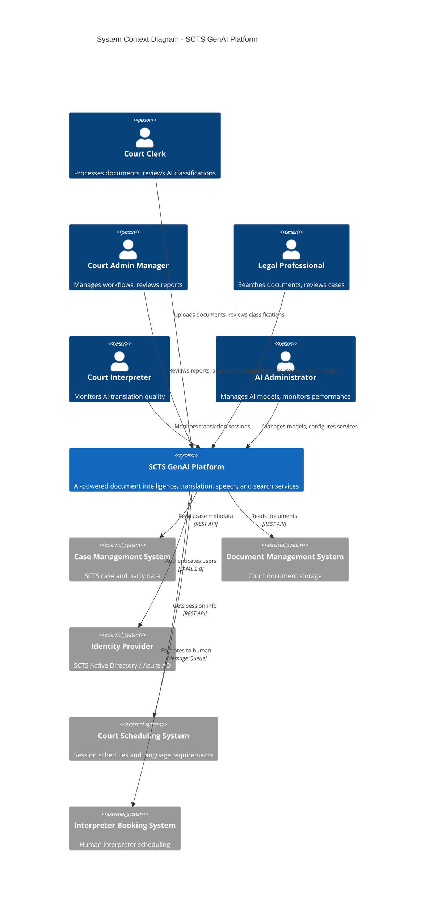

### External Systems

| System | Integration Type | Data Flow | Owner |
|--------|------------------|-----------|-------|
| Case Management System | REST API (read) | Case metadata, party info | SCTS ICT |
| Document Management System | REST API (read) + Events | Document content, metadata | SCTS ICT |
| Identity Provider | SAML 2.0 SSO | User identity, roles | SCTS ICT |
| Court Scheduling System | REST API (read) | Session schedules, languages | SCTS ICT |
| Interpreter Booking | Message Queue | Escalation requests | SCTS Operations |

### Users and Roles

| Role | Permissions | Primary Use Cases |
|------|-------------|-------------------|
| Court Clerk | Upload documents, review classifications, basic search | UC-1: Document Classification |
| Court Admin Manager | All clerk functions, reporting, quality review, approval | UC-1, UC-3 |
| Legal Professional | Search, document view (within authorised cases) | UC-3: Cognitive Search |
| Court Interpreter | Monitor translation, escalate to human | UC-2: Real-Time Translation |
| AI Administrator | Model deployment, configuration, monitoring | System administration |
| Auditor | Read-only audit log access | Compliance review |

---

## Container Diagram (C4 Level 2)

### Container Architecture

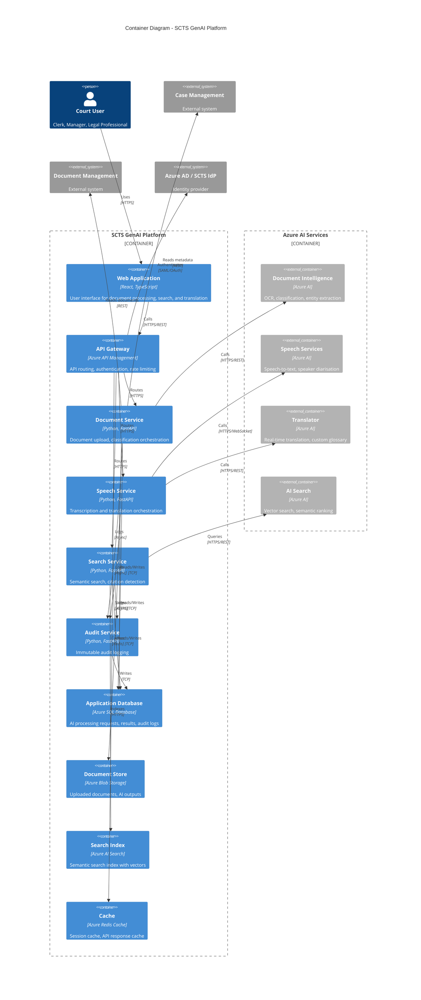

### Container Descriptions

| Container | Technology | Purpose | Scaling |
|-----------|------------|---------|---------|
| **Web Application** | React, TypeScript | User interface for all AI capabilities | CDN + multiple instances |
| **API Gateway** | Azure API Management | Central API routing, auth, rate limiting | Managed service |
| **Document Service** | Python, FastAPI, AKS | Orchestrates document classification workflow | Horizontal (pods) |
| **Speech Service** | Python, FastAPI, AKS | Orchestrates speech and translation | Horizontal (pods) |
| **Search Service** | Python, FastAPI, AKS | Orchestrates semantic search queries | Horizontal (pods) |
| **Audit Service** | Python, FastAPI, AKS | Immutable audit trail logging | Horizontal (pods) |
| **Application Database** | Azure SQL Database | Stores requests, results, audit logs | Vertical + read replicas |
| **Document Store** | Azure Blob Storage | Stores uploaded documents, AI outputs | Managed (virtually unlimited) |
| **Search Index** | Azure AI Search | Semantic search index with embeddings | Search Units (S1/S2) |
| **Cache** | Azure Redis Cache | Session and API response caching | Premium tier for HA |

---

## Component Architecture

### Document Intelligence Service

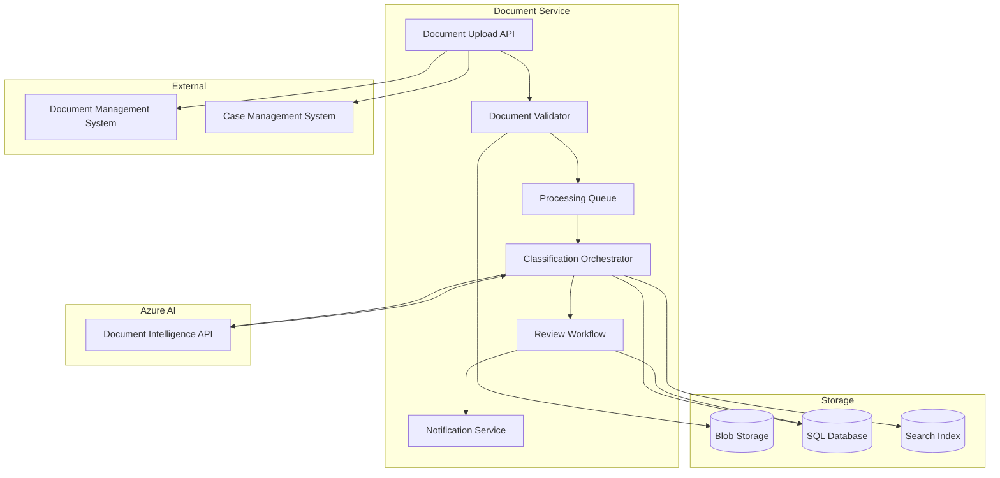

**Processing Flow**:
1. **Upload**: Document received via API or event from DMS
2. **Validate**: Check file type, size, malware scan
3. **Store**: Save to Blob Storage with encryption
4. **Queue**: Add to processing queue (async)
5. **Classify**: Call Azure Document Intelligence for OCR and classification
6. **Extract**: Extract entities (parties, dates, case numbers)
7. **Review**: Route to human review if confidence < 85%
8. **Index**: Add to search index after approval
9. **Notify**: Notify user of completion

### Speech and Translation Service

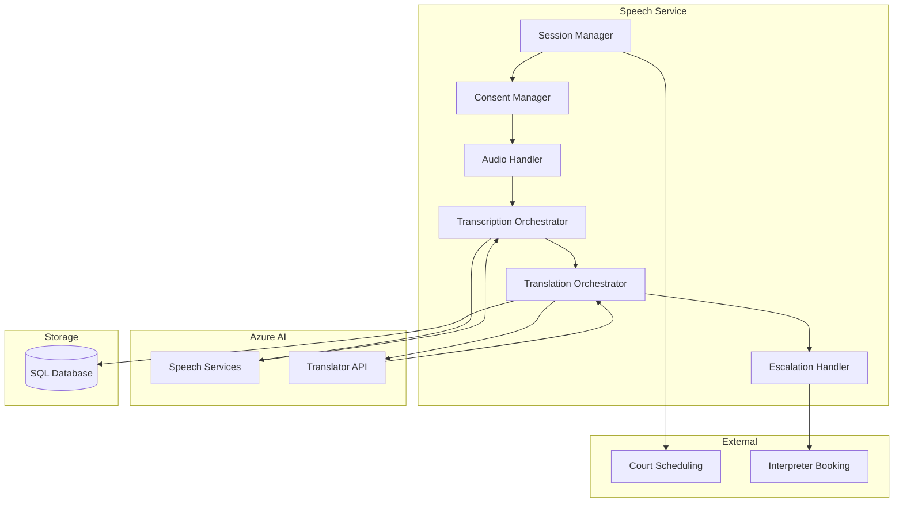

**Processing Flow**:
1. **Session Setup**: Get session details from Court Scheduling
2. **Consent**: Verify participant consent for AI translation
3. **Audio Stream**: Capture courtroom audio via secure channel
4. **Transcribe**: Real-time speech-to-text via Azure Speech
5. **Translate**: Real-time translation via Azure Translator
6. **Display**: Show translated text to participants
7. **Escalate**: If quality drops or participant requests, escalate to human interpreter
8. **Record**: Store session metadata and consent records

### Cognitive Search Service

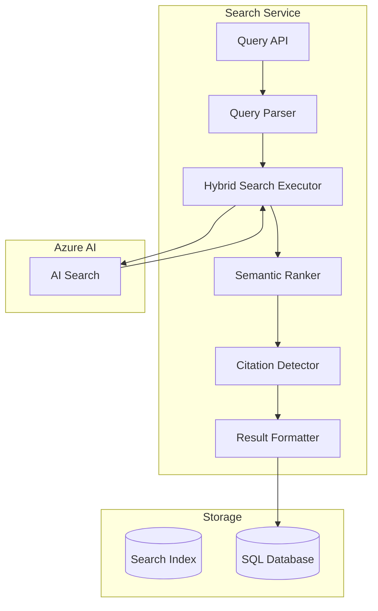

**Search Flow**:
1. **Query**: User enters natural language search
2. **Parse**: Extract keywords, entities, filters
3. **Hybrid Search**: Execute keyword + vector search
4. **Rank**: Apply semantic ranking for relevance
5. **Citations**: Detect case law citations in results
6. **Format**: Return results with highlighting and facets
7. **Log**: Record search for audit trail

---

## Integration Architecture

### API Design

All APIs follow RESTful design principles with OpenAPI 3.0 specifications.

| Service | Base Path | Authentication | Rate Limit |
|---------|-----------|----------------|------------|
| Document Service | `/api/v1/documents` | OAuth 2.0 Bearer | 100 req/min |
| Speech Service | `/api/v1/speech` | OAuth 2.0 Bearer | 50 req/min |
| Search Service | `/api/v1/search` | OAuth 2.0 Bearer | 200 req/min |
| Audit Service | `/api/v1/audit` | OAuth 2.0 Bearer (Admin) | 50 req/min |

### Integration Patterns

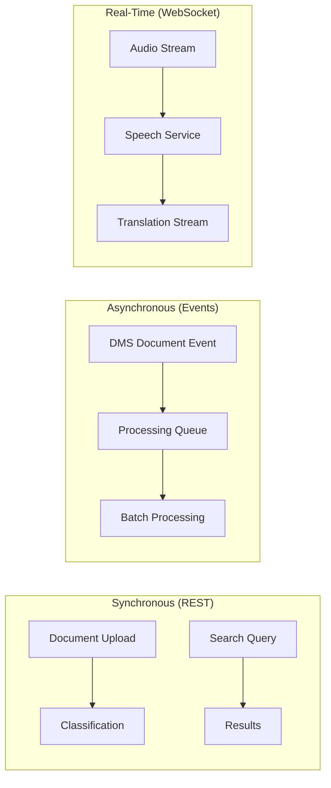

| Pattern | Use Case | Technology |
|---------|----------|------------|
| **Request/Response** | Document upload, search queries | REST API |
| **Event-Driven** | New document notification from DMS | Azure Service Bus |
| **Streaming** | Real-time audio transcription | WebSocket |
| **Batch** | Historical document indexing | Azure Functions (timer) |

### External System Integration

#### INT-001: Case Management System

```yaml
Integration: Case Management System
Type: REST API (Inbound from GenAI)
Direction: GenAI → Case Management (read-only)
Authentication: OAuth 2.0 Client Credentials
Data:
  - Case reference
  - Party information
  - Case status
  - Document list
Error Handling:
  - Retry: 3 attempts with exponential backoff
  - Circuit Breaker: Trip after 5 failures in 30s
  - Fallback: Return cached data or graceful error
SLA: < 1 second response, 99.5% availability
```

#### INT-002: Document Management System

```yaml
Integration: Document Management System
Type: REST API + Event Subscription
Direction: Bidirectional
Authentication: Mutual TLS + OAuth 2.0
Data:
  Inbound: Document content, metadata, classification
  Outbound: None (read-only access)
Events:
  - DocumentCreated: Triggers classification pipeline
  - DocumentUpdated: Re-index if relevant
Error Handling:
  - Retry: 3 attempts
  - Dead Letter Queue for failed events
SLA: < 2 seconds for document retrieval
```

#### INT-003: Identity Provider

```yaml
Integration: SCTS Active Directory via Azure AD
Type: SAML 2.0 SSO + OAuth 2.0
Direction: GenAI → IdP
Authentication: SAML assertions
Data:
  - User identity (UPN)
  - Display name
  - Email
  - Roles/Groups
Session:
  - Timeout: 30 minutes inactivity
  - Absolute: 8 hours
MFA: Required for admin functions
```

#### INT-006: Azure AI Services

```yaml
Integration: Azure AI Services (Document Intelligence, Speech, Translator, Search)
Type: REST API / WebSocket
Direction: GenAI Services → Azure AI
Authentication: API Key (rotated monthly) + Managed Identity
Data Residency: UK South region only
Error Handling:
  - Retry: 3 attempts with jitter
  - Circuit Breaker: Per-service isolation
  - Fallback: Queue for later processing
SLA: Per Azure AI Services SLA (99.9%)
```

---

## Data Architecture

### Data Flow Diagram

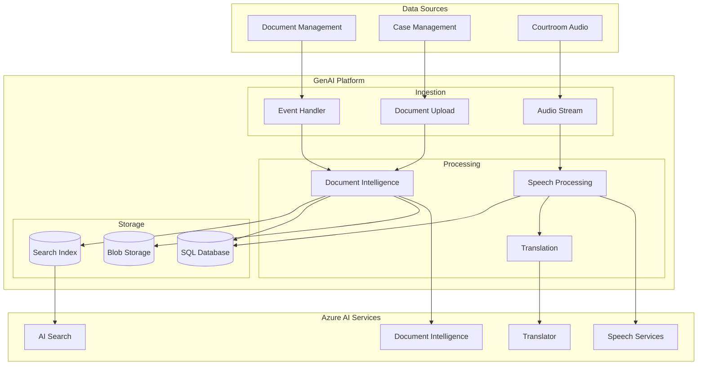

### Data Store Design

| Store | Technology | Purpose | Data Classification | Encryption |
|-------|------------|---------|---------------------|------------|
| **Application Database** | Azure SQL Database | Requests, results, audit | OFFICIAL-SENSITIVE | TDE + TLS |
| **Document Store** | Azure Blob Storage | Uploaded docs, AI outputs | OFFICIAL-SENSITIVE | SSE-CMK |
| **Search Index** | Azure AI Search | Semantic search vectors | OFFICIAL-SENSITIVE | Service-managed |
| **Cache** | Azure Redis Cache | Session, API cache | INTERNAL | TLS in-transit |
| **Audit Archive** | Azure Blob (Cool) | Long-term audit logs | OFFICIAL | SSE-CMK, WORM |

### Data Entity Mapping

Reference: Data Model (`data-model.md`)

| Entity | Primary Store | Secondary Store | Retention |
|--------|---------------|-----------------|-----------|
| E-001: USER | SQL Database | - | Employment + 7 years |
| E-002: AI_PROCESSING_REQUEST | SQL Database | - | 7 years |
| E-003: AI_PROCESSING_RESULT | SQL Database | Blob (large outputs) | 7 years |
| E-004: DOCUMENT_REFERENCE | SQL Database | - | Matches source |
| E-005: COURT_SESSION | SQL Database | - | 7 years |
| E-006: TRANSLATION_SESSION | SQL Database | - | 7 years |
| E-007: PARTICIPANT | SQL Database | - | 7 years (anonymise) |
| E-008: AUDIT_LOG | SQL Database | Blob (archive) | 7 years |
| E-009: SEARCH_INDEX_ENTRY | AI Search | - | Matches source |

### Data Residency and Sovereignty

**All data stored and processed within UK only** (TC-4 compliance):

| Data Type | Primary Location | Backup Location |
|-----------|------------------|-----------------|
| Application data | Azure UK South | Azure UK West |
| Documents | Azure UK South | Azure UK West (GRS) |
| Search index | Azure UK South | Azure UK West |
| AI processing | Azure UK South | N/A (stateless) |

**No cross-border data transfer**: All Azure AI Services configured for UK region only. Network policies block non-UK endpoints.

---

## Security Architecture

### Security Overview

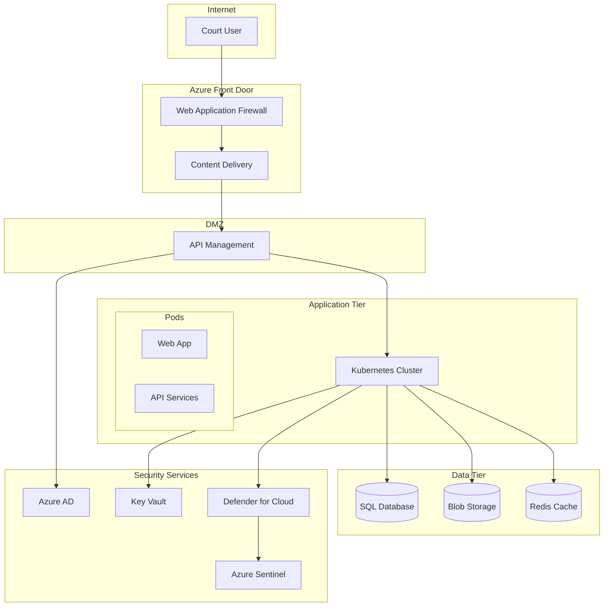

### Security Controls

| Control | Implementation | Principle |
|---------|----------------|-----------|
| **Authentication** | Azure AD SSO (SAML 2.0) | P-11: Security by Design |
| **MFA** | Azure AD Conditional Access | P-11: Security by Design |
| **Authorization** | RBAC with Azure AD Groups | P-11: Security by Design |
| **Encryption at Rest** | AES-256, Customer-Managed Keys | P-11: Security by Design |
| **Encryption in Transit** | TLS 1.3 minimum | P-11: Security by Design |
| **Network Security** | NSGs, Private Endpoints, WAF | P-11: Security by Design |
| **Secrets Management** | Azure Key Vault | P-11: Security by Design |
| **Vulnerability Scanning** | Defender for Cloud, SAST/DAST | P-11: Security by Design |
| **Audit Logging** | Azure Monitor, immutable logs | P-17: Observability |
| **SIEM** | Azure Sentinel integration | P-11: Security by Design |

### Zero Trust Implementation

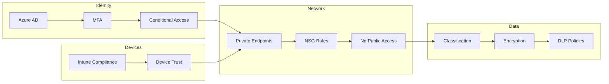

**Zero Trust Principles Applied**:
1. **Verify explicitly**: All requests authenticated via Azure AD
2. **Least privilege**: RBAC with minimum required permissions
3. **Assume breach**: Network segmentation, encryption everywhere, audit all access

### Role-Based Access Control

| Role | Azure AD Group | Permissions |
|------|----------------|-------------|
| Court Clerk | `SCTS-GenAI-Clerks` | Document upload, classification review, basic search |
| Court Admin Manager | `SCTS-GenAI-Managers` | All clerk + reporting, quality review, approval |
| Legal Professional | `SCTS-GenAI-Legal` | Search, document view (case-scoped) |
| Court Interpreter | `SCTS-GenAI-Interpreters` | Translation session monitoring |
| AI Administrator | `SCTS-GenAI-Admins` | Model deployment, configuration, monitoring |
| Auditor | `SCTS-GenAI-Auditors` | Read-only audit log access |

### Data Protection

**UK GDPR Compliance**:
- DPIA completed for all personal data processing
- Lawful basis: Public Task (Article 6(1)(e))
- Data minimisation enforced at collection
- Retention policies automated (7-year max)
- Subject access request workflow implemented

**Court Records Integrity** (P-14):
- Read-only access to court records from AI services
- AI outputs stored separately from official records
- Clear metadata distinguishing AI-generated content
- Human approval required before any AI content enters official records

---

## Infrastructure and Deployment Architecture

### Azure Infrastructure

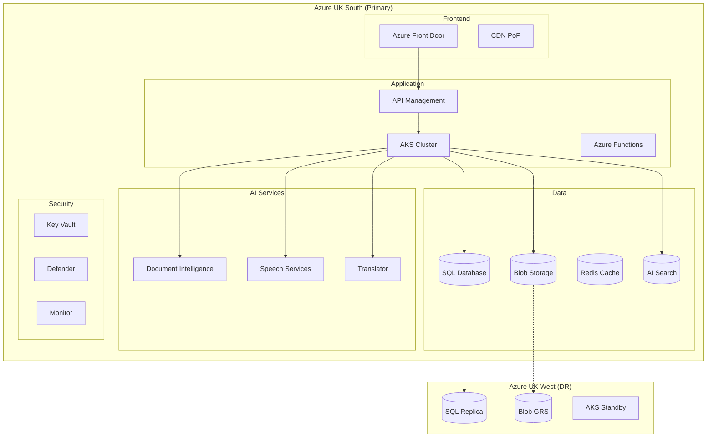

### Resource Sizing

| Resource | SKU/Tier | Quantity | Purpose |
|----------|----------|----------|---------|
| **AKS Cluster** | Standard_D4s_v3 | 3-6 nodes (auto) | Application workloads |
| **SQL Database** | Business Critical, 4 vCores | 1 primary + 1 replica | Application data |
| **Blob Storage** | Standard_GRS | 1 account | Document storage |
| **Redis Cache** | Premium P1 | 1 cluster | Session/API cache |
| **AI Search** | Standard S1 | 2 search units | Search index |
| **API Management** | Standard | 1 unit | API gateway |
| **Front Door** | Standard | 1 profile | CDN and WAF |
| **Key Vault** | Standard | 1 vault | Secrets management |

### Kubernetes Architecture

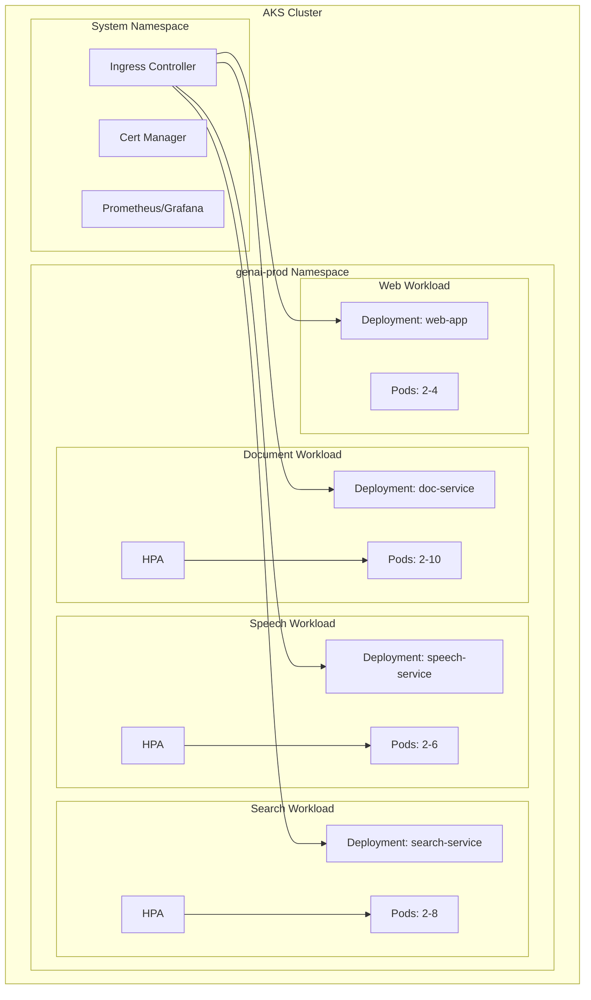

### CI/CD Pipeline

```mermaid
flowchart LR
    subgraph "Source"
        Git[Azure DevOps Git]
    end

    subgraph "Build"
        PR[PR Validation]
        Build[Docker Build]
        SAST[Security Scan]
        Test[Unit Tests]
    end

    subgraph "Registry"
        ACR[Azure Container Registry]
    end

    subgraph "Deploy"
        Dev[Dev Environment]
        Test_Env[Test Environment]
        Prod[Production]
    end

    Git --> PR
    PR --> Build
    Build --> SAST
    SAST --> Test
    Test --> ACR
    ACR --> Dev
    Dev --> Test_Env
    Test_Env --> Prod
```

**Deployment Strategy**: Blue-Green with automated rollback

| Stage | Trigger | Approval | Environment |
|-------|---------|----------|-------------|
| Dev | PR merge to develop | Automatic | genai-dev |
| Test | Release branch | QA team | genai-test |
| Production | Tag release | Change Advisory Board | genai-prod |

### Disaster Recovery

| Metric | Target | Design |
|--------|--------|--------|
| **RTO** | 4 hours | AKS standby in UK West, automated failover |
| **RPO** | 1 hour | SQL geo-replication, Blob GRS |
| **Backup** | Daily | Automated Azure Backup |

**DR Procedure**:
1. Monitor detects UK South unavailability
2. DNS failover to UK West (automated via Traffic Manager)
3. AKS standby scaled up
4. SQL replica promoted to primary
5. Services restored within RTO

---

## Non-Functional Requirements Approach

### Performance (NFR-P)

| Requirement | Target | Design Approach |
|-------------|--------|-----------------|
| **NFR-P-001**: API Response | < 2 seconds (p95) | Redis caching, async processing, CDN |
| **NFR-P-002**: Translation latency | < 2 seconds | WebSocket streaming, Azure Speech real-time |
| **NFR-P-003**: Search response | < 5 seconds | Azure AI Search semantic ranking, index optimisation |

**Performance Design Patterns**:
- **Caching**: Redis for API responses, session state
- **Async Processing**: Queue-based document processing
- **CDN**: Static assets via Azure Front Door
- **Connection Pooling**: Database connection pools
- **Index Optimisation**: Search index tuning for query patterns

### Availability (NFR-A)

| Requirement | Target | Design Approach |
|-------------|--------|-----------------|
| **NFR-A-001**: System availability | 99.5% | Multi-AZ deployment, health checks |
| **NFR-A-002**: Disaster recovery | 4h RTO, 1h RPO | UK West DR, geo-replication |
| **NFR-A-003**: Graceful degradation | Courts function without AI | Circuit breakers, manual fallbacks |

**Resilience Patterns**:
- **Circuit Breaker**: Polly library, trip after 5 failures in 30s
- **Retry**: Exponential backoff with jitter
- **Timeout**: 30 second max for AI calls
- **Health Checks**: Kubernetes liveness/readiness probes
- **Fallback**: Queue for later processing, manual procedures

### Scalability (NFR-S)

| Requirement | Target | Design Approach |
|-------------|--------|-----------------|
| **NFR-S-001**: Horizontal scaling | Auto-scale to demand | AKS HPA, pod scaling |
| **NFR-S-002**: Data volume | 10TB over 5 years | Azure AI Search S1/S2, Blob tiering |

**Scaling Design**:
- **Application**: Kubernetes HPA based on CPU/memory/queue depth
- **Database**: Read replicas for reporting, elastic pool for burst
- **Search**: Scale search units as index grows
- **Storage**: Blob tiering (hot → cool → archive)

### Security (NFR-SEC)

| Requirement | Design Approach |
|-------------|-----------------|
| **NFR-SEC-001**: Authentication | Azure AD SSO, SAML 2.0 |
| **NFR-SEC-002**: Authorization | RBAC with Azure AD groups |
| **NFR-SEC-003**: Encryption | TLS 1.3, AES-256, CMK |
| **NFR-SEC-004**: UK data residency | UK regions only, network policies |
| **NFR-SEC-005**: Vulnerability mgmt | Defender, SAST/DAST, pen testing |
| **NFR-SEC-006**: Court record protection | Read-only access, separate storage |

### Compliance (NFR-C)

| Requirement | Design Approach |
|-------------|-----------------|
| **NFR-C-001**: UK GDPR | Privacy by design, DPIA, retention automation |
| **NFR-C-002**: Audit logging | Immutable logs, 7-year retention |
| **NFR-C-003**: Scottish Gov standards | Cyber Resilience Framework compliance |
| **NFR-C-004**: AI transparency | Confidence scores, AI output labelling |

### Observability (NFR-M-001)

**Monitoring Stack**:

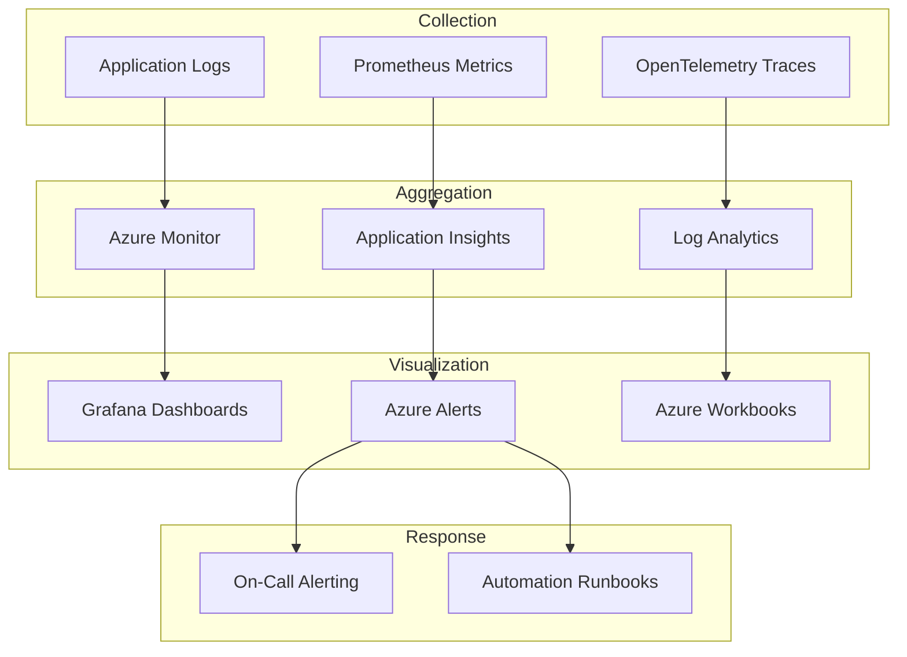

**Key Metrics Monitored**:
- **Availability**: Service health, endpoint response
- **Performance**: Latency (p50/p95/p99), throughput, error rates
- **AI Quality**: Classification accuracy, translation quality scores, confidence distributions
- **Business**: Documents processed, translation sessions, search queries
- **Security**: Authentication failures, anomalous access patterns

---

## Technology Stack

### Technology Decisions

| Layer | Technology | Rationale |
|-------|------------|-----------|
| **Frontend** | React 18, TypeScript | Modern SPA, strong typing, accessibility support |
| **API Gateway** | Azure API Management | Managed service, built-in auth, rate limiting |
| **Backend Services** | Python 3.11, FastAPI | AI/ML ecosystem, async support, performance |
| **Container Orchestration** | Azure Kubernetes Service | Managed K8s, Azure integration, scaling |
| **Database** | Azure SQL Database | ACID compliance, geo-replication, familiar |
| **Document Storage** | Azure Blob Storage | Cost-effective, encryption, tiering |
| **Search** | Azure AI Search | Vector search, semantic ranking, managed |
| **Cache** | Azure Redis Cache | Session state, API caching, HA |
| **Message Queue** | Azure Service Bus | Reliable messaging, dead letter queues |
| **AI - Documents** | Azure AI Document Intelligence | G-Cloud, UK region, custom models |
| **AI - Speech** | Azure Speech Services | Real-time, 100+ languages, diarisation |
| **AI - Translation** | Azure Translator | All 10 languages, custom glossary |
| **Identity** | Azure AD | SSO, MFA, RBAC, existing SCTS integration |
| **Secrets** | Azure Key Vault | HSM-backed, rotation, audit |
| **Monitoring** | Azure Monitor, Application Insights | Native integration, comprehensive telemetry |
| **CI/CD** | Azure DevOps | Existing SCTS tooling, pipelines |

### Technology Constraints

| Constraint | Requirement | How Addressed |
|------------|-------------|---------------|
| **TC-2**: Azure deployment | All workloads on Azure | All services Azure-native |
| **TC-3**: SCTS Active Directory | Use existing IdP | Azure AD with SCTS AD sync |
| **TC-4**: UK data residency | UK processing only | UK South/West regions, network policies |
| **TC-5**: Updateable AI models | Model updates without redeploy | Azure AI managed models, versioning |

---

## Architecture Decisions

### ADR-001: Azure AI Services vs Custom ML

**Decision**: Use Azure AI Services (Document Intelligence, Speech, Translator, AI Search)

**Context**: Need AI capabilities for document processing, speech, translation, and search. Options were build custom ML models or use managed Azure AI Services.

**Options Considered**:
1. Build custom models (PyTorch, Hugging Face)
2. Azure AI Services
3. Open source (Whisper, OPUS-MT, Elasticsearch)
4. Multi-vendor (DeepL, Elastic)

**Decision Rationale**:
- Azure AI Services provides 3-year TCO of £716K vs £2.5M+ for custom build
- G-Cloud approved simplifies procurement
- UK data residency guaranteed
- Native Azure integration (TC-2 compliance)
- Custom model training available for legal domain
- Lower operational risk with managed services

**Consequences**:
- (+) Faster time to value
- (+) Lower operational burden
- (+) Proven scalability
- (-) Vendor lock-in to Microsoft
- (-) Per-unit pricing at scale

**Status**: Accepted

---

### ADR-002: Kubernetes vs App Service

**Decision**: Use Azure Kubernetes Service (AKS)

**Context**: Need container orchestration for microservices. Options were AKS or Azure App Service.

**Options Considered**:
1. Azure Kubernetes Service (AKS)
2. Azure App Service (containers)
3. Azure Container Instances

**Decision Rationale**:
- AKS provides finer control over scaling and deployment
- Supports complex networking (service mesh potential)
- Better cost optimisation at scale
- Standard deployment patterns across services
- Team has Kubernetes experience

**Consequences**:
- (+) Flexible scaling and deployment
- (+) Industry-standard platform
- (+) Good for microservices architecture
- (-) More operational complexity than App Service
- (-) Requires Kubernetes expertise

**Status**: Accepted

---

### ADR-003: Synchronous vs Asynchronous Document Processing

**Decision**: Asynchronous processing with queue-based architecture

**Context**: Document classification can take 5-30 seconds per document. Need to decide sync vs async processing.

**Options Considered**:
1. Synchronous (wait for result)
2. Asynchronous (queue-based)
3. Hybrid (sync for small, async for large)

**Decision Rationale**:
- User experience better with immediate acknowledgement
- Enables batch processing for backlog
- Handles variable processing times gracefully
- Better resilience to AI service failures
- Supports retry without user intervention

**Consequences**:
- (+) Better user experience
- (+) Handles volume spikes
- (+) Resilient to failures
- (-) More complex architecture
- (-) Eventual consistency

**Status**: Accepted

---

### ADR-004: Search Index Strategy

**Decision**: Hybrid search with vector embeddings and keyword matching

**Context**: Cognitive search requires semantic understanding. Options were keyword-only, vector-only, or hybrid.

**Options Considered**:
1. Keyword search only (BM25)
2. Vector search only (embeddings)
3. Hybrid search (keyword + vector)

**Decision Rationale**:
- Hybrid provides best relevance for legal documents
- Legal terminology benefits from exact keyword matching
- Semantic understanding helps with natural language queries
- Azure AI Search supports hybrid natively at no extra cost

**Consequences**:
- (+) Best search relevance
- (+) Handles both exact and semantic queries
- (+) Case law citation detection via keyword
- (-) Larger index size (vectors)
- (-) More complex query tuning

**Status**: Accepted

---

## Requirements Traceability

### Business Requirements Coverage

| Requirement | HLD Section | Components | Status |
|-------------|-------------|------------|--------|
| **BR-001**: 60% efficiency gain | Document Service, Search Service | Doc AI, AI Search | ✅ Addressed |
| **BR-002**: 10 language support | Speech Service | Azure Speech, Translator | ✅ Addressed |
| **BR-003**: Court records integrity | Security Architecture | RBAC, separate storage | ✅ Addressed |
| **BR-004**: Regulatory compliance | Security, Data Architecture | Encryption, audit, GDPR | ✅ Addressed |
| **BR-005**: Staff training | Out of scope | Documentation, training materials | ⚠️ Operational |
| **BR-006**: No job losses | Out of scope | Change management | ⚠️ Operational |

### Functional Requirements Coverage

| Requirement | Component | Azure Service | Status |
|-------------|-----------|---------------|--------|
| **FR-001**: Document upload | Document Service | Blob Storage | ✅ |
| **FR-002**: AI classification | Document Service | Document Intelligence | ✅ |
| **FR-003**: Human review | Document Service | Web App workflow | ✅ |
| **FR-004**: Speech-to-text | Speech Service | Speech Services | ✅ |
| **FR-005**: Real-time translation | Speech Service | Translator | ✅ |
| **FR-006**: Language support | Speech Service | Speech + Translator | ✅ |
| **FR-007**: Semantic search | Search Service | AI Search | ✅ |
| **FR-008**: Document indexing | Search Service | AI Search | ✅ |
| **FR-009**: Citation detection | Search Service | AI enrichment | ✅ |
| **FR-010**: Document similarity | Search Service | Vector search | ✅ |
| **FR-011**: AI output labelling | All services | Application layer | ✅ |
| **FR-012**: Audit trail | Audit Service | SQL + Blob | ✅ |
| **FR-013**: Model governance | DevOps pipeline | Versioning, approval | ✅ |
| **FR-014**: Training docs | Out of scope | Documentation | ⚠️ |
| **FR-015**: Consent management | Speech Service | Consent workflow | ✅ |

### Integration Requirements Coverage

| Requirement | HLD Section | Status |
|-------------|-------------|--------|
| **INT-001**: Case Management | Integration Architecture | ✅ |
| **INT-002**: Document Management | Integration Architecture | ✅ |
| **INT-003**: Identity Provider | Security Architecture | ✅ |
| **INT-004**: Court Scheduling | Integration Architecture | ✅ |
| **INT-005**: Interpreter Booking | Integration Architecture | ✅ |
| **INT-006**: Cloud AI Services | Integration Architecture | ✅ |

---

## Architecture Principles Compliance

### Compliance Matrix

| Principle | Compliance | Evidence |
|-----------|------------|----------|
| **P-1**: Justice-Centred Design | ✅ Full | AI augments court efficiency, access via translation |
| **P-2**: Human-in-the-Loop | ✅ Full | Review workflow, approval gates, confidence thresholds |
| **P-3**: Accessibility | ✅ Full | WCAG 2.2 AA, multilingual UI planned |
| **P-4**: Scalability | ✅ Full | AKS auto-scaling, Azure managed services |
| **P-5**: Resilience | ✅ Full | Circuit breakers, DR, graceful degradation |
| **P-6**: Interoperability | ✅ Full | REST APIs, OpenAPI specs, event-driven |
| **P-7**: Ethical AI | ⚠️ Partial | Bias assessment needed during implementation |
| **P-8**: AI Transparency | ✅ Full | Confidence scores, AI labelling, documentation |
| **P-9**: Model Governance | ✅ Full | Versioning, approval workflow, rollback |
| **P-10**: Data Quality | ✅ Full | Input validation, quality metrics |
| **P-11**: Security by Design | ✅ Full | Zero trust, encryption, RBAC, audit |
| **P-12**: Data Protection | ✅ Full | GDPR compliance, DPIA, privacy by design |
| **P-13**: Scottish Standards | ✅ Full | Cyber Resilience Framework aligned |
| **P-14**: Court Records Integrity | ✅ Full | Read-only access, separate AI storage |
| **P-15**: Data Sovereignty | ✅ Full | UK regions only, network policies |
| **P-16**: Single Source of Truth | ✅ Full | DMS/CMS remain authoritative |
| **P-17**: Observability | ✅ Full | Azure Monitor, dashboards, alerts |
| **P-18**: Cost Transparency | ✅ Full | Tagging, cost allocation, monitoring |
| **P-19**: Iterative Delivery | ✅ Full | Phased rollout, PoC → Pilot → Production |
| **P-20**: Automation | ✅ Full | CI/CD, IaC, automated testing |

### Principle Exceptions

| Principle | Exception | Justification | Remediation |
|-----------|-----------|---------------|-------------|
| **P-7**: Ethical AI | Bias assessment deferred | Assessment requires trained models | Complete during PoC phase |

---

## Appendices

### Appendix A: Glossary

| Term | Definition |
|------|------------|
| **AKS** | Azure Kubernetes Service |
| **API** | Application Programming Interface |
| **CDN** | Content Delivery Network |
| **CMK** | Customer-Managed Key |
| **DR** | Disaster Recovery |
| **GRS** | Geo-Redundant Storage |
| **HPA** | Horizontal Pod Autoscaler |
| **MFA** | Multi-Factor Authentication |
| **NSG** | Network Security Group |
| **RBAC** | Role-Based Access Control |
| **RTO** | Recovery Time Objective |
| **RPO** | Recovery Point Objective |
| **SAML** | Security Assertion Markup Language |
| **SSO** | Single Sign-On |
| **TDE** | Transparent Data Encryption |
| **TLS** | Transport Layer Security |
| **WAF** | Web Application Firewall |

### Appendix B: Reference Documents

| Document | ID | Purpose |
|----------|-----|---------|
| Requirements | ARC-001-REQ-v1.0 | Functional and non-functional requirements |
| Architecture Principles | ARC-001-PRIN-v1.0 | Design principles and constraints |
| Data Model | ARC-001-DATA-v1.0 | Entity definitions and relationships |
| Research Findings | ARC-001-RSCH-v1.0 | Technology evaluation and recommendations |
| DPIA | ARC-001-DPIA-v1.0 | Data protection impact assessment |
| Secure by Design | ARC-001-SBD-v1.0 | Security assessment |
| Risk Register | ARC-001-RISK-v1.0 | Risk identification and mitigation |

---

## Generation Metadata

**Generated by**: ArcKit `/arckit.hld-review` command (Option 2: Create HLD)
**Generated on**: 2026-01-17
**ArcKit Version**: 0.6.0
**Project**: SCTS GenAI Programme (Project 001)
**AI Model**: Claude Opus 4.5
**Input Artifacts**: requirements.md, architecture-principles.md, data-model.md, research-findings.md
