# MLOps Strategy: SCTS GenAI Programme

## Document Control

| Field | Value |
|-------|-------|
| **Document ID** | ARC-001-MLOPS-v1.0 |
| **Document Type** | MLOps Strategy |
| **Project** | SCTS GenAI Programme (Project 001) |
| **Classification** | OFFICIAL |
| **Status** | DRAFT |
| **Version** | 1.0 |
| **Created Date** | 2026-01-20 |
| **Last Modified** | 2026-01-20 |
| **Review Cycle** | Quarterly |
| **Next Review Date** | 2026-04-20 |
| **Owner** | Senior AI Technical Architect |
| **Reviewed By** | [PENDING] |
| **Approved By** | [PENDING] |
| **Distribution** | CDi Function, AI Team, Data Protection Officer |

## Revision History

| Version | Date | Author | Changes | Approved By | Approval Date |
|---------|------|--------|---------|-------------|---------------|
| 1.0 | 2026-01-20 | ArcKit AI | Initial creation from `/arckit.mlops` command | [PENDING] | [PENDING] |

---

## Executive Summary

This document defines the Machine Learning Operations (MLOps) strategy for the SCTS GenAI Programme. It establishes the practices, tooling, and governance required to operationalise AI/ML capabilities across document intelligence, speech services, translation, and cognitive search.

### MLOps Maturity Target

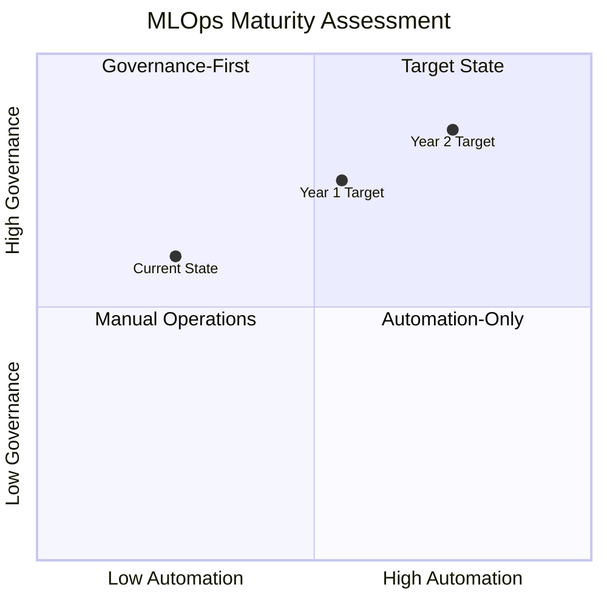

**Current State:** Level 0-1 (Manual/Ad-hoc) - Pre-deployment, design phase
**Year 1 Target:** Level 2 (Automated Training) - Automated pipelines, manual deployment approval
**Year 2 Target:** Level 3 (Continuous Monitoring) - Automated retraining triggers, continuous monitoring

### Key Design Decisions

| Decision | Choice | Rationale |
|----------|--------|-----------|
| **ML Platform** | Azure Machine Learning + Azure AI Services | G-Cloud compliant, UK data residency, integrated ML lifecycle |
| **Model Approach** | Pre-built Azure AI + Custom Terminology | Leverage managed services; customise only where domain-specific |
| **Training Data** | SCTS Legal Taxonomy + Custom Glossaries | No personal data in training; domain expertise encoded |
| **Monitoring** | Azure Monitor + Custom Dashboards | Native integration, compliance with observability requirements |
| **Human Oversight** | Human-in-the-Loop for all consequential decisions | Mandatory per architecture principles and AI Playbook |

---

## 1. ML System Overview

### 1.1 AI Capabilities Matrix

The SCTS GenAI Programme comprises four primary AI capabilities, each with distinct ML characteristics:

| Capability | AI Type | Model Source | Customisation | Training Data |
|------------|---------|--------------|---------------|---------------|
| **Document Intelligence** | Classification, NER, OCR | Azure AI Document Intelligence | Custom legal taxonomy | Scottish court document taxonomy |
| **Speech Services** | Speech Recognition, Diarisation | Azure AI Speech Services | Acoustic adaptation | Audio samples (anonymised) |
| **Translation Services** | Neural Machine Translation | Azure Translator | Custom glossary | Legal terminology dictionary |
| **Cognitive Search** | Vector Embeddings, Ranking | Azure AI Search + OpenAI | Index configuration | Document corpus metadata |

### 1.2 ML Architecture Overview

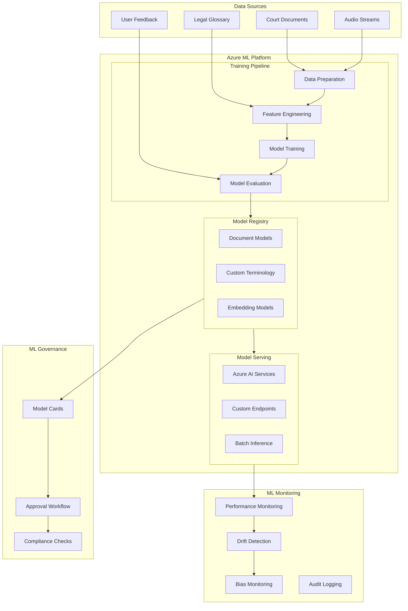

### 1.3 Model Types and Sources

#### Pre-Built Azure AI Models (Managed)
- **Azure AI Document Intelligence**: Pre-trained document understanding
- **Azure Speech Services**: Speech-to-text models for 10+ languages
- **Azure Translator**: Neural machine translation for 100+ languages
- **Azure OpenAI**: Text embeddings for semantic search

#### Custom-Trained Components
- **Legal Document Taxonomy**: Multi-class classifier for Scottish court document types
- **Legal Terminology Glossary**: Custom translation memory for legal terms
- **Entity Recognition**: Court-specific named entity extraction

---

## 2. Model Inventory

### 2.1 Production Model Catalogue

| Model ID | Name | Type | Version | Status | Owner | Last Updated |
|----------|------|------|---------|--------|-------|--------------|
| MOD-001 | Document Classifier | Classification | 1.0.0 | In Development | AI Architect | 2026-01-20 |
| MOD-002 | Legal Entity Extractor | NER | 1.0.0 | In Development | AI Architect | 2026-01-20 |
| MOD-003 | Speech Transcriber (EN) | ASR | Azure Managed | Planned | Azure | - |
| MOD-004 | Speech Transcriber (Multi) | ASR | Azure Managed | Planned | Azure | - |
| MOD-005 | Legal Translator | NMT | Azure + Custom | In Development | AI Architect | 2026-01-20 |
| MOD-006 | Document Embeddings | Embeddings | Azure Managed | Planned | Azure | - |
| MOD-007 | Semantic Ranker | Ranking | Azure Managed | Planned | Azure | - |

### 2.2 Model Cards

Each model must have a Model Card documenting its characteristics, limitations, and governance:

#### Model Card Template

```markdown
# Model Card: [Model Name]

## Model Details
- **Model ID**: MOD-XXX
- **Version**: X.Y.Z
- **Type**: [Classification/NER/ASR/NMT/Embeddings]
- **Framework**: [Azure AI/Custom PyTorch/etc.]
- **Owner**: [Name]
- **Last Updated**: [Date]

## Intended Use
- **Primary Use Case**: [Description]
- **Users**: [Court Clerks/Legal Professionals/etc.]
- **Out of Scope**: [What the model should NOT be used for]

## Training Data
- **Data Source**: [Description]
- **Data Size**: [N samples]
- **Data Period**: [Date range]
- **Data Processing**: [Anonymisation, filtering, etc.]
- **Personal Data**: [None/Description of handling]

## Performance Metrics
- **Accuracy**: [X%]
- **Precision/Recall**: [X%/X%]
- **Latency (p95)**: [Xms]
- **Confidence Threshold**: [X%]

## Limitations and Biases
- **Known Limitations**: [List]
- **Potential Biases**: [List]
- **Mitigation Measures**: [List]

## Ethical Considerations
- **Fairness Testing**: [Status]
- **Human Oversight**: [Required/Optional]
- **ATRS Compliance**: [Yes/No]

## Deployment
- **Environment**: [Dev/Staging/Prod]
- **Endpoint**: [URL]
- **SLA**: [Availability %]

## Monitoring
- **Drift Detection**: [Enabled/Disabled]
- **Alert Thresholds**: [List]
- **Review Cadence**: [Weekly/Monthly/Quarterly]
```

### 2.3 Model Versioning Strategy

**Semantic Versioning for Models:**
- **MAJOR** (X.0.0): Architecture changes, retraining from scratch, breaking API changes
- **MINOR** (0.X.0): Incremental training, new features, performance improvements
- **PATCH** (0.0.X): Bug fixes, configuration changes, no model changes

**Version Control:**
- Models stored in Azure ML Model Registry
- Git-based tracking of model configurations and training scripts
- Immutable model artifacts with cryptographic hashes
- Full lineage from training data to deployed model

---

## 3. Training Pipeline Architecture

### 3.1 Training Pipeline Overview

```mermaid
flowchart LR
    subgraph DataIngestion["Data Ingestion"]
        RawData["Raw Data"]
        DataVal["Data Validation"]
        DataVer["Data Versioning"]
    end

    subgraph Preparation["Data Preparation"]
        Clean["Data Cleaning"]
        Anon["Anonymisation"]
        Split["Train/Val/Test Split"]
    end

    subgraph Training["Model Training"]
        Features["Feature Engineering"]
        Train["Training Job"]
        HPTune["Hyperparameter Tuning"]
    end

    subgraph Evaluation["Evaluation"]
        Metrics["Metric Calculation"]
        Bias["Bias Testing"]
        Compare["Baseline Comparison"]
    end

    subgraph Registration["Model Registration"]
        Approve["Approval Gate"]
        Register["Model Registry"]
        Cards["Model Card Update"]
    end

    RawData --> DataVal --> DataVer
    DataVer --> Clean --> Anon --> Split
    Split --> Features --> Train --> HPTune
    HPTune --> Metrics --> Bias --> Compare
    Compare --> Approve --> Register --> Cards
```

### 3.2 Training Data Management

#### Data Sources

| Data Type | Source | Volume | Sensitivity | Anonymisation |
|-----------|--------|--------|-------------|---------------|
| Document Taxonomy | Manual curation | 500 exemplars | Internal | N/A |
| Legal Glossary | Expert input | 5,000 terms | Internal | N/A |
| Translation Memory | Professional translators | 10,000 pairs | Internal | N/A |
| User Feedback | Production system | Ongoing | Internal | Required |

#### Data Governance Principles

1. **No Personal Data in Training**: Models trained on taxonomy, glossary, and anonymised examples only
2. **Data Versioning**: All training data versioned with DVC or Azure ML Data Assets
3. **Data Lineage**: Full traceability from source to model
4. **Data Quality**: Validation checks before training pipeline execution
5. **Expert Review**: Domain experts validate training data quality

### 3.3 Training Infrastructure

**Compute Resources:**
- **Development**: Azure ML Compute Instances (Standard_DS3_v2)
- **Training**: Azure ML Compute Clusters (Standard_NC6s_v3 for GPU workloads)
- **Hyperparameter Tuning**: Azure ML HyperDrive

**Training Schedule:**
- **Initial Training**: One-time setup during development
- **Retraining Triggers**: Performance degradation, data drift, scheduled quarterly review
- **Emergency Retraining**: On detection of critical issues

### 3.4 Training Pipeline Implementation

```yaml
# Azure ML Pipeline Definition (Conceptual)
training_pipeline:
  name: scts-document-classifier-training
  description: Training pipeline for legal document classification

  steps:
    - name: data_validation
      type: python_script
      script: src/data/validate.py
      inputs:
        - raw_data: azureml:legal-taxonomy:latest
      outputs:
        - validated_data: azureml:validated-data

    - name: feature_engineering
      type: python_script
      script: src/features/build_features.py
      inputs:
        - validated_data: ${{steps.data_validation.outputs.validated_data}}
      outputs:
        - features: azureml:training-features

    - name: model_training
      type: python_script
      script: src/models/train.py
      compute: gpu-cluster
      inputs:
        - features: ${{steps.feature_engineering.outputs.features}}
        - hyperparameters: azureml:hyperparams:latest
      outputs:
        - model: azureml:document-classifier

    - name: model_evaluation
      type: python_script
      script: src/evaluation/evaluate.py
      inputs:
        - model: ${{steps.model_training.outputs.model}}
        - test_data: azureml:test-data:latest
      outputs:
        - metrics: azureml:evaluation-metrics
        - bias_report: azureml:bias-report

    - name: model_registration
      type: register_model
      inputs:
        - model: ${{steps.model_training.outputs.model}}
        - metrics: ${{steps.model_evaluation.outputs.metrics}}
      conditions:
        - accuracy >= 0.90
        - bias_score <= 0.10
```

---

## 4. Model Serving Architecture

### 4.1 Serving Patterns

| Pattern | Use Case | Latency | Implementation |
|---------|----------|---------|----------------|
| **Real-time API** | Document classification, translation | <2s | Azure AI Services + AKS |
| **Streaming** | Live transcription | <500ms | Azure Speech Services |
| **Batch** | Historical document indexing | N/A | Azure ML Batch Endpoints |
| **Embedded** | Edge scenarios (future) | <100ms | Not in initial scope |

### 4.2 Serving Architecture

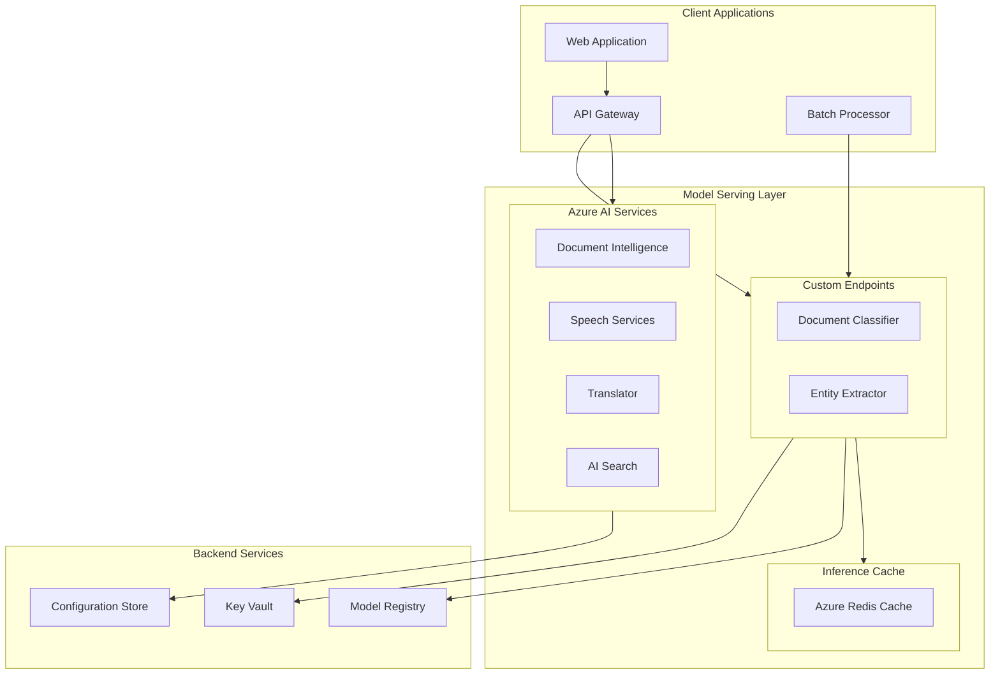

### 4.3 Deployment Strategies

#### Blue-Green Deployment
- Primary deployment strategy for model updates
- New model version deployed to "green" environment
- Traffic switched after validation
- Instant rollback capability

#### Canary Deployment
- Used for high-risk model changes
- 5% → 25% → 50% → 100% traffic progression
- Automated rollback on metric degradation

#### Shadow Deployment
- New models run in parallel without serving responses
- Performance compared against production baseline
- Used for major version changes

### 4.4 Model Deployment Pipeline

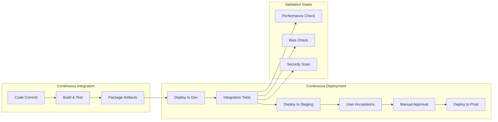

### 4.5 Rollback Procedures

**Automated Rollback Triggers:**
- Error rate > 5% for 5 minutes
- Latency p95 > 3x baseline for 10 minutes
- Model confidence average drops > 20%

**Manual Rollback Process:**
1. Incident detected and classified
2. On-call engineer notified
3. Decision to rollback (< 15 minutes)
4. Execute rollback command
5. Verify service restoration
6. Post-incident review

---

## 5. Model Monitoring

### 5.1 Monitoring Framework

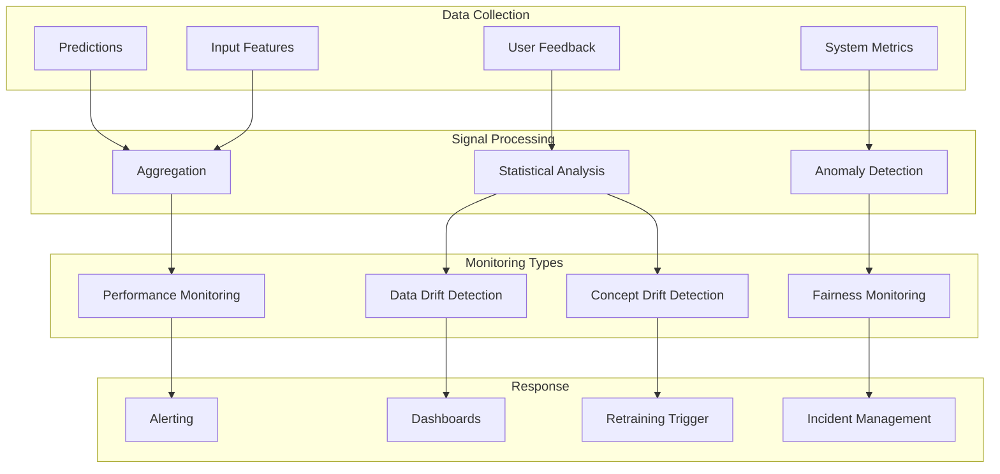

### 5.2 Key Metrics

#### Model Performance Metrics

| Metric | Description | Target | Alert Threshold | Measurement |
|--------|-------------|--------|-----------------|-------------|
| **Classification Accuracy** | Correct classifications / total | ≥90% | <85% | Daily |
| **Translation Accuracy** | BLEU score for legal terms | ≥85% | <80% | Weekly |
| **Transcription WER** | Word Error Rate | ≤5% | >10% | Daily |
| **Search Relevance** | nDCG@10 | ≥0.8 | <0.7 | Weekly |
| **Confidence Score Avg** | Mean model confidence | Monitor | ±15% shift | Continuous |
| **Human Override Rate** | Corrections / total predictions | Monitor | >20% | Daily |

#### Operational Metrics

| Metric | Description | Target | Alert Threshold |
|--------|-------------|--------|-----------------|
| **Latency (p50)** | Median response time | <1s | >2s |
| **Latency (p95)** | 95th percentile | <2s | >5s |
| **Latency (p99)** | 99th percentile | <5s | >10s |
| **Error Rate** | Failed requests / total | <0.1% | >1% |
| **Throughput** | Requests per second | ≥100 | <50 |
| **GPU Utilisation** | GPU compute usage | 60-80% | >95% |

### 5.3 Drift Detection

#### Data Drift Monitoring

**Input Feature Distributions:**
- Document type distribution
- Document length distribution
- Language distribution for translation
- Audio quality metrics for speech

**Detection Methods:**
- Kolmogorov-Smirnov test for continuous features
- Chi-square test for categorical features
- Population Stability Index (PSI)
- Custom threshold alerts

#### Concept Drift Monitoring

**Output Distribution Changes:**
- Classification distribution shifts
- Confidence score distribution changes
- Human override rate trends
- User feedback sentiment

**Detection Methods:**
- ADWIN (Adaptive Windowing)
- Page-Hinkley test
- Exponentially Weighted Moving Average
- A/B comparison with baseline

### 5.4 Bias and Fairness Monitoring

**Protected Attributes:**
- Language (10 supported languages)
- Document type
- Court location

**Fairness Metrics:**

| Metric | Description | Target | Frequency |
|--------|-------------|--------|-----------|
| **Accuracy Parity** | Max accuracy difference between groups | ≤5% | Monthly |
| **Translation Quality Parity** | BLEU score variance across languages | ≤10% | Quarterly |
| **Service Availability Parity** | Uptime across language services | ≤1% | Continuous |
| **Error Rate Parity** | Error rate variance across groups | ≤2% | Monthly |

**Bias Detection Process:**
1. Segment predictions by protected attribute
2. Calculate metrics for each segment
3. Compare against overall baseline
4. Alert on threshold breaches
5. Root cause analysis
6. Remediation if confirmed

### 5.5 Alerting Configuration

```yaml
# Alert Configuration (Conceptual)
alerts:
  - name: model_accuracy_degradation
    metric: classification_accuracy
    condition: < 0.85
    duration: 1 hour
    severity: high
    actions:
      - notify: ai-team@scts.gov.uk
      - create_incident: true
      - runbook: /runbooks/accuracy-degradation.md

  - name: translation_bias_detected
    metric: translation_accuracy_variance
    condition: > 0.10
    duration: 24 hours
    severity: critical
    actions:
      - notify: dpo@scts.gov.uk
      - notify: ai-team@scts.gov.uk
      - create_incident: true
      - runbook: /runbooks/bias-investigation.md

  - name: data_drift_warning
    metric: input_distribution_psi
    condition: > 0.2
    duration: 7 days
    severity: medium
    actions:
      - notify: ai-team@scts.gov.uk
      - trigger: drift_analysis_pipeline
```

---

## 6. Feature Store

### 6.1 Feature Store Architecture

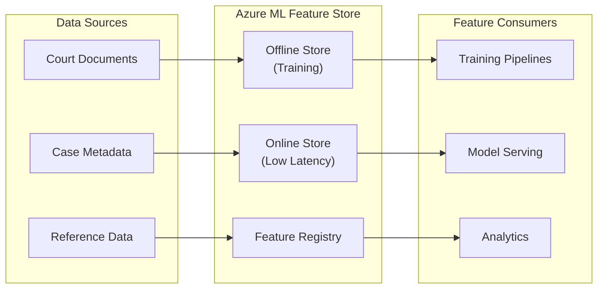

### 6.2 Feature Groups

| Feature Group | Description | Storage | Freshness |
|---------------|-------------|---------|-----------|
| **Document Features** | Text statistics, structure metrics | Offline | Batch |
| **Case Features** | Case type, court level, dates | Online + Offline | Real-time |
| **Language Features** | Language detection, complexity | Online | Real-time |
| **User Features** | User role, permissions | Online | Real-time |
| **Reference Features** | Legal taxonomy, glossary | Online + Offline | Daily |

### 6.3 Feature Versioning

- Features versioned alongside models
- Point-in-time correctness for training
- Feature lineage tracked
- Deprecated features clearly marked

---

## 7. Experiment Tracking

### 7.1 Experiment Management

**MLflow Integration with Azure ML:**
- All experiments logged to Azure ML workspace
- Metrics, parameters, and artifacts tracked
- Model comparison and selection
- Reproducibility through logged configurations

### 7.2 Experiment Tracking Structure

```
experiments/
├── document-classification/
│   ├── baseline-v1/
│   │   ├── metrics.json
│   │   ├── params.yaml
│   │   ├── model/
│   │   └── artifacts/
│   ├── legal-taxonomy-v2/
│   └── transformer-experiment/
├── translation-quality/
│   ├── baseline-azure/
│   └── custom-glossary-v1/
└── speech-accuracy/
    ├── english-baseline/
    └── multilingual-v1/
```

### 7.3 Experiment Governance

- Experiments require hypothesis documentation
- Results reviewed before production consideration
- Failed experiments retained for learning
- Quarterly experiment retrospectives

---

## 8. Responsible AI Operations

### 8.1 Responsible AI Framework

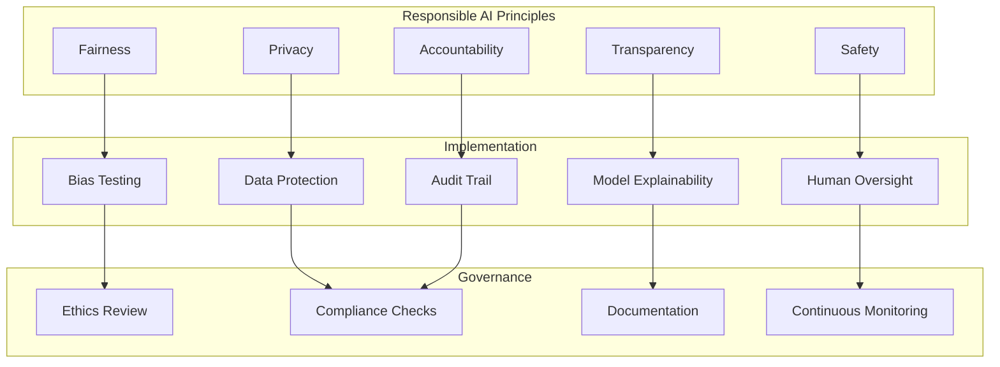

### 8.2 Bias Testing Requirements

**Pre-Deployment Testing:**

| Test | Scope | Pass Criteria | Frequency |
|------|-------|---------------|-----------|
| Translation accuracy by language | 10 languages | ≤10% variance | Before deployment |
| Document classification by type | All types | ≤5% variance | Before deployment |
| Entity extraction completeness | All entity types | ≤5% variance | Before deployment |

**Production Monitoring:**

| Monitor | Scope | Alert Threshold | Frequency |
|---------|-------|-----------------|-----------|
| Accuracy by language | 10 languages | >10% variance | Weekly |
| Human override by category | Document types | >15% any category | Daily |
| User feedback sentiment | All services | Negative trend | Continuous |

### 8.3 Explainability

**Model Interpretability:**
- Document classification: Feature importance, attention visualisation
- Translation: Source-target alignment, confidence indicators
- Search ranking: Relevance factor breakdown

**User-Facing Explanations:**
- Confidence scores displayed with all predictions
- "Why this result?" feature for search
- Translation alternatives shown when confidence low

### 8.4 Human Oversight Integration

**Human-in-the-Loop Requirements (per Architecture Principle 2):**

| Capability | Human Review Requirement | Override Capability |
|------------|-------------------------|---------------------|
| Document Classification | All predictions reviewed | Always available |
| Translation | Low confidence flagged | Interpreter on demand |
| Search Results | User validates relevance | Always available |
| Entity Extraction | All extractions validated | Always available |

**Escalation Matrix:**

| Confidence Level | Action | Escalation |
|------------------|--------|------------|
| ≥90% | Display with standard review | Clerk |
| 70-89% | Highlight for careful review | Clerk + visual indicator |
| 50-69% | Require supervisor review | Manager |
| <50% | Manual processing only | Manager + audit flag |

### 8.5 ATRS Compliance

**Algorithmic Transparency Recording Standard Integration:**

- All models documented in ATRS record
- Model purposes and limitations published
- Bias testing results included in ATRS
- Annual ATRS review aligned with model review
- Public transparency statement maintained

Reference: `projects/001-scts-genai-programme/atrs-record.md`

---

## 9. Model Governance

### 9.1 Governance Framework

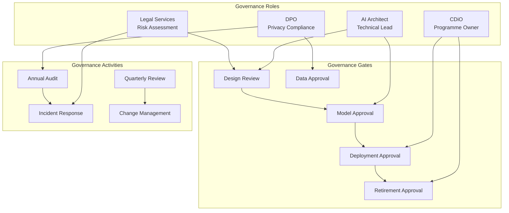

### 9.2 Model Lifecycle Governance

| Phase | Approver | Artefacts Required | SLA |
|-------|----------|-------------------|-----|
| **Design** | AI Architect, Legal | Design doc, risk assessment | 5 days |
| **Data Preparation** | DPO, AI Architect | Data lineage, privacy review | 10 days |
| **Training** | AI Architect | Training report, metrics | 3 days |
| **Evaluation** | AI Architect, DPO | Evaluation report, bias assessment | 5 days |
| **Staging Deployment** | AI Architect | Deployment plan, rollback procedure | 2 days |
| **Production Deployment** | CDiO | Sign-off form, stakeholder notification | 3 days |
| **Retirement** | CDiO, Legal | Retirement plan, data retention | 10 days |

### 9.3 Change Management

**Model Change Categories:**

| Category | Examples | Approval | Testing |
|----------|----------|----------|---------|
| **Major** | New model architecture, new capability | CDiO, DPO, Legal | Full UAT |
| **Minor** | Retraining, threshold adjustment | AI Architect | Regression testing |
| **Patch** | Bug fix, configuration update | AI Architect | Smoke testing |
| **Emergency** | Security fix, critical bug | AI Architect (post-hoc CDiO) | Targeted testing |

### 9.4 Model Retirement Process

1. **Retirement Decision**: Performance degradation, replacement available, or business need eliminated
2. **Impact Assessment**: Identify dependent systems and users
3. **Communication**: 30-day notice to stakeholders
4. **Migration**: Transition to replacement model or manual process
5. **Decommissioning**: Remove from serving infrastructure
6. **Archival**: Retain model artefacts per retention policy (7 years)
7. **Documentation**: Update model catalogue and ATRS

---

## 10. Security and Compliance

### 10.1 ML Security Controls

| Control | Implementation | Verification |
|---------|----------------|--------------|
| **Model Access Control** | RBAC on Azure ML workspace | Quarterly access review |
| **Training Data Protection** | Encryption at rest (AES-256) | Annual audit |
| **Model Artifact Signing** | Cryptographic signatures | Deployment pipeline check |
| **Inference API Security** | OAuth 2.0 + API keys | Penetration testing |
| **Audit Logging** | All operations logged | Continuous monitoring |
| **Network Isolation** | VNet integration | Architecture review |

### 10.2 Data Protection in MLOps

**Training Data:**
- No personal data used in model training
- Anonymised/synthetic data for development testing
- Legal taxonomy and glossary are non-personal

**Inference Data:**
- Production data never stored in ML platform
- Audit logs reference documents, not content
- Temporary processing buffers cleared after inference

**Model Privacy:**
- No personal data memorisation risk (pre-trained Azure models)
- Custom models trained on taxonomy only
- Regular privacy impact review

### 10.3 Compliance Requirements

| Requirement | Implementation | Evidence |
|-------------|----------------|----------|
| **UK GDPR** | No personal data in training; lawful basis for inference | DPIA, audit logs |
| **DPA 2018** | Data protection by design | Privacy review |
| **AI Playbook** | Human oversight, transparency | ATRS, governance docs |
| **NCSC CAF** | Security controls aligned | Security assessment |
| **Cyber Resilience** | Resilience patterns implemented | DR testing |

### 10.4 Audit Trail Requirements

**ML Operations Audit Log Contents:**
- Training job execution (who, what, when, data version, output)
- Model registration (who, version, metrics, approval)
- Deployment events (who, environment, version, rollback)
- Inference operations (request ID, model version, confidence)
- Human decisions (override, acceptance, feedback)

**Retention:** 7 years (aligned with court records)

---

## 11. Infrastructure and Tooling

### 11.1 MLOps Technology Stack

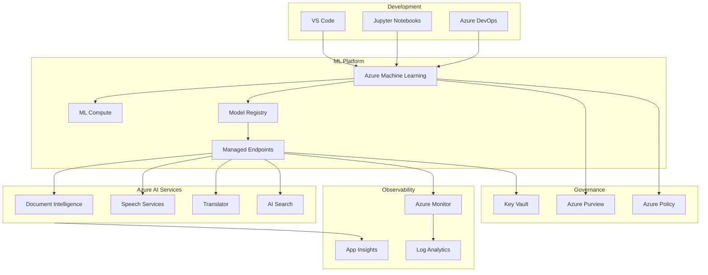

### 11.2 Tool Selection

| Category | Tool | Purpose | Justification |
|----------|------|---------|---------------|
| **ML Platform** | Azure Machine Learning | End-to-end ML lifecycle | G-Cloud compliant, UK data centres |
| **Experiment Tracking** | Azure ML + MLflow | Experiment logging, comparison | Native integration |
| **Model Registry** | Azure ML Model Registry | Version control, deployment | Unified platform |
| **Feature Store** | Azure ML Feature Store | Feature management | Native integration |
| **Model Serving** | Azure ML Endpoints + AKS | Real-time inference | Scalable, UK data residency |
| **Monitoring** | Azure Monitor + App Insights | Observability | Native integration |
| **Data Lineage** | Azure Purview | Data governance | Enterprise compliance |
| **CI/CD** | Azure DevOps | Pipeline automation | SCTS standard |
| **IaC** | Terraform | Infrastructure provisioning | DevOps strategy alignment |

### 11.3 Environment Strategy

| Environment | Purpose | Data | Compute | Refresh |
|-------------|---------|------|---------|---------|
| **Development** | Model experimentation | Synthetic/sample | Shared | On-demand |
| **Staging** | Integration testing | Anonymised copy | Dedicated | Weekly |
| **Production** | Live inference | Real (encrypted) | Dedicated HA | Continuous |
| **DR** | Disaster recovery | Replicated | Standby | Daily sync |

---

## 12. Team Structure and Skills

### 12.1 MLOps Team Structure

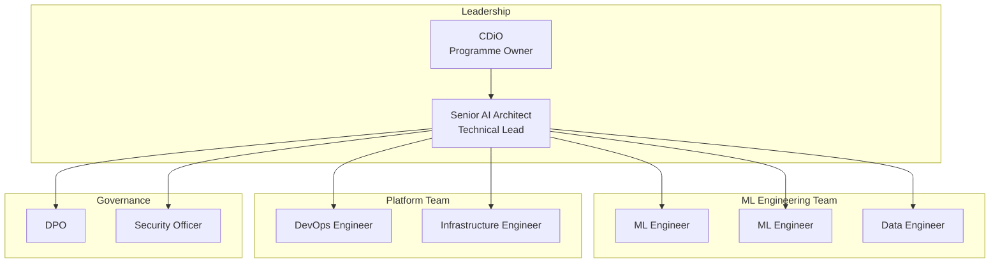

### 12.2 Role Responsibilities

| Role | Responsibilities | Skills Required |
|------|------------------|-----------------|
| **Senior AI Architect** | Architecture, governance, vendor management | ML systems, Azure AI, leadership |
| **ML Engineer** | Model development, training pipelines, evaluation | Python, ML frameworks, Azure ML |
| **Data Engineer** | Data pipelines, feature engineering, quality | Python, SQL, data platforms |
| **DevOps Engineer** | CI/CD, infrastructure, monitoring | Azure DevOps, Terraform, containers |
| **Infrastructure Engineer** | Platform management, security, networking | Azure, networking, security |

### 12.3 Skills Development

**Required Training:**
- Azure Machine Learning certification
- Responsible AI practices
- UK Government AI Playbook
- SCTS domain knowledge (legal processes)

**Training Schedule:**
- Phase 1: Azure AI fundamentals (Q1 2026)
- Phase 2: MLOps practices (Q2 2026)
- Phase 3: Responsible AI (Q3 2026)
- Ongoing: Domain knowledge, new capabilities

---

## 13. Implementation Roadmap

### 13.1 MLOps Implementation Phases

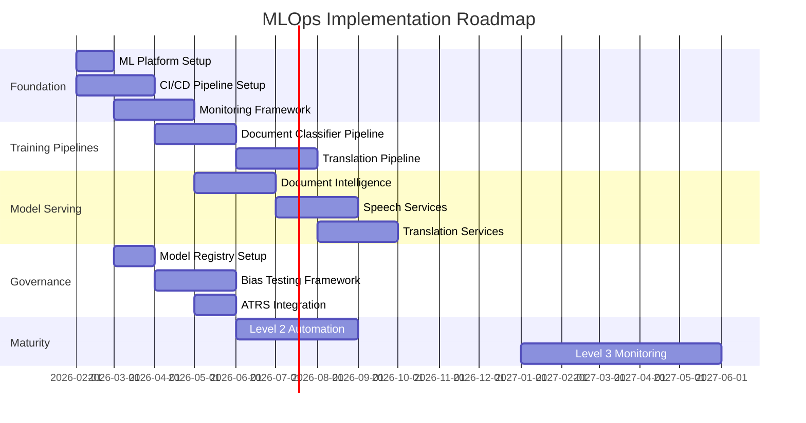

### 13.2 Phase Deliverables

#### Phase 1: Foundation (Q1 2026)
- [ ] Azure ML workspace provisioned
- [ ] CI/CD pipelines for ML artifacts
- [ ] Model registry configured
- [ ] Monitoring dashboards deployed
- [ ] Team onboarding completed

#### Phase 2: Document Intelligence MLOps (Q2 2026)
- [ ] Document classification training pipeline
- [ ] Model evaluation framework
- [ ] Bias testing for document types
- [ ] Production deployment pipeline
- [ ] Rollback procedures tested

#### Phase 3: Speech and Translation MLOps (Q3 2026)
- [ ] Translation quality monitoring
- [ ] Multi-language bias testing
- [ ] Custom glossary management
- [ ] Speech accuracy monitoring
- [ ] Language parity dashboards

#### Phase 4: Maturity (Q4 2026 - Q2 2027)
- [ ] Automated retraining triggers
- [ ] Drift detection operational
- [ ] Self-service model deployment
- [ ] Comprehensive governance automation
- [ ] Level 3 maturity achieved

### 13.3 Success Criteria

| Milestone | Success Criteria | Target Date |
|-----------|------------------|-------------|
| **Foundation Complete** | ML platform operational, team trained | Mar 2026 |
| **First Model Deployed** | Document classifier in production with monitoring | Jun 2026 |
| **Multi-Model Production** | All 4 AI capabilities with MLOps | Oct 2026 |
| **Level 2 Maturity** | Automated training, manual deploy approval | Dec 2026 |
| **Level 3 Maturity** | Continuous monitoring, auto-retraining | Jun 2027 |

---

## 14. Risk Management

### 14.1 MLOps-Specific Risks

| Risk ID | Description | Probability | Impact | Mitigation | Owner |
|---------|-------------|-------------|--------|------------|-------|
| MLR-001 | Model performance degradation undetected | Medium | High | Comprehensive monitoring, alerting | AI Architect |
| MLR-002 | Training data quality issues | Medium | High | Data validation pipelines, expert review | Data Engineer |
| MLR-003 | Bias in production models | Medium | Critical | Pre-deployment testing, continuous monitoring | AI Architect + DPO |
| MLR-004 | Model versioning confusion | Low | Medium | Strict versioning, model registry | ML Engineer |
| MLR-005 | Failed model deployment | Medium | Medium | Blue-green deployment, rollback automation | DevOps Engineer |
| MLR-006 | Skills gap in team | Medium | Medium | Training programme, external support | AI Architect |
| MLR-007 | Vendor lock-in to Azure | Low | Medium | Abstraction layers, portable pipelines | AI Architect |
| MLR-008 | Regulatory non-compliance | Low | Critical | Governance framework, regular audits | DPO |

### 14.2 Risk Monitoring

- Monthly risk review in MLOps stand-up
- Quarterly risk report to CDiO
- Incident-triggered risk reassessment
- Annual comprehensive risk review

---

## 15. Metrics and KPIs

### 15.1 MLOps Health Metrics

| Metric | Target | Current | Trend |
|--------|--------|---------|-------|
| **Model Deployment Frequency** | Weekly | N/A | - |
| **Deployment Success Rate** | >95% | N/A | - |
| **Mean Time to Deploy** | <1 day | N/A | - |
| **Mean Time to Rollback** | <15 min | N/A | - |
| **Training Pipeline Success Rate** | >90% | N/A | - |
| **Model Registry Coverage** | 100% | N/A | - |
| **Monitoring Coverage** | 100% | N/A | - |

### 15.2 Model Performance Dashboard

**Real-time Metrics:**
- Inference latency (p50, p95, p99)
- Error rates by model
- Throughput by capability
- Confidence score distributions

**Daily Metrics:**
- Classification accuracy
- Human override rates
- Data drift indicators
- System health scores

**Weekly Metrics:**
- Translation quality by language
- Bias metrics
- Feature drift analysis
- User feedback summary

**Monthly Metrics:**
- Model comparison reports
- Cost analysis
- Capacity planning
- Governance compliance

---

## 16. Appendices

### Appendix A: Glossary

| Term | Definition |
|------|------------|
| **MLOps** | Machine Learning Operations - practices for ML lifecycle management |
| **Model Registry** | Centralised repository for model versions and metadata |
| **Feature Store** | Centralised repository for ML features with online/offline serving |
| **Data Drift** | Change in input data distribution over time |
| **Concept Drift** | Change in relationship between inputs and outputs |
| **Model Card** | Documentation of model characteristics and governance |
| **ATRS** | Algorithmic Transparency Recording Standard |
| **BLEU** | Bilingual Evaluation Understudy - translation quality metric |
| **WER** | Word Error Rate - speech recognition accuracy metric |
| **nDCG** | Normalised Discounted Cumulative Gain - ranking quality metric |

### Appendix B: Reference Documents

| Document | Location | Purpose |
|----------|----------|---------|
| Architecture Principles | `.arckit/memory/architecture-principles.md` | Governing principles |
| Requirements | `projects/001-scts-genai-programme/requirements.md` | ML requirements |
| Data Model | `projects/001-scts-genai-programme/data-model.md` | Data entities |
| AI Playbook Assessment | `projects/001-scts-genai-programme/ai-playbook-assessment.md` | AI governance |
| ATRS Record | `projects/001-scts-genai-programme/atrs-record.md` | Transparency |
| DevOps Strategy | `projects/001-scts-genai-programme/devops-strategy.md` | CI/CD integration |
| Research Findings | `projects/001-scts-genai-programme/research-findings.md` | Platform selection |

### Appendix C: Traceability Matrix

| MLOps Component | Requirement | Principle | ATRS Section |
|-----------------|-------------|-----------|--------------|
| Model Registry | NFR-M-002 | P9 (AI Model Governance) | 14.2 |
| Training Pipeline | FR-013, NFR-M-002 | P10 (Data Quality) | 14.1 |
| Monitoring | NFR-M-001, NFR-C-004 | P17 (Observability) | 19 |
| Bias Testing | BR-002, NFR-C-004 | P8 (AI Transparency) | 13 |
| Human Oversight | FR-003, BR-003 | P2 (Human-in-the-Loop) | 4 |
| Audit Trail | FR-012, NFR-C-002 | P17 (Observability) | 18.3 |
| Rollback | FR-014, NFR-A-003 | P5 (Resilience) | - |
| UK Data Residency | NFR-SEC-004 | P15 (Data Sovereignty) | 11.5 |

---

## Sign-Off

### Review and Approval

| Role | Name | Decision | Date | Signature |
|------|------|----------|------|-----------|
| **Programme Owner** | Chief Digital Information Officer | [PENDING] | | ____________ |
| **Technical Lead** | Senior AI Technical Architect | [PENDING] | | ____________ |
| **Data Protection** | Data Protection Officer | [PENDING] | | ____________ |
| **Security** | Information Security Officer | [PENDING] | | ____________ |

---

## Generation Metadata

**Generated by**: ArcKit `/arckit.mlops` command
**Generated on**: 2026-01-20
**ArcKit Version**: 0.6.0
**Project**: SCTS GenAI Programme (Project 001)
**AI Model**: Claude Opus 4.5

**Traceability**: This MLOps strategy is traceable to architecture principles, requirements, data model, AI Playbook assessment, and ATRS record via the ArcKit governance framework.

---

**END OF MLOPS STRATEGY**
