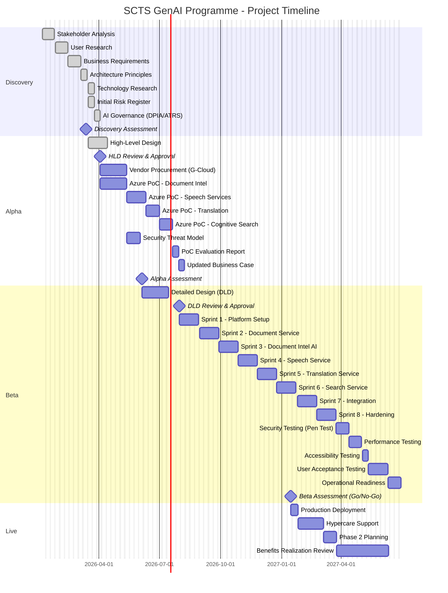
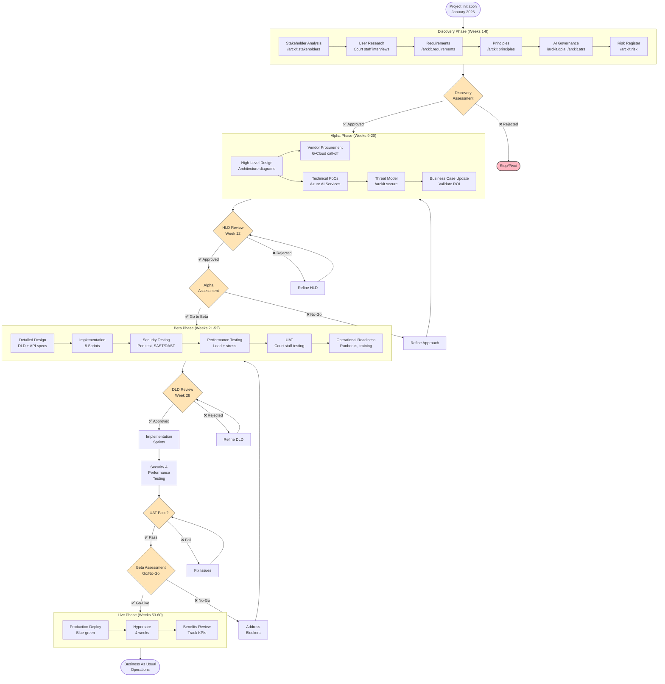
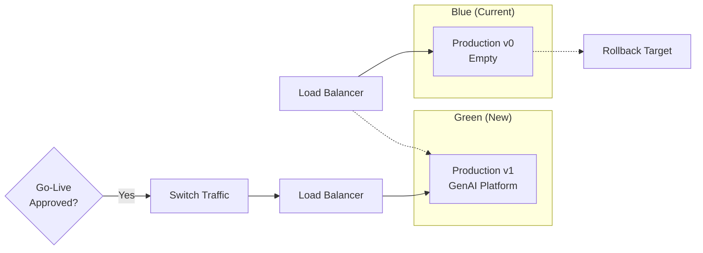
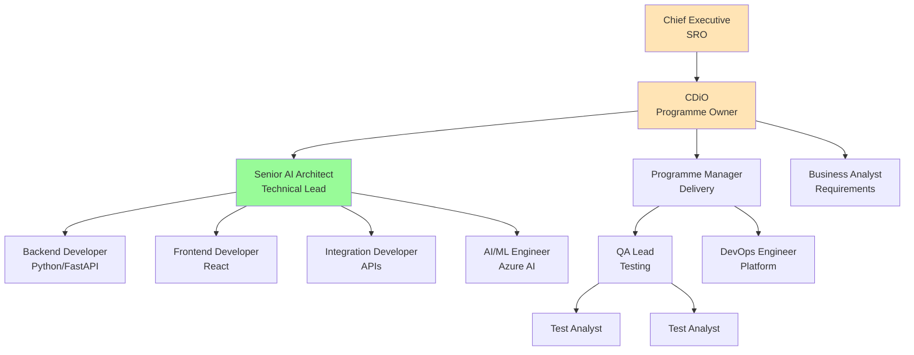

# Project Plan: SCTS GenAI Programme

## Document Information

| Field | Value |
|-------|-------|
| **Document ID** | ARC-001-PLAN-v1.0 |
| **Project** | SCTS GenAI Programme (Project 001) |
| **Document Type** | Project Plan |
| **Classification** | OFFICIAL |
| **Version** | 1.0 |
| **Status** | DRAFT |
| **Date** | 2026-01-17 |
| **Owner** | Chief Digital Information Officer, SCTS |

## Revision History

| Version | Date | Author | Changes |
|---------|------|--------|---------|
| 1.0 | 2026-01-17 | ArcKit AI | Initial creation from `/arckit.plan` command |

---

## Executive Summary

**Project**: SCTS GenAI Programme
**Duration**: 60 weeks (15 months)
**Budget**: £716,000 (3-year TCO for Azure AI Services)
**Team**: 6-12 FTE (varies by phase)
**Delivery Model**: GDS Agile Delivery (Discovery → Alpha → Beta → Live)
**Complexity**: LARGE

### Objective

Deploy responsible AI capabilities across the Scottish Courts and Tribunals Service to enhance operational efficiency (60% reduction in document processing time), improve access to justice through multilingual support (10 languages), and enable cognitive search across court documentation - while maintaining zero AI-related court record integrity incidents.

### Success Criteria

| Criterion | Target | Measurement |
|-----------|--------|-------------|
| Document processing efficiency | 60% time reduction | Case management timestamps |
| Language support | 10 languages | System capability |
| Classification accuracy | 90% | Human review feedback |
| Translation accuracy (legal terms) | 85% | Interpreter validation |
| System availability | 99.5% | Uptime monitoring |
| Court record incidents | 0 | Incident management |
| Staff satisfaction with AI | 75% positive | Staff surveys |

### Key Milestones

| Milestone | Week | Target Date |
|-----------|------|-------------|
| Discovery Complete | Week 8 | 2026-03-13 |
| Alpha Complete (HLD Approved) | Week 20 | 2026-06-05 |
| DLD Approved | Week 28 | 2026-07-31 |
| Beta Complete (Go-Live Approved) | Week 52 | 2027-01-15 |
| Production Launch | Week 53 | 2027-01-22 |
| Hypercare Complete | Week 60 | 2027-03-12 |

### Current Status

**Phase**: Discovery/Alpha (Governance artifacts complete)

**Artifacts Completed**:
- ✅ Stakeholder Drivers Analysis (ARC-001-STKE-v1.0)
- ✅ Architecture Principles (ARC-001-PRIN-v1.0)
- ✅ Requirements (ARC-001-REQ-v1.0)
- ✅ Data Model (ARC-001-DATA-v1.0)
- ✅ Research Findings (ARC-001-RSCH-v1.0)
- ✅ AI Playbook Assessment (ARC-001-AIP-v1.0)
- ✅ DPIA (ARC-001-DPIA-v1.0)
- ✅ ATRS Record (ARC-001-ATRS-v1.0)
- ✅ Secure by Design Assessment (ARC-001-SBD-v1.0)
- ✅ Risk Register (ARC-001-RISK-v1.0)
- ✅ Traceability Matrix (ARC-001-TRACE-v1.0)
- ✅ High-Level Design (ARC-001-HLD-v1.0)

**Next Steps**: Discovery Assessment gate, then Alpha phase execution

---

## Project Timeline (Gantt Chart)

---

## Workflow & Gates Diagram

---

## Phase Details

### Discovery Phase (Weeks 1-8)

**Objective**: Validate problem, define requirements, establish governance framework

**Status**: ✅ COMPLETE (all artifacts generated)

#### Activities & Timeline

| Week | Activity | ArcKit Command | Deliverable | Status |
|------|----------|----------------|-------------|--------|
| 1-2 | Stakeholder Analysis | `/arckit.stakeholders` | Stakeholder drivers, goals, outcomes | ✅ Done |
| 3-4 | User Research | Manual | User needs, pain points, personas | ✅ Done |
| 5-6 | Requirements Definition | `/arckit.requirements` | BRs, FRs, NFRs, INTs | ✅ Done |
| 6 | Technology Research | `/arckit.research` | Vendor evaluation, build vs buy | ✅ Done |
| 7 | Architecture Principles | `/arckit.principles` | 20 architecture principles | ✅ Done |
| 7 | Data Model | `/arckit.data-model` | Entity definitions, ERD | ✅ Done |
| 8 | AI Governance | `/arckit.dpia`, `/arckit.atrs` | DPIA, ATRS record | ✅ Done |
| 8 | Risk Register | `/arckit.risk` | 20 risks with controls | ✅ Done |
| 8 | AI Playbook | `/arckit.ai-playbook` | Compliance assessment | ✅ Done |
| 8 | Traceability Matrix | `/arckit.traceability` | Requirements traceability | ✅ Done |

#### Gate: Discovery Assessment (Week 8)

**Approval Criteria**:
- [x] Problem clearly defined and validated
- [x] User needs documented (5 personas, 3 use cases)
- [x] Business Requirements defined (6 BRs)
- [x] Functional Requirements defined (15 FRs)
- [x] Non-Functional Requirements defined (22 NFRs)
- [x] Architecture principles agreed (20 principles)
- [x] Technology research complete (Azure AI recommended)
- [x] DPIA completed and submitted to DPO
- [x] ATRS record created for transparency
- [x] Risk register shows 37% risk reduction with controls
- [x] No critical risks without mitigation plan

**Approvers**: Chief Executive, CDiO, Legal Services Director, DPO

**Status**: Ready for assessment

---

### Alpha Phase (Weeks 9-20)

**Objective**: Prove technical feasibility, complete procurement, approve architecture

**Status**: 🔄 IN PROGRESS (HLD complete, PoC pending)

#### Activities & Timeline

| Week | Activity | ArcKit Command | Deliverable | Status |
|------|----------|----------------|-------------|--------|
| 9-11 | High-Level Design | `/arckit.hld-review` (create) | HLD document, C4 diagrams | ✅ Done |
| 12 | HLD Review | Internal | HLD approval | ⏳ Pending |
| 13-16 | Vendor Procurement | Manual | G-Cloud call-off, contracts | ⏳ Pending |
| 13-16 | PoC: Document Intelligence | Manual | Classification accuracy validation | ⏳ Pending |
| 17-19 | PoC: Speech Services | Manual | Transcription accuracy, latency | ⏳ Pending |
| 18-19 | PoC: Translation | Manual | Translation quality, all languages | ⏳ Pending |
| 19-20 | PoC: Cognitive Search | Manual | Search relevance, performance | ⏳ Pending |
| 17-18 | Security Threat Model | `/arckit.secure` | STRIDE analysis, controls | ✅ Done |
| 20 | PoC Evaluation Report | Manual | Go/no-go recommendation | ⏳ Pending |
| 20 | Updated Business Case | Manual | Revised costs, confirmed ROI | ⏳ Pending |

#### PoC Success Criteria

| PoC | Success Criteria | Target |
|-----|------------------|--------|
| Document Intelligence | Classification accuracy on legal documents | ≥ 90% |
| Speech Services | Transcription accuracy (English) | ≥ 95% |
| Speech Services | Transcription accuracy (other languages) | ≥ 90% |
| Translation | Legal terminology accuracy | ≥ 85% |
| Translation | Real-time latency | < 2 seconds |
| Cognitive Search | Search relevance (user satisfaction) | ≥ 80% |
| Cognitive Search | Query response time | < 5 seconds |

#### Gate: HLD Review (Week 12)

**Approval Criteria**:
- [x] Architecture addresses all requirements
- [x] Security architecture meets NCSC CAF principles
- [x] UK data residency confirmed (Azure UK South/West)
- [x] Integration approach validated
- [x] Technology decisions documented (ADRs)
- [x] 20/20 architecture principles compliance
- [ ] Cost estimates within budget

**Approvers**: Enterprise Architecture Board, CDiO

#### Gate: Alpha Assessment (Week 20)

**Approval Criteria**:
- [ ] PoC success criteria met for all capabilities
- [ ] Vendor contracts signed (G-Cloud)
- [ ] Security threat model complete
- [ ] Business case confirms positive ROI
- [ ] Team resources secured for Beta
- [ ] No critical risks without mitigation

**Approvers**: Chief Executive, CDiO, Legal Services Director

**Possible Outcomes**:
- ✅ **Go to Beta** - PoCs successful, architecture proven
- 🔄 **Extend Alpha** - Additional PoC work needed
- ❌ **Stop** - Capability not feasible or cost-effective

---

### Beta Phase (Weeks 21-52)

**Objective**: Build, test, and prepare for production

**Status**: ⏳ Not Started

#### Activities & Timeline

| Week | Activity | ArcKit Command | Deliverable |
|------|----------|----------------|-------------|
| 21-24 | Detailed Design (DLD) | Manual | Component designs, API specs |
| 25-27 | DLD Review | `/arckit.dld-review` | DLD approval |
| 28 | **DLD GATE** | - | DLD approved milestone |
| 29-31 | Sprint 1: Platform Setup | - | AKS, networking, CI/CD |
| 32-34 | Sprint 2: Document Service | - | Upload, storage, workflow |
| 35-37 | Sprint 3: Document Intel AI | - | Azure AI integration |
| 38-40 | Sprint 4: Speech Service | - | Transcription, diarisation |
| 41-43 | Sprint 5: Translation Service | - | Real-time translation |
| 44-46 | Sprint 6: Search Service | - | Semantic search, indexing |
| 47-49 | Sprint 7: Integration | - | CMS, DMS, IdP integration |
| 50-52 | Sprint 8: Hardening | - | Security, performance, docs |
| 47-48 | Security Testing | - | Penetration test, SAST/DAST |
| 49-50 | Performance Testing | - | Load testing, stress testing |
| 51 | Accessibility Testing | - | WCAG 2.2 AA validation |
| 49-51 | User Acceptance Testing | - | Court staff validation |
| 52 | Operational Readiness | `/arckit.operationalize` | Runbooks, training, support |

#### Gate: DLD Review (Week 28)

**Approval Criteria**:
- [ ] Detailed designs for all components
- [ ] API specifications (OpenAPI)
- [ ] Database schemas
- [ ] Security controls detailed
- [ ] Test strategy documented
- [ ] Implementation estimates validated

**Approvers**: Senior AI Architect, Security Architect, CDiO

#### Testing Requirements

| Test Type | Duration | Owner | Entry Criteria |
|-----------|----------|-------|----------------|
| Security (SAST/DAST) | 2 weeks | Security Team | Code complete |
| Penetration Testing | 2 weeks | External provider | Security fixes applied |
| Performance Testing | 2 weeks | QA Team | Integration complete |
| Accessibility Testing | 1 week | QA Team | UI complete |
| User Acceptance Testing | 3 weeks | Court Staff | All testing passed |

#### Gate: Beta Assessment / Go-Live Decision (Week 52)

**Approval Criteria**:
- [ ] All acceptance criteria met
- [ ] Security testing passed (no Critical/High issues)
- [ ] Performance targets met (NFR-P compliance)
- [ ] UAT sign-off from business
- [ ] Operational readiness confirmed
- [ ] Training completed for pilot users
- [ ] Rollback plan tested
- [ ] Risks within appetite (4 escalated risks resolved)

**Approvers**: Chief Executive, CDiO, Legal Services Director, DPO, SIRO

**Possible Outcomes**:
- ✅ **Go-Live** - Production deployment approved
- 🔄 **Conditional Go** - Minor issues to fix post-deployment
- ❌ **No-Go** - Critical issues require resolution

---

### Live Phase (Weeks 53-60)

**Objective**: Deploy to production, support users, track benefits

**Status**: ⏳ Not Started

#### Activities & Timeline

| Week | Activity | ArcKit Command | Deliverable |
|------|----------|----------------|-------------|
| 53 | Production Deployment | - | Blue-green deployment |
| 54-57 | Hypercare Support | - | Enhanced support, rapid fixes |
| 58-59 | Phase 2 Planning | - | Backlog for enhancements |
| 60+ | Benefits Realization | - | KPI tracking, ROI validation |

#### Deployment Strategy

**Approach**: Blue-Green Deployment

#### Hypercare Support Model

| Week | Support Level | Response Time | Team |
|------|---------------|---------------|------|
| 1 | 24/7 on-call | 15 minutes | Full dev team |
| 2-3 | Extended hours (7am-9pm) | 30 minutes | Reduced team |
| 4 | Business hours | 1 hour | BAU support |

#### Benefits Tracking

| Metric | Baseline | Target | Tracking Method |
|--------|----------|--------|-----------------|
| Document processing time | 4.5 hours | 1.8 hours | Case management |
| Case backlog | Current | -40% | Weekly reports |
| Languages supported | 0 | 10 | System capability |
| Interpreter cost savings | £0 | £200K/year | Procurement data |
| Staff satisfaction | N/A | 75% positive | Surveys |

---

## Resource Plan

### Team Structure

### Resource Allocation by Phase

| Role | Discovery | Alpha | Beta | Live |
|------|-----------|-------|------|------|
| Programme Manager | 0.5 | 1.0 | 1.0 | 0.5 |
| Business Analyst | 1.0 | 0.5 | 0.25 | 0.0 |
| Senior AI Architect | 0.5 | 1.0 | 1.0 | 0.25 |
| Backend Developers | 0.0 | 0.5 | 3.0 | 0.5 |
| Frontend Developer | 0.0 | 0.0 | 1.0 | 0.25 |
| AI/ML Engineer | 0.0 | 1.0 | 1.0 | 0.25 |
| DevOps Engineer | 0.0 | 0.5 | 1.0 | 0.5 |
| QA Lead | 0.0 | 0.0 | 1.0 | 0.25 |
| Test Analysts | 0.0 | 0.0 | 2.0 | 0.0 |
| **Total FTE** | **2.0** | **4.5** | **11.25** | **2.5** |

### Budget Summary

| Category | Discovery | Alpha | Beta | Live | Total |
|----------|-----------|-------|------|------|-------|
| Staff (internal) | £40K | £90K | £450K | £50K | £630K |
| Contractors | £0 | £50K | £150K | £0 | £200K |
| Azure AI Services | £0 | £20K | £100K | £80K/yr | £200K |
| Infrastructure | £0 | £10K | £50K | £30K/yr | £90K |
| Training | £0 | £0 | £30K | £20K | £50K |
| Contingency (15%) | £6K | £25K | £117K | £27K | £175K |
| **Total** | **£46K** | **£195K** | **£897K** | **£207K** | **£1.345M** |

*Note: 3-year TCO for Azure AI Services is £716K per research findings*

---

## ArcKit Commands Integration

### Commands by Phase

```mermaid
flowchart LR
    subgraph Discovery
        S1["/arckit.stakeholders"]
        S2["/arckit.requirements"]
        S3["/arckit.principles"]
        S4["/arckit.data-model"]
        S5["/arckit.dpia"]
        S6["/arckit.atrs"]
        S7["/arckit.risk"]
        S8["/arckit.ai-playbook"]
        S9["/arckit.research"]
        S10["/arckit.traceability"]
    end

    subgraph Alpha
        A1["/arckit.hld-review"]
        A2["/arckit.secure"]
        A3["/arckit.sow"]
        A4["/arckit.evaluate"]
        A5["/arckit.diagram"]
    end

    subgraph Beta
        B1["/arckit.dld-review"]
        B2["/arckit.analyze"]
        B3["/arckit.operationalize"]
        B4["/arckit.backlog"]
    end

    subgraph Live
        L1["/arckit.story"]
        L2["/arckit.risk (update)"]
    end

    Discovery --> Alpha --> Beta --> Live
```

### Command Schedule

| Week | Phase | Command | Purpose |
|------|-------|---------|---------|
| 1-2 | Discovery | `/arckit.stakeholders` | Stakeholder analysis |
| 5-6 | Discovery | `/arckit.requirements` | Requirements definition |
| 6 | Discovery | `/arckit.research` | Technology evaluation |
| 7 | Discovery | `/arckit.principles` | Architecture principles |
| 7 | Discovery | `/arckit.data-model` | Entity definitions |
| 8 | Discovery | `/arckit.dpia` | Privacy impact assessment |
| 8 | Discovery | `/arckit.atrs` | Algorithmic transparency |
| 8 | Discovery | `/arckit.ai-playbook` | AI compliance check |
| 8 | Discovery | `/arckit.risk` | Risk register |
| 8 | Discovery | `/arckit.traceability` | Requirements traceability |
| 9-11 | Alpha | `/arckit.hld-review` | High-level design |
| 12 | Alpha | `/arckit.secure` | Security assessment |
| 13 | Alpha | `/arckit.sow` | Vendor SOW (if needed) |
| 15 | Alpha | `/arckit.evaluate` | Vendor evaluation (if needed) |
| 16 | Alpha | `/arckit.diagram` | Architecture diagrams |
| 21-24 | Beta | Manual | Detailed design |
| 25 | Beta | `/arckit.dld-review` | DLD approval |
| 40 | Beta | `/arckit.analyze` | Quality analysis |
| 50 | Beta | `/arckit.traceability` | Update traceability |
| 52 | Beta | `/arckit.operationalize` | Operational readiness |
| 60 | Live | `/arckit.story` | Project story/retrospective |
| Quarterly | Live | `/arckit.risk` | Risk register updates |

---

## Risk Management

### Top Risks Requiring Monitoring

| Risk ID | Risk | Phase Impact | Mitigation |
|---------|------|--------------|------------|
| R-001 | Judicial loss of confidence | All | Conservative approach, regular briefings |
| R-004 | AI quality issues | Alpha/Beta | Thorough PoC, human-in-loop design |
| R-007 | Security breach | Beta/Live | Pen testing, SIEM, security training |
| R-010 | GDPR non-compliance | All | DPIA complete, DPO engagement |
| R-002 | Staff resistance | Beta/Live | Change management, training |

### Risk Review Schedule

| Gate | Risk Review Actions |
|------|---------------------|
| Discovery Assessment | Validate inherent risks, confirm controls |
| Alpha Assessment | Update based on PoC findings |
| DLD Review | Technical risk assessment |
| Beta Assessment | Final risk acceptance |
| Quarterly (Live) | Operational risk review |

---

## Assumptions and Dependencies

### Key Assumptions

| ID | Assumption | Validation Plan |
|----|------------|-----------------|
| A-1 | Azure AI Services meet UK data residency | Validate in contract |
| A-2 | Case Management APIs provide document access | Test in Alpha PoC |
| A-3 | Staff engage with training programme | Monitor adoption |
| A-4 | Scottish Government AI guidance remains stable | Monitor policy |
| A-5 | Network bandwidth sufficient for real-time audio | Test in courtroom |

### Key Dependencies

| ID | Dependency | Owner | Target Date | Impact if Delayed |
|----|------------|-------|-------------|-------------------|
| D-1 | Senior AI Architect hired | CDiO | 2026-Q1 | HIGH - delays delivery |
| D-2 | Case Management API access | ICT Ops | 2026-Q2 | HIGH - blocks integration |
| D-3 | Cloud AI contracts signed | Procurement | 2026-Q2 | HIGH - blocks development |
| D-4 | Legal review complete (speech) | Legal Services | 2026-Q3 | MEDIUM - delays Phase 2 |
| D-5 | DPIA approval | DPO | 2026-Q2 | HIGH - blocks production |
| D-6 | Penetration testing scheduled | Security | 2026-Q4 | HIGH - blocks go-live |

---

## Communication Plan

### Stakeholder Communications

| Audience | Frequency | Format | Owner |
|----------|-----------|--------|-------|
| Steering Committee | Monthly | Presentation | Programme Manager |
| Lord President | Quarterly | Briefing note | Chief Executive |
| CDiO | Weekly | Stand-up | Programme Manager |
| Project Team | Daily | Stand-up | Scrum Master |
| Court Staff | Bi-weekly (Beta) | Newsletter | Change Manager |
| ICO (if needed) | As required | Formal correspondence | DPO |

### Reporting Cadence

| Report | Frequency | Content |
|--------|-----------|---------|
| Weekly Status | Weekly | RAG status, risks, blockers |
| Sprint Review | Bi-weekly | Demo, velocity, burndown |
| Monthly Dashboard | Monthly | KPIs, budget, timeline |
| Gate Report | At each gate | Approval criteria, recommendation |

---

## Quality Assurance

### Definition of Done (DoD)

**Story Level**:
- [ ] Code complete and peer reviewed
- [ ] Unit tests passing (80% coverage)
- [ ] Integration tests passing
- [ ] Security scan clean (no Critical/High)
- [ ] Documentation updated
- [ ] Accessibility verified

**Sprint Level**:
- [ ] All committed stories Done
- [ ] Sprint demo completed
- [ ] Retrospective held
- [ ] Backlog refined for next sprint

**Release Level**:
- [ ] All DoD criteria met
- [ ] Performance testing passed
- [ ] Security testing passed
- [ ] UAT sign-off obtained
- [ ] Runbooks complete
- [ ] Training delivered

---

## Appendices

### Appendix A: Artifact Reference

| Artifact | Document ID | Status |
|----------|-------------|--------|
| Stakeholder Drivers | ARC-001-STKE-v1.0 | ✅ Complete |
| Architecture Principles | ARC-001-PRIN-v1.0 | ✅ Complete |
| Requirements | ARC-001-REQ-v1.0 | ✅ Complete |
| Data Model | ARC-001-DATA-v1.0 | ✅ Complete |
| Research Findings | ARC-001-RSCH-v1.0 | ✅ Complete |
| AI Playbook Assessment | ARC-001-AIP-v1.0 | ✅ Complete |
| DPIA | ARC-001-DPIA-v1.0 | ✅ Complete |
| ATRS Record | ARC-001-ATRS-v1.0 | ✅ Complete |
| Secure by Design | ARC-001-SBD-v1.0 | ✅ Complete |
| Risk Register | ARC-001-RISK-v1.0 | ✅ Complete |
| Traceability Matrix | ARC-001-TRACE-v1.0 | ✅ Complete |
| High-Level Design | ARC-001-HLD-v1.0 | ✅ Complete |
| Project Plan | ARC-001-PLAN-v1.0 | ✅ Complete |
| Detailed Design | ARC-001-DLD-v1.0 | ⏳ Pending |

### Appendix B: GDS Service Manual References

- [Discovery phase](https://www.gov.uk/service-manual/agile-delivery/how-the-discovery-phase-works)
- [Alpha phase](https://www.gov.uk/service-manual/agile-delivery/how-the-alpha-phase-works)
- [Beta phase](https://www.gov.uk/service-manual/agile-delivery/how-the-beta-phase-works)
- [Live phase](https://www.gov.uk/service-manual/agile-delivery/how-the-live-phase-works)
- [Service assessments](https://www.gov.uk/service-manual/service-assessments)

---

## Generation Metadata

**Generated by**: ArcKit `/arckit.plan` command
**Generated on**: 2026-01-17
**ArcKit Version**: 0.6.0
**Project**: SCTS GenAI Programme (Project 001)
**AI Model**: Claude Opus 4.5
**Input Artifacts**: stakeholder-drivers.md, requirements.md, risk-register.md, high-level-design.md
