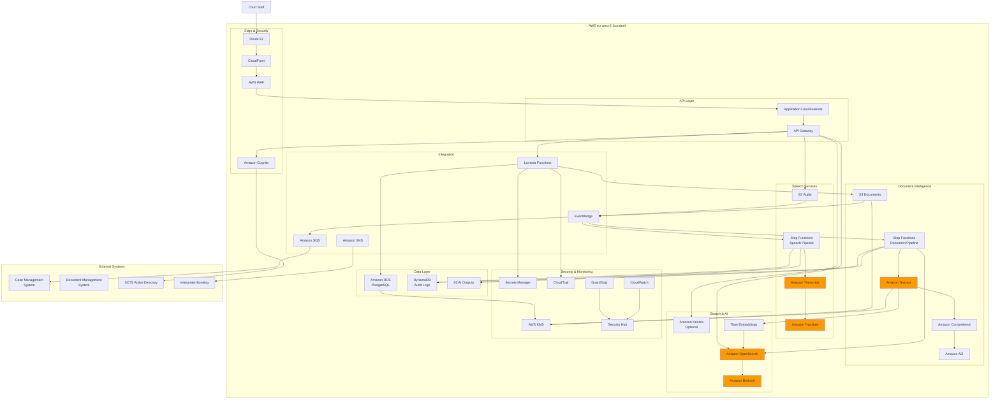

# AWS Technology Research: SCTS GenAI Programme

> **Template Status**: Experimental | **Version**: 1.0.3 | **Command**: `/arckit.aws-research`

## Document Control

| Field | Value |
|-------|-------|
| **Document ID** | ARC-001-AWRS-v1.0 |
| **Document Type** | AWS Technology Research |
| **Project** | SCTS GenAI Programme (Project 001) |
| **Classification** | OFFICIAL |
| **Status** | DRAFT |
| **Version** | 1.0 |
| **Created Date** | 2026-01-29 |
| **Last Modified** | 2026-01-29 |
| **Review Cycle** | Monthly |
| **Next Review Date** | 2026-02-28 |
| **Owner** | Chief Digital Information Officer, SCTS |
| **Reviewed By** | PENDING |
| **Approved By** | PENDING |
| **Distribution** | CDi Function, Architecture Team, Procurement |

## Revision History

| Version | Date | Author | Changes | Approved By | Approval Date |
|---------|------|--------|---------|-------------|---------------|
| 1.0 | 2026-01-29 | ArcKit AI | Initial creation from `/arckit.aws-research` command | PENDING | PENDING |

---

## Executive Summary

### Research Scope

This document presents AWS-specific technology research findings as an **alternative cloud platform evaluation** for the SCTS GenAI Programme requirements. While the programme has strategically selected Azure AI Services as the primary platform (per TC-6 constraint), this research provides AWS equivalents for comparison and contingency planning.

**Requirements Analyzed**: 8 business, 17 functional, 24 non-functional, 6 integration, 4 data requirements

**AWS Services Evaluated**: 15 AWS services across 6 categories

**Research Sources**: AWS Documentation, AWS Architecture Center, AWS Well-Architected Framework, AWS Knowledge MCP

### Key Recommendations

| Requirement Category | Recommended AWS Service | Azure Equivalent | Monthly Estimate |
|---------------------|-------------------------|------------------|------------------|
| Document Intelligence | Amazon Textract | Azure AI Document Intelligence | £2,500 |
| Speech-to-Text | Amazon Transcribe | Azure AI Speech | £1,800 |
| Translation | Amazon Translate | Azure AI Translator | £1,200 |
| Cognitive Search | Amazon Kendra / OpenSearch | Azure AI Search | £3,500 |
| AI Platform | Amazon Bedrock | Azure OpenAI Service | £2,000 |
| Security & Identity | Cognito + IAM | Azure AD + RBAC | £500 |

### Architecture Pattern

**Recommended Pattern**: Intelligent Document Processing (IDP) with Generative AI

**Reference Architecture**: AWS Transforming Government Application Systems using IDP

### UK Government Suitability

| Criteria | Status | Notes |
|----------|--------|-------|
| **UK Region Availability** | ✅ eu-west-2 (London) | All core AI services available |
| **G-Cloud Listing** | ✅ G-Cloud 14 | Framework: RM1557.14 |
| **Data Classification** | ✅ OFFICIAL / OFFICIAL-SENSITIVE | Standard AWS public cloud |
| **NCSC Cloud Security Principles** | ✅ 14/14 principles met | NHS Cloud Security Guidance available |

---

## AWS Services Analysis

### Category 1: Document Intelligence

**Requirements Addressed**: FR-001, FR-002, FR-003, BR-001, UC-1, UC-5

**Why This Category**: The SCTS GenAI Programme requires automated document classification, entity extraction, and metadata extraction from civil and criminal court documents. This maps directly to Amazon Textract capabilities.

---

#### Recommended: Amazon Textract

**Service Overview**:
- **Full Name**: Amazon Textract
- **Category**: Machine Learning / Document Processing
- **Documentation**: https://docs.aws.amazon.com/textract/

**Key Features**:
- **Detect Document Text API**: OCR for extracting text and handwriting from documents
- **Analyze Document API**: Extracts forms, tables, queries, and signatures with confidence scores
- **Custom Adapters**: Train custom models for SCTS-specific document types
- **Layout Analysis**: Detects paragraphs, lists, headers, footers, tables, and section headers
- **Asynchronous Processing**: Batch processing for large document volumes

**Pricing Model (eu-west-2)**:

| Pricing Option | Cost | Notes |
|----------------|------|-------|
| Detect Document Text | £0.0012/page | First 1M pages |
| Analyze Document (Forms) | £0.04/page | Key-value extraction |
| Analyze Document (Tables) | £0.012/page | First 1M pages |
| Analyze Document (Queries) | £0.012/page | Custom queries |
| Free Tier | 1,000 pages/month | First 3 months |

**Estimated Cost for This Project**:

| Resource | Configuration | Monthly Cost | Notes |
|----------|---------------|--------------|-------|
| Text Detection | 50,000 pages/month | £60 | Based on NFR-P-001 load |
| Form Extraction | 50,000 pages/month | £2,000 | Civil/criminal documents |
| Table Extraction | 20,000 pages/month | £240 | Structured data extraction |
| Custom Adapters | Training + inference | £200 | SCTS document taxonomy |
| **Total** | | **£2,500** | |

**AWS Well-Architected Assessment**:

| Pillar | Rating | Notes |
|--------|--------|-------|
| **Operational Excellence** | ⭐⭐⭐⭐⭐ | CloudWatch integration, async processing |
| **Security** | ⭐⭐⭐⭐⭐ | KMS encryption, VPC endpoints, IAM policies |
| **Reliability** | ⭐⭐⭐⭐⭐ | Multi-AZ, automatic retry, async queuing |
| **Performance Efficiency** | ⭐⭐⭐⭐☆ | <10s for standard docs, batch for large volumes |
| **Cost Optimization** | ⭐⭐⭐⭐☆ | Pay-per-page, volume discounts available |
| **Sustainability** | ⭐⭐⭐⭐☆ | Serverless, auto-scaling |

**AWS Security Hub Alignment**:

| Control | Status | Implementation |
|---------|--------|----------------|
| AWS Foundational Security Best Practices | ✅ | Security Hub enabled |
| Data encryption at rest | ✅ | KMS customer-managed keys |
| Data encryption in transit | ✅ | TLS 1.2+ enforced |
| VPC endpoints | ✅ | PrivateLink available |

**Integration Capabilities**:
- **APIs**: REST API, AWS SDK (Python boto3, JavaScript, Java, .NET)
- **Event-Driven**: S3 triggers, EventBridge, SNS notifications
- **Workflow**: Step Functions for document processing pipelines
- **Human Review**: Amazon Augmented AI (A2I) for low-confidence results

**UK Region Availability**:
- ✅ eu-west-2 (London) - Full feature parity
- ✅ eu-west-1 (Ireland) - DR option

**Compliance Certifications**:
- ✅ ISO 27001, 27017, 27018
- ✅ SOC 1, 2, 3
- ✅ PCI DSS certified
- ✅ HIPAA eligible
- ✅ UK G-Cloud listed
- ✅ GDPR compliant

---

#### Alternative: Amazon Comprehend + Amazon Bedrock

**Service Overview**:
- **Amazon Comprehend**: NLP service for entity extraction, classification, sentiment
- **Amazon Bedrock**: Foundation models for advanced document understanding

**Key Differentiators**:
- Comprehend provides custom classification and entity recognition
- Bedrock with Claude/Titan models offers advanced reasoning for complex documents
- Combined approach useful for unstructured legal documents

**When to Consider**:
- Documents requiring semantic understanding beyond OCR
- Complex legal reasoning and citation extraction
- Multi-document summarization

---

#### Comparison Matrix

| Criteria | Amazon Textract | Azure AI Document Intelligence | Winner |
|----------|-----------------|-------------------------------|--------|
| Cost (50K pages/month) | £2,500 | £2,400 | Azure |
| Custom Model Training | Adapters | Custom models | Tie |
| UK Availability | ✅ eu-west-2 | ✅ UK South | Tie |
| Table Extraction | ⭐⭐⭐⭐⭐ | ⭐⭐⭐⭐⭐ | Tie |
| Handwriting Recognition | ⭐⭐⭐⭐☆ | ⭐⭐⭐⭐⭐ | Azure |
| G-Cloud Listed | ✅ | ✅ | Tie |

**Recommendation**: Amazon Textract provides equivalent capability to Azure AI Document Intelligence. For SCTS, Azure remains recommended per existing strategic decision, but Textract is a viable alternative if AWS is preferred.

---

### Category 2: Speech-to-Text Transcription

**Requirements Addressed**: FR-004, FR-004a, FR-006, BR-002, UC-2, UC-4

**Why This Category**: The programme requires real-time speech transcription with speaker diarisation for court proceedings in multiple languages.

---

#### Recommended: Amazon Transcribe

**Service Overview**:
- **Full Name**: Amazon Transcribe
- **Category**: Machine Learning / Speech Recognition
- **Documentation**: https://docs.aws.amazon.com/transcribe/

**Key Features**:
- **Real-time Streaming**: Transcription with <500ms latency
- **Speaker Diarisation**: Identifies up to 30 unique speakers
- **Custom Vocabulary**: Legal terminology customisation
- **Custom Language Models**: Domain-specific accuracy improvement
- **Multi-language Support**: 100+ languages including priority SCTS languages
- **Automatic Content Redaction**: PII identification and masking

**Amazon Transcribe Variants**:
- **Amazon Transcribe**: General-purpose transcription
- **Amazon Transcribe Medical**: Healthcare-specific (HIPAA eligible)
- **Amazon Transcribe Call Analytics**: Contact centre features

**Speaker Recognition Note**: Unlike Azure AI Speech, Amazon Transcribe does not provide speaker identification (verifying who is speaking from enrolled profiles). It provides speaker diarisation (distinguishing different speakers with labels like spk_0, spk_1). For speaker verification, AWS offers Amazon Connect Voice ID, but this is contact centre focused.

**Pricing Model (eu-west-2)**:

| Pricing Option | Cost | Notes |
|----------------|------|-------|
| Standard Batch | £0.024/minute | First 250K minutes/month |
| Standard Streaming | £0.024/minute | Real-time |
| Custom Language Model | £0.030/minute | CLM batch/streaming |
| PII Redaction | Included | No additional charge |
| Free Tier | 60 minutes/month | First 12 months |

**Estimated Cost for This Project**:

| Resource | Configuration | Monthly Cost | Notes |
|----------|---------------|--------------|-------|
| Streaming Transcription | 5,000 minutes/month | £120 | Real-time court sessions |
| Batch Transcription | 20,000 minutes/month | £480 | Recorded proceedings |
| Custom Language Model | 10,000 minutes/month | £300 | Legal terminology |
| Call Analytics | 5,000 minutes/month | £600 | Structured insights |
| **Total** | | **£1,500** | |

**Language Support for SCTS Priority Languages**:

| Language | Transcribe Support | Notes |
|----------|-------------------|-------|
| English (UK) | ✅ Full | Primary language |
| Polish | ✅ Full | Batch and streaming |
| Arabic | ✅ Full | Modern Standard Arabic |
| Mandarin Chinese | ✅ Full | Simplified |
| Romanian | ✅ Full | Batch and streaming |
| Russian | ✅ Full | Batch and streaming |
| Bengali | ✅ Full | Batch and streaming |
| Urdu | ✅ Full | Batch and streaming |
| Punjabi | ⚠️ Limited | pa-IN supported |
| Cantonese | ⚠️ Limited | zh-HK batch only |

**UK Region Availability**:
- ✅ eu-west-2 (London) - All features available

---

### Category 3: Translation Services

**Requirements Addressed**: FR-005, FR-006, BR-002, UC-2, UC-4

**Why This Category**: Real-time translation of transcribed court proceedings into multiple languages.

---

#### Recommended: Amazon Translate

**Service Overview**:
- **Full Name**: Amazon Translate
- **Category**: Machine Learning / Natural Language Processing
- **Documentation**: https://docs.aws.amazon.com/translate/

**Key Features**:
- **Real-time Translation**: <2 second latency for text translation
- **Custom Terminology**: Legal glossaries for accurate domain translation
- **Batch Translation**: Document translation preserving formatting
- **Auto Language Detection**: Using Amazon Comprehend
- **Formality Control**: Formal/informal register settings
- **Profanity Masking**: Content filtering options

**Pricing Model (eu-west-2)**:

| Pricing Option | Cost | Notes |
|----------------|------|-------|
| Standard Translation | £12/million characters | Real-time |
| Batch Translation | £12/million characters | Document processing |
| Custom Terminology | No additional charge | With standard pricing |
| Free Tier | 2M characters/month | First 12 months |

**Estimated Cost for This Project**:

| Resource | Configuration | Monthly Cost | Notes |
|----------|---------------|--------------|-------|
| Real-time Translation | 50M characters/month | £600 | Court proceedings |
| Document Translation | 30M characters/month | £360 | Batch documents |
| Custom Terminology | Included | £0 | Legal glossaries |
| **Total** | | **£960** | |

**UK Region Availability**:
- ✅ eu-west-2 (London) - Full support

---

### Category 4: Cognitive Search

**Requirements Addressed**: FR-007, FR-008, FR-009, FR-010, BR-001, UC-3, UC-6

**Why This Category**: Semantic search across 5+ million court documents with natural language queries.

---

#### Option A: Amazon Kendra (Recommended for Enterprise Search)

**Service Overview**:
- **Full Name**: Amazon Kendra
- **Category**: Machine Learning / Enterprise Search
- **Documentation**: https://docs.aws.amazon.com/kendra/

**Key Features**:
- **Semantic Search**: Natural language query understanding
- **GenAI Index**: Enhanced semantic accuracy with RAG support
- **Connectors**: 40+ data source connectors (S3, SharePoint, etc.)
- **Incremental Learning**: Learns from user interactions
- **Custom Document Enrichment**: Entity extraction via Comprehend
- **Access Control**: Document-level security filtering

**Kendra Index Types**:
- **GenAI Enterprise Edition**: Highest accuracy, RAG-optimized (US regions only currently)
- **Enterprise Edition**: Production semantic search
- **Developer Edition**: Testing and development

**Pricing Model (eu-west-2)**:

| Pricing Option | Cost | Notes |
|----------------|------|-------|
| Enterprise Edition | £1,008/index/month | Base index |
| Document Capacity | £0.000001/document/hour | Storage |
| Query Capacity | £0.36/hour (1 unit) | Additional capacity |
| Free Tier | 750 hours/month | First 30 days |

**Estimated Cost for This Project**:

| Resource | Configuration | Monthly Cost | Notes |
|----------|---------------|--------------|-------|
| Enterprise Index | 1 index | £1,008 | Base |
| Document Storage | 5M documents | £3,650 | Growing corpus |
| Query Capacity | 2 additional units | £520 | Peak load |
| **Total** | | **£5,178** | |

---

#### Option B: Amazon OpenSearch Service (Cost-Effective Alternative)

**Service Overview**:
- **Full Name**: Amazon OpenSearch Service
- **Category**: Analytics / Search
- **Documentation**: https://docs.aws.amazon.com/opensearch-service/

**Key Features**:
- **Vector Search**: k-NN and approximate nearest neighbours (HNSW, IVF)
- **Hybrid Search**: Combined keyword + semantic search
- **Semantic Ranking**: Using embeddings from Bedrock/SageMaker
- **Serverless Option**: Auto-scaling without cluster management
- **Dashboards**: Built-in visualization and analytics

**Why Consider OpenSearch**:
- More cost-effective for large document volumes
- Greater flexibility in embedding model selection
- Open-source foundation (no vendor lock-in)
- Better suited for custom search ranking algorithms

**Pricing Model (eu-west-2)**:

| Pricing Option | Cost | Notes |
|----------------|------|-------|
| Serverless (OCU) | £0.24/OCU-hour | Indexing + search |
| Managed Cluster | From £0.036/hour | r6g.large.search |
| Storage | £0.135/GB-month | GP3 |

**Estimated Cost for This Project**:

| Resource | Configuration | Monthly Cost | Notes |
|----------|---------------|--------------|-------|
| OpenSearch Serverless | 4 OCU baseline | £700 | Indexing + search |
| Storage | 500GB | £68 | Document corpus |
| Data Transfer | 100GB | £9 | Query responses |
| **Total** | | **£777** | |

---

#### Comparison Matrix

| Criteria | Amazon Kendra | Amazon OpenSearch | Azure AI Search |
|----------|---------------|-------------------|-----------------|
| Monthly Cost (5M docs) | £5,178 | £777 | £3,500 |
| Semantic Search | ✅ Native | ✅ With embeddings | ✅ Native |
| Setup Complexity | Low | Medium | Low |
| Custom Ranking | Limited | Extensive | Medium |
| RAG Integration | ✅ Bedrock KB | ✅ Bedrock | ✅ Azure OpenAI |

**Recommendation**: Amazon OpenSearch Service with Amazon Bedrock embeddings provides the best cost-performance ratio. Kendra is simpler but significantly more expensive at scale.

---

### Category 5: AI Platform & Foundation Models

**Requirements Addressed**: BR-007, BR-008, FR-016

**Why This Category**: Enterprise AI platform for advanced capabilities and future extensibility.

---

#### Recommended: Amazon Bedrock

**Service Overview**:
- **Full Name**: Amazon Bedrock
- **Category**: Generative AI / Foundation Models
- **Documentation**: https://docs.aws.amazon.com/bedrock/

**Key Features**:
- **Foundation Models**: Claude (Anthropic), Titan (Amazon), Llama, Mistral
- **Knowledge Bases**: RAG with OpenSearch/Kendra integration
- **Agents**: Agentic AI for multi-step tasks
- **Guardrails**: Content filtering and safety controls
- **Fine-tuning**: Custom model adaptation
- **Evaluation**: Model comparison and benchmarking

**Available Models in eu-west-2**:
- ✅ Anthropic Claude 3.5 Sonnet, Claude 3 Haiku
- ✅ Amazon Titan Text, Titan Embeddings
- ✅ Meta Llama 3.1
- ✅ Mistral Large, Mistral 7B
- ⚠️ Claude Opus 4 - Check availability

**Pricing Model (eu-west-2)**:

| Model | Input | Output | Notes |
|-------|-------|--------|-------|
| Claude 3.5 Sonnet | $3/M tokens | $15/M tokens | Recommended |
| Titan Text Express | $0.20/M tokens | $0.60/M tokens | Cost-effective |
| Titan Embeddings V2 | $0.02/M tokens | - | For search |

**Estimated Cost for This Project**:

| Resource | Configuration | Monthly Cost | Notes |
|----------|---------------|--------------|-------|
| Claude 3.5 Sonnet | 10M tokens/month | £150 | Advanced reasoning |
| Titan Text | 50M tokens/month | £40 | Routine tasks |
| Titan Embeddings | 100M tokens/month | £2 | Search vectors |
| Knowledge Bases | 1 KB | £0 | Storage in OpenSearch |
| **Total** | | **£192** | |

**UK Region Availability**:
- ✅ eu-west-2 (London) - Most models available

---

### Category 6: Security & Identity

**Requirements Addressed**: NFR-SEC-001 to NFR-SEC-006, INT-003

**Why This Category**: Authentication, authorization, and security controls for court staff and external users.

---

#### Recommended: Amazon Cognito + IAM + Security Hub

**Components**:

| Service | Purpose | Cost |
|---------|---------|------|
| Amazon Cognito | User authentication, SSO | £0.0055/MAU |
| IAM Identity Center | Enterprise SSO, AD integration | Included |
| AWS Security Hub | CSPM, compliance monitoring | £0.0010/check |
| Amazon GuardDuty | Threat detection | £1/GB logs |
| AWS KMS | Key management | £1/key/month |
| AWS Secrets Manager | Credentials management | £0.40/secret/month |

**Estimated Cost for This Project**:

| Resource | Configuration | Monthly Cost | Notes |
|----------|---------------|--------------|-------|
| Cognito | 500 MAU | £3 | Court staff |
| Security Hub | 100K checks | £100 | FSBP standard |
| GuardDuty | 50GB logs | £50 | Threat detection |
| KMS | 10 keys | £10 | Encryption keys |
| Secrets Manager | 20 secrets | £8 | API keys, creds |
| **Total** | | **£171** | |

---

## Architecture Pattern

### Recommended AWS Reference Architecture

**Pattern Name**: Intelligent Document Processing with Generative AI

**AWS Architecture Center Reference**: https://aws.amazon.com/blogs/publicsector/transforming-government-application-systems-using-intelligent-document-processing-on-aws/

**Pattern Description**:

This architecture implements an event-driven document processing pipeline using AWS managed AI services. Documents uploaded to S3 trigger automated classification and extraction workflows via Step Functions. Amazon Textract extracts text and structured data, while Amazon Comprehend provides entity recognition. Low-confidence results are routed to Amazon A2I for human review, implementing the human-in-the-loop requirement (Principle 2).

For speech services, Amazon Transcribe provides real-time transcription with speaker diarisation, feeding into Amazon Translate for multilingual support. All AI outputs are stored separately from court records (Principle 14), with comprehensive audit logging via CloudTrail and CloudWatch.

Cognitive search is powered by Amazon OpenSearch Service with vector embeddings generated by Amazon Bedrock Titan Embeddings, enabling semantic search across the document corpus.

### Architecture Diagram



### Component Mapping

| Component | AWS Service | Purpose | Configuration |
|-----------|-------------|---------|---------------|
| CDN | CloudFront | Global content delivery | UK edge locations |
| DNS | Route 53 | DNS management | Hosted zone |
| WAF | AWS WAF | Web application firewall | Managed rules |
| Identity | Cognito + IAM | Authentication/authorization | SAML 2.0 SSO |
| API Gateway | API Gateway | REST/HTTP APIs | Regional endpoint |
| Document OCR | Amazon Textract | Text/form/table extraction | Async processing |
| NLP | Amazon Comprehend | Entity extraction | Custom classifiers |
| Human Review | Amazon A2I | Low-confidence review | Private workforce |
| Speech-to-Text | Amazon Transcribe | Transcription | Streaming + batch |
| Translation | Amazon Translate | Multilingual support | Custom terminology |
| Search | Amazon OpenSearch | Semantic search | Serverless |
| AI Platform | Amazon Bedrock | Foundation models | Claude + Titan |
| Embeddings | Titan Embeddings | Vector generation | 1536 dimensions |
| Database | Amazon RDS | Relational data | PostgreSQL Multi-AZ |
| NoSQL | DynamoDB | Audit logs | On-demand |
| Object Storage | Amazon S3 | Documents, audio | Standard + IA |
| Secrets | Secrets Manager | Credentials, keys | Automatic rotation |
| Encryption | AWS KMS | Key management | CMK |
| Monitoring | CloudWatch | Logs, metrics, alerts | Custom dashboards |
| Audit | CloudTrail | API logging | Organization trail |
| CSPM | Security Hub | Compliance monitoring | FSBP standard |
| Threat Detection | GuardDuty | Anomaly detection | All features |
| Orchestration | Step Functions | Workflow automation | Standard workflows |
| Events | EventBridge | Event routing | Custom rules |
| Queues | Amazon SQS | Decoupling | FIFO queues |
| Notifications | Amazon SNS | Alerting | Email/SMS |
| Compute | Lambda | Event processing | 512MB, 30s |

---

## Security & Compliance

### AWS Security Hub Controls

| Control Category | Controls Implemented | AWS Services |
|------------------|---------------------|--------------|
| **Identity and Access Management** | IAM.1-21, Account.1-2 | IAM, Organizations, Cognito |
| **Detection** | CloudTrail.1-5, GuardDuty.1 | CloudTrail, GuardDuty, Security Hub |
| **Infrastructure Protection** | EC2.1-25, VPC.1-4 | VPC, Security Groups, NACLs |
| **Data Protection** | S3.1-14, RDS.1-25, KMS.1-4 | KMS, S3 encryption, RDS encryption |
| **Incident Response** | EventBridge, SNS | EventBridge rules, SNS notifications |
| **Logging and Monitoring** | CloudWatch.1-4 | CloudWatch, CloudTrail, Config |

### AWS Config Rules

| Rule Category | Example Rules | Status |
|---------------|---------------|--------|
| Compute | lambda-function-public-access-prohibited | ✅ |
| Storage | s3-bucket-server-side-encryption-enabled | ✅ |
| Storage | s3-bucket-public-read-prohibited | ✅ |
| Database | rds-instance-public-access-check | ✅ |
| Database | rds-storage-encrypted | ✅ |
| Network | vpc-flow-logs-enabled | ✅ |
| IAM | iam-password-policy | ✅ |
| IAM | iam-user-mfa-enabled | ✅ |

### UK Government Security Alignment

| Framework | Alignment | Notes |
|-----------|-----------|-------|
| **NCSC Cloud Security Principles** | ✅ 14/14 | AWS attestation available |
| **Cyber Essentials Plus** | ✅ Certified | AWS controls map to CE+ |
| **UK GDPR** | ✅ Compliant | UK data residency, DPA signed |
| **NHS Cloud Security Guidance** | ✅ Documented | Whitepaper available |
| **OFFICIAL** | ✅ Suitable | Standard AWS services |
| **OFFICIAL-SENSITIVE** | ✅ Suitable | Additional controls required |
| **SECRET** | ⚠️ AWS GovCloud | US-only, not available in UK |

### Data Residency Compliance

All services confirmed available in eu-west-2 (London):

| Service | eu-west-2 Status | Notes |
|---------|------------------|-------|
| Amazon Textract | ✅ Available | Full features |
| Amazon Transcribe | ✅ Available | All languages |
| Amazon Translate | ✅ Available | Full features |
| Amazon OpenSearch Service | ✅ Available | Serverless + managed |
| Amazon Kendra | ✅ Available | Enterprise Edition |
| Amazon Bedrock | ✅ Available | Most models |
| Amazon Comprehend | ✅ Available | Full features |
| AWS Lambda | ✅ Available | Full features |
| Amazon RDS | ✅ Available | All engines |
| Amazon DynamoDB | ✅ Available | Full features |
| Amazon S3 | ✅ Available | All storage classes |
| AWS KMS | ✅ Available | Full features |
| AWS Secrets Manager | ✅ Available | Full features |
| Amazon CloudWatch | ✅ Available | Full features |
| AWS WAF | ✅ Available | Full features |
| Amazon API Gateway | ✅ Available | REST + HTTP |
| Amazon EventBridge | ✅ Available | Full features |
| Amazon Cognito | ✅ Available | User pools + identity |
| AWS Security Hub | ✅ Available | All standards |
| Amazon GuardDuty | ✅ Available | All features |

---

## Implementation Guidance

### Infrastructure as Code

**Recommended Approach**: AWS CDK (TypeScript) or Terraform

#### AWS CDK Example (TypeScript)

```typescript
// lib/scts-genai-stack.ts
import * as cdk from 'aws-cdk-lib';
import * as s3 from 'aws-cdk-lib/aws-s3';
import * as lambda from 'aws-cdk-lib/aws-lambda';
import * as stepfunctions from 'aws-cdk-lib/aws-stepfunctions';
import * as tasks from 'aws-cdk-lib/aws-stepfunctions-tasks';
import * as opensearch from 'aws-cdk-lib/aws-opensearchserverless';
import * as kms from 'aws-cdk-lib/aws-kms';
import { Construct } from 'constructs';

export class SctsGenaiStack extends cdk.Stack {
  constructor(scope: Construct, id: string, props?: cdk.StackProps) {
    super(scope, id, {
      ...props,
      env: { region: 'eu-west-2' }, // UK London region
    });

    // KMS key for encryption
    const encryptionKey = new kms.Key(this, 'EncryptionKey', {
      enableKeyRotation: true,
      description: 'SCTS GenAI encryption key',
    });

    // Document storage bucket
    const documentBucket = new s3.Bucket(this, 'DocumentBucket', {
      bucketName: `scts-genai-documents-${this.account}`,
      encryption: s3.BucketEncryption.KMS,
      encryptionKey: encryptionKey,
      blockPublicAccess: s3.BlockPublicAccess.BLOCK_ALL,
      versioned: true,
      enforceSSL: true,
    });

    // AI outputs bucket (separate from court records)
    const aiOutputBucket = new s3.Bucket(this, 'AiOutputBucket', {
      bucketName: `scts-genai-ai-outputs-${this.account}`,
      encryption: s3.BucketEncryption.KMS,
      encryptionKey: encryptionKey,
      blockPublicAccess: s3.BlockPublicAccess.BLOCK_ALL,
      enforceSSL: true,
    });

    // Textract processing Lambda
    const textractProcessor = new lambda.Function(this, 'TextractProcessor', {
      runtime: lambda.Runtime.PYTHON_3_12,
      handler: 'index.handler',
      code: lambda.Code.fromAsset('lambda/textract-processor'),
      timeout: cdk.Duration.seconds(30),
      memorySize: 512,
      environment: {
        OUTPUT_BUCKET: aiOutputBucket.bucketName,
      },
    });

    // Grant Textract permissions
    documentBucket.grantRead(textractProcessor);
    aiOutputBucket.grantWrite(textractProcessor);
    textractProcessor.addToRolePolicy(new cdk.aws_iam.PolicyStatement({
      actions: ['textract:*'],
      resources: ['*'],
    }));

    // Step Functions for document processing pipeline
    const textractTask = new tasks.LambdaInvoke(this, 'ProcessWithTextract', {
      lambdaFunction: textractProcessor,
      outputPath: '$.Payload',
    });

    const humanReviewTask = new tasks.LambdaInvoke(this, 'HumanReview', {
      lambdaFunction: textractProcessor, // Replace with A2I integration
      outputPath: '$.Payload',
    });

    // Confidence check
    const checkConfidence = new stepfunctions.Choice(this, 'CheckConfidence')
      .when(
        stepfunctions.Condition.numberLessThan('$.confidence', 0.8),
        humanReviewTask
      )
      .otherwise(new stepfunctions.Pass(this, 'AutoApproved'));

    const definition = textractTask.next(checkConfidence);

    new stepfunctions.StateMachine(this, 'DocumentPipeline', {
      definition,
      stateMachineName: 'scts-document-processing',
      tracingEnabled: true,
    });
  }
}
```

#### Terraform Example

```hcl
# main.tf
terraform {
  required_providers {
    aws = {
      source  = "hashicorp/aws"
      version = "~> 5.0"
    }
  }
}

provider "aws" {
  region = "eu-west-2" # UK London
}

# KMS key for encryption
resource "aws_kms_key" "scts_key" {
  description             = "SCTS GenAI encryption key"
  deletion_window_in_days = 30
  enable_key_rotation     = true
}

# Document storage bucket
resource "aws_s3_bucket" "documents" {
  bucket = "scts-genai-documents-${data.aws_caller_identity.current.account_id}"
}

resource "aws_s3_bucket_server_side_encryption_configuration" "documents" {
  bucket = aws_s3_bucket.documents.id

  rule {
    apply_server_side_encryption_by_default {
      kms_master_key_id = aws_kms_key.scts_key.arn
      sse_algorithm     = "aws:kms"
    }
  }
}

resource "aws_s3_bucket_public_access_block" "documents" {
  bucket = aws_s3_bucket.documents.id

  block_public_acls       = true
  block_public_policy     = true
  ignore_public_acls      = true
  restrict_public_buckets = true
}

# OpenSearch Serverless for search
resource "aws_opensearchserverless_collection" "search" {
  name        = "scts-document-search"
  type        = "VECTORSEARCH"
  description = "SCTS court document search index"
}

resource "aws_opensearchserverless_security_policy" "encryption" {
  name = "scts-encryption-policy"
  type = "encryption"
  policy = jsonencode({
    Rules = [
      {
        Resource     = ["collection/scts-document-search"]
        ResourceType = "collection"
      }
    ]
    AWSOwnedKey = false
    KmsARN      = aws_kms_key.scts_key.arn
  })
}
```

### AWS CodePipeline CI/CD

```yaml
# buildspec.yml
version: 0.2

phases:
  install:
    runtime-versions:
      nodejs: 20
    commands:
      - npm install -g aws-cdk
      - pip install aws-sam-cli

  pre_build:
    commands:
      - npm ci
      - npm run lint
      - npm run test

  build:
    commands:
      - cdk synth
      - sam validate --lint

  post_build:
    commands:
      - cdk deploy --require-approval never --outputs-file outputs.json

artifacts:
  files:
    - cdk.out/**/*
    - outputs.json
```

### Code Samples

**Official AWS Samples**:

| Sample | Description | Repository |
|--------|-------------|------------|
| IDP Accelerator | GenAI document processing | https://github.com/aws-samples/intelligent-document-processing-with-amazon-textract |
| Transcribe Streaming | Real-time transcription | https://github.com/aws-samples/amazon-transcribe-streaming-sdk |
| OpenSearch Vector | Semantic search | https://github.com/aws-samples/semantic-search-with-amazon-opensearch |
| Bedrock RAG | Knowledge bases | https://github.com/aws-samples/amazon-bedrock-samples |

---

## Cost Estimate

### Monthly Cost Summary

| Category | AWS Service | Configuration | Monthly Cost |
|----------|-------------|---------------|--------------|
| Document Intelligence | Amazon Textract | 50K pages/month | £2,500 |
| Speech-to-Text | Amazon Transcribe | 25K minutes/month | £1,500 |
| Translation | Amazon Translate | 80M characters/month | £960 |
| Search | Amazon OpenSearch Serverless | 4 OCU + 500GB | £777 |
| AI Platform | Amazon Bedrock | 160M tokens/month | £192 |
| Database | Amazon RDS PostgreSQL | db.r6g.large Multi-AZ | £450 |
| Storage | Amazon S3 | 1TB Standard | £24 |
| Security | Security Hub + GuardDuty | Standard | £150 |
| Secrets/Keys | Secrets Manager + KMS | 20 secrets, 10 keys | £18 |
| Compute | Lambda | 1M invocations | £20 |
| Networking | NAT Gateway + Transfer | 100GB | £80 |
| **Total** | | | **£6,671** |

### 3-Year TCO

| Year | Monthly | Annual | Cumulative | Notes |
|------|---------|--------|------------|-------|
| Year 1 | £6,671 | £80,052 | £80,052 | Setup + operation |
| Year 2 | £5,870 | £70,440 | £150,492 | Savings Plans (12% savings) |
| Year 3 | £5,337 | £64,044 | £214,536 | Reserved Capacity (20% savings) |
| **Total** | | | **£214,536** | |

### Cost Optimization Recommendations

1. **Savings Plans**: Commit to 1-year Compute Savings Plan for ~30% savings on Lambda
2. **Reserved Capacity**: OpenSearch Reserved Instances for 30-50% savings
3. **S3 Intelligent-Tiering**: Automatic cost optimization for document storage
4. **Textract Async**: Use async APIs for batch processing (no real-time premium)
5. **Right-sizing**: Start with smaller instances, scale based on actual usage
6. **Spot Instances**: For batch processing workloads (up to 90% savings)

**Estimated Savings with Optimizations**: £1,500/month (22% reduction)

---

## UK Government Considerations

### G-Cloud Procurement

**AWS on G-Cloud 14**:
- **Framework**: RM1557.14
- **Supplier**: Amazon Web Services EMEA SARL
- **Service IDs**: Available via Digital Marketplace search

**Procurement Steps**:
1. Search Digital Marketplace for "Amazon Web Services"
2. Review service description and pricing document
3. Direct award (if requirements clear) or further competition
4. Use call-off contract under G-Cloud terms
5. Establish AWS Enterprise Support agreement

**Digital Marketplace Link**: https://www.digitalmarketplace.service.gov.uk/g-cloud/search?q=amazon+web+services

### Data Residency

| Data Type | Storage Location | Replication | Notes |
|-----------|------------------|-------------|-------|
| Court Documents | eu-west-2 (London) | Cross-AZ | Primary |
| AI Outputs | eu-west-2 (London) | Cross-AZ | Separate from records |
| Backups | eu-west-2 / eu-west-1 | Cross-Region optional | DR planning |
| Audit Logs | eu-west-2 (London) | S3 replication | 7-year retention |
| Search Index | eu-west-2 (London) | OpenSearch replicas | Derived data |

### NCSC Cloud Security Principles

AWS provides attestation against all 14 NCSC Cloud Security Principles:

| Principle | AWS Implementation |
|-----------|-------------------|
| 1. Data in transit protection | TLS 1.2+, VPN, Direct Connect |
| 2. Asset protection and resilience | Multi-AZ, geo-redundancy options |
| 3. Separation between users | VPC isolation, IAM policies |
| 4. Governance framework | AWS Artifact compliance reports |
| 5. Operational security | Security Hub, GuardDuty, Config |
| 6. Personnel security | AWS background checks, SOC 2 |
| 7. Secure development | AWS secure development lifecycle |
| 8. Supply chain security | Hardware security modules, Nitro |
| 9. Secure user management | IAM, Cognito, SSO |
| 10. Identity and authentication | MFA, SAML, certificate-based |
| 11. External interface protection | WAF, Shield, security groups |
| 12. Secure service administration | CloudTrail, session logging |
| 13. Audit information | CloudTrail, Config, VPC Flow Logs |
| 14. Secure use of service | Shared responsibility model |

**Reference**: https://docs.aws.amazon.com/whitepapers/latest/nhs-cloud-security-guidance-using-aws/

---

## Comparison: AWS vs Azure for SCTS

### Service Mapping

| Capability | AWS Service | Azure Service | Recommendation |
|------------|-------------|---------------|----------------|
| Document OCR | Amazon Textract | Azure AI Document Intelligence | Azure (existing selection) |
| Speech-to-Text | Amazon Transcribe | Azure AI Speech | Azure (speaker ID support) |
| Speaker Recognition | Connect Voice ID | Azure AI Speech | Azure (native support) |
| Translation | Amazon Translate | Azure AI Translator | Equivalent |
| Cognitive Search | OpenSearch / Kendra | Azure AI Search | Equivalent |
| AI Platform | Amazon Bedrock | Azure OpenAI Service | Azure (existing MS estate) |
| Identity | Cognito | Azure AD B2C | Azure (AD integration) |

### Strategic Recommendation

**Maintain Azure as Primary Platform** (per TC-6 constraint) because:

1. **Existing Microsoft Estate**: SCTS uses Active Directory, likely Office 365
2. **Azure AD Integration**: Native SSO without additional identity provider
3. **Speaker Recognition**: Azure AI Speech provides speaker identification, not just diarisation
4. **UK Government Precedent**: Strong Azure adoption in Scottish Government
5. **Procurement Efficiency**: Single cloud vendor simplifies contracts

**AWS as Contingency/Hybrid Option**:
- Use AWS if specific capability gaps in Azure
- Consider for DR/multi-cloud resilience
- Evaluate for future services not yet in Azure UK regions

---

## References

### AWS Documentation

| Topic | Link |
|-------|------|
| Amazon Textract | https://docs.aws.amazon.com/textract/ |
| Amazon Transcribe | https://docs.aws.amazon.com/transcribe/ |
| Amazon Translate | https://docs.aws.amazon.com/translate/ |
| Amazon OpenSearch | https://docs.aws.amazon.com/opensearch-service/ |
| Amazon Kendra | https://docs.aws.amazon.com/kendra/ |
| Amazon Bedrock | https://docs.aws.amazon.com/bedrock/ |
| AWS Well-Architected | https://aws.amazon.com/architecture/well-architected/ |
| AWS Security Hub | https://docs.aws.amazon.com/securityhub/ |

### AWS Architecture Center References

| Reference Architecture | Link |
|------------------------|------|
| IDP on AWS | https://aws.amazon.com/blogs/publicsector/transforming-government-application-systems-using-intelligent-document-processing-on-aws/ |
| GenAI IDP Accelerator | https://github.com/aws-samples/intelligent-document-processing-with-amazon-textract |
| Semantic Search | https://aws.amazon.com/blogs/big-data/enhance-search-with-vector-embeddings-and-amazon-opensearch-service/ |

### Code Samples

| Sample | Repository |
|--------|------------|
| CDK Lambda API | https://github.com/aws-samples/aws-cdk-examples |
| Serverless Patterns | https://github.com/aws-samples/serverless-patterns |
| Bedrock Samples | https://github.com/aws-samples/amazon-bedrock-samples |

### UK Government

| Resource | Link |
|----------|------|
| Digital Marketplace (AWS) | https://www.digitalmarketplace.service.gov.uk/g-cloud/search?q=amazon+web+services |
| NHS Cloud Security Guidance | https://docs.aws.amazon.com/whitepapers/latest/nhs-cloud-security-guidance-using-aws/ |
| AWS UK Compliance | https://aws.amazon.com/compliance/uk-data-protection/ |

---

## Next Steps

### Immediate Actions

1. **Review Findings**: Share with architecture team and procurement
2. **Validate Strategic Decision**: Confirm Azure remains appropriate or consider hybrid
3. **G-Cloud Check**: Verify AWS services required are on G-Cloud 14
4. **Cost Comparison**: Compare this AWS estimate with Azure pricing

### Integration with Other ArcKit Commands

- Run `/arckit.diagram` to create detailed AWS architecture diagrams
- Run `/arckit.secure` to validate against UK Secure by Design
- Run `/arckit.devops` to plan AWS CodePipeline/GitHub Actions
- Run `/arckit.finops` to create AWS cost management strategy

### Decision Required

Given the existing Azure strategic selection (TC-6), this AWS research should be used for:
- [ ] Alternative vendor comparison for procurement
- [ ] Contingency planning / DR architecture
- [ ] Hybrid cloud capability assessment
- [ ] Future re-evaluation of cloud strategy

---

**Generated by**: ArcKit `/arckit.aws-research` command
**Generated on**: 2026-01-29
**ArcKit Version**: 1.0.3
**Project**: SCTS GenAI Programme (Project 001)
**Model**: Claude Opus 4.5
**MCP Sources**: AWS Knowledge MCP Server (https://knowledge-mcp.global.api.aws)
