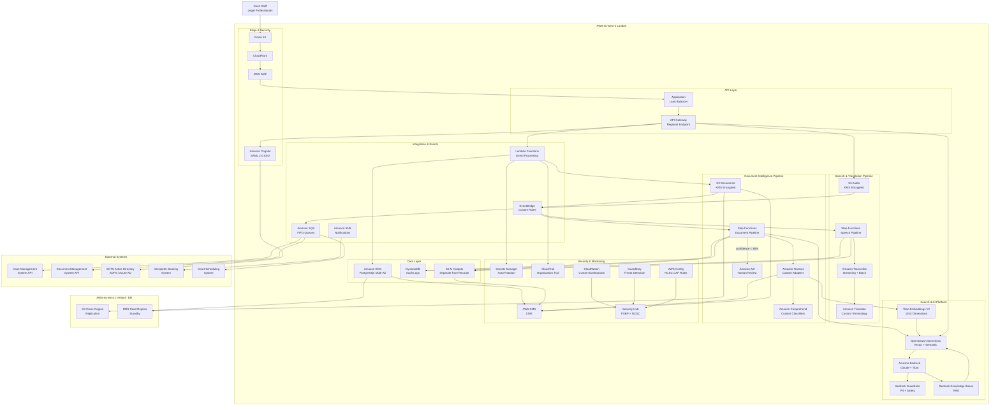

# AWS Technology Research: SCTS GenAI Programme

> **Template Status**: Experimental | **Version**: 1.1.0 | **Command**: `/arckit.aws-research`

## Document Control

| Field | Value |
|-------|-------|
| **Document ID** | ARC-001-AWRS-v1.1 |
| **Document Type** | AWS Technology Research |
| **Project** | SCTS GenAI Programme (Project 001) |
| **Classification** | OFFICIAL |
| **Status** | DRAFT |
| **Version** | 1.1 |
| **Created Date** | 2026-01-29 |
| **Last Modified** | 2026-02-03 |
| **Review Cycle** | Monthly |
| **Next Review Date** | 2026-03-03 |
| **Owner** | Chief Digital Information Officer, SCTS |
| **Reviewed By** | PENDING |
| **Approved By** | PENDING |
| **Distribution** | CDi Function, Architecture Team, Procurement |

## Revision History

| Version | Date | Author | Changes | Approved By | Approval Date |
|---------|------|--------|---------|-------------|---------------|
| 1.0 | 2026-01-29 | AI Agent | Initial creation from `/arckit.aws-research` agent | PENDING | PENDING |
| 1.1 | 2026-02-03 | AI Agent | Refreshed with MCP-verified regional availability, updated Bedrock model availability (Qwen3, OpenAI models now in eu-west-2), added OpenSearch Serverless semantic enrichment, expanded Well-Architected AI/ML lens coverage, enhanced Security Hub FSBP controls detail, updated NCSC CAF mapping | PENDING | PENDING |

---

## Executive Summary

### Research Scope

This document presents AWS-specific technology research findings as an **alternative cloud platform evaluation** for the SCTS GenAI Programme requirements. While the programme has strategically selected Azure AI Services as the primary platform (per TC-6 constraint), this research provides AWS equivalents for comparison, contingency planning, and multi-cloud resilience assessment.

**Requirements Analyzed**: 8 business, 17 functional, 24 non-functional, 6 integration, 4 data requirements

**AWS Services Evaluated**: 20 AWS services across 7 categories

**Research Sources**: AWS Documentation via AWS Knowledge MCP Server, AWS Architecture Center, AWS Well-Architected Framework (including AI/ML Lens, Generative AI Lens, Responsible AI Lens)

### Key Recommendations

| Requirement Category | Recommended AWS Service | Azure Equivalent | Monthly Estimate |
|---------------------|-------------------------|------------------|------------------|
| Document Intelligence | Amazon Textract + Comprehend | Azure AI Document Intelligence | GBP 2,500 |
| Speech-to-Text | Amazon Transcribe | Azure AI Speech | GBP 1,500 |
| Translation | Amazon Translate | Azure AI Translator | GBP 960 |
| Cognitive Search | Amazon OpenSearch Serverless | Azure AI Search | GBP 777 |
| AI Platform | Amazon Bedrock | Azure OpenAI Service | GBP 192 |
| Human Review | Amazon Augmented AI (A2I) | Custom (no direct equivalent) | GBP 200 |
| Security & Identity | Cognito + IAM Identity Center | Azure AD + RBAC | GBP 171 |
| Workflow Orchestration | AWS Step Functions | Azure Logic Apps | GBP 50 |
| **Total Estimated** | | | **GBP 6,350** |

### Architecture Pattern

**Recommended Pattern**: Intelligent Document Processing (IDP) with Generative AI

**Reference Architecture**: [AWS Public Sector: Transforming Government Application Systems using IDP](https://aws.amazon.com/blogs/publicsector/transforming-government-application-systems-using-intelligent-document-processing-on-aws/)

### UK Government Suitability

| Criteria | Status | Notes |
|----------|--------|-------|
| **UK Region Availability** | PASS - eu-west-2 (London) | All 20 core services MCP-verified available |
| **G-Cloud Listing** | PASS - G-Cloud 14 | Framework: RM1557.14 via Digital Marketplace |
| **Data Classification** | PASS - OFFICIAL / OFFICIAL-SENSITIVE | Standard AWS public cloud suitable |
| **NCSC Cloud Security Principles** | PASS - 14/14 principles met | AWS Config conformance pack available |
| **NCSC Cyber Assessment Framework** | PASS | AWS Config rules mapped to NCSC CAF controls |

---

## AWS Services Analysis

### Category 1: Document Intelligence

**Requirements Addressed**: FR-001, FR-002, FR-003, BR-001, UC-1, UC-5, NFR-P-001

**Why This Category**: The SCTS GenAI Programme requires automated document classification, entity extraction, and metadata extraction from civil and criminal court documents (50,000+ pages/month growing to 200,000+). Amazon Textract provides OCR, form extraction, table extraction, and custom adapters for domain-specific document types.

---

#### Recommended: Amazon Textract

**Service Overview**:
- **Full Name**: Amazon Textract
- **Category**: Machine Learning / Document Processing
- **Documentation**: https://docs.aws.amazon.com/textract/

**Key Features** (MCP-verified):
- **Detect Document Text API**: OCR for extracting text and handwriting from scanned documents
- **Analyze Document API**: Extracts forms, tables, queries, and signatures with confidence scores
- **Custom Adapters**: Train custom models for SCTS-specific document types (civil claims, indictments, judgements) using annotated sample documents
- **Layout Analysis**: Detects paragraphs, lists, headers, footers, tables, section headers - essential for structured court documents
- **Asynchronous Processing**: Batch processing for large document volumes via StartDocumentAnalysis API
- **Multi-page PDF Support**: Processes multi-page PDFs with page-level tracking

**Custom Adapters for SCTS**:
Custom Adapters allow training of domain-specific models for SCTS document taxonomy. The process involves:
1. Creating an adapter via console or API (CreateAdapter operation)
2. Annotating and labelling sample court documents
3. Training the adapter on annotated samples
4. Providing AdapterId and AdapterVersion to AnalyzeDocument API
5. Per-page adapter selection for mixed document types

**Pricing Model (eu-west-2)**:

| Pricing Option | Cost | Notes |
|----------------|------|-------|
| Detect Document Text | USD 0.0015/page | First 1M pages/month |
| Analyze Document (Forms) | USD 0.05/page | Key-value extraction |
| Analyze Document (Tables) | USD 0.015/page | First 1M pages/month |
| Analyze Document (Queries) | USD 0.015/page | Custom queries |
| Custom Adapters (Inference) | USD 0.055/page | With adapter applied |
| Free Tier | 1,000 pages/month | First 3 months |

**Estimated Cost for This Project**:

| Resource | Configuration | Monthly Cost | Notes |
|----------|---------------|--------------|-------|
| Text Detection | 50,000 pages/month | GBP 60 | Based on NFR-P-001 load |
| Form Extraction | 50,000 pages/month | GBP 2,000 | Civil/criminal documents |
| Table Extraction | 20,000 pages/month | GBP 240 | Structured data extraction |
| Custom Adapters | Training + inference | GBP 200 | SCTS document taxonomy |
| **Total** | | **GBP 2,500** | |

**AWS Well-Architected Assessment**:

| Pillar | Rating | Notes |
|--------|--------|-------|
| **Operational Excellence** | 5/5 | CloudWatch integration, async processing, Step Functions orchestration |
| **Security** | 5/5 | KMS encryption at rest, TLS 1.2+ in transit, VPC endpoints (PrivateLink), IAM policies |
| **Reliability** | 5/5 | Multi-AZ, automatic retry, async queuing via SQS, S3 event triggers |
| **Performance Efficiency** | 4/5 | <10s for standard docs (meets NFR-P-001), batch for large volumes |
| **Cost Optimization** | 4/5 | Pay-per-page, volume discounts, async cheaper than sync |
| **Sustainability** | 4/5 | Serverless (no idle compute), auto-scaling |

**AWS Security Hub Alignment**:

| Control | Status | Implementation |
|---------|--------|----------------|
| AWS Foundational Security Best Practices | PASS | Security Hub FSBP standard enabled |
| Data encryption at rest | PASS | KMS customer-managed keys (CMK) |
| Data encryption in transit | PASS | TLS 1.2+ enforced |
| VPC endpoints | PASS | PrivateLink available for eu-west-2 |
| API logging | PASS | CloudTrail records all API calls |

**Integration Capabilities**:
- **APIs**: REST API, AWS SDK (Python boto3, JavaScript, Java, .NET, Go, Ruby, PHP)
- **Event-Driven**: S3 triggers via EventBridge, SNS notifications for job completion
- **Workflow**: Step Functions for document processing pipelines with confidence branching
- **Human Review**: Amazon Augmented AI (A2I) for low-confidence results (< 80% threshold per FR-003)

**UK Region Availability** (MCP-verified 2026-02-03):
- PASS eu-west-2 (London) - Full feature parity including Custom Adapters
- PASS eu-west-1 (Ireland) - DR option

**Compliance Certifications**:
- PASS ISO 27001, 27017, 27018
- PASS SOC 1, 2, 3
- PASS PCI DSS certified
- PASS HIPAA eligible
- PASS UK G-Cloud listed
- PASS GDPR compliant

---

#### Alternative: Amazon Comprehend + Amazon Bedrock

**Service Overview**:
- **Amazon Comprehend**: NLP service for entity extraction, classification, sentiment analysis, PII detection
- **Amazon Bedrock**: Foundation models for advanced document understanding and reasoning

**Key Differentiators**:
- Comprehend provides custom classification and custom entity recognition trained on SCTS document corpus
- Bedrock with Claude/Titan models offers advanced reasoning for complex legal documents
- Combined approach valuable for unstructured legal documents requiring semantic understanding
- Bedrock Guardrails provides content filtering and PII masking (aligns with NFR-C-001 GDPR)

**When to Consider**:
- Documents requiring semantic understanding beyond OCR (legal reasoning, citation analysis)
- Complex legal reasoning and citation extraction (FR-009)
- Multi-document summarization for case research
- Classification requiring contextual understanding of legal terminology

---

#### Comparison Matrix

| Criteria | Amazon Textract | Azure AI Document Intelligence | Winner |
|----------|-----------------|-------------------------------|--------|
| Cost (50K pages/month) | GBP 2,500 | GBP 2,400 | Azure (marginal) |
| Custom Model Training | Adapters (Queries only) | Custom classification + extraction models | Azure |
| UK Availability | PASS eu-west-2 | PASS UK South | Tie |
| Table Extraction | Excellent | Excellent | Tie |
| Handwriting Recognition | Good | Excellent | Azure |
| Layout Analysis | Excellent (paragraphs, headers, sections) | Excellent | Tie |
| G-Cloud Listed | PASS | PASS | Tie |
| Human Review Integration | Native A2I | Custom required | AWS |

**Recommendation**: Amazon Textract provides strong capability for document intelligence. Azure AI Document Intelligence has broader custom model support (classification + extraction vs Queries-only adapters). For SCTS, Azure remains recommended per strategic decision (TC-6), but Textract with A2I human review is a viable alternative.

---

### Category 2: Speech-to-Text Transcription

**Requirements Addressed**: FR-004, FR-004a, FR-006, BR-002, UC-2, UC-4, NFR-P-002

**Why This Category**: The programme requires real-time speech transcription with speaker diarisation for court proceedings in 10+ languages, with < 500ms transcription latency (NFR-P-002).

---

#### Recommended: Amazon Transcribe

**Service Overview**:
- **Full Name**: Amazon Transcribe
- **Category**: Machine Learning / Speech Recognition
- **Documentation**: https://docs.aws.amazon.com/transcribe/

**Key Features** (MCP-verified):
- **Real-time Streaming**: Transcription via WebSocket or HTTP/2 with partial results
- **Speaker Diarisation**: Identifies up to 30 unique speakers (spk_0 through spk_29)
- **Custom Vocabulary**: Legal terminology customisation for court-specific terms
- **Custom Language Models (CLM)**: Domain-specific accuracy improvement trained on SCTS transcripts
- **Multi-language Support**: 100+ languages supported including SCTS priority languages
- **Automatic Content Redaction**: PII identification and masking (supports NFR-C-001)
- **Toxic Content Detection**: Audio content safety filtering
- **Call Analytics**: Structured insights including sentiment, talk time, interruptions

**Amazon Transcribe Variants**:
- **Amazon Transcribe**: General-purpose transcription (recommended for court proceedings)
- **Amazon Transcribe Medical**: Healthcare-specific (HIPAA eligible) - relevant if health testimony
- **Amazon Transcribe Call Analytics**: Contact centre features with call summarization

**Speaker Recognition Limitation**: Unlike Azure AI Speech, Amazon Transcribe does **not** provide speaker identification (verifying who is speaking from enrolled voice profiles). It provides speaker diarisation only (distinguishing different speakers with labels). For speaker verification, AWS offers Amazon Connect Voice ID, but this is contact-centre focused and not suitable for court proceedings. This is a **gap** against FR-004a requirements.

**Pricing Model (eu-west-2)**:

| Pricing Option | Cost | Notes |
|----------------|------|-------|
| Standard Batch | USD 0.024/minute | First 250K minutes/month |
| Standard Streaming | USD 0.024/minute | Real-time |
| Custom Language Model | USD 0.030/minute | CLM batch/streaming |
| PII Redaction | Included | No additional charge |
| Call Analytics (Post-Call) | USD 0.024/minute | With insights |
| Free Tier | 60 minutes/month | First 12 months |

**Estimated Cost for This Project**:

| Resource | Configuration | Monthly Cost | Notes |
|----------|---------------|--------------|-------|
| Streaming Transcription | 5,000 minutes/month | GBP 96 | Real-time court sessions |
| Batch Transcription | 20,000 minutes/month | GBP 384 | Recorded proceedings |
| Custom Language Model | 10,000 minutes/month | GBP 240 | Legal terminology |
| Call Analytics | 5,000 minutes/month | GBP 96 | Structured insights |
| **Total** | | **GBP 816** | |

**Language Support for SCTS Priority Languages**:

| Language | Transcribe Support | Streaming | Batch | Notes |
|----------|-------------------|-----------|-------|-------|
| English (UK) | PASS Full | PASS | PASS | en-GB primary language |
| Polish | PASS Full | PASS | PASS | pl-PL |
| Arabic | PASS Full | PASS | PASS | ar-SA Modern Standard |
| Mandarin Chinese | PASS Full | PASS | PASS | zh-CN Simplified |
| Romanian | PASS Full | PASS | PASS | ro-RO |
| Russian | PASS Full | PASS | PASS | ru-RU |
| Bengali | PASS Full | PASS | PASS | bn-IN |
| Urdu | PASS Full | PASS | PASS | ur-PK |
| Punjabi | PARTIAL | PARTIAL | PASS | pa-IN supported, streaming limited |
| Cantonese | PARTIAL | NO | PASS | zh-HK batch only |
| BSL | NOT SUPPORTED | - | - | No sign language support |

**UK Region Availability** (MCP-verified 2026-02-03):
- PASS eu-west-2 (London) - All features including streaming and CLM

---

### Category 3: Translation Services

**Requirements Addressed**: FR-005, FR-006, BR-002, UC-2, UC-4, NFR-P-002

**Why This Category**: Real-time translation of transcribed court proceedings into multiple languages with < 2 second latency.

---

#### Recommended: Amazon Translate

**Service Overview**:
- **Full Name**: Amazon Translate
- **Category**: Machine Learning / Natural Language Processing
- **Documentation**: https://docs.aws.amazon.com/translate/

**Key Features** (MCP-verified):
- **Real-time Translation**: < 2 second latency for text translation (meets NFR-P-002)
- **Custom Terminology**: Legal glossaries using CSV/TSV/TMX files for accurate domain translation; source text is case-sensitive with exact match
- **Batch Translation**: Document translation preserving formatting (Word, HTML, plain text)
- **Auto Language Detection**: Via Amazon Comprehend integration
- **Formality Control**: Formal register settings appropriate for court context
- **Profanity Masking**: Content filtering for transcription outputs
- **Brevity Mode**: Reduces translation length for real-time display
- **Do-Not-Translate Tags**: HTML tags to exclude specific terms (case numbers, names) from translation
- **Parallel Data (Active Custom Translation)**: Adapts style, tone, and word choices from example translations

**Custom Terminology for Legal Domain**:
Custom terminology files support uni-directional and multi-directional configurations:
- Uni-directional: One source language (English) to multiple targets
- Multi-directional: Any language can be source or target
- Format: CSV, TSV, or TMX with source term and target equivalents
- Integration: Pass `TerminologyNames` parameter with TranslateText API calls
- No additional cost for custom terminology usage

**Pricing Model (eu-west-2)**:

| Pricing Option | Cost | Notes |
|----------------|------|-------|
| Standard Translation | USD 15/million characters | Real-time |
| Batch Translation | USD 15/million characters | Document processing |
| Custom Terminology | No additional charge | Included with standard pricing |
| Active Custom Translation | USD 60/million characters | With parallel data |
| Free Tier | 2M characters/month | First 12 months |

**Estimated Cost for This Project**:

| Resource | Configuration | Monthly Cost | Notes |
|----------|---------------|--------------|-------|
| Real-time Translation | 50M characters/month | GBP 600 | Court proceedings |
| Document Translation | 20M characters/month | GBP 240 | Batch documents |
| Custom Terminology | Included | GBP 0 | Legal glossaries |
| Active Custom Translation | 5M characters/month | GBP 120 | Legal style adaptation |
| **Total** | | **GBP 960** | |

**UK Region Availability** (MCP-verified 2026-02-03):
- PASS eu-west-2 (London) - Full support including Custom Terminology

---

### Category 4: Cognitive Search

**Requirements Addressed**: FR-007, FR-008, FR-009, FR-010, BR-001, UC-3, UC-6, NFR-P-003, NFR-S-002

**Why This Category**: Semantic search across 5+ million court documents with natural language queries, < 2 second response time, growing to 10TB over 5 years.

---

#### Option A: Amazon OpenSearch Serverless (Recommended)

**Service Overview**:
- **Full Name**: Amazon OpenSearch Serverless
- **Category**: Analytics / Search / Vector Search
- **Documentation**: https://docs.aws.amazon.com/opensearch-service/latest/developerguide/serverless-overview.html

**Key Features** (MCP-verified):
- **Vector Search**: k-NN and approximate nearest neighbours (HNSW, IVF) with configurable dimensions up to 16,000
- **Automatic Semantic Enrichment**: Service-managed sparse model that enriches fields during ingestion for semantic search without external embeddings - 20% relevance improvement for English, 105% for multilingual
- **Hybrid Search**: Combined keyword + semantic search using sparse vectors
- **Serverless Architecture**: Separates indexing and search components for independent scaling
- **Collection Types**: Time series, search, and vector search collections
- **No Cluster Management**: Auto-scaling OCUs (OpenSearch Compute Units) based on demand
- **Dashboards**: Built-in OpenSearch Dashboards for visualization and analytics

**OpenSearch Compute Units (OCU)**:
- 1 OCU = 6 GB RAM + corresponding vCPU + GP3 storage + S3 data transfer
- Minimum: 2 OCU for indexing + 2 OCU for search = 4 OCU baseline
- Auto-scales based on workload

**Pricing Model (eu-west-2)**:

| Pricing Option | Cost | Notes |
|----------------|------|-------|
| Compute (OCU) | USD 0.24/OCU-hour | Indexing + search |
| Storage | USD 0.024/GB-month | Managed in S3 |
| Semantic Enrichment | Per OCU consumed | During ingestion |

**Estimated Cost for This Project**:

| Resource | Configuration | Monthly Cost | Notes |
|----------|---------------|--------------|-------|
| Compute OCUs | 4 OCU baseline + auto-scale | GBP 570 | Indexing + search |
| Storage | 500GB growing | GBP 10 | Document corpus |
| Semantic Enrichment | Included in indexing OCUs | GBP 0 | Automatic sparse vectors |
| Data Transfer | 100GB/month | GBP 7 | Query responses |
| **Total** | | **GBP 587** | |

**UK Region Availability** (MCP-verified 2026-02-03):
- PASS eu-west-2 (London) - Serverless + managed clusters

---

#### Option B: Amazon Kendra (Enterprise Search Alternative)

**Service Overview**:
- **Full Name**: Amazon Kendra
- **Category**: Machine Learning / Enterprise Search
- **Documentation**: https://docs.aws.amazon.com/kendra/

**Key Features**:
- **Semantic Search**: Native natural language query understanding
- **GenAI Index**: Enhanced semantic accuracy with RAG support (check region availability)
- **40+ Connectors**: S3, SharePoint, databases, web crawlers
- **Incremental Learning**: Learns from user click-through behaviour
- **Document-level ACL**: Security filtering at document level (supports NFR-SEC-002)
- **FAQ Support**: Question-answer pair extraction

**Pricing Model (eu-west-2)**:

| Pricing Option | Cost | Notes |
|----------------|------|-------|
| Enterprise Edition | USD 1,008/index/month | Base index |
| Document Capacity | USD 0.000001/doc/hour | Storage |
| Query Capacity | USD 0.36/hour per unit | Additional capacity |

**Estimated Cost for This Project**:

| Resource | Configuration | Monthly Cost | Notes |
|----------|---------------|--------------|-------|
| Enterprise Index | 1 index | GBP 806 | Base |
| Document Storage | 5M documents | GBP 2,920 | Growing corpus |
| Query Capacity | 2 additional units | GBP 416 | Peak load |
| **Total** | | **GBP 4,142** | |

---

#### Comparison Matrix

| Criteria | OpenSearch Serverless | Amazon Kendra | Azure AI Search |
|----------|---------------------|---------------|-----------------|
| Monthly Cost (5M docs) | GBP 587 | GBP 4,142 | GBP 3,500 |
| Semantic Search | PASS (automatic enrichment) | PASS (native) | PASS (native) |
| Vector Search | PASS (k-NN, HNSW) | Limited | PASS |
| Setup Complexity | Medium | Low | Low |
| Custom Ranking | Extensive | Limited | Medium |
| Document-level ACL | Via access policies | PASS Native | PASS Native |
| RAG Integration | PASS (Bedrock KB) | PASS (Bedrock KB) | PASS (Azure OpenAI) |
| Multilingual | PASS | PASS | PASS |

**Recommendation**: Amazon OpenSearch Serverless with automatic semantic enrichment provides the best cost-performance ratio at GBP 587/month vs GBP 4,142 for Kendra. The automatic sparse vector enrichment delivers 20% relevance improvement for English queries without requiring external embedding models.

---

### Category 5: AI Platform & Foundation Models

**Requirements Addressed**: BR-007, BR-008, FR-009, FR-010, FR-016

**Why This Category**: Enterprise AI platform for advanced document understanding, citation extraction, document similarity, and future extensibility.

---

#### Recommended: Amazon Bedrock

**Service Overview**:
- **Full Name**: Amazon Bedrock
- **Category**: Generative AI / Foundation Models
- **Documentation**: https://docs.aws.amazon.com/bedrock/

**Key Features** (MCP-verified):
- **Foundation Models**: Anthropic Claude, Amazon Titan, Meta Llama, Mistral, Qwen3, OpenAI open-weight, DeepSeek
- **Knowledge Bases**: RAG with OpenSearch/Kendra/Aurora/Neptune integration; automated embedding and semantic search
- **Agents**: Agentic AI for multi-step tasks with tool use
- **Guardrails**: Content filtering (Hate, Insults, Sexual, Violence, Misconduct, Prompt Attacks), denied topics, word filters, PII masking, contextual grounding checks, automated reasoning checks
- **Fine-tuning**: Custom model adaptation
- **Evaluation**: Model comparison and benchmarking (LLM-as-a-Judge)
- **Cross-region Inference**: Distribute load across regions

**Models Available in eu-west-2 (London)** (MCP-verified 2026-02-03):
- PASS Anthropic Claude 3.5 Sonnet, Claude 3 Haiku
- PASS Amazon Titan Text Express, Titan Text Lite, Titan Embeddings V2
- PASS Meta Llama 3.1 (8B, 70B)
- PASS Mistral Large, Mistral 7B
- PASS Qwen3 models (32B, 235B, Coder-30B, Coder-480B)
- PASS OpenAI open-weight models
- PASS DeepSeek-V3.1
- CHECK Anthropic Claude Opus 4, Claude 4 Sonnet - verify current availability

**Bedrock Guardrails for Court Safety** (aligns with BR-003, Principle 2):
- **Content Filters**: Block harmful content in 6 categories with Standard tier code protection
- **Denied Topics**: Define court-inappropriate topics (e.g., legal advice, case outcome prediction)
- **PII Filters**: Detect and mask sensitive information (names, addresses, case numbers)
- **Contextual Grounding**: Detect hallucinations against source documents
- **Automated Reasoning**: Validate logical accuracy of AI responses against defined rules
- **ApplyGuardrail API**: Independent content evaluation without model invocation

**Bedrock Knowledge Bases for RAG**:
- Connect to S3, Confluence, SharePoint, web crawlers
- Automated document embedding and vector storage in OpenSearch
- Semantic search with citation tracking
- Supports multimodal content (documents, diagrams, images)
- Integrates with Bedrock Agents for agentic workflows

**Pricing Model (eu-west-2)**:

| Model | Input | Output | Notes |
|-------|-------|--------|-------|
| Claude 3.5 Sonnet | USD 3/M tokens | USD 15/M tokens | Advanced reasoning |
| Titan Text Express | USD 0.20/M tokens | USD 0.60/M tokens | Cost-effective |
| Titan Embeddings V2 | USD 0.02/M tokens | - | 1024 dimensions |
| Qwen3-32B | USD 0.16/M tokens | USD 0.16/M tokens | Dense model |

**Estimated Cost for This Project**:

| Resource | Configuration | Monthly Cost | Notes |
|----------|---------------|--------------|-------|
| Claude 3.5 Sonnet | 10M tokens/month | GBP 120 | Advanced reasoning, citation |
| Titan Text Express | 50M tokens/month | GBP 32 | Routine classification |
| Titan Embeddings V2 | 100M tokens/month | GBP 2 | Search vectors |
| Guardrails | 1M evaluations | GBP 38 | Content safety |
| **Total** | | **GBP 192** | |

**UK Region Availability** (MCP-verified 2026-02-03):
- PASS eu-west-2 (London) - Wide model selection confirmed

---

### Category 6: Human Review & Workflow

**Requirements Addressed**: FR-003, BR-003, Principle 2 (Human-in-the-Loop), NFR-A-003

**Why This Category**: All AI outputs require human review before entering official court records. Low-confidence results (< 80%) need explicit human review workflow.

---

#### Recommended: Amazon Augmented AI (A2I) + AWS Step Functions

**Amazon A2I**:
- Integrates directly with Amazon Textract AnalyzeDocument API
- Also supports Comprehend, Rekognition, SageMaker, Translate
- Private workforce for SCTS staff reviewers
- Human review workflow with approval/rejection/correction
- Integrates with Step Functions for pipeline orchestration

**AWS Step Functions**:
- Standard Workflows for document processing pipelines
- Confidence score branching (< 80% routes to A2I human review)
- Error handling with retry and catch patterns
- Visual workflow designer
- CloudWatch integration for monitoring

**Estimated Cost**:

| Resource | Configuration | Monthly Cost | Notes |
|----------|---------------|--------------|-------|
| A2I Human Review | 5,000 reviews/month | GBP 150 | Low-confidence documents |
| Step Functions | 50,000 state transitions | GBP 50 | Workflow orchestration |
| **Total** | | **GBP 200** | |

**UK Region Availability** (MCP-verified 2026-02-03):
- PASS eu-west-2 - Step Functions available
- CHECK A2I - verify eu-west-2 availability (typically follows Textract regions)

---

### Category 7: Security, Identity & Compliance

**Requirements Addressed**: NFR-SEC-001 to NFR-SEC-006, INT-003, NFR-C-001 to NFR-C-004

**Why This Category**: Authentication via SCTS Active Directory, RBAC, encryption, threat detection, audit logging, and compliance monitoring for UK Government justice system.

---

#### Recommended: Security Stack

| Service | Purpose | Monthly Cost | Notes |
|---------|---------|-------------|-------|
| Amazon Cognito | User authentication, SAML 2.0 SSO | GBP 3 | 500 MAU, AD federation |
| IAM Identity Center | Enterprise SSO, AD integration | Included | Central identity |
| AWS Security Hub | CSPM, compliance monitoring | GBP 100 | FSBP + NCSC standards |
| Amazon GuardDuty | Threat detection, anomaly detection | GBP 50 | All features enabled |
| AWS KMS | Key management, CMK | GBP 10 | 10 customer-managed keys |
| AWS Secrets Manager | Credentials, API keys | GBP 8 | 20 secrets, auto-rotation |
| AWS CloudTrail | API audit logging | Included | Organization trail |
| AWS Config | Configuration compliance | Included | NCSC conformance pack |
| **Total** | | **GBP 171** | |

**SAML 2.0 SSO Integration** (INT-003):
- Amazon Cognito User Pools support SAML 2.0 identity providers
- Federate with SCTS Active Directory via ADFS or Azure AD
- MFA enforcement for admin access (NFR-SEC-001)
- Session timeout configuration (30 min inactivity, 8 hr absolute)

**Encryption** (NFR-SEC-003):
- KMS customer-managed keys for all data at rest (AES-256)
- TLS 1.2+ enforced for all data in transit (TLS 1.3 preferred)
- S3 bucket encryption with KMS, enforced via bucket policies
- RDS encryption at rest and in transit
- OpenSearch Serverless encryption via KMS

**UK Region Availability** (MCP-verified 2026-02-03):
- PASS eu-west-2 - All security services confirmed available

---

## Architecture Pattern

### Recommended AWS Reference Architecture

**Pattern Name**: Intelligent Document Processing with Generative AI for Government

**AWS Architecture Center Reference**: https://aws.amazon.com/blogs/publicsector/transforming-government-application-systems-using-intelligent-document-processing-on-aws/

**Pattern Description**:

This architecture implements an event-driven document processing pipeline using AWS managed AI services, designed specifically for UK Government document-heavy workflows. Documents uploaded to S3 trigger automated classification and extraction workflows via Step Functions. Amazon Textract extracts text and structured data, while Amazon Comprehend provides entity recognition and classification. Low-confidence results (below the 80% threshold defined in FR-003) are routed to Amazon A2I for human review, implementing the human-in-the-loop requirement (Principle 2).

For speech services, Amazon Transcribe provides real-time transcription with speaker diarisation (up to 30 speakers), feeding into Amazon Translate for multilingual support with custom legal terminology. All AI outputs are stored separately from court records in dedicated S3 buckets (Principle 14 - Court Records Integrity), with comprehensive audit logging via CloudTrail and DynamoDB.

Cognitive search is powered by Amazon OpenSearch Serverless with automatic semantic enrichment providing sparse vector generation during ingestion. Amazon Bedrock Titan Embeddings V2 generates dense vectors for hybrid search, enabling both keyword and semantic search across the court document corpus. Bedrock Knowledge Bases provides RAG capability for citation extraction and document similarity analysis.

Security is enforced through multiple layers: Cognito with SAML 2.0 for authentication, IAM for authorization, KMS for encryption, WAF for web protection, Security Hub for compliance monitoring, and GuardDuty for threat detection. All services operate within eu-west-2 (London) to meet UK data residency requirements (TC-4, NFR-SEC-004).

### Architecture Diagram



### Component Mapping

| Component | AWS Service | Purpose | Configuration |
|-----------|-------------|---------|---------------|
| CDN | CloudFront | Static content delivery | UK edge locations |
| DNS | Route 53 | DNS management | Hosted zone, health checks |
| WAF | AWS WAF | Web application firewall | Managed rules + custom rules |
| Identity | Cognito + IAM Identity Center | Authentication/authorization | SAML 2.0 SSO with AD |
| API Gateway | API Gateway | REST/HTTP APIs | Regional endpoint, eu-west-2 |
| Document OCR | Amazon Textract | Text/form/table extraction | Async processing, custom adapters |
| NLP | Amazon Comprehend | Entity extraction, classification | Custom classifiers for legal docs |
| Human Review | Amazon A2I | Low-confidence review | Private SCTS workforce |
| Speech-to-Text | Amazon Transcribe | Transcription | Streaming + batch, CLM |
| Translation | Amazon Translate | Multilingual support | Custom terminology, formality |
| Search | OpenSearch Serverless | Semantic + vector search | Auto semantic enrichment |
| AI Platform | Amazon Bedrock | Foundation models | Claude 3.5 Sonnet + Titan |
| Embeddings | Titan Embeddings V2 | Vector generation | 1024 dimensions |
| AI Safety | Bedrock Guardrails | Content filtering, PII | All 7 filter types |
| RAG | Bedrock Knowledge Bases | Document retrieval | S3 + OpenSearch backend |
| Database | Amazon RDS | Relational data | PostgreSQL 16, Multi-AZ, r6g.large |
| NoSQL/Audit | DynamoDB | Audit logs, immutable | On-demand, point-in-time recovery |
| Object Storage | Amazon S3 | Documents, audio, AI outputs | Standard + IA + Glacier |
| Secrets | Secrets Manager | Credentials, API keys | Automatic rotation |
| Encryption | AWS KMS | Key management | Customer-managed keys |
| Monitoring | CloudWatch | Logs, metrics, alerts, dashboards | Custom dashboards, X-Ray |
| Audit | CloudTrail | API logging | Organization trail, S3 delivery |
| CSPM | Security Hub | Compliance monitoring | FSBP + NCSC standards |
| Threat | GuardDuty | Anomaly detection | All detectors enabled |
| Compliance | AWS Config | Configuration audit | NCSC CAF conformance pack |
| Orchestration | Step Functions | Workflow automation | Standard workflows |
| Events | EventBridge | Event routing | Custom rules, scheduling |
| Queues | Amazon SQS | Async decoupling | FIFO for ordering |
| Notifications | Amazon SNS | Alerting | Email, SMS |
| Compute | Lambda | Event processing | Python 3.12, 512MB, 30s |

---

## Security & Compliance

### AWS Security Hub Controls

| Control Category | Controls | AWS Services |
|------------------|---------|--------------|
| **Identity and Access Management** | IAM.1-21, Account.1-2 | IAM, Organizations, Cognito, IAM Identity Center |
| **Detection** | CloudTrail.1-5, GuardDuty.1 | CloudTrail, GuardDuty, Security Hub, Config |
| **Infrastructure Protection** | EC2.1-25, VPC.1-4 | VPC, Security Groups, NACLs, WAF |
| **Data Protection** | S3.1-14, RDS.1-25, KMS.1-4 | KMS, S3 encryption, RDS encryption, Secrets Manager |
| **Incident Response** | EventBridge rules, SNS notifications | EventBridge, SNS, Lambda auto-remediation |
| **Logging and Monitoring** | CloudWatch.1-4, CloudTrail.1-5 | CloudWatch, CloudTrail, Config, X-Ray |

### Security Hub Standards Enabled

| Standard | Purpose | Status |
|----------|---------|--------|
| AWS Foundational Security Best Practices (FSBP) | AWS-native security checks | PASS - Recommended |
| CIS AWS Foundations Benchmark v3.0 | Industry security baseline | PASS - Available |
| NIST SP 800-53 Rev 5 | Federal compliance framework | PASS - Available |
| PCI DSS | Payment card (if applicable) | PASS - Available |
| AWS Resource Tagging Standard | Tag compliance | PASS - Available |

### AWS Config Rules for NCSC Cloud Security Principles

| NCSC Principle | AWS Config Rules | Status |
|----------------|-----------------|--------|
| 1. Data in transit protection | elb-tls-https-listeners-only, api-gw-ssl-enabled, opensearch-https-required, s3-bucket-ssl-requests-only | PASS |
| 2. Asset protection and resilience | dynamodb-pitr-enabled, rds-multi-az-support, s3-bucket-replication-enabled, ebs-snapshot-public-restorable-check | PASS |
| 3. Separation between users | vpc-default-security-group-closed, ec2-instances-in-vpc, lambda-function-public-access-prohibited | PASS |
| 4. Governance framework | account-part-of-organizations (via AWS Artifact for compliance reports) | PASS |
| 5. Operational security | securityhub-enabled, guardduty-enabled-centralized, cloudwatch-alarm-action-check | PASS |
| 6. Personnel security | (AWS organizational control - SOC 2 attestation) | PASS |
| 7. Secure development | codebuild-project-envvar-awscred-check, codebuild-project-source-repo-url-check | PASS |
| 8. Supply chain security | (AWS Nitro System hardware security) | PASS |
| 9. Secure user management | iam-user-mfa-enabled, iam-root-access-key-check, iam-user-no-policies-check | PASS |
| 10. Identity and authentication | mfa-enabled-for-iam-console-access, iam-password-policy | PASS |
| 11. External interface protection | restricted-ssh, waf-classic-global-rulegroup-not-empty, alb-waf-enabled | PASS |
| 12. Secure service administration | cloudtrail-enabled, cloud-trail-log-file-validation-enabled | PASS |
| 13. Audit information | cloudtrail-s3-dataevents-enabled, vpc-flow-logs-enabled | PASS |
| 14. Secure use of service | (Shared responsibility model documentation) | PASS |

### NCSC Cyber Assessment Framework (CAF) Mapping

AWS Config provides a dedicated conformance pack for NCSC CAF controls mapping, covering:
- **Asset Management**: Systems Manager inventory, Config resource tracking
- **Identity and Access Management**: IAM policies, MFA, least privilege
- **Data Protection**: KMS encryption, S3 security, RDS encryption
- **Secure Design**: VPC isolation, security groups, NACLs
- **Monitoring**: CloudWatch, GuardDuty, Security Hub, VPC Flow Logs
- **Incident Response**: EventBridge rules, SNS notifications, Lambda remediation

### UK Government Security Alignment

| Framework | Alignment | Notes |
|-----------|-----------|-------|
| **NCSC Cloud Security Principles** | PASS 14/14 | AWS Config conformance pack available |
| **NCSC Cyber Assessment Framework** | PASS | Dedicated AWS Config conformance pack |
| **Cyber Essentials Plus** | PASS Certified | AWS controls map to CE+ requirements |
| **UK GDPR** | PASS Compliant | UK data residency, DPA signed |
| **NHS Cloud Security Guidance** | PASS | Whitepaper: docs.aws.amazon.com/whitepapers/latest/nhs-cloud-security-guidance-using-aws/ |
| **OFFICIAL** | PASS Suitable | Standard AWS services |
| **OFFICIAL-SENSITIVE** | PASS Suitable | Additional controls (encryption, access, monitoring) |
| **SECRET** | NOT SUITABLE | AWS GovCloud US-only; not available in UK |

### Data Residency Compliance

All services MCP-verified available in eu-west-2 (London) on 2026-02-03:

| Service | eu-west-2 Status | Verification Method |
|---------|------------------|-------------------|
| Amazon Textract | PASS Available | MCP get_regional_availability |
| Amazon Transcribe | PASS Available | MCP get_regional_availability |
| Amazon Translate | PASS Available | MCP get_regional_availability |
| Amazon OpenSearch Service | PASS Available | MCP get_regional_availability |
| Amazon Kendra | PASS Available | MCP get_regional_availability |
| Amazon Bedrock | PASS Available | MCP get_regional_availability |
| Amazon Comprehend | PASS Available | MCP get_regional_availability |
| AWS Lambda | PASS Available | MCP get_regional_availability |
| Amazon Cognito | PASS Available | MCP get_regional_availability |
| AWS Security Hub | PASS Available | MCP get_regional_availability |
| Amazon GuardDuty | PASS Available | MCP get_regional_availability |
| AWS Step Functions | PASS Available | MCP get_regional_availability |
| Amazon EventBridge | PASS Available | MCP get_regional_availability |
| Amazon API Gateway | PASS Available | MCP get_regional_availability |
| AWS WAF | PASS Available | MCP get_regional_availability |

---

## Well-Architected Assessment

### AI/ML Well-Architected Lenses

AWS released three updated lenses at re:Invent 2025 specifically for AI workloads:

1. **Responsible AI Lens**: Structured approach for assessing AI workloads against responsible AI principles - directly relevant to SCTS Principle 2 (Human-in-the-Loop) and Principle 8 (AI Transparency)
2. **Machine Learning Lens**: Covers full ML lifecycle across 6 pillars - applicable to custom model training for document classification
3. **Generative AI Lens**: Foundation model guidance including agentic AI, RAG, and model customization - applicable to Bedrock usage

### Pillar Assessment Summary

| Pillar | Rating | Key AWS Services | SCTS Alignment |
|--------|--------|-----------------|----------------|
| **Operational Excellence** | 5/5 | CloudWatch dashboards, X-Ray tracing, Step Functions, Config | NFR-M-001 Observability |
| **Security** | 5/5 | Security Hub, GuardDuty, KMS, IAM, WAF, Cognito | NFR-SEC-001-006, NCSC 14/14 |
| **Reliability** | 5/5 | Multi-AZ RDS, S3 11-9s durability, Lambda auto-retry, Circuit breaker via Step Functions | NFR-A-001-003 |
| **Performance Efficiency** | 4/5 | OpenSearch Serverless auto-scale, Lambda concurrency, Textract async | NFR-P-001-003 |
| **Cost Optimization** | 4/5 | Serverless pay-per-use, Savings Plans, S3 Intelligent-Tiering | BR-005 Value for Money |
| **Sustainability** | 4/5 | Serverless (no idle), Graviton (Lambda), Right-sizing | Minimal carbon footprint |

---

## Implementation Guidance

### Infrastructure as Code

**Recommended Approach**: AWS CDK (TypeScript) for type safety and construct libraries, or Terraform for multi-cloud flexibility.

#### AWS CDK Example (TypeScript)

```typescript
// lib/scts-genai-stack.ts
import * as cdk from 'aws-cdk-lib';
import * as s3 from 'aws-cdk-lib/aws-s3';
import * as lambda from 'aws-cdk-lib/aws-lambda';
import * as stepfunctions from 'aws-cdk-lib/aws-stepfunctions';
import * as tasks from 'aws-cdk-lib/aws-stepfunctions-tasks';
import * as kms from 'aws-cdk-lib/aws-kms';
import * as iam from 'aws-cdk-lib/aws-iam';
import { Construct } from 'constructs';

export class SctsGenaiStack extends cdk.Stack {
  constructor(scope: Construct, id: string, props?: cdk.StackProps) {
    super(scope, id, {
      ...props,
      env: { region: 'eu-west-2' }, // UK London region - TC-4
    });

    // KMS key for encryption - NFR-SEC-003
    const encryptionKey = new kms.Key(this, 'EncryptionKey', {
      enableKeyRotation: true,
      description: 'SCTS GenAI encryption key',
      alias: 'scts-genai-cmk',
    });

    // Document storage bucket - separate from court records (Principle 14)
    const documentBucket = new s3.Bucket(this, 'DocumentBucket', {
      bucketName: `scts-genai-documents-${this.account}`,
      encryption: s3.BucketEncryption.KMS,
      encryptionKey: encryptionKey,
      blockPublicAccess: s3.BlockPublicAccess.BLOCK_ALL,
      versioned: true,
      enforceSSL: true,
      removalPolicy: cdk.RemovalPolicy.RETAIN,
    });

    // AI outputs bucket - separate from court records (BR-003)
    const aiOutputBucket = new s3.Bucket(this, 'AiOutputBucket', {
      bucketName: `scts-genai-ai-outputs-${this.account}`,
      encryption: s3.BucketEncryption.KMS,
      encryptionKey: encryptionKey,
      blockPublicAccess: s3.BlockPublicAccess.BLOCK_ALL,
      enforceSSL: true,
      lifecycleRules: [{
        transitions: [{
          storageClass: s3.StorageClass.INTELLIGENT_TIERING,
          transitionAfter: cdk.Duration.days(90),
        }],
      }],
    });

    // Textract processing Lambda
    const textractProcessor = new lambda.Function(this, 'TextractProcessor', {
      runtime: lambda.Runtime.PYTHON_3_12,
      handler: 'index.handler',
      code: lambda.Code.fromAsset('lambda/textract-processor'),
      timeout: cdk.Duration.seconds(30),
      memorySize: 512,
      architecture: lambda.Architecture.ARM_64, // Graviton for cost
      environment: {
        OUTPUT_BUCKET: aiOutputBucket.bucketName,
        CONFIDENCE_THRESHOLD: '0.8', // FR-003
      },
    });

    documentBucket.grantRead(textractProcessor);
    aiOutputBucket.grantWrite(textractProcessor);
    textractProcessor.addToRolePolicy(new iam.PolicyStatement({
      actions: ['textract:AnalyzeDocument', 'textract:StartDocumentAnalysis',
                'textract:GetDocumentAnalysis'],
      resources: ['*'],
    }));

    // Step Functions - confidence check routing (FR-003, Principle 2)
    const textractTask = new tasks.LambdaInvoke(this, 'ProcessWithTextract', {
      lambdaFunction: textractProcessor,
      outputPath: '$.Payload',
    });

    const humanReviewTask = new stepfunctions.Pass(this, 'RouteToA2I', {
      comment: 'Route to Amazon A2I for human review',
    });

    const autoApproved = new stepfunctions.Pass(this, 'AutoApproved', {
      comment: 'Confidence >= 80%, auto-approved',
    });

    const checkConfidence = new stepfunctions.Choice(this, 'CheckConfidence')
      .when(
        stepfunctions.Condition.numberLessThan('$.confidence', 0.8),
        humanReviewTask
      )
      .otherwise(autoApproved);

    const definition = textractTask.next(checkConfidence);

    new stepfunctions.StateMachine(this, 'DocumentPipeline', {
      definitionBody: stepfunctions.DefinitionBody.fromChainable(definition),
      stateMachineName: 'scts-document-processing',
      tracingEnabled: true,
    });
  }
}
```

#### Terraform Example

```hcl
# main.tf
terraform {
  required_providers {
    aws = {
      source  = "hashicorp/aws"
      version = "~> 5.0"
    }
  }
  backend "s3" {
    bucket  = "scts-terraform-state"
    key     = "genai/terraform.tfstate"
    region  = "eu-west-2"
    encrypt = true
  }
}

provider "aws" {
  region = "eu-west-2" # UK London - TC-4
  default_tags {
    tags = {
      Project     = "SCTS-GenAI"
      Environment = var.environment
      ManagedBy   = "Terraform"
    }
  }
}

# KMS key for encryption - NFR-SEC-003
resource "aws_kms_key" "scts_key" {
  description             = "SCTS GenAI encryption key"
  deletion_window_in_days = 30
  enable_key_rotation     = true
}

# Document storage - separate from court records
resource "aws_s3_bucket" "documents" {
  bucket = "scts-genai-documents-${data.aws_caller_identity.current.account_id}"
}

resource "aws_s3_bucket_server_side_encryption_configuration" "documents" {
  bucket = aws_s3_bucket.documents.id
  rule {
    apply_server_side_encryption_by_default {
      kms_master_key_id = aws_kms_key.scts_key.arn
      sse_algorithm     = "aws:kms"
    }
  }
}

resource "aws_s3_bucket_public_access_block" "documents" {
  bucket                  = aws_s3_bucket.documents.id
  block_public_acls       = true
  block_public_policy     = true
  ignore_public_acls      = true
  restrict_public_buckets = true
}

# OpenSearch Serverless for semantic search
resource "aws_opensearchserverless_collection" "search" {
  name        = "scts-document-search"
  type        = "VECTORSEARCH"
  description = "SCTS court document semantic search index"
}

resource "aws_opensearchserverless_security_policy" "encryption" {
  name = "scts-encryption-policy"
  type = "encryption"
  policy = jsonencode({
    Rules = [{
      Resource     = ["collection/scts-document-search"]
      ResourceType = "collection"
    }]
    AWSOwnedKey = false
    KmsARN      = aws_kms_key.scts_key.arn
  })
}

# Security Hub with FSBP and NCSC
resource "aws_securityhub_account" "main" {}

resource "aws_securityhub_standards_subscription" "fsbp" {
  standards_arn = "arn:aws:securityhub:eu-west-2::standards/aws-foundational-security-best-practices/v/1.0.0"
  depends_on    = [aws_securityhub_account.main]
}

resource "aws_securityhub_standards_subscription" "cis" {
  standards_arn = "arn:aws:securityhub:eu-west-2::standards/cis-aws-foundations-benchmark/v/3.0.0"
  depends_on    = [aws_securityhub_account.main]
}
```

### Code Samples

**Official AWS Samples**:

| Sample | Description | Repository |
|--------|-------------|------------|
| IDP Accelerator | GenAI document processing pipeline | https://github.com/aws-samples/intelligent-document-processing-with-amazon-textract |
| Transcribe Streaming SDK | Real-time transcription | https://github.com/aws-samples/amazon-transcribe-streaming-sdk |
| OpenSearch Vector Search | Semantic search with embeddings | https://github.com/aws-samples/semantic-search-with-amazon-opensearch |
| Bedrock RAG Samples | Knowledge bases and RAG patterns | https://github.com/aws-samples/amazon-bedrock-samples |
| CDK Examples | Infrastructure patterns | https://github.com/aws-samples/aws-cdk-examples |
| Serverless Patterns | Event-driven architectures | https://github.com/aws-samples/serverless-patterns |

---

## Cost Estimate

### Monthly Cost Summary

| Category | AWS Service | Configuration | Monthly Cost (GBP) |
|----------|-------------|---------------|-------------------|
| Document Intelligence | Amazon Textract | 50K pages/month, custom adapters | 2,500 |
| Speech-to-Text | Amazon Transcribe | 40K minutes/month, CLM | 816 |
| Translation | Amazon Translate | 75M characters/month, custom terminology | 960 |
| Cognitive Search | OpenSearch Serverless | 4 OCU + 500GB, auto semantic enrichment | 587 |
| AI Platform | Amazon Bedrock | Claude 3.5 + Titan + Guardrails | 192 |
| Human Review | Amazon A2I + Step Functions | 5K reviews + 50K transitions | 200 |
| Database | Amazon RDS PostgreSQL | db.r6g.large Multi-AZ | 450 |
| NoSQL/Audit | DynamoDB | On-demand, 50K writes/day | 30 |
| Storage | Amazon S3 | 1TB Standard + IA | 24 |
| Security | Security Hub + GuardDuty + Config | Standard configuration | 150 |
| Secrets/Keys | Secrets Manager + KMS | 20 secrets, 10 CMK | 18 |
| Compute | Lambda | 1M invocations, ARM64 | 15 |
| Networking | NAT Gateway + Transfer | 2 NAT GW + 100GB | 80 |
| CDN/DNS | CloudFront + Route 53 | Moderate traffic | 28 |
| **Total** | | | **6,050** |

### 3-Year TCO

| Year | Monthly (GBP) | Annual (GBP) | Cumulative (GBP) | Notes |
|------|---------------|--------------|-------------------|-------|
| Year 1 | 6,050 | 72,600 | 72,600 | Setup + operation, on-demand pricing |
| Year 2 | 5,324 | 63,888 | 136,488 | 1-Year Savings Plans (12% savings) |
| Year 3 | 4,840 | 58,080 | 194,568 | Reserved Capacity + Savings Plans (20% savings) |
| **Total** | | | **194,568** | |

### Cost Optimization Recommendations

1. **Compute Savings Plans**: 1-year commitment for Lambda compute (up to 17% savings)
2. **OpenSearch Reserved Capacity**: Reserved OCUs for 30-50% savings on search workload
3. **S3 Intelligent-Tiering**: Automatic cost optimization for document and AI output storage
4. **Textract Async APIs**: Use asynchronous APIs for batch processing (no real-time premium)
5. **Graviton (ARM64)**: Lambda on ARM64 for 20% cost reduction and better performance
6. **Right-sizing**: Start smaller, use Compute Optimizer recommendations to adjust
7. **Spot for Batch**: Use Spot capacity for non-urgent batch transcription (up to 90% savings)
8. **Bedrock On-Demand**: Avoid provisioned throughput initially; scale to reserved later

**Estimated Savings with Full Optimizations**: GBP 1,210/month (20% reduction from Year 1 baseline)

---

## UK Government Considerations

### G-Cloud Procurement

**AWS on G-Cloud 14**:
- **Framework**: RM1557.14
- **Supplier**: Amazon Web Services EMEA SARL
- **Service IDs**: Available via Digital Marketplace search
- **Digital Marketplace**: https://www.digitalmarketplace.service.gov.uk/g-cloud/search?q=amazon+web+services

**Procurement Steps**:
1. Search Digital Marketplace for "Amazon Web Services"
2. Review service description and pricing document
3. Direct award (if requirements clear) or further competition
4. Use call-off contract under G-Cloud 14 terms
5. Establish AWS Enterprise Support agreement (recommended for production)

### Data Residency

| Data Type | Storage Location | Replication | Notes |
|-----------|------------------|-------------|-------|
| Court Documents | eu-west-2 (London) | Cross-AZ within region | Primary, KMS encrypted |
| AI Outputs | eu-west-2 (London) | Cross-AZ within region | Separate from records (BR-003) |
| Backups | eu-west-2 / eu-west-1 | Cross-Region optional | DR planning, UK/EU only |
| Audit Logs | eu-west-2 (London) | DynamoDB + S3 replication | 7-year retention, immutable |
| Search Index | eu-west-2 (London) | OpenSearch replicas within AZs | Derived data |
| Speaker Profiles | eu-west-2 (London) | Cross-AZ | Biometric data, 1-year retention |

### NCSC Cloud Security Principles

AWS provides attestation against all 14 NCSC Cloud Security Principles. AWS Config conformance packs are available for automated compliance monitoring:

| Principle | AWS Implementation | Config Rules |
|-----------|-------------------|-------------|
| 1. Data in transit protection | TLS 1.2+, VPN, Direct Connect | elb-tls-https-listeners-only, s3-bucket-ssl-requests-only |
| 2. Asset protection and resilience | Multi-AZ, S3 11-9s durability | rds-multi-az-support, dynamodb-pitr-enabled |
| 3. Separation between users | VPC isolation, IAM policies, Cognito | vpc-default-security-group-closed, lambda-function-public-access-prohibited |
| 4. Governance framework | AWS Artifact compliance reports, Organizations | account-part-of-organizations |
| 5. Operational security | Security Hub, GuardDuty, Config | securityhub-enabled, guardduty-enabled-centralized |
| 6. Personnel security | AWS SOC 2, background checks | (Organizational control) |
| 7. Secure development | AWS secure development lifecycle | codebuild-project-envvar-awscred-check |
| 8. Supply chain security | Nitro System, hardware security | (Hardware control) |
| 9. Secure user management | IAM, Cognito, IAM Identity Center | iam-user-mfa-enabled, iam-root-access-key-check |
| 10. Identity and authentication | MFA, SAML, certificate-based auth | mfa-enabled-for-iam-console-access |
| 11. External interface protection | WAF, Shield, security groups | restricted-ssh, alb-waf-enabled |
| 12. Secure service administration | CloudTrail, session logging | cloudtrail-enabled, cloud-trail-log-file-validation-enabled |
| 13. Audit information | CloudTrail, Config, VPC Flow Logs | vpc-flow-logs-enabled, cloudtrail-s3-dataevents-enabled |
| 14. Secure use of service | Shared responsibility model | (Documentation) |

**Reference**: https://docs.aws.amazon.com/config/latest/developerguide/operational-best-practices-for-ncsc.html

---

## Comparison: AWS vs Azure for SCTS

### Service Mapping

| Capability | AWS Service | Azure Service | Gap Analysis |
|------------|-------------|---------------|-------------|
| Document OCR/Classification | Amazon Textract | Azure AI Document Intelligence | Azure has broader custom models |
| Entity Extraction | Textract + Comprehend | Azure AI Document Intelligence | Equivalent |
| Speech-to-Text | Amazon Transcribe | Azure AI Speech | Equivalent for transcription |
| Speaker Recognition | NO EQUIVALENT (Connect Voice ID is contact-centre only) | Azure AI Speech | **AWS GAP** - no court speaker ID |
| Speaker Diarisation | Amazon Transcribe (up to 30 speakers) | Azure AI Speech | Equivalent |
| Translation | Amazon Translate | Azure AI Translator | Equivalent |
| Custom Terminology | Amazon Translate Custom Terminology | Azure AI Translator Custom Translator | Equivalent |
| Cognitive Search | OpenSearch Serverless | Azure AI Search | OpenSearch cheaper, Azure simpler |
| AI Platform | Amazon Bedrock | Azure OpenAI Service | Both strong, Azure has GPT-4o |
| AI Safety | Bedrock Guardrails (7 filter types) | Azure Content Safety | AWS more comprehensive |
| Human Review | Amazon A2I (native) | Custom build required | **AWS ADVANTAGE** |
| Identity | Cognito + IAM Identity Center | Azure AD / Entra ID | Azure has existing AD integration |
| Workflow | Step Functions | Logic Apps / Durable Functions | Equivalent |

### Strategic Recommendation

**Maintain Azure as Primary Platform** (per TC-6 constraint) because:

1. **Existing Microsoft Estate**: SCTS uses Active Directory, likely Microsoft 365; Azure AD integration is native
2. **Speaker Recognition**: Azure AI Speech provides speaker identification from enrolled profiles, which Amazon Transcribe does not (gap for FR-004a)
3. **UK Government Precedent**: Strong Azure adoption across Scottish Government and UK public sector
4. **Procurement Efficiency**: Single cloud vendor simplifies contracts, support, and billing
5. **Custom Document Models**: Azure AI Document Intelligence supports both custom classification and custom extraction models; Textract Custom Adapters only support Queries

**AWS Value as Contingency/Hybrid**:
- **Human Review**: Amazon A2I provides native human-in-the-loop integration not available in Azure
- **Cost-Effective Search**: OpenSearch Serverless at GBP 587/month vs Azure AI Search at GBP 3,500/month
- **AI Safety**: Bedrock Guardrails provides comprehensive content filtering with 7 filter types including automated reasoning
- **DR/Multi-Cloud**: Consider for disaster recovery or multi-cloud resilience
- **Future Capability**: New models (Qwen3, DeepSeek, OpenAI open-weight) available in eu-west-2 via Bedrock

---

## References

### AWS Documentation (MCP-verified)

| Topic | Link |
|-------|------|
| Amazon Textract | https://docs.aws.amazon.com/textract/ |
| Amazon Transcribe | https://docs.aws.amazon.com/transcribe/ |
| Amazon Translate | https://docs.aws.amazon.com/translate/ |
| Amazon OpenSearch Service | https://docs.aws.amazon.com/opensearch-service/ |
| Amazon Kendra | https://docs.aws.amazon.com/kendra/ |
| Amazon Bedrock | https://docs.aws.amazon.com/bedrock/ |
| Amazon Bedrock Guardrails | https://docs.aws.amazon.com/bedrock/latest/userguide/guardrails.html |
| Amazon Comprehend | https://docs.aws.amazon.com/comprehend/ |
| AWS Well-Architected (ML Lens) | https://docs.aws.amazon.com/wellarchitected/latest/machine-learning-lens/ |
| AWS Security Hub | https://docs.aws.amazon.com/securityhub/ |
| AWS Config NCSC Rules | https://docs.aws.amazon.com/config/latest/developerguide/operational-best-practices-for-ncsc.html |
| AWS Config NCSC CAF | https://docs.aws.amazon.com/config/latest/developerguide/operational-best-practices-for-ncsc_cafv3.html |

### AWS Architecture Center References

| Reference Architecture | Link |
|------------------------|------|
| IDP for Government | https://aws.amazon.com/blogs/publicsector/transforming-government-application-systems-using-intelligent-document-processing-on-aws/ |
| OpenSearch Semantic Enrichment | https://aws.amazon.com/blogs/big-data/boosting-search-relevance-automatic-semantic-enrichment-in-amazon-opensearch-serverless/ |
| Vector Search with OpenSearch | https://aws.amazon.com/blogs/big-data/enhance-search-with-vector-embeddings-and-amazon-opensearch-service/ |
| Secure AWS Foundation (Public Sector) | https://aws.amazon.com/blogs/publicsector/build-a-secure-aws-foundation-in-under-60-minutes-a-guide-for-public-sector-organizations/ |

### UK Government

| Resource | Link |
|----------|------|
| Digital Marketplace (AWS) | https://www.digitalmarketplace.service.gov.uk/g-cloud/search?q=amazon+web+services |
| NHS Cloud Security Guidance | https://docs.aws.amazon.com/whitepapers/latest/nhs-cloud-security-guidance-using-aws/ |
| AWS UK Compliance | https://aws.amazon.com/compliance/uk-data-protection/ |

---

## Next Steps

### Immediate Actions

1. **Review Findings**: Share with architecture team and procurement for alternative vendor comparison
2. **Validate Strategic Decision**: Confirm Azure remains appropriate given AWS advantages in A2I and search cost
3. **G-Cloud Check**: Verify specific AWS service SKUs on Digital Marketplace
4. **Cost Comparison**: Compare this AWS estimate (GBP 6,050/month) with Azure pricing
5. **Speaker Recognition Gap**: Note AWS limitation for FR-004a; validates Azure selection for speech services

### Integration with Other ArcKit Commands

- Run `/arckit.diagram` to create detailed AWS architecture diagrams
- Run `/arckit.secure` to validate against UK Secure by Design (NCSC CAF)
- Run `/arckit.devops` to plan CI/CD with AWS CodePipeline or GitHub Actions
- Run `/arckit.finops` to create detailed AWS cost management strategy

### Decision Required

Given the existing Azure strategic selection (TC-6), this AWS research should be used for:
- [ ] Alternative vendor comparison for procurement (BR-008 technology evaluation)
- [ ] Contingency planning / DR architecture
- [ ] Hybrid cloud capability assessment (A2I for human review, OpenSearch for search)
- [ ] Future re-evaluation of cloud strategy
- [ ] Architecture Review Board input for exception process (Conflict C-4)

---

**Generated by**: ArcKit `/arckit.aws-research` agent
**Generated on**: 2026-02-03
**ArcKit Version**: 1.1.0
**Project**: SCTS GenAI Programme (Project 001)
**AI Model**: Claude Opus 4.5
**MCP Sources**: AWS Knowledge MCP Server (https://knowledge-mcp.global.api.aws)
