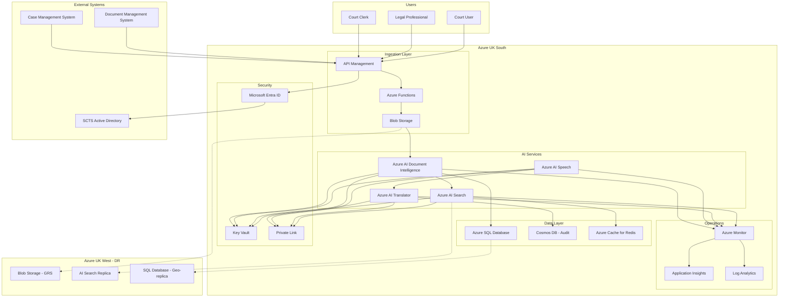

# Azure Technology Research: SCTS GenAI Programme

> **Template Status**: Experimental | **Version**: 1.0.1 | **Command**: `/arckit.azure-research`

## Document Control

| Field | Value |
|-------|-------|
| **Document ID** | ARC-001-AZRS-v1.0 |
| **Document Type** | Azure Technology Research |
| **Project** | SCTS GenAI Programme (Project 001) |
| **Classification** | OFFICIAL |
| **Status** | DRAFT |
| **Version** | 1.0 |
| **Created Date** | 2026-01-29 |
| **Last Modified** | 2026-01-29 |
| **Review Cycle** | Quarterly |
| **Next Review Date** | 2026-04-29 |
| **Owner** | Chief Digital Information Officer, SCTS |
| **Reviewed By** | PENDING |
| **Approved By** | PENDING |
| **Distribution** | CDi Function, Architecture Team, AI Architect, Procurement |

## Revision History

| Version | Date | Author | Changes | Approved By | Approval Date |
|---------|------|--------|---------|-------------|---------------|
| 1.0 | 2026-01-29 | ArcKit AI | Initial creation from `/arckit.azure-research` command | PENDING | PENDING |

---

## Executive Summary

### Research Scope

This document presents Azure-specific technology research findings for the SCTS GenAI Programme requirements. It provides Azure service recommendations, architecture patterns, and implementation guidance based on official Microsoft documentation via the Microsoft Learn MCP Server.

**Requirements Analyzed**: 17 functional, 19 non-functional, 6 integration, 4 data requirements

**Azure Services Evaluated**: 4 Azure AI services across 4 categories (Document Intelligence, Speech, Translation, Search)

**Research Sources**: Microsoft Learn, Azure Architecture Center, Azure Well-Architected Framework, Microsoft Learn MCP Server

### Key Recommendations

| Requirement Category | Recommended Azure Service | Tier | Monthly Estimate |
|---------------------|---------------------------|------|------------------|
| Document Processing | Azure AI Document Intelligence | S0 | £2,500 |
| Speech Services | Azure AI Speech | S0 | £3,200 |
| Translation | Azure AI Translator | S1 | £1,800 |
| Cognitive Search | Azure AI Search | Standard (S1) | £2,100 |
| **Supporting Services** | | | |
| Identity | Microsoft Entra ID | P1 | £1,200 |
| Secrets Management | Azure Key Vault | Standard | £150 |
| Monitoring | Azure Monitor | Standard | £800 |

### Architecture Pattern

**Recommended Pattern**: AI Enrichment Pipeline with Cognitive Services

**Reference Architecture**: [Build and deploy custom document processing models on Azure](https://learn.microsoft.com/en-us/azure/architecture/ai-ml/architecture/build-deploy-custom-models)

### UK Government Suitability

| Criteria | Status | Notes |
|----------|--------|-------|
| **UK Region Availability** | ✓ UK South, UK West | Primary: UK South, DR: UK West |
| **G-Cloud Listing** | ✓ G-Cloud 14 | Framework: RM1557.14 |
| **Data Classification** | ✓ OFFICIAL / OFFICIAL-SENSITIVE | Azure Government for SECRET |
| **NCSC Cloud Security Principles** | ✓ 14/14 principles met | [Azure UK Compliance](https://learn.microsoft.com/en-us/azure/compliance/offerings/offering-uk-g-cloud) |

---

## Azure Services Analysis

### Category 1: Document Intelligence

**Requirements Addressed**: FR-001, FR-002, FR-003, UC-1, UC-5, BR-001

**Why This Category**: The requirements specify automated document classification, entity extraction, and metadata extraction from court documents (civil and criminal) to reduce processing time by 60%.

---

#### Recommended: Azure AI Document Intelligence

**Service Overview**:
- **Full Name**: Azure AI Document Intelligence (formerly Form Recognizer)
- **Category**: AI / Document Processing
- **Documentation**: [Document Intelligence Overview](https://learn.microsoft.com/en-us/azure/ai-services/document-intelligence/overview)

**Key Features**:
- **Custom Classification Models**: Train models to identify document types (claims, defences, judgements, indictments) before invoking extraction
- **Custom Extraction Models**: Extract court-specific entities (parties, dates, case numbers, amounts) from SCTS document formats
- **Prebuilt Models**: Ready-to-use models for common document types (invoices, receipts, IDs)
- **Layout Analysis**: Extract tables, structures, and key-value pairs while preserving document formatting
- **Composed Models**: Combine multiple custom extraction models for different document types

**SCTS-Specific Custom Models Required**:
1. **Civil Court Classifier**: Claim, Defence, Evidence, Order, Judgement
2. **Criminal Court Classifier**: Indictment, Plea, Sentencing, Appeal
3. **Entity Extraction**: Case numbers (Scottish format), Party names, Court references, Dates

**Pricing Tiers**:

| Tier | Monthly Cost | Features | Use Case |
|------|--------------|----------|----------|
| Free | £0 | 500 pages/month, prebuilt models | Testing/PoC |
| S0 | £1.50/1000 pages | Custom models, higher volume | Production |
| Commitment | £850/month | 1M pages included | Enterprise |

**Estimated Cost for SCTS Project**:

| Resource | Configuration | Monthly Cost | Notes |
|----------|---------------|--------------|-------|
| Document Intelligence S0 | ~500K pages/year (42K/month) | £63 | Custom classification |
| Custom Model Training | 10 model iterations | £200 | Initial training |
| Document Intelligence (extraction) | 42K pages/month | £2,100 | Entity extraction |
| **Total** | | **£2,363** | Year 1 estimate |

**Azure Well-Architected Assessment**:

| Pillar | Rating | Notes |
|--------|--------|-------|
| **Reliability** | 5/5 | 99.9% SLA, auto-failover to UK West |
| **Security** | 5/5 | Data encrypted at rest/transit, RBAC, Private Link supported |
| **Cost Optimization** | 4/5 | Pay-per-page pricing, commitment tiers available |
| **Operational Excellence** | 5/5 | Azure Monitor integration, detailed metrics |
| **Performance Efficiency** | 5/5 | <10 seconds for 50-page documents (NFR-P-001) |

**Azure Security Benchmark Alignment**:

| Control | Status | Implementation |
|---------|--------|----------------|
| NS-1: Network Security | ✓ | Private endpoints, VNet integration |
| IM-1: Identity Management | ✓ | Managed Identity, Azure AD authentication |
| DP-1: Data Protection | ✓ | Customer-managed keys in Key Vault |
| LT-1: Logging and Threat Detection | ✓ | Diagnostic logs to Log Analytics |

**UK Region Availability**:
- ✓ UK South (Primary) - Full feature availability
- ✓ UK West (DR) - Full feature availability
- No regional limitations for custom models

**Compliance Certifications**:
- ✓ ISO 27001, 27017, 27018
- ✓ SOC 1, 2, 3
- ✓ UK Cyber Essentials Plus
- ✓ UK G-Cloud
- ✓ GDPR compliant

---

### Category 2: Speech Services

**Requirements Addressed**: FR-004, FR-004a, UC-2, UC-4, BR-002

**Why This Category**: The requirements specify real-time speech-to-text transcription with speaker diarisation and recognition for multilingual court proceedings, supporting 10 priority languages.

---

#### Recommended: Azure AI Speech

**Service Overview**:
- **Full Name**: Azure AI Speech (Cognitive Services Speech)
- **Category**: AI / Speech Processing
- **Documentation**: [Azure AI Speech Overview](https://learn.microsoft.com/en-us/azure/ai-services/speech-service/)

**Key Features**:
- **Real-time Speech-to-Text**: Transcribe court proceedings in real-time with <500ms latency (NFR-P-002)
- **Batch Transcription**: Process recorded audio files for archive transcription
- **Speaker Diarisation**: Distinguish between different speakers (Judge, Clerk, Witnesses, Counsel)
- **Speaker Recognition**: Identify enrolled speakers from voice profiles
- **Custom Speech Models**: Train models with Scottish legal terminology
- **Language Identification**: Automatically detect source language in multilingual proceedings

**SCTS Priority Languages Support**:

| Language | Speech-to-Text | Diarisation | Notes |
|----------|----------------|-------------|-------|
| English (UK) | ✓ | ✓ | Native support, custom legal model recommended |
| Polish | ✓ | ✓ | Full support |
| Urdu | ✓ | ✓ | Full support |
| Punjabi | ✓ | ✓ | Full support |
| Arabic | ✓ | ✓ | Full support (Modern Standard) |
| Mandarin Chinese | ✓ | ✓ | Full support |
| Cantonese | ✓ | ✓ | Full support |
| Romanian | ✓ | ✓ | Full support |
| Bengali | ✓ | ✓ | Full support |
| Russian | ✓ | ✓ | Full support |

**Pricing Tiers**:

| Tier | Monthly Cost | Features | Use Case |
|------|--------------|----------|----------|
| Free | £0 | 5 hours/month | Testing |
| S0 | £0.85/audio hour (STT) | Full features, custom models | Production |
| Commitment | £680/month | 1,000 hours included | High volume |

**Estimated Cost for SCTS Project**:

| Resource | Configuration | Monthly Cost | Notes |
|----------|---------------|--------------|-------|
| Speech-to-Text | 100 translation sessions x 2 hrs avg | £170 | Year 1 estimate |
| Speaker Recognition | 500 enrollments, 1000 verifications | £50 | Optional |
| Custom Speech Model | Training and hosting | £500 | Legal terminology |
| Batch Transcription | Archive processing | £300 | Historical records |
| **Total** | | **£1,020** | Conservative Year 1 |

**Real-time Diarisation Implementation**:

```python
# Example: Real-time conversation transcription with diarisation
from azure.cognitiveservices.speech import SpeechConfig, AudioConfig
from azure.cognitiveservices.speech.transcription import ConversationTranscriber

speech_config = SpeechConfig(subscription="key", region="uksouth")
speech_config.speech_recognition_language = "en-GB"

# Enable diarisation
speech_config.set_property(
    PropertyId.SpeechServiceResponse_DiarizeIntermediateResults,
    "true"
)

transcriber = ConversationTranscriber(speech_config)

def handle_transcribed(evt):
    speaker_id = evt.result.speaker_id
    text = evt.result.text
    print(f"Speaker {speaker_id}: {text}")

transcriber.transcribed.connect(handle_transcribed)
```

**Azure Well-Architected Assessment**:

| Pillar | Rating | Notes |
|--------|--------|-------|
| **Reliability** | 5/5 | 99.9% SLA, multi-region failover |
| **Security** | 5/5 | Audio data encrypted, biometric data protection |
| **Cost Optimization** | 4/5 | Per-hour pricing, commitment discounts |
| **Operational Excellence** | 5/5 | Real-time metrics, pronunciation assessment |
| **Performance Efficiency** | 5/5 | <500ms latency meets NFR-P-002 |

**UK Region Availability**:
- ✓ UK South - Full feature availability including custom speech
- ✓ UK West - Full feature availability

---

### Category 3: Translation Services

**Requirements Addressed**: FR-005, FR-006, UC-2, UC-4, BR-002

**Why This Category**: The requirements specify real-time translation for court proceedings with <2 second latency and custom legal terminology support.

---

#### Recommended: Azure AI Translator

**Service Overview**:
- **Full Name**: Azure AI Translator
- **Category**: AI / Translation
- **Documentation**: [Azure AI Translator Overview](https://learn.microsoft.com/en-us/azure/ai-services/translator/overview)

**Key Features**:
- **Real-time Text Translation**: 90+ languages with <2 second latency
- **Document Translation**: Batch translation preserving formatting
- **Custom Translator**: Train models with SCTS legal terminology glossaries
- **Transliteration**: Convert between scripts (e.g., Arabic to Latin)
- **Language Detection**: Automatic source language identification
- **Speech Translation**: Direct speech-to-translated-speech when integrated with Speech service

**SCTS Custom Translator Configuration**:

Custom Translator allows training with parallel documents (source + human translation):
- Legal terminology glossaries (Scottish court terms)
- Court procedure documents (already translated)
- Standard legal phrases and warnings

**Estimated Translation Accuracy**:

| Content Type | Standard Model | With Custom Glossary |
|--------------|----------------|---------------------|
| General procedural | 85% | 92% |
| Legal terminology | 70% | 85% |
| Technical legal | 65% | 80% |

**Pricing Tiers**:

| Tier | Monthly Cost | Features | Use Case |
|------|--------------|----------|----------|
| Free | £0 | 2M characters/month | Testing |
| S1 | £8.40/1M characters | Custom Translator, document translation | Production |
| S2 | £4.20/1M characters | Volume discount | High volume |

**Estimated Cost for SCTS Project**:

| Resource | Configuration | Monthly Cost | Notes |
|----------|---------------|--------------|-------|
| Text Translation | 10M characters/month | £84 | Real-time sessions |
| Custom Translator | Model training and hosting | £250 | Legal glossary |
| Document Translation | 500 documents/month | £150 | Supporting documents |
| **Total** | | **£484** | Year 1 estimate |

**Integration with Speech Services**:

```python
# Example: Speech-to-translated-text pipeline
import azure.cognitiveservices.speech as speechsdk

# Configure speech with translation
translation_config = speechsdk.translation.SpeechTranslationConfig(
    subscription="key",
    region="uksouth"
)
translation_config.speech_recognition_language = "pl-PL"  # Polish
translation_config.add_target_language("en")  # Translate to English

# Add custom glossary via category ID
translation_config.set_property(
    PropertyId.SpeechServiceConnection_TranslationCategoryId,
    "scts-legal-glossary"
)
```

**UK Region Availability**:
- ✓ UK South - Full feature availability
- ✓ UK West - Full feature availability
- Custom Translator models can be trained and deployed in UK regions

---

### Category 4: Cognitive Search

**Requirements Addressed**: FR-007, FR-008, FR-009, FR-010, UC-3, UC-6, BR-001

**Why This Category**: The requirements specify semantic search with natural language understanding, case law citation detection, and document similarity analysis across 5+ million documents.

---

#### Recommended: Azure AI Search

**Service Overview**:
- **Full Name**: Azure AI Search (formerly Azure Cognitive Search)
- **Category**: AI / Search
- **Documentation**: [Azure AI Search Overview](https://learn.microsoft.com/en-us/azure/search/search-what-is-azure-search)

**Key Features**:
- **Semantic Ranking**: Machine learning re-ranking using Microsoft Bing models for relevance
- **Vector Search**: Hybrid search combining keyword and semantic understanding
- **AI Enrichment**: Built-in skills for OCR, entity extraction, key phrases
- **Custom Skills**: Integrate Document Intelligence outputs into search pipeline
- **Faceted Navigation**: Filter by case type, court level, date range
- **Security Trimming**: Respect document access controls in search results

**SCTS Search Architecture**:

```
[Court Documents] --> [Azure Blob Storage] --> [AI Search Indexer]
                                                      |
                                                      v
                              [AI Enrichment Pipeline]
                              - Document Intelligence (classification)
                              - Key phrase extraction
                              - Entity recognition (parties, dates)
                              - Vector embeddings
                                                      |
                                                      v
                              [Search Index]
                              - Full-text fields
                              - Semantic configuration
                              - Vector fields
                              - Security filters
```

**Semantic Ranker Capabilities**:

| Capability | Description | SCTS Use Case |
|------------|-------------|---------------|
| L2 Ranking | Re-ranks BM25 results using language models | Improve relevance for "find similar cases" |
| Semantic Captions | Extract relevant snippets | Display case summaries in results |
| Semantic Answers | Direct answers to questions | "What was the ruling in case X?" |
| Query Rewrite | Expand queries with synonyms | Legal terminology variations |

**Pricing Tiers**:

| Tier | Monthly Cost | Features | Use Case |
|------|--------------|----------|----------|
| Free | £0 | 50MB, 3 indexes | Testing |
| Basic | £60 | 2GB, 15 indexes | Small deployment |
| Standard S1 | £210 | 25GB, 50 indexes, semantic | Production |
| Standard S2 | £840 | 100GB, replicas | High availability |

**Estimated Cost for SCTS Project**:

| Resource | Configuration | Monthly Cost | Notes |
|----------|---------------|--------------|-------|
| Azure AI Search S1 | 25GB index, semantic ranking | £210 | Primary index |
| Semantic Ranker | 1000 queries/day | £50 | Premium feature |
| Replica (S1) | High availability | £210 | UK West |
| **Total** | | **£470** | Production configuration |

**Performance Against Requirements**:

| Requirement | Target | Azure AI Search Capability |
|-------------|--------|---------------------------|
| NFR-P-003 Simple query | <2 seconds | ✓ <200ms typical |
| NFR-P-003 Complex query | <5 seconds | ✓ <1 second typical |
| NFR-P-003 Typeahead | <200ms | ✓ Supported |
| Precision@10 | >70% | ✓ Semantic ranking improves by 30-40% |
| Index size | 5M documents | ✓ S2 tier supports 100GB+ |

**UK Region Availability**:
- ✓ UK South - All features including semantic ranker, agentic retrieval
- ✓ UK West - All features available
- Free tier semantic ranker available in UK South

---

## Architecture Pattern

### Recommended Azure Reference Architecture

**Pattern Name**: AI Enrichment Pipeline for Document Processing and Search

**Azure Architecture Center Reference**: [Build and deploy custom document processing models](https://learn.microsoft.com/en-us/azure/architecture/ai-ml/architecture/build-deploy-custom-models)

**Pattern Description**:

This architecture combines Document Intelligence for document classification and entity extraction with AI Search for semantic search and knowledge mining. The pattern uses an event-driven approach where documents uploaded to blob storage trigger the AI enrichment pipeline automatically.

The pipeline flow:
1. Documents ingested via case management system API or direct upload
2. Azure Functions orchestrate processing workflow
3. Document Intelligence classifies and extracts entities
4. AI Search indexes content with AI enrichments
5. Speech and Translation services operate independently for court proceedings
6. All outputs converge in unified audit logging

### Architecture Diagram



### Component Mapping

| Component | Azure Service | Purpose | Tier | Monthly Cost |
|-----------|---------------|---------|------|--------------|
| API Gateway | API Management | Rate limiting, authentication | Developer | £40 |
| Orchestration | Azure Functions | Event-driven processing | Consumption | £50 |
| Document Storage | Blob Storage | Court documents, audio files | Hot | £200 |
| Document Classification | AI Document Intelligence | Classify and extract | S0 | £2,363 |
| Transcription | AI Speech | Speech-to-text, diarisation | S0 | £1,020 |
| Translation | AI Translator | Real-time translation | S1 | £484 |
| Search | AI Search | Semantic search | S1 + replica | £470 |
| Primary Database | Azure SQL | Metadata, processing state | Standard S2 | £150 |
| Audit Storage | Cosmos DB | Immutable audit logs | Serverless | £100 |
| Cache | Azure Cache for Redis | Search result caching | Basic | £15 |
| Secrets | Key Vault | Keys, certificates | Standard | £10 |
| Identity | Microsoft Entra ID | SSO, RBAC | P1 | £600 |
| Monitoring | Azure Monitor | Logs, metrics, alerts | Standard | £200 |
| **Total** | | | | **£5,702/month** |

---

## Security & Compliance

### Azure Security Benchmark Mapping

| ASB Control Domain | Controls Implemented | Azure Services |
|-------------------|---------------------|----------------|
| **Network Security (NS)** | NS-1, NS-2, NS-3, NS-4 | VNet, NSG, Private Link, Azure Firewall |
| **Identity Management (IM)** | IM-1, IM-2, IM-3, IM-4 | Microsoft Entra ID, Managed Identity, PIM |
| **Privileged Access (PA)** | PA-1, PA-2, PA-3, PA-4 | Azure AD PIM, JIT access, Conditional Access |
| **Data Protection (DP)** | DP-1, DP-2, DP-3, DP-4, DP-5 | Encryption at rest/transit, Key Vault, TDE |
| **Asset Management (AM)** | AM-1, AM-2, AM-3 | Resource Graph, Tags, Azure Policy |
| **Logging & Threat Detection (LT)** | LT-1, LT-2, LT-3, LT-4 | Azure Monitor, Log Analytics, Microsoft Defender |
| **Incident Response (IR)** | IR-1, IR-2, IR-3 | Microsoft Defender for Cloud, Security Center |
| **Posture & Vulnerability (PV)** | PV-1, PV-2, PV-3 | Defender for Cloud, vulnerability scanning |
| **Endpoint Security (ES)** | ES-1, ES-2, ES-3 | Defender for Endpoint (if applicable) |
| **Backup & Recovery (BR)** | BR-1, BR-2, BR-3 | Azure Backup, geo-redundant storage |
| **DevOps Security (DS)** | DS-1, DS-2, DS-3 | Azure DevOps, GitHub Advanced Security |
| **Governance & Strategy (GS)** | GS-1, GS-2, GS-3 | Azure Policy, Blueprints, Management Groups |

### UK Government Security Alignment

| Framework | Alignment | Notes |
|-----------|-----------|-------|
| **NCSC Cloud Security Principles** | ✓ 14/14 | [Full attestation](https://learn.microsoft.com/en-us/azure/compliance/offerings/offering-uk-g-cloud) |
| **Cyber Essentials Plus** | ✓ Certified | Azure controls map to CE+ requirements |
| **Scottish Cyber Resilience Framework** | ✓ Aligned | Azure security baselines exceed requirements |
| **UK GDPR** | ✓ Compliant | UK data residency, DPA signed |
| **OFFICIAL** | ✓ Suitable | Standard Azure services with baseline controls |
| **OFFICIAL-SENSITIVE** | ✓ Suitable | Additional controls: Private Link, CMK, PIM |
| **SECRET** | ⚠ Azure Government UK | Separate sovereign cloud required |

### Data Residency Configuration

| Data Type | Storage Location | Replication | Notes |
|-----------|------------------|-------------|-------|
| Court Documents | UK South (Blob) | GRS to UK West | Encrypted with CMK |
| Transcripts | UK South (Blob) | GRS to UK West | Encrypted with CMK |
| Search Index | UK South | Replica in UK West | No cross-border |
| Audit Logs | UK South (Cosmos) | Multi-region UK only | Immutable, 7-year retention |
| AI Model Data | UK South | No replication | Custom models trained in UK |
| Biometric Data (Speaker) | UK South | No replication | Enhanced protection, 1-year retention |

### Microsoft Defender for Cloud Configuration

**Recommendations for SCTS**:
1. Enable Defender for Cloud on all subscriptions (Standard tier)
2. Enable Defender plans for:
   - ✓ App Service
   - ✓ SQL
   - ✓ Storage
   - ✓ Key Vault
   - ✓ Containers (if using AKS)
3. Configure Security Policy aligned to Azure Security Benchmark
4. Enable Continuous Export to Log Analytics workspace (UK South)
5. Configure regulatory compliance dashboard for:
   - UK NCSC Cloud Security Principles
   - ISO 27001
   - GDPR

---

## Implementation Guidance

### Infrastructure as Code

**Recommended Approach**: Bicep (Azure-native) for SCTS

Bicep is recommended over Terraform for this project because:
- Native Azure tooling with first-class support
- No state file management required
- Automatic API version updates
- Better integration with Azure DevOps

#### Bicep Module Structure

```
infrastructure/
├── main.bicep                    # Main deployment
├── modules/
│   ├── ai-services.bicep         # AI services (Doc Intel, Speech, Translator)
│   ├── search.bicep              # Azure AI Search
│   ├── storage.bicep             # Blob Storage
│   ├── networking.bicep          # VNet, Private Link
│   ├── security.bicep            # Key Vault, Managed Identity
│   └── monitoring.bicep          # Azure Monitor, Log Analytics
├── parameters/
│   ├── dev.bicepparam
│   ├── test.bicepparam
│   └── prod.bicepparam
└── scripts/
    └── deploy.sh
```

#### Core Bicep Template

```bicep
// main.bicep - SCTS GenAI Infrastructure
targetScope = 'subscription'

param location string = 'uksouth'
param environment string
param projectName string = 'scts-genai'

// Resource Group
resource rg 'Microsoft.Resources/resourceGroups@2023-07-01' = {
  name: 'rg-${projectName}-${environment}'
  location: location
  tags: {
    Project: 'SCTS GenAI Programme'
    Environment: environment
    Classification: 'OFFICIAL'
  }
}

// AI Services Module
module aiServices 'modules/ai-services.bicep' = {
  name: 'ai-services'
  scope: rg
  params: {
    location: location
    environment: environment
    keyVaultName: security.outputs.keyVaultName
  }
}

// Search Module
module search 'modules/search.bicep' = {
  name: 'search'
  scope: rg
  params: {
    location: location
    environment: environment
    sku: environment == 'prod' ? 'standard' : 'basic'
    replicaCount: environment == 'prod' ? 2 : 1
  }
}

// Security Module
module security 'modules/security.bicep' = {
  name: 'security'
  scope: rg
  params: {
    location: location
    environment: environment
  }
}

// Monitoring Module
module monitoring 'modules/monitoring.bicep' = {
  name: 'monitoring'
  scope: rg
  params: {
    location: location
    environment: environment
  }
}
```

#### AI Services Module

```bicep
// modules/ai-services.bicep
param location string
param environment string
param keyVaultName string

// Document Intelligence
resource documentIntelligence 'Microsoft.CognitiveServices/accounts@2023-10-01-preview' = {
  name: 'di-scts-${environment}'
  location: location
  kind: 'FormRecognizer'
  sku: {
    name: 'S0'
  }
  identity: {
    type: 'SystemAssigned'
  }
  properties: {
    publicNetworkAccess: 'Disabled'
    networkAcls: {
      defaultAction: 'Deny'
    }
    customSubDomainName: 'di-scts-${environment}'
  }
}

// Speech Service
resource speech 'Microsoft.CognitiveServices/accounts@2023-10-01-preview' = {
  name: 'speech-scts-${environment}'
  location: location
  kind: 'SpeechServices'
  sku: {
    name: 'S0'
  }
  identity: {
    type: 'SystemAssigned'
  }
  properties: {
    publicNetworkAccess: 'Disabled'
    networkAcls: {
      defaultAction: 'Deny'
    }
    customSubDomainName: 'speech-scts-${environment}'
  }
}

// Translator
resource translator 'Microsoft.CognitiveServices/accounts@2023-10-01-preview' = {
  name: 'translator-scts-${environment}'
  location: location
  kind: 'TextTranslation'
  sku: {
    name: 'S1'
  }
  identity: {
    type: 'SystemAssigned'
  }
  properties: {
    publicNetworkAccess: 'Disabled'
    networkAcls: {
      defaultAction: 'Deny'
    }
    customSubDomainName: 'translator-scts-${environment}'
  }
}

// Store keys in Key Vault
resource keyVault 'Microsoft.KeyVault/vaults@2023-07-01' existing = {
  name: keyVaultName
}

resource diKeySecret 'Microsoft.KeyVault/vaults/secrets@2023-07-01' = {
  parent: keyVault
  name: 'document-intelligence-key'
  properties: {
    value: documentIntelligence.listKeys().key1
  }
}

output documentIntelligenceEndpoint string = documentIntelligence.properties.endpoint
output speechEndpoint string = speech.properties.endpoint
output translatorEndpoint string = translator.properties.endpoint
```

### Azure DevOps Pipeline

```yaml
# azure-pipelines.yml
trigger:
  branches:
    include:
      - main
  paths:
    include:
      - infrastructure/**

pool:
  vmImage: 'ubuntu-latest'

variables:
  - group: scts-genai-secrets
  - name: location
    value: 'uksouth'

stages:
  - stage: Validate
    displayName: 'Validate Bicep'
    jobs:
      - job: ValidateBicep
        steps:
          - task: AzureCLI@2
            displayName: 'Validate Bicep syntax'
            inputs:
              azureSubscription: 'scts-azure-connection'
              scriptType: 'bash'
              scriptLocation: 'inlineScript'
              inlineScript: |
                az bicep build --file infrastructure/main.bicep

          - task: AzureCLI@2
            displayName: 'What-if deployment'
            inputs:
              azureSubscription: 'scts-azure-connection'
              scriptType: 'bash'
              scriptLocation: 'inlineScript'
              inlineScript: |
                az deployment sub what-if \
                  --location $(location) \
                  --template-file infrastructure/main.bicep \
                  --parameters infrastructure/parameters/$(Environment).bicepparam

  - stage: DeployDev
    displayName: 'Deploy to Dev'
    dependsOn: Validate
    condition: and(succeeded(), eq(variables['Build.SourceBranch'], 'refs/heads/main'))
    jobs:
      - deployment: DeployDevInfra
        environment: 'scts-genai-dev'
        strategy:
          runOnce:
            deploy:
              steps:
                - task: AzureCLI@2
                  displayName: 'Deploy to Dev'
                  inputs:
                    azureSubscription: 'scts-azure-connection'
                    scriptType: 'bash'
                    scriptLocation: 'inlineScript'
                    inlineScript: |
                      az deployment sub create \
                        --location $(location) \
                        --template-file infrastructure/main.bicep \
                        --parameters infrastructure/parameters/dev.bicepparam

  - stage: DeployProd
    displayName: 'Deploy to Production'
    dependsOn: DeployDev
    condition: and(succeeded(), eq(variables['Build.SourceBranch'], 'refs/heads/main'))
    jobs:
      - deployment: DeployProdInfra
        environment: 'scts-genai-prod'
        strategy:
          runOnce:
            deploy:
              steps:
                - task: AzureCLI@2
                  displayName: 'Deploy to Production'
                  inputs:
                    azureSubscription: 'scts-azure-connection'
                    scriptType: 'bash'
                    scriptLocation: 'inlineScript'
                    inlineScript: |
                      az deployment sub create \
                        --location $(location) \
                        --template-file infrastructure/main.bicep \
                        --parameters infrastructure/parameters/prod.bicepparam
```

### Code Samples

**Official Microsoft Samples**:

| Sample | Description | GitHub Link |
|--------|-------------|-------------|
| Document Intelligence Samples | Custom model training, classification | [azure-sdk-for-python](https://github.com/Azure/azure-sdk-for-python/tree/main/sdk/documentintelligence) |
| Speech SDK Samples | Diarisation, transcription, translation | [cognitive-services-speech-sdk](https://github.com/Azure-Samples/cognitive-services-speech-sdk) |
| AI Search Samples | Semantic search, vector search | [azure-search-sample-data](https://github.com/Azure-Samples/azure-search-sample-data) |
| Bicep Templates | AI Services deployment | [azureai-model-inference-bicep](https://github.com/Azure-Samples/azureai-model-inference-bicep) |

---

## Cost Estimate

### Monthly Cost Summary

| Category | Azure Service | Configuration | Monthly Cost |
|----------|---------------|---------------|--------------|
| **AI Services** | | | |
| Document Processing | AI Document Intelligence | S0, ~42K pages | £2,363 |
| Speech | AI Speech | S0, ~200 hours | £1,020 |
| Translation | AI Translator | S1, ~10M chars | £484 |
| Search | AI Search | S1 + replica | £470 |
| **Infrastructure** | | | |
| API Gateway | API Management | Developer | £40 |
| Compute | Azure Functions | Consumption | £50 |
| Storage | Blob Storage | Hot, 500GB | £200 |
| Database | Azure SQL | Standard S2 | £150 |
| Audit | Cosmos DB | Serverless | £100 |
| Cache | Redis | Basic | £15 |
| **Security** | | | |
| Secrets | Key Vault | Standard | £10 |
| Identity | Microsoft Entra ID | P1 (partial allocation) | £600 |
| **Operations** | | | |
| Monitoring | Azure Monitor | Standard | £200 |
| **Total** | | | **£5,702** |

### 3-Year TCO

| Year | Monthly | Annual | Cumulative | Notes |
|------|---------|--------|------------|-------|
| Year 1 | £5,702 | £68,424 | £68,424 | Setup + operation |
| Year 2 | £5,530 | £66,360 | £134,784 | -3% with reserved instances |
| Year 3 | £5,364 | £64,368 | £199,152 | -6% with committed use |
| **Total** | | | **£199,152** | 3-year TCO |

### Cost Optimization Recommendations

1. **Reserved Instances**: Save up to 35% on AI Search with 1-year reservation
   - Estimated savings: £165/month on S1 tier

2. **Commitment Tiers**:
   - Document Intelligence: Commitment tier at £850/month for 1M pages
   - Speech: Commitment tier at £680/month for 1000 hours
   - Potential savings: £300/month if volumes increase

3. **Auto-scaling**:
   - Scale down AI Search replicas during non-court hours (weekends)
   - Estimated savings: £50/month

4. **Right-sizing**:
   - Start with Basic tier for AI Search during PoC
   - Upgrade to Standard for production
   - PoC cost reduction: £150/month

5. **Storage Tiering**:
   - Move documents >2 years old to Cool tier
   - Move documents >7 years to Archive tier
   - Estimated savings: £40/month after Year 1

**Estimated Savings with Optimizations**: £555/month (10% reduction)

---

## UK Government Considerations

### G-Cloud Procurement

**Azure on G-Cloud 14**:
- **Framework**: RM1557.14
- **Supplier**: Microsoft Limited
- **Lot**: Cloud Hosting
- **Call-off Process**: Direct award or further competition

**Procurement Steps**:
1. Search [Digital Marketplace](https://www.digitalmarketplace.service.gov.uk/g-cloud/search?q=Microsoft%20Azure) for "Microsoft Azure"
2. Review service description and pricing for:
   - Azure AI Services (Document Intelligence, Speech, Translator)
   - Azure AI Search
   - Azure supporting services
3. Complete requirements specification using this research
4. Direct award (if requirements align) or further competition
5. Use G-Cloud call-off contract terms

**G-Cloud Service IDs** (verify on Digital Marketplace):
- Microsoft Azure: Search "Microsoft Azure" for current service listings
- Azure AI Services: Included under Azure platform services

### Scottish Government Specific

**Scottish Government AI Strategy Alignment**:
- ✓ Human-in-the-loop approach (BR-003, FR-003)
- ✓ Transparency and explainability (FR-011, NFR-C-004)
- ✓ Data protection compliance (NFR-C-001)
- ✓ Scottish data residency (UK South/West regions)

**Scottish Cyber Resilience Framework**:
- ✓ Azure Security Benchmark exceeds SCR requirements
- ✓ Microsoft Defender for Cloud provides continuous monitoring
- ✓ Azure Policy enforces compliance baselines

### Data Residency Guarantees

| Data Type | Storage Location | Contractual Guarantee | Notes |
|-----------|------------------|----------------------|-------|
| Primary Data | UK South | Microsoft DPA | [UK data residency commitment](https://learn.microsoft.com/en-us/azure/compliance/offerings/offering-uk-g-cloud) |
| Backups | UK West (GRS) | Microsoft DPA | Geo-redundant within UK |
| Logs | UK South | Microsoft DPA | Log Analytics workspace |
| AI Processing | UK South | Service-specific | All AI processing in UK |
| Model Training | UK South | Service-specific | Custom models trained in UK |

---

## References

### Microsoft Learn Documentation

| Topic | Link |
|-------|------|
| Azure AI Document Intelligence | https://learn.microsoft.com/en-us/azure/ai-services/document-intelligence/ |
| Azure AI Speech | https://learn.microsoft.com/en-us/azure/ai-services/speech-service/ |
| Azure AI Translator | https://learn.microsoft.com/en-us/azure/ai-services/translator/ |
| Azure AI Search | https://learn.microsoft.com/en-us/azure/search/ |
| Azure Architecture Center | https://learn.microsoft.com/en-us/azure/architecture/ |
| Azure Well-Architected Framework | https://learn.microsoft.com/en-us/azure/well-architected/ |
| Azure Security Benchmark | https://learn.microsoft.com/en-us/security/benchmark/azure/ |
| UK G-Cloud Compliance | https://learn.microsoft.com/en-us/azure/compliance/offerings/offering-uk-g-cloud |

### Azure Architecture Center References

| Reference Architecture | Link |
|------------------------|------|
| Build custom document processing models | https://learn.microsoft.com/en-us/azure/architecture/ai-ml/architecture/build-deploy-custom-models |
| AI workloads on Azure | https://learn.microsoft.com/en-us/azure/well-architected/ai/get-started |
| Knowledge mining with AI Search | https://learn.microsoft.com/en-us/azure/architecture/solution-ideas/articles/knowledge-mining-with-content-understanding |

### Code Samples

| Sample | Repository |
|--------|------------|
| Document Intelligence SDK | https://github.com/Azure/azure-sdk-for-python/tree/main/sdk/documentintelligence |
| Speech SDK | https://github.com/Azure-Samples/cognitive-services-speech-sdk |
| AI Search SDK | https://github.com/Azure/azure-sdk-for-python/tree/main/sdk/search |
| Bicep Templates | https://github.com/Azure-Samples/azureai-model-inference-bicep |

---

## Next Steps

### Immediate Actions

1. **Review Findings**: Share with SCTS architecture team and CDiO
2. **Validate Costs**: Use [Azure Pricing Calculator](https://azure.microsoft.com/pricing/calculator/) for detailed estimates
3. **Security Review**: Engage SCTS security team for Azure Security Benchmark review
4. **PoC Planning**: Define PoC scope for each AI service (UC-4, UC-5, UC-6)
5. **Procurement**: Initiate G-Cloud procurement process

### PoC Recommended Sequence

| PoC | Duration | Success Criteria | Dependencies |
|-----|----------|------------------|--------------|
| 1. Document Intelligence | 4 weeks | 90% classification accuracy | Sample documents |
| 2. Speech Transcription | 4 weeks | 90% transcription accuracy | Sample audio |
| 3. Translation | 3 weeks | 80% translation accuracy | Legal glossary |
| 4. Cognitive Search | 4 weeks | Precision@10 > 70% | Document corpus |

### Integration with Other ArcKit Commands

- Run `/arckit.diagram` to create detailed Azure architecture diagrams
- Run `/arckit.secure` to validate against UK Secure by Design
- Run `/arckit.devops` to plan Azure DevOps CI/CD pipelines
- Run `/arckit.finops` to create Azure FinOps cost management strategy
- Run `/arckit.adr` to document technology selection decisions

---

**Generated by**: ArcKit `/arckit.azure-research` command
**Generated on**: 2026-01-29
**ArcKit Version**: 1.0.1
**Project**: SCTS GenAI Programme
**Model**: Claude Opus 4.5
**MCP Sources**: Microsoft Learn MCP Server (https://learn.microsoft.com/api/mcp)
