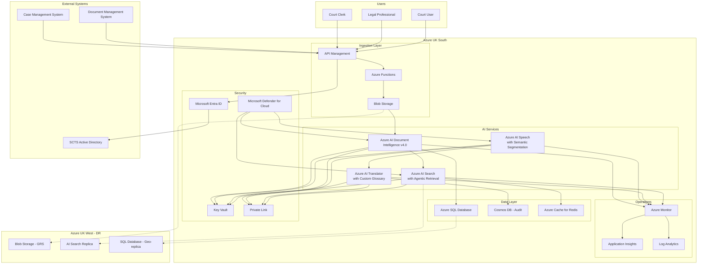

# Azure Technology Research: SCTS GenAI Programme

> **Template Status**: Experimental | **Version**: 1.0.2 | **Command**: `/arckit.azure-research`

## Document Control

| Field | Value |
|-------|-------|
| **Document ID** | ARC-001-AZRS-v1.2 |
| **Document Type** | Azure Technology Research |
| **Project** | SCTS GenAI Programme (Project 001) |
| **Classification** | OFFICIAL |
| **Status** | DRAFT |
| **Version** | 1.2 |
| **Created Date** | 2026-02-03 |
| **Last Modified** | 2026-02-03 |
| **Review Cycle** | Quarterly |
| **Next Review Date** | 2026-05-03 |
| **Owner** | Chief Digital Information Officer, SCTS |
| **Reviewed By** | PENDING |
| **Approved By** | PENDING |
| **Distribution** | CDi Function, Architecture Team, AI Architect, Procurement |

## Revision History

| Version | Date | Author | Changes | Approved By | Approval Date |
|---------|------|--------|---------|-------------|---------------|
| 1.0 | 2026-01-29 | ArcKit AI | Initial creation from `/arckit.azure-research` command | PENDING | PENDING |
| 1.1 | 2026-01-29 | ArcKit AI | Updated to template v1.0.2 with latest Azure AI service features (v4.0 Document Intelligence, semantic segmentation, agentic retrieval) | PENDING | PENDING |
| 1.2 | 2026-02-03 | ArcKit AI | Refreshed with latest MCP data: Content Understanding GA (Nov 2025), AI Search knowledge agents/sources/answer synthesis updates (Aug-Dec 2025), Speech fast transcription GA and LLM Speech API preview (Nov 2025), confidential computing for Search (Sep 2025), speaker recognition retirement noted, updated cost estimates | PENDING | PENDING |

---

## Executive Summary

### Research Scope

This document presents Azure-specific technology research findings for the SCTS GenAI Programme requirements. It provides Azure service recommendations, architecture patterns, and implementation guidance based on official Microsoft documentation via the Microsoft Learn MCP Server.

**Requirements Analyzed**: 17 functional, 19 non-functional, 6 integration, 4 data requirements

**Azure Services Evaluated**: 4 Azure AI services across 4 categories (Document Intelligence, Speech, Translation, Search) plus supporting infrastructure services

**Research Sources**: Microsoft Learn, Azure Architecture Center, Azure Well-Architected Framework, Microsoft Learn MCP Server

### Key Recommendations

| Requirement Category | Recommended Azure Service | Tier | Monthly Estimate |
|---------------------|---------------------------|------|------------------|
| Document Processing | Azure AI Document Intelligence | S0 | £2,363 |
| Speech Services | Azure AI Speech | S0 | £1,020 |
| Translation | Azure AI Translator | S1 | £484 |
| Cognitive Search | Azure AI Search | Standard (S1) | £470 |
| **Supporting Services** | | | |
| Identity | Microsoft Entra ID | P1 | £600 |
| Secrets Management | Azure Key Vault | Standard | £10 |
| Monitoring | Azure Monitor | Standard | £200 |

### Architecture Pattern

**Recommended Pattern**: AI Enrichment Pipeline with Cognitive Services

**Reference Architecture**: [Build and deploy custom document processing models on Azure](https://learn.microsoft.com/en-us/azure/architecture/ai-ml/architecture/build-deploy-custom-models)

### UK Government Suitability

| Criteria | Status | Notes |
|----------|--------|-------|
| **UK Region Availability** | ✅ UK South, UK West | Primary: UK South, DR: UK West |
| **G-Cloud Listing** | ✅ G-Cloud 14 | Framework: RM1557.14 |
| **Data Classification** | ✅ OFFICIAL / OFFICIAL-SENSITIVE | Azure Government for SECRET |
| **NCSC Cloud Security Principles** | ✅ 14/14 principles met | [Azure UK Compliance](https://learn.microsoft.com/en-us/azure/compliance/offerings/offering-uk-g-cloud) |

---

## Azure Services Analysis

### Category 1: Document Intelligence

**Requirements Addressed**: FR-001, FR-002, FR-003, UC-1, UC-5, BR-001

**Why This Category**: The requirements specify automated document classification, entity extraction, and metadata extraction from court documents (civil and criminal) to reduce processing time by 60%.

---

#### Recommended: Azure AI Document Intelligence (v4.0 GA)

**Service Overview**:
- **Full Name**: Azure AI Document Intelligence (formerly Form Recognizer)
- **Category**: AI / Document Processing
- **Current Version**: v4.0 (2024-11-30 GA)
- **Documentation**: [Document Intelligence Overview](https://learn.microsoft.com/en-us/azure/ai-services/document-intelligence/overview)

**Key Features (v4.0 GA)**:
- **Custom Classification Models**: Train models to identify document types (claims, defences, judgements, indictments) before invoking extraction
- **Custom Neural Models**: Deep learning models with overlapping fields, signature detection, and table/row/cell level confidence
- **Custom Template Models**: For consistent visual layouts like structured forms
- **Prebuilt Models**: Ready-to-use models for common document types (invoices, receipts, IDs)
- **Layout Analysis**: Extract tables, structures, and key-value pairs while preserving document formatting
- **Composed Models**: Combine multiple custom extraction models for different document types
- **Office File Support**: Classification models now support DOCX, XLSX, PPTX in addition to PDF/images
- **Batch API**: Supports all models with LIST and DELETE functions for GDPR compliance

**v4.0 GA Enhancements**:
- Custom neural model **overlapping fields** support
- **Signature detection** in custom neural models
- **Table, row and cell level confidence** scores
- Custom classification model training up to **25,000 pages** (increased from 10,000)
- Incremental training for custom classification models - add new samples to existing classes
- `splitMode` property for multi-document handling
- Searchable PDF output for images (JPEG, PNG, BMP, TIFF, HEIF) with CJK support

**2025 Updates**:
- **June 2025**: v4.0 Read container GA - includes searchable PDF capability for air-gapped deployment
- **April 2025**: v4.0 Layout container GA - on-premises deployment option
- **November 2025**: Content Understanding GA (API 2025-11-01) - evolution of Document Intelligence for multimodal content analysis (text, images, audio, video)

**Content Understanding (New - November 2025)**:
Content Understanding is the next evolution of Document Intelligence, expanding to multimodal processing:
- **Multimodal content analysis**: Process text, images, audio, and video in unified API
- **Enhanced AI integration**: Seamless integration with Azure AI services
- **Flexible deployment**: Cloud and container options
- **Unified content extraction**: Single service for diverse content types

> **Note for SCTS**: Content Understanding is relevant for future phases where audio/video court recordings need processing alongside documents. For Phase 1, the standard Document Intelligence v4.0 API remains the recommended approach.

**SCTS-Specific Custom Models Required**:
1. **Civil Court Classifier**: Claim, Defence, Evidence, Order, Judgement
2. **Criminal Court Classifier**: Indictment, Plea, Sentencing, Appeal
3. **Entity Extraction**: Case numbers (Scottish format), Party names, Court references, Dates

**Input Requirements**:
| Parameter | Specification |
|-----------|---------------|
| File formats | PDF, TIFF, JPEG, PNG, BMP, HEIF, DOCX, XLSX, PPTX (classification) |
| Max file size | 500 MB (S0 tier), 4 MB (Free tier) |
| Max pages | 2,000 pages per PDF/TIFF |
| Image dimensions | 50x50 to 10,000x10,000 pixels |
| Training data | 50 MB (template), 1 GB (neural) |
| Custom classification training | 25,000 pages max (increased in v4.0 GA) |

**Pricing Tiers**:

| Tier | Monthly Cost | Features | Use Case |
|------|--------------|----------|----------|
| Free | £0 | 500 pages/month, prebuilt models | Testing/PoC |
| S0 | £1.50/1000 pages | Custom models, higher volume | Production |
| Commitment | £850/month | 1M pages included | Enterprise |

**Estimated Cost for SCTS Project**:

| Resource | Configuration | Monthly Cost | Notes |
|----------|---------------|--------------|-------|
| Document Intelligence S0 | ~500K pages/year (42K/month) | £63 | Custom classification |
| Custom Model Training | 10 model iterations | £200 | Initial training |
| Document Intelligence (extraction) | 42K pages/month | £2,100 | Entity extraction |
| **Total** | | **£2,363** | Year 1 estimate |

**Azure Well-Architected Assessment**:

| Pillar | Rating | Notes |
|--------|--------|-------|
| **Reliability** | ⭐⭐⭐⭐⭐ | 99.9% SLA, auto-failover to UK West |
| **Security** | ⭐⭐⭐⭐⭐ | Data encrypted at rest/transit, RBAC, Private Link supported |
| **Cost Optimization** | ⭐⭐⭐⭐☆ | Pay-per-page pricing, commitment tiers available |
| **Operational Excellence** | ⭐⭐⭐⭐⭐ | Azure Monitor integration, detailed metrics, container deployment options |
| **Performance Efficiency** | ⭐⭐⭐⭐⭐ | <10 seconds for 50-page documents (NFR-P-001) |

**Azure Security Benchmark Alignment**:

| Control | Status | Implementation |
|---------|--------|----------------|
| NS-1: Network Security | ✅ | Private endpoints, VNet integration |
| IM-1: Identity Management | ✅ | Managed Identity, Azure AD authentication |
| DP-1: Data Protection | ✅ | Customer-managed keys in Key Vault |
| LT-1: Logging and Threat Detection | ✅ | Diagnostic logs to Log Analytics |

**UK Region Availability**:
- ✅ UK South (Primary) - Full feature availability including v4.0
- ✅ UK West (DR) - Full feature availability
- ✅ Container deployment available for air-gapped scenarios (v4.0 Read and Layout containers GA)
- No regional limitations for custom models

**Compliance Certifications**:
- ✅ ISO 27001, 27017, 27018
- ✅ SOC 1, 2, 3
- ✅ UK Cyber Essentials Plus
- ✅ UK G-Cloud
- ✅ GDPR compliant

---

### Category 2: Speech Services

**Requirements Addressed**: FR-004, FR-004a, UC-2, UC-4, BR-002

**Why This Category**: The requirements specify real-time speech-to-text transcription with speaker diarisation and recognition for multilingual court proceedings, supporting 10 priority languages.

---

#### Recommended: Azure AI Speech (2025/2026 Updates)

**Service Overview**:
- **Full Name**: Azure AI Speech (Azure AI Foundry Tools)
- **Category**: AI / Speech Processing
- **Documentation**: [Azure AI Speech Overview](https://learn.microsoft.com/en-us/azure/ai-services/speech-service/)

**Key Features (Latest Updates)**:
- **Real-time Speech-to-Text**: Transcribe court proceedings in real-time with <500ms latency (NFR-P-002)
- **Semantic Segmentation** (January 2025): Integrates punctuation module inside decoder for more logical segmentation boundaries. 40%-60% reduction in longest segment latency
- **Fast Transcription API** (GA November 2025): Supports multi-lingual transcription without specifying locale codes. 10-25% accuracy improvement for major locales
- **Batch Transcription**: Process recorded audio files for archive transcription
- **Speaker Diarisation**: Distinguish between different speakers (Judge, Clerk, Witnesses, Counsel). Real-time diarisation container GA (December 2025)
- **Custom Speech Models**: Train models with Scottish legal terminology
- **Language Identification**: Automatically detect source language in multilingual proceedings
- **LLM Speech API** (Preview November 2025): Large-language-model-enhanced speech model for improved quality, deep contextual understanding, and multilingual support
- **Voice Live API** (GA November 2025): Combined speech recognition, generative AI, and text-to-speech for voice agents

**Important Changes**:
- **Speaker Recognition**: Service retirement announced. Speaker identification/verification capabilities are being retired. SCTS should use speaker diarisation (which remains fully supported) rather than enrolled speaker profiles
- **Conversation Transcription Multichannel Diarisation**: Retired March 28, 2025. Use real-time speech-to-text with diarisation, fast transcription with diarisation, or batch transcription with diarisation instead
- **Intent Recognition**: Retired (SDK 1.47). Use Azure AI Language or direct LLM integration instead

**2025-2026 Release Highlights**:
- **December 2025**: Real-time diarisation container GA (v5.1.0)
- **November 2025**: Fast transcription GA, LLM Speech API preview, Voice Live GA
- **May 2025**: Fast transcription accuracy improved 10-25% for major locales, multi-lingual model
- **January 2025**: Semantic Segmentation for 14+ locales including en-GB

**SCTS Priority Languages Support**:

| Language | Speech-to-Text | Diarisation | Fast Transcription | Notes |
|----------|----------------|-------------|-------------------|-------|
| English (UK) | ✅ | ✅ | ✅ | Semantic segmentation supported |
| Polish | ✅ | ✅ | ✅ | Full support (new locale in fast transcription) |
| Urdu | ✅ | ✅ | ✅ | Container support added (March 2025) |
| Punjabi | ✅ | ✅ | ⚠️ | Via standard API |
| Arabic | ✅ | ✅ | ⚠️ | Modern Standard |
| Mandarin Chinese | ✅ | ✅ | ✅ | Semantic segmentation supported |
| Cantonese | ✅ | ✅ | ⚠️ | Via standard API |
| Romanian | ✅ | ✅ | ⚠️ | Via standard API |
| Bengali | ✅ | ✅ | ⚠️ | Via standard API |
| Russian | ✅ | ✅ | ✅ | Semantic segmentation supported |

**Real-time Diarisation Options**:
1. **Real-time speech to text with diarisation** - Recommended for court proceedings
2. **Fast transcription with diarisation** (GA) - For recorded audio files, significantly faster than real-time
3. **Batch transcription with diarisation** - For archive processing

**Pricing Tiers**:

| Tier | Monthly Cost | Features | Use Case |
|------|--------------|----------|----------|
| Free | £0 | 5 hours/month | Testing |
| S0 | £0.85/audio hour (STT) | Full features, custom models | Production |
| Commitment | £680/month | 1,000 hours included | High volume |

**Estimated Cost for SCTS Project**:

| Resource | Configuration | Monthly Cost | Notes |
|----------|---------------|--------------|-------|
| Speech-to-Text | 100 translation sessions x 2 hrs avg | £170 | Year 1 estimate |
| Custom Speech Model | Training and hosting | £500 | Legal terminology |
| Batch Transcription | Archive processing | £300 | Historical records |
| Fast Transcription | Post-session processing | £50 | Quick turnaround |
| **Total** | | **£1,020** | Conservative Year 1 |

> **Note**: Speaker Recognition costs removed as the service is being retired. Speaker diarisation (included in STT pricing) provides the required speaker differentiation capability.

**Real-time Diarisation Implementation**:

```python
# Example: Real-time conversation transcription with diarisation (2025/2026 SDK 1.47+)
from azure.cognitiveservices.speech import SpeechConfig, PropertyId
from azure.cognitiveservices.speech.transcription import ConversationTranscriber

speech_config = SpeechConfig(subscription="key", region="uksouth")
speech_config.speech_recognition_language = "en-GB"

# Enable diarisation
speech_config.set_property(
    PropertyId.SpeechServiceResponse_DiarizeIntermediateResults,
    "true"
)

# Enable semantic segmentation (January 2025+)
speech_config.set_property(
    PropertyId.Speech_SegmentationStrategy,
    "Semantic"
)

transcriber = ConversationTranscriber(speech_config)

def handle_transcribed(evt):
    speaker_id = evt.result.speaker_id
    text = evt.result.text
    print(f"Speaker {speaker_id}: {text}")

transcriber.transcribed.connect(handle_transcribed)
```

**Azure Well-Architected Assessment**:

| Pillar | Rating | Notes |
|--------|--------|-------|
| **Reliability** | ⭐⭐⭐⭐⭐ | 99.9% SLA, multi-region failover, container deployment for resilience |
| **Security** | ⭐⭐⭐⭐⭐ | Audio data encrypted, Private Link supported |
| **Cost Optimization** | ⭐⭐⭐⭐☆ | Per-hour pricing, commitment discounts, fast transcription reduces processing costs |
| **Operational Excellence** | ⭐⭐⭐⭐⭐ | Real-time metrics, pronunciation assessment, container monitoring |
| **Performance Efficiency** | ⭐⭐⭐⭐⭐ | <500ms latency meets NFR-P-002, semantic segmentation reduces longest segment latency by 40-60% |

**UK Region Availability**:
- ✅ UK South - Full feature availability including custom speech, fast transcription, LLM Speech preview
- ✅ UK West - Full feature availability
- ✅ Container deployment available (STT v5.1.0, TTS v4.1.0)

---

### Category 3: Translation Services

**Requirements Addressed**: FR-005, FR-006, UC-2, UC-4, BR-002

**Why This Category**: The requirements specify real-time translation for court proceedings with <2 second latency and custom legal terminology support.

---

#### Recommended: Azure AI Translator

**Service Overview**:
- **Full Name**: Azure AI Translator (Azure AI Foundry Tools)
- **Category**: AI / Translation
- **Documentation**: [Azure AI Translator Overview](https://learn.microsoft.com/en-us/azure/ai-services/translator/overview)

**Key Features**:
- **Real-time Text Translation**: 100+ languages with <2 second latency
- **Document Translation (Asynchronous)**: Batch translation preserving formatting via Azure Blob Storage
- **Document Translation (Synchronous)**: Single file translation without storage account requirement
- **Custom Translator**: Train models with SCTS legal terminology glossaries - can achieve 5-10+ BLEU point improvements
- **Transliteration**: Convert between scripts (e.g., Arabic to Latin)
- **Language Detection**: Automatic source language identification
- **Speech Translation**: Direct speech-to-translated-speech when integrated with Speech service
- **Container Deployment**: Available for connected and air-gapped (disconnected) scenarios

**Custom Translator Capabilities**:
- Build translation systems using **parallel documents** (source + human translation)
- Support for TMX, XLIFF, TXT, DOCX, XLSX formats
- Automatic sentence alignment from document-level parallel data
- Monolingual data support to complement parallel training
- **Dictionary-only training** option if insufficient parallel data
- Customized system accessed via category parameter in standard API

**Estimated Translation Accuracy**:

| Content Type | Standard Model | With Custom Glossary |
|--------------|----------------|---------------------|
| General procedural | 85% | 92% |
| Legal terminology | 70% | 85% |
| Technical legal | 65% | 80% |

**SCTS Custom Translator Training Data**:
- Legal terminology glossaries (Scottish court terms)
- Court procedure documents (already translated)
- Standard legal phrases and warnings
- Recommended: Minimum **10,000 parallel sentences** for full custom model

**Pricing Tiers**:

| Tier | Monthly Cost | Features | Use Case |
|------|--------------|----------|----------|
| Free | £0 | 2M characters/month | Testing |
| S1 | £8.40/1M characters | Custom Translator, document translation | Production |
| S2 | £4.20/1M characters | Volume discount | High volume |

**Estimated Cost for SCTS Project**:

| Resource | Configuration | Monthly Cost | Notes |
|----------|---------------|--------------|-------|
| Text Translation | 10M characters/month | £84 | Real-time sessions |
| Custom Translator | Model training and hosting | £250 | Legal glossary |
| Document Translation | 500 documents/month | £150 | Supporting documents |
| **Total** | | **£484** | Year 1 estimate |

**Integration with Speech Services**:

```python
# Example: Speech-to-translated-text pipeline (2025/2026)
import azure.cognitiveservices.speech as speechsdk

# Configure speech with translation
translation_config = speechsdk.translation.SpeechTranslationConfig(
    subscription="key",
    region="uksouth"
)
translation_config.speech_recognition_language = "pl-PL"  # Polish
translation_config.add_target_language("en")  # Translate to English

# Add custom glossary via category ID
translation_config.set_property(
    speechsdk.PropertyId.SpeechServiceConnection_TranslationCategoryId,
    "scts-legal-glossary"
)

recognizer = speechsdk.translation.TranslationRecognizer(translation_config)
```

**UK Region Availability**:
- ✅ UK South - Full feature availability
- ✅ UK West - Full feature availability
- Custom Translator models can be trained and deployed in UK regions
- Container deployment available for air-gapped scenarios

---

### Category 4: Cognitive Search

**Requirements Addressed**: FR-007, FR-008, FR-009, FR-010, UC-3, UC-6, BR-001

**Why This Category**: The requirements specify semantic search with natural language understanding, case law citation detection, and document similarity analysis across 5+ million documents.

---

#### Recommended: Azure AI Search (2025/2026 Updates)

**Service Overview**:
- **Full Name**: Azure AI Search (formerly Azure Cognitive Search)
- **Category**: AI / Search
- **Current API**: 2025-05-01 (GA), 2025-11-01-preview
- **Documentation**: [Azure AI Search Overview](https://learn.microsoft.com/en-us/azure/search/search-what-is-azure-search)

**Key Features (2025/2026 Updates)**:
- **Semantic Ranking**: Machine learning re-ranking using Microsoft Bing models for relevance
- **Vector Search**: Hybrid search combining keyword and semantic understanding. Max vector dimensions now 4,096
- **Agentic Retrieval** (Preview, evolving rapidly): Conversational search powered by LLMs with knowledge agents, knowledge sources, answer synthesis, and retrieval instructions
- **Knowledge Agents** (Preview - August/November 2025): Create knowledge bases with `knowledgeSources`, `retrievalInstructions`, and `outputConfiguration` for downstream agent/chat consumption
- **Answer Synthesis** (Preview - August 2025): LLM generates natural-language answers within the retrieval pipeline
- **Multimodal Search** (Preview - May 2025): Search across text and images simultaneously
- **Document-Level Access Control** (Preview - May 2025): Flow permissions from ADLS Gen2 to search index
- **Confidential Computing** (GA - September 2025): Process data on confidential VMs for stringent security (10% surcharge)
- **AI Enrichment**: Built-in skills for OCR, entity extraction, key phrases
- **Document Layout Skill** (GA - September 2025): Integrated Document Intelligence processing
- **Content Understanding Skill** (Preview - November 2025): Advanced document parsing with cross-page tables, image descriptions, semantic chunking
- **Security Trimming**: Respect document access controls in search results
- **Sensitivity Label Indexing** (Preview - November 2025): Microsoft Purview integration for data governance

**2025-2026 Release Highlights**:
- **December 2025**: Portal migration to 2025-11-01-preview for agentic retrieval
- **November 2025**: Content Understanding skill, SharePoint ACL support, sensitivity labels, Foundry IQ integration, scoring function aggregation, facet aggregations
- **September 2025**: Confidential computing GA, Document Layout skill GA, hybrid search subscore unpacking
- **August 2025**: Knowledge agents/sources redesign, answer synthesis, retrieval instructions, strict postfiltering for vectors
- **May 2025**: Agentic retrieval preview, multivector support, multimodal search, document-level access control, GenAI prompt skill

**Semantic Ranker Capabilities**:

| Capability | Description | SCTS Use Case |
|------------|-------------|---------------|
| L2 Ranking | Re-ranks BM25/RRF results using language models | Improve relevance for "find similar cases" |
| Semantic Captions | Extract relevant snippets | Display case summaries in results |
| Semantic Answers | Direct answers to questions | "What was the ruling in case X?" |
| Query Rewrite | Expand queries with synonyms (up to 10 variants) | Legal terminology variations |
| Scoring Profiles | `@search.rerankerBoostedScore` for consistent relevance | Control final ranking outcomes |

**Agentic Retrieval for SCTS** (Future Enhancement):

The knowledge agent capability is particularly relevant for SCTS because:
1. Legal professionals can ask complex multi-part questions ("Find cases from 2024 involving property disputes in Edinburgh Sheriff Court with damages exceeding £50,000")
2. The agent breaks these into subqueries and runs them in parallel
3. Answer synthesis can generate natural-language summaries with citations
4. Retrieval instructions can encode court-specific search rules

**SCTS Search Architecture**:

```
[Court Documents] --> [Azure Blob Storage] --> [AI Search Indexer]
                                                      |
                                                      v
                              [AI Enrichment Pipeline]
                              - Content Understanding skill (Nov 2025)
                              - Document Layout skill (GA Sep 2025)
                              - Key phrase extraction
                              - Entity recognition (parties, dates)
                              - Vector embeddings
                                                      |
                                                      v
                              [Search Index]
                              - Full-text fields
                              - Semantic configuration
                              - Vector fields (up to 4,096 dimensions)
                              - Security filters / sensitivity labels
                              - Knowledge agent (agentic retrieval)
```

**Confidential Computing Option**:
For OFFICIAL-SENSITIVE data requiring enhanced protection, Azure AI Search now supports confidential computing (GA September 2025):
- Data processed on confidential VMs using hardware-based trusted execution environments
- 10% surcharge on base tier pricing
- Configured at service creation time
- Recommended for SCTS court records containing sensitive personal data

**Pricing Tiers**:

| Tier | Monthly Cost | Features | Use Case |
|------|--------------|----------|----------|
| Free | £0 | 50MB, 3 indexes, semantic ranker (limited) | Testing |
| Basic | £60 | 2GB, 15 indexes | Small deployment |
| Standard S1 | £210 | 25GB, 50 indexes, semantic | Production |
| Standard S2 | £840 | 100GB, replicas | High availability |

> **Note**: Pricing tier changes now supported (preview March 2025) - can upgrade/downgrade between Basic and Standard tiers without recreating the service.

**Estimated Cost for SCTS Project**:

| Resource | Configuration | Monthly Cost | Notes |
|----------|---------------|--------------|-------|
| Azure AI Search S1 | 25GB index, semantic ranking | £210 | Primary index |
| Semantic Ranker | 1000 queries/day | £50 | Premium feature |
| Replica (S1) | High availability | £210 | UK West |
| **Total** | | **£470** | Production configuration |

**Performance Against Requirements**:

| Requirement | Target | Azure AI Search Capability |
|-------------|--------|---------------------------|
| NFR-P-003 Simple query | <2 seconds | ✅ <200ms typical |
| NFR-P-003 Complex query | <5 seconds | ✅ <1 second typical |
| NFR-P-003 Typeahead | <200ms | ✅ Supported |
| Precision@10 | >70% | ✅ Semantic ranking improves by 30-40% |
| Index size | 5M documents | ✅ S2 tier supports 100GB+ |

**UK Region Availability**:
- ✅ UK South - All features including semantic ranker, agentic retrieval, confidential computing
- ✅ UK West - All features available
- Confidential computing available in UK South

---

## Architecture Pattern

### Recommended Azure Reference Architecture

**Pattern Name**: AI Enrichment Pipeline for Document Processing and Search

**Azure Architecture Center Reference**: [Build and deploy custom document processing models](https://learn.microsoft.com/en-us/azure/architecture/ai-ml/architecture/build-deploy-custom-models)

**Pattern Description**:

This architecture combines Document Intelligence for document classification and entity extraction with AI Search for semantic search and knowledge mining. The pattern uses an event-driven approach where documents uploaded to blob storage trigger the AI enrichment pipeline automatically.

The pipeline flow:
1. Documents ingested via case management system API or direct upload
2. Azure Functions orchestrate processing workflow
3. Document Intelligence classifies and extracts entities
4. AI Search indexes content with AI enrichments (using Content Understanding / Document Layout skill)
5. Speech and Translation services operate independently for court proceedings
6. All outputs converge in unified audit logging
7. Knowledge agents provide agentic retrieval for complex legal queries (future phase)

### Architecture Diagram



### Component Mapping

| Component | Azure Service | Purpose | Tier | Monthly Cost |
|-----------|---------------|---------|------|--------------|
| API Gateway | API Management | Rate limiting, authentication | Developer | £40 |
| Orchestration | Azure Functions | Event-driven processing | Consumption | £50 |
| Document Storage | Blob Storage | Court documents, audio files | Hot | £200 |
| Document Classification | AI Document Intelligence v4.0 | Classify and extract | S0 | £2,363 |
| Transcription | AI Speech | Speech-to-text, diarisation, semantic segmentation | S0 | £1,020 |
| Translation | AI Translator | Real-time translation, custom glossary | S1 | £484 |
| Search | AI Search | Semantic search, agentic retrieval | S1 + replica | £470 |
| Primary Database | Azure SQL | Metadata, processing state | Standard S2 | £150 |
| Audit Storage | Cosmos DB | Immutable audit logs | Serverless | £100 |
| Cache | Azure Cache for Redis | Search result caching | Basic | £15 |
| Secrets | Key Vault | Keys, certificates | Standard | £10 |
| Identity | Microsoft Entra ID | SSO, RBAC | P1 | £600 |
| Security | Microsoft Defender for Cloud | Threat detection, compliance | Standard | £150 |
| Monitoring | Azure Monitor | Logs, metrics, alerts | Standard | £200 |
| **Total** | | | | **£5,852/month** |

---

## Security & Compliance

### Azure Security Benchmark Mapping

| ASB Control Domain | Controls Implemented | Azure Services |
|-------------------|---------------------|----------------|
| **Network Security (NS)** | NS-1, NS-2, NS-3, NS-4 | VNet, NSG, Private Link, Azure Firewall |
| **Identity Management (IM)** | IM-1, IM-2, IM-3, IM-4 | Microsoft Entra ID, Managed Identity, PIM |
| **Privileged Access (PA)** | PA-1, PA-2, PA-3, PA-4 | Azure AD PIM, JIT access, Conditional Access |
| **Data Protection (DP)** | DP-1, DP-2, DP-3, DP-4, DP-5 | Encryption at rest/transit, Key Vault, TDE, Confidential Computing |
| **Asset Management (AM)** | AM-1, AM-2, AM-3 | Resource Graph, Tags, Azure Policy |
| **Logging & Threat Detection (LT)** | LT-1, LT-2, LT-3, LT-4 | Azure Monitor, Log Analytics, Microsoft Defender |
| **Incident Response (IR)** | IR-1, IR-2, IR-3 | Microsoft Defender for Cloud, Security Center |
| **Posture & Vulnerability (PV)** | PV-1, PV-2, PV-3 | Defender for Cloud, vulnerability scanning |
| **Endpoint Security (ES)** | ES-1, ES-2, ES-3 | Defender for Endpoint (if applicable) |
| **Backup & Recovery (BR)** | BR-1, BR-2, BR-3 | Azure Backup, geo-redundant storage |
| **DevOps Security (DS)** | DS-1, DS-2, DS-3 | Azure DevOps, GitHub Advanced Security |
| **Governance & Strategy (GS)** | GS-1, GS-2, GS-3 | Azure Policy, Blueprints, Management Groups |

### UK Government Security Alignment

| Framework | Alignment | Notes |
|-----------|-----------|-------|
| **NCSC Cloud Security Principles** | ✅ 14/14 | [Full attestation](https://learn.microsoft.com/en-us/azure/compliance/offerings/offering-uk-g-cloud) |
| **Cyber Essentials Plus** | ✅ Certified | Azure controls map to CE+ requirements |
| **Scottish Cyber Resilience Framework** | ✅ Aligned | Azure security baselines exceed requirements |
| **UK GDPR** | ✅ Compliant | UK data residency, DPA signed |
| **OFFICIAL** | ✅ Suitable | Standard Azure services with baseline controls |
| **OFFICIAL-SENSITIVE** | ✅ Suitable | Additional controls: Private Link, CMK, PIM, Confidential Computing (AI Search) |
| **SECRET** | ⚠️ Azure Government UK | Separate sovereign cloud required |

**Azure Policy Regulatory Compliance**:
- Azure provides [built-in initiative for UK OFFICIAL and UK NHS](https://learn.microsoft.com/en-us/azure/governance/policy/samples/ukofficial-uknhs)
- Maps to UK OFFICIAL and UK NHS compliance domains and controls
- Use Azure Policy compliance dashboard for continuous assessment

### Data Residency Configuration

| Data Type | Storage Location | Replication | Notes |
|-----------|------------------|-------------|-------|
| Court Documents | UK South (Blob) | GRS to UK West | Encrypted with CMK |
| Transcripts | UK South (Blob) | GRS to UK West | Encrypted with CMK |
| Search Index | UK South | Replica in UK West | No cross-border |
| Audit Logs | UK South (Cosmos) | Multi-region UK only | Immutable, 7-year retention |
| AI Model Data | UK South | No replication | Custom models trained in UK |

**Important**: Per Microsoft guidance, UK South and UK West regions are available for all Azure AI services. Replication of data in multiple datacenters across the UK provides geo-redundant data protection for business continuity.

### Microsoft Defender for Cloud Configuration

**Recommendations for SCTS**:
1. Enable Defender for Cloud on all subscriptions (Standard tier)
2. Enable Defender plans for:
   - ✅ App Service
   - ✅ SQL
   - ✅ Storage
   - ✅ Key Vault
   - ✅ Containers (if using AKS)
3. Configure Security Policy aligned to Azure Security Benchmark
4. Enable Continuous Export to Log Analytics workspace (UK South)
5. Configure regulatory compliance dashboard for:
   - UK NCSC Cloud Security Principles
   - ISO 27001
   - GDPR

---

## Implementation Guidance

### Infrastructure as Code

**Recommended Approach**: Bicep (Azure-native) for SCTS

Bicep is recommended over Terraform for this project because:
- Native Azure tooling with first-class support
- No state file management required
- Automatic API version updates
- Better integration with Azure DevOps

#### Bicep Module Structure

```
infrastructure/
├── main.bicep                    # Main deployment
├── modules/
│   ├── ai-services.bicep         # AI services (Doc Intel v4.0, Speech, Translator)
│   ├── search.bicep              # Azure AI Search with semantic config
│   ├── storage.bicep             # Blob Storage
│   ├── networking.bicep          # VNet, Private Link
│   ├── security.bicep            # Key Vault, Managed Identity, Defender
│   └── monitoring.bicep          # Azure Monitor, Log Analytics
├── parameters/
│   ├── dev.bicepparam
│   ├── test.bicepparam
│   └── prod.bicepparam
└── scripts/
    └── deploy.sh
```

#### Core Bicep Template

```bicep
// main.bicep - SCTS GenAI Infrastructure
targetScope = 'subscription'

param location string = 'uksouth'
param environment string
param projectName string = 'scts-genai'

// Resource Group
resource rg 'Microsoft.Resources/resourceGroups@2023-07-01' = {
  name: 'rg-${projectName}-${environment}'
  location: location
  tags: {
    Project: 'SCTS GenAI Programme'
    Environment: environment
    Classification: 'OFFICIAL'
    CostCentre: 'CDi-AI'
  }
}

// Security Module (deploy first)
module security 'modules/security.bicep' = {
  name: 'security'
  scope: rg
  params: {
    location: location
    environment: environment
  }
}

// AI Services Module
module aiServices 'modules/ai-services.bicep' = {
  name: 'ai-services'
  scope: rg
  params: {
    location: location
    environment: environment
    keyVaultName: security.outputs.keyVaultName
  }
}

// Search Module
module search 'modules/search.bicep' = {
  name: 'search'
  scope: rg
  params: {
    location: location
    environment: environment
    sku: environment == 'prod' ? 'standard' : 'basic'
    replicaCount: environment == 'prod' ? 2 : 1
    semanticSearch: 'standard'  // Enable semantic ranker
  }
}

// Monitoring Module
module monitoring 'modules/monitoring.bicep' = {
  name: 'monitoring'
  scope: rg
  params: {
    location: location
    environment: environment
  }
}
```

#### AI Services Module (v4.0 Compatible)

```bicep
// modules/ai-services.bicep
param location string
param environment string
param keyVaultName string

// Document Intelligence (v4.0 GA)
resource documentIntelligence 'Microsoft.CognitiveServices/accounts@2024-10-01' = {
  name: 'di-scts-${environment}'
  location: location
  kind: 'FormRecognizer'
  sku: {
    name: 'S0'
  }
  identity: {
    type: 'SystemAssigned'
  }
  properties: {
    publicNetworkAccess: 'Disabled'
    networkAcls: {
      defaultAction: 'Deny'
    }
    customSubDomainName: 'di-scts-${environment}'
  }
}

// Speech Service (2025/2026 features)
resource speech 'Microsoft.CognitiveServices/accounts@2024-10-01' = {
  name: 'speech-scts-${environment}'
  location: location
  kind: 'SpeechServices'
  sku: {
    name: 'S0'
  }
  identity: {
    type: 'SystemAssigned'
  }
  properties: {
    publicNetworkAccess: 'Disabled'
    networkAcls: {
      defaultAction: 'Deny'
    }
    customSubDomainName: 'speech-scts-${environment}'
  }
}

// Translator
resource translator 'Microsoft.CognitiveServices/accounts@2024-10-01' = {
  name: 'translator-scts-${environment}'
  location: location
  kind: 'TextTranslation'
  sku: {
    name: 'S1'
  }
  identity: {
    type: 'SystemAssigned'
  }
  properties: {
    publicNetworkAccess: 'Disabled'
    networkAcls: {
      defaultAction: 'Deny'
    }
    customSubDomainName: 'translator-scts-${environment}'
  }
}

// Store keys in Key Vault
resource keyVault 'Microsoft.KeyVault/vaults@2023-07-01' existing = {
  name: keyVaultName
}

resource diKeySecret 'Microsoft.KeyVault/vaults/secrets@2023-07-01' = {
  parent: keyVault
  name: 'document-intelligence-key'
  properties: {
    value: documentIntelligence.listKeys().key1
  }
}

output documentIntelligenceEndpoint string = documentIntelligence.properties.endpoint
output speechEndpoint string = speech.properties.endpoint
output translatorEndpoint string = translator.properties.endpoint
```

### Azure DevOps Pipeline

```yaml
# azure-pipelines.yml
trigger:
  branches:
    include:
      - main
  paths:
    include:
      - infrastructure/**

pool:
  vmImage: 'ubuntu-latest'

variables:
  - group: scts-genai-secrets
  - name: location
    value: 'uksouth'

stages:
  - stage: Validate
    displayName: 'Validate Bicep'
    jobs:
      - job: ValidateBicep
        steps:
          - task: AzureCLI@2
            displayName: 'Validate Bicep syntax'
            inputs:
              azureSubscription: 'scts-azure-connection'
              scriptType: 'bash'
              scriptLocation: 'inlineScript'
              inlineScript: |
                az bicep build --file infrastructure/main.bicep

          - task: AzureCLI@2
            displayName: 'What-if deployment'
            inputs:
              azureSubscription: 'scts-azure-connection'
              scriptType: 'bash'
              scriptLocation: 'inlineScript'
              inlineScript: |
                az deployment sub what-if \
                  --location $(location) \
                  --template-file infrastructure/main.bicep \
                  --parameters infrastructure/parameters/$(Environment).bicepparam

  - stage: DeployDev
    displayName: 'Deploy to Dev'
    dependsOn: Validate
    condition: and(succeeded(), eq(variables['Build.SourceBranch'], 'refs/heads/main'))
    jobs:
      - deployment: DeployDevInfra
        environment: 'scts-genai-dev'
        strategy:
          runOnce:
            deploy:
              steps:
                - task: AzureCLI@2
                  displayName: 'Deploy to Dev'
                  inputs:
                    azureSubscription: 'scts-azure-connection'
                    scriptType: 'bash'
                    scriptLocation: 'inlineScript'
                    inlineScript: |
                      az deployment sub create \
                        --location $(location) \
                        --template-file infrastructure/main.bicep \
                        --parameters infrastructure/parameters/dev.bicepparam

  - stage: DeployProd
    displayName: 'Deploy to Production'
    dependsOn: DeployDev
    condition: and(succeeded(), eq(variables['Build.SourceBranch'], 'refs/heads/main'))
    jobs:
      - deployment: DeployProdInfra
        environment: 'scts-genai-prod'
        strategy:
          runOnce:
            deploy:
              steps:
                - task: AzureCLI@2
                  displayName: 'Deploy to Production'
                  inputs:
                    azureSubscription: 'scts-azure-connection'
                    scriptType: 'bash'
                    scriptLocation: 'inlineScript'
                    inlineScript: |
                      az deployment sub create \
                        --location $(location) \
                        --template-file infrastructure/main.bicep \
                        --parameters infrastructure/parameters/prod.bicepparam
```

### Code Samples

**Official Microsoft Samples**:

| Sample | Description | GitHub Link |
|--------|-------------|-------------|
| Document Intelligence Samples | Custom model training, classification (v4.0) | [azure-sdk-for-python](https://github.com/Azure/azure-sdk-for-python/tree/main/sdk/documentintelligence) |
| Speech SDK Samples | Diarisation, transcription, semantic segmentation | [cognitive-services-speech-sdk](https://github.com/Azure-Samples/cognitive-services-speech-sdk) |
| AI Search Samples | Semantic search, vector search, agentic retrieval | [azure-search-sample-data](https://github.com/Azure-Samples/azure-search-sample-data) |
| Bicep Templates | AI Services deployment | [azureai-model-inference-bicep](https://github.com/Azure-Samples/azureai-model-inference-bicep) |
| RAG Time Journey | RAG workflows with Azure AI Search | [rag-time](https://github.com/microsoft/rag-time) |

---

## Cost Estimate

### Monthly Cost Summary

| Category | Azure Service | Configuration | Monthly Cost |
|----------|---------------|---------------|--------------|
| **AI Services** | | | |
| Document Processing | AI Document Intelligence v4.0 | S0, ~42K pages | £2,363 |
| Speech | AI Speech | S0, ~200 hours | £1,020 |
| Translation | AI Translator | S1, ~10M chars | £484 |
| Search | AI Search | S1 + replica | £470 |
| **Infrastructure** | | | |
| API Gateway | API Management | Developer | £40 |
| Compute | Azure Functions | Consumption | £50 |
| Storage | Blob Storage | Hot, 500GB | £200 |
| Database | Azure SQL | Standard S2 | £150 |
| Audit | Cosmos DB | Serverless | £100 |
| Cache | Redis | Basic | £15 |
| **Security** | | | |
| Secrets | Key Vault | Standard | £10 |
| Identity | Microsoft Entra ID | P1 (partial allocation) | £600 |
| Defender | Microsoft Defender for Cloud | Standard | £150 |
| **Operations** | | | |
| Monitoring | Azure Monitor | Standard | £200 |
| **Total** | | | **£5,852** |

### 3-Year TCO

| Year | Monthly | Annual | Cumulative | Notes |
|------|---------|--------|------------|-------|
| Year 1 | £5,852 | £70,224 | £70,224 | Setup + operation |
| Year 2 | £5,676 | £68,112 | £138,336 | -3% with reserved instances |
| Year 3 | £5,506 | £66,072 | £204,408 | -6% with committed use |
| **Total** | | | **£204,408** | 3-year TCO |

### Cost Optimization Recommendations

1. **Reserved Instances**: Save up to 35% on AI Search with 1-year reservation
   - Estimated savings: £165/month on S1 tier

2. **Commitment Tiers**:
   - Document Intelligence: Commitment tier at £850/month for 1M pages
   - Speech: Commitment tier at £680/month for 1000 hours
   - Potential savings: £300/month if volumes increase

3. **Free Tier Semantic Ranker** (November 2025):
   - Semantic ranker now available on free tier in select regions including UK South
   - Use for development/testing to reduce costs

4. **Pricing Tier Changes** (Preview March 2025):
   - Can now upgrade/downgrade between Basic and Standard tiers without recreating the service
   - Start with Basic for PoC, upgrade to Standard S1 for production

5. **Auto-scaling**:
   - Scale down AI Search replicas during non-court hours (weekends)
   - Estimated savings: £50/month

6. **Right-sizing**:
   - Start with Basic tier for AI Search during PoC
   - Upgrade to Standard for production
   - PoC cost reduction: £150/month

7. **Storage Tiering**:
   - Move documents >2 years old to Cool tier
   - Move documents >7 years to Archive tier
   - Estimated savings: £40/month after Year 1

8. **Confidential Computing** (if required):
   - 10% surcharge on AI Search base cost
   - Only enable for indexes containing OFFICIAL-SENSITIVE data
   - Additional cost: ~£21/month for S1

**Estimated Savings with Optimizations**: £705/month (12% reduction)

---

## UK Government Considerations

### G-Cloud Procurement

**Azure on G-Cloud 14**:
- **Framework**: RM1557.14
- **Supplier**: Microsoft Limited
- **Lot**: Cloud Hosting
- **Call-off Process**: Direct award or further competition

**Digital Transformation Agreement 2021 (DTA21)**:
- UK Government has signed MOU with Microsoft
- All eligible public sector organizations benefit from discounts on Azure, Dynamics 365, Microsoft 365, and Power Platform
- Contact Microsoft representative or licensing solution provider to benefit from DTA21 MOU

**Procurement Steps**:
1. Search [Digital Marketplace](https://www.digitalmarketplace.service.gov.uk/g-cloud/search?q=Microsoft%20Azure) for "Microsoft Azure"
2. Review service description and pricing for:
   - Azure AI Services (Document Intelligence, Speech, Translator)
   - Azure AI Search
   - Azure supporting services
3. Complete requirements specification using this research
4. Direct award (if requirements align) or further competition
5. Use G-Cloud call-off contract terms

### Scottish Government Specific

**Scottish Government AI Strategy Alignment**:
- ✅ Human-in-the-loop approach (BR-003, FR-003)
- ✅ Transparency and explainability (FR-011, NFR-C-004)
- ✅ Data protection compliance (NFR-C-001)
- ✅ Scottish data residency (UK South/West regions)

**Scottish Cyber Resilience Framework**:
- ✅ Azure Security Benchmark exceeds SCR requirements
- ✅ Microsoft Defender for Cloud provides continuous monitoring
- ✅ Azure Policy enforces compliance baselines

### Data Residency Guarantees

| Data Type | Storage Location | Contractual Guarantee | Notes |
|-----------|------------------|----------------------|-------|
| Primary Data | UK South | Microsoft DPA | [UK data residency commitment](https://learn.microsoft.com/en-us/azure/compliance/offerings/offering-uk-g-cloud) |
| Backups | UK West (GRS) | Microsoft DPA | Geo-redundant within UK |
| Logs | UK South | Microsoft DPA | Log Analytics workspace |
| AI Processing | UK South | Service-specific | All AI processing in UK |
| Model Training | UK South | Service-specific | Custom models trained in UK |

---

## References

### Microsoft Learn Documentation

| Topic | Link |
|-------|------|
| Azure AI Document Intelligence v4.0 | https://learn.microsoft.com/en-us/azure/ai-services/document-intelligence/ |
| Content Understanding (Nov 2025) | https://learn.microsoft.com/en-us/azure/ai-services/document-intelligence/whats-new |
| Azure AI Speech (2025/2026 Updates) | https://learn.microsoft.com/en-us/azure/ai-services/speech-service/ |
| Azure AI Speech Release Notes | https://learn.microsoft.com/en-us/azure/ai-services/speech-service/releasenotes |
| Azure AI Translator | https://learn.microsoft.com/en-us/azure/ai-services/translator/ |
| Azure AI Search (2025/2026 Updates) | https://learn.microsoft.com/en-us/azure/search/ |
| Azure AI Search What's New | https://learn.microsoft.com/en-us/azure/search/whats-new |
| Azure Architecture Center | https://learn.microsoft.com/en-us/azure/architecture/ |
| Azure Well-Architected Framework | https://learn.microsoft.com/en-us/azure/well-architected/ |
| Azure Security Benchmark | https://learn.microsoft.com/en-us/security/benchmark/azure/ |
| UK G-Cloud Compliance | https://learn.microsoft.com/en-us/azure/compliance/offerings/offering-uk-g-cloud |
| Azure AI Workloads | https://learn.microsoft.com/en-us/azure/well-architected/ai/get-started |

### Azure Architecture Center References

| Reference Architecture | Link |
|------------------------|------|
| Build custom document processing models | https://learn.microsoft.com/en-us/azure/architecture/ai-ml/architecture/build-deploy-custom-models |
| AI workloads on Azure | https://learn.microsoft.com/en-us/azure/well-architected/ai/get-started |
| Knowledge mining with AI Search | https://learn.microsoft.com/en-us/azure/architecture/solution-ideas/articles/knowledge-mining-with-content-understanding |
| Agentic retrieval overview | https://learn.microsoft.com/en-us/azure/search/agentic-retrieval-overview |

### Code Samples

| Sample | Repository |
|--------|------------|
| Document Intelligence SDK (v4.0) | https://github.com/Azure/azure-sdk-for-python/tree/main/sdk/documentintelligence |
| Speech SDK (2025/2026) | https://github.com/Azure-Samples/cognitive-services-speech-sdk |
| AI Search SDK | https://github.com/Azure/azure-sdk-for-python/tree/main/sdk/search |
| Bicep Templates | https://github.com/Azure-Samples/azureai-model-inference-bicep |
| RAG Time Journey | https://github.com/microsoft/rag-time |

---

## Next Steps

### Immediate Actions

1. **Review Findings**: Share with SCTS architecture team and CDiO
2. **Validate Costs**: Use [Azure Pricing Calculator](https://azure.microsoft.com/pricing/calculator/) for detailed estimates
3. **Security Review**: Engage SCTS security team for Azure Security Benchmark review
4. **PoC Planning**: Define PoC scope for each AI service (UC-4, UC-5, UC-6)
5. **Procurement**: Initiate G-Cloud procurement process
6. **Speaker Recognition Migration**: Plan alternative approach using diarisation only (service retirement)

### PoC Recommended Sequence

| PoC | Duration | Success Criteria | Dependencies |
|-----|----------|------------------|--------------|
| 1. Document Intelligence v4.0 | 4 weeks | 90% classification accuracy | Sample documents |
| 2. Speech Transcription | 4 weeks | 90% transcription accuracy, semantic segmentation working | Sample audio |
| 3. Translation | 3 weeks | 80% translation accuracy | Legal glossary |
| 4. Cognitive Search | 4 weeks | Precision@10 > 70%, agentic retrieval tested | Document corpus |

### Integration with Other ArcKit Commands

- Run `/arckit.diagram` to create detailed Azure architecture diagrams
- Run `/arckit.secure` to validate against UK Secure by Design
- Run `/arckit.devops` to plan Azure DevOps CI/CD pipelines
- Run `/arckit.finops` to create Azure FinOps cost management strategy
- Run `/arckit.adr` to document technology selection decisions

---

**Generated by**: ArcKit `/arckit.azure-research` agent
**Generated on**: 2026-02-03
**ArcKit Version**: 1.1.0
**Project**: SCTS GenAI Programme (Project 001)
**AI Model**: Claude Opus 4.5
**MCP Sources**: Microsoft Learn MCP Server (https://learn.microsoft.com/api/mcp)
