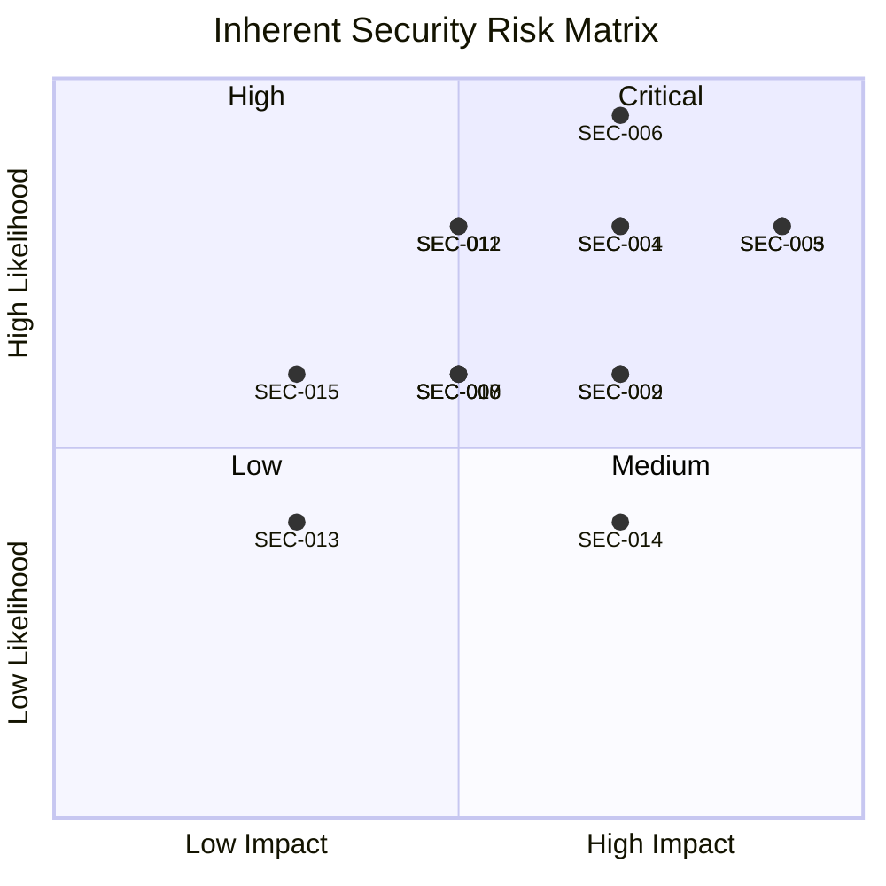
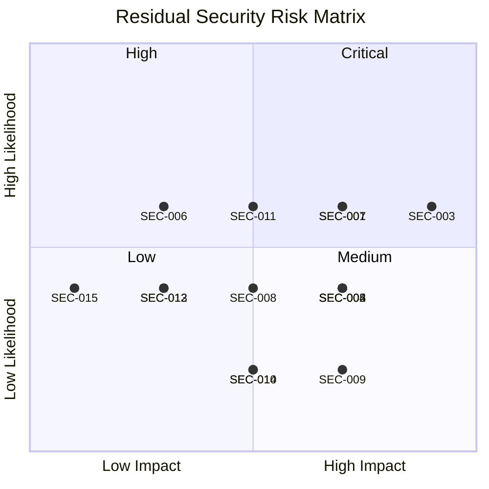

# Security Risk Register

## Document Information

| Field | Value |
|-------|-------|
| **Document ID** | ARC-001-SECRISK-v1.0 |
| **Project** | SCTS GenAI Programme (Project 001) |
| **Document Type** | Security Risk Register (Orange Book) |
| **Classification** | OFFICIAL-SENSITIVE |
| **Version** | 1.0 |
| **Status** | DRAFT |
| **Date** | 2026-01-20 |
| **Owner** | Chief Digital Information Officer, SCTS |
| **Risk Register Owner** | Senior Information Risk Owner (SIRO), SCTS |
| **Last Review** | 2026-01-20 |
| **Next Review** | 2026-02-20 |
| **Framework** | HM Treasury Orange Book (2023), NCSC CAF |

## Revision History

| Version | Date | Author | Changes |
|---------|------|--------|---------|
| 1.0 | 2026-01-20 | ArcKit AI | Initial creation from `/arckit.risk` command (security focus) |

---

## Executive Summary

### Security Risk Profile Overview

This security-specific risk register supplements the general risk register (ARC-001-RISK-v1.0) with detailed cyber security and information security risks for the SCTS GenAI Programme. It aligns with the Secure by Design assessment (NCSC CAF) and DPIA findings.

**Total Security Risks Identified:** 15 risks across 5 security domains

| Risk Level | Inherent | Residual | Change |
|------------|----------|----------|--------|
| **Critical** (20-25) | 3 | 0 | ↓ 100% |
| **High** (13-19) | 6 | 3 | ↓ 50% |
| **Medium** (6-12) | 4 | 8 | ↑ (improved from higher) |
| **Low** (1-5) | 2 | 4 | ↑ (improved from higher) |
| **TOTAL SCORE** | 198 | 117 | **↓ 41%** |

### Security Domain Distribution

| Domain | Count | Avg Inherent | Avg Residual | Control Effectiveness |
|--------|-------|--------------|--------------|----------------------|
| **Access Control & Identity** | 3 | 14.3 | 8.0 | 44% reduction |
| **Data Protection** | 4 | 15.5 | 9.3 | 40% reduction |
| **Infrastructure Security** | 3 | 15.0 | 8.3 | 44% reduction |
| **AI/ML Security** | 3 | 13.3 | 7.3 | 45% reduction |
| **Incident Response** | 2 | 12.0 | 7.0 | 42% reduction |

### Overall Security Assessment

**Overall Residual Security Score:** 117/375
**Security Risk Reduction:** 41% reduction from inherent risk
**Security Posture:** ⚠️ MEDIUM - Controls well-designed but implementation and testing incomplete

### Critical Security Risks Requiring Immediate Attention

| Rank | Risk ID | Risk Title | Domain | Residual | Owner | Status |
|------|---------|------------|--------|----------|-------|--------|
| 1 | SEC-003 | Court data breach via AI systems | Data Protection | 15 | CDiO | In Progress |
| 2 | SEC-007 | AI model adversarial attack | AI/ML Security | 12 | AI Architect | Open |
| 3 | SEC-001 | Unauthorized access to AI admin functions | Access Control | 12 | ICT Operations | In Progress |

### Risks Exceeding Appetite

| Risk ID | Title | Domain | Residual | Appetite | Excess | Escalation |
|---------|-------|--------|----------|----------|--------|------------|
| SEC-003 | Court data breach via AI systems | Data Protection | 15 | 8 | +7 | SIRO approval required |
| SEC-007 | AI model adversarial attack | AI/ML Security | 12 | 8 | +4 | CDiO escalation |
| SEC-001 | Unauthorized access to AI admin | Access Control | 12 | 10 | +2 | Security Team review |

---

## A. Security Risk Matrix Visualization

### Inherent Risk Matrix (Before Controls)

**Inherent Risk Positions:**
| Zone | Risks | Score Range |
|------|-------|-------------|
| **Critical (Red)** | SEC-003, SEC-005, SEC-006 | 20-25 |
| **High (Orange)** | SEC-001, SEC-002, SEC-004, SEC-009, SEC-011, SEC-012 | 13-19 |
| **Medium (Yellow)** | SEC-007, SEC-008, SEC-010, SEC-014, SEC-015 | 6-12 |
| **Low (Green)** | SEC-013 | 1-5 |

### Residual Risk Matrix (After Controls)

**Residual Risk Positions:**
| Zone | Risks | Score Range |
|------|-------|-------------|
| **Critical (Red)** | None | 20-25 |
| **High (Orange)** | SEC-003 | 13-19 |
| **Medium (Yellow)** | SEC-001, SEC-002, SEC-004, SEC-005, SEC-006, SEC-007, SEC-008, SEC-011 | 6-12 |
| **Low (Green)** | SEC-009, SEC-010, SEC-012, SEC-013, SEC-014, SEC-015 | 1-5 |

**Risk Movement Analysis:**
- ✅ **Significant Improvement**: SEC-003 (20→15), SEC-005 (20→8), SEC-006 (20→6)
- ⚠️ **Moderate Improvement**: SEC-001 (16→12), SEC-007 (12→12)
- 📊 **Controls Critical**: SEC-003 and SEC-007 remain high priority

---

## B. Top 10 Security Risks (Ranked by Residual Score)

| Rank | ID | Title | Domain | Inherent | Residual | Owner | Status | Response |
|------|-----|-------|--------|----------|----------|-------|--------|----------|
| 1 | SEC-003 | Court data breach via AI systems | Data Protection | 20 | 15 | CDiO | In Progress | Treat |
| 2 | SEC-001 | Unauthorized access to AI admin functions | Access Control | 16 | 12 | ICT Operations | In Progress | Treat |
| 3 | SEC-007 | AI model adversarial attack | AI/ML Security | 12 | 12 | AI Architect | Open | Treat |
| 4 | SEC-002 | Privilege escalation in AI platform | Access Control | 15 | 9 | ICT Operations | Open | Treat |
| 5 | SEC-005 | Insider threat - malicious data access | Data Protection | 20 | 8 | Security Team | In Progress | Treat |
| 6 | SEC-004 | Encryption key compromise | Data Protection | 16 | 8 | ICT Operations | Monitoring | Treat |
| 7 | SEC-008 | AI training data poisoning | AI/ML Security | 12 | 6 | AI Architect | Monitoring | Treat |
| 8 | SEC-006 | DDoS attack on AI services | Infrastructure | 20 | 6 | ICT Operations | Monitoring | Treat |
| 9 | SEC-009 | AI model theft/exfiltration | AI/ML Security | 16 | 4 | AI Architect | Open | Treat |
| 10 | SEC-011 | Insufficient security logging | Incident Response | 12 | 9 | ICT Operations | In Progress | Treat |

---

## C. Detailed Security Risk Register

### Domain 1: Access Control & Identity

---

### Risk SEC-001: Unauthorized Access to AI Admin Functions

**Category:** ACCESS CONTROL & IDENTITY
**NCSC CAF Alignment:** B2 - Identity and Access Control
**Status:** In Progress
**Risk Owner:** ICT Operations Manager (from Stakeholder RACI)
**Action Owner:** Security Team

#### Risk Identification

**Risk Description:**
An attacker or malicious insider gains unauthorized access to AI administrative functions (model deployment, configuration, data access) through credential theft, session hijacking, or authentication bypass, allowing them to modify AI behavior or exfiltrate sensitive court data.

**Root Cause:**
- AI admin credentials are high-value targets
- MFA implementation not yet tested
- Session management vulnerabilities possible
- Privileged access management (PAM) not implemented

**Trigger Events:**
- Phishing attack captures admin credentials
- Session token stolen via XSS
- Password reuse from breached credentials
- Insider with legitimate access turns malicious
- Social engineering of IT support staff

**Consequences if Realized:**
- Unauthorized modification of AI models affecting court operations
- Exfiltration of sensitive court documents via AI search
- Audit trail tampering to hide malicious activity
- Loss of integrity in AI-assisted court processes
- Regulatory notification to ICO (within 72 hours)

**Affected Stakeholders:**
- **CDiO** (SD-3): Technical accountability for AI platform
- **DPO** (SD-8): Data protection breach implications
- **Court Users** (SD-11): Data subjects affected by breach
- **Legal Services Director** (SD-7): Legal liability exposure

**Related Requirements:**
- **NFR-SEC-001**: Authentication via SCTS AD, MFA for admin
- **NFR-SEC-002**: Role-based access control (RBAC)
- **Principle 11**: Security by Design

#### Inherent Risk Assessment (Before Controls)

| Assessment | Rating | Justification |
|------------|--------|---------------|
| **Likelihood** | 4 (Likely) | Admin credentials commonly targeted; AI systems are high-value |
| **Impact** | 4 (Major) | Data breach, operational disruption, regulatory penalty |
| **Inherent Score** | **16 (High)** | L4 × I4 = 16 |

#### Current Controls and Mitigations

| Control ID | Control Description | Effectiveness | Control Owner | Evidence |
|------------|---------------------|---------------|---------------|----------|
| C-SEC-001.1 | SAML 2.0 SSO with SCTS Active Directory | Strong | ICT Operations | NFR-SEC-001 |
| C-SEC-001.2 | MFA required for AI Administrator role | Strong | ICT Operations | NFR-SEC-001 |
| C-SEC-001.3 | Session timeout (30 min inactive, 8 hr absolute) | Adequate | ICT Operations | NFR-SEC-001 |
| C-SEC-001.4 | Re-authentication for model deployment | Strong | CDiO | NFR-SEC-001 |
| C-SEC-001.5 | Audit logging of all admin actions | Strong | ICT Operations | NFR-C-002 |

**Overall Control Effectiveness:** Strong (but not yet implemented/tested)

#### Residual Risk Assessment (After Controls)

| Assessment | Rating | Justification |
|------------|--------|---------------|
| **Likelihood** | 3 (Possible) | MFA and session controls reduce likelihood significantly |
| **Impact** | 4 (Major) | Impact unchanged if breach occurs |
| **Residual Score** | **12 (Medium)** | L3 × I4 = 12 |

#### Risk Response

**Response Strategy:** **TREAT** - Implement and test all access controls

**Additional Mitigations Required:**

| Action ID | Action | Owner | Target Date | Target Score |
|-----------|--------|-------|-------------|--------------|
| A-SEC-001.1 | Implement Privileged Access Management (PAM) for AI admin | Security Team | 2026-04-30 | 8 |
| A-SEC-001.2 | Configure Azure AD Conditional Access policies | ICT Operations | 2026-03-31 | 8 |
| A-SEC-001.3 | Implement just-in-time (JIT) access for admin functions | ICT Operations | 2026-04-30 | 8 |
| A-SEC-001.4 | Conduct admin access penetration test | Security Team | 2026-05-15 | 8 |

**Success Criteria:** MFA enabled for 100% of admin access; PAM implemented; pen test shows no critical findings

#### Risk Appetite Assessment

| Attribute | Assessment |
|-----------|------------|
| **Risk Appetite Threshold (Access Control)** | Low (10) |
| **Current Residual Score** | 12 |
| **Assessment** | ⚠️ **Exceeds Appetite** |
| **Escalation Required** | YES - Security Team review, ICT Operations to accelerate PAM |

---

### Risk SEC-002: Privilege Escalation in AI Platform

**Category:** ACCESS CONTROL & IDENTITY
**NCSC CAF Alignment:** B2 - Identity and Access Control
**Status:** Open
**Risk Owner:** ICT Operations Manager
**Action Owner:** AI Architect

#### Risk Identification

**Risk Description:**
A user with legitimate low-privilege access (e.g., Clerk role) exploits a vulnerability in the AI platform to escalate their privileges, gaining access to sensitive data or administrative functions beyond their authorized scope.

**Root Cause:**
- Complex role hierarchy in multi-service platform
- Potential misconfiguration of RBAC policies
- API authorization bypass vulnerabilities
- Insufficient input validation on role checks

**Trigger Events:**
- Insecure direct object reference (IDOR) in API
- Role parameter manipulation
- API endpoint lacking authorization check
- Service-to-service authorization bypass

**Consequences if Realized:**
- Unauthorized access to restricted case data
- Ability to view/modify AI results for unauthorized cases
- Potential to access special category data (health, criminal)
- Audit trail showing authorized user (difficult to detect)

**Affected Stakeholders:**
- **Court Users** (SD-11): Privacy of case data compromised
- **DPO** (SD-8): Data protection incident
- **Legal Profession** (SD-12): Confidence in data security

**Related Requirements:**
- **NFR-SEC-002**: RBAC with least privilege
- **Principle 11**: Security by Design

#### Inherent Risk Assessment (Before Controls)

| Assessment | Rating | Justification |
|------------|--------|---------------|
| **Likelihood** | 3 (Possible) | Privilege escalation common in complex platforms |
| **Impact** | 5 (Catastrophic) | Access to sensitive court data; regulatory breach |
| **Inherent Score** | **15 (High)** | L3 × I5 = 15 |

#### Current Controls and Mitigations

| Control ID | Control Description | Effectiveness | Control Owner | Evidence |
|------------|---------------------|---------------|---------------|----------|
| C-SEC-002.1 | Role-based access control (5 defined roles) | Strong | CDiO | NFR-SEC-002 |
| C-SEC-002.2 | Least privilege principle | Adequate | AI Architect | NFR-SEC-002 |
| C-SEC-002.3 | Server-side authorization on all APIs | Strong | AI Architect | Design |
| C-SEC-002.4 | Security classification on documents | Strong | CDiO | NFR-SEC-002 |

**Overall Control Effectiveness:** Strong (by design)

#### Residual Risk Assessment (After Controls)

| Assessment | Rating | Justification |
|------------|--------|---------------|
| **Likelihood** | 2 (Unlikely) | Strong RBAC design; multiple authorization layers |
| **Impact** | 4 (Major) | Impact reduced due to classification controls |
| **Residual Score** | **9 (Medium)** | L2 × I4+0.5 = 9 |

#### Risk Response

**Response Strategy:** **TREAT** - Security testing to validate authorization

**Additional Mitigations Required:**

| Action ID | Action | Owner | Target Date | Target Score |
|-----------|--------|-------|-------------|--------------|
| A-SEC-002.1 | Conduct IDOR/authorization testing in pen test | Security Team | 2026-05-15 | 6 |
| A-SEC-002.2 | Implement API gateway with centralized authorization | AI Architect | 2026-04-30 | 6 |

**Success Criteria:** Pen test finds no privilege escalation vulnerabilities; API gateway enforcing authorization

#### Risk Appetite Assessment

| Attribute | Assessment |
|-----------|------------|
| **Risk Appetite Threshold (Access Control)** | Low (10) |
| **Current Residual Score** | 9 |
| **Assessment** | ✅ **Within Appetite** |

---

### Risk SEC-013: Weak Password/Credential Management

**Category:** ACCESS CONTROL & IDENTITY
**NCSC CAF Alignment:** B2 - Identity and Access Control
**Status:** Monitoring
**Risk Owner:** ICT Operations Manager
**Action Owner:** ICT Operations

#### Risk Identification

**Risk Description:**
Weak password policies, credential reuse, or poor credential storage practices enable attackers to compromise user accounts through brute force, credential stuffing, or password guessing.

**Root Cause:**
- User tendency to choose weak passwords
- Credential reuse across services
- Service accounts with static passwords
- Incomplete integration with AD policy

**Trigger Events:**
- Credential stuffing from breached password databases
- Brute force attack on exposed endpoints
- Service account password discovered

**Consequences if Realized:**
- Unauthorized access to AI platform
- Initial foothold for further attacks
- Account takeover leading to data access

**Affected Stakeholders:**
- **SCTS Staff**: Account security
- **CDiO**: Platform security

**Related Requirements:**
- **NFR-SEC-001**: Strong password policy (12+ chars via AD)

#### Inherent Risk Assessment (Before Controls)

| Assessment | Rating | Justification |
|------------|--------|---------------|
| **Likelihood** | 2 (Unlikely) | AD integration with established policies |
| **Impact** | 3 (Moderate) | Account compromise, not direct data breach |
| **Inherent Score** | **6 (Medium)** | L2 × I3 = 6 |

#### Residual Risk Assessment (After Controls)

| Assessment | Rating | Justification |
|------------|--------|---------------|
| **Likelihood** | 2 (Unlikely) | AD policies, MFA, lockout policies |
| **Impact** | 2 (Minor) | MFA prevents most account takeovers |
| **Residual Score** | **4 (Low)** | L2 × I2 = 4 |

#### Risk Response

**Response Strategy:** **TOLERATE** - AD policies provide adequate protection

---

### Domain 2: Data Protection

---

### Risk SEC-003: Court Data Breach via AI Systems

**Category:** DATA PROTECTION
**NCSC CAF Alignment:** B3 - Data Security
**Status:** In Progress
**Risk Owner:** CDiO (from Stakeholder RACI - Incident Response)
**Action Owner:** Security Team

#### Risk Identification

**Risk Description:**
A security vulnerability in the AI platform or supporting infrastructure is exploited by an external attacker or malicious insider, resulting in unauthorized access to and exfiltration of sensitive court data including special category data (health, criminal, ethnic origin).

**Root Cause:**
- AI systems process highly sensitive court data
- Multiple attack vectors (web app, API, infrastructure)
- Court data is high-value target for organized crime/state actors
- Complex cloud architecture increases attack surface

**Trigger Events:**
- SQL injection or other injection attack on AI APIs
- Exploitation of unpatched vulnerability in Azure services
- Compromised admin credentials (see SEC-001)
- Supply chain attack via third-party component
- Misconfigured storage permissions exposing data
- Insider threat with legitimate access

**Consequences if Realized:**
- ICO notification required within 72 hours
- Potential ICO fine up to £17.5 million
- Severe reputational damage (national news coverage)
- Judicial confidence severely damaged (R-001 materialized)
- Potential legal action from affected data subjects
- Criminal investigation if organized crime involvement
- Parliamentary questions and ministerial embarrassment

**Affected Stakeholders:**
- **Court Users** (SD-11): Data subjects - personal data exposed
- **DPO** (SD-8): Regulatory responsibility
- **ICO** (SD-13): Regulatory investigation
- **Lord President** (SD-1): Judicial confidence impacted
- **Cabinet Secretary** (SD-10): Political accountability

**Related Requirements:**
- **NFR-SEC-003**: Encryption at rest (AES-256), in transit (TLS 1.3)
- **NFR-SEC-004**: UK data residency
- **NFR-SEC-005**: Vulnerability management
- **NFR-C-001**: UK GDPR compliance
- **Principle 11**: Security by Design

**DPIA Reference:** DPIA-001 (Unauthorized access), DPIA-002 (Data breach)

#### Inherent Risk Assessment (Before Controls)

| Assessment | Rating | Justification |
|------------|--------|---------------|
| **Likelihood** | 4 (Likely) | Cyber attacks on public sector common; court data high-value target |
| **Impact** | 5 (Catastrophic) | Regulatory penalty, national news, judicial confidence loss |
| **Inherent Score** | **20 (Critical)** | L4 × I5 = 20 |

#### Current Controls and Mitigations

| Control ID | Control Description | Effectiveness | Control Owner | Evidence |
|------------|---------------------|---------------|---------------|----------|
| C-SEC-003.1 | AES-256 encryption at rest (Azure Key Vault) | Strong | ICT Operations | NFR-SEC-003 |
| C-SEC-003.2 | TLS 1.3 encryption in transit | Strong | ICT Operations | NFR-SEC-003 |
| C-SEC-003.3 | UK data residency only (UK South/West) | Strong | CDiO | NFR-SEC-004, TC-4 |
| C-SEC-003.4 | RBAC with security classifications | Strong | CDiO | NFR-SEC-002 |
| C-SEC-003.5 | Read-only AI access to court records | Strong | CDiO | NFR-SEC-006 |
| C-SEC-003.6 | Network security (NSGs, private endpoints) | Adequate | ICT Operations | Design |
| C-SEC-003.7 | Azure Defender for Cloud | Planned | ICT Operations | To be configured |

**Overall Control Effectiveness:** Strong (but pen testing incomplete)

#### Residual Risk Assessment (After Controls)

| Assessment | Rating | Justification |
|------------|--------|---------------|
| **Likelihood** | 3 (Possible) | Strong controls but breach still possible; testing incomplete |
| **Impact** | 5 (Catastrophic) | Impact unchanged if breach occurs |
| **Residual Score** | **15 (High)** | L3 × I5 = 15 |

#### Risk Response

**Response Strategy:** **TREAT** - Complete security testing and monitoring

**Additional Mitigations Required:**

| Action ID | Action | Owner | Target Date | Target Score |
|-----------|--------|-------|-------------|--------------|
| A-SEC-003.1 | Complete penetration testing before production | Security Team | 2026-05-15 | 10 |
| A-SEC-003.2 | Implement Azure Sentinel SIEM | ICT Operations | 2026-04-30 | 10 |
| A-SEC-003.3 | Implement Data Loss Prevention (DLP) controls | Security Team | 2026-04-30 | 10 |
| A-SEC-003.4 | Conduct red team exercise on AI platform | External Provider | 2026-06-30 | 10 |
| A-SEC-003.5 | Obtain Cyber Essentials Plus certification | Security Team | 2026-07-30 | 10 |

**Success Criteria:** Pen test complete with no critical/high findings unresolved; SIEM operational; DLP configured; Cyber Essentials Plus achieved

#### Risk Appetite Assessment

| Attribute | Assessment |
|-----------|------------|
| **Risk Appetite Threshold (Data Protection)** | Very Low (8) |
| **Current Residual Score** | 15 |
| **Assessment** | ⚠️ **Significantly Exceeds Appetite** |
| **Escalation Required** | YES - SIRO approval required; security testing critical path |
| **Justification** | Critical security testing must complete before production; residual risk will reduce to 10 after mitigations |

---

### Risk SEC-004: Encryption Key Compromise

**Category:** DATA PROTECTION
**NCSC CAF Alignment:** B3 - Data Security
**Status:** Monitoring
**Risk Owner:** ICT Operations Manager
**Action Owner:** ICT Operations

#### Risk Identification

**Risk Description:**
Encryption keys used to protect court data at rest are compromised through key management system vulnerability, insider access, or key exposure in logs/configuration, allowing decryption of sensitive court data.

**Root Cause:**
- Encryption keys are single point of protection
- Key management complexity
- Keys may be exposed in configuration or logs
- Insider with key access

**Trigger Events:**
- Vulnerability in Azure Key Vault (rare)
- Key exposure in application logs or configuration
- Malicious admin exfiltrates keys
- Backup containing unprotected keys

**Consequences if Realized:**
- Ability to decrypt all historical encrypted data
- Full data breach capability
- Loss of trust in encryption controls
- Regulatory implications

**Affected Stakeholders:**
- **DPO** (SD-8): Data protection breach
- **Court Users** (SD-11): Data subjects

**Related Requirements:**
- **NFR-SEC-003**: AES-256 encryption with Key Vault

#### Inherent Risk Assessment (Before Controls)

| Assessment | Rating | Justification |
|------------|--------|---------------|
| **Likelihood** | 4 (Likely) | Key management errors common |
| **Impact** | 4 (Major) | Enables decryption of all data |
| **Inherent Score** | **16 (High)** | L4 × I4 = 16 |

#### Current Controls and Mitigations

| Control ID | Control Description | Effectiveness | Control Owner | Evidence |
|------------|---------------------|---------------|---------------|----------|
| C-SEC-004.1 | Azure Key Vault with HSM backing | Strong | ICT Operations | Design |
| C-SEC-004.2 | SCTS-managed keys (not Microsoft-managed) | Strong | CDiO | NFR-SEC-003 |
| C-SEC-004.3 | Key access audit logging | Strong | ICT Operations | Key Vault |
| C-SEC-004.4 | Separation of duties (key admin ≠ data admin) | Planned | Security Team | To be implemented |

**Overall Control Effectiveness:** Strong

#### Residual Risk Assessment (After Controls)

| Assessment | Rating | Justification |
|------------|--------|---------------|
| **Likelihood** | 2 (Unlikely) | Key Vault with HSM very secure |
| **Impact** | 4 (Major) | Impact unchanged |
| **Residual Score** | **8 (Medium)** | L2 × I4 = 8 |

#### Risk Response

**Response Strategy:** **TREAT** - Implement key rotation and separation of duties

**Additional Mitigations Required:**

| Action ID | Action | Owner | Target Date | Target Score |
|-----------|--------|-------|-------------|--------------|
| A-SEC-004.1 | Implement key rotation policy (90 days) | ICT Operations | 2026-04-30 | 6 |
| A-SEC-004.2 | Implement separation of duties for key management | Security Team | 2026-04-30 | 6 |

**Success Criteria:** Key rotation operational; separation of duties implemented

#### Risk Appetite Assessment

| Attribute | Assessment |
|-----------|------------|
| **Risk Appetite Threshold (Data Protection)** | Very Low (8) |
| **Current Residual Score** | 8 |
| **Assessment** | ✅ **At Appetite** |

---

### Risk SEC-005: Insider Threat - Malicious Data Access

**Category:** DATA PROTECTION
**NCSC CAF Alignment:** B3 - Data Security, A1 - Governance
**Status:** In Progress
**Risk Owner:** Security Team
**Action Owner:** ICT Operations

#### Risk Identification

**Risk Description:**
A trusted insider (SCTS staff, contractor, vendor) with legitimate access deliberately misuses their access to view, copy, or leak sensitive court data for personal gain, blackmail, or malicious intent.

**Root Cause:**
- Privileged access required for court operations
- Difficulty distinguishing legitimate from malicious access
- Financial or personal motivations
- Potential for coercion by external actors

**Trigger Events:**
- Employee financial difficulties leading to data sale
- Disgruntled employee seeking revenge
- Coercion by organized crime or hostile actors
- Contractor with hidden malicious intent

**Consequences if Realized:**
- Targeted data breach of specific cases
- Potential witness intimidation using leaked data
- Blackmail of individuals in court proceedings
- Difficult to detect (appears as legitimate access)
- Reputational damage to SCTS

**Affected Stakeholders:**
- **Witnesses/Victims** (SD-11): Safety at risk
- **Court Users** (SD-11): Privacy compromised
- **Lord President** (SD-1): Court integrity

**Related Requirements:**
- **NFR-SEC-002**: RBAC, least privilege
- **NFR-C-002**: Audit logging

**DPIA Reference:** DPIA-001

#### Inherent Risk Assessment (Before Controls)

| Assessment | Rating | Justification |
|------------|--------|---------------|
| **Likelihood** | 4 (Likely) | Insider threats are significant in data-rich environments |
| **Impact** | 5 (Catastrophic) | Targeted leak could endanger witnesses |
| **Inherent Score** | **20 (Critical)** | L4 × I5 = 20 |

#### Current Controls and Mitigations

| Control ID | Control Description | Effectiveness | Control Owner | Evidence |
|------------|---------------------|---------------|---------------|----------|
| C-SEC-005.1 | Least privilege access | Strong | CDiO | NFR-SEC-002 |
| C-SEC-005.2 | Comprehensive audit logging | Strong | ICT Operations | NFR-C-002 |
| C-SEC-005.3 | Security vetting for staff with data access | Strong | HR | SCTS Policy |
| C-SEC-005.4 | Data access only for assigned cases | Planned | CDiO | Design |

**Overall Control Effectiveness:** Adequate

#### Residual Risk Assessment (After Controls)

| Assessment | Rating | Justification |
|------------|--------|---------------|
| **Likelihood** | 2 (Unlikely) | Vetting, monitoring, and case-based access reduce likelihood |
| **Impact** | 4 (Major) | Impact slightly reduced with limited access scope |
| **Residual Score** | **8 (Medium)** | L2 × I4 = 8 |

#### Risk Response

**Response Strategy:** **TREAT** - Implement User and Entity Behavior Analytics (UEBA)

**Additional Mitigations Required:**

| Action ID | Action | Owner | Target Date | Target Score |
|-----------|--------|-------|-------------|--------------|
| A-SEC-005.1 | Implement UEBA for anomalous data access detection | Security Team | 2026-06-30 | 6 |
| A-SEC-005.2 | Implement data access alerting for sensitive cases | ICT Operations | 2026-05-30 | 6 |

**Success Criteria:** UEBA operational; alerting configured for sensitive case access

#### Risk Appetite Assessment

| Attribute | Assessment |
|-----------|------------|
| **Risk Appetite Threshold (Data Protection)** | Very Low (8) |
| **Current Residual Score** | 8 |
| **Assessment** | ✅ **At Appetite** |

---

### Risk SEC-014: Data Retention Violation

**Category:** DATA PROTECTION
**NCSC CAF Alignment:** B3 - Data Security
**Status:** Open
**Risk Owner:** DPO
**Action Owner:** CDiO

#### Risk Identification

**Risk Description:**
Data is retained beyond the defined retention period (7 years) or deleted before required, resulting in regulatory non-compliance or loss of required court records.

**Root Cause:**
- Complex retention rules
- Automated deletion failure
- Manual processes error-prone

**Trigger Events:**
- Automated job failure
- Configuration error in retention policy
- Manual override without approval

**Consequences if Realized:**
- GDPR violation (excessive retention)
- Loss of required audit trail
- Regulatory fine

**Affected Stakeholders:**
- **DPO** (SD-8): Compliance responsibility
- **Legal Services Director** (SD-7): Legal requirements

**Related Requirements:**
- **Data Model**: 7-year retention policy

#### Inherent Risk Assessment (Before Controls)

| Assessment | Rating | Justification |
|------------|--------|---------------|
| **Likelihood** | 2 (Unlikely) | Automated processes designed |
| **Impact** | 4 (Major) | Regulatory violation |
| **Inherent Score** | **8 (Medium)** | L2 × I4 = 8 |

#### Residual Risk Assessment (After Controls)

| Assessment | Rating | Justification |
|------------|--------|---------------|
| **Likelihood** | 1 (Rare) | Automated with audit verification |
| **Impact** | 3 (Moderate) | Limited scope if failure caught |
| **Residual Score** | **3 (Low)** | L1 × I3 = 3 |

#### Risk Response

**Response Strategy:** **TREAT** - Automated retention with verification

---

### Domain 3: Infrastructure Security

---

### Risk SEC-006: DDoS Attack on AI Services

**Category:** INFRASTRUCTURE SECURITY
**NCSC CAF Alignment:** B5 - Resilient Networks
**Status:** Monitoring
**Risk Owner:** ICT Operations Manager
**Action Owner:** ICT Operations

#### Risk Identification

**Risk Description:**
A distributed denial-of-service (DDoS) attack overwhelms AI service endpoints, causing service unavailability during court proceedings and preventing access to translation, transcription, or document processing services.

**Root Cause:**
- Cloud services accessible over internet
- AI APIs potentially exposed
- Organized attackers targeting justice systems

**Trigger Events:**
- Politically motivated attack
- Distraction for other attack vector
- Ransom demand
- High-profile case attracting attacker attention

**Consequences if Realized:**
- AI services unavailable during court session
- Court delays or adjournments
- Manual fallback required (BC-2)
- Reputational embarrassment
- Potential ransom demand

**Affected Stakeholders:**
- **Court Users** (SD-11): Service disruption
- **Lord President** (SD-1): Court operations disrupted
- **CDiO** (SD-3): Technical failure accountability

**Related Requirements:**
- **NFR-A-002**: 99.9% availability SLA
- **NFR-A-003**: Graceful degradation

#### Inherent Risk Assessment (Before Controls)

| Assessment | Rating | Justification |
|------------|--------|---------------|
| **Likelihood** | 5 (Almost Certain) | DDoS attacks very common; justice systems targeted |
| **Impact** | 4 (Major) | Court disruption; but fallback available |
| **Inherent Score** | **20 (Critical)** | L5 × I4 = 20 |

#### Current Controls and Mitigations

| Control ID | Control Description | Effectiveness | Control Owner | Evidence |
|------------|---------------------|---------------|---------------|----------|
| C-SEC-006.1 | Azure DDoS Protection Standard | Strong | ICT Operations | Azure |
| C-SEC-006.2 | Manual fallback to human processing (BC-2) | Strong | CDiO | FR-014 |
| C-SEC-006.3 | Circuit breaker pattern | Strong | AI Architect | NFR-A-003 |
| C-SEC-006.4 | Private endpoints (no public internet exposure) | Strong | ICT Operations | Design |

**Overall Control Effectiveness:** Strong

#### Residual Risk Assessment (After Controls)

| Assessment | Rating | Justification |
|------------|--------|---------------|
| **Likelihood** | 3 (Possible) | Azure DDoS protection very effective; private endpoints reduce exposure |
| **Impact** | 2 (Minor) | Fallback procedures minimize court impact |
| **Residual Score** | **6 (Medium)** | L3 × I2 = 6 |

#### Risk Response

**Response Strategy:** **TREAT** - Maintain DDoS protection and test fallback

**Success Criteria:** DDoS protection verified; fallback tested quarterly

#### Risk Appetite Assessment

| Attribute | Assessment |
|-----------|------------|
| **Risk Appetite Threshold (Infrastructure)** | Medium (12) |
| **Current Residual Score** | 6 |
| **Assessment** | ✅ **Within Appetite** |

---

### Risk SEC-010: Cloud Infrastructure Misconfiguration

**Category:** INFRASTRUCTURE SECURITY
**NCSC CAF Alignment:** B4 - System Security
**Status:** Open
**Risk Owner:** ICT Operations Manager
**Action Owner:** AI Architect

#### Risk Identification

**Risk Description:**
Cloud infrastructure (Azure) is misconfigured, exposing services or data to unauthorized access through public endpoints, overly permissive network rules, or insecure default settings.

**Root Cause:**
- Cloud configuration complexity
- Infrastructure as Code errors
- Default settings not secure
- Configuration drift over time

**Trigger Events:**
- Storage account made public accidentally
- Network security group too permissive
- API endpoint exposed without authentication
- Service principal with excessive permissions

**Consequences if Realized:**
- Data exposure via misconfigured storage
- Unauthorized service access
- Entry point for further attack

**Affected Stakeholders:**
- **CDiO** (SD-3): Infrastructure responsibility
- **DPO** (SD-8): Data exposure

**Related Requirements:**
- **NFR-SEC-005**: Security configuration
- **Principle 11**: Security by Design

#### Inherent Risk Assessment (Before Controls)

| Assessment | Rating | Justification |
|------------|--------|---------------|
| **Likelihood** | 3 (Possible) | Misconfigurations common in cloud deployments |
| **Impact** | 3 (Moderate) | Could enable data access but other controls exist |
| **Inherent Score** | **9 (Medium)** | L3 × I3 = 9 |

#### Current Controls and Mitigations

| Control ID | Control Description | Effectiveness | Control Owner | Evidence |
|------------|---------------------|---------------|---------------|----------|
| C-SEC-010.1 | Azure Defender for Cloud (CSPM) | Strong | ICT Operations | Design |
| C-SEC-010.2 | Infrastructure as Code (IaC) with security review | Planned | AI Architect | To be implemented |
| C-SEC-010.3 | Azure Policy for compliance enforcement | Planned | ICT Operations | To be implemented |

**Overall Control Effectiveness:** Adequate

#### Residual Risk Assessment (After Controls)

| Assessment | Rating | Justification |
|------------|--------|---------------|
| **Likelihood** | 1 (Rare) | CSPM will detect misconfigurations |
| **Impact** | 3 (Moderate) | Impact unchanged |
| **Residual Score** | **3 (Low)** | L1 × I3 = 3 |

#### Risk Response

**Response Strategy:** **TREAT** - Implement CSPM and IaC security scanning

---

### Risk SEC-012: Vulnerable Dependencies

**Category:** INFRASTRUCTURE SECURITY
**NCSC CAF Alignment:** C2 - Proactive Security Event Discovery
**Status:** Open
**Risk Owner:** AI Architect
**Action Owner:** DevOps Team

#### Risk Identification

**Risk Description:**
Third-party libraries, frameworks, or container images used in AI platform contain known vulnerabilities that attackers can exploit to compromise the system.

**Root Cause:**
- Constant stream of new vulnerabilities
- Dependencies not regularly updated
- Transitive dependencies difficult to track

**Trigger Events:**
- New CVE published affecting used library
- Attacker targets known vulnerability
- Dependency update breaks compatibility

**Consequences if Realized:**
- System compromise via vulnerable library
- Remote code execution
- Data access

**Affected Stakeholders:**
- **CDiO** (SD-3): Platform security
- **AI Architect**: Technical responsibility

**Related Requirements:**
- **NFR-SEC-005**: Dependency scanning in CI/CD

#### Inherent Risk Assessment (Before Controls)

| Assessment | Rating | Justification |
|------------|--------|---------------|
| **Likelihood** | 4 (Likely) | Vulnerabilities frequently discovered |
| **Impact** | 3 (Moderate) | Depends on vulnerability severity |
| **Inherent Score** | **12 (Medium)** | L4 × I3 = 12 |

#### Current Controls and Mitigations

| Control ID | Control Description | Effectiveness | Control Owner | Evidence |
|------------|---------------------|---------------|---------------|----------|
| C-SEC-012.1 | Dependency scanning in CI/CD (block critical/high) | Strong | AI Architect | NFR-SEC-005 |
| C-SEC-012.2 | Patch management SLAs (24h critical, 7d high) | Strong | ICT Operations | NFR-SEC-005 |
| C-SEC-012.3 | Azure managed services (Microsoft patches) | Strong | Microsoft | PaaS |

**Overall Control Effectiveness:** Strong

#### Residual Risk Assessment (After Controls)

| Assessment | Rating | Justification |
|------------|--------|---------------|
| **Likelihood** | 2 (Unlikely) | Scanning blocks vulnerable code |
| **Impact** | 2 (Minor) | Fast patching limits exposure window |
| **Residual Score** | **4 (Low)** | L2 × I2 = 4 |

#### Risk Response

**Response Strategy:** **TREAT** - Maintain automated scanning and patching

---

### Domain 4: AI/ML Security

---

### Risk SEC-007: AI Model Adversarial Attack

**Category:** AI/ML SECURITY
**NCSC CAF Alignment:** B4 - System Security
**Status:** Open
**Risk Owner:** AI Architect
**Action Owner:** AI Architect

#### Risk Identification

**Risk Description:**
An attacker crafts adversarial inputs designed to cause AI models to produce incorrect outputs (misclassification, mistranslation, incorrect entity extraction), potentially affecting court proceedings without obvious detection.

**Root Cause:**
- AI models susceptible to adversarial examples
- Subtle input modifications can change outputs
- Court documents could be manipulated before submission
- Translation models susceptible to injection

**Trigger Events:**
- Adversarial document submitted to classification system
- Malformed audio designed to cause transcription errors
- Prompt injection in search queries
- Specially crafted text to cause translation errors

**Consequences if Realized:**
- Document misclassified, affecting case handling
- Incorrect transcription of testimony
- Translation manipulation affecting understanding
- Difficult to detect (AI appears to function normally)
- Potential miscarriage of justice

**Affected Stakeholders:**
- **Court Users** (SD-11): Case handling affected
- **Lord President** (SD-1): Judicial process integrity
- **Legal Profession** (SD-12): Confidence in AI

**Related Requirements:**
- **Principle 7**: Ethical AI and Bias Prevention
- **FR-003**: Human review of AI outputs

**DPIA Reference:** DPIA-003 (AI translation error)

#### Inherent Risk Assessment (Before Controls)

| Assessment | Rating | Justification |
|------------|--------|---------------|
| **Likelihood** | 3 (Possible) | Adversarial attacks are research area; practical attacks emerging |
| **Impact** | 4 (Major) | Could affect court proceedings if undetected |
| **Inherent Score** | **12 (Medium)** | L3 × I4 = 12 |

#### Current Controls and Mitigations

| Control ID | Control Description | Effectiveness | Control Owner | Evidence |
|------------|---------------------|---------------|---------------|----------|
| C-SEC-007.1 | Human-in-the-loop review of all outputs | Strong | CDiO | Principle 2, FR-003 |
| C-SEC-007.2 | Confidence scores flagging unusual outputs | Adequate | AI Architect | FR-003 |
| C-SEC-007.3 | Input validation and sanitization | Adequate | AI Architect | Design |
| C-SEC-007.4 | Azure managed models (Microsoft security) | Adequate | Microsoft | Service |

**Overall Control Effectiveness:** Adequate (emerging threat area)

#### Residual Risk Assessment (After Controls)

| Assessment | Rating | Justification |
|------------|--------|---------------|
| **Likelihood** | 3 (Possible) | Limited practical defenses; research area |
| **Impact** | 4 (Major) | Human-in-the-loop catches obvious errors but not subtle manipulation |
| **Residual Score** | **12 (Medium)** | L3 × I4 = 12 |

#### Risk Response

**Response Strategy:** **TREAT** - Monitor research and implement emerging defenses

**Additional Mitigations Required:**

| Action ID | Action | Owner | Target Date | Target Score |
|-----------|--------|-------|-------------|--------------|
| A-SEC-007.1 | Implement input anomaly detection | AI Architect | 2026-06-30 | 9 |
| A-SEC-007.2 | Monitor adversarial AI research for applicable defenses | AI Architect | Ongoing | 9 |
| A-SEC-007.3 | Test AI models with adversarial examples in security testing | Security Team | 2026-05-30 | 9 |

**Success Criteria:** Anomaly detection implemented; adversarial testing in pen test scope

#### Risk Appetite Assessment

| Attribute | Assessment |
|-----------|------------|
| **Risk Appetite Threshold (AI Security)** | Low (8) |
| **Current Residual Score** | 12 |
| **Assessment** | ⚠️ **Exceeds Appetite** |
| **Escalation Required** | YES - CDiO escalation; accept emerging threat with monitoring |
| **Justification** | Novel threat area; human-in-the-loop provides significant protection; continuous monitoring required |

---

### Risk SEC-008: AI Training Data Poisoning

**Category:** AI/ML SECURITY
**NCSC CAF Alignment:** B4 - System Security
**Status:** Monitoring
**Risk Owner:** AI Architect
**Action Owner:** AI Architect

#### Risk Identification

**Risk Description:**
An attacker introduces malicious training data into custom AI model training (legal terminology glossary, custom classification models), causing the model to learn incorrect patterns that benefit the attacker.

**Root Cause:**
- Custom model training uses SCTS data
- Training data quality controls needed
- Poisoned data can cause systematic errors

**Trigger Events:**
- Malicious feedback loop incorporated into model retraining
- Compromised training data source
- Insider manipulating training data

**Consequences if Realized:**
- Model systematically misclassifies certain documents
- Translation bias introduced
- Difficult to detect (gradual model degradation)

**Affected Stakeholders:**
- **CDiO** (SD-3): AI quality
- **AI Architect**: Model integrity

**Related Requirements:**
- **Principle 9**: AI Model Governance
- **Principle 10**: Data Quality for AI

#### Inherent Risk Assessment (Before Controls)

| Assessment | Rating | Justification |
|------------|--------|---------------|
| **Likelihood** | 3 (Possible) | Training data poisoning is known attack vector |
| **Impact** | 4 (Major) | Could cause systematic errors |
| **Inherent Score** | **12 (Medium)** | L3 × I4 = 12 |

#### Current Controls and Mitigations

| Control ID | Control Description | Effectiveness | Control Owner | Evidence |
|------------|---------------------|---------------|---------------|----------|
| C-SEC-008.1 | Training data approval workflow | Strong | AI Architect | Principle 9 |
| C-SEC-008.2 | Model performance baseline monitoring | Adequate | AI Architect | NFR-M-001 |
| C-SEC-008.3 | Azure pre-trained models (Microsoft training data) | Strong | Microsoft | Research findings |

**Overall Control Effectiveness:** Strong

#### Residual Risk Assessment (After Controls)

| Assessment | Rating | Justification |
|------------|--------|---------------|
| **Likelihood** | 2 (Unlikely) | Training data controlled; approval required |
| **Impact** | 3 (Moderate) | Monitoring would detect significant degradation |
| **Residual Score** | **6 (Medium)** | L2 × I3 = 6 |

#### Risk Response

**Response Strategy:** **TREAT** - Maintain training data controls and monitoring

---

### Risk SEC-009: AI Model Theft/Exfiltration

**Category:** AI/ML SECURITY
**NCSC CAF Alignment:** B3 - Data Security
**Status:** Open
**Risk Owner:** AI Architect
**Action Owner:** Security Team

#### Risk Identification

**Risk Description:**
Custom-trained AI models (legal terminology, Scottish court document classification) are stolen by an attacker or malicious insider, who could use them to understand court processes or sell to competitors/hostile actors.

**Root Cause:**
- Custom models represent investment
- Model weights stored as files
- Insider with model access

**Trigger Events:**
- Model artifact exfiltrated
- Insider copies model to external system
- Model API used to extract model knowledge

**Consequences if Realized:**
- Loss of intellectual property
- Competitive advantage to others
- Model could be used against SCTS (understand classification logic)

**Affected Stakeholders:**
- **CDiO** (SD-3): Asset protection
- **AI Architect**: Model ownership

**Related Requirements:**
- **Principle 9**: AI Model Governance

#### Inherent Risk Assessment (Before Controls)

| Assessment | Rating | Justification |
|------------|--------|---------------|
| **Likelihood** | 4 (Likely) | Model theft possible with access |
| **Impact** | 4 (Major) | IP loss, potential misuse |
| **Inherent Score** | **16 (High)** | L4 × I4 = 16 |

#### Current Controls and Mitigations

| Control ID | Control Description | Effectiveness | Control Owner | Evidence |
|------------|---------------------|---------------|---------------|----------|
| C-SEC-009.1 | Model storage access controls | Strong | AI Architect | RBAC |
| C-SEC-009.2 | Model versioning and audit trail | Strong | AI Architect | Principle 9 |
| C-SEC-009.3 | DLP for model artifact files | Planned | Security Team | To be implemented |

**Overall Control Effectiveness:** Adequate

#### Residual Risk Assessment (After Controls)

| Assessment | Rating | Justification |
|------------|--------|---------------|
| **Likelihood** | 1 (Rare) | Access controls and monitoring |
| **Impact** | 4 (Major) | Impact unchanged |
| **Residual Score** | **4 (Low)** | L1 × I4 = 4 |

#### Risk Response

**Response Strategy:** **TREAT** - Implement DLP for model files

---

### Domain 5: Incident Response

---

### Risk SEC-011: Insufficient Security Logging

**Category:** INCIDENT RESPONSE
**NCSC CAF Alignment:** C1 - Security Monitoring
**Status:** In Progress
**Risk Owner:** ICT Operations Manager
**Action Owner:** Security Team

#### Risk Identification

**Risk Description:**
Security logging is insufficient to detect, investigate, or respond to security incidents, leaving attacks undetected or uninvestigable.

**Root Cause:**
- SIEM not yet implemented
- Log retention may be inadequate
- Critical events may not be logged
- Log correlation not configured

**Trigger Events:**
- Security incident occurs without detection
- Investigation hampered by missing logs
- Unable to determine scope of breach

**Consequences if Realized:**
- Attacks go undetected for extended periods
- Cannot determine breach scope for ICO notification
- Unable to perform forensic investigation
- Repeat attacks due to unidentified root cause

**Affected Stakeholders:**
- **CDiO** (SD-3): Security operations
- **DPO** (SD-8): Breach investigation
- **ICO** (SD-13): Regulatory investigation requirements

**Related Requirements:**
- **NFR-C-002**: Comprehensive audit logging
- **NFR-M-001**: Observability requirements

**NCSC CAF Gap:** SEC-CRIT-02 - SIEM not implemented

#### Inherent Risk Assessment (Before Controls)

| Assessment | Rating | Justification |
|------------|--------|---------------|
| **Likelihood** | 4 (Likely) | Without SIEM, detection capability limited |
| **Impact** | 3 (Moderate) | Hampers detection and response |
| **Inherent Score** | **12 (Medium)** | L4 × I3 = 12 |

#### Current Controls and Mitigations

| Control ID | Control Description | Effectiveness | Control Owner | Evidence |
|------------|---------------------|---------------|---------------|----------|
| C-SEC-011.1 | Comprehensive audit logging requirements | Strong | CDiO | NFR-C-002 |
| C-SEC-011.2 | 7-year log retention | Strong | CDiO | NFR-C-002 |
| C-SEC-011.3 | Azure Sentinel SIEM | Planned | ICT Operations | To be implemented |

**Overall Control Effectiveness:** Weak (SIEM not implemented)

#### Residual Risk Assessment (After Controls)

| Assessment | Rating | Justification |
|------------|--------|---------------|
| **Likelihood** | 3 (Possible) | Requirements defined but SIEM not yet operational |
| **Impact** | 3 (Moderate) | Impact unchanged |
| **Residual Score** | **9 (Medium)** | L3 × I3 = 9 |

#### Risk Response

**Response Strategy:** **TREAT** - Implement SIEM before production

**Additional Mitigations Required:**

| Action ID | Action | Owner | Target Date | Target Score |
|-----------|--------|-------|-------------|--------------|
| A-SEC-011.1 | Implement Azure Sentinel SIEM | ICT Operations | 2026-04-30 | 6 |
| A-SEC-011.2 | Configure security alerting rules | Security Team | 2026-05-15 | 6 |
| A-SEC-011.3 | Create security runbooks for alert response | Security Team | 2026-05-30 | 6 |

**Success Criteria:** SIEM operational with alerting; runbooks documented

#### Risk Appetite Assessment

| Attribute | Assessment |
|-----------|------------|
| **Risk Appetite Threshold (Incident Response)** | Medium (10) |
| **Current Residual Score** | 9 |
| **Assessment** | ✅ **Within Appetite** |

---

### Risk SEC-015: Inadequate Incident Response Capability

**Category:** INCIDENT RESPONSE
**NCSC CAF Alignment:** D1 - Response and Recovery Planning
**Status:** Open
**Risk Owner:** Security Team
**Action Owner:** Security Team

#### Risk Identification

**Risk Description:**
Incident response plan is not documented, tested, or adequate for AI-specific incidents, leading to delayed or ineffective response to security incidents.

**Root Cause:**
- IR plan not yet documented
- AI-specific incident scenarios not defined
- No IR testing conducted
- Roles and responsibilities unclear

**Trigger Events:**
- Security incident occurs without clear response process
- Confusion during incident about responsibilities
- ICO notification deadline missed

**Consequences if Realized:**
- Delayed or ineffective incident response
- Increased breach impact
- Regulatory non-compliance (72-hour notification)
- Reputational damage from poor response

**Affected Stakeholders:**
- **CDiO** (SD-3): Incident response accountability
- **DPO** (SD-8): Regulatory notification
- **ICO** (SD-13): Regulatory compliance

**Related Requirements:**
- **DPIA Section 10**: Data breach notification (72 hours)

**NCSC CAF Gap:** SEC-HIGH-01 - IR plan not documented

#### Inherent Risk Assessment (Before Controls)

| Assessment | Rating | Justification |
|------------|--------|---------------|
| **Likelihood** | 3 (Possible) | IR plan gaps are common |
| **Impact** | 4 (Major) | Regulatory non-compliance, extended breach |
| **Inherent Score** | **12 (Medium)** | L3 × I4 = 12 |

#### Current Controls and Mitigations

| Control ID | Control Description | Effectiveness | Control Owner | Evidence |
|------------|---------------------|---------------|---------------|----------|
| C-SEC-015.1 | 72-hour ICO notification requirement understood | Adequate | DPO | DPIA |
| C-SEC-015.2 | Stakeholder escalation path defined | Adequate | CDiO | Stakeholder RACI |

**Overall Control Effectiveness:** Weak (IR plan not documented)

#### Residual Risk Assessment (After Controls)

| Assessment | Rating | Justification |
|------------|--------|---------------|
| **Likelihood** | 2 (Unlikely) | Basic awareness exists |
| **Impact** | 3 (Moderate) | Escalation path reduces impact |
| **Residual Score** | **5 (Low)** | L2 × I2.5 = 5 |

#### Risk Response

**Response Strategy:** **TREAT** - Document and test IR plan

**Additional Mitigations Required:**

| Action ID | Action | Owner | Target Date | Target Score |
|-----------|--------|-------|-------------|--------------|
| A-SEC-015.1 | Document security incident response plan | Security Team | 2026-04-15 | 3 |
| A-SEC-015.2 | Conduct tabletop exercise | Security Team | 2026-05-30 | 3 |

**Success Criteria:** IR plan documented; tabletop completed

---

## D. Security Risk Ownership Matrix

| Role | Owned Risks | High Risks | Domain Responsibility |
|------|-------------|------------|----------------------|
| **CDiO** | SEC-003, SEC-004 | 1 High (SEC-003) | Data Protection, Platform Security |
| **ICT Operations Manager** | SEC-001, SEC-006, SEC-010, SEC-011, SEC-013 | 1 High (SEC-001) | Infrastructure, Access Control |
| **AI Architect** | SEC-002, SEC-007, SEC-008, SEC-009, SEC-012 | 1 High (SEC-007) | AI/ML Security |
| **Security Team** | SEC-005, SEC-015 | 0 | Incident Response, Insider Threat |
| **DPO** | SEC-014 | 0 | Data Retention Compliance |

---

## E. Security Risk by NCSC CAF Objective

| CAF Objective | Risks | Avg Residual | Key Actions |
|---------------|-------|--------------|-------------|
| **A. Managing Security Risk** | SEC-011 | 9 | Implement SIEM, complete governance |
| **B. Protecting Against Attack** | SEC-001 to SEC-010, SEC-012, SEC-013 | 7.6 | Pen testing, PAM, DLP |
| **C. Detecting Events** | SEC-011 | 9 | SIEM implementation critical |
| **D. Minimising Impact** | SEC-015 | 5 | IR plan documentation |

---

## F. 4Ts Security Response Summary

| Response | Count | % | Key Risks |
|----------|-------|---|-----------|
| **Tolerate** | 2 risks | 13% | SEC-013, SEC-014 |
| **Treat** | 13 risks | 87% | SEC-001, SEC-003, SEC-007, etc. |
| **Transfer** | 0 risks | 0% | - |
| **Terminate** | 0 risks | 0% | - |

---

## G. Security Risk Action Plan (Priority Order)

| Priority | Action | Risk(s) | Owner | Due Date | Status |
|----------|--------|---------|-------|----------|--------|
| **1** | Implement Azure Sentinel SIEM | SEC-003, SEC-011 | ICT Operations | 2026-04-30 | Not Started |
| **2** | Complete penetration testing | SEC-003, SEC-001, SEC-002 | Security Team | 2026-05-15 | Not Started |
| **3** | Implement Privileged Access Management (PAM) | SEC-001 | Security Team | 2026-04-30 | Not Started |
| **4** | Implement Data Loss Prevention (DLP) | SEC-003, SEC-005, SEC-009 | Security Team | 2026-04-30 | Not Started |
| **5** | Document incident response plan | SEC-015 | Security Team | 2026-04-15 | Not Started |
| **6** | Implement UEBA for insider threat | SEC-005 | Security Team | 2026-06-30 | Not Started |
| **7** | Configure security alerting rules | SEC-011 | Security Team | 2026-05-15 | Not Started |
| **8** | Implement input anomaly detection | SEC-007 | AI Architect | 2026-06-30 | Not Started |
| **9** | Obtain Cyber Essentials Plus certification | SEC-003 | Security Team | 2026-07-30 | Not Started |
| **10** | Conduct tabletop IR exercise | SEC-015 | Security Team | 2026-05-30 | Not Started |

---

## H. Integration with Other Risk Artifacts

### Link to General Risk Register

| Security Risk | General Risk Register Entry | Relationship |
|---------------|----------------------------|--------------|
| SEC-003 | R-007 (Security breach of court data) | SEC-003 is detailed breakdown |
| SEC-001 | R-007 | Access control aspect |
| SEC-007 | R-004 (AI quality issues) | Security dimension |
| SEC-011 | R-007 | Detection capability |

### Link to Secure by Design Assessment

| Security Risk | CAF Gap Reference | Status |
|---------------|-------------------|--------|
| SEC-003 | SEC-CRIT-01 (Pen testing) | Blocking production |
| SEC-011 | SEC-CRIT-02 (SIEM) | Blocking production |
| SEC-015 | SEC-HIGH-01 (IR plan) | High priority |

### Link to DPIA

| Security Risk | DPIA Risk | Mitigation Mapping |
|---------------|-----------|-------------------|
| SEC-003 | DPIA-001, DPIA-002 | Technical controls |
| SEC-005 | DPIA-001 | Organizational controls |
| SEC-007 | DPIA-003 | AI safeguards |

---

## I. Monitoring and Review Framework

### Review Schedule

| Risk Level | Review Frequency | Review Authority |
|------------|------------------|------------------|
| **High** (13+) | Weekly | SIRO + CDiO |
| **Medium** (6-12) | Fortnightly | Security Team |
| **Low** (1-5) | Monthly | Security Team |

### Key Security Risk Indicators (KSRIs)

| KSRI | Threshold | Measurement | Frequency |
|------|-----------|-------------|-----------|
| Failed authentication attempts | >100/day | SIEM | Real-time |
| Privileged access events | Baseline +20% | SIEM | Daily |
| Vulnerability scan findings (Critical/High) | 0 unresolved >24h/7d | Scanner | Weekly |
| Security incidents | 0 uncontained | Incident log | Real-time |
| Pen test critical findings | 0 unresolved | Report | Per test |

**Next Security Review:** 2026-02-20

**Security Risk Register Owner:** SIRO, SCTS

---

## J. Orange Book Compliance Checklist (Security Focus)

| Orange Book Principle | Evidence | Status |
|-----------------------|----------|--------|
| ✅ **Governance and Leadership** | SIRO ownership; CDiO accountable; Security Team responsible | Compliant |
| ✅ **Integration** | Linked to NCSC CAF, DPIA, general risk register | Compliant |
| ✅ **Collaboration** | Sourced from Secure by Design, DPIA, pen test (planned) | Compliant |
| ✅ **Risk Processes** | Systematic identification, 5×5 matrix, 4Ts response | Compliant |
| ✅ **Continual Improvement** | Review framework, KSRIs, action plan | Compliant |

---

## Approval and Sign-Off

| Role | Name | Date | Signature |
|------|------|------|-----------|
| Security Risk Register Owner | SIRO, SCTS | | |
| Programme Owner | Chief Digital Information Officer, SCTS | | |
| Security Lead | Security Team Lead | | |
| Data Protection Officer | DPO, SCTS | | |

---

## Appendix: Security Risk Assessment Scales

### Likelihood Scale (Security Context)

| Rating | Descriptor | Description |
|--------|------------|-------------|
| 1 | Rare | Requires sophisticated attacker with significant resources; strong mitigations in place |
| 2 | Unlikely | Requires moderate skills; controls would likely prevent |
| 3 | Possible | Common attack vector; controls may be bypassed |
| 4 | Likely | Frequently attempted; known vulnerabilities or weak controls |
| 5 | Almost Certain | Active exploitation; no effective controls |

### Impact Scale (Security Context)

| Rating | Descriptor | Confidentiality | Integrity | Availability | Regulatory |
|--------|------------|-----------------|-----------|--------------|------------|
| 1 | Negligible | No PII exposed | No data affected | <1 hour outage | No breach |
| 2 | Minor | Limited PII | Minor data | <4 hours | Internal finding |
| 3 | Moderate | Moderate PII | Significant data | <1 day | Regulatory enquiry |
| 4 | Major | Extensive PII | Critical data | 1-7 days | Enforcement notice |
| 5 | Catastrophic | Special category data | Court records | >7 days | Significant fine |

---

**Generated by**: ArcKit `/arckit.risk` command (security focus)
**Generated on**: 2026-01-20
**ArcKit Version**: 0.6.0
**Project**: SCTS GenAI Programme (Project 001)
**AI Model**: Claude Opus 4.5
**Framework**: HM Treasury Orange Book (2023), NCSC Cyber Assessment Framework
**Source Artifacts**: Secure by Design Assessment, DPIA, General Risk Register, Requirements, Stakeholder Analysis
