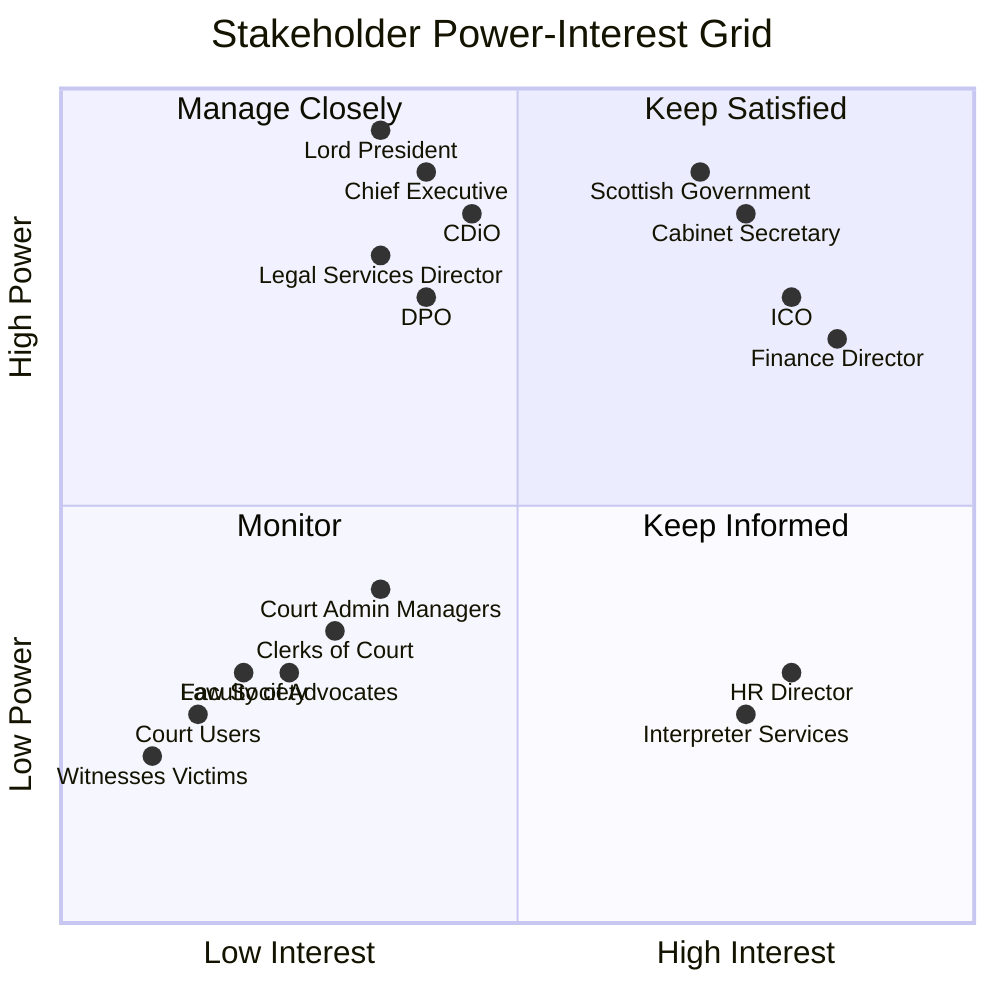

# Stakeholder Drivers & Goals Analysis: SCTS GenAI Programme

> **Template Status**: Live | **Version**: 0.11.2 | **Command**: `/arckit.stakeholders`

## Document Control

| Field | Value |
|-------|-------|
| **Document ID** | ARC-001-STKE-v1.1 |
| **Document Type** | Stakeholder Drivers & Goals Analysis |
| **Project** | SCTS GenAI Programme (Project 001) |
| **Classification** | OFFICIAL |
| **Status** | DRAFT |
| **Version** | 1.1 |
| **Created Date** | 2026-01-17 |
| **Last Modified** | 2026-01-26 |
| **Review Cycle** | Quarterly |
| **Next Review Date** | 2026-04-26 |
| **Owner** | Chief Digital Information Officer, SCTS |
| **Reviewed By** | PENDING |
| **Approved By** | PENDING |
| **Distribution** | SCTS Executive Team, Programme Steering Committee |

## Revision History

| Version | Date | Author | Changes | Approved By | Approval Date |
|---------|------|--------|---------|-------------|---------------|
| 1.0 | 2026-01-17 | ArcKit AI | Initial creation from `/arckit.stakeholders` command | PENDING | PENDING |
| 1.1 | 2026-01-26 | ArcKit AI | Updated to align with template v0.11.2 format | PENDING | PENDING |

---

## Executive Summary

### Purpose
This document identifies key stakeholders for the SCTS GenAI Programme, their underlying drivers (motivations, concerns, needs), how these drivers manifest into goals, and the measurable outcomes that will satisfy those goals. This analysis ensures stakeholder alignment and provides traceability from individual concerns to project success metrics.

### Key Findings
The SCTS GenAI Programme has strong alignment around improving access to justice and operational efficiency, with shared commitment to ethical AI deployment. The primary tension exists between the pace of innovation desired by digital leadership and the caution required by legal/governance stakeholders. The judiciary's independence creates a unique dynamic where AI must demonstrably support—never replace—judicial decision-making. Public trust and transparency are critical success factors given the sensitivity of court proceedings.

### Critical Success Factors
- **CSF-1**: Demonstrable improvement in access to justice for court users and the public
- **CSF-2**: Zero compromise of court record integrity or judicial independence
- **CSF-3**: Measurable efficiency gains that reduce case backlogs and processing times
- **CSF-4**: Full compliance with Scottish Government and UK data protection standards
- **CSF-5**: Staff adoption and confidence in AI-assisted workflows

### Stakeholder Alignment Score
**Overall Alignment**: MEDIUM-HIGH

Strong alignment on justice mission and ethical AI principles. Moderate tension between speed of delivery and governance requirements. Key conflict between innovation ambition (CDi) and risk aversion (judiciary, legal). Resolution requires phased approach with early wins on low-risk use cases.

---

## Stakeholder Identification

### Internal Stakeholders

| Stakeholder | Role/Department | Influence | Interest | Engagement Strategy |
|-------------|----------------|-----------|----------|---------------------|
| Lord President | Head of Judiciary | HIGH | HIGH | Formal briefings, judicial confidence |
| Chief Executive | SCTS Leadership | HIGH | HIGH | Sponsor engagement, strategic alignment |
| Chief Digital Information Officer (CDiO) | CDi Function | HIGH | HIGH | Day-to-day leadership, architecture decisions |
| Senior AI Technical Architect | CDi Function | MEDIUM | HIGH | Technical design, PoC delivery |
| Court Administration Managers | Court Operations | MEDIUM | HIGH | Requirements input, pilot participation |
| Clerks of Court | Court Operations | LOW | HIGH | User testing, workflow validation |
| Legal Services Director | Corporate Services | HIGH | MEDIUM | Compliance review, legal risk assessment |
| Data Protection Officer | Corporate Services | HIGH | MEDIUM | DPIA, privacy compliance |
| Finance Director | Corporate Services | MEDIUM | MEDIUM | Budget approval, ROI validation |
| ICT Operations Manager | CDi Function | MEDIUM | HIGH | Infrastructure, support, operations |
| HR Director | Corporate Services | LOW | MEDIUM | Staff training, change management |

### External Stakeholders

| Stakeholder | Organization | Relationship | Influence | Interest |
|-------------|--------------|--------------|-----------|----------|
| Scottish Government Digital Directorate | Scottish Government | Policy Oversight | HIGH | MEDIUM |
| Cabinet Secretary for Justice | Scottish Government | Ministerial Accountability | HIGH | HIGH |
| Information Commissioner's Office (ICO) | UK Regulator | Data Protection Oversight | HIGH | MEDIUM |
| Faculty of Advocates | Legal Profession | Key User Group | MEDIUM | HIGH |
| Law Society of Scotland | Legal Profession | Key User Group | MEDIUM | HIGH |
| Court Users / Litigants | Public | Service Beneficiaries | LOW | HIGH |
| Witnesses / Victims | Public | Vulnerable Users | LOW | HIGH |
| Interpreter Services Providers | Vendors | Service Partners | LOW | HIGH |
| Cloud Platform Providers | Vendors | Technology Partners | MEDIUM | HIGH |

### Stakeholder Power-Interest Grid

**Quadrant Summary:**
| Quadrant | Strategy | Stakeholders |
|----------|----------|--------------|
| **Manage Closely** | High engagement, regular updates | Lord President, Chief Executive, CDiO, Legal Services Director, DPO |
| **Keep Satisfied** | Address concerns promptly | Scottish Government, Cabinet Secretary, ICO, Finance Director |
| **Keep Informed** | Regular communications | Court Admin Managers, Clerks, Faculty of Advocates, Law Society, Court Users, Witnesses |
| **Monitor** | Minimal effort | Interpreter Services, HR Director |

---

## Stakeholder Drivers Analysis

### SD-1: Lord President - Judicial Independence and Confidence

**Stakeholder**: Lord President (Head of the Scottish Judiciary)

**Driver Category**: STRATEGIC / RISK

**Driver Statement**: Ensure that AI enhances judicial efficiency without compromising the independence, dignity, or authority of the courts. AI must support judges, not replace or undermine judicial decision-making.

**Context & Background**:
The judiciary is constitutionally independent. Any perception that AI influences case outcomes or judicial decisions would undermine public confidence in justice. The Lord President is accountable to Parliament for the administration of justice but must protect judicial independence from executive interference.

**Driver Intensity**: CRITICAL

**Enablers**:
- AI focused on administrative tasks, not judicial decisions
- Clear messaging that AI supports, never replaces, judicial functions
- Early judicial involvement in use case selection and design
- Demonstrable success in other jurisdictions with similar safeguards

**Blockers**:
- Any AI application perceived as influencing case outcomes
- Poor accuracy leading to errors in court documentation
- Lack of transparency about how AI is used
- Pressure to use AI for tasks requiring judicial discretion

**Related Stakeholders**:
- Chief Executive (aligned - operational efficiency)
- Faculty of Advocates (aligned - concerned about AI in legal proceedings)
- Cabinet Secretary (potential tension - may want faster delivery)

---

### SD-2: Chief Executive - Operational Efficiency and Modernisation

**Stakeholder**: Chief Executive, SCTS

**Driver Category**: STRATEGIC / OPERATIONAL

**Driver Statement**: Modernise SCTS operations through AI to reduce backlogs, improve service quality, and demonstrate value for public money. Deliver on Scottish Government digital strategy commitments while managing risk.

**Context & Background**:
SCTS faces pressure to reduce case backlogs, improve user experience (particularly for Civil Online and digital services), and demonstrate efficiency gains. The Chief Executive is accountable to Scottish Government for organisational performance and must balance innovation with the conservative culture of the justice sector.

**Driver Intensity**: HIGH

**Enablers**:
- Successful PoC demonstrating tangible benefits
- Staff buy-in and engagement with change
- Sufficient budget and skilled resources
- Clear governance and risk management framework

**Blockers**:
- Budget constraints limiting investment
- Staff resistance to new technology
- Reputational damage from AI failures
- Scottish Government policy changes affecting digital investment

**Related Stakeholders**:
- CDiO (aligned - delivery responsibility)
- Lord President (need to maintain confidence)
- Finance Director (budget dependency)
- Scottish Government (accountability)

---

### SD-3: Chief Digital Information Officer - Innovation Leadership

**Stakeholder**: Chief Digital Information Officer (CDiO)

**Driver Category**: STRATEGIC / PERSONAL

**Driver Statement**: Establish SCTS as a leader in responsible public sector AI adoption, building a sustainable AI capability that attracts talent and delivers measurable improvements in court services.

**Context & Background**:
The CDi function is embarking on a pioneering AI programme. Success would establish SCTS as a reference case for AI in justice systems and enhance the CDiO's reputation for innovation. Failure could set back digital transformation and affect career trajectory.

**Driver Intensity**: HIGH

**Enablers**:
- Hiring the Senior AI Technical Architect with right skills
- Executive support and clear mandate
- Realistic timelines and incremental delivery approach
- External recognition and knowledge sharing opportunities

**Blockers**:
- Inability to attract skilled AI talent
- Excessive governance slowing delivery
- Technical failures in early PoCs
- Lack of executive sponsorship or changing priorities

**Related Stakeholders**:
- Senior AI Technical Architect (critical resource)
- Chief Executive (sponsorship)
- Legal Services Director (potential blocker on pace)

---

### SD-4: Senior AI Technical Architect - Technical Excellence and Impact

**Stakeholder**: Senior AI Technical Architect (to be hired)

**Driver Category**: PERSONAL / STRATEGIC

**Driver Statement**: Design and deliver AI solutions that demonstrate real-world impact in a justice context, building a portfolio of successful implementations while establishing architectural foundations for future AI capabilities.

**Context & Background**:
This is a new role with significant autonomy and visibility. The architect will be hands-on in PoC delivery while also responsible for enterprise-wide AI strategy. Success creates career opportunities; the role offers rare chance to shape AI in justice.

**Driver Intensity**: HIGH

**Enablers**:
- Clear scope and decision authority
- Access to modern tools and cloud infrastructure
- Supportive team and cross-functional collaboration
- Visible success with early PoC projects

**Blockers**:
- Unclear requirements or scope creep
- Legacy system constraints limiting innovation
- Bureaucratic procurement slowing technology access
- Isolation from business stakeholders

**Related Stakeholders**:
- CDiO (line manager, sponsor)
- ICT Operations (integration dependency)
- Court Admin Managers (requirements source)

---

### SD-5: Court Administration Managers - Workload Reduction

**Stakeholder**: Court Administration Managers

**Driver Category**: OPERATIONAL / PERSONAL

**Driver Statement**: Reduce administrative burden on court staff through automation of repetitive document processing tasks, enabling staff to focus on higher-value work and reducing overtime.

**Context & Background**:
Court administration teams process thousands of documents daily across civil, criminal, and tribunal matters. Manual document handling creates backlogs, errors, and staff fatigue. Managers are under pressure to deliver more with limited headcount.

**Driver Intensity**: HIGH

**Enablers**:
- AI tools that genuinely save time (not add complexity)
- Gradual rollout with time to learn new processes
- Maintained staffing during transition (no immediate job losses)
- Input into tool design and workflow changes

**Blockers**:
- AI tools that add work or require excessive oversight
- Fear of job losses leading to staff resistance
- Poor training or inadequate support
- Systems that don't integrate with existing case management

**Related Stakeholders**:
- Clerks of Court (direct reports, users)
- CDiO (delivery responsibility)
- HR Director (workforce implications)

---

### SD-6: Clerks of Court - Reliable Tools and Job Security

**Stakeholder**: Clerks of Court

**Driver Category**: PERSONAL / OPERATIONAL

**Driver Statement**: Have access to reliable, easy-to-use tools that reduce tedious work without threatening job security. Understand how AI works well enough to trust its outputs and catch errors.

**Context & Background**:
Clerks are the primary users of court systems, handling document registration, case scheduling, and public enquiries. They are experts in court procedures but may have varying digital skills. AI implementation affects their daily work directly.

**Driver Intensity**: MEDIUM

**Enablers**:
- Intuitive user interfaces with minimal training required
- AI that handles routine tasks while preserving meaningful work
- Clear communication about job security and role evolution
- Involvement in testing and feedback opportunities

**Blockers**:
- Complex tools that add rather than reduce workload
- Insufficient training or support
- Fear that AI will replace their jobs
- Errors that they are blamed for but couldn't prevent

**Related Stakeholders**:
- Court Admin Managers (supervisors)
- HR Director (job security concerns)
- CDiO (system design)

---

### SD-7: Legal Services Director - Legal Risk and Compliance

**Stakeholder**: Legal Services Director

**Driver Category**: COMPLIANCE / RISK

**Driver Statement**: Ensure all AI implementations comply with legal requirements, particularly around data protection, court record integrity, and public sector duties. Protect SCTS from legal liability arising from AI errors.

**Context & Background**:
AI in a justice context creates novel legal questions around liability for AI errors, data protection compliance, and the legal status of AI-processed documents. The Legal Services Director must ensure SCTS can defend its AI practices if challenged.

**Driver Intensity**: HIGH

**Enablers**:
- Clear legal framework and guidance for AI in justice
- Robust governance and documentation
- Conservative deployment with proven technologies
- Ability to demonstrate human accountability for decisions

**Blockers**:
- Unclear legal position on AI-processed documents
- Inadequate audit trails or documentation
- Rushing deployment without proper legal review
- Third-party AI services with unclear liability

**Related Stakeholders**:
- DPO (data protection alignment)
- Chief Executive (risk appetite)
- CDiO (may push for faster pace)

---

### SD-8: Data Protection Officer - Privacy Compliance

**Stakeholder**: Data Protection Officer (DPO)

**Driver Category**: COMPLIANCE

**Driver Statement**: Ensure all AI processing of personal data has lawful basis, is documented in DPIAs, and respects data subject rights. Maintain ICO compliance and avoid enforcement action.

**Context & Background**:
AI systems processing court documents handle sensitive personal data including criminal records, family matters, and vulnerable witness information. The DPO must ensure compliance with UK GDPR and Data Protection Act 2018.

**Driver Intensity**: CRITICAL

**Enablers**:
- Early DPO involvement in AI design
- Comprehensive DPIAs for each AI capability
- Clear data flows and processing purposes documented
- UK-only data residency for court data

**Blockers**:
- AI services that transfer data outside UK
- Unclear purposes or excessive data collection
- Inadequate subject access request processes
- Use of AI outputs for purposes not covered by original lawful basis

**Related Stakeholders**:
- Legal Services Director (legal compliance)
- ICO (regulatory oversight)
- CDiO (design decisions)

---

### SD-9: Finance Director - Value for Money

**Stakeholder**: Finance Director

**Driver Category**: FINANCIAL

**Driver Statement**: Ensure AI investment delivers demonstrable return on investment and operates within approved budget. Track costs transparently and identify efficiency savings.

**Context & Background**:
Public sector finance requires demonstrable value for money and compliance with Scottish Government spending controls. AI investment must compete with other priorities and show quantifiable benefits.

**Driver Intensity**: MEDIUM

**Enablers**:
- Clear business case with quantified benefits
- Predictable, controllable costs
- Early efficiency gains to demonstrate ROI
- Cost transparency and regular reporting

**Blockers**:
- Uncontrolled cloud costs
- Hidden or unexpected expenses
- Benefits that are hard to measure
- Scope creep increasing costs without proportionate benefit

**Related Stakeholders**:
- Chief Executive (budget holder)
- CDiO (delivery accountability)
- Scottish Government (spending scrutiny)

---

### SD-10: Cabinet Secretary for Justice - Political Accountability

**Stakeholder**: Cabinet Secretary for Justice (Scottish Government Minister)

**Driver Category**: POLITICAL / STRATEGIC

**Driver Statement**: Demonstrate responsible AI leadership in Scottish public services while ensuring SCTS delivers on manifesto commitments for justice modernisation. Avoid negative media coverage or parliamentary questions about AI failures.

**Context & Background**:
Ministers are accountable to Parliament for public body performance. AI failures in a justice context would be highly newsworthy and politically damaging. Conversely, successful AI deployment aligns with Scottish Government digital strategy and innovation agenda.

**Driver Intensity**: HIGH

**Enablers**:
- Positive stories about AI improving access to justice
- Conservative, risk-managed deployment approach
- Clear messaging about ethical AI safeguards
- Alignment with Scottish Government AI Strategy

**Blockers**:
- AI errors affecting court outcomes or individual rights
- Negative media coverage or FOI embarrassments
- Perception of AI replacing human judgement in courts
- Comparison with AI failures elsewhere in public sector

**Related Stakeholders**:
- Chief Executive (accountable body)
- Scottish Government Digital Directorate (policy alignment)
- Lord President (judicial independence)

---

### SD-11: Court Users and Litigants - Access to Justice

**Stakeholder**: Court Users (litigants, parties to cases, legal representatives)

**Driver Category**: CUSTOMER

**Driver Statement**: Access court services efficiently, understand case progress, and receive fair treatment regardless of technical capability or language. AI should make court services easier to use, not create new barriers.

**Context & Background**:
Court users include vulnerable individuals navigating family courts, unrepresented litigants, victims, and sophisticated commercial parties. Digital transformation must improve access without excluding those who cannot use digital services.

**Driver Intensity**: HIGH

**Enablers**:
- Faster document processing reducing case delays
- Multilingual translation improving access for non-English speakers
- Cognitive search helping users find relevant information
- Maintained non-digital alternatives for those who need them

**Blockers**:
- AI errors affecting case handling
- Digital-only services excluding vulnerable users
- Lack of transparency about AI involvement in their case
- Reduced human contact when needed

**Related Stakeholders**:
- Clerks of Court (service delivery)
- Faculty of Advocates (professional representatives)
- Witnesses/Victims (vulnerable subset)

---

### SD-12: Faculty of Advocates and Law Society - Professional Practice

**Stakeholder**: Faculty of Advocates / Law Society of Scotland

**Driver Category**: CUSTOMER / COMPLIANCE

**Driver Statement**: Ensure AI tools support legal practice without undermining professional standards, creating new liabilities, or disadvantaging practitioners who don't use AI. Court AI should be transparent and auditable.

**Context & Background**:
Legal professionals have professional duties around accuracy, confidentiality, and client service. They need to understand how AI is used in court processes to advise clients properly and maintain professional indemnity cover.

**Driver Intensity**: MEDIUM

**Enablers**:
- Clear guidance on AI use in court processes
- Transparency about AI involvement in document handling
- Consultation on changes affecting legal practice
- AI tools that enhance rather than complicate practice

**Blockers**:
- AI systems that create new professional liabilities
- Lack of transparency about how AI processes their submissions
- Changes made without professional consultation
- Pressure to use AI in ways that conflict with professional duties

**Related Stakeholders**:
- Lord President (judicial leadership)
- Legal Services Director (professional interface)
- Court Users (their clients)

---

### SD-13: ICO - Regulatory Compliance

**Stakeholder**: Information Commissioner's Office

**Driver Category**: COMPLIANCE

**Driver Statement**: Ensure SCTS AI systems comply with UK GDPR and Data Protection Act 2018, with appropriate safeguards for automated processing affecting individuals.

**Context & Background**:
ICO has enforcement powers for data protection breaches. AI processing of personal data requires lawful basis, DPIA, and safeguards against solely automated decision-making with legal effects (Article 22).

**Driver Intensity**: MEDIUM

**Enablers**:
- Proactive DPIAs shared with ICO
- Clear documentation of lawful basis and safeguards
- Human-in-the-loop for consequential processing
- Responsive handling of complaints and SARs

**Blockers**:
- Automated decisions affecting individual rights without safeguards
- Data breaches from AI systems
- Failure to respond to ICO enquiries
- Transfer of court data outside UK jurisdiction

**Related Stakeholders**:
- DPO (compliance responsibility)
- Legal Services Director (legal interface)
- Scottish Government (policy alignment)

---

## Driver-to-Goal Mapping

### Goal G-1: Reduce Document Processing Time

**Derived From Drivers**: SD-2 (Chief Exec efficiency), SD-5 (Admin workload), SD-11 (Court user access)

**Goal Owner**: Chief Digital Information Officer

**Goal Statement**: Reduce average document processing time from receipt to case file by 60% within 18 months of AI deployment, starting with civil case documents.

**Why This Matters**: Faster document processing directly reduces case delays, improves court user experience, and releases staff time for higher-value work. This addresses the Chief Executive's efficiency driver, admin managers' workload concerns, and court users' access needs.

**Success Metrics**:
- **Primary Metric**: Average document processing time (hours from receipt to case file)
- **Secondary Metrics**:
  - Document backlog volume
  - Staff time spent on document processing
  - Error rate in document categorisation

**Baseline**: Current average 4.5 hours per document (including queuing time)

**Target**: Average 1.8 hours per document (60% reduction)

**Measurement Method**: Automated timestamps in case management system from document receipt to case file attachment. Weekly reporting with monthly analysis.

**Dependencies**:
- Document Intelligence PoC successful
- Integration with case management systems
- Staff training completed
- Sufficient cloud infrastructure capacity

**Risks to Achievement**:
- Document quality varies, affecting AI accuracy
- Integration with legacy systems more complex than expected
- Staff resistance slowing adoption

---

### Goal G-2: Enable Multilingual Court Access

**Derived From Drivers**: SD-11 (Court user access), SD-3 (CDiO innovation), SD-10 (Cabinet Secretary commitment)

**Goal Owner**: Chief Digital Information Officer

**Goal Statement**: Provide real-time multilingual transcription and translation for the 10 most common non-English languages in Scottish courts within 24 months.

**Why This Matters**: Scotland's courts serve diverse populations. Non-English speakers face barriers to justice participation. AI translation can improve access while reducing reliance on interpreter availability and reducing delays.

**Success Metrics**:
- **Primary Metric**: Languages supported with real-time transcription/translation
- **Secondary Metrics**:
  - Interpreter booking reduction for supported languages
  - User satisfaction with translation quality
  - Delay reduction for cases requiring interpretation

**Baseline**: 0 languages with AI-supported translation (all require human interpreters)

**Target**: 10 languages with AI translation (human interpreters for complex/sensitive matters)

**Measurement Method**: System capability tracking; interpreter booking data from SCTS procurement; user satisfaction surveys.

**Dependencies**:
- Speech services PoC successful with acceptable accuracy
- Legal review confirms AI translation acceptable for court purposes
- Human interpreter backup retained for quality assurance
- Languages prioritised based on demand data

**Risks to Achievement**:
- Translation accuracy insufficient for legal purposes
- Legal challenge to AI translation in proceedings
- Languages spoken in Scottish courts differ from prioritised list

---

### Goal G-3: Implement Cognitive Search Across Court Documents

**Derived From Drivers**: SD-4 (Architect technical excellence), SD-5 (Admin workload), SD-12 (Legal profession practice)

**Goal Owner**: Senior AI Technical Architect

**Goal Statement**: Deploy cognitive search across civil and criminal case documents enabling semantic search, case law citation, and document similarity analysis within 12 months.

**Why This Matters**: Finding relevant precedents and related documents is time-consuming. Cognitive search improves research efficiency for court staff and legal professionals, reducing case preparation time.

**Success Metrics**:
- **Primary Metric**: Search satisfaction score (relevance of results)
- **Secondary Metrics**:
  - Time to find relevant documents
  - Search volume and adoption rate
  - Document coverage in search index

**Baseline**: Keyword-only search with 45% user satisfaction

**Target**: Semantic search with 80% user satisfaction, 50% faster research

**Measurement Method**: User satisfaction surveys; search analytics; user research interviews.

**Dependencies**:
- Document Intelligence extracts searchable text accurately
- Court record access permissions properly managed
- Security controls prevent unauthorised access via search
- Index synchronisation with source systems

**Risks to Achievement**:
- Confidential documents exposed through search
- Search relevance poor for legal terminology
- Performance issues with large document volumes

---

### Goal G-4: Maintain Zero AI-Related Court Record Integrity Incidents

**Derived From Drivers**: SD-1 (Lord President judicial confidence), SD-7 (Legal risk), SD-14 (Court records integrity principle)

**Goal Owner**: Legal Services Director

**Goal Statement**: Ensure zero incidents where AI processing corrupts, alters, or misattributes court records throughout the programme lifetime.

**Why This Matters**: Court records are legal documents. Any AI-related integrity failure would undermine judicial confidence and could affect case outcomes. This is a non-negotiable requirement.

**Success Metrics**:
- **Primary Metric**: Count of court record integrity incidents caused by AI
- **Secondary Metrics**:
  - Audit findings related to AI and records
  - Near-miss incidents logged and investigated
  - Audit trail completeness

**Baseline**: N/A (new systems)

**Target**: Zero incidents; 100% audit trail coverage

**Measurement Method**: Incident management system; quarterly audit; near-miss reporting process.

**Dependencies**:
- Read-only AI access to court records implemented
- Separate storage for AI outputs
- Approval workflow for any AI content entering records
- Comprehensive audit logging

**Risks to Achievement**:
- Technical failure corrupting records during AI processing
- Human error importing AI content without approval
- Inadequate testing of record isolation

---

### Goal G-5: Achieve Full Scottish Government AI Strategy Compliance

**Derived From Drivers**: SD-8 (DPO compliance), SD-10 (Cabinet Secretary accountability), SD-13 (ICO compliance)

**Goal Owner**: Data Protection Officer

**Goal Statement**: Achieve and maintain full compliance with Scottish Government AI Strategy, Cyber Resilience Framework, and UK GDPR for all AI deployments.

**Why This Matters**: SCTS is a Scottish public body accountable to Scottish Government. Compliance protects SCTS from regulatory action and ensures ethical AI deployment aligned with public sector values.

**Success Metrics**:
- **Primary Metric**: Compliance assessment score (% of requirements met)
- **Secondary Metrics**:
  - Outstanding DPIA actions
  - Cyber resilience assessment rating
  - ICO enquiries or enforcement actions

**Baseline**: N/A (new AI systems to be assessed)

**Target**: 100% compliance; zero enforcement actions

**Measurement Method**: Annual compliance assessment against Scottish Government framework; DPIA action tracking; ICO correspondence log.

**Dependencies**:
- Early DPO involvement in all AI design
- DPIAs completed before deployment
- Scottish Government guidance on AI in justice available
- UK data residency guaranteed by all providers

**Risks to Achievement**:
- Evolving regulatory requirements creating new obligations
- Third-party AI services not meeting compliance requirements
- Resource constraints delaying compliance activities

---

### Goal G-6: Deliver Positive Staff Experience with AI Tools

**Derived From Drivers**: SD-5 (Admin workload), SD-6 (Clerk job security), SD-9 (Finance value)

**Goal Owner**: HR Director

**Goal Statement**: Achieve 75% positive staff satisfaction with AI tools within 6 months of each deployment, with clear evidence of workload reduction rather than increase.

**Why This Matters**: Staff adoption determines AI success. If staff resist or don't use AI tools, benefits won't materialise. Positive experience also supports talent retention and reduces change management costs.

**Success Metrics**:
- **Primary Metric**: Staff satisfaction with AI tools (survey)
- **Secondary Metrics**:
  - AI tool adoption rate
  - Self-reported workload impact
  - Training completion rates
  - Support ticket volume

**Baseline**: N/A (new tools)

**Target**: 75% positive satisfaction; 80% adoption; net workload reduction reported

**Measurement Method**: Quarterly staff surveys; system usage analytics; training records.

**Dependencies**:
- Intuitive tool design with user involvement
- Comprehensive training programme
- Adequate support during transition
- Clear communication about job security

**Risks to Achievement**:
- Poor tool usability creating frustration
- Inadequate training leaving staff unprepared
- Job loss fears creating resistance
- AI errors increasing rather than reducing workload

---

## Goal-to-Outcome Mapping

### Outcome O-1: Improved Access to Justice

**Supported Goals**: G-1 (Document processing), G-2 (Multilingual access), G-3 (Cognitive search)

**Outcome Statement**: Court users experience measurably improved access to justice through faster case processing, reduced language barriers, and better information availability.

**Measurement Details**:
- **KPI**: Access to Justice Index (composite measure)
- **Current Value**: Baseline to be established
- **Target Value**: 20% improvement from baseline
- **Measurement Frequency**: Quarterly
- **Data Source**: User surveys, case processing data, language service data
- **Report Owner**: Chief Executive

**Business Value**:
- **Financial Impact**: Reduced interpreter costs (estimated £200K annually); reduced delay-related costs
- **Strategic Impact**: Demonstrates SCTS innovation leadership; supports Scottish Government digital agenda
- **Operational Impact**: Faster case resolution; reduced backlogs
- **Customer Impact**: Better court user experience; improved access for non-English speakers

**Timeline**:
- **Phase 1 (Months 1-6)**: Document Intelligence PoC; baseline measurements
- **Phase 2 (Months 7-12)**: Document processing live; speech services PoC
- **Phase 3 (Months 13-24)**: Multilingual services live; cognitive search live
- **Sustainment (Year 2+)**: Continuous improvement; expand language coverage

**Stakeholder Benefits**:
- **Court Users**: Faster case processing, language support
- **Cabinet Secretary**: Positive story for justice modernisation
- **Chief Executive**: Demonstrable efficiency gains
- **CDiO**: Recognition for successful AI deployment

**Leading Indicators**:
- Document processing time reduction
- Pilot user satisfaction scores
- Translation quality assessments

**Lagging Indicators**:
- Overall case processing times
- Court user satisfaction surveys
- Interpreter cost reduction

---

### Outcome O-2: Operational Efficiency Gains

**Supported Goals**: G-1 (Document processing), G-3 (Cognitive search), G-6 (Staff experience)

**Outcome Statement**: SCTS achieves measurable operational efficiency through AI automation, releasing staff capacity for higher-value work.

**Measurement Details**:
- **KPI**: Efficiency Ratio (cases processed per FTE)
- **Current Value**: Baseline to be established
- **Target Value**: 25% improvement
- **Measurement Frequency**: Monthly
- **Data Source**: Case management system, HR data
- **Report Owner**: Chief Executive

**Business Value**:
- **Financial Impact**: £500K annual productivity value (not headcount reduction)
- **Strategic Impact**: Demonstrates public sector efficiency
- **Operational Impact**: Reduced backlogs, faster processing
- **Customer Impact**: Faster service, reduced delays

**Timeline**:
- **Phase 1 (Months 1-6)**: Establish baselines; PoC deployment
- **Phase 2 (Months 7-12)**: Production rollout; measure initial gains
- **Phase 3 (Months 13-18)**: Full deployment; realise efficiency gains
- **Sustainment (Year 2+)**: Optimise and extend

**Stakeholder Benefits**:
- **Court Admin Managers**: Reduced backlogs, less overtime
- **Clerks**: Less tedious work, more meaningful tasks
- **Finance Director**: Demonstrable value for investment
- **Chief Executive**: Efficiency narrative for Scottish Government

**Leading Indicators**:
- Document processing time reduction
- AI adoption rates
- Staff workload survey results

**Lagging Indicators**:
- Cases per FTE improvement
- Backlog reduction
- Staff overtime reduction

---

### Outcome O-3: Maintained Judicial Confidence

**Supported Goals**: G-4 (Record integrity), G-5 (Compliance)

**Outcome Statement**: The judiciary maintains full confidence in AI deployment, with zero incidents affecting judicial independence or court record integrity.

**Measurement Details**:
- **KPI**: Judicial Confidence Score
- **Current Value**: Baseline survey to be conducted
- **Target Value**: Maintained or improved from baseline
- **Measurement Frequency**: Annual
- **Data Source**: Judicial surveys, incident records
- **Report Owner**: Chief Executive

**Business Value**:
- **Strategic Impact**: Enables continued AI expansion; protects SCTS reputation
- **Risk Impact**: Avoids programme shutdown due to judicial loss of confidence

**Timeline**:
- **Phase 1 (Months 1-6)**: Baseline survey; governance framework
- **Phase 2 (Months 7-12)**: Quarterly judicial briefings; incident-free operation
- **Phase 3 (Months 13-24)**: Annual survey; continued engagement
- **Sustainment (Year 2+)**: Ongoing confidence maintenance

**Stakeholder Benefits**:
- **Lord President**: Confidence that AI supports justice mission
- **Legal Services Director**: Risk mitigation demonstrated
- **Cabinet Secretary**: Avoids negative parliamentary scrutiny

**Leading Indicators**:
- Incident-free operation
- Judicial feedback from briefings
- Audit trail completeness

**Lagging Indicators**:
- Annual judicial confidence survey
- Zero court record incidents
- Zero complaints about AI affecting proceedings

---

### Outcome O-4: Regulatory Compliance and Trust

**Supported Goals**: G-5 (Compliance)

**Outcome Statement**: SCTS demonstrates exemplary AI governance, achieving full regulatory compliance and building public trust in AI use in courts.

**Measurement Details**:
- **KPI**: Compliance Score; Public Trust Index
- **Current Value**: N/A (new programme)
- **Target Value**: 100% compliance; positive public perception
- **Measurement Frequency**: Quarterly compliance; annual trust survey
- **Data Source**: Compliance assessments, public surveys
- **Report Owner**: DPO

**Business Value**:
- **Strategic Impact**: SCTS as exemplar for public sector AI
- **Risk Impact**: Avoids ICO enforcement, reputational damage
- **Political Impact**: Supports ministerial accountability

**Timeline**:
- **Phase 1 (Months 1-6)**: Governance framework; DPIAs complete
- **Phase 2 (Months 7-12)**: First compliance assessment; public transparency
- **Phase 3 (Months 13-24)**: Annual compliance; trust measurement
- **Sustainment (Year 2+)**: Continuous compliance; trust maintenance

**Stakeholder Benefits**:
- **DPO**: Clear compliance posture
- **Cabinet Secretary**: Avoids regulatory embarrassment
- **ICO**: Constructive engagement with compliant organisation
- **Court Users**: Confidence in data protection

**Leading Indicators**:
- DPIA completion
- Scottish Government framework alignment
- Transparency publication

**Lagging Indicators**:
- Compliance assessment scores
- ICO interactions (zero enforcement)
- Public trust survey results

---

## Complete Traceability Matrix

### Stakeholder → Driver → Goal → Outcome

| Stakeholder | Driver ID | Driver Summary | Goal ID | Goal Summary | Outcome ID | Outcome Summary |
|-------------|-----------|----------------|---------|--------------|------------|-----------------|
| Lord President | SD-1 | Judicial confidence | G-4 | Zero record integrity incidents | O-3 | Maintained judicial confidence |
| Chief Executive | SD-2 | Operational efficiency | G-1 | Reduce document processing time | O-2 | Operational efficiency gains |
| Chief Executive | SD-2 | Operational efficiency | G-6 | Positive staff experience | O-2 | Operational efficiency gains |
| CDiO | SD-3 | Innovation leadership | G-1, G-2, G-3 | All technical goals | O-1 | Improved access to justice |
| AI Architect | SD-4 | Technical excellence | G-3 | Cognitive search | O-1, O-2 | Access and efficiency |
| Court Admin | SD-5 | Workload reduction | G-1 | Document processing | O-2 | Operational efficiency |
| Clerks | SD-6 | Job security & tools | G-6 | Positive staff experience | O-2 | Operational efficiency |
| Legal Services | SD-7 | Legal risk | G-4 | Record integrity | O-3 | Judicial confidence |
| DPO | SD-8 | Privacy compliance | G-5 | Compliance | O-4 | Regulatory compliance |
| Finance | SD-9 | Value for money | G-1, G-6 | Efficiency goals | O-2 | Operational efficiency |
| Cabinet Secretary | SD-10 | Political accountability | G-2, G-5 | Access, compliance | O-1, O-4 | Access, compliance |
| Court Users | SD-11 | Access to justice | G-1, G-2 | Processing, multilingual | O-1 | Improved access |
| Legal Profession | SD-12 | Professional practice | G-3, G-4 | Search, integrity | O-1, O-3 | Access, confidence |
| ICO | SD-13 | Regulatory compliance | G-5 | Compliance | O-4 | Regulatory compliance |

### Conflict Analysis

**Competing Drivers**:

- **Conflict 1**: CDiO (SD-3) wants rapid innovation vs Legal Services (SD-7) requires thorough legal review
  - **Resolution Strategy**: Phased approach - start with low-risk use cases (document intelligence) while parallel legal review of higher-risk capabilities (speech in proceedings). Legal review timeline built into project plan as dependency, not afterthought.

- **Conflict 2**: Court Admin (SD-5) wants automation vs Clerks (SD-6) fear job displacement
  - **Resolution Strategy**: Explicit commitment that AI automates tasks, not roles. Communicate early that productivity gains enable more cases, not fewer staff. Involve clerks in design to ensure AI augments rather than replaces their expertise.

- **Conflict 3**: Cabinet Secretary (SD-10) wants visible progress vs Lord President (SD-1) requires judicial confidence
  - **Resolution Strategy**: Sequence deployment to start with administrative AI (non-judicial) before any AI that touches proceedings. Enable ministerial announcements on admin efficiency while maintaining judicial comfort with pace.

**Synergies**:

- **Synergy 1**: Chief Executive efficiency (SD-2) aligns with Court User access (SD-11) - faster processing benefits both operations and users
- **Synergy 2**: DPO compliance (SD-8) aligns with Legal Services risk (SD-7) - same governance framework serves both
- **Synergy 3**: CDiO innovation (SD-3) aligns with Cabinet Secretary visibility (SD-10) - successful AI enables both technical leadership and political success

---

## Communication & Engagement Plan

### Lord President

**Primary Message**: AI will support judicial efficiency without any role in judicial decision-making. All AI capabilities will enhance court administration while maintaining the integrity of judicial independence and court records.

**Key Talking Points**:
- AI is confined to administrative functions - document processing, translation, search
- Human oversight is mandatory for any AI output affecting proceedings
- Court records remain inviolable - AI has read-only access
- Judicial input shapes use case selection and safeguards

**Communication Frequency**: Quarterly formal briefings; ad-hoc for significant milestones

**Preferred Channel**: Formal briefing papers; in-person presentation to Judicial Council

**Success Story**: "AI-powered document processing has reduced case file preparation time by 60%, enabling judges to receive complete case bundles faster while maintaining absolute record integrity."

---

### Chief Executive

**Primary Message**: The GenAI programme is delivering measurable efficiency gains and positioning SCTS as a leader in responsible public sector AI adoption, demonstrating value for Scottish Government investment.

**Key Talking Points**:
- Quantified efficiency gains and ROI
- Staff experience and adoption metrics
- Risk management and governance achievements
- Alignment with Scottish Government digital strategy

**Communication Frequency**: Monthly steering committee; weekly CDiO updates

**Preferred Channel**: Dashboard/reports; steering committee presentations

**Success Story**: "SCTS has achieved 25% efficiency improvement in document processing through AI, releasing staff capacity equivalent to £500K annually while maintaining 100% compliance with Scottish Government AI standards."

---

### Clerks of Court

**Primary Message**: AI tools are designed to remove tedious tasks from your workload, not to replace you. Your expertise in court procedures is essential - AI handles the routine so you can focus on what matters.

**Key Talking Points**:
- Specific tasks AI will handle (scanning, categorisation, filing)
- Tasks that remain human (judgement, exceptions, public contact)
- Training and support available
- Your input shapes how tools work

**Communication Frequency**: Monthly team briefings during rollout; ongoing through managers

**Preferred Channel**: Team meetings; internal newsletter; hands-on demos

**Success Story**: "Since the AI document processing went live, I spend much less time on manual filing and can focus on helping court users. The system catches most of the routine work automatically."

---

### Cabinet Secretary

**Primary Message**: SCTS is demonstrating responsible AI leadership in Scottish public services, improving access to justice while maintaining the highest standards of ethics, compliance, and public accountability.

**Key Talking Points**:
- Access to justice improvements (multilingual, faster processing)
- Full compliance with Scottish Government AI Strategy
- No AI in judicial decision-making
- Positive efficiency narrative without job losses

**Communication Frequency**: Quarterly ministerial briefing; reactive for parliamentary questions

**Preferred Channel**: Ministerial briefing papers; portfolio holder meetings

**Success Story**: "Scottish Courts has deployed AI translation services supporting 10 languages, improving access to justice for non-English speakers while maintaining full human oversight of court proceedings."

---

## Change Impact Assessment

### Impact on Stakeholders

| Stakeholder | Current State | Future State | Change Magnitude | Resistance Risk | Mitigation Strategy |
|-------------|---------------|--------------|------------------|-----------------|---------------------|
| Clerks of Court | Manual document processing | AI-assisted with human review | HIGH | MEDIUM | Early involvement, training, job security commitment |
| Court Admin Managers | Managing backlogs manually | Managing AI-assisted workflows | MEDIUM | LOW | Efficiency gains visible, workload reduction |
| Legal Professionals | Keyword search only | Semantic search, AI summaries | MEDIUM | MEDIUM | Demonstration of value, transparency about AI use |
| Interpreters | All interpretation human | AI for routine, human for complex | HIGH | HIGH | Retained for quality assurance, new skills |
| ICT Operations | Traditional systems | AI platform operations | HIGH | LOW | Training, new skills development |

### Change Readiness

**Champions** (Enthusiastic supporters):
- CDiO - Personal commitment to innovation success
- Senior AI Architect - Technical leadership opportunity
- Court Admin Managers - Workload reduction appeal
- Some digital-native clerks - Interest in new technology

**Fence-sitters** (Neutral, need convincing):
- Most Clerks of Court - Will support if benefits clear and jobs secure
- Legal Services Director - Will support with adequate governance
- Finance Director - Will support with clear ROI demonstration
- Legal profession - Will engage if transparency provided

**Resisters** (Opposed or skeptical):
- Some long-serving clerks - Fear of technology, job security concerns
  - Strategy: Pair with champions, ensure training support, involve in design
- Interpreter services - Potential threat to business model
  - Strategy: Position as quality assurance role, retained for complex matters
- Risk-averse judiciary members - Concern about AI in courts
  - Strategy: Clear boundaries on AI scope, judicial involvement in oversight

---

## Risk Register (Stakeholder-Related)

### Risk R-1: Judicial Loss of Confidence

**Related Stakeholders**: Lord President, Judiciary

**Risk Description**: An AI error, security incident, or perceived overreach causes the judiciary to lose confidence in the programme, leading to suspension or termination.

**Impact on Goals**: All goals affected - programme would halt

**Probability**: LOW

**Impact**: CRITICAL

**Mitigation Strategy**:
- Clear scope boundaries (administrative AI only)
- Read-only access to court records
- Regular judicial briefings
- Conservative deployment approach
- Immediate escalation of any incidents

**Contingency Plan**: If confidence falters, suspend deployment of new capabilities, conduct judicial review, implement additional safeguards before resuming.

---

### Risk R-2: Staff Resistance Undermines Adoption

**Related Stakeholders**: Clerks of Court, Court Admin Managers

**Risk Description**: Staff resist AI adoption due to job security fears or poor tool experience, leading to low adoption and unrealised benefits.

**Impact on Goals**: G-1, G-6 - efficiency and staff experience goals at risk

**Probability**: MEDIUM

**Impact**: HIGH

**Mitigation Strategy**:
- Early and transparent communication about job security
- Staff involvement in design and testing
- Comprehensive training programme
- Address usability issues rapidly
- Celebrate early wins and champions

**Contingency Plan**: If adoption stalls, conduct staff listening exercises, redesign tools based on feedback, provide additional training and support.

---

### Risk R-3: Regulatory Non-Compliance

**Related Stakeholders**: DPO, ICO, Scottish Government

**Risk Description**: AI deployment fails to meet UK GDPR, Scottish Government standards, or other regulatory requirements, leading to enforcement action or political embarrassment.

**Impact on Goals**: G-5 - compliance goal; also affects G-4 (integrity) and political support

**Probability**: LOW

**Impact**: HIGH

**Mitigation Strategy**:
- Early DPO involvement in all design
- DPIAs completed before any deployment
- Scottish Government framework alignment verified
- UK-only data residency mandated
- Regular compliance assessments

**Contingency Plan**: If non-compliance identified, halt affected deployment, remediate issues, undergo additional compliance review before resuming.

---

### Risk R-4: AI Quality Issues Damage Reputation

**Related Stakeholders**: Cabinet Secretary, Court Users, Legal Profession

**Risk Description**: AI errors (mistranslation, misclassification, search failures) are publicised, damaging SCTS reputation and undermining public trust in AI in courts.

**Impact on Goals**: G-2, G-3 - translation and search goals; also affects O-1 (access) and O-4 (trust)

**Probability**: MEDIUM

**Impact**: HIGH

**Mitigation Strategy**:
- Rigorous accuracy testing before deployment
- Human oversight for high-stakes outputs
- Clear user expectations about AI limitations
- Rapid response to reported issues
- Transparency about AI use and limitations

**Contingency Plan**: If quality issue occurs, acknowledge promptly, investigate root cause, implement fixes, communicate transparently about remediation.

---

### Risk R-5: Key Personnel Departure

**Related Stakeholders**: CDiO, Senior AI Architect

**Risk Description**: The CDiO or Senior AI Architect leaves, creating a capability gap that delays the programme.

**Impact on Goals**: All goals delayed

**Probability**: MEDIUM

**Impact**: MEDIUM

**Mitigation Strategy**:
- Competitive compensation and career development
- Knowledge sharing and documentation
- Build team capability beyond key individuals
- Succession planning for critical roles

**Contingency Plan**: Prioritise recruitment, engage interim capability if needed, reduce scope to match available capacity.

---

## Governance & Decision Rights

### Decision Authority Matrix (RACI)

| Decision Type | Responsible | Accountable | Consulted | Informed |
|---------------|-------------|-------------|-----------|----------|
| AI Use Case Approval | CDiO | Chief Executive | Lord President, Legal Services | All stakeholders |
| Architecture Decisions | AI Architect | CDiO | ICT Ops, DPO | Vendors |
| Budget Allocation | Finance Director | Chief Executive | CDiO | Programme team |
| Data Protection Assessment | DPO | Legal Services Director | AI Architect, CDiO | ICO |
| Go-Live Approval | CDiO | Chief Executive | All | All |
| Staff Training Programme | HR Director | CDiO | Court Admin Managers | Clerks |
| Incident Response | ICT Ops | CDiO | DPO, Legal Services | Chief Executive, Lord President |
| Vendor Selection | Procurement | CDiO | AI Architect, Finance | Legal Services |
| Compliance Certification | DPO | Legal Services Director | Scottish Government | Chief Executive |
| Scope Changes | CDiO | Chief Executive | Steering Committee | All |

### Escalation Path

1. **Level 1**: Programme Manager / AI Architect
   - Day-to-day delivery decisions
   - Technical issue resolution
   - Resource allocation within approved budget

2. **Level 2**: CDiO / Programme Steering Committee
   - Scope changes
   - Timeline changes
   - Budget variances >10%
   - Stakeholder conflicts

3. **Level 3**: Chief Executive
   - Strategic direction changes
   - Major stakeholder issues
   - Significant risk events
   - Budget variances >25%

4. **Level 4**: Chief Executive → Lord President (for judicial matters)
   - Any issue affecting judicial confidence
   - Court record integrity concerns
   - Scope extending to judicial functions

---

## Validation & Sign-off

### Stakeholder Review

| Stakeholder | Review Date | Comments | Status |
|-------------|-------------|----------|--------|
| Chief Executive | TBD | | PENDING |
| CDiO | TBD | | PENDING |
| Lord President (delegate) | TBD | | PENDING |
| Legal Services Director | TBD | | PENDING |
| DPO | TBD | | PENDING |

### Document Approval

| Role | Name | Signature | Date |
|------|------|-----------|------|
| Project Sponsor (Chief Executive) | | | |
| Business Owner (CDiO) | | | |
| Legal Services Director | | | |

---

## Appendices

### Appendix A: Stakeholder Interview Summaries

*Interviews to be conducted during validation phase*

#### Interview with CDiO - TBD

**Key Points**:
- To be completed

**Follow-up Actions**:
- Schedule interview

---

### Appendix B: Driver Intensity Heat Map

| Stakeholder | STRATEGIC | OPERATIONAL | FINANCIAL | COMPLIANCE | PERSONAL | RISK | CUSTOMER |
|-------------|-----------|-------------|-----------|------------|----------|------|----------|
| Lord President | | | | | | ● CRITICAL | |
| Chief Executive | ● HIGH | ● HIGH | | | | | |
| CDiO | ● HIGH | | | | ● HIGH | | |
| AI Architect | | | | | ● HIGH | | |
| Court Admin | | ● HIGH | | | ● MEDIUM | | |
| Clerks | | ● MEDIUM | | | ● HIGH | | |
| Legal Services | | | | ● HIGH | | ● HIGH | |
| DPO | | | | ● CRITICAL | | | |
| Finance | | | ● MEDIUM | | | | |
| Cabinet Secretary | ● HIGH | | | ● MEDIUM | | ● HIGH | |
| Court Users | | | | | | | ● HIGH |
| Legal Profession | | | | ● MEDIUM | | | ● MEDIUM |

---

### Appendix C: References

- Architecture Principles document (ARC-001-PRIN-v1.1)
- SCTS Strategic Plan
- Scottish Government AI Strategy
- Scottish Government Digital Strategy
- SCTS Digital Transformation Roadmap
- Source document: Senior AI Technical Architect job specification

---

**Generated by**: ArcKit `/arckit.stakeholders` command
**Generated on**: 2026-01-26
**ArcKit Version**: 0.11.2
**Project**: SCTS GenAI Programme (Project 001)
**AI Model**: Claude Opus 4.5
