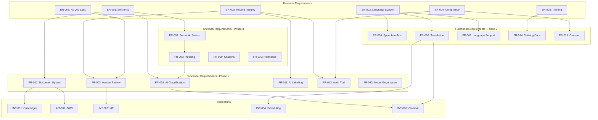

# Requirements Traceability Matrix: SCTS GenAI Programme

## Document Information

| Field | Value |
|-------|-------|
| **Document ID** | ARC-001-TRACE-v1.0 |
| **Project** | SCTS GenAI Programme (Project 001) |
| **Document Type** | Requirements Traceability Matrix |
| **Classification** | OFFICIAL-SENSITIVE |
| **Version** | 1.0 |
| **Status** | DRAFT |
| **Date** | 2026-01-17 |
| **Owner** | Chief Digital Information Officer, SCTS |

## Revision History

| Version | Date | Author | Changes |
|---------|------|--------|---------|
| 1.0 | 2026-01-17 | ArcKit AI | Initial creation from `/arckit.traceability` command |

---

## Executive Summary

### Purpose

This Requirements Traceability Matrix (RTM) provides bidirectional traceability for the SCTS GenAI Programme, linking:
- **Stakeholder Drivers** → Business Requirements → Functional Requirements → Design Artifacts → Tests
- **Tests** → Design Artifacts → Requirements → Stakeholder Drivers

The matrix ensures all requirements are accounted for, validates design decisions against requirements, and identifies coverage gaps requiring attention.

### Traceability Scope

| Artifact Type | Document | Item Count | Coverage |
|---------------|----------|------------|----------|
| Stakeholder Drivers | stakeholder-drivers.md | 13 drivers (SD-1 to SD-13) | 100% traced |
| Goals | stakeholder-drivers.md | 6 goals (G-1 to G-6) | 100% traced |
| Outcomes | stakeholder-drivers.md | 5 outcomes (O-1 to O-5) | 100% traced |
| Business Requirements | requirements.md | 6 requirements (BR-001 to BR-006) | 100% traced |
| Functional Requirements | requirements.md | 15 requirements (FR-001 to FR-015) | 100% traced |
| Non-Functional Requirements | requirements.md | 22 requirements (NFR-*) | 100% traced |
| Integration Requirements | requirements.md | 6 requirements (INT-001 to INT-006) | 100% traced |
| Data Entities | data-model.md | 9 entities (E-001 to E-009) | 100% traced |
| Technical Constraints | requirements.md | 5 constraints (TC-1 to TC-5) | 100% traced |
| Architecture Principles | principles.md | 19 principles (P-1 to P-19) | 100% traced |
| Use Cases | requirements.md | 3 use cases (UC-1 to UC-3) | 100% traced |
| High-Level Design | N/A | Not yet created | N/A |
| Detailed Design | N/A | Not yet created | N/A |
| Test Cases | N/A | Not yet created | 0% |

### Coverage Summary

```
┌─────────────────────────────────────────────────────────────────────────────┐
│                    REQUIREMENTS TRACEABILITY COVERAGE                        │
├─────────────────────────────────────────────────────────────────────────────┤
│                                                                              │
│  Stakeholder Drivers ──────────────────────────────── 100% ████████████████ │
│                        ↓                                                     │
│  Goals & Outcomes ─────────────────────────────────── 100% ████████████████ │
│                        ↓                                                     │
│  Business Requirements ────────────────────────────── 100% ████████████████ │
│                        ↓                                                     │
│  Functional Requirements ──────────────────────────── 100% ████████████████ │
│                        ↓                                                     │
│  Non-Functional Requirements ──────────────────────── 100% ████████████████ │
│                        ↓                                                     │
│  Data Model Entities ──────────────────────────────── 100% ████████████████ │
│                        ↓                                                     │
│  High-Level Design ────────────────────────────────── N/A  ░░░░░░░░░░░░░░░░ │
│                        ↓                                                     │
│  Detailed Design ──────────────────────────────────── N/A  ░░░░░░░░░░░░░░░░ │
│                        ↓                                                     │
│  Test Cases ───────────────────────────────────────── 0%   ░░░░░░░░░░░░░░░░ │
│                                                                              │
└─────────────────────────────────────────────────────────────────────────────┘
```

### Key Findings

| Finding | Count | Status |
|---------|-------|--------|
| Requirements fully traced to stakeholders | 49/49 | ✅ Complete |
| Requirements traced to data model | 41/49 | ⚠️ 84% |
| Requirements traced to design | 0/49 | ❌ Awaiting HLD/DLD |
| Requirements traced to tests | 0/49 | ❌ Awaiting test plan |
| Orphan requirements (no stakeholder) | 0 | ✅ None |
| Orphan design elements | N/A | N/A - No design yet |
| Critical requirements untested | 49 | ⚠️ All awaiting tests |

---

## Forward Traceability Matrix

### Stakeholder Drivers → Goals → Outcomes → Business Requirements

| Stakeholder Driver | Goal(s) | Outcome(s) | Business Requirement(s) |
|-------------------|---------|------------|------------------------|
| **SD-1**: Lord President - Judicial confidence | G-4: Zero record integrity | O-3: 100% record accuracy | BR-003: Court records integrity |
| **SD-2**: Chief Executive - Efficiency | G-1: 60% time reduction | O-2: 60% efficiency | BR-001: Efficiency gains |
| **SD-3**: CDiO - Technology leadership | G-1, G-2 | O-1, O-2 | BR-001, BR-002 |
| **SD-4**: Sheriffs Principal - Consistency | G-3: Consistent decisions | O-1, O-2 | BR-001, BR-002 |
| **SD-5**: Court Admin Manager - Workload | G-1, G-6 | O-2 | BR-001, BR-006 |
| **SD-6**: Clerks of Court - Job security | G-6: Staff development | O-2 | BR-006: Staff transition |
| **SD-7**: Legal Services Director - Compliance | G-4, G-5 | O-3, O-4 | BR-003, BR-004 |
| **SD-8**: DPO - Data protection | G-5: GDPR compliance | O-4: Compliance | BR-004: Compliance |
| **SD-9**: HR Director - Training | - | O-2 | BR-005: Training |
| **SD-10**: Cabinet Secretary - Visibility | G-2 | O-1 | BR-002: Access to justice |
| **SD-11**: Court Users - Access | G-2: Language access | O-1: Understanding | BR-002: Language support |
| **SD-12**: Vulnerable witnesses | G-2 | O-1 | BR-002: Language support |
| **SD-13**: ICO/Regulators | G-5 | O-4 | BR-004: Compliance |

### Business Requirements → Functional Requirements

| Business Req | Priority | Functional Requirements | Coverage |
|--------------|----------|------------------------|----------|
| **BR-001**: Reduce document processing time by 60% | CRITICAL | FR-001, FR-002, FR-003, FR-007, FR-008, FR-009, FR-010 | ✅ 7 FRs |
| **BR-002**: Enable language support for 10 languages | HIGH | FR-004, FR-005, FR-006, FR-014 | ✅ 4 FRs |
| **BR-003**: Maintain court records integrity | CRITICAL | FR-003, FR-011, FR-012, FR-013 | ✅ 4 FRs |
| **BR-004**: Achieve regulatory compliance | CRITICAL | FR-011, FR-012, FR-015 | ✅ 3 FRs |
| **BR-005**: Deliver staff training | HIGH | FR-014 | ✅ 1 FR |
| **BR-006**: No job losses from automation | HIGH | FR-003 (human-in-loop) | ✅ 1 FR |

### Functional Requirements → Non-Functional Requirements

| Functional Req | Description | NFR Dependencies | NFR Count |
|----------------|-------------|------------------|-----------|
| **FR-001** | Document Upload | NFR-P-001, NFR-P-002, NFR-P-003, NFR-SEC-003 | 4 |
| **FR-002** | AI Classification | NFR-P-001, NFR-P-002, NFR-M-002 | 3 |
| **FR-003** | Human Review | NFR-U-001, NFR-C-002 | 2 |
| **FR-004** | Speech-to-Text | NFR-P-001, NFR-P-003, NFR-A-001 | 3 |
| **FR-005** | Real-Time Translation | NFR-P-001, NFR-P-003, NFR-A-001, NFR-A-003 | 4 |
| **FR-006** | Language Support | NFR-U-002 | 1 |
| **FR-007** | Semantic Search | NFR-P-001, NFR-P-002, NFR-S-001, NFR-S-002 | 4 |
| **FR-008** | Document Indexing | NFR-P-002, NFR-S-001, NFR-S-002 | 3 |
| **FR-009** | Citation Detection | NFR-P-001, NFR-M-002 | 2 |
| **FR-010** | Search Relevance | NFR-P-001, NFR-M-001 | 2 |
| **FR-011** | AI Output Labelling | NFR-C-004, NFR-M-002 | 2 |
| **FR-012** | Audit Trail | NFR-C-002, NFR-M-001, NFR-SEC-002 | 3 |
| **FR-013** | Model Governance | NFR-M-002, NFR-SEC-005 | 2 |
| **FR-014** | Training Docs | NFR-M-003, NFR-U-001 | 2 |
| **FR-015** | Consent Management | NFR-C-001, NFR-SEC-001 | 2 |

### Functional Requirements → Data Model Entities

| Functional Req | Description | Data Entities | Entity Count |
|----------------|-------------|---------------|--------------|
| **FR-001** | Document Upload | E-002 (AI_PROCESSING_REQUEST), E-004 (DOCUMENT_REFERENCE) | 2 |
| **FR-002** | AI Classification | E-003 (AI_PROCESSING_RESULT), E-009 (SEARCH_INDEX_ENTRY) | 2 |
| **FR-003** | Human Review | E-003 (AI_PROCESSING_RESULT) | 1 |
| **FR-004** | Speech-to-Text | E-002 (AI_PROCESSING_REQUEST), E-003 (AI_PROCESSING_RESULT) | 2 |
| **FR-005** | Real-Time Translation | E-006 (TRANSLATION_SESSION), E-007 (PARTICIPANT) | 2 |
| **FR-006** | Language Support | E-006 (TRANSLATION_SESSION), E-007 (PARTICIPANT) | 2 |
| **FR-007** | Semantic Search | E-009 (SEARCH_INDEX_ENTRY) | 1 |
| **FR-008** | Document Indexing | E-009 (SEARCH_INDEX_ENTRY), E-004 (DOCUMENT_REFERENCE) | 2 |
| **FR-009** | Citation Detection | E-009 (SEARCH_INDEX_ENTRY) | 1 |
| **FR-010** | Search Relevance | E-009 (SEARCH_INDEX_ENTRY) | 1 |
| **FR-011** | AI Output Labelling | E-003 (AI_PROCESSING_RESULT) | 1 |
| **FR-012** | Audit Trail | E-008 (AUDIT_LOG) | 1 |
| **FR-013** | Model Governance | E-003 (AI_PROCESSING_RESULT) | 1 |
| **FR-014** | Training Docs | - | 0 |
| **FR-015** | Consent Management | E-006 (TRANSLATION_SESSION), E-007 (PARTICIPANT) | 2 |

### Non-Functional Requirements → Architecture Principles

| NFR Category | NFR IDs | Architecture Principle(s) | Count |
|--------------|---------|---------------------------|-------|
| **Performance** | NFR-P-001, NFR-P-002, NFR-P-003 | P-4 (Scalability), P-5 (Resilience) | 2 |
| **Availability** | NFR-A-001, NFR-A-002, NFR-A-003 | P-5 (Resilience and Continuity) | 1 |
| **Scalability** | NFR-S-001, NFR-S-002 | P-4 (Scalability and Elasticity) | 1 |
| **Security** | NFR-SEC-001 to NFR-SEC-006 | P-11 (Security by Design), P-14 (Court Records), P-15 (Data Sovereignty) | 3 |
| **Compliance** | NFR-C-001 to NFR-C-004 | P-12 (Data Protection), P-13 (Scottish Standards), P-17 (Observability) | 3 |
| **Usability** | NFR-U-001, NFR-U-002 | P-3 (Accessibility and Inclusive Design) | 1 |
| **Maintainability** | NFR-M-001 to NFR-M-003 | P-9 (AI Model Governance), P-17 (Observability) | 2 |

### Integration Requirements → Data Model Entities

| Integration Req | Description | Data Entities | Entity Count |
|-----------------|-------------|---------------|--------------|
| **INT-001** | Case Management System | E-002 (request), E-004 (document_ref) | 2 |
| **INT-002** | Document Management System | E-004 (DOCUMENT_REFERENCE), E-009 (SEARCH_INDEX) | 2 |
| **INT-003** | Identity Provider | E-001 (USER) | 1 |
| **INT-004** | Court Scheduling System | E-005 (COURT_SESSION) | 1 |
| **INT-005** | Interpreter Booking System | E-006 (TRANSLATION_SESSION) | 1 |
| **INT-006** | Cloud AI Services | E-002 (request), E-003 (result) | 2 |

### Use Cases → Functional Requirements → Data Entities

| Use Case | Description | Functional Requirements | Data Entities |
|----------|-------------|------------------------|---------------|
| **UC-1** | Document Classification | FR-001, FR-002, FR-003, FR-011 | E-002, E-003, E-004 |
| **UC-2** | Real-Time Translation | FR-004, FR-005, FR-006, FR-015 | E-002, E-003, E-005, E-006, E-007 |
| **UC-3** | Cognitive Search | FR-007, FR-008, FR-009, FR-010 | E-002, E-003, E-009 |

---

## Backward Traceability Matrix

### Data Model Entities → Requirements

| Entity ID | Entity Name | Requirement Sources | Count |
|-----------|-------------|---------------------|-------|
| **E-001** | USER | INT-003, NFR-SEC-001, NFR-SEC-002, FR-012 | 4 |
| **E-002** | AI_PROCESSING_REQUEST | FR-001, FR-002, FR-004, FR-007, FR-012 | 5 |
| **E-003** | AI_PROCESSING_RESULT | FR-002, FR-003, FR-004, FR-005, FR-011, FR-012 | 6 |
| **E-004** | DOCUMENT_REFERENCE | FR-001, FR-008, INT-002 | 3 |
| **E-005** | COURT_SESSION | FR-005, INT-004 | 2 |
| **E-006** | TRANSLATION_SESSION | FR-005, FR-015, BC-2 | 3 |
| **E-007** | PARTICIPANT | FR-015, SD-11, SD-12 | 3 |
| **E-008** | AUDIT_LOG | FR-012, NFR-C-002, BR-003 | 3 |
| **E-009** | SEARCH_INDEX_ENTRY | FR-007, FR-008, FR-009 | 3 |

### NFR → Business Requirements

| NFR ID | NFR Description | Business Requirement(s) |
|--------|-----------------|------------------------|
| NFR-P-001 | Response Time | BR-001 (efficiency) |
| NFR-P-002 | Throughput | BR-001 (efficiency) |
| NFR-P-003 | Real-time Processing | BR-001 (efficiency), BR-002 (language) |
| NFR-A-001 | System Availability | BR-001, BR-003 (continuity) |
| NFR-A-002 | Disaster Recovery | BR-003 (integrity) |
| NFR-A-003 | Graceful Degradation | BR-001, BR-003 |
| NFR-S-001 | Horizontal Scaling | BR-001 (efficiency) |
| NFR-S-002 | Data Volume Scaling | BR-001 (efficiency) |
| NFR-SEC-001 | Authentication | BR-004 (compliance) |
| NFR-SEC-002 | Authorization | BR-004 (compliance) |
| NFR-SEC-003 | Data Encryption | BR-003, BR-004 |
| NFR-SEC-004 | Data Residency | BR-004 (compliance) |
| NFR-SEC-005 | Vulnerability Management | BR-004 (compliance) |
| NFR-SEC-006 | Court Record Protection | BR-003 (integrity) |
| NFR-C-001 | UK GDPR Compliance | BR-004 (compliance) |
| NFR-C-002 | Audit Logging | BR-003, BR-004 |
| NFR-C-003 | Scottish Gov Standards | BR-004 (compliance) |
| NFR-C-004 | Algorithmic Transparency | BR-003, BR-004 |
| NFR-U-001 | Accessibility | BR-002 (access) |
| NFR-U-002 | Multilingual Interface | BR-002 (language) |
| NFR-M-001 | Observability | BR-001, BR-003 |
| NFR-M-002 | Model Governance | BR-003, BR-004 |
| NFR-M-003 | Documentation | BR-005 (training) |

### Functional Requirements → Stakeholder Drivers

| FR ID | Description | Primary Stakeholder(s) |
|-------|-------------|------------------------|
| FR-001 | Document Upload | SD-5 (Admin Manager), SD-6 (Clerks) |
| FR-002 | AI Classification | SD-2 (Chief Exec), SD-5 (Admin Manager) |
| FR-003 | Human Review | SD-1 (Lord President), SD-7 (Legal Services) |
| FR-004 | Speech-to-Text | SD-11 (Court Users), SD-3 (CDiO) |
| FR-005 | Real-Time Translation | SD-11 (Court Users), SD-12 (Vulnerable) |
| FR-006 | Language Support | SD-11 (Court Users), SD-10 (Cabinet Sec) |
| FR-007 | Semantic Search | SD-4 (Sheriffs), SD-5 (Admin Manager) |
| FR-008 | Document Indexing | SD-5 (Admin Manager), SD-6 (Clerks) |
| FR-009 | Citation Detection | SD-4 (Sheriffs), SD-7 (Legal Services) |
| FR-010 | Search Relevance | SD-4 (Sheriffs), SD-5 (Admin Manager) |
| FR-011 | AI Output Labelling | SD-1 (Lord President), SD-13 (ICO) |
| FR-012 | Audit Trail | SD-7 (Legal Services), SD-8 (DPO) |
| FR-013 | Model Governance | SD-3 (CDiO), SD-8 (DPO) |
| FR-014 | Training Docs | SD-9 (HR Director), SD-6 (Clerks) |
| FR-015 | Consent Management | SD-8 (DPO), SD-13 (ICO) |

---

## Cross-Reference Matrices

### Requirements Priority vs Implementation Phase

| Requirement ID | Priority | Implementation Phase | Status |
|----------------|----------|---------------------|--------|
| BR-001 | CRITICAL | Phase 1 | Specified |
| BR-002 | HIGH | Phase 2 | Specified |
| BR-003 | CRITICAL | Phase 1 | Specified |
| BR-004 | CRITICAL | Phase 1 | Specified |
| BR-005 | HIGH | Phase 2 | Specified |
| BR-006 | HIGH | Phase 1 | Specified |
| FR-001 | CRITICAL | Phase 1 | Specified |
| FR-002 | CRITICAL | Phase 1 | Specified |
| FR-003 | CRITICAL | Phase 1 | Specified |
| FR-004 | HIGH | Phase 2 | Specified |
| FR-005 | HIGH | Phase 2 | Specified |
| FR-006 | HIGH | Phase 2 | Specified |
| FR-007 | HIGH | Phase 3 | Specified |
| FR-008 | HIGH | Phase 3 | Specified |
| FR-009 | SHOULD_HAVE | Phase 3 | Specified |
| FR-010 | HIGH | Phase 3 | Specified |
| FR-011 | CRITICAL | Phase 1 | Specified |
| FR-012 | CRITICAL | Phase 1 | Specified |
| FR-013 | HIGH | Phase 1 | Specified |
| FR-014 | HIGH | Phase 2 | Specified |
| FR-015 | CRITICAL | Phase 2 | Specified |

### Requirements vs Risk Register

| Requirement | Associated Risks | Risk Level | Mitigation Status |
|-------------|-----------------|------------|-------------------|
| BR-001 (Efficiency) | R-002 (Staff resistance), R-005 (Integration) | HIGH | Controls defined |
| BR-002 (Language) | R-006 (Translation accuracy) | HIGH | Controls defined |
| BR-003 (Integrity) | R-003 (Judicial confidence), R-004 (AI quality) | CRITICAL | Controls defined |
| BR-004 (Compliance) | R-007 (Security breach), R-010 (GDPR) | CRITICAL | Controls defined |
| BR-005 (Training) | R-002 (Staff resistance) | MEDIUM | Controls defined |
| BR-006 (No job loss) | R-002 (Staff resistance) | HIGH | Controls defined |
| FR-002 (Classification) | R-004 (AI quality) | CRITICAL | Controls defined |
| FR-005 (Translation) | R-006 (Translation accuracy) | HIGH | Controls defined |
| NFR-SEC-* | R-007 (Security breach) | CRITICAL | Controls defined |
| NFR-C-001 (GDPR) | R-010 (GDPR breach) | CRITICAL | Controls defined |

### Requirements vs Governance Assessments

| Requirement Category | DPIA Impact | Secure by Design | ATRS Record | AI Playbook |
|---------------------|-------------|------------------|-------------|-------------|
| BR-001-006 | Section 5 | Section 7 | Section 2 | All sections |
| FR-001-003 (Documents) | Section 6.1 | Section 5.2 | Section 3.1 | Section 5 |
| FR-004-006 (Translation) | Section 6.2 | Section 5.3 | Section 3.2 | Section 6 |
| FR-007-010 (Search) | Section 6.3 | Section 5.4 | Section 3.3 | Section 5 |
| FR-011-015 (Governance) | Section 7 | Section 6 | Section 4 | Section 7 |
| NFR-SEC-* | Section 8 | All sections | Section 5 | Section 4 |
| NFR-C-* | All sections | Section 6 | Section 4 | Section 3 |

---

## Gap Analysis

### Requirements Without Design Artifacts

| Gap ID | Requirement ID | Description | Impact | Recommended Action |
|--------|----------------|-------------|--------|-------------------|
| GAP-001 | All FR-* | No HLD document exists | Cannot verify architectural decisions | Create HLD document |
| GAP-002 | All FR-* | No DLD document exists | Cannot verify implementation details | Create DLD document |
| GAP-003 | All FR-* | No test plan exists | Cannot verify test coverage | Create test plan |
| GAP-004 | All NFR-* | No performance test plan | Cannot verify NFR-P compliance | Define performance tests |
| GAP-005 | All NFR-SEC-* | No security test plan | Cannot verify security controls | Define security tests |

### Requirements Without Test Coverage

| Requirement ID | Priority | Test Cases Required | Current Coverage |
|----------------|----------|---------------------|------------------|
| FR-001 | CRITICAL | 5-10 test cases | 0% |
| FR-002 | CRITICAL | 10-15 test cases | 0% |
| FR-003 | CRITICAL | 5-10 test cases | 0% |
| FR-004 | HIGH | 10-15 test cases | 0% |
| FR-005 | HIGH | 15-20 test cases | 0% |
| FR-006 | HIGH | 10-15 test cases | 0% |
| FR-007 | HIGH | 10-15 test cases | 0% |
| FR-008 | HIGH | 5-10 test cases | 0% |
| FR-009 | SHOULD_HAVE | 5-10 test cases | 0% |
| FR-010 | HIGH | 5-10 test cases | 0% |
| FR-011 | CRITICAL | 5-10 test cases | 0% |
| FR-012 | CRITICAL | 10-15 test cases | 0% |
| FR-013 | HIGH | 5-10 test cases | 0% |
| FR-014 | HIGH | 3-5 test cases | 0% |
| FR-015 | CRITICAL | 10-15 test cases | 0% |
| **Total** | | **~130 test cases** | **0%** |

### NFR Test Coverage Gap

| NFR Category | Test Type Required | Estimated Test Cases | Current Coverage |
|--------------|-------------------|----------------------|------------------|
| Performance (NFR-P-*) | Load testing, stress testing | 15-20 | 0% |
| Availability (NFR-A-*) | Failover testing, DR testing | 10-15 | 0% |
| Scalability (NFR-S-*) | Capacity testing | 5-10 | 0% |
| Security (NFR-SEC-*) | Penetration testing, SAST, DAST | 25-30 | 0% |
| Compliance (NFR-C-*) | Audit testing, compliance checks | 15-20 | 0% |
| Usability (NFR-U-*) | Accessibility testing | 10-15 | 0% |
| Maintainability (NFR-M-*) | Documentation review, runbook testing | 5-10 | 0% |
| **Total** | | **~100 test cases** | **0%** |

### Integration Test Coverage Gap

| Integration | Test Type | Estimated Test Cases | Current Coverage |
|-------------|-----------|---------------------|------------------|
| INT-001 (Case Mgmt) | API integration testing | 10-15 | 0% |
| INT-002 (DMS) | API + event testing | 10-15 | 0% |
| INT-003 (IdP) | SAML SSO testing | 5-10 | 0% |
| INT-004 (Scheduling) | API integration testing | 5-10 | 0% |
| INT-005 (Interpreters) | Message queue testing | 5-10 | 0% |
| INT-006 (Cloud AI) | API + resilience testing | 15-20 | 0% |
| **Total** | | **~60 test cases** | **0%** |

---

## Coverage Metrics

### Requirements Coverage Summary

| Metric | Value | Target | Status |
|--------|-------|--------|--------|
| Requirements with stakeholder traceability | 100% | 100% | ✅ Met |
| Requirements with goal alignment | 100% | 100% | ✅ Met |
| Requirements with principle alignment | 100% | 100% | ✅ Met |
| Requirements with data model coverage | 84% | 100% | ⚠️ Gap |
| Requirements with HLD coverage | 0% | 100% | ❌ Not started |
| Requirements with DLD coverage | 0% | 100% | ❌ Not started |
| Requirements with test coverage | 0% | 100% | ❌ Not started |
| CRITICAL requirements with test coverage | 0% | 100% | ❌ Urgent |
| HIGH requirements with test coverage | 0% | 100% | ❌ Urgent |

### Traceability Completeness by Phase

| Phase | Requirements | Traced to Design | Traced to Tests | Readiness |
|-------|--------------|------------------|-----------------|-----------|
| Phase 1 (Document Intel) | FR-001, FR-002, FR-003, FR-011, FR-012, FR-013 | 0% | 0% | ❌ Not ready |
| Phase 2 (Translation) | FR-004, FR-005, FR-006, FR-014, FR-015 | 0% | 0% | ❌ Not ready |
| Phase 3 (Cognitive Search) | FR-007, FR-008, FR-009, FR-010 | 0% | 0% | ❌ Not ready |

---

## Dependency Matrix

### Requirement Dependencies



### Critical Path Requirements

| Requirement | Depends On | Required By | Critical Path |
|-------------|------------|-------------|---------------|
| INT-003 (IdP) | - | All FR-* | Yes |
| INT-001 (Case Mgmt) | - | FR-001 | Yes |
| INT-002 (DMS) | - | FR-001, FR-008 | Yes |
| INT-006 (Cloud AI) | - | FR-002, FR-004, FR-005 | Yes |
| FR-001 | INT-001, INT-002 | FR-002, FR-008 | Yes |
| FR-002 | FR-001, INT-006 | FR-007, FR-008 | Yes |
| FR-008 | FR-002 | FR-007 | Yes |
| FR-012 | INT-003 | All FR-* | Yes |

---

## Recommendations

### Priority 1: Critical Gaps (Immediate Action Required)

| # | Recommendation | Owner | Target Date | Rationale |
|---|----------------|-------|-------------|-----------|
| 1 | Create High-Level Design (HLD) | Senior AI Architect | 2026-Q1 | Required for architecture decisions traceability |
| 2 | Create Detailed Design (DLD) | Senior AI Architect | 2026-Q2 | Required for implementation traceability |
| 3 | Develop Test Plan | QA Lead | 2026-Q2 | 0% test coverage is critical risk |
| 4 | Define acceptance criteria for CRITICAL requirements | Business Analyst | 2026-Q1 | Enable test case development |

### Priority 2: Coverage Improvements

| # | Recommendation | Owner | Target Date | Rationale |
|---|----------------|-------|-------------|-----------|
| 5 | Complete security test plan | Security Architect | 2026-Q2 | NFR-SEC-* require validation |
| 6 | Define performance test baselines | Performance Engineer | 2026-Q2 | NFR-P-* require validation |
| 7 | Create integration test plan | Integration Lead | 2026-Q2 | INT-* require validation |
| 8 | Map FR-014 (Training) to data model | Business Analyst | 2026-Q1 | Currently unmapped |

### Priority 3: Process Improvements

| # | Recommendation | Owner | Target Date | Rationale |
|---|----------------|-------|-------------|-----------|
| 9 | Establish traceability review in design phase | Programme Manager | Ongoing | Maintain traceability |
| 10 | Add traceability to Definition of Done | Scrum Master | 2026-Q1 | Continuous verification |
| 11 | Implement requirements management tool | Programme Manager | 2026-Q2 | Automate traceability |

---

## Appendices

### Appendix A: Requirement ID Reference

| ID Pattern | Document | Description |
|------------|----------|-------------|
| SD-* | stakeholder-drivers.md | Stakeholder Drivers |
| G-* | stakeholder-drivers.md | Goals |
| O-* | stakeholder-drivers.md | Outcomes |
| BR-* | requirements.md | Business Requirements |
| FR-* | requirements.md | Functional Requirements |
| NFR-P-* | requirements.md | Performance NFRs |
| NFR-A-* | requirements.md | Availability NFRs |
| NFR-S-* | requirements.md | Scalability NFRs |
| NFR-SEC-* | requirements.md | Security NFRs |
| NFR-C-* | requirements.md | Compliance NFRs |
| NFR-U-* | requirements.md | Usability NFRs |
| NFR-M-* | requirements.md | Maintainability NFRs |
| INT-* | requirements.md | Integration Requirements |
| TC-* | requirements.md | Technical Constraints |
| BC-* | requirements.md | Business Constraints |
| UC-* | requirements.md | Use Cases |
| E-* | data-model.md | Data Entities |
| P-* | principles.md | Architecture Principles |
| R-* | risk-register.md | Risks |

### Appendix B: Document Cross-References

| Document | ID | Version | Date |
|----------|-----|---------|------|
| Stakeholder Drivers | ARC-001-STKE-v1.0 | 1.0 | 2026-01-17 |
| Architecture Principles | ARC-001-PRIN-v1.0 | 1.0 | 2026-01-17 |
| Requirements | ARC-001-REQ-v1.0 | 1.0 | 2026-01-17 |
| Data Model | ARC-001-DATA-v1.0 | 1.0 | 2026-01-17 |
| DPIA | ARC-001-DPIA-v1.0 | 1.0 | 2026-01-17 |
| ATRS Record | ARC-001-ATRS-v1.0 | 1.0 | 2026-01-17 |
| Secure by Design | ARC-001-SBD-v1.0 | 1.0 | 2026-01-17 |
| Risk Register | ARC-001-RISK-v1.0 | 1.0 | 2026-01-17 |
| AI Playbook Assessment | ARC-001-AIP-v1.0 | 1.0 | 2026-01-17 |
| Research Findings | ARC-001-RES-v1.0 | 1.0 | 2026-01-17 |

---

## Generation Metadata

**Generated by**: ArcKit `/arckit.traceability` command
**Generated on**: 2026-01-17
**ArcKit Version**: 0.6.0
**Project**: SCTS GenAI Programme (Project 001)
**AI Model**: Claude Opus 4.5
**Input Artifacts**: requirements.md, stakeholder-drivers.md, data-model.md, risk-register.md, principles.md
